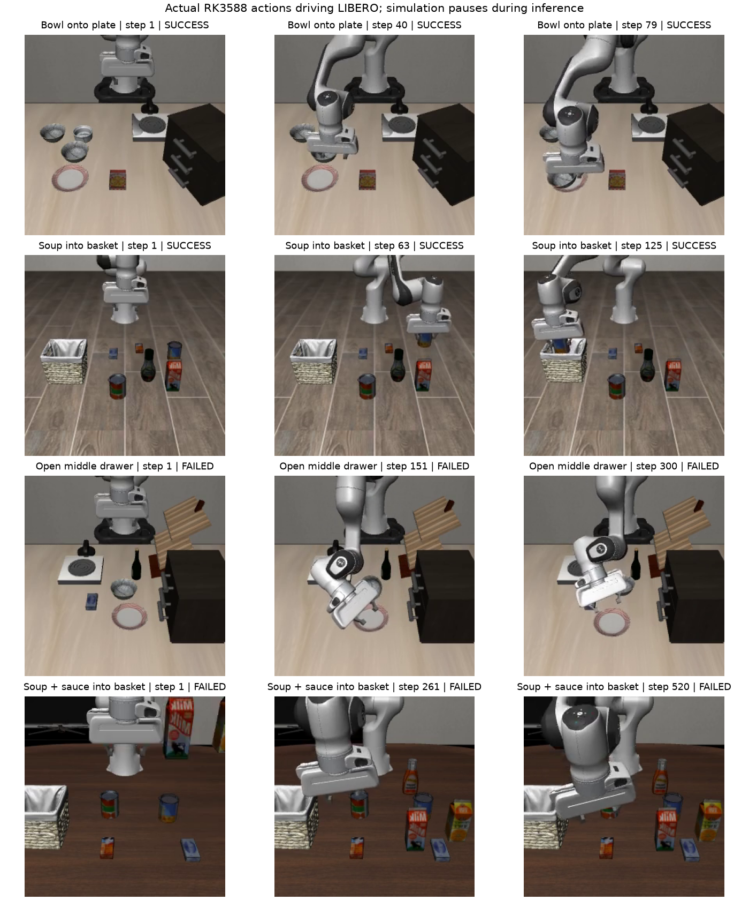

# 真实 RK3588 SmolVLA 的 LIBERO 闭环四任务筛查

## 完成范围

本机运行 LIBERO 物理仿真与原始GPU FP对照；RK3588常驻加载三个FP16 RKNN及CPU参数。每次新观测的两路原始uint8图像、任务文字、状态及固定配对噪声经SSH传到板端，图像/文字/状态预处理、全部网络和10次去噪均在板端执行；返回动作在仿真中实际执行，再根据新观测继续请求。**本轮已测任务闭环，非离线动作对照。** 视频是实际仿真轨迹，不是生成示意图。

仿真在等待板端回复时暂停；每个动作块的前50步连续执行，20Hz仿真控制频率。没有对8秒附近的推理等待加入物理运动，因此这是任务完成能力筛查，不能说满足真实20Hz控制。没有连接实体机械臂。

## 固定模型、环境与协议

- 原 checkpoint SHA256 `9a9f6413e42c0f332fccbce9a0dc796af2790f82cf002f791cdbf7e01e1afca8`；原始 GPU 权重与匹配processor，未训练或蒸馏。板端仍为前两页的FP16部署参照，不是HAQ/QAT/PTQ最终产物。
- 三个RKNN hash由板端启动验证，详见 `handshake.json`，与[完整网络回放](2026-10-01-full-board-fp16-replay.md)相同；CPU参数、词表、处理器和状态统计也验证hash。NPU_CORE_0、RKNN 2.3.2；本机隔离LeRobot环境、hf-libero 0.1.4、本地MuJoCo EGL仿真，使用已锁定本地assets及bddl/init_states。
- `libero_spatial/object/goal/10` 各task ID0，预先按编号选取，未根据本轮成功结果筛任务。各1个回合，init_state index0、env seed0；两者均hard reset、先10步no-op稳定场景。
- 使用原 `LiberoProcessorStep` 的环境适配：图像180度方向变换，末端位置＋四元数转轴角＋两维夹爪组成8维状态。该步骤用于把模拟器观测转成传感器输入；模型图像缩放、归一化、分词和状态归一化在板端。
- 两路256×256，任务原始字符串。每次动作块显式传入同一噪声序列：独立CUDA Torch Generator，seed=`100000×(suite_index+1)+task_id`，FP和板端各回合重新初始化；chunk50、执行50步、relative控制，无RTC。使用独立generator，故不直接复用历史默认RNG的32/40结果。
- FP和板端对应回合的初始图像/状态字节hash完全一致；所有对应query index的噪声hash相同。轨迹分叉后的观测会不同，不能把之后的动作差异都归因于转换。
- 调用LIBERO实际 `check_success()`，最大步骤分别280/280/300/520；成功或终止后停止。本轮是开发筛查，不作为正式统计通过阈值或非劣结论。

常驻服务接入前先发送此前固定raw输入，最终动作与已存板端原始输入回放逐元素相同，防止新接口换了数学计算。任务中总共22次真实完整板端推理，此外有1次固定输入核对。模型仅加载一次。

## 实际任务结果

| Suite / ID | 指令简述 | 原FP | 板端FP16 | FP / 板端步骤 |
|---|---|---|---|---:|
| spatial / 0 | 取盘子与ramekin之间的黑碗，放到盘子上 | 成功 | 成功 | 78 / 79 |
| object / 0 | 取 alphabet soup 罐，放入篮子 | 成功 | 成功 | 125 / 125 |
| goal / 0 | 打开柜子的中间抽屉 | 失败 | 失败 | 300 / 300 |
| libero_10 / 0 | alphabet soup 与 tomato sauce 两个物体放入篮子 | 失败 | 失败 | 520 / 520 |

**本轮原FP和板端各2/4，新增失败0、改善0。** 只有4个预选任务、各一个初始状态，不能据此声称整体效果完全相同或无精度损失。两项失败在原FP对照中也出现，本轮没有定位失败原因；不能凭视频将其归因于具体量化层。此前40任务32/40是不同噪声运行，不能直接用这里的2/4推断成功率下降。



上图每行展示板端轨迹的第一步、中间和最后一步，SUCCESS/FAILED为**整个回合**的结果，不是每帧的判断。[来源与视频hash](../../figures/smolvla_board_libero_v1.json)保存同目录。完整视频与原FP视频在 `runs/smolvla_board_libero_v1/{mode}_{suite}_0/rollout.mp4`。

## 同输入首动作与硬件反馈

同一回合的第一个动作块具有完全相同的输入与噪声，可直接核对；其后两个策略的观测已可能不同。

| Suite | 首动作块 MAE | 最大绝对差异 | 夹爪符号变化 |
|---|---:|---:|---:|
| spatial | 0.00276781 | 0.0200696 | 0/50 |
| object | 0.00257971 | 0.0157679 | 0/50 |
| goal | 0.00221576 | 0.0143510 | 0/50 |
| libero_10 | 0.00160883 | 0.00992562 | 0/50 |

22个实际板端动作块，含板端全部预处理/网络/后处理，排除SSH传输和模型加载：p50 **7444.589ms**，p95 **7630.842ms**。各请求也保存完整RPC时间用于检查传输开销。进程maxRSS最高1,887,076KiB（约1.80GiB）；runtime日志没有 `E RKNN`。没有采集板端频率、温度、功耗或全系统MemAvailable，不宣称新的稳定加速收益。

八个回合加握手的运行脚本计时约211.97秒；原FP/板端各回合墙钟时长均写入原报告。视频按20fps仿真时间编码，不展示等待板端推理的墙钟时间。

## 原始数据与复现

- [run_smolvla_board_libero.py](../../scripts/run_smolvla_board_libero.py)：配对噪声、仿真闭环、视频、初始hash核对及进度记录。
- [serve_smolvla_board_stdio.py](../../scripts/serve_smolvla_board_stdio.py)、[smolvla_board_runtime.py](../../scripts/smolvla_board_runtime.py)：SSH stdio常驻模型，35输入专家图，每次显式NCHW与新格式列表；模型仍全部板端执行。
- [summarize_smolvla_board_libero.py](../../scripts/summarize_smolvla_board_libero.py)：由已存动作和实际视频计算首块误差、硬件统计、截帧图；无示意数据。

`runs/smolvla_board_libero_v1/`（Git忽略）保留 `summary.json`、`analysis.json`、`progress.json`、`handshake.json`、`board_runtime.log`、`rollout.log`；每回合保存 `result.json`、每次原始请求NPZ、返回动作NPY、执行动作全集和MP4。`analysis.json`保存汇总/任务结果/视频的SHA256，`implementation_hashes.json`保存实现脚本和元数据的hash。代码首次对接直接单环境时缺少批维，原 `_quat2axisangle` 拒绝 `(4,)`；修正为标准 `(1,4)` 后通过，失败日志保留 `initial_batch_failure.log`，不是模型质量失败。

运行命令（需板子连接、本机GPU与EGL）：

```bash
env LIBERO_CONFIG_PATH=/home/loser/Study/QVLA/runs/libero_local/config \
  MUJOCO_GL=egl HF_HUB_OFFLINE=1 TRANSFORMERS_OFFLINE=1 OMP_NUM_THREADS=1 \
  .venv-haq-local/bin/python scripts/run_smolvla_board_libero.py
```

默认四个suite的ID0、seed0；可用 `--suites` / `--task-id` / `--output` 选择后续独立筛查。当前默认输出目录用于本次记录，重复执行应指定新output，避免覆盖原始证据。测试结束SSH服务已退出并释放模型。

## 对路线的影响

此前只能说完整网络单条回放能跑，现在已有真实板端模型驱动仿真完成两个任务的证据。当前精度仍是FP16参照；不能据此确定HAQ最终位宽。下一步可扩大固定开发任务/种子，验证转换误差是否产生任务回归，并补任意混合精度配置的板端执行与评价接口；正式HAQ搜索、至少40%压缩目标、QAT和独立PTQ仍待完成。
