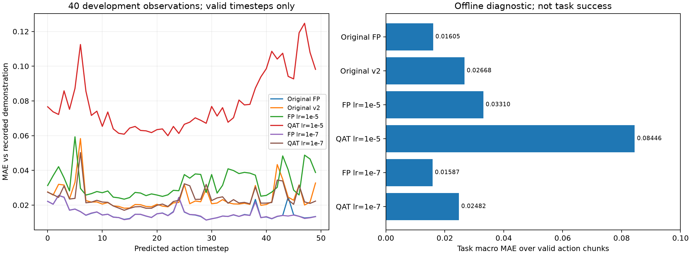
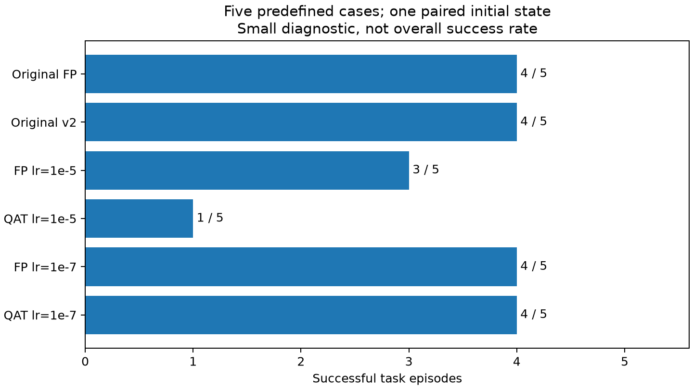

# 蒸馏/QAT 的完整动作与闭环质量检查协议

## 纠正评判依据

此前根据首步动作误差上涨而直接判断学习率不合适，证据不足。降低学习率的训练保留为对照，不能据首步MAE选最终训练参数，也不能据它称任务效果变差。原始FP与冻结v2继续保留；两种学习率均不自动晋升正式模型。

## 实际训练对照与评估范围

真实OFT LIBERO-10教师已生成10个训练帧的80步动作；FP蒸馏与v2 QAT各40步，lr1e-5/1e-7各一组，所有组seed29、相同数据采样、λ0.2、同一v2精度图。每轮10个教师任务计算GT+教师损失，其余30任务只计算GT。这是训练链路诊断，数据量与训练预算不构成收敛证据。

1. 首步指标仅用作异常诊断。
2. 对40个隔离开发观察，固定随机噪声，检查整个50步动作块。保存预测，并根据真实数据delta actions及 `action_is_pad` 计算有效步MAE、连续六维MAE、前8步/剩余42步误差、连续动作变化量差异、夹爪符号分歧和逐时间步曲线。对每个观察先取均值，再做任务宏平均；padding不计入误差。相对原FP的误差与相对记录动作的误差分别报告，两者都不能替代任务质量。
3. 小规模闭环：预先固定 `libero_spatial/0`、`libero_object/0`、`libero_goal/0`、`libero_10/0`、`libero_10/3` 五个任务，全部用官方初始状态index0、seed0。比较原FP、原v2、两个lr的蒸馏FP和QAT六个模型，**每模型5回合，共30回合**；没有扩成每模型40任务。

闭环复用LeRobot标准环境/processor/rollout，20Hz相对动作控制、256×256双相机、默认任务时长。两组teacher LIBERO-10任务加三组控制任务；不根据当前离线分数选择任务。记录实际reset初始状态数组SHA、初始双相机SHA和策略噪声seed，逐模型核验一致，不能把仅改变seed说成新的初始状态。关闭视频，sync单环境，任务顺序固定。

以闭环成功/失败为首要质量信号，配对检查谁新增成功、谁丢失成功；完整动作与夹爪/时序误差解释失败。这个小面板只能发现明显问题，不能证明最终总体成功率或做可靠最终参数选择。对硬件速度/内存仍需真实板端整策略，当前GPU推理不代表RK3588。

脚本：`score_distillation_full_chunks.py`（复用已存动作，不重跑推理）、`eval_distill_qat_libero.py`（真实严格重载）、`run_distill_qat_closed_loop_panel.py`（六模型配对与初始状态审计）。原始数据位于忽略目录runs。

## 状态

两种学习率真实训练、40观察离线动作、完整有效块均已完成；30回合小闭环已完成并通过初始状态/图像/噪声配对审计。两次评价的原始FP、原始v2及记录首动作数组逐元素完全一致。

## 完整有效动作块实测

每个观察先在有效步和维度取均值，再对40任务做宏平均。对于连续变化量，仅两端都有效的相邻步计入；夹爪用正负符号。公式 `MAE = mean_task(sum_valid |pred-GT| / (valid_steps × dims))`。图中逐步曲线按各位置的有效观察取均值，尾部样本数由原始JSON给出，不能当作40条完整轨迹。

| 模型 | 首步MAE对记录动作 | 有效完整块MAE | 连续6维MAE | 夹爪符号分歧 |
|---|---:|---:|---:|---:|
| 原始FP |0.02215409|0.01605211|0.01563022|0.5606%|
| 原始v2 |0.02759163|0.02668253|0.02307492|1.8125%|
| 蒸馏FP lr1e-5 |0.03126815|0.03310270|0.02872488|2.1795%|
| QAT lr1e-5 |0.07661390|0.08445627|0.05973580|5.7541%|
| 蒸馏FP lr1e-7 |0.02216507|0.01586620|0.01560298|0.5063%|
| QAT lr1e-7 |0.02742687|0.02482106|0.02263634|1.2541%|

低学习率蒸馏FP首步略高但完整块略低，是不能只看首步的直接反例。低学习率QAT相对原v2完整块也较低，但这些均是离线代理，尚不能宣布任务成功率提高或最终参数已选定。

图由 `scripts/plot_distillation_quality.py` 读取真实full_chunks.json生成，sources.json保存输入SHA。原始40观察预测、GT、padding mask与每位置有效样本数在服务器两个development目录及本地 `runs/distill_real_teacher_evidence_v1/development_lr1e5`、`development_lr1e7`，可重算。训练配置/哈希见[真实教师训练记录](2026-10-01-real-teacher-distill-qat.md)。

## 30回合闭环完成结果

总耗时1458.2711s（约24.3分钟，含六次加载），所有组在相同初始状态、初始双相机和策略噪声seed下比较，SHA审计通过。

| 模型 | 成功/5 | 相对原始FP新增成功/丢失成功 |
|---|---:|---:|
| 原始FP |4/5|0/0|
| 原始v2 |4/5|0/0|
| 蒸馏FP lr1e-5 |3/5|0/1|
| QAT lr1e-5 |1/5|0/3|
| 蒸馏FP lr1e-7 |4/5|0/0|
| QAT lr1e-7 |4/5|0/0|

原始FP/v2和低学习率两组成功任务一致，均只在libero_10/0失败；高学习率FP另在libero_10/3失败，QAT另丢失object/0、goal/0、long/3。低学习率短训练保留了本面板任务表现，没有新增成功，不能说蒸馏提升。高学习率退化结论现在同时有完整动作和实际任务证据，仅限这个小面板。

本地原始证据 `runs/distill_real_teacher_evidence_v1/closed_loop/{summary.json,progress.json,各模型/eval_info.json,各模型/reset_audit.json}`；服务器对应 `runs/distill_qat_closed_loop5_v1`。教师长任务范围需单独验证，详见[教师10任务筛查](2026-10-01-teacher-long-task-screen.md)。
