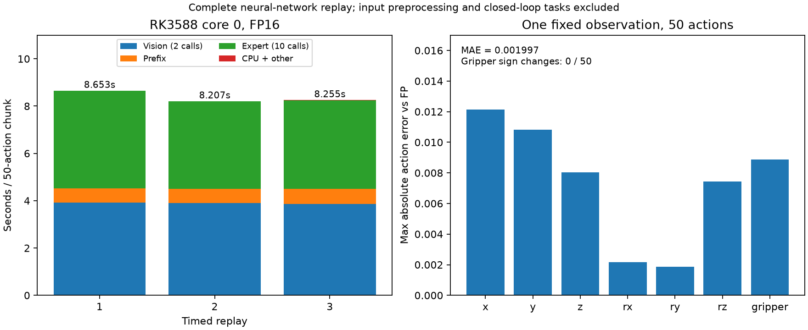

# SmolVLA：完整网络在 RK3588 的 FP16 固定观测回放

## 已完成的范围

2026-10-01 在真实 4 GB RK3588 上，将两路视觉、16 层语言前缀和 16 层动作专家串联，执行完整 10 次去噪，输出 `[1,50,7]` 动作。所有神经网络子图均在板端由 RKNN runtime 执行，CPU 在板端执行 embedding lookup、状态投影、前缀组装、时间编码、Euler 调度及动作反归一化。运行时无 GPU、服务器或 RKLLM 推理参与。

**输入是本机原始 processor 捕获的已预处理图像、token ID、有效位、标准化状态和固定初始噪声。** 原始图片读取/缩放、状态归一化、任务分词尚未迁移到板端，也不计入此次计时。这是完整网络及控制循环的固定输入回放，不是原始传感器到机械臂的应用部署，也不是 LIBERO 闭环评测。

当前是 FP16 部署参照，不是正式 HAQ 配置，不是 QAT/PTQ 最终产物。视觉仍有[40 条离线观测中两个夹爪符号变化](2026-10-01-vision-layout-and-action-diagnostic.md)，单条回放没有符号变化不推翻该结果。

## 版本、划分和精确配置

- 原始 checkpoint SHA256：`9a9f6413e42c0f332fccbce9a0dc796af2790f82cf002f791cdbf7e01e1afca8`，文件 906,712,520 B；主要存储 BF16，接口部分 FP32。
- 固定开发样本 episode 18 / task 0 / frame 0，动作 seed 2416662958；捕获前原 GPU FP 动作与锁定缓存逐元素相同。该样本不是独立闭环测试集。
- Toolkit2 / Lite2 / RKNN runtime 2.3.2；driver 0.9.8；三个子图全部 `float_dtype=float16`、`optimization_level=3`、`do_quantization=False`；NPU_CORE_0，未调频和并行化。
- 语言前缀 177 token、宽960；16 层 K/V 各 `[1,5,177,64]`。专家输入动作 `[1,50,32]`、时间编码 `[1,720]`、有效位及全部32个 K/V；输出同形速度。
- 10 步 Euler：$t_k=\mathrm{FP32}(1-0.1k)$，$x_{k+1}=x_k+\mathrm{FP32}(-0.1)v_k$。时间正弦在 NumPy float64 算后转 FP32，10 个时间向量已与原 CPU Torch 核对一致。
- 图像和每个 KV 显式 NCHW，每次调用新建 data_format 列表。CPU 词嵌入保留原 BF16 的数值，在 NumPy FP32 中查表、乘 sqrt(960) 后舍入回 BF16 再转 FP32 拼接。状态投影用原 FP32 权重。输出截取7维，按 checkpoint mean/std/eps 反归一化。

CPU 组装前缀与原始 GPU 最大差异 `5.9604645e-8`，反归一化最大差异 `1.4901161e-8`；差异来自 CPU/GPU 浮点计算，不宣称逐元素相同。动作专家使用已修正 INT64 ReduceMin 的 v2 图，原失败产物和因果证据见[专家记录](2026-10-01-expert-rknn-runtime.md)。

## 原始证据与复现

本机结果目录 `runs/smolvla_full_board_v1/`（Git 忽略）：

| 文件/子图 | SHA256 |
|---|---|
| 视觉 RKNN | `f486c5de7f0bc085e9bb1157db761003b9d81d8c2e1e83cd11fb53942b209434` |
| 前缀 RKNN | `9812496c93b2125b7a3c72c5b69ec3c63ef6ccfeb9090f137e46c4004e80706c` |
| 专家 v2 RKNN | `c85c63773b2fea2b2fa17a82ecb1538c68f50a0e6f8fe032cccfb5ad074c31eb` |
| replay_inputs.npz | `62ee6635d9cca02f74e6aff59b733d575299e5d62eccb2d5d01ff2c13c7fb427` |
| cpu_weights.npz | `101f93d16e187ad686e9fc4407f006c0c3df6dd8e8f7aa6711f3753149d2fe8a` |
| fp_reference.npz | `f1d005dede98351634474ef9c374b5bc1c69b11409d07a946704b8681220448e` |
| replay.json | `fcb945f2ce8ecb64cad4d7802e0ba4efe1e5d731c87021d32ce70556fa258e7e` |
| full_board_report.npz | `f75f35f72172d7ca9166bf2948455d2db73a0f946d3a018c5abdd02eccbb2222` |

`full_board_report.json` 包含精确每步计时、文件 hash、动作误差和进程 maxRSS；`full_board_report.npz` 保存最后一次最终动作、32维内部动作、视觉特征、前缀和10步速度。`full_board_console.log` 保存 runtime 版本和实际调用日志，本次没有 `E RKNN`。前三次输出没有分别归档，故不据此宣称逐次完全一致。配置、图和输入在报告中锁定，运行前也核对回放输入/参数/参考的 hash。

本机捕获：[prepare_smolvla_board_replay.py](../../scripts/prepare_smolvla_board_replay.py)；CPU 原理实现：[smolvla_numpy_glue.py](../../scripts/smolvla_numpy_glue.py)；板端执行：[rknn_board_full_replay.py](../../scripts/rknn_board_full_replay.py)。板端执行目录 `/root/qvla_board_test/smolvla_vision_v1/`：

```bash
cd /root/qvla_board_test/smolvla_vision_v1
env OPENBLAS_NUM_THREADS=1 PYTHONPATH=/root/qvla_board_test/python_site \
  python3 rknn_board_full_replay.py \
  --vision vision_connector_fp16.rknn \
  --prefix prefix_with_kv_fp16.rknn \
  --expert expert_step_v2_fp16.rknn \
  --inputs replay_inputs.npz --weights cpu_weights.npz \
  --reference fp_reference.npz --config replay.json \
  --output full_board_report.json --warmup 1 --repeats 3
```

## 实际结果



绘图脚本 [plot_smolvla_full_board.py](../../scripts/plot_smolvla_full_board.py)，[SVG](../../figures/smolvla_full_board_fp16_v1.svg) 和[数据来源/hash](../../figures/smolvla_full_board_fp16_v1.json)一同保存；柱形来自实际三次报告，不是查表预测。

一次预热，三次计时；三个子图同时驻留。计时包含 CPU glue 和 Lite2 输入/输出传递，排除模型加载、文件读取和主机预处理。

| 指标 | 实测 |
|---|---:|
| 模型加载/初始化 | 1.3148 s |
| 三次完整动作块计时 | 8652.760 / 8207.250 / 8254.834 ms |
| p50 / p95 | 8254.834 / 8612.967 ms |
| 最后一次动作相对原始 FP MAE / RMSE | 0.00199696 / 0.00304926 |
| 最终动作最大绝对差异 | 0.0121310 |
| 该条动作块夹爪符号变化 | 0 / 50 |
| 进程 maxRSS | 1,867,352 KiB，约1.78 GiB |
| 三个 RKNN 文件合计 | 756,201,091 B |
| CPU 参数 NPZ | 189,363,274 B |
| 本次闭环成功率 | 未测量 |

三次计时的分段均值：两路视觉约3895ms，前缀约614ms，10步专家约3851ms，其余 CPU 组装/时间编码/Euler/后处理约12ms（精确值与绘图从原报告计算）。总延迟以实际包围完整循环的时钟为准，不用子图均值代替。

CPU 参数文件使用 FP32 承载原 BF16 embedding 数值，便于 NumPy 查表，尚未压缩存储。这一基线包两部分合计 **945,564,365 B，比源 checkpoint 大约4.3%**；没有达到40%压缩目标，也不宣称这次完成真实整数量化。文件合计排除重复诊断产物和必要配置的小文件；正式产物体积需统一完整推理包口径。

## 结论边界与下一步

后续[原始输入预处理板端移植](2026-10-01-board-raw-preprocessing.md)已完成图像处理、分词和状态归一化：40条预处理核对通过，单条原始输入已全流程运行。本文的8.255s仍保留为较早的预处理输入回放结果，不与后续含预处理的8.029s混为同一次实验。

已证明在当前4GB板上，SmolVLA 的完整网络及10步循环可以用 **三个 RKNN 子图＋CPU glue** 执行，不必先依赖未确认的 RKLLM 逐层 KV 输出接口。此次只测一个开发观测，未验证正式质量门槛。

maxRSS 是 Linux 进程统计，不是全系统或 NPU 的专用内存占用；没有采样最低 MemAvailable、温度、频率和功耗。三个计时只是诊断，不能作稳定延迟尾部分布结论。先补板端原始输入处理和多观测质量验证，再依据实际图修订 HAQ 候选与成本表。正式 HAQ 的全配置执行/评价接口仍待接入；QAT 和独立 PTQ 最终比较仍待完成。
