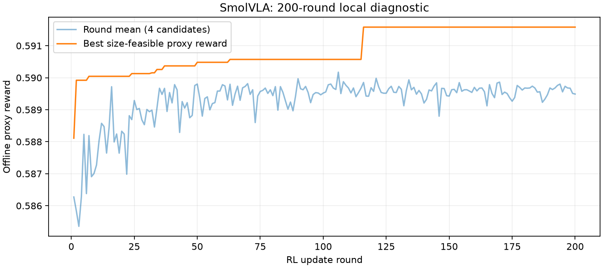

# SmolVLA 200轮快速RL探索

## 配置、评价范围与运行状态

用户已授权先进行快速探索。本轮从初始控制器开始，200轮×每轮4候选，共800次真实本地完整动作评价，未使用模拟奖励。固定seed29，hidden size16，Adam学习率0.001，梯度裁剪5，熵权重0。沿用30轮试验的有限INT8 logit +5，以便比较延长训练的表现；这是满足体积预算的存储先验，其他选项仍可采样，不按人工敏感度锁定层。该先验可能导致非INT8探索较少，本轮不保证覆盖整个笛卡尔积或找到全局最优。

固定源checkpoint、processor、数据划分及随机噪声与此前快速试验一致，实际hash在本轮`summary.json`的identity与cache_manifest_sha256中。40个独立校准episode用于激活范围，搜索反馈只用开发任务索引`0,5,10,15,20,25,30,35`的8条观测；其余32条开发观测只做最终优胜配置的留出检查。冻结测试集未使用。

每个候选从FP模块重建，生成真实压缩权重文件、严格重载并评价完整50×7动作。仅保留当前最优文件，其他候选保留配置、动作、文件字节数/hash与评分。速度使用100基础＋18补充的独立签名成本查表；新增整流程成本行不重复计入。表格快照随本轮保存，避免后续更新成本表使本轮不可复算。

奖励沿用`G=sqrt(exp(-E/s)*T_ref/T_lookup)`，体积不超过原文件60%时`G/(1+G)`，超预算时`-d/(1+d)`。RKNN整图转换状态为`not_attempted`，允许本地代理评分但`deployable=False`；转换失败−1的规则本轮不会触发，因为没有转换反馈。严格重载本地产物不等于转换成RKNN。见[可行性奖励记录](2026-10-01-haq-feasibility-reward.md)。

执行脚本`scripts/run_haq_200_trial.py`在搜索后自动做：逐候选/控制器更新审计、32条留出动作、12个开发任务的本地配对闭环（四suite各ID0/3/6），最后汇总和画实际奖励曲线。闭环对照复用相同任务/seed/环境的`runs/haq_libero_panel_v1` FP记录。这个面板已经在历史筛查中使用，不能当全新未见测试集。

运行目录：`runs/haq_rl_trial_200x4_rl/`；后台日志：`runs/haq_rl_trial_200x4.log`；流水线状态：`runs/haq_rl_trial_200x4_status.json`。200轮完成即停止，不自动延长。出错记录阶段/返回码并停止；不把环境错误罚到模型策略上。当前结果以progress/status为准，未产生完成结果时不宣称搜索有效。

```bash
tail -f runs/haq_rl_trial_200x4.log
cat runs/haq_rl_trial_200x4_rl/progress.json
cat runs/haq_rl_trial_200x4_status.json
```

本轮为本地代理探索，`formal_search_ready=false`；未转换任意RKNN混合整图，也未验证部署包40%压缩或真实板端加速。最终精度尚未选定。

## 已完成的实际结果

200轮、800候选完成，800/800满足本地权重文件40%压缩；逐候选评分及200次控制器更新审计通过。搜索耗时2640.18s。

| 指标 | 实测结果 |
| --- | ---: |
| 前80候选平均代理奖励 | 0.5875407053803121 |
| 后80候选平均代理奖励 | 0.5896049425890688 |
| 最优代理奖励 | 0.5915808920765019 |
| 最优文件B | 504117472 |
| 最优搜索动作MAE | 0.011438137887338858 |
| 最优32条留出动作MAE | 0.015192238469392447 |
| 最优查表成本代理ms | 7180.365983492038 |
| 控制器参数变化L2 | 0.5554304129203503 |

12任务配对开发闭环：FP 7/12，候选 9/12；新增成功3，新增失败1。不是最终测试或RK3588任务质量。

最优格式分布：`{"w8a8": 300, "float16": 1, "bfloat16": 1, "cpu_int8_row_lookup": 1, "w16a16i_dfp": 1}`。



单种子且没有同预算随机对照；更多轮数不自动证明RL优于随机搜索或提升任务质量。RKNN混合精度整图未转换，转换处罚未触发；部署文件40%目标仍未验证。完整原始报告、哈希、配置和动作在`runs/haq_rl_trial_200x4_rl/`，闭环记录在相邻`_panel/`目录。
