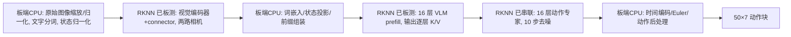

# SmolVLA 部署拆分：真实接口与后端状态

## 目的与证据

先测原始 FP 模型的实际张量边界，再决定 RK3588 的 RKNN、RKLLM 和 CPU 分工。后续已完成三个RKNN子图＋CPU的完整网络回放，以及板端原始图像、任务文字和状态预处理；闭环量化质量仍未完成。

模型 `lerobot/smolvla_libero` 的 `model.safetensors` SHA256 为 `9a9f6413e42c0f332fccbce9a0dc796af2790f82cf002f791cdbf7e01e1afca8`；使用 checkpoint 匹配的 processor。固定动作样本为 episode 18、task 0、frame 0，动作种子 `2416662958`；FP 缓存 manifest SHA256 为 `058ba94ee81c19785edffb0bc3724d8916f3e8867e8abfa846b84c8a2ae69c87`。运行 [`scripts/probe_smolvla_split_contract.py`](../../scripts/probe_smolvla_split_contract.py) 得到原始 `runs/smolvla_split_contract_v1.json` 和 `.npz`（Git 忽略）；拆分探针的动作与缓存 FP 动作逐元素相同。此实验没有校准集或位宽扫描。

## 执行顺序及分工

| 模块 | FP 实测接口，batch 1 | 次数 | 后端状态 |
| --- | --- | ---: | --- |
| 两路视觉编码器 | 每路 `[1,3,512,512]` FP32 → `[1,1024,768]` FP32 | 各 1 | 与 connector 合并 RKNN；布局问题已修正；40条离线动作仍有两个夹爪符号变化，质量未通过 |
| connector | 每路 `[1,1024,768]` → `[1,64,960]` FP32 | 各 1 | 同上 |
| 前缀组装及 VLM prefill | 前缀序列长度177、宽960；原始前缀输出 BF16；生成16层K/V，每层K、V各 `[1,5,177,64]` BF16 | 1 | 后续[RKNN 前缀](2026-10-01-prefix-rknn-kv.md)已实测33输出并接回GPU专家；RKLLM逐层输出接口未确认 |
| 动作专家 | 每步读取逐层前缀 K/V；内部隐藏 `[1,50,720]`；图输出速度 `[1,50,32]` | 10 | RKNN FP16 v2已实测和串联；action_in/time_MLP/action_out投影包含在图内 |
| 积分和输出 | 最终 `[1,50,7]` FP32 | 1 动作块 | 板端CPU 10步Euler和反归一化已串联；单条动作MAE 0.001997，闭环未测 |

配置为 VLM 16 层、专家 16 层、`cross_attn`、每 2 层一个专家自注意力层、10 步 flow denoising、动作块长 50。原始前缀 K/V 在 BF16 下共 `16 × 2 × 1 × 5 × 177 × 64 × 2 = 3,624,960` 字节。每次去噪读取它；专家自注意力产生的后缀缓存随后裁回前缀长度。当前RKNN显式输出经Lite2以FP32数组传递；专家每次新建内部缓存，仅输出速度。CPU负责图间张量和循环；状态投影在CPU，动作与时间MLP投影在专家图。当前分工是部署参照，不用于锁定HAQ精度位点。

## RKLLM 边界

后续[RKLLM 1.3.1 可行性验证](2026-10-01-rkllm-prefix-feasibility.md)已核对真实板端符号、官方手册与 custom 配置，未找到逐层 K/V 输出和等价二维前缀 mask/位置输入。原始 checkpoint 单开发观测 causal mask 消融的动作 MAE 为 0.009158；这是 PyTorch 语义诊断，不是 RKLLM 推理。暂保留已接通的 RKNN 前缀，未来接口满足合同后可重新验证。

[Rockchip 多模态示例](https://github.com/airockchip/rknn-llm/blob/main/examples/multimodal_model_demo/README.md)使用视觉 RKNN、语言 RKLLM。但 SmolVLA 的动作专家还需读取 16 层各自的 K/V；目前公开 [RKLLM C API](https://github.com/airockchip/rknn-llm/blob/main/rkllm-runtime/Linux/librkllm_api/include/rkllm.h)可见 last hidden/logits 和缓存控制，未见逐层 K/V 导出入口。因此语言前缀**暂不能确定**交给 RKLLM。需要以实际 1.3.1 API 验证；若拿不到 K/V，就尝试用 RKNN 前缀子图显式输出。RKLLM runtime 已安装只证明动态库可加载。

## 已测子图及限制

视觉+connector 固定输入 ONNX 为 393,042,486 字节，SHA256 `99feded2e64d31791c7469ce2d915bb4e7ee445d974d49f8d1a726bea4337875`；导出包装与 FP 边界的 MAE 为 `7.8453e-6`、最大绝对误差为 `1.4877e-4`，报告在 `runs/smolvla_vision_split_v1/vision_connector.json`。RKNN FP16 文件为 212,621,173 字节，SHA256 `f486c5de7f0bc085e9bb1157db761003b9d81d8c2e1e83cd11fb53942b209434`。板端 RKNN runtime 2.3.2 能运行，两次调用为 1922.639/1927.328 ms；同一 FP 边界的输出 MAE `5.945478`、RMSE `7.981631`，数值**未通过**。见[板端复测记录](2026-10-01-rk3588-runtime-upgrade.md)和 `runs/smolvla_vision_split_v1/board_report_default_232.json`。

后续[布局纠正与动作诊断](2026-10-01-vision-layout-and-action-diagnostic.md)已确认原来大部分视觉偏差来自 NCHW/NHWC 输入错误；修正后单相机 MAE 0.156710，真实双相机输出接回原始 GPU 策略的单样本动作 MAE 0.001752。尚不能据此认定任务质量通过。

后续[前缀 RKNN](2026-10-01-prefix-rknn-kv.md)已实测显式输出16层 K/V，约600ms；[完整专家图](2026-10-01-expert-rknn-runtime.md)已修正INT64 ReduceMin失败并通过板端输出核对。[完整网络板端回放](2026-10-01-full-board-fp16-replay.md)串联两路视觉、前缀、10步专家及CPU glue。再加入[板端原始输入处理](2026-10-01-board-raw-preprocessing.md)，core0三次p50 8.029s、进程maxRSS约1.805GiB、动作MAE 0.002013；计时包含图像处理、分词、状态归一化及图间传递，排除文件读取与模型加载。预处理已对照40条开发观测，完整网络仍只测一条原始输入，闭环未测。下一步补多观测质量，按实际执行图重建HAQ候选和成本表；旧单节点查表不能当作整策略收益。
