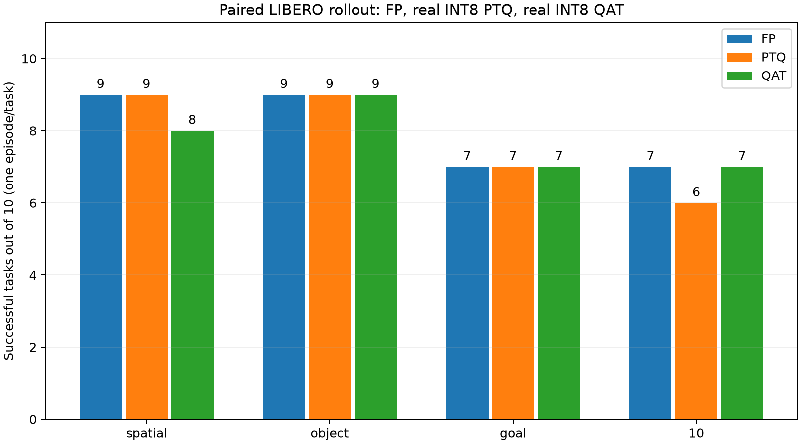
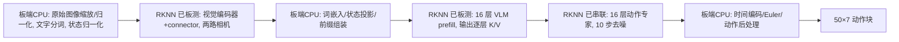
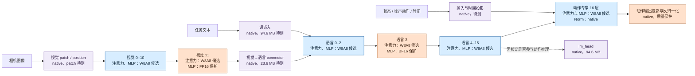

# QVLA 项目路线与交付记录

更新：2026-10-03。本文件是项目完整路线的主阅读入口，按实际决策和结果叙述；精确配置、公式、扫描数据来源与失败细节已收录在本文末尾的历史技术记录。跨模型结果统一见[results.md](results.md)，安装运行见[deployment.md](deployment.md)。

## 1. 目标与评价原则

以SmolVLA量化为主目标，结合量化学习笔记、HAQ思想和RK3588真实后端。经历FP基线、硬件探测、混合精度搜索、教师蒸馏、QAT/PTQ对照、后端转换与完整板端评价。

质量优先；搜索要求候选文件相对原checkpoint压缩至少40%，结合动作质量和板测成本评价。MSE/MAE用于快速筛选，不能代替LIBERO闭环成功率。最终部署经过用户同意改回原始FP16视觉，实际压缩35.15%，未达到早期40%目标。未测指标不以估算冒充。

校准/开发/测试按episode分离；动作比较固定噪声、种子与处理器。早期不同协议成绩不混用。量化训练的fake quant与真正整数产物/板端执行分别验证。

## 2. 基线与数据准备

使用`lerobot/smolvla_libero`及`lerobot/libero`；模型、processor和修订号锁定。准备数据划分、校准输入、离线动作缓存和LIBERO仿真环境。原checkpoint文件906,712,520字节。

入口：`download_and_upload.py`、`split_libero.py`、`fp_baseline.py`、`haq_offline_eval.py`。学习基础见[info.md](../info.md)，后续技术路线见[量化技术计划](project-route.md#record-quantization-technique-plan)。

## 3. 硬件格式探测与成本表

对RK3588进行编译、板端加载与数值检查，按后端/shape/接口判断候选可行性；不只依据SDK声明。建立100个基础签名的三轮板测及18项补充测试，包含相关边界与子图开销。

这些是成本查表数据，不是每种完整策略的实测延迟。语言切换RKLLM后，原RKNN查表成本不能直接当作新的RKLLM开销。

详细格式、签名和数据见[硬件表](project-route.md#record-hardware-README)。

## 4. HAQ风格强化学习搜索

枚举304个可调算子位点；按后端可行性掩码选择精度，不用此前人工敏感度结论锁定节点。实现自回归REINFORCE控制器、熵探索、平台早停及等预算随机对照；奖励来自真实离线动作评价、候选体积和板测查表。保存候选反馈并审计更新。

这不是原HAQ论文DDPG的逐项复现，亦未完成每候选整策略板测反馈。200轮×4候选等实验用于实际搜索与对照，不保证遍历组合空间或全局最优。

- V1：504,117,472字节，相对原checkpoint缩小44.40%。
- V2：513,906,600字节，相对原checkpoint缩小43.32%。

记录：[200轮](project-route.md#record-experiments-2026-10-01-haq-200-round-trial)、[探索调整](project-route.md#record-experiments-2026-10-01-haq-adjusted-exploration)、[至少200轮实验](project-route.md#record-experiments-2026-10-01-haq-exploration-min200)。

## 5. 教师蒸馏与可训练范围

使用OpenVLA-OFT真实教师推理，生成离线动作标签并审核有效时间步；训练使用GT及教师flow监督。同一噪声/时间用于相应损失比较。通过失败任务模块恢复与冻结范围实验排查回归。

最终学生选择只更新前8层专家线性模块的蒸馏结果，视觉、语言、后8层专家及动作接口冻结。GT/KD学生长任务均7/10，与原模型该协议下7/10持平；不能据此宣称蒸馏总体提高成功率。

记录：[回归诊断](project-route.md#record-experiments-2026-10-02-distillation-regression-diagnosis)、[前8层训练](project-route.md#record-experiments-2026-10-02-expert-first8-distillation)、[专家及接口对照](project-route.md#record-experiments-2026-10-02-expert-interface-distillation)。

## 6. QAT与独立PTQ

在蒸馏FP学生上按V1/V2配置做QAT，比较有/无教师损失。量化图覆盖all_sites，并非仅前8层量化；蒸馏可训练范围与QAT范围分开。QAT使用浮点master、STE与代理梯度，训练后校准、打包并严格重载整数产物。

所选V1无教师损失QAT：1000步，学习率1e-7衰减至1e-8，warmup/cosine，梯度累积2。无教师是QAT阶段教师损失关闭，学生本身仍经过蒸馏。另从独立FP checkpoint执行PTQ对照，不对已转换低比特权重重复PTQ。

四候选19任务筛选：V1有教师12、V1无教师14、V2有教师14、V2无教师10；按该筛选选择V1无教师，并非此后所有板端转换都保持相同质量。

记录：[四路QAT比较](project-route.md#record-experiments-2026-10-02-qat-four-way)、[持续评测总表](results.md#historical-results)。

## 7. 真实RK3588部署与问题修复

先完成全RKNN分图与CPU胶水，再将语言适配RKLLM。包括两路图像、token embedding、state归一化、多模态prefix、语言K/V、10步Euler专家计算及动作后处理。

关键排查包括BOOL子图边界、BF16 native I/O、prefix注意力mask、KV缓存读取、长度对齐和工作池缓存一致性。当前RKLLM补丁绑定1.3.1及已核验二进制hash/偏移，不能宣称通用SDK支持或上游已接受。工作池映射修复通过A→B→A重复输入验证。

终版：原始checkpoint FP16视觉/connector（RKNN）＋V1 QAT W8A8语言（RKLLM）＋混合精度专家（RKNN）＋CPU INT8 embedding与胶水。视觉回退及语言统一W8A8意味着它不是原V1 HAQ图的严格等价转换。

记录：[缓存一致性](project-route.md#record-experiments-2026-10-03-rkllm-working-pool-coherency)、[后端适配](project-route.md#record-experiments-2026-10-03-v1-rknn-rkllm-adaptation)、[原始FP16视觉](project-route.md#record-experiments-2026-10-03-original-fp16-vision-rkllm-v1)。

## 8. 全面评测与交付

完成40任务配对闭环、同板速度/内存测试、进程树采样修正及失败任务冷启动复测。结果、对比表和结论边界统一见[结果文档](results.md)，不把历史协议成绩代入终版结果。

## 9. 整理后的源码与模型

- `qvla/`：data、hardware、haq、distillation、quantization、conversion、runtime、evaluation八类实现；诊断与绘图归入所属功能。
- `scripts/`：数据、硬件表、搜索、蒸馏、量化、转换、部署、评测和自检入口。
- `config/`：原配置、候选位宽图、训练范围和硬件表；保留配置与历史hash，不把旧候选标成终版后端等价图。
- `models/final/`：从板端终版按清单收集的真实文件，包含RKNN、RKLLM、CPU参数和processor；使用Git LFS追踪大权重，其他模型不提交。
- `docs/`：本文、结果、部署说明和images；无archive、tools、results文件夹，也无单独tests目录。

本次整理前先保存本地Git提交`22fac9d`。原脚本迁入功能包、同步导入/路径，五个训练契约测试迁入evaluation；主命令提供统一导航。并未重写量化公式或修改模型权重。迁移后的304位点/1517候选搜索空间生成通过，12项训练契约自检通过；新包与旧平铺runtime同输入板端输出逐元素一致（最大差0）。正式搜索的整策略反馈限制仍保留。历史源代码hash对应当时版本，不能用当前整理后的源码冒充原始冻结代码。

原始/教师/候选/训练master仍在Git忽略的artifacts或runs目录，未迁入提交模型目录。所选QAT master记录在服务器`/root/qvla/runs/qat_distilled_v1_no_teacher_v1/qat_float_master.safetensors`；只有models/final是本次提交范围。

<a id="technical-records"></a>

## 10. 技术记录索引

以下记录保留当时有效/失败实验的原理、配置、原始数据路径和结论。记录中的“下一步”“未完成”和SDK状态是当时状态，当前交付以本文主路线与results.md为准；时间顺序不等于最终模型都采用该方法。

- [download-transfer.md](#record-download-transfer)
- [evaluation-protocol.md](#record-evaluation-protocol)
- [expanded-distillation-usage.md](#record-expanded-distillation-usage)
- [experiment-plan.md](#record-experiment-plan)
- [experiments/2026-09-26-fp-baselines.md](#record-experiments-2026-09-26-fp-baselines)
- [experiments/2026-09-26-rknn-mlp.md](#record-experiments-2026-09-26-rknn-mlp)
- [experiments/2026-09-26-w8-pilot.md](#record-experiments-2026-09-26-w8-pilot)
- [experiments/2026-09-27-action-clipping-validation.md](#record-experiments-2026-09-27-action-clipping-validation)
- [experiments/2026-09-27-action-layer-selection.md](#record-experiments-2026-09-27-action-layer-selection)
- [experiments/2026-09-27-action-sensitivity.md](#record-experiments-2026-09-27-action-sensitivity)
- [experiments/2026-09-27-all-expert-attention-rknn.md](#record-experiments-2026-09-27-all-expert-attention-rknn)
- [experiments/2026-09-27-all-expert-mlp-rknn.md](#record-experiments-2026-09-27-all-expert-mlp-rknn)
- [experiments/2026-09-27-expert-attention-hybrid.md](#record-experiments-2026-09-27-expert-attention-hybrid)
- [experiments/2026-09-27-expert-attention-kv-correction.md](#record-experiments-2026-09-27-expert-attention-kv-correction)
- [experiments/2026-09-27-expert-attention-kv-float-scan.md](#record-experiments-2026-09-27-expert-attention-kv-float-scan)
- [experiments/2026-09-27-float-mx-format-probe.md](#record-experiments-2026-09-27-float-mx-format-probe)
- [experiments/2026-09-27-full-expert-real-w8a8.md](#record-experiments-2026-09-27-full-expert-real-w8a8)
- [experiments/2026-09-27-mlp-calibration.md](#record-experiments-2026-09-27-mlp-calibration)
- [experiments/2026-09-27-non-mlp-action-sensitivity.md](#record-experiments-2026-09-27-non-mlp-action-sensitivity)
- [experiments/2026-09-27-paired-w8a8-rollouts.md](#record-experiments-2026-09-27-paired-w8a8-rollouts)
- [experiments/2026-09-27-qat-readiness.md](#record-experiments-2026-09-27-qat-readiness)
- [experiments/2026-09-27-quantization-map-audit.md](#record-experiments-2026-09-27-quantization-map-audit)
- [experiments/2026-09-27-rknn-board-subgraph.md](#record-experiments-2026-09-27-rknn-board-subgraph)
- [experiments/2026-09-27-rknn-hybrid.md](#record-experiments-2026-09-27-rknn-hybrid)
- [experiments/2026-09-27-rknn-mlp-integrated-action.md](#record-experiments-2026-09-27-rknn-mlp-integrated-action)
- [experiments/2026-09-27-rknn-sensitive-mlp-probe.md](#record-experiments-2026-09-27-rknn-sensitive-mlp-probe)
- [experiments/2026-09-27-stage1-action-proxy.md](#record-experiments-2026-09-27-stage1-action-proxy)
- [experiments/2026-09-27-stage1-rknn-qat-ptq.md](#record-experiments-2026-09-27-stage1-rknn-qat-ptq)
- [experiments/2026-09-27-stage1-w8a8-qat.md](#record-experiments-2026-09-27-stage1-w8a8-qat)
- [experiments/2026-09-28-mixed-int8-implementation.md](#record-experiments-2026-09-28-mixed-int8-implementation)
- [experiments/2026-09-28-tiny-w4a16.md](#record-experiments-2026-09-28-tiny-w4a16)
- [experiments/2026-09-29-hardware-tables.md](#record-experiments-2026-09-29-hardware-tables)
- [experiments/2026-09-29-rk3588-precision-support.md](#record-experiments-2026-09-29-rk3588-precision-support)
- [experiments/2026-09-30-haq-multiround-check.md](#record-experiments-2026-09-30-haq-multiround-check)
- [experiments/2026-09-30-haq-real-feedback-loop.md](#record-experiments-2026-09-30-haq-real-feedback-loop)
- [experiments/2026-09-30-haq-rl-vs-random-pilot.md](#record-experiments-2026-09-30-haq-rl-vs-random-pilot)
- [experiments/2026-09-30-haq-scaffold.md](#record-experiments-2026-09-30-haq-scaffold)
- [experiments/2026-09-30-offline-action-cache.md](#record-experiments-2026-09-30-offline-action-cache)
- [experiments/2026-10-01-board-libero-closed-loop.md](#record-experiments-2026-10-01-board-libero-closed-loop)
- [experiments/2026-10-01-board-raw-preprocessing.md](#record-experiments-2026-10-01-board-raw-preprocessing)
- [experiments/2026-10-01-deployment-hardware-tables.md](#record-experiments-2026-10-01-deployment-hardware-tables)
- [experiments/2026-10-01-distill-qat-quality-protocol.md](#record-experiments-2026-10-01-distill-qat-quality-protocol)
- [experiments/2026-10-01-distillation-training-contract.md](#record-experiments-2026-10-01-distillation-training-contract)
- [experiments/2026-10-01-expert-rknn-runtime.md](#record-experiments-2026-10-01-expert-rknn-runtime)
- [experiments/2026-10-01-full-board-fp16-replay.md](#record-experiments-2026-10-01-full-board-fp16-replay)
- [experiments/2026-10-01-haq-200-round-trial.md](#record-experiments-2026-10-01-haq-200-round-trial)
- [experiments/2026-10-01-haq-adjusted-exploration.md](#record-experiments-2026-10-01-haq-adjusted-exploration)
- [experiments/2026-10-01-haq-exploration-min200.md](#record-experiments-2026-10-01-haq-exploration-min200)
- [experiments/2026-10-01-haq-extended16-evaluation.md](#record-experiments-2026-10-01-haq-extended16-evaluation)
- [experiments/2026-10-01-haq-feasibility-reward.md](#record-experiments-2026-10-01-haq-feasibility-reward)
- [experiments/2026-10-01-haq-v2-qat-preparation.md](#record-experiments-2026-10-01-haq-v2-qat-preparation)
- [experiments/2026-10-01-prefix-rknn-kv.md](#record-experiments-2026-10-01-prefix-rknn-kv)
- [experiments/2026-10-01-real-teacher-distill-qat.md](#record-experiments-2026-10-01-real-teacher-distill-qat)
- [experiments/2026-10-01-real-teacher-environment-preparation.md](#record-experiments-2026-10-01-real-teacher-environment-preparation)
- [experiments/2026-10-01-rk3588-runtime-upgrade.md](#record-experiments-2026-10-01-rk3588-runtime-upgrade)
- [experiments/2026-10-01-rkllm-prefix-feasibility.md](#record-experiments-2026-10-01-rkllm-prefix-feasibility)
- [experiments/2026-10-01-smolvla-deployment-split.md](#record-experiments-2026-10-01-smolvla-deployment-split)
- [experiments/2026-10-01-student-long-task-screen.md](#record-experiments-2026-10-01-student-long-task-screen)
- [experiments/2026-10-01-teacher-long-task-screen.md](#record-experiments-2026-10-01-teacher-long-task-screen)
- [experiments/2026-10-01-vision-layout-and-action-diagnostic.md](#record-experiments-2026-10-01-vision-layout-and-action-diagnostic)
- [experiments/2026-10-02-distillation-regression-diagnosis.md](#record-experiments-2026-10-02-distillation-regression-diagnosis)
- [experiments/2026-10-02-distilled-full-v2-qat.md](#record-experiments-2026-10-02-distilled-full-v2-qat)
- [experiments/2026-10-02-distilled-v1-qat.md](#record-experiments-2026-10-02-distilled-v1-qat)
- [experiments/2026-10-02-expanded-distillation-code.md](#record-experiments-2026-10-02-expanded-distillation-code)
- [experiments/2026-10-02-expanded-distillation-run.md](#record-experiments-2026-10-02-expanded-distillation-run)
- [experiments/2026-10-02-expert-first8-distillation.md](#record-experiments-2026-10-02-expert-first8-distillation)
- [experiments/2026-10-02-expert-interface-distillation.md](#record-experiments-2026-10-02-expert-interface-distillation)
- [experiments/2026-10-02-first8-v2-qat.md](#record-experiments-2026-10-02-first8-v2-qat)
- [experiments/2026-10-02-freezing-other9.md](#record-experiments-2026-10-02-freezing-other9)
- [experiments/2026-10-02-module-recovery.md](#record-experiments-2026-10-02-module-recovery)
- [experiments/2026-10-02-qat-four-way.md](#record-experiments-2026-10-02-qat-four-way)
- [experiments/2026-10-02-selective-distillation-plan.md](#record-experiments-2026-10-02-selective-distillation-plan)
- [experiments/2026-10-02-six-candidate-screen.md](#record-experiments-2026-10-02-six-candidate-screen)
- [experiments/2026-10-02-v1-no-teacher-rknn-deployment.md](#record-experiments-2026-10-02-v1-no-teacher-rknn-deployment)
- [experiments/2026-10-02-v1-qat-board-short-tasks.md](#record-experiments-2026-10-02-v1-qat-board-short-tasks)
- [experiments/2026-10-02-v1-rknn-numerical-repair.md](#record-experiments-2026-10-02-v1-rknn-numerical-repair)
- [experiments/2026-10-02-v2-ptq-controls.md](#record-experiments-2026-10-02-v2-ptq-controls)
- [experiments/2026-10-03-final-evaluation-audit.md](#record-experiments-2026-10-03-final-evaluation-audit)
- [experiments/2026-10-03-original-fp16-vision-rkllm-v1.md](#record-experiments-2026-10-03-original-fp16-vision-rkllm-v1)
- [experiments/2026-10-03-rkllm-cache-access.md](#record-experiments-2026-10-03-rkllm-cache-access)
- [experiments/2026-10-03-rkllm-dump-probe.md](#record-experiments-2026-10-03-rkllm-dump-probe)
- [experiments/2026-10-03-rkllm-dump-semantics.md](#record-experiments-2026-10-03-rkllm-dump-semantics)
- [experiments/2026-10-03-rkllm-live-pipeline.md](#record-experiments-2026-10-03-rkllm-live-pipeline)
- [experiments/2026-10-03-rkllm-mask-resolution.md](#record-experiments-2026-10-03-rkllm-mask-resolution)
- [experiments/2026-10-03-rkllm-native-mask-patch.md](#record-experiments-2026-10-03-rkllm-native-mask-patch)
- [experiments/2026-10-03-rkllm-native-matmul-boundary.md](#record-experiments-2026-10-03-rkllm-native-matmul-boundary)
- [experiments/2026-10-03-rkllm-repeat-length-isolation.md](#record-experiments-2026-10-03-rkllm-repeat-length-isolation)
- [experiments/2026-10-03-rkllm-working-pool-coherency.md](#record-experiments-2026-10-03-rkllm-working-pool-coherency)
- [experiments/2026-10-03-selected-language-rkllm.md](#record-experiments-2026-10-03-selected-language-rkllm)
- [experiments/2026-10-03-v1-exact-precision-feasibility.md](#record-experiments-2026-10-03-v1-exact-precision-feasibility)
- [experiments/2026-10-03-v1-native-precision-board.md](#record-experiments-2026-10-03-v1-native-precision-board)
- [experiments/2026-10-03-v1-native-precision-conversion.md](#record-experiments-2026-10-03-v1-native-precision-conversion)
- [experiments/2026-10-03-v1-rknn-rkllm-adaptation.md](#record-experiments-2026-10-03-v1-rknn-rkllm-adaptation)
- [haq-offline-evaluation.md](#record-haq-offline-evaluation)
- [hardware/README.md](#record-hardware-README)
- [hardware/measured_costs.md](#record-hardware-measured_costs)
- [hardware/supplemental_costs.md](#record-hardware-supplemental_costs)
- [model-candidates-rk3588.md](#record-model-candidates-rk3588)
- [quantization-map-v0.md](#record-quantization-map-v0)
- [quantization-technique-plan.md](#record-quantization-technique-plan)
- [rk3588-precision-support.md](#record-rk3588-precision-support)
- [rkllm-smolvla-support-request.md](#record-rkllm-smolvla-support-request)

<a id="record-download-transfer"></a>

<details>
<summary>官方源下载与 GPUServer 上传（原记录：download-transfer.md）</summary>

# 官方源下载与 GPUServer 上传

本页记录数据准备与两种服务器环境路径。新服务器优先复用其预装 PyTorch/CUDA，并在实验前核对版本；`2.7.1+cu118` wheelhouse 命令用于隔离复现旧环境。切换到预装环境后，需重跑 FP 基线，不能直接比较不同软件栈的性能数据。

本脚本只覆盖当前锁定的 `smolvla_libero` + `lerobot/libero` 路线。将来换模型或数据集时，先更新 `config/step1.lock.json` 和脚本清单。完整 LIBERO 数据集约 1.94 GB、457 个文件，后续校准/测试 episode 可从中隔离划分。闭环模拟另需 `lerobot/libero-assets` 场景资产；它和 episode 数据是两个仓库。

## 在本机运行

```bash
cd /home/loser/Study/QVLA
python3 -m pip --isolated install --user --index-url https://pypi.org/simple/ 'huggingface_hub>=1.6,<2' requests
python3 qvla/data/download_and_upload.py --skip-upload
```

服务器可以在本机下载期间保持关闭。重新启动后运行：

新 DSW 镜像已提供可用的 PyTorch/CUDA 时，可省去约 2.9 GB 重复包：

```bash
python3 qvla/data/download_and_upload.py --upload-only --reuse-server-torch
```

此命令只校验并上传，**不会访问下载站**。它仍上传模型、processor、完整 LIBERO episode 数据、场景资产及其余 Python 依赖。服务器预装的 NVIDIA PyTorch `2.7.0a0+nv25.03` 与旧实验的 `2.7.1+cu118` 版本不同；采用它时需在新环境重新跑 FP、QAT 和 PTQ 对照，不能混用旧性能结果。若不复用服务器 PyTorch，去掉 `--reuse-server-torch` 会上传完整 wheelhouse。

默认使用 `https://huggingface.co`、`https://pypi.org/simple/` 和 `https://download.pytorch.org/whl/cu118`。若下载中断，原命令重跑；已有文件按仓库哈希检查，未完成的 `.part` 文件使用 HTTP Range 续传。`--upload-only` 会先按本地 SHA-256 清单校验，不访问下载源。`rsync` 上传也可续传。脚本只从 `~/Downloads/` 读取六个指定模型文件，不会扫描并上传其他文件。

`num2words` 需要的 `docopt==0.6.2` 在 PyPI 只有源码包，脚本会先从官方源码构建一个通用 wheel，再解析 Python 3.12/Linux x86_64 的其余依赖。离线包包含 LeRobot 的 `training` extra 和 torchao，供先 QAT、后真实量化及独立 PTQ 对照使用。

下载并上传的内容：

| 本地 `artifacts/transfer/` | GPUServer | 用途 |
| --- | --- | --- |
| `model/` | `/root/qvla/artifacts/model/` | SmolVLA checkpoint、processor、训练配置 |
| `smolvlm2_assets/` | `/root/qvla/artifacts/smolvlm2_assets/` | 基础 VLM 配置与分词器；不重复下载其 2 GB 权重 |
| `libero/` | `/root/qvla/data/libero/` | 固定修订号的完整 LIBERO 数据集 |
| `libero_assets/` | `/root/qvla/artifacts/libero_assets/` | LIBERO 闭环模拟场景、物体和纹理 |
| `wheelhouse/` | `/root/qvla/artifacts/wheelhouse/` | Python 3.12/Linux x86_64 的 PyTorch CUDA 11.8、LeRobot 训练/数据处理依赖及 torchao，供 PTQ 和 QAT 使用 |

只准备基线首条样本：

```bash
python3 qvla/data/download_and_upload.py --dataset smoke --skip-wheels
```

仅在本机下载、暂不上传：

```bash
python3 qvla/data/download_and_upload.py --skip-upload
```

## 上传后在服务器使用

脚本只下载与上传，不会自动替换服务器当前 Python 环境。服务器已有 Python 3.12 虚拟环境后，可从 wheelhouse 离线安装：

```bash
ssh -F ~/.ssh/config GPUServer
/root/qvla/.venv/bin/python -m pip install --no-index --find-links /root/qvla/artifacts/wheelhouse 'torch==2.7.1+cu118' 'torchvision==0.22.1+cu118' 'lerobot[smolvla,training]==0.6.1' 'torchao==0.11.0'
```

如虚拟环境没有 `pip`，使用服务器已安装的 `uv`：

```bash
/root/.local/bin/uv pip install --python /root/qvla/.venv/bin/python --no-index --find-links /root/qvla/artifacts/wheelhouse 'torch==2.7.1+cu118' 'torchvision==0.22.1+cu118' 'lerobot[smolvla,training]==0.6.1' 'torchao==0.11.0'
```

运行 FP 基线时传入 `--vlm-assets-dir /root/qvla/artifacts/smolvlm2_assets`，模型初始化会使用本地配置和分词器。RKNN-Toolkit2 等板端工具需等导出子图和目标系统版本确定后单独锁定；脚本目前没有下载它们。


</details>

<a id="record-evaluation-protocol"></a>

<details>
<summary>QVLA 固定评测协议（候选模型决策前）（原记录：evaluation-protocol.md）</summary>

# QVLA 固定评测协议（候选模型决策前）

本协议适用于同一任务 checkpoint 的 FP、RK3588 硬件感知 QAT 和独立 PTQ。模型更换时重新锁定数据、代码、processor、动作空间和协议版本；不同模型不能直接比较原始动作 MAE。

## 依据与主指标

- VLA 任务质量以 **LIBERO 完整闭环 rollout 成功率**为主指标，按 Spatial、Object、Goal、Long 四个 suite 分别报告，再报告四个 suite 的等权平均。OpenVLA 的公开评测脚本默认每个 suite 10 个任务、每任务 50 回合，并对论文结果取 3 个随机种子；LeRobot 的 LIBERO 文档给出每任务 10 回合的复现实例。正式结果采用 **40 任务 × 50 回合 × 3 种子/模型**，资源不足时先执行 40 × 10 × 1 的开发评测并明确标成开发结果。[OpenVLA 评测说明](https://github.com/openvla/openvla#launching-libero-evaluations) · [LeRobot LIBERO 文档](https://github.com/huggingface/lerobot/blob/main/docs/source/libero.mdx)
- 每个模型使用相同任务、初始状态索引、环境配置、回合上限、动作 chunk/重规划间隔、相机映射、processor 和推理随机种子。逐任务保存成功数/回合数及失败原因，报告跨种子均值、标准差和 95% 置信区间；比较 QAT/PTQ 与 FP 时同时报告配对成功率差（百分点）。如果量化模型的动作策略需要改变以上任一配置，单列为新实验。
- 离线训练、校准、开发选择和最终测试按 episode 隔离；模拟评测固定 benchmark 初始状态与种子，并登记与训练数据的关系。正式测试回合不得用于选 bit、阈值、QAT step 或子图切分。每个 checkpoint 与配置保留 hash。当前 40 条首帧对记录动作 MAE 仅是诊断，不是策略成功率。

2026-09-27 的真实 GPU W8A8 配对闭环筛查只运行 **40 个任务 × 每任务 1 回合 × 1 seed**，低于计划中的 40×10×1 开发评测和 40×50×3 正式协议；它用于捕捉明显任务回归。该批次重跑 FP 为 32/40，而此前独立单回合基线为 31/40，说明该小样本受策略采样影响。只用同批次 FP 与量化结果作配对描述，不合并两批，也不作统计等效结论；完整数值见[配对实验记录](project-route.md#record-experiments-2026-09-27-paired-w8a8-rollouts)。

## 离线诊断与系统指标

| 维度 | 固定测法 | 输出 |
| --- | --- | --- |
| 动作保真 | 冻结测试 episode 多时间点，同输入和采样噪声，对 postprocessor 后的完整动作 chunk 比较 FP；另与示范动作比较 | 全 chunk MAE/RMSE、首步与末步误差、夹爪误判率、越界率；每任务分布 |
| 数值定位 | 同一校准数据，按视觉编码、语言主干、动作专家和导出子图记录量化前后激活/输出 | 重建 MSE、余弦相似度、异常层及其位宽；只用于选型，不替代 rollout |
| 模型存储 | 统计实际可加载模型、scale/zero-point、processor、子图与运行依赖 | 各文件字节数、总安装占用、实际权重位宽及覆盖率 |
| 推理 | 板端 batch=1，固定图像数量/分辨率和动作生成步数，预热后至少 100 次；CPU、NPU 计时同步 | 纯模型与含前后处理/数据传输的端到端 p50/p95/p99、冷启动、动作频率、CPU/NPU 占比 |
| 内存与能耗 | RK3588 的 Linux+Zephyr 目标镜像；记录 Linux 可用内存、RSS/PSS 峰值、NPU/CMA 使用和 OOM 日志；有可靠电源计才测功耗 | 峰值与稳态 RAM、是否完整运行、可测时的每动作能量；不可测填 NA |

主结论按 **成功率—板端峰值内存—端到端延迟** 给出，不以模型文件大小或 GPU latency 代替板端结果。若 FP16 无法运行而量化模型可以，必须在相同输入与功能范围下记录 FP16 失败日志、可用内存和量化版完整 rollout；明确是内存不足还是算子不兼容。不能用“FP 无法导出、量化版只运行子图”证明量化使完整 VLA 在 4 GB 板上可用。

### 候选方案的决策优先级

2026-09-30用户更新要求：RL可探索全部硬件可行组合，完整推理模型实际文件至少减少40%，在这个条件下联合优化效果与速度。速度来自已有RK3588实测表的查表估算，明确标记为估算。旧的逐suite非劣门槛及RAM/延迟/体积G不再作为当前搜索排序规则；内存和完整板端执行仍是部署验证项目。

每次候选快速反馈采用固定开发观测、固定噪声与缓存FP完整动作进行比较，记录任务等权的动作偏差、连续控制与夹爪差异。离线代理不能称为闭环成功率：定期对有希望的候选做小规模闭环，最终候选采用本页既定独立测试协议统一确认，报告效果—查表速度Pareto及[当前排序设置](project-route.md#record-quantization-technique-plan)。动作代理与真实成功率的对应关系尚未建立，不能据更低MAE宣布实际效果更好。实现和本地40观测验证见[FP动作缓存记录](project-route.md#record-experiments-2026-09-30-offline-action-cache)。

## RK3588 硬件感知 QAT 与 PTQ

先固定 **板端可实现配置**：导出并验证视觉、语言和动作子图；记录 RKNN/RKLLM 版本、驱动、支持的算子、shape、INT8/FP16/W4 路径、CPU fallback 及数据传输；用实际板端延迟和内存而不是 FLOPs 作选择。HAQ 论文的核心就是把目标硬件的延迟与能耗反馈放进混合精度搜索。[HAQ, CVPR 2019](https://openaccess.thecvf.com/content_CVPR_2019/html/Wang_HAQ_Hardware-Aware_Automated_Quantization_With_Mixed_Precision_CVPR_2019_paper.html) · [RKNN-Toolkit2](https://github.com/airockchip/rknn-toolkit2)

RKNN-Toolkit2 2.3.2 的 [Python 3.12 官方依赖文件](https://github.com/airockchip/rknn-toolkit2/blob/master/rknn-toolkit2/packages/x86_64/requirements_cp312-2.3.2.txt)写明 `torch>=1.10.1,<=2.4.0`、`numpy<=1.26.4`；仓库首页只列 Python 版本，没有列 PyTorch 上限。当前独立探针环境借用系统 PyTorch 2.7，实际已完成 MLP 子图 FP16/INT8 编译与主机模拟器推理，但这不属于依赖文件声明的版本组合，正式复现仍需用支持的版本核对。其[更新记录](https://github.com/airockchip/rknn-toolkit2/blob/master/CHANGELOG.md)明确把 W4A16 支持标在 RK3576；2.3.2 虽增加 W4A16 分组功能，却未据此证明 RK3588 支持该格式。因此 RK3588 的当前 NPU 目标先以 FP16/INT8 子图和混合量化为主，W4 路径须有具体版本的转换与板端运行实证才加入。

1. **FP 基线和候选子图**：FP16 为主要板端浮点对照；FP32 可作数值参考。对每个子图先测 FP16 可导出性和板端成本，列出不能导出的算子。沿同一切分做 INT8 与 FP16 混合配置；W4 仅在 RK3588 的相应后端、模型架构和转换版本实际通过时纳入候选。当前 torchao W8 checkpoint 只是 A10 研究产物。
2. **共享量化目标**：为 QAT 和 PTQ 固定同一子图、可量化层、粒度、权重/激活格式、浮点保留层、预处理与预算。用校准集比较 clipping/scale 及层敏感度，在开发集和板端测成功率代理、延迟、内存，形成 Pareto 候选；不得先看最终测试结果再改配置。
3. **QAT**：从原始 FP checkpoint 开始，按目标后端的 scale、rounding、clamp、激活量化边界做 fake quant 与 STE 微调；训练后导出所需 Q/DQ 或其他被工具链接受的格式，编译真实 RKNN/RKLLM 子图并在板端验证。Rockchip 仓库提供 QAT 示例，不能假定任意 torchao 格式可直接导入。[RKNN QAT 示例](https://github.com/airockchip/rknn-toolkit2/blob/master/rknn-toolkit2/examples/pytorch/resnet18_qat/README.md)
4. **PTQ**：从同一个原始 FP checkpoint 独立出发，对相同硬件目标用隔离校准集做权重与激活统计、混合量化和编译。与 QAT 比较同一批完整回合；不对已经转换的 QAT 低比特 checkpoint 再做 PTQ。
5. **硬件验收**：两个产物都要有实际可加载低比特数据、编译/运行日志、覆盖率和端侧测量。RKNN-Toolkit2 的官方混合量化示例采用 step1 分析和 step2 生成；版本 2.3.2 又加入自动混合精度，但每个子图仍需验证。[混合量化示例](https://github.com/airockchip/rknn-toolkit2/blob/master/rknn-toolkit2/examples/functions/hybrid_quant/README.md) · [版本说明](https://github.com/airockchip/rknn-toolkit2)

## 当前状态

现有 FP/QAT/PTQ 的 40 条单帧离线比较、实际文件大小和 A10 延迟属于**首轮诊断**；新服务器又完成 FP 闭环 40 任务各 1 回合的开发基线。RK3588 的一个真实动作专家 MLP 子图已完成 FP16/INT8 和两个单层 FP16 混合配置的编译及主机模拟器激活对照；混合配置未改善开发集平均输出误差。完整 VLA 的 RKNN 转换、正式多种子 rollout、板端内存/延迟/能耗仍未测量。扩展 MLP 校准探针查看了原测试划分中每任务 1 个 episode，属于探索分析；之后的冻结测试须使用[`evaluation_partition_v2.json`](../config/evaluation_partition_v2.json)指定的剩余 213 个 episode，选型须从训练划分内独立开发 episode 完成，且这些开发 episode 不参加后续 QAT 训练。QAT 400 步配方在旧的 40 条上退化，不能直接作为硬件感知 QAT 成品。已完成步骤的原理、配置、原始报告和结论边界见[实验记录索引](project-route.md#technical-records)。


</details>

<a id="record-expanded-distillation-usage"></a>

<details>
<summary>扩展蒸馏使用说明（原记录：expanded-distillation-usage.md）</summary>

# 扩展蒸馏使用说明

入口读取 `config/distillation_expanded_v3.json`，一次只执行一个阶段；当前未开始完整训练。下列命令在服务器 `/root/qvla` 内运行，不受本地fish语法影响。

先检查命令，不执行：

```sh
.venv/bin/python qvla/distillation/run_expanded_distillation.py --stage fp --dry-run
```

准备→教师标注→契约过滤→逐帧审计（分别运行，不能跳过审计）：

```sh
.venv/bin/python qvla/distillation/run_expanded_distillation.py --stage prepare
.venv/bin/python qvla/distillation/run_expanded_distillation.py --stage label
.venv/bin/python qvla/distillation/run_expanded_distillation.py --stage review
.venv/bin/python qvla/distillation/run_expanded_distillation.py --stage audit
```

`review`只筛掉格式/控制范围错误，不能自动认定语义质量；需要排除具体动作时：

```sh
.venv/bin/python qvla/distillation/review_teacher_labels.py --cache runs/teacher_actions_expanded_v3 --exclusions runs/teacher_exclusions_v3.json --output runs/teacher_actions_expanded_v3/review.json
```

排除文件包含 `teacher_actions_sha256` 与 `exclusions`，每条为 `{"row": 12, "timesteps": [3,4], "reason": "具体核验依据"}`。row对应manifest数组位置，不是任务ID，不能按开发任务失败批量删除训练标签。没有具体依据时不能把契约筛选结果称为质量审核通过。

FP训练（待用户知悉代码验证结果，并完成真实扩展标签）：

```sh
.venv/bin/python qvla/distillation/run_expanded_distillation.py --stage fp
```

教师标注续跑：`--stage label --resume`。FP训练从最新保存点恢复：`--stage fp --resume`；具体检查点路径可放在 `--resume PATH`。训练恢复不能改总更新预算、lr图或标签，否则身份检查拒绝；重新配置实验应另建输出目录。

每250更新保存完整训练状态及最近两份FP master。训练状态含模型/AdamW动量，约数GB，临时保存同时需要额外空间；启动前确认磁盘够用。`development/step_XXXXXX`保存完整有效动作块评价，未做真实整数转换的QAT中间快照只是训练master。完整FP训练后，可对选定FP run用 `eval_distill_qat_libero.py --qvla-panel long10 --qvla-mode distilled_fp --qvla-run PATH`，沿用长任务配对协议，并检查其他suite回归。

仅当已选定有效FP蒸馏模型，才指定 `--stage qat --fp-run PATH`。当前入口会明确拒绝正式RKNN硬件感知QAT：任意v2混合整图等价性仍未通过。显式 `--allow-unverified-backend-diagnostic` 才能做本地数值QAT，不得将其称为板端完整量化。启动完整QAT前先向用户汇报，当前没有启动该阶段。

代码与实际小测试记录见[扩展训练控制](project-route.md#record-experiments-2026-10-02-expanded-distillation-code)。


</details>

<a id="record-experiment-plan"></a>

<details>
<summary>初始量化实验设计（2026-09-26，已归档）（原记录：experiment-plan.md）</summary>

# 初始量化实验设计（2026-09-26，已归档）

本页保留项目启动时的实验思路，不再作为当前执行计划。早期的手工敏感度选层、先固定量化范围和 W4A16 候选等提议，已由后续 RK3588 实测和全模型 HAQ-RL 路线更新。

当前方法、HAQ 搜索范围、质量优先收益规则及剩余前置条件见[量化技术路线](project-route.md#record-quantization-technique-plan)；正式质量比较口径见[固定评测协议](project-route.md#record-evaluation-protocol)。模型候选讨论见[历史选型记录](project-route.md#record-model-candidates-rk3588)。

早期方案固定了 `lerobot/smolvla_libero` 与 `lerobot/libero`，计划建立 FP 基线、进行 QAT 和独立 PTQ，并用 RKNN 探查 RK3588 子图。实际完成或失败的步骤均保留在[实验索引](project-route.md#technical-records)，不因本页归档而删除。


</details>

<a id="record-experiments-2026-09-26-fp-baselines"></a>

<details>
<summary>FP 原始模型基线：离线首帧与 LIBERO 闭环（原记录：experiments/2026-09-26-fp-baselines.md）</summary>

# FP 原始模型基线：离线首帧与 LIBERO 闭环

**性质**：已完成的开发基线；两个测试运行于不同服务器环境，数值不作同硬件延迟比较。冻结测试 episode 不用于选择量化参数。

## 模型、数据与测法

- checkpoint：`lerobot/smolvla_libero@31d453f7edd78c839a8bbc39744a292686daf0de`；模型权重 SHA-256 `9a9f6413e42c0f332fccbce9a0dc796af2790f82cf002f791cdbf7e01e1afca8`。新服务器 processor SHA-256 `122ec5106602b1bf129f49690d05ab2f49748a0ac6119de55ea0677d4e90d248`，模型/数据修订号见 [`runs/fp_libero_40x1_new/environment.json`](../runs/fp_libero_40x1_new/environment.json)。
- 离线：冻结 `test` 划分，40 个任务各一个 episode 的首帧，共 40 条；每样本 seed 0，对数据集记录动作计算单步 MAE；运行脚本 [`qvla/evaluation/fp_baseline.py`](../qvla/evaluation/fp_baseline.py)。旧服务器 PyTorch `2.7.1+cu118`、CUDA 11.8，原始报告 [`runs/fp_baseline_40tasks/report.json`](../runs/fp_baseline_40tasks/report.json)。
- 闭环：新服务器 NVIDIA A10，PyTorch `2.7.0a0+nv25.03` / CUDA 12.8，LeRobot 0.6.1；LIBERO 四套件各 10 任务、每任务 1 回合、seed 0、固定初始状态，图像 256×256、双相机映射、relative control。原始逐任务报告 [`runs/fp_libero_40x1_new/report.json`](../runs/fp_libero_40x1_new/report.json)。

## 结果与图

| 测试 | 结果 | 可解释范围 |
| --- | ---: | --- |
| 闭环 Spatial / Object / Goal / LIBERO-10 | 9/10 · 9/10 · 7/10 · 6/10 | 每任务只测 1 回合 |
| 闭环合计 | **31/40 = 77.5%** | 单 seed、单初始状态开发探针 |
| 离线单步动作 MAE vs 记录动作 | **0.03610** | 40 条首帧平均；不是成功率 |
| 旧服务器动作推理 p50 / p95 | **230.4 / 233.1 ms** | 与新服务器闭环耗时不可直接比较 |
| 旧服务器峰值 CUDA allocated | **1,264,298,496 B** | PyTorch allocated，非整机显存峰值 |
| 原始模型权重文件 | **906,712,520 B** | 未计 processor、运行依赖 |

- [闭环套件成功数与 40 个任务结果图](images/fp_libero_40x1.png)；绘图脚本 [`qvla/evaluation/plot_fp_libero_baseline.py`](../qvla/evaluation/plot_fp_libero_baseline.py)，直接读取逐任务 JSON 并检查汇总一致性。
- [离线逐任务动作 MAE 与延迟图](images/fp_offline_40.png)；绘图脚本 [`qvla/evaluation/plot_fp_offline_baseline.py`](../qvla/evaluation/plot_fp_offline_baseline.py)。第一条推理为 456.4 ms；图显示了该点，不将其删除。原始报告的 p50/p95 按全部 40 条计算。

## 结论边界与后续

FP 模型在当前链路能完成闭环任务，已有可用于量化配对比较的输入和初始状态；**31/40 不是正式多种子成功率**。正式比较仍需按[固定评测协议](project-route.md#record-evaluation-protocol)扩充相同初始状态、回合数和种子，并在与量化模型相同环境重新测推理延迟。

后续为真实 W8A8 比较重新运行了 FP，并在每个任务固定相同的策略随机种子，得到 **32/40**（LIBERO-10 为 7/10）；同期 PTQ/QAT 配对结果见[新记录](project-route.md#record-experiments-2026-09-27-paired-w8a8-rollouts)。相较本页原 31/40 基线，单回合探针有一个任务结果不同；两次运行不合并、不以此估计种子波动。新配对批次内部以 32/40 的 FP 为对照，仍须扩展多回合、多种子。


</details>

<a id="record-experiments-2026-09-26-rknn-mlp"></a>

<details>
<summary>RK3588 动作专家 MLP 子图：FP16 与 INT8 编译探针（原记录：experiments/2026-09-26-rknn-mlp.md）</summary>

# RK3588 动作专家 MLP 子图：FP16 与 INT8 编译探针

**性质**：单个真实模型子图的转换和主机模拟器数值探针。尚未在 RK3588 板端加载，也没有把该子图接回完整 VLA；不能据此宣称完成部署或整模型量化。

## 问题与技术原理

验证 `model.vlm_with_expert.lm_expert.layers.0.mlp` 的三层 Linear 与 SiLU/Mul，能否被 RKNN-Toolkit2 接受并映射到 RK3588 NPU；比较同一子图 FP16 和使用真实激活校准的 INT8 产生的文件体积与输出误差。INT8 将浮点激活映射到整数范围，校准得到 scale/zero point；本次使用 **RKNN 默认校准和量化配置**，未单独设置或证实其 clipping 算法、per-channel 规则和阈值。因此没有 KL/MSE 截断的已测结论。编译日志显示 MatMul 被转换为 Conv/ConvMul/ConvExSwish，主要计算层标注 NPU；这是编译器映射结果，不是板端运行证明。

## 可复现配置

| 项目 | 实际配置 |
| --- | --- |
| 原始权重 | `lerobot/smolvla_libero@31d453f7edd78c839a8bbc39744a292686daf0de`；SHA-256 `9a9f6413e42c0f332fccbce9a0dc796af2790f82cf002f791cdbf7e01e1afca8` |
| 导出 | BF16 原权重转换为 FP32，静态输入 `[1,50,720]`，ONNX opset 17；算子为 MatMul、Mul、Sigmoid；[`qvla/conversion/export_expert_mlp_probe.py`](../qvla/conversion/export_expert_mlp_probe.py) |
| 校准 | `ptq_calibration` 每任务选 1 个独立 episode 的首帧，共 40 个真实 MLP 输入，均为 `[1,50,720]`；[`采集报告`](../runs/rknn_expert_mlp_calibration/report.json)；[`qvla/conversion/capture_mlp_calibration.py`](../qvla/conversion/capture_mlp_calibration.py) |
| 留出数值检查 | `test` 每任务选另 1 个 episode 首帧，共 40 个输入；与校准 episode 不重合；[`采集报告`](../runs/rknn_expert_mlp_heldout/report.json) |
| 数据划分 | `data/libero_splits.json` SHA-256 `ca851a1bdc8fd60ad1e5b8d08dc7c405f971a8d4f999c4f0c2ecef154272d55f`；两个采集报告均记录相同 hash |
| 编译工具 | RKNN-Toolkit2 2.3.2；`rknn.config(target_platform="rk3588")`、`load_onnx`、`build(do_quantization=...)`、`export_rknn`；[`编译脚本`](../qvla/conversion/compile_rknn_mlp_probe.py) |
| 主机环境限制 | 转换环境复用系统 PyTorch `2.7.0a0+nv25.03`、NumPy 1.26.4；工具 [Python 3.12 依赖文件](https://github.com/airockchip/rknn-toolkit2/blob/master/rknn-toolkit2/packages/x86_64/requirements_cp312-2.3.2.txt)声明 PyTorch ≤2.4.0，需用声明范围内版本复核正式可复现性 |

产物 SHA-256：FP32 ONNX 为 `fb9e669995abff913834d0e0e061d787ed1442c4f640bccddf5d95d74057474b`；FP16 RKNN 为 `91b362418d248c8e1887dc1191bfe6ee26c926a332aaa2222d0f9663bccd80dc`；INT8 RKNN 为 `e33d9e38bd7d9b61ec5a2ea18eddd27c23f47c2f4e7982bf69fde5a496cb34a0`。模型文件保存在服务器 Git 忽略目录 `/root/qvla/runs/rknn_expert_mlp_probe/`。

FP16 编译命令的关键参数为 `--mode fp16 --onnx <同一 ONNX> --output-dir <目录>`；INT8 增加 `--mode int8 --dataset <40 个校准 .npy 路径列表>`。主机数值检查脚本 [`qvla/evaluation/check_rknn_mlp_parity.py`](../qvla/evaluation/check_rknn_mlp_parity.py)对同一 40 个留出输入分别运行 ONNX Runtime FP32 参考和 RKNN 主机模拟器，计算逐样本 MAE、最大绝对差、余弦相似度；模拟器必须**从 ONNX 重新 build**，不能直接 `load_rknn` 运行已导出文件。

## 原始结果

| 指标 | FP16 | INT8 |
| --- | ---: | ---: |
| `.rknn` 文件字节 | 8,910,851 | 4,524,893 |
| 相对 FP16 文件减少 | — | 49.22% |
| 40 个留出输入的平均输出 MAE vs FP32 ONNX | 0.00006415 | 0.00721204 |
| 逐输入最大 MAE | 0.00006595 | 0.00726951 |
| 40 个输入的最低输出余弦相似度 | 0.99999964 | 0.99927491 |
| 编译成功、文件导出 | 是 | 是 |
| 导出文件板端加载/延迟/动作成功率 | 未测量 | 未测量 |

原始数据：[`FP16 编译`](../runs/rknn_expert_mlp_probe/fp16_compile_report.json)、[`INT8 编译`](../runs/rknn_expert_mlp_probe/int8_compile_report.json)、[`FP16 逐样本误差`](../runs/rknn_expert_mlp_probe/fp16_heldout_parity.json)、[`INT8 逐样本误差`](../runs/rknn_expert_mlp_probe/int8_heldout_parity.json)。结果文件在 Git 忽略的 `runs/`，文档保留关键数值和产物路径；复现时应重新生成并比对。

详细执行日志：[`INT8 编译日志`](../runs/rknn_expert_mlp_probe/int8_compile.log)、[`FP16 模拟器日志`](../runs/rknn_expert_mlp_probe/fp16_parity.log)、[`INT8 模拟器日志`](../runs/rknn_expert_mlp_probe/int8_parity.log)。初次 FP16 编译未单独保存完整标准输出，只有结构化编译报告；这是当前记录的缺口，下一次复核时需补录。

## 结论与后续

**已证实**：这个 MLP 子图在当前转换环境下可编译为 RK3588 格式，INT8 文件约为 FP16 一半；在留出激活上的主机模拟器输出误差可量化。**未证实**：完整动作专家、视觉/语言模块、混合量化策略、真实板端速度/内存/任务成功率。下一步应验证官方 FP16/INT8 混合量化对该子图的作用，并扩大可导出子图覆盖，再用板端数据作硬件感知选择。


</details>

<a id="record-experiments-2026-09-26-w8-pilot"></a>

<details>
<summary>首轮 W8 权重 QAT/PTQ 对照：真实产物，但质量未达标（原记录：experiments/2026-09-26-w8-pilot.md）</summary>

# 首轮 W8 权重 QAT/PTQ 对照：真实产物，但质量未达标

**性质**：旧服务器的诊断实验；验证 QAT → 真实权重打包、独立原始 FP → PTQ 对照能运行，同时发现当前 QAT 配方退化。此实验是 GPU weight-only W8，**没有激活 INT8 校准，也不是 RK3588 硬件感知量化结果**。

## 原理与操作

QAT 路径从原始 SmolVLA checkpoint 开始，在动作专家的 112 个 Linear 上使用 torchao 的 W8 group size 16 fake quant，保留浮点主权重并通过 STE 训练；训练后转换并将 W8 权重打包。视觉语言主干的 186 个 Linear 另做 W8 weight-only PTQ。独立 PTQ 对照从相同**原始 FP checkpoint**出发，将动作专家和主干按同一打包格式量化；没有对已打包的 QAT 模型再 PTQ。其他模块保持浮点。实现见 [`qvla/quantization/qat_train.py`](../qvla/quantization/qat_train.py) 与 [`qvla/quantization/pack_mixed.py`](../qvla/quantization/pack_mixed.py)。

这两条路径不需要激活校准集，因为都是 weight-only；`ptq_calibration` episode 在本轮没有被用于 clipping。两份 checkpoint 均检查为实际 `AffineQuantizedTensor` 权重、可保存并重新加载，而非仅 fake quant。旧服务器完整训练命令/训练日志没有保存在本地；可确认训练步数为 400，脚本默认学习率为 `1e-5`、seed 为 0，但**不能由默认值反推当时实际命令参数**。

## 配置与结果

- 原始权重 SHA-256：`9a9f6413e42c0f332fccbce9a0dc796af2790f82cf002f791cdbf7e01e1afca8`；数据划分 SHA-256：`ca851a1bdc8fd60ad1e5b8d08dc7c405f971a8d4f999c4f0c2ecef154272d55f`。
- 冻结 `test` 中 40 个任务各一个 episode 的首帧，固定 seed 0 和同一前后处理；旧服务器 PyTorch `2.7.1+cu118`、CUDA 11.8。质量指标是对**记录动作**的 MAE；不是闭环成功率。

| 指标 | FP | QAT 动作专家 + PTQ 主干 | 原始 FP 独立 PTQ |
| --- | ---: | ---: | ---: |
| 对记录动作 MAE ↓ | 0.03610 | 0.04276 | 0.03660 |
| 对 FP 动作 MAE ↓ | 0 | 0.01414 | 0.00167 |
| 推理延迟 p50 / p95 | 230.4 / 233.1 ms | 395.9 / 403.4 ms | 395.6 / 402.4 ms |
| 峰值 CUDA allocated | 1,264,298,496 B | 1,215,423,488 B | 1,215,423,488 B |
| 完整权重 checkpoint 文件 | 906,712,520 B | 568,858,141 B | 568,858,141 B |
| 文件体积变化 | — | −37.26% | −37.26% |
| 重新加载 | 原始模型可加载 | 通过 | 通过 |
| 闭环成功率 / RK3588 板端指标 | 未测量 | 未测量 | 未测量 |

原始记录：[`FP 离线报告`](../runs/fp_baseline_40tasks/report.json)、[`QAT 打包报告`](../runs/mixed_w8_qat400/report.json)、[`QAT 逐样本评测`](../runs/mixed_w8_qat400/eval_40tasks.json)、[`独立 PTQ 打包报告`](../runs/mixed_w8_ptq_control/report.json)、[`PTQ 逐样本评测`](../runs/mixed_w8_ptq_control/eval_40tasks.json)。两份量化文件 SHA-256 不同，分别见打包报告；实际 checkpoint 保存在 Git 忽略的运行目录，旧服务器消失后是否仍可取得原文件须重新核查。

## 结论与后续取舍

已验证真实 W8 weight-only 转换和文件缩小，但 QAT 对记录动作 MAE 比 FP 高 `0.00666`，40 条样本均退化；独立 PTQ 接近 FP，却也没有 GPU 延迟收益。当前配方不作为量化成品。后续先做动作敏感度和硬件可行域分析，再固定 INT8/FP16 混合目标，采用训练内部开发集调 QAT，完成真实转换后与同格式独立 PTQ 配对比较。冻结测试集不参与阈值或训练步数选择。


</details>

<a id="record-experiments-2026-09-27-action-clipping-validation"></a>

<details>
<summary>视觉/语言 MLP 输出截断：抽样 MSE 与逐元素复核（原记录：experiments/2026-09-27-action-clipping-validation.md）</summary>

# 视觉/语言 MLP 输出截断：抽样 MSE 与逐元素复核

**结论范围**：在两个高动作敏感层组上，按抽样激活 MSE 选阈值会漏掉极端值；用全部校准输出逐元素复核时，14 个模块均选择 min/max。此结论只针对当前候选阈值、per-tensor 输出 fake INT8 和采样方式；不是 RKNN 内部算法、真实低比特模型或闭环成功率结果。

## 假设、公式与配置

[层组敏感度实验](project-route.md#record-experiments-2026-09-27-action-sensitivity)发现视觉层 6–11 和语言层 0–7 的 per-tensor min/max 范围很大，怀疑少数离群值把 INT8 步长拉大。本轮沿用完全相同的原始模型、checkpoint processor、40 个独立校准 episode、40 个开发 episode、每 episode 首末两帧和固定噪声；只更改这 14 个 MLP 输出的截断范围。原始 FP 动作 chunk 在 min/max 和 MSE 两轮**逐值完全相同**（最大绝对差 0）。未使用 213 个冻结测试 episode。实现见[`probe_action_sensitivity.py`](../qvla/evaluation/probe_action_sensitivity.py)。

对每个模块输出先在校准观测中记录真实 min/max。候选保留比例为 `p∈{98%,99%,99.5%,99.9%,99.95%,99.99%,100%}`；`p<100%` 的上下阈值由抽样分布的 `(1-p)/2` 与 `1-(1-p)/2` 分位数给出，`p=100%` 使用真实 min/max。每个候选按 `s=(high-low)/255`、`z=clip(round(-128-low/s),-128,127)`、`q=clip(round(x/s+z),-128,127)`、`x̂=(q-z)s` 计算重建 MSE。两个实验共享**同一候选阈值表**，区别仅在选择依据：

1. **抽样 MSE**：每次 MLP 调用从展平的输出以固定步长取最多 2048 个值，汇总后以抽样 MSE 选阈值；原始[报告](../runs/action_sensitivity_mse_v1/report.json)。
2. **逐元素 MSE**：重新运行同一 80 个校准观测，直接遍历每次调用的所有输出值，对每个候选累加平方误差、实际饱和数和元素数，选完整校准集 MSE 最小者；原始[报告](../runs/action_sensitivity_mse_exact_v1/report.json)。

两轮都在同一 80 个开发观测上比较 postprocessor 后完整 50×7 动作 chunk 与 FP，动作输出保存在各自 Git 忽略的 `runs/` 目录。候选逐层曲线及组级配对动作结果见[复核图](images/action_clipping_validation_v1.png)（[SVG](images/action_clipping_validation_v1.svg)）、[绘图数据](images/action_clipping_validation_v1.json)和[`绘图脚本`](../qvla/evaluation/plot_action_clipping_validation.py)；首次抽样曲线另见[探索图](images/action_clipping_compare_v1.png)。

## 阈值选取和效果

| 被扰动层组 | min/max 动作 chunk MAE vs FP | 抽样 MSE 所选动作 MAE | 逐元素 MSE 所选动作 MAE | 逐元素 MSE 最优阈值 |
| --- | ---: | ---: | ---: | --- |
| 视觉 6–11 | 0.030160 | 0.028246（80 帧中 48 帧更接近 FP） | **0.030160** | 6/6 模块都选 100% min/max |
| 语言 0–7 | **0.018173** | 0.024458（仅 8/80 帧更接近 FP） | **0.018173** | 8/8 模块都选 100% min/max |

抽样选择让视觉组动作相对 FP 的平均 MAE 降低约 **6.35%**，但首动作对示范动作的平均 MAE 增量从 min/max 的 **+0.013678** 变为 **+0.015837**，无法称作质量改进；语言组则让完整动作 MAE 增加约 **34.59%**。逐元素 MSE 选回 min/max，动作结果与初始实验相同。这一结果说明，单看抽样激活重建误差或单看动作对 FP 的接近程度，都不足以宣布闭环质量达标。

一个可核对的反例是**视觉第 11 层 MLP 输出**：抽样最小 MSE 选 `p=99.99%`，阈值 `[-5.64649, 3.47608]`，`s=0.03577481`、`z=30`。抽样重建 MSE 仅 `0.00011648`，而 min/max 阈值 `[-676.87152,569.12146]` 的抽样 MSE 为 `1.28005`；但对**全部**校准元素重算，前者 MSE 为 **117.21888**、真实饱和比例 **4.3748%**，后者 MSE 仅 **1.38026**、饱和为 0。`99.99%` 是从抽样值求得的分位范围，**不代表**完整激活中只有 0.01% 被截断。语言第 0 层也出现同样逆转：抽样选择 `p=99.95%` 的 MSE 为 `0.001393`，全量 MSE 却为 `1.31215`；其 min/max 的全量 MSE 为 `0.013156`。

运行命令（服务器 `/root/qvla`）：

```bash
.venv/bin/python qvla/evaluation/probe_action_sensitivity.py --model-dir artifacts/model --vlm-assets-dir artifacts/smolvlm2_assets --dataset-root data/libero --splits data/libero_splits.json --partition config/evaluation_partition_v2.json --output-dir runs/action_sensitivity_mse_v1 --frames-per-task 2 --max-tasks 40 --groups vision_6_11 language_0_7 --calibration-method mse
.venv/bin/python qvla/evaluation/probe_action_sensitivity.py --model-dir artifacts/model --vlm-assets-dir artifacts/smolvlm2_assets --dataset-root data/libero --splits data/libero_splits.json --partition config/evaluation_partition_v2.json --output-dir runs/action_sensitivity_mse_exact_v1 --frames-per-task 2 --max-tasks 40 --groups vision_6_11 language_0_7 --calibration-method mse_exact
```

## 下一步和边界

**本轮不选用抽样 MSE 阈值。** 下一次分布校准需使用全量或能保证覆盖离群值的统计方式，探索后端支持的更细粒度、可折叠 outlier 平滑或保留敏感模块 FP16，然后在完整动作与板端重新比较。逐元素 MSE 只在当前 7 个分位候选中选择 min/max，不能推断所有可能阈值都无效。这里的 fake quant 未改权重，不能称作已完成模型量化；实际 INT8/FP16 编译、闭环成功率和 RK3588 资源均未测量。


</details>

<a id="record-experiments-2026-09-27-action-layer-selection"></a>

<details>
<summary>视觉与语言 MLP 的逐层定位及组合复核（原记录：experiments/2026-09-27-action-layer-selection.md）</summary>

# 视觉与语言 MLP 的逐层定位及组合复核

**实验性质**：原始 FP SmolVLA 上的静态、逐张量、输出激活 INT8 舍入诊断。权重仍为 FP，尚无真实量化模型、RKNN 执行或闭环结果。目标是把[层组敏感度](project-route.md#record-experiments-2026-09-27-action-sensitivity)中视觉后段、语言前段的动作偏差定位到具体层，再验证排除高敏感层后的组合效应。

## 原理、配置和判据

每个 MLP 输出的校准范围来自 40 个 `ptq_calibration` episode、每个首末两帧；在与之隔离的 40 个 `qat_train` 开发 episode、每个首末两帧上比较完整 50×7 动作 chunk。所有实验使用同一输入、processor、模型、10 个 flow-matching 步骤和固定初始噪声。每次只对所列模块输出做 `s=(max-min)/255`、`z=clip(round(-128-min/s),-128,127)`、`q=clip(round(x/s+z),-128,127)`、`x̂=(q-z)s`。排序指标为开发集 `mean(|A_probe-A_FP|)`；另记录首动作对示范动作的 MAE 增量。组合验证要看排除敏感层后该指标是否下降；不以该代理指标判定最终 FP16/INT8。

固定模型 `lerobot/smolvla_libero@31d453f7edd78c839a8bbc39744a292686daf0de`，权重 SHA-256 `9a9f6413e42c0f332fccbce9a0dc796af2790f82cf002f791cdbf7e01e1afca8`；数据划分 SHA-256 `ca851a1bdc8fd60ad1e5b8d08dc7c405f971a8d4f999c4f0c2ecef154272d55f`，分区 SHA-256 `f755546a6b074d2fe248333fc42c3dbf30f9b54b9f0fa0b58a16506a54d942c2`。episode 明细、每层校准上下界、scale、zero point、逐观测动作偏差在原始报告中。GPUServer 为 NVIDIA A10；运行时 PyTorch `2.7.0a0+7c8ec84dab.nv25.03`、CUDA `12.8`。脚本为[`probe_action_sensitivity.py`](../qvla/evaluation/probe_action_sensitivity.py)；两次报告的 FP 重复执行最大差均为 0.0。

## 逐层结果

各行只扰动一个 MLP 输出，数值是 80 个开发观测的平均完整动作 chunk MAE 对 FP；图见[逐层图](images/action_layer_sensitivity_v1.png)（[SVG](images/action_layer_sensitivity_v1.svg)），[绘图数据](images/action_layer_sensitivity_v1.json)与[脚本](../qvla/evaluation/plot_action_layer_sensitivity.py)。原始逐样本记录在[`runs/action_sensitivity_layer_v1/report.json`](../runs/action_sensitivity_layer_v1/report.json)。

| 视觉 MLP 层 | 动作 chunk MAE | 语言 MLP 层 | 动作 chunk MAE |
| ---: | ---: | ---: | ---: |
| 6 | 0.001519 | 0 | 0.003188 |
| 7 | 0.000834 | 1 | 0.001687 |
| 8 | 0.000747 | 2 | 0.001337 |
| 9 | 0.000645 | **3** | **0.017307** |
| 10 | 0.000676 | 4 | 0.000768 |
| **11** | **0.029900** | 5 | 0.000714 |
|  |  | 6 | 0.000828 |
|  |  | 7 | 0.000723 |

视觉 11 与语言 3 分别贡献该实验设置下的最大单层偏差。它们是优先保留精度、检查校准与真实 RKNN 误差的候选层；单层影响不能简单相加预测组合影响。

## 组合复核

原层组与排除高敏感层的组合在相同 80 个开发观测上配对比较。每行的参数量仅表示所扰动 MLP 的 FP 参数数量，**不是**量化节省的字节数。图见[组合复核](images/action_rescue_v1.png)（[SVG](images/action_rescue_v1.svg)），[绘图数据](images/action_rescue_v1.json)、[脚本](../qvla/evaluation/plot_action_rescue.py)，逐观测数据在[`runs/action_sensitivity_rescue_v1/report.json`](../runs/action_sensitivity_rescue_v1/report.json)及[原层组报告](../runs/action_sensitivity_v1/report.json)。

| 输出舍入范围 | MLP 参数量 | 动作 chunk MAE vs FP | 首动作对示范 MAE 增量 |
| --- | ---: | ---: | ---: |
| 视觉 6–11 | 28,334,592 | 0.030160 | +0.013678 |
| 视觉 6–10，排除 11 | 23,612,160 | **0.001706** | -0.000043 |
| 语言 0–7 | 58,982,400 | 0.018173 | +0.000877 |
| 语言 0–2、4–7，排除 3 | 51,609,600 | **0.004159** | +0.000445 |
| 上述视觉与语言 12 层同时扰动 | 75,221,760 | **0.004317** | +0.000537 |

排除视觉 11 后动作偏差减少约 94.3%；排除语言 3 后减少约 77.1%。在逐任务配对汇总中，这两项各自均为 40/40 任务下降。组合 12 层的偏差 0.004317 仍高于零；首动作对示范 MAE 的细小变化不等价于成功率变化，也不能据此承诺组合可用。

## 复现与下一步

服务器运行命令：

```bash
cd /root/qvla
.venv/bin/python qvla/evaluation/probe_action_sensitivity.py --model-dir artifacts/model --vlm-assets-dir artifacts/smolvlm2_assets --dataset-root data/libero --splits data/libero_splits.json --partition config/evaluation_partition_v2.json --output-dir runs/action_sensitivity_layer_v1 --frames-per-task 2 --max-tasks 40 --groups vision_6_only vision_7_only vision_8_only vision_9_only vision_10_only vision_11_only language_0_only language_1_only language_2_only language_3_only language_4_only language_5_only language_6_only language_7_only
.venv/bin/python qvla/evaluation/probe_action_sensitivity.py --model-dir artifacts/model --vlm-assets-dir artifacts/smolvlm2_assets --dataset-root data/libero --splits data/libero_splits.json --partition config/evaluation_partition_v2.json --output-dir runs/action_sensitivity_rescue_v1 --frames-per-task 2 --max-tasks 40 --groups vision_6_10 language_0_2_4_7 vision_6_10_language_without_3
```

优先把视觉 11、语言 3 与相邻低敏感层分别导出，检查 RKNN FP16/INT8 编译和独立开发激活的实际输出误差。然后在模型里验证**真实权重与激活量化**的完整动作与闭环质量，再确定混合精度方案。当前完整模型的实际低比特文件字节、峰值内存、板端延迟、功耗和闭环成功率均**未测量**。


</details>

<a id="record-experiments-2026-09-27-action-sensitivity"></a>

<details>
<summary>SmolVLA 完整动作的 MLP 层组敏感度：静态 INT8 输出舍入（原记录：experiments/2026-09-27-action-sensitivity.md）</summary>

# SmolVLA 完整动作的 MLP 层组敏感度：静态 INT8 输出舍入

**性质**：质量优先的离线定位实验。只在原始 FP 模型运行时，对指定 MLP 层组的**输出激活**做静态仿射 INT8 舍入再反量化；模型权重没有量化，未保存低比特模型，没有 RKNN 执行、闭环成功率或板端数据。结果只能帮助选择下一批实际量化候选，不能判定最终高低精度配置。

本实验各方案共享原始 FP 权重文件，实际低比特模型体积 **未测量/不存在**；推理开销包含 Python hook 的诊断扰动，不能代表量化内核速度，因此模型/板端延迟和内存收益均记为 **未测量**。后续真实转换实验必须补齐这些指标。

## 问题和原理

此前仅验证过一个动作专家 MLP 子图的数值误差，尚不知道该误差对**完整动作 chunk**的影响。本轮从视觉、语言、动作专家各选两个连续层组，并单列动作专家第 0 层，观察同一 FP checkpoint 在局部激活舍入后产生的动作变化。以每个模块校准集输出的 min/max 计算 `s=(max-min)/255`、`z=clip(round(-128-min/s),-128,127)`，执行 `q=clip(round(x/s+z),-128,127)`、`x̂=(q-z)s`，再把 `x̂` 送给模型的下一层。这是 **per-tensor 输出激活 fake quant**：没有权重量化，也不保证与 RKNN 编译器的实际中间格式一致。

选择依据是开发集与 FP 的配对**完整动作 chunk MAE**，不是仅凭局部重建误差；同时记录首个动作与示范动作的 MAE 变化，但该指标也不能替代闭环成功率。视觉/语言/专家的参数量只用于了解层组规模，不能把参数量乘以 8 bit 当作实际存储收益。

## 固定配置和隔离

| 项目 | 配置 |
| --- | --- |
| 模型 | `lerobot/smolvla_libero@31d453f7edd78c839a8bbc39744a292686daf0de`；权重 SHA-256 `9a9f6413e42c0f332fccbce9a0dc796af2790f82cf002f791cdbf7e01e1afca8`；checkpoint 自带 processor |
| 数据划分 | [`evaluation_partition_v2.json`](../config/evaluation_partition_v2.json)：40 个 `ptq_calibration` episode 校准；40 个互不重叠的 `qat_train` episode 开发，且从后续 QAT 训练中排除；不使用剩余 213 个冻结测试 episode |
| 采样 | 每任务各 1 个 episode，每个取首帧和末帧：80 校准观测、80 开发观测；每次动作生成 10 个流匹配步骤，完整动作 chunk 50×7 |
| 配对 | 同一图像、状态、任务、checkpoint 前后处理；每个 episode/帧以 `1009×episode_index + 9176×frame_rank + 17×task_index` 重置 PyTorch 与 CUDA 随机种子；每次 `policy.reset()` |
| 环境 | GPUServer NVIDIA A10；PyTorch/CUDA 实际版本在原始报告；[`探针脚本`](../qvla/evaluation/probe_action_sensitivity.py) |

同一开发样本重复执行 FP 的动作 chunk 最大绝对差为 **0.0**，确认本轮配对随机性的可重复性。脚本校准了 44 个 MLP 输出，其中动作专家 MLP 每帧调用 10 次。原始报告、逐样本结果、每个模块的校准范围/scale/zero point 和完整动作 chunk 保存于 Git 忽略的 [`runs/action_sensitivity_v1/`](../runs/action_sensitivity_v1/report.json)；[图](images/action_sensitivity_v1.png)（[SVG](images/action_sensitivity_v1.svg)）、[逐任务绘图数据](images/action_sensitivity_v1_summary.json)与[`绘图脚本`](../qvla/evaluation/plot_action_sensitivity.py)可复核均值及任务分布。

## 开发集结果

每次仅扰动表中指定层组，其他模块保持 FP。95% 区间是以**任务**为单位、有放回抽样 10,000 次得到的均值区间（固定随机种子 20260927）；它描述这一批任务的差异，不是闭环成功率置信区间。

| 被扰动的 MLP 层组 | 模块参数量 | 完整动作 chunk MAE vs FP | 任务 bootstrap 95% 区间 | 首动作 MAE vs FP | 首动作对示范 MAE 增量 |
| --- | ---: | ---: | ---: | ---: | ---: |
| 视觉 0–5 | 28,334,592 | 0.010713 | 0.009714–0.011787 | 0.007780 | +0.001478 |
| 视觉 6–11 | 28,334,592 | **0.030160** | 0.027706–0.032784 | 0.026129 | +0.013678 |
| 语言 0–7 | 58,982,400 | **0.018173** | 0.014778–0.022546 | 0.009920 | +0.000877 |
| 语言 8–15 | 58,982,400 | 0.003662 | 0.003393–0.003960 | 0.003315 | +0.000272 |
| 动作专家 0–7 | 35,389,440 | 0.000471 | 0.000463–0.000478 | 0.000459 | -0.000001 |
| 动作专家 8–15 | 35,389,440 | 0.000420 | 0.000412–0.000428 | 0.000431 | +0.000012 |
| 动作专家第 0 层 | 4,423,680 | 0.000420 | 0.000413–0.000427 | 0.000444 | -0.000022 |

本开发集 FP 首动作对示范动作 MAE 为 **0.022987**。该值与之前测试 episode 的首帧基线采用不同样本，不作跨实验直接比较。上述“示范 MAE 增量”有正有负，数值接近零时尤其不能当作成功率提升或下降。

观察到视觉后 6 层和语言前 8 层的校准输出存在大范围值：视觉 6–11 的各层 scale 范围为 **0.02597–4.88625**，语言 0–7 为 **0.18922–12.32941**；专家 0–7 仅为 **0.00628–0.01550**。这些是不同模块的 per-tensor min/max scale，提示离群值可能放大舍入步长，因此高动作偏移**不能直接归因于必须 FP16**。需要先试校准集 MSE 截断、适合后端的粒度，并在完整动作和实际 RKNN 模型上复验。

服务器复现命令：

```bash
cd /root/qvla
.venv/bin/python qvla/evaluation/probe_action_sensitivity.py --model-dir artifacts/model --vlm-assets-dir artifacts/smolvlm2_assets --dataset-root data/libero --splits data/libero_splits.json --partition config/evaluation_partition_v2.json --output-dir runs/action_sensitivity_v1 --frames-per-task 2 --max-tasks 40 --groups vision_0_5 vision_6_11 language_0_7 language_8_15 expert_0_7 expert_8_15 expert_0_only
```

## 目前可用于 HAQ 的判断

这是“动作质量代价”一轴的早期排序。视觉 6–11、语言 0–7 值得优先做校准优化与层内定位；专家 MLP 输出舍入对动作影响较小，值得优先检验真正可编译的 INT8 候选。**不能**由此认定整个动作专家可以无损 INT8，也不能由某组动作 MAE 直接推断闭环成功率、板端节省或执行速度。后续要把实际量化格式、转换边界、权重量化误差和板端资源加入同一候选表，质量未达标的方案即使更快也不采纳。


</details>

<a id="record-experiments-2026-09-27-all-expert-attention-rknn"></a>

<details>
<summary>16 层专家注意力投影的 RKNN QAT/PTQ 对照（原记录：experiments/2026-09-27-all-expert-attention-rknn.md）</summary>

# 16 层专家注意力投影的 RKNN QAT/PTQ 对照

> **2026-09-27 复核更正：奇数层 K/V 的 8 组数值实验无效。** 原始采集只取 `k_proj` 输入，旧导出却将同一输入同时送入 `k_proj` 和 `v_proj`；实际加载模型里 V 输入不同。第 1 层首条开发样本的 K 半幅 ONNX 与原加载输出 MAE 约 `2.2e-7`，V 半幅约 `0.9108`，足以证实旧 KV 子图图结构错误。下文 80/80 仅说明这些构造出的图能编译运行；40 组误差中 8 个 KV 组及其排序、位宽建议**撤销**，不得用于 HAQ。原始数据保留为失败记录；正确的 K/V 独立输入修复和新结果见[更正后的实验](project-route.md#record-experiments-2026-09-27-expert-attention-kv-correction)。

**问题**：先检查专家注意力的各投影能否按 RK3588 W8A8 配方真实编译，并用隔离开发激活定位数值风险。这里的子图输出误差只用于筛选，不能代替完整动作、闭环成功率或板端收益。

## 原理、输入与配置

专家 16 层交替使用不同注意力输入。偶数层把 Q/K/V 合为一个投影子图，奇数层分别导出 Q 和 K/V；每层另有输出投影，因此共 40 组、每组 QAT 和独立 PTQ 各一份，共 80 份 `.rknn`。奇数层 K/V 的原始 token 长度可变，采集时补零到 `1×256×320`，开发数值只统计原始有效 token；Q/QKV 输入为 `1×50×720`，输出投影为 `1×50×960`。该 padding 仅验证了本次采集长度均不超过 256；后续完整动作接口仍须处理动态长度。

使用锁定的 [`config/evaluation_partition_v2.json`](../config/evaluation_partition_v2.json)，模型权重 SHA-256 `9a9f6413e42c0f332fccbce9a0dc796af2790f82cf002f791cdbf7e01e1afca8`，划分文件 SHA-256 `f755546a6b074d2fe248333fc42c3dbf30f9b54b9f0fa0b58a16506a54d942c2`，QAT 第 50 步浮点主权重 SHA-256 `521e5f1968c1e74c48ad8fe5ceedeb59085baf92e441e1a7e61cfaf9fad88680`。校准用 40 个 `ptq_calibration` episode，开发用不重叠的 40 个 `qat_train` episode；各任务采 2 帧、每帧 3 个去噪步骤，每组分别有 240 条校准输入和 240 条开发输入。逐样本路径、哈希、原长度见[校准原始记录](../runs/expert_attention_all_calibration_v3/report.json)和[开发原始记录](../runs/expert_attention_all_development_v3/report.json)。冻结测试未参与。

[`capture_all_expert_attention_inputs.py`](../qvla/conversion/capture_all_expert_attention_inputs.py)采集激活；[`export_all_expert_attention_qat_ptq.py`](../qvla/conversion/export_all_expert_attention_qat_ptq.py)从原始 FP 权重及 QAT 浮点主权重各导出一次 FP32 ONNX，均经 ONNX checker 和参考前向检查，[逐图哈希和输入输出形状](../runs/expert_attention_all_export_v3/report.json)可复核。随后以 Toolkit2 `target_platform=rk3588, quantized_dtype=w8a8, quantized_method=channel, quantized_algorithm=mmse, optimization_level=3` 编译。QAT 是训练后的浮点主权重再校准、转换；PTQ 从原始 FP 独立校准、转换，没有对低比特权重二次 PTQ。[`compile_all_expert_attention_qat_ptq.py`](../qvla/conversion/compile_all_expert_attention_qat_ptq.py)以 6 个 CPU worker 并行，按输入和 ONNX 哈希断点恢复；单图编译、模拟器和逐样本统计见[`compile_rknn_projection_with_eval.py`](../qvla/conversion/compile_rknn_projection_with_eval.py)。

每条输入分别用原始 FP32 ONNX、当前候选 FP32 ONNX 和 RKNN 主机模拟器计算。报告指标为

$$E_{g,m}=\frac1{240}\sum_{i=1}^{240}\operatorname{mean}_{t<c_i,f}|Y^{\mathrm{RKNN}}_{g,m,i,t,f}-Y^{\mathrm{原始FP32}}_{g,i,t,f}|,$$

其中 $c_i$ 为有效 token 长度；这和原模型加载 BF16 的全链输出不完全等价。逐输入另存 `mae_vs_own_fp32` 与 `master_mae_vs_original_fp32`，便于区分 QAT 权重变化与量化误差。原始统计在服务器各子图 `report.json`，本地有[80 图汇总](../runs/expert_attention_all_rknn_v3/report_layers_00_16.json)、[40 组配对数据](../runs/expert_attention_all_rknn_v3/summary.json)和[绘图](images/expert_attention_all_rknn_v3.png)；图由[`plot_all_expert_attention_rknn.py`](../qvla/evaluation/plot_all_expert_attention_rknn.py)生成。

## 实测结果与选择

80/80 个子图编译及主机模拟器评测成功。单条路径 40 个分离 `.rknn` 合计 **30,580,128 B**，QAT/PTQ 相同；这是子图文件之和，含重复封装，**不是完整模型包**。在 40 组中，QAT 的 $E$ 低于 PTQ 有 21 组，高于 PTQ 有 19 组，故不能认为 QAT 在注意力整体必然更好。奇数层 K/V 是本轮数值风险最高的组：第 13 层 PTQ/QAT 为 `0.044771/0.044773`，第 11 层 `0.038496/0.038498`，第 15 层 `0.035320/0.035318`，第 1 层 `0.032911/0.032906`。该排序只供浮点候选优先级，不直接确定最终位宽，因为各组输出量纲及全链误差传播不同。

上述 K/V 排序和高精度候选因图结构错误已撤销，不能依其确定格式。其余投影的 W8A8 仍需用原加载输出核对输入对应关系，并做闭环验证。虽然用 W8A8 配方导出真实 `.rknn`，本轮没有逐图解析算子表，不能声称 80 图内所有计算都在 NPU INT8 执行。板端运行、RAM、端到端 p50/p95、功耗和完整收益函数 $G$ 均**未测量**。

复现命令（服务器 `/root/qvla`）：

```bash
.venv/bin/python qvla/conversion/capture_all_expert_attention_inputs.py --model-dir artifacts/model --vlm-assets-dir artifacts/smolvlm2_assets --dataset-root data/libero --splits data/libero_splits.json --partition config/evaluation_partition_v2.json --output-dir runs/expert_attention_all_calibration_v3 --split calibration --frames-per-task 2 --step-samples 3
.venv/bin/python qvla/conversion/capture_all_expert_attention_inputs.py --model-dir artifacts/model --vlm-assets-dir artifacts/smolvlm2_assets --dataset-root data/libero --splits data/libero_splits.json --partition config/evaluation_partition_v2.json --output-dir runs/expert_attention_all_development_v3 --split development --frames-per-task 2 --step-samples 3
.venv/bin/python qvla/conversion/export_all_expert_attention_qat_ptq.py --model-dir artifacts/model --vlm-assets-dir artifacts/smolvlm2_assets --qat-snapshot runs/qat_w8a8_stage1_lr1e7/expert_master_step_50.safetensors --partition config/evaluation_partition_v2.json --output-dir runs/expert_attention_all_export_v3
.rknn-probe/bin/python qvla/conversion/compile_all_expert_attention_qat_ptq.py --export-dir runs/expert_attention_all_export_v3 --calibration-dir runs/expert_attention_all_calibration_v3 --development-dir runs/expert_attention_all_development_v3 --output-dir runs/expert_attention_all_rknn_v3 --workers 6
```


</details>

<a id="record-experiments-2026-09-27-all-expert-mlp-rknn"></a>

<details>
<summary>16 个专家 MLP：QAT/PTQ 批量 RKNN 编译（原记录：experiments/2026-09-27-all-expert-mlp-rknn.md）</summary>

# 16 个专家 MLP：QAT/PTQ 批量 RKNN 编译

**范围**：16 个专家层各自的 MLP，合计 48 个 Linear；原始 FP 独立 PTQ 与 QAT 第 50 步 FP 主权重两条路径各 16 个 RK3588 W8A8 `.rknn`。32 个子图均已编译，不等于一张完整专家图或板端可运行。

## 原理与固定配置

本实验延续[第 0 层真实 MLP QAT/PTQ 配方](project-route.md#record-experiments-2026-09-27-stage1-rknn-qat-ptq)：`target_platform=rk3588`、`quantized_dtype=w8a8`、`quantized_method=channel`、`quantized_algorithm=mmse`、optimization level 3。QAT 路径的 FP 主权重先由已完成的 STE QAT 微调产生，再用与 PTQ 相同的独立激活集校准后**转换**；PTQ 路径从锁定的原始 FP checkpoint 独立开始。两者没有低比特模型重复 PTQ。

[`capture_all_expert_mlp_inputs.py`](../qvla/conversion/capture_all_expert_mlp_inputs.py)一次模型加载采集 16 层：40 个 `ptq_calibration` episode 每任务 2 帧、每帧取 3 个去噪步骤，即每层 240 条 `1×50×720` 校准激活；另在 40 个互不重叠的 `qat_train` 开发 episode 采同样 240 条作后续数值评测，冻结测试未使用。[`export_all_expert_mlp_qat_ptq.py`](../qvla/conversion/export_all_expert_mlp_qat_ptq.py)一次模型加载导出 32 份 FP32 ONNX，逐图通过 ONNX checker 与参考前向。第 0 层的 PTQ/QAT ONNX 与旧实验各自哈希相同，240 条校准激活也逐条哈希相同，复用已验证的两份 `.rknn`；其余 30 份由[`compile_all_expert_mlp_qat_ptq.py`](../qvla/conversion/compile_all_expert_mlp_qat_ptq.py)以 4 个 CPU 进程并行 MMSE 编译，可按哈希恢复中断任务。服务器为 8 核、29 GiB RAM、A10 23 GiB；编译主要占 CPU，不把 GPU 显存占用率当成功指标。

服务器 `/root/qvla` 下的三步命令（采集时两条 split 可并行）：

```bash
.venv/bin/python qvla/conversion/capture_all_expert_mlp_inputs.py --model-dir artifacts/model --vlm-assets-dir artifacts/smolvlm2_assets --dataset-root data/libero --splits data/libero_splits.json --partition config/evaluation_partition_v2.json --output-dir runs/expert_mlp_all_calibration_v1 --split calibration --frames-per-task 2 --step-samples 3
.venv/bin/python qvla/conversion/capture_all_expert_mlp_inputs.py --model-dir artifacts/model --vlm-assets-dir artifacts/smolvlm2_assets --dataset-root data/libero --splits data/libero_splits.json --partition config/evaluation_partition_v2.json --output-dir runs/expert_mlp_all_development_v1 --split development --frames-per-task 2 --step-samples 3
.venv/bin/python qvla/conversion/export_all_expert_mlp_qat_ptq.py --model-dir artifacts/model --vlm-assets-dir artifacts/smolvlm2_assets --qat-snapshot runs/qat_w8a8_stage1_lr1e7/expert_master_step_50.safetensors --partition config/evaluation_partition_v2.json --output-dir runs/expert_mlp_all_export_v1
.rknn-probe/bin/python qvla/conversion/compile_all_expert_mlp_qat_ptq.py --export-dir runs/expert_mlp_all_export_v1 --calibration-dir runs/expert_mlp_all_calibration_v1 --output-dir runs/expert_mlp_all_rknn_v1 --workers 4
```

## 结果与限制

[逐文件编译及 240 条留出输入数值报告](../runs/expert_mlp_all_rknn_v1/report.json)有 32/32 `success`；每份 `.rknn` **4,524,893 B**，PTQ 与 QAT 各 16 份分别合计 **72,398,288 B**。该合计仅是分离子图文件大小相加，含重复图元数据，**不是整专家或整模型体积**。第 0 层两份实际导出的文件 SHA-256 分别是 PTQ `9b8a2dd8aedd928512d525848415eee48d267b62551dde9ae25b765669c26839`、QAT `2cdfef74ce6d632af581106e14fcee9fa794e4acb17273543d47b216d74ba659`。

逐层主机模拟器输出对原始 FP32 ONNX 的开发集平均 MAE 为 PTQ **0.006688**、QAT **0.006636**；QAT 在 16 层中的 10 层 MAE 较低，PTQ 在 6 层较低。层间范围分别为 PTQ `0.004643–0.010703`、QAT `0.004637–0.010705`。差异较小且随层反转，说明这批数据不能支持“QAT 全面优于 PTQ”或据此确定逐层最终位宽。[完整逐层图](images/expert_mlp_all_rknn_v1.png)与[汇总数值](images/expert_mlp_all_rknn_v1.json)保存了全部候选；本地原始报告为[`runs/expert_mlp_all_rknn_v1/report.json`](../runs/expert_mlp_all_rknn_v1/report.json)。

编译成功和 W8A8 构建配方不替代逐图算子表核验，也不证明每个节点均由 NPU INT8 执行。主机模拟器的 MAE 不等于完整动作质量；GPU 上 112 Linear 的真实 INT8 动作对照另见[整专家真实量化实验](project-route.md#record-experiments-2026-09-27-full-expert-real-w8a8)。本批次未构成完整专家图，整图 RAM、闭环成功率和端到端收益函数 $G$ 均未由这些子图结果测量。

用[板端 smoke 脚本](../qvla/runtime/rknn_board_subgraph_smoke.py)已将一条隔离开发输入和第 0 层 PTQ/QAT `.rknn` 搬到真实 RK3588 上做 Lite2 推理；两个子图均运行成功。因 Lite2 固定从 `/usr/lib/librknnrt.so` 加载，测试用私有 mount namespace 临时映射 2.3.2 runtime，没有覆盖板端 1.4.0 系统库。实测配置、延迟、误差与限制见[板端记录](project-route.md#record-experiments-2026-09-27-rknn-board-subgraph)。其余专家 MLP 和完整模型板端执行仍未测。


</details>

<a id="record-experiments-2026-09-27-expert-attention-hybrid"></a>

<details>
<summary>专家注意力 Q/K/V：QAT、PTQ 与 RKNN 混合精度扫描（原记录：experiments/2026-09-27-expert-attention-hybrid.md）</summary>

# 专家注意力 Q/K/V：QAT、PTQ 与 RKNN 混合精度扫描

**结论范围**：仅 SmolVLA 动作专家第 0 层 self-attention 的 Q/K/V 投影子图；40 个隔离开发任务的主机模拟器数值和真实 RKNN 文件字节。没有完整注意力计算、动作、闭环或 RK3588 板端执行。**未确定最终注意力位宽**。

## 问题、固定输入和量化规则

前一轮[专家 MLP](project-route.md#record-experiments-2026-09-27-stage1-rknn-qat-ptq)的 QAT W8A8 数值比独立 PTQ 略好。本轮检验该结论能否迁移到注意力 Q/K/V，并按[质量优先的混合精度路线](project-route.md#record-quantization-technique-plan)测试敏感投影保留 FP16 的体积—误差代价。模型 `lerobot/smolvla_libero@31d453f7edd78c839a8bbc39744a292686daf0de`，原始权重 SHA-256 `9a9f6413e42c0f332fccbce9a0dc796af2790f82cf002f791cdbf7e01e1afca8`，QAT 低学习率第 50 步浮点主权重 SHA-256 `521e5f1968c1e74c48ad8fe5ceedeb59085baf92e441e1a7e61cfaf9fad88680`。校准和开发分区与训练实验一致，分区 SHA-256 `f755546a6b074d2fe248333fc42c3dbf30f9b54b9f0fa0b58a16506a54d942c2`；校准 40 个 `ptq_calibration` episode，开发 40 个隔离的 `qat_train` episode，各任务首帧、首个 flow 步骤，**没有使用冻结测试**。逐输入 episode、文件 SHA、shape 见[校准捕获](../runs/expert_attn_q0_cal_v1/report.json)和[开发捕获](../runs/expert_attn_q0_dev_v1/report.json)。固定原模型、processor、输入和噪声；输入来自真实动作推理而非随机导出数据。

本层为 `self_attn_every_n_layers=2` 中的自注意力层；模型实现对共享的 `1×50×720` 隐状态分别执行 Q、K、V 投影。先用[`capture_mlp_calibration.py`](../qvla/conversion/capture_mlp_calibration.py)挂在 `q_proj` 输入捕获，再由[`export_expert_qkv_probe.py`](../qvla/conversion/export_expert_qkv_probe.py)导出三个投影及特征轴 concat 为 `1×50×1600` 的**分析子图**。concat 是方便一次比较三个投影的导出边界，不代表完整 SmolVLA 中已经部署了这个新子图。原始 FP→PTQ 与 QAT 浮点主权重→训练后校准/转换分别导出 FP32 ONNX；两者使用相同的校准输入、RKNN-Toolkit2 `2.3.2`、`target_platform=rk3588`、`quantized_method=channel`、`quantized_dtype=w8a8`、`quantized_algorithm=mmse`、optimization level 3。`q_proj` 单投影也用同法单独验证；[`export_expert_mlp_probe.py`](../qvla/conversion/export_expert_mlp_probe.py)支持该单输入 Linear。

原 checkpoint 中 Q/K/V 实际运行权重为 **BF16**。FP32 ONNX 仅为编译中间格式；按[`capture_loaded_expert_qkv_outputs.py`](../qvla/conversion/capture_loaded_expert_qkv_outputs.py)对同一 40 个输入捕获的[原始 BF16 输出报告](../runs/expert_qkv0_original_loaded_v1/report.json)，它与 FP32 权重计算的平均 MAE 为 **0.00091823**。因此下面的**主表对标原模型加载后的 BF16 输出**，并保留[FP32 ONNX 对照图和原始数据](images/expert_qkv0_hybrid_scan.json)供排查转换误差。

## 单投影和 QKV QAT/PTQ 对照

[`compile_rknn_mlp_probe.py`](../qvla/conversion/compile_rknn_mlp_probe.py)生成真实 `.rknn`；[`check_exported_rknn_parity.py`](../qvla/evaluation/check_exported_rknn_parity.py)在主机上从相同 ONNX/校准输入**重建**模拟器。Toolkit2 2.3.2 不允许主机模拟器直接 `load_rknn` 后运行导出文件，故此数值不是板端或导出文件重新加载的执行结果。下表 MAE 是逐输出元素绝对差的 40 输入平均，越低越接近所标参考。

| 子图 / 路径 | `.rknn` 字节 | 输出 MAE vs 原加载 BF16 | 输出 MAE vs 原 FP32 ONNX | 状态 |
| --- | ---: | ---: | ---: | --- |
| 单独 Q 投影：原 FP→W8A8 PTQ | 732,189 | 未测量 | 0.00853074 | NPU INT8 Conv 权重 |
| 单独 Q 投影：QAT→W8A8 | 732,253 | 未测量 | 0.00853011 | 与 PTQ 差异几乎为零 |
| 单独 Q 投影：原 FP→FP16 | 1,411,011 | 未测量 | 0.00012262 | 单投影高精度对照 |
| QKV：原 FP→W8A8 PTQ | **1,229,200** | **0.00900762** | 0.00894345 | 三个投影均 NPU INT8 |
| QKV：QAT→W8A8 | 1,229,200 | **0.00952447** | 0.00947276 | 三个投影均 NPU INT8，质量代理退化 |
| QKV：原 FP→FP16 | 2,361,014 | **0.00091819** | 0.00011479 | 三投影高精度对照 |

单 Q 投影的[QAT/PTQ 逐输入差及任务 bootstrap](../runs/expert_attn_q0_paired_comparison.json)为 QAT−PTQ `−0.00000063`，描述性 95% 区间 `[−0.00000269,+0.00000143]`，21/40 个任务偏向 QAT；该变化不支持“QAT 在该投影有效”。QKV 组合的[逐输入对照](../runs/expert_qkv0_paired_comparison.json)则显示，相对 FP32 ONNX，QAT 比 PTQ **高 0.00052930 MAE（约 5.9%）**，40/40 个任务均更差。对原 BF16 输出重算后，退化仍约 **5.7%**。这表明单 MLP 的改善不能泛化到本层注意力。QKV 的[PTQ 编译日志](../runs/expert_qkv0_ptq_v1/compile.log)与[QAT 编译日志](../runs/expert_qkv0_qat50_v1/compile.log)均显示 Q/K/V 三个 `Conv` 计算落在 NPU、权重 INT8；[PTQ `.rknn`](../runs/expert_qkv0_ptq_v1/mlp_int8_mmse_rk3588.rknn)和[QAT `.rknn`](../runs/expert_qkv0_qat50_v1/mlp_int8_mmse_rk3588.rknn)已保存。

## 官方混合精度扫描

从原始 FP ONNX 运行 RKNN 官方 `hybrid_quantization_step1`，得到[完整校准配置](../runs/expert_qkv0_hybrid_step1_v1/expert_layer0_qkv_fp32.quantization.cfg)。[`generate_rknn_qkv_hybrid_configs.py`](../qvla/conversion/generate_rknn_qkv_hybrid_configs.py)仅修改 `custom_quantize_layers`，生成 Q、K、V 单独 FP16 及双投影 FP16 的六份[配置与 SHA 清单](../config/qkv_hybrid_scan_v1/manifest.json)，其余层保留 INT8；随后使用[`probe_rknn_hybrid_step2.py`](../qvla/evaluation/probe_rknn_hybrid_step2.py)导出并对同一 40 个开发输入执行主机模拟器。方法依据 Rockchip 的[官方混合量化示例](https://github.com/airockchip/rknn-toolkit2/blob/master/rknn-toolkit2/examples/functions/hybrid_quant/README.md)。例如[V 保留 FP16 的编译日志](../runs/expert_qkv0_hybrid_v_v1/compile.log)明确显示 V 为 NPU FLOAT16 Conv，Q/K 为 NPU INT8 Conv，并有 INT8↔FP16 转换。

| 从原 FP 编译的候选 | `.rknn` 字节 | MAE vs 原加载 BF16 | 比全 INT8 的误差变化 | 子图字节/误差 Pareto |
| --- | ---: | ---: | ---: | --- |
| 全 INT8 | 1,229,200 | 0.00900762 | 基准 | 是 |
| Q FP16 | 1,916,816 | 0.00899374 | −0.00001388 | 否，被 V FP16 支配 |
| K FP16 | 1,461,136 | 0.00921872 | **+0.00021110** | 否 |
| V FP16 | 1,461,136 | **0.00891157** | −0.00009605 | 是 |
| Q+K FP16 | 2,144,848 | **0.00889284** | −0.00011478 | 是 |
| Q+V FP16 | 2,144,848 | 0.00889669 | −0.00011093 | 否，被 Q+K FP16 支配 |
| K+V FP16 | 1,689,168 | 0.00912167 | **+0.00011405** | 否 |
| 全 FP16 | 2,361,014 | **0.00091819** | −0.00808943 | 是 |

[完整逐任务统计及 10,000 次、seed 0 的任务 bootstrap](images/expert_qkv0_hybrid_scan_loaded.json)、[体积—误差图](images/expert_qkv0_hybrid_scan_loaded.png)由[`summarize_expert_qkv_hybrid_scan.py`](../qvla/evaluation/summarize_expert_qkv_hybrid_scan.py)生成。V FP16 在 40/40 个任务上相对全 INT8 输出误差更低，但平均只降 **0.00009605**，文件增加 **18.87%**。Q+K FP16 再降低很少的输出误差，文件比全 INT8 增加 **74.49%**。全 INT8 相对该 FP16 子图文件缩小 **47.94%**，但数值误差显著增加。图上的 Pareto 只使用**这个分析子图的文件字节和离线输出 MAE**，不包含任务成功率、真实内存、延迟或数据转换成本；不是项目最终收益函数 $G$。此处没有选定最终混合位宽。

## 复现与结论边界

服务器 `/root/qvla` 中，先用 `capture_mlp_calibration.py` 对 `--module model.vlm_with_expert.lm_expert.layers.0.self_attn.q_proj` 分别运行 `--split-name ptq_calibration` 和 `--split-name qat_train`，两边均传 `--partition config/evaluation_partition_v2.json --max-tasks 40 --frames-per-task 1 --step-samples 1`，得到 `runs/expert_attn_q0_cal_v1` 与 `runs/expert_attn_q0_dev_v1`。再用上述导出、编译、混合量化脚本和记录中的路径重建所有候选。所有实际配置、逐输入数值、图数据、编译日志与 `.rknn` 均已保存；模型和数据原件仍在 Git 忽略目录。

由于训练 fake quant 的 min/max 与 RKNN MMSE 阈值不完全一致，QAT 浮点主权重经 RKNN 后出现退化；仅凭这一层不能判定整个 QAT 配方无效，也不能据此直接把所有专家注意力改成 FP16。子图 concat 不等于完整含 RoPE、缓存、注意力乘法及输出投影的模块；主机模拟器也不代表板端时延或 RAM。下一步应检查注意力与 MLP 的**完整动作误差/闭环质量**及 RKNN 分区边界，再按质量硬约束选位宽；RK3588 板端 $G$、RAM、p50/p95 和能耗仍是**未测量**。


</details>

<a id="record-experiments-2026-09-27-expert-attention-kv-correction"></a>

<details>
<summary>更正奇数层 K/V 独立输入后的 RKNN W8A8 评测（原记录：experiments/2026-09-27-expert-attention-kv-correction.md）</summary>

# 更正奇数层 K/V 独立输入后的 RKNN W8A8 评测

**状态**：32/32 个子图已编译并完成 RKNN 主机模拟器留出数值评测；板端执行尚未测。此实验取代旧 K/V 图上的误差排序，但保留旧记录以说明错误与修复过程。

## 问题与更正

原[16 层注意力扫描](project-route.md#record-experiments-2026-09-27-all-expert-attention-rknn)将奇数层 K/V 组成一个双输出图，却误把 K 的输入同时送给 V。逐层 hook 已确认：8 个奇数层的 240/240 条样本中，实际 `k_proj` 与 `v_proj` 输入均不同。因此旧图中奇数层 V 数值、相关排序和位宽建议无效。修正版将 K、V 导出为两个独立模型，分别使用实际输入；每条 `.rknn` 的结果再按文件名与原始加载 BF16 策略的对应输出比较。

## 数据、配置与计算

- 原始 SmolVLA checkpoint SHA-256：`9a9f6413e42c0f332fccbce9a0dc796af2790f82cf002f791cdbf7e01e1afca8`。
- 固定 episode 分区 SHA-256：`f755546a6b074d2fe248333fc42c3dbf30f9b54b9f0fa0b58a16506a54d942c2`。校准来自 40 个 `ptq_calibration` episode，开发来自不重叠的 40 个 `qat_train` episode；每个奇数层 K/V 分别 240 条输入。冻结测试未参与。
- 已加载 BF16 模型上实际 K/V 输入和输出的 1,920 条记录，以及输入逐样本哈希见服务器 `runs/expert_odd_kv_inputs_v2/report.json`；该报告 SHA-256 为 `5395b667b85832f9ec468a7da7ce491cb11de520a73f1907624e7d91f2f39b0a`。8 个奇数层各有 240/240 条 `kv_inputs_equal=false`。
- K 使用 `expert_attention_all_calibration_v3` / `expert_attention_all_development_v3` 中采集的真实 K 输入；V 则由 `capture_all_expert_attention_inputs.py --odd-v-only` 单独采集，另与加载模型 hook 得到的 V 输入核对。K/V ONNX 也分开导出，避免图结构复用错误输入。
- 两条路径均由原始 FP checkpoint 或 QAT 第 50 步浮点主权重开始；量化均在 RKNN 编译时进行：`target_platform=rk3588`、W8A8、`quantized_method=channel`、`quantized_algorithm=mmse`、optimization level 3。QAT 经过训练后重新校准并转换，PTQ 从原始 FP 权重独立校准转换，没有对低比特模型二次 PTQ。
- 每个子图在 RKNN host simulator 上运行 240 条独立开发输入。主要指标为逐样本有效 token 上，模拟器输出与原始已加载 BF16 投影输出的平均绝对误差：

$$E_{l,k,m}=\frac{1}{240}\sum_{i=1}^{240}\operatorname{mean}_{t<c_i,f}|Y^{\mathrm{RKNN}}_{l,k,m,i,t,f}-Y^{\mathrm{loaded\ BF16}}_{l,k,i,t,f}|,$$

其中 $l$ 为奇数专家层、$k\in\{K,V\}$、$m\in\{PTQ,QAT\}$，$c_i$ 为该输入原始 token 长度。主机模拟器使用与 `.rknn` 编译相同的 Toolkit2 build 进程；这不是板端精度或完整动作指标。

复现的关键命令（服务器 `/root/qvla`）：

```bash
.venv/bin/python qvla/conversion/capture_all_expert_attention_inputs.py --model-dir artifacts/model --vlm-assets-dir artifacts/smolvlm2_assets --dataset-root data/libero --splits data/libero_splits.json --partition config/evaluation_partition_v2.json --output-dir runs/expert_attention_odd_v_calibration_v4 --split calibration --frames-per-task 2 --step-samples 3 --odd-v-only
.venv/bin/python qvla/conversion/capture_all_expert_attention_inputs.py --model-dir artifacts/model --vlm-assets-dir artifacts/smolvlm2_assets --dataset-root data/libero --splits data/libero_splits.json --partition config/evaluation_partition_v2.json --output-dir runs/expert_attention_odd_v_development_v4 --split development --frames-per-task 2 --step-samples 3 --odd-v-only
.venv/bin/python qvla/conversion/capture_expert_kv_loaded_outputs.py --model-dir artifacts/model --vlm-assets-dir artifacts/smolvlm2_assets --dataset-root data/libero --splits data/libero_splits.json --partition config/evaluation_partition_v2.json --development-dir runs/expert_attention_all_development_v3 --output-dir runs/expert_odd_kv_inputs_v2
.venv/bin/python qvla/conversion/export_odd_expert_kv_separate.py --model-dir artifacts/model --vlm-assets-dir artifacts/smolvlm2_assets --qat-snapshot runs/qat_w8a8_stage1_lr1e7/expert_master_step_50.safetensors --partition config/evaluation_partition_v2.json --output-dir runs/expert_odd_kv_export_v4
.rknn-probe/bin/python qvla/conversion/compile_correct_odd_expert_kv.py --export-dir runs/expert_odd_kv_export_v4 --k-calibration-dir runs/expert_attention_all_calibration_v3 --v-calibration-dir runs/expert_attention_odd_v_calibration_v4 --k-development-dir runs/expert_attention_all_development_v3 --v-development-dir runs/expert_attention_odd_v_development_v4 --loaded-dir runs/expert_odd_kv_inputs_v2 --output-dir runs/expert_odd_kv_correct_rknn_v4 --workers 2 --precision w8a8
```

## 结果、图和边界

32/32 K/V×QAT/PTQ 子图均成功。每个独立 `.rknn` 为 **418,591 B**；16 个图/格式各自合计 **6,697,456 B**，只是重复导出的独立子图，不是完整模型体积。

与加载 BF16 投影输出相比，K 子图平均 MAE 为 PTQ **0.0281652**、QAT **0.0280999**（QAT 在 8 层中 5 层较低）；V 子图分别为 PTQ **0.00756458**、QAT **0.00756461**（PTQ 在 8 层中 5 层较低）。QAT 与 PTQ 的优劣随层/投影变化，差值很小；不能仅凭这些子图 MAE 决定位宽或声称 QAT 总体更优。修正后第 1 层 V 的 MAE 约 `0.004159`，与原先错误图的约 `0.9108` 形成强烈差异，说明此次主要收益是恢复正确的模型语义。

[逐层 K/V 图](images/expert_attention_kv_corrected_v4.png)、[聚合数值](images/expert_attention_kv_corrected_v4.json)和[32 图构建/数值汇总及各模型 SHA](images/expert_odd_kv_correct_w8a8_v4.json)保存所有开发集对照。逐样本原始报告、ONNX、激活和 `.rknn` 文件留在服务器 `runs/`。

结论范围仅是奇数层独立 K/V 投影子图的 W8A8 数值和图连接正确性。当前结论没有确认这些节点都由 NPU INT8 执行，也没有证明全模型动作质量、闭环成功率、板端延迟或内存改进。位宽选择仍须由完整动作/闭环质量约束及实际板端资源共同决定。


</details>

<a id="record-experiments-2026-09-27-expert-attention-kv-float-scan"></a>

<details>
<summary>四个高误差专家 K/V 层：W8A8、BF16、FP16 对照（原记录：experiments/2026-09-27-expert-attention-kv-float-scan.md）</summary>

# 四个高误差专家 K/V 层：W8A8、BF16、FP16 对照

> **2026-09-27 复核更正：本页作为失败实验保留，所有 K/V 数值与 FP16 选择结论无效。** 旧 `KV` 子图把 K 的输入复用为 V 的输入，而原加载模型分别给 K/V 不同输入。第 1 层单条样本的 K 半幅与原加载输出几乎一致、V 半幅 MAE 约 `0.9108`；因此表中所谓 W8A8/BF16/FP16 误差均针对错误子图，不能进入 HAQ。正在重建独立 K/V 输入图；下文是原错误实验的原始记录，不作选型依据。

## 问题和配置

[全 16 层专家注意力 W8A8 数值筛查](project-route.md#record-experiments-2026-09-27-all-expert-attention-rknn)提示奇数层 1、11、13、15 的 K/V 输出误差较高。本轮仅在这四个已选开发候选上比较 FP16/BF16，不用冻结测试选层或选格式。两条权重路径仍分别为原始 FP 独立 PTQ 和 QAT 第 50 步浮点主权重；ONNX、模型、processor、划分及输入哈希沿用前述实验记录。每个子图在 **240 条隔离开发输入**上用 RKNN 主机模拟器运行，奇数层可变 KV 长度补零到 256 token，并仅统计真实有效 token。

[`compile_rknn_projection_with_eval.py`](../qvla/conversion/compile_rknn_projection_with_eval.py)配置 `target_platform=rk3588`、`float_dtype=float16|bfloat16`、`do_quantization=False`；W8A8 对照使用原实验的 `quantized_algorithm=mmse, quantized_method=channel, quantized_dtype=w8a8` 和同一批 240 条校准输入。浮点子图无 PTQ 校准步骤，PTQ/QAT 标签只区分其**输入权重来源**。16 份浮点子图由[`scan_expert_attention_kv_float.py`](../qvla/evaluation/scan_expert_attention_kv_float.py)以 2 worker 编译，全部通过并在主机模拟器得到输出。指标仍是逐样本有效位置 MAE 对原始权重 FP32 ONNX 的均值，不是原加载 BF16 模型的动作误差。候选[原始数据](../runs/expert_attention_kv_float_v1/report.json)、[W8A8 数据](../runs/expert_attention_all_rknn_v3/summary.json)与[对照图](images/expert_attention_kv_float_v1.png)均已保存；绘图脚本是[`plot_expert_attention_kv_float.py`](../qvla/evaluation/plot_expert_attention_kv_float.py)。

| 层 | 原 FP→W8A8 MAE | 原 FP→BF16 MAE | 原 FP→FP16 MAE |
| ---: | ---: | ---: | ---: |
| 1 | 0.032911 | 0.002030 | 0.000252 |
| 11 | 0.038496 | 0.002206 | 0.000276 |
| 13 | 0.044771 | 0.002498 | 0.000309 |
| 15 | 0.035320 | 0.002578 | 0.000318 |

QAT 权重路径四层的 W8A8/BF16/FP16 结果分别为 1 层 `0.032906/0.002031/0.000261`、11 层 `0.038498/0.002205/0.000281`、13 层 `0.044773/0.002495/0.000313`、15 层 `0.035318/0.002570/0.000323`。完整 16 行见原始数据。本次 FP16 在这四层的局部数值显著好于 W8A8 和 BF16，但该结果**没有证明闭环质量或 RK3588 执行速度会改善**。FP16 对 FP32 ONNX 更接近，也不等同于对原加载 BF16 模型更接近。

每层每条路径的错误单输入 `.rknn` 字节为 W8A8 `399,775`、BF16 `457,093`、FP16 `493,573`；这些文件大小也不能代替修正后的独立 K/V 子图大小。FP16 候选**撤销，待正确图结构重测**。每图算子精度表、板端时延/RAM、完整模型包和收益函数 $G$ 均未测量。

服务器复现命令：

```bash
.rknn-probe/bin/python qvla/evaluation/scan_expert_attention_kv_float.py --export-dir runs/expert_attention_all_export_v3 --calibration-dir runs/expert_attention_all_calibration_v3 --development-dir runs/expert_attention_all_development_v3 --output-dir runs/expert_attention_kv_float_v1 --workers 2
```


</details>

<a id="record-experiments-2026-09-27-float-mx-format-probe"></a>

<details>
<summary>BF16、FP16 与 MX 格式：RK3588 子图探针（原记录：experiments/2026-09-27-float-mx-format-probe.md）</summary>

# BF16、FP16 与 MX 格式：RK3588 子图探针

**范围**：核对 checkpoint 文件与 LeRobot 实际运行 dtype；在四个真实 SmolVLA MLP 上比较 BF16/FP16 的直接计算和 RKNN-Toolkit2 2.3.2 主机模拟器输出；探测 Toolkit2 对 MX 名称的配置接受情况。尚无 RK3588 板端执行、完整动作质量或延迟数据。

## 为什么不能把 BF16 与 FP16 混同

两者均为 16 bit。BF16 为 8 位指数、7 位尾数，指数范围更宽；FP16 为 5 位指数、10 位尾数，在可表示范围内舍入更细。BF16 可能减少溢出/下溢，但**不是普遍更精确**。将 BF16 转成 FP16 不带来名义权重位宽节省；实际文件差异要看编译器布局。选择须按原始**运行时** dtype、相同输入的动作质量和目标后端决定。

[`model.safetensors`](../runs/checkpoint_dtype_inspection/report.json) SHA-256 `9a9f6413e42c0f332fccbce9a0dc796af2790f82cf002f791cdbf7e01e1afca8`、文件 906,712,520 B，其中 **474 个 BF16 张量（446,772,624 元素）**、**26 个 FP32 张量（3,273,552 元素）**。这是**磁盘存储**。按当前 LeRobot 环境加载后，本次检查的视觉 10/11 MLP 参数为 **FP32**，语言 3/4 MLP 参数为 **BF16**；[`inspect_checkpoint_dtypes.py`](../qvla/evaluation/inspect_checkpoint_dtypes.py)和[运行时报告](../runs/rknn_float_dtype_compare/report.json)可复核。故此前仅凭 checkpoint 头推断整个运行模型是 BF16 不准确。

## 固定输入、计算与结果

沿用[同一批子图输入和分区](project-route.md#record-experiments-2026-09-27-rknn-sensitive-mlp-probe)：`ptq_calibration` 任务 0–3 各首帧，共 4 个仅用于 INT8 校准；与之隔离的 `qat_train` 开发 episode 首帧共 4 个用于下表比较，不使用冻结测试集。模型、processor、输入 SHA、环境见原始[运行时报告](../runs/rknn_float_dtype_compare/report.json)。直接计算取加载后的 MLP，分别复制为 FP32、BF16、FP16，输入对应转换，令 `E_d=mean(|Y_d-Y_FP32|)`；FP32 是**加载后同一权重的 FP32 计算参考**，不是原始完整模型的统一 dtype。RKNN 主机模拟器沿用相同 FP32 ONNX 与开发输入，分别编译 `float_dtype=bfloat16/float16`，以及已记录的 INT8 MMSE 对照。脚本为[`compare_mlp_float_dtypes.py`](../qvla/evaluation/compare_mlp_float_dtypes.py)。

| MLP | 原加载参数 dtype | 直接 BF16 MAE vs FP32 | 直接 FP16 MAE vs FP32 | FP16 MAE vs 原加载行为 |
| --- | --- | ---: | ---: | ---: |
| 视觉 10 | FP32 | 0.001071 | 0.000128 | 0.000128 |
| 视觉 11 | FP32 | 0.004115 | 0.000483 | 0.000483 |
| 语言 3 | BF16 | 0.003862 | 0.000479 | **0.003903** |
| 语言 4 | BF16 | 0.003605 | 0.000446 | **0.003636** |

FP16 对 FP32 参考更接近，但语言 3/4 的**原始运行行为是 BF16**；对它们来说，FP16 相对原行为的变化见最后一列，不应仅以 FP32 参考误差更小就认定 FP16 提高任务质量。四层的开发输入 FP16 转换均未出现无穷大或非零值变零；权重 FP16 转换没有溢出，极少数非零权重变零（各层 1–7 个），细节见报告。视觉输入转换为 BF16 的最大单元素差约 0.24，语言输入原本可无误差地重现为 BF16。以上仅 4 个开发输入/层，尚不能推出全数据的动态范围。

| MLP | RKNN BF16 MAE vs FP32 ONNX | RKNN FP16 MAE vs FP32 ONNX | BF16 `.rknn` 字节 | FP16 `.rknn` 字节 |
| --- | ---: | ---: | ---: | ---: |
| 视觉 10 | 0.001028 | 0.000151 | 9,890,823 | 9,938,567 |
| 视觉 11 | 0.003849 | 0.000501 | 9,890,823 | 9,938,567 |
| 语言 3 | 0.003862 | 0.000478 | 14,852,165 | 14,857,285 |
| 语言 4 | 0.003605 | 0.000445 | 14,852,165 | 14,857,285 |

BF16 子图均成功导出真实 `.rknn`，编译日志出现内部 `BFLOAT16` 张量；例如[视觉 11 编译日志](../runs/rknn_vision11_bf16_probe_compile.log)及[编译报告](../runs/rknn_vision11_bf16_probe/bf16_compile_report.json)。四层的[BF16/FP16/INT8 图](images/rknn_float_dtypes_v1.png)、[SVG](images/rknn_float_dtypes_v1.svg)、[绘图数据](images/rknn_float_dtypes_v1.json)与[脚本](../qvla/evaluation/plot_rknn_float_dtypes.py)汇总直接计算及模拟器误差。完整逐输入/逐格式数值在 `runs/rknn_*_bf16_probe/parity.json`、`runs/rknn_*_fp16_probe/parity.json`。这批 BF16 文件与报告的[备份包](../runs/qvla_rknn_dtype_mx_probe_20260927.tar.gz)本地/服务器 SHA-256 同为 `a13a1092ef54799984fd1b8224b2c65f2f7c23673cb4ca581871746dae07f072`。

**收益边界**：BF16→FP16 对这四层的名义权重位宽收益为 **0 bit/参数**。BF16 `.rknn` 反而比 FP16 略小：视觉每层少 47,744 B，语言每层少 5,120 B；这是编译产物差异，不是可推广的模型压缩率。板端吞吐、延迟、峰值内存、能耗及完整动作/闭环质量均**未测量**。RKNN 主机模拟器从 ONNX 重新构建，尚未在板上加载导出的文件。BF16 编译成功也不能替代板端兼容性验证。

### 追加：直接对标原始加载模型

为避免 FP32 ONNX 参考掩盖语言层原本的 BF16 行为，另将**原加载 MLP 在相同输入上的输出**保存为逐样本参考（[报告与输出 SHA](../runs/rknn_float_dtype_compare/report_vs_loaded.json)，[`original_mlp_outputs/`](../runs/original_mlp_outputs)）。RKNN BF16/FP16 主机模拟器重建模型分别与此参考逐元素配对：

| MLP | 原加载 dtype | RKNN BF16 MAE vs 原加载输出 | RKNN FP16 MAE vs 原加载输出 | 本轮质量优先候选 |
| --- | --- | ---: | ---: | --- |
| 视觉 10 | FP32 | 0.001028 | **0.000151** | FP16 若需保留浮点 |
| 视觉 11 | FP32 | 0.003849 | **0.000501** | FP16 |
| 语言 3 | BF16 | **0.0000398** | 0.003903 | BF16 |
| 语言 4 | BF16 | **0.0000420** | 0.003639 | BF16 若需保留浮点 |

上述是**隔离 MLP 输出**的数值误差，仍不能代替完整动作/闭环质量。按原始运行精度比较，视觉的 FP16 更接近原 FP32，语言的 BF16 更接近原 BF16；这修正了仅看 FP32 ONNX 参考时“全部优先 FP16”的判断。见[对原模型图](images/rknn_vs_original_v1.png)、[SVG](images/rknn_vs_original_v1.svg)、[逐格式数据](images/rknn_vs_original_v1.json)与[绘图脚本](../qvla/evaluation/plot_rknn_vs_original.py)。各项原始数值在 `runs/rknn_{vision10,vision11,language3,language4}_{bf16,fp16}_probe/parity_vs_loaded.json`；复核传输包 [`qvla_rknn_original_reference_20260927.tar.gz`](../runs/qvla_rknn_original_reference_20260927.tar.gz)本地/服务器 SHA-256 同为 `5c702899e988807e49c920399c019942ce5ae044feba3354d989cddc2b870900`。

## MX4/MX8 与普通 INT4/INT8 的界限

[`info.md`](../info.md) 中的“MX4”是每 2 个值共享 micro-exponent、每 16 个值共享大 exponent 的**两级共享指数示例**，平均 4 bit/值；它**不等于** OCP 标准 MXFP4。OCP [MX v1.0 规范](https://www.opencompute.org/documents/ocp-microscaling-formats-mx-v1-0-spec-final-pdf)列出 MXFP4（FP4 E2M1）、MXFP8（FP8 E4M3/E5M2）、MXINT8：均为 32 元素共享一个 8-bit E8M0 scale，名义有效位宽分别是 `4+8/32=4.25`、`8+8/32=8.25`、`8.25` bit/值，尚未计填充和其他元数据。“MX8”名称本身不足以指定 MXFP8 还是 MXINT8。

共享 exponent 相对 **16-bit BF16/FP16** 确实可省空间：标准 MXFP8 的理论权重位宽少约 48.4%，MXFP4 少约 73.4%。但相对纯 8-bit 权重，标准 MXFP8 的 `8.25` bit/值**并不更小**；普通 W8 也需要自身 scale 元数据，实际文件须用后端编译产物比较。若采用笔记中的**自定义两级 MX4**，理论为 4 bit/值，仍须实现相应解码和算子，不能按 OCP MXFP4 的支持情况推断。

在当前 Toolkit2 2.3.2 上，对 `rk3588` 的[`配置探针原始报告`](../runs/rknn_numeric_formats/report_extended.json)显示：

| 配置字段 | 候选 | 结果 |
| --- | --- | --- |
| `quantized_dtype` | `w8a8` | 接受，且项目已有实际子图编译 |
| `quantized_dtype` | `w8a16` | 名称合法，但对 `rk3588` 报不支持 |
| `quantized_dtype` | `w4a8` | 报 `Invalid quantized_dtype`，当前 Toolkit2 不接受此名称 |
| `quantized_dtype` | `w4a16` | 名称合法，但报 `not support in 'rk3588'` |
| `quantized_dtype` | `mx4`, `mx8`, `mxfp4`, `mxfp8`, `mxint8` | 均报 `Invalid quantized_dtype` |
| `float_dtype` | `float16`, `bfloat16` | 均接受；本项目四层 BF16/FP16 子图实际编译通过 |
| `float_dtype` | `mx4`, `mx8`, `mxfp4`, `mxfp8` | 均报 `Invalid float_dtype` |
| `quantized_method` | `group32`（默认 `w8a8`） | 报仅支持与 `w4a16` 配合；但当前 `rk3588` 对 `w4a16` 配置又报不支持 |

探针脚本为[`probe_rknn_numeric_formats.py`](../qvla/hardware/probe_rknn_numeric_formats.py)。官方 [`rknn_api.h`](https://github.com/airockchip/rknn-toolkit2/blob/master/rknpu2/runtime/Android/librknn_api/include/rknn_api.h)列有 BF16 张量枚举；[`rknn_matmul_api.h`](https://github.com/airockchip/rknn-toolkit2/blob/master/rknpu2/runtime/Android/librknn_api/include/rknn_matmul_api.h)列有若干普通 INT4 矩阵乘法类型，但没有 MX 类型。因此**普通 INT4、RKLLM 的 W4A16、MXFP4、笔记中的两级 MX4 是不同执行格式**；一个接口支持 INT4 不代表 SmolVLA 子图能原生执行 MX。就当前 Toolkit2 主线路径，MX4/MX8 暂不列入 RK3588 NPU 混合精度候选；可以单独研究软件仿真/打包的数值质量，但不得将其文件变小当作 NPU 加速。未来版本或自定义内核的支持情况不由本探针判定。

`W4A8`/`W8A16` 的逐项新探针记录在[`report_w4a8_w8a16.json`](../runs/rknn_numeric_formats/report_w4a8_w8a16.json)。这些报错发生在 `rknn.config`，所以未进入 ONNX 编译或数值质量测试；不代表其它软件栈或底层定制 MatMul 的能力。

**能否“包装成 W8 配置”**：MXFP8 每个元素是 FP8 编码，另有每 32 个元素共享的 E8M0 exponent；RKNN W8A8 则按 INT8 值和编译器的 scale/zero point 解码。直接把 8-bit MX 元素码交给 W8A8 会改变数值含义。要保持 MX 的原始数值，必须在计算中逐组应用共享 exponent；[扩展配置探针](../runs/rknn_numeric_formats/report_extended.json)显示 RK3588 上 `w8a16` 也被拒绝，`w8a8 + group32` 报“group32 只适用于 w4a16”，而该平台的 `w4a16` 又被拒绝。可把 MX 权重**先解码**为 FP16/BF16 再编译，或重新量化成 RKNN W8A8，但生成的计算格式就不再是 MX，不能宣称原生 MX 推理或保有 MX 的运行内存/吞吐收益。若只在磁盘存 MX、运行时解码，须单独计入解码开销和展开后内存。

## 复现与后续决策

```bash
cd /root/qvla
.rknn-probe/bin/python qvla/hardware/probe_rknn_numeric_formats.py --output runs/rknn_numeric_formats/report.json
.venv/bin/python qvla/evaluation/compare_mlp_float_dtypes.py --model-dir artifacts/model --vlm-assets-dir artifacts/smolvlm2_assets --runs-dir runs --output runs/rknn_float_dtype_compare/report.json
.rknn-probe/bin/python qvla/conversion/compile_rknn_mlp_probe.py --onnx runs/rknn_vision11_export_probe/mlp_fp32.onnx --output-dir runs/rknn_vision11_bf16_probe --mode bf16
.rknn-probe/bin/python qvla/evaluation/check_rknn_mlp_parity.py --mode bf16 --onnx runs/rknn_vision11_export_probe/mlp_fp32.onnx --inputs runs/rknn_vision11_dev_probe/heldout_inputs.txt --output runs/rknn_vision11_bf16_probe/parity.json
```

视觉 11/语言 3 属于高敏感层。下一个完整动作候选应按原运行 dtype 分别试视觉 FP16、语言 BF16，并以原加载模型动作作配对参考，再考虑硬件资源。只在板端确认 BF16 运行、算子落点和性能后将其作为最终硬件格式。


</details>

<a id="record-experiments-2026-09-27-full-expert-real-w8a8"></a>

<details>
<summary>112 个动作专家 Linear：真实 GPU W8A8 QAT/PTQ 对照（原记录：experiments/2026-09-27-full-expert-real-w8a8.md）</summary>

# 112 个动作专家 Linear：真实 GPU W8A8 QAT/PTQ 对照

**范围**：真实 SmolVLA checkpoint 的 112 个动作专家 Linear；QAT 后 FP 主权重与原始 FP checkpoint 分别保存为含 INT8 权重的整模型文件，严格重新加载，在 A10 的 CUDA 整数矩阵乘上完成 40 个冻结开发任务的动作推理。视觉语言主干仍为原精度；本结果不是 RK3588 NPU 全图，也不是闭环任务质量。

## 问题和方案

此前只将一个专家 MLP 的 RKNN 模拟器接入动作。为在服务器有效期内尽早验证**整个专家量化**，本轮按已锁定的 [stage 1 图](../config/quantization_map_qat_stage1.json)，对专家 112 个 Linear 分别做两条 W8A8 路径：

1. QAT：使用学习率 $10^{-7}$、第 50 步的 FP 主权重，训练过程为静态激活/逐输出通道权重 fake quant、STE；这里只把训练后的浮点主权重转换成真正的整数权重。
2. PTQ：独立从原始 checkpoint 权重出发，用相同模块范围、相同位宽和同一组已冻结的激活范围转换。没有把 QAT 低比特产物再次 PTQ。

`pack_real_w8a8_expert.py` 对每个输出通道 $j$ 取 $s_{w,j}=\max_i|W_{j,i}|/127$，保存 $W^q_{i,j}=\operatorname{clip}(\operatorname{round}(W_{j,i}/s_{w,j}),-127,127)$ 为 **INT8**，按列存储以供整数 GEMM。激活沿用同一[校准范围](../runs/qat_w8a8_stage1_lr1e7/activation_ranges.json)：$s_x=(x_{max}-x_{min})/255$，$z_x=\operatorname{clip}(\operatorname{round}(-128-x_{min}/s_x),-128,127)$，推理时 $x^q=\operatorname{clip}(\operatorname{round}(x/s_x)+z_x,-128,127)$。实际前向调用 `torch._int_mm(x^q,W^q)`，得到 INT32 累积，再用 $z_x\sum_iW^q_{i,j}$ 修正零点、乘 $s_xs_{w,j}$、加浮点 bias 并转换到原计算 dtype；见[`RealInt8Linear`](../qvla/quantization/real_int8_linear.py)。这是**真整数矩阵乘**，不是 fake quant；其运行后端是 A10 CUDA，不能当 RKNN NPU 实测。

## 来源、环境、复现

- 模型 `lerobot/smolvla_libero` 原权重 SHA-256 `9a9f6413e42c0f332fccbce9a0dc796af2790f82cf002f791cdbf7e01e1afca8`；processor 与此前 FP 基线相同。QAT 主权重 SHA-256 `521e5f1968c1e74c48ad8fe5ceedeb59085baf92e441e1a7e61cfaf9fad88680`。冻结 partition SHA-256 `f755546a6b074d2fe248333fc42c3dbf30f9b54b9f0fa0b58a16506a54d942c2`。
- 40 个 `ptq_calibration` episode 的静态输入范围来自前述 QAT 校准；训练排除了 40 个开发 episode。评估用另外 40 个 `qat_train` 开发 episode，每任务首帧、相同 processor、相同由 episode/任务确定的随机噪声。冻结测试 episode 未使用；该第 50 步候选已在开发集选择，配对区间仅是描述性结果。
- 环境：服务器 NVIDIA A10 23 GB，PyTorch `2.7.0a0+7c8ec84dab.nv25.03`，LeRobot `0.6.1`。`torch._int_mm` 已在此 A10 上验证返回 CUDA INT32 矩阵。量化权重作为 `safetensors` 持久化，重新构造 112 个 `RealInt8Linear` 后 `load_state_dict(strict=True)`；这样既检查整模型键/shape，也避免只加载文件即宣称完成量化。

服务器 `/root/qvla` 下运行的命令：

```bash
.venv/bin/python qvla/quantization/pack_real_w8a8_expert.py --model-dir artifacts/model --qat-snapshot runs/qat_w8a8_stage1_lr1e7/expert_master_step_50.safetensors --calibration-ranges runs/qat_w8a8_stage1_lr1e7/activation_ranges.json --partition config/evaluation_partition_v2.json --map config/quantization_map_qat_stage1.json --output-dir runs/expert_real_w8a8_v1
.venv/bin/python qvla/evaluation/eval_real_w8a8_expert.py --model-dir artifacts/model --vlm-assets-dir artifacts/smolvlm2_assets --dataset-root data/libero --splits data/libero_splits.json --partition config/evaluation_partition_v2.json --map config/quantization_map_qat_stage1.json --pack-report runs/expert_real_w8a8_v1/report.json --output-dir runs/expert_real_w8a8_action_v1 --max-tasks 40
```

## 文件与动作原始结果

| 路径 | 模型文件字节 | 相对原始文件 | 首步动作 MAE 对记录动作 ↓ | 50×7 动作块 MAE 对原 FP ↓ | A10 动作 p50 / p95 秒 |
| --- | ---: | ---: | ---: | ---: | ---: |
| 原始 FP | 906,712,520 | 1.000 | 0.0309860 | 0 | 0.2403 / 0.2860 |
| 原始 FP → PTQ W8A8 | 806,645,032 | 0.8896 | 0.0309246 | 0.0019563 | 0.3626 / 0.4808 |
| QAT 第 50 步 → W8A8 | 806,645,032 | 0.8896 | 0.0306452 | 0.0024068 | 0.3623 / 0.3790 |

文件仅缩小 **11.04%**，因为未量化的视觉语言主干仍占多数。两份 checkpoint 的 SHA-256 分别为 PTQ `e440470ff7285478eedad040d116b5ec7c0b4701b9efe6f99189658c2140e522`、QAT `95ee4b6242ccf4c1124c4e50219f24f859030281a697056e3f04ffb150459b0b`；精确量化规则、112 个模块名、文件与元数据大小见[打包报告](../runs/expert_real_w8a8_v1/report.json)。文件体积是真实整模型文件，不含 processor/依赖，因此完整部署包 $B$ 尚未测量。

QAT−PTQ 的首步记录动作 MAE 按 40 任务配对均值 **−0.0002794**，QAT 在 24 个任务更低、PTQ 在 16 个任务更低；seed 0 的 10,000 次任务 bootstrap 百分位 95% 区间 **[−0.0005802, +0.0000124]** 跨 0。首步离线记录动作误差略低不等于闭环成功率提高；QAT 的动作块**对原 FP 更偏离**，因此当前不能判定 QAT 质量优于 PTQ，也不能据此确认此 stage 1 图。逐任务动作、时间和来源见[评估报告](../runs/expert_real_w8a8_action_v1/report.json)及[原始动作数组](../runs/expert_real_w8a8_action_v1/actions.npz)，数组 SHA-256 `775f9a879d30216cb2a20068eb2cec961d0b682a53003a5bba738fd0455fcc78`。[40 任务误差图](images/expert_real_w8a8_action_v1.png)及[配对差原始数据](../runs/expert_real_w8a8_action_v1/paired_summary.json)由[`plot_real_w8a8_expert_action.py`](../qvla/evaluation/plot_real_w8a8_expert_action.py)生成；图横轴为冻结开发任务，上图是首步记录动作 MAE，下图是 QAT−PTQ 的逐任务差。

A10 上本实现逐层做激活量化、INT8 GEMM、反量化，所以 p50 相比 FP 更慢约 51%；这只说明**此 CUDA 实现**没有加速，不能外推 RK3588。QAT 与 PTQ 的 p95 差异来自单轮 40 任务顺序运行，未做重复时延试验，不当作二者的速度结论。峰值 RAM、板端 p50/p95、能耗、正式 FP 多种子波动及收益函数 $G$ 均**未测量**。

## 边界和下一步

已完成 112 个专家 Linear 的真实 GPU W8A8 推理与独立 PTQ 对照；RKNN 侧仍须验证更多专家子图、完整注意力/缓存/残差及 CPU/NPU 边界。下一步按同任务质量保留或提高敏感模块精度，做开发闭环淘汰；只有完整可执行候选确定后才使用冻结测试和 RK3588 板端反馈决定最终位宽。当前质量优先规则下，**不能把较低离线首步 MAE 当作已达标**。

之后已完成三种模型的 LIBERO 配对闭环开发筛查：见[配对 rollout 记录](project-route.md#record-experiments-2026-09-27-paired-w8a8-rollouts)。在四 suite × 10 任务 × 1 回合下，FP 为 32/40，PTQ 与 QAT 各 31/40；每个量化模式相对本轮配对 FP 各有一个不同任务失败。此结果每任务只有一个初始状态，不构成质量通过，亦不改变上面对完整 RKNN 与板端资源仍待测的边界。


</details>

<a id="record-experiments-2026-09-27-mlp-calibration"></a>

<details>
<summary>RK3588 动作专家 MLP：扩展校准与截断探针（原记录：experiments/2026-09-27-mlp-calibration.md）</summary>

# RK3588 动作专家 MLP：扩展校准与截断探针

**范围**：SmolVLA 第 0 层动作专家 MLP，一个 `[1,50,720]` 输入子图；RKNN-Toolkit2 2.3.2 主机编译和模拟器。这里没有完整 VLA 动作、闭环成功率或 RK3588 板端数据。

## 问题与采样

[首轮探针](project-route.md#record-experiments-2026-09-26-rknn-mlp)每任务只取首帧和首个 MLP 调用，覆盖的扩散过程和相机观测有限。本轮用同一个原始 checkpoint、processor、ONNX 和 episode 划分，每任务仍各取一个校准 episode 和一个测试 episode，但对每个 episode 取首帧、末帧，以及每次动作生成中 10 次 MLP 调用的第 0、4、9 次：40 任务 × 2 帧 × 3 次调用 = **240 个校准激活和 240 个测试激活**，每个 `[1,50,720]`。按 `0 + 1009×episode_index + 9176×frame_rank + 17×task_index` 固定采样噪声；调用 checkpoint 自带的前处理器。校准和测试 episode 不重叠，采集报告附逐文件 SHA-256。

原始权重 `lerobot/smolvla_libero@31d453f7edd78c839a8bbc39744a292686daf0de`，SHA-256 `9a9f6413e42c0f332fccbce9a0dc796af2790f82cf002f791cdbf7e01e1afca8`；划分 SHA-256 `ca851a1bdc8fd60ad1e5b8d08dc7c405f971a8d4f999c4f0c2ecef154272d55f`；FP32 ONNX SHA-256 `fb9e669995abff913834d0e0e061d787ed1442c4f640bccddf5d95d74057474b`。采集实现见 [`capture_mlp_calibration.py`](../qvla/conversion/capture_mlp_calibration.py)，原始索引见 [`校准报告`](../runs/rknn_expert_mlp_calibration_v2/report.json)和[`测试报告`](../runs/rknn_expert_mlp_heldout_v2/report.json)。两个激活集合存于 Git 忽略的 `runs/`，可由报告与脚本重新生成。校准 `|x|` 最大值 6.28125，测试最大值 6.15625。

**评测边界**：本轮先在已指定为冻结测试的 40 个 episode 上查看了 `normal`、`kl_divergence` 和 `mmse` 的结果。这构成算法选择信息泄漏。因此下面第一组 RKNN 排名是**探索结果**，不能当作最终测试。随后从 `qat_train` 中单独取 40 个开发 episode 复核，后续 QAT 训练须排除这些开发 episode；本轮查看过的 40 个测试 episode 从最终冻结评价中排除。剩余 **213 个测试 episode**，40 个任务各仍有 3–7 个。固定 ID 在 [`evaluation_partition_v2.json`](../config/evaluation_partition_v2.json)。独立的手写截断扫描也查看了同一批旧测试激活，只能作诊断。

## 截断技术与曲线

用全部校准 MLP 输入元素构造 `|x|` 的 2048-bin 直方图，范围 `[0,6.28125]`，每 16 bin 扫一个候选截断阈值 `α`，另含全范围端点。对称 INT8 诊断器使用 `s=α/127`、`z=0`、`q=clip(round(x/s),-127,127)`、`x̂=sq`。校准 MSE 使用直方图 bin 中心估计，选出 `α` 后再对全部校准和测试元素逐值计算 MAE、MSE 与饱和比例。这是**单一输入激活的独立诊断器**，不等于 RKNN 编译器的实际内部量化参数。

KL 代理：把候选阈值之外的直方图质量合并到最后一个保留 bin，将保留的 bin 合并为 127 个正量化 bin，再按原始非零 bin 均匀展开为重建分布 `Q`；对 `P` 和 `Q` 加 `10⁻¹²` 后归一化，计算 `D_KL(P‖Q)=ΣPᵢlog(Pᵢ/Qᵢ)`。这套基于 `|x|` 的近似及其候选空间**不是 RKNN `kl_divergence` 的复现**；RKNN 后续 `step1` 生成了另外一套实际激活参数，见[混合量化实验](project-route.md#record-experiments-2026-09-27-rknn-hybrid)。完整候选表、公式实现和阈值—KL/MSE/饱和曲线分别在 [`clipping_scan.json`](../runs/rknn_expert_mlp_clipping_v2/clipping_scan.json)、[`analyze_mlp_clipping.py`](../qvla/evaluation/analyze_mlp_clipping.py)和[图：截断扫描](images/rknn_mlp_clipping_v2.png)（[SVG](images/rknn_mlp_clipping_v2.svg)）。

| 独立诊断规则 | 校准选出的 `α` | `s` | 校准饱和 | 测试饱和 | 测试激活 MSE |
| --- | ---: | ---: | ---: | ---: | ---: |
| Min/max | 6.281250 | 0.04945866 | 0 | 0 | 0.0002036482 |
| 最小直方图 MSE | 5.397949 | 0.04250354 | 0.01375% | 0.01448% | 0.0001607928 |
| 最小 KL 代理 | 0.588867 | 0.00463675 | 50.40139% | 50.28183% | 0.3954042 |

MSE 截断在此**单一输入激活重建指标**上较 min/max 降低约 21.0%，尚未证明端到端子图或动作收益。该 KL 代理的最小值为 0.00672650，却截断约半数元素，导致测试激活 MSE 极高，因此此规则的最小 KL 阈值被判为无效，不送入编译器。该失败提示要检查直方图代理的目标与截断约束，不能推断 RKNN 原生 KL 校准失败。

## RKNN 原生校准方法对照

固定 ONNX、240 个校准输入、`target_platform=rk3588`、`quantized_method=channel`、`quantized_dtype=w8a8`、`float_dtype=float16`，分别设置 RKNN 的 `quantized_algorithm=normal/kl_divergence/mmse`；FP16 是同子图的浮点参照。RKNN 官方提供 [MMSE 算法示例](https://github.com/airockchip/rknn-toolkit2/blob/master/rknn-toolkit2/examples/functions/quantize_algorithm_mmse/README.md)。同一批 240 个测试激活在主机上以 FP32 ONNX Runtime 为参考，RKNN 模拟器从 ONNX **重新 build** 后逐输入计算输出 MAE 和余弦相似度。编译和检查脚本分别为 [`compile_rknn_mlp_probe.py`](../qvla/conversion/compile_rknn_mlp_probe.py)、[`check_rknn_mlp_parity.py`](../qvla/evaluation/check_rknn_mlp_parity.py)。

| 方案 | 编译秒数 | `.rknn` 字节 | 240 输入平均输出 MAE | 最大逐输入 MAE | 最低余弦相似度 |
| --- | ---: | ---: | ---: | ---: | ---: |
| FP16 | 未重新计时 | 8,910,851 | 0.00008166 | 0.00010942 | 0.99999946 |
| INT8 normal | 5.160 | 4,524,893 | 0.01144322 | 0.01209607 | 0.99818516 |
| INT8 KL | 6.588 | 4,524,893 | 0.01093688 | 0.01769519 | 0.99816442 |
| INT8 MMSE | 172.636 | 4,524,893 | 0.00944018 | 0.01136893 | 0.99884349 |

此探索集上，MMSE 平均输出 MAE 比 normal 低 **17.50%**、比原生 KL 低 **13.68%**；逐任务平均输出 MAE 对 normal 与 KL 均为 40/40 更低。相同文件字节仅说明此子图的文件体积相同，不能推断量化参数或执行时间相同；上表“编译秒数”也不是推理延迟。逐帧/调用分组曲线见[图：RKNN 校准对照](images/rknn_mlp_calibration_v2.png)（[SVG](images/rknn_mlp_calibration_v2.svg)），数值汇总见 [`calibration_compare.json`](images/calibration_compare.json)。

结构化原始结果：[`normal 编译`](../runs/rknn_expert_mlp_probe_v2/int8_compile_report.json)、[`KL 编译`](../runs/rknn_expert_mlp_probe_v2/int8_kl_divergence_compile_report.json)、[`MMSE 编译`](../runs/rknn_expert_mlp_probe_v2/int8_mmse_compile_report.json)；[`FP16`](../runs/rknn_expert_mlp_probe_v2/fp16_heldout_parity.json)、[`normal`](../runs/rknn_expert_mlp_probe_v2/int8_normal_heldout_parity.json)、[`KL`](../runs/rknn_expert_mlp_probe_v2/int8_kl_divergence_heldout_parity.json)、[`MMSE`](../runs/rknn_expert_mlp_probe_v2/int8_mmse_heldout_parity.json)逐输入误差。INT8 RKNN SHA-256 分别为 normal `97e9edc2f0e9eaf5bfb7284c970e70ed8cc0d5de4ba6f2a02356a02713c410a8`、KL `a65de7e5209f20da6d1ceff427aa86e7ccad06cea055611fafe53cc407cf8c90`、MMSE `0575c8b69101cacb67e87aac8d2e6e9c05ebd1580c4b4f04c6394150d1e335d0`。产物在服务器 `/root/qvla/runs/rknn_expert_mlp_probe_v2/`。

复现关键命令（服务器 `/root/qvla`，先按已有环境放置模型、数据和脚本）：

```bash
.venv/bin/python qvla/conversion/capture_mlp_calibration.py --model-dir artifacts/model --vlm-assets-dir artifacts/smolvlm2_assets --dataset-root data/libero --splits data/libero_splits.json --output-dir runs/rknn_expert_mlp_calibration_v2 --split-name ptq_calibration --frames-per-task 2 --step-samples 3 --seed 0
.rknn-probe/bin/python qvla/conversion/compile_rknn_mlp_probe.py --onnx runs/rknn_expert_mlp_probe/expert_layer0_mlp_fp32.onnx --output-dir runs/rknn_expert_mlp_probe_v2 --dataset runs/rknn_expert_mlp_calibration_v2/rknn_dataset.txt --mode int8 --algorithm mmse
.rknn-probe/bin/python qvla/evaluation/check_rknn_mlp_parity.py --onnx runs/rknn_expert_mlp_probe/expert_layer0_mlp_fp32.onnx --dataset runs/rknn_expert_mlp_calibration_v2/rknn_dataset.txt --inputs runs/rknn_expert_mlp_heldout_v2/heldout_inputs.txt --mode int8 --algorithm mmse --output runs/rknn_expert_mlp_probe_v2/int8_mmse_heldout_parity.json
```

## 独立开发集复核与当前候选

按相同采样规则，从 `qat_train` 每任务另取 1 个 episode，共 240 个开发激活；与上述 40 个校准 episode 和旧测试 episode 均不重叠。采样报告 [`report.json`](../runs/rknn_expert_mlp_development_v2/report.json)记录每个 episode、帧、MLP 调用、噪声 seed 与激活 SHA-256；这 40 个 episode 已由固定分区清单排除出后续 QAT 训练。用**相同的 240 个 PTQ 校准激活**从同一 ONNX 分别构建三种 RKNN 模拟器，并在开发激活上比较 FP32 ONNX 输出。

| 方案 | 开发集平均输出 MAE | 最大逐输入 MAE | 最低余弦相似度 |
| --- | ---: | ---: | ---: |
| FP16 | 0.00008135 | 0.00011035 | 0.99999952 |
| INT8 normal | 0.01144585 | 0.01210967 | 0.99815911 |
| INT8 KL | 0.01084569 | 0.01823490 | 0.99815357 |
| INT8 MMSE | **0.00941949** | 0.01254902 | 0.99882072 |

开发集上 MMSE 的平均输出 MAE 比 normal 低 **17.70%**、比原生 KL 低 **13.15%**，40 个任务的任务均值分别对两者都是 40/40 更低。因此**仅针对这个 MLP 的主机数值代理指标**，暂定 RKNN 原生 MMSE 为后续 INT8 候选。注意 normal 的单输入最大 MAE 略小于 MMSE；候选依据是本轮比较的平均输出 MAE，尚未经过动作或板端验证。开发集[图](images/rknn_mlp_calibration_development_v2.png)（[SVG](images/rknn_mlp_calibration_development_v2.svg)）、[分组汇总](images/calibration_development_compare.json)及逐输入原始报告：[`FP16`](../runs/rknn_expert_mlp_development_probe_v2/fp16_development_parity.json)、[`normal`](../runs/rknn_expert_mlp_development_probe_v2/int8_normal_development_parity.json)、[`KL`](../runs/rknn_expert_mlp_development_probe_v2/int8_kl_divergence_development_parity.json)、[`MMSE`](../runs/rknn_expert_mlp_development_probe_v2/int8_mmse_development_parity.json)。

```bash
.venv/bin/python qvla/conversion/capture_mlp_calibration.py --model-dir artifacts/model --vlm-assets-dir artifacts/smolvlm2_assets --dataset-root data/libero --splits data/libero_splits.json --output-dir runs/rknn_expert_mlp_development_v2 --split-name qat_train --frames-per-task 2 --step-samples 3 --seed 0
.rknn-probe/bin/python qvla/evaluation/check_rknn_mlp_parity.py --onnx runs/rknn_expert_mlp_probe/expert_layer0_mlp_fp32.onnx --dataset runs/rknn_expert_mlp_calibration_v2/rknn_dataset.txt --inputs runs/rknn_expert_mlp_development_v2/heldout_inputs.txt --mode int8 --algorithm mmse --output runs/rknn_expert_mlp_development_probe_v2/int8_mmse_development_parity.json
```

## 判断与限制

此轮证实扩展采样能提供更广的真实 MLP 激活，且 RKNN 三种 INT8 算法均能编译；独立开发集支持 MMSE 作为该 MLP 的**候选校准算法**。当前不可把 MMSE 定为完整模型的混合精度/QAT 目标，也不可把这个 MLP 子图的 INT8 结果推广到视觉、语言、完整动作专家或 RK3588 板端。主机 RKNN 环境仍使用超出官方依赖声明上限的 PyTorch 2.7，正式复现需在受支持环境核对。下一步扩展子图层敏感度、官方 INT8/FP16 混合量化和 QAT 对齐；完整动作与板端测量仍是正式取舍依据。


</details>

<a id="record-experiments-2026-09-27-non-mlp-action-sensitivity"></a>

<details>
<summary>非 MLP 模块的完整动作敏感度（原记录：experiments/2026-09-27-non-mlp-action-sensitivity.md）</summary>

# 非 MLP 模块的完整动作敏感度

**实验性质**：原始 FP SmolVLA 上的静态输出激活 INT8 舍入诊断；权重保持原精度。它不产生真实量化文件，也不测闭环任务质量或 RK3588 板端性能。

## 问题与方法

原来的逐层诊断只覆盖 MLP。这里检查视觉 patch 卷积、视觉/语言/动作专家注意力的四个投影，以及状态、动作输入和动作输出投影，找出需要优先做真实量化验证的区域。事前仅以动作变化排序，不设动作 MAE 或激活 MSE 硬阈值。是否继续降低精度，要由真实量化后的闭环质量、资源与硬件执行结果判断。

固定 `lerobot/smolvla_libero@31d453f7edd78c839a8bbc39744a292686daf0de`，checkpoint SHA-256 `9a9f6413e42c0f332fccbce9a0dc796af2790f82cf002f791cdbf7e01e1afca8`；数据划分 SHA-256 `ca851a1bdc8fd60ad1e5b8d08dc7c405f971a8d4f999c4f0c2ecef154272d55f`，隔离分区 SHA-256 `f755546a6b074d2fe248333fc42c3dbf30f9b54b9f0fa0b58a16506a54d942c2`。processor 使用 checkpoint 随附配置及固定本地 SmolVLM2 tokenizer。40 个 `ptq_calibration` episode 各取首末两帧确定输出 min/max；另 40 个 `qat_train` 开发 episode 各取首末两帧比较 50×7 动作 chunk。具体 episode、帧、模块名、逐模块范围、scale、zero point、调用次数及逐观测数据见[原始报告](../runs/action_non_mlp_sensitivity_v1/report.json)。冻结测试 episode 未使用。

每个模块独立采用静态逐张量仿射 INT8：`s=(max-min)/255`，`z=clip(round(-128-min/s),-128,127)`，`q=clip(round(x/s+z),-128,127)`，`x̂=(q-z)s`。只替换对应模块的输出；所有组使用相同预处理、后处理、观测和由 episode/帧/任务决定的初始噪声。开发指标是 `mean(|A_probe-A_FP|)`，在 80 个观测及动作 chunk 元素上平均；p95 是 80 个逐观测 chunk MAE 的第 95 百分位。FP 重复执行最大绝对差为 0。运行环境 NVIDIA A10，PyTorch `2.7.0a0+7c8ec84dab.nv25.03`，CUDA `12.8`。

## 结果

[实测图](images/non_mlp_action_sensitivity_v1.png)（[SVG](images/non_mlp_action_sensitivity_v1.svg)）、[绘图数据](images/non_mlp_action_sensitivity_v1.json)和[绘图脚本](../qvla/evaluation/plot_non_mlp_action_sensitivity.py)。以下参数量只是参与扰动的原模型 FP 参数数目，**不是**量化后的大小。

| 输出舍入组 | 模块数 | FP 参数数 | 平均 chunk MAE vs FP | 逐观测 p95 | 逐观测最大值 |
| --- | ---: | ---: | ---: | ---: | ---: |
| 视觉 patch 投影 | 1 | 590,592 | 0.002098 | 0.004221 | 0.008904 |
| 视觉注意力 0–5 | 24 | 14,174,208 | 0.001304 | 0.002465 | 0.003349 |
| 视觉注意力 6–11 | 24 | 14,174,208 | 0.001010 | 0.001778 | 0.007109 |
| 语言注意力 0–7 | 32 | 19,660,800 | 0.001717 | 0.003750 | 0.009759 |
| 语言注意力 8–15 | 32 | 19,660,800 | 0.001085 | 0.001690 | 0.006442 |
| 动作专家注意力 0–7 | 32 | 13,721,600 | 0.000625 | 0.000799 | 0.001513 |
| 动作专家注意力 8–15 | 32 | 13,721,600 | 0.000659 | 0.000935 | 0.001232 |
| 状态/动作输入/动作输出投影 | 3 | 78,512 | 0.001345 | 0.001846 | 0.008701 |

此探针下专家注意力两组的平均动作变化较小，但输出投影仅有少量参数，量化它的潜在体积收益也小。语言前段注意力和视觉 patch 投影的平均动作变化稍大；少数观测有更大的尾部偏差。与先前 MLP 的视觉 11、语言 3 高敏感结果相比，这些组的平均偏差较低，但**不能**据此宣布 INT8 安全或给它们设最终位宽。组内同时扰动多层，不能直接推断单层贡献；输出激活 fake quant 也不包含权重量化及 RKNN 的真实校准行为。

## 选择规则与下一步

局部激活 MSE、离线动作 MAE、p95 和异常任务用于发现风险与安排实验；最终压缩深度取决于完整模型真实量化后的闭环成功率、安全相关动作、4 GB 内存约束及板端时延。在达到资源约束的候选中，继续试更低精度，即使局部 MSE 变大；只在实际任务质量退化到预定容忍范围外时放弃。容忍范围须由 FP 多种子波动和任务要求预先确定，当前**未测量**。真实模型字节、峰值内存、板端时延和闭环质量也**未测量**。

下一步先对高风险 MLP 与注意力/输入投影做同格式真实权重与激活量化，检查完整动作和尾部任务，再开展闭环配对。该诊断不为 W4 或 MX 格式提供 RK3588 支持证据。

复现命令：

```bash
cd /root/qvla
.venv/bin/python qvla/evaluation/probe_action_sensitivity.py --model-dir artifacts/model --vlm-assets-dir artifacts/smolvlm2_assets --dataset-root data/libero --splits data/libero_splits.json --partition config/evaluation_partition_v2.json --output-dir runs/action_non_mlp_sensitivity_v1 --frames-per-task 2 --max-tasks 40 --groups vision_patch_projection action_interface_projections vision_attention_0_5 vision_attention_6_11 language_attention_0_7 language_attention_8_15 expert_attention_0_7 expert_attention_8_15
```


</details>

<a id="record-experiments-2026-09-27-paired-w8a8-rollouts"></a>

<details>
<summary>真实 W8A8 QAT/PTQ 的 LIBERO 配对闭环筛查（原记录：experiments/2026-09-27-paired-w8a8-rollouts.md）</summary>

# 真实 W8A8 QAT/PTQ 的 LIBERO 配对闭环筛查

**状态：开发筛查已完成，质量门槛未判定。** 对 FP、真实 GPU INT8 PTQ、真实 GPU INT8 QAT 分别运行四个 LIBERO suite 的全部 40 个任务，每任务 1 回合。结果可以发现候选回归，但不足以证明非劣或正式成功率。

## 问题与方法

验证 112 个动作专家 Linear 的真 W8A8 产物是否在闭环任务中出现明显成功率回退。PTQ/QAT 两个 checkpoint 来自[整专家 W8A8 实验](project-route.md#record-experiments-2026-09-27-full-expert-real-w8a8)，分别独立从原始 FP 和 QAT 第 50 步浮点主权重生成；其余视觉语言模块保持 BF16。三种模式使用同一 LeRobot LIBERO evaluator、相同 suite/task、相同初始状态索引、256×256 双相机输入、relative control 和同一 `--seed 0`。

评测 wrapper 按任务重置 Python、NumPy、PyTorch 与 CUDA 随机数生成器。任务随机种子为

\[
seed_{task}=0+100000\times(suite\_index+1)+task\_id,
\]

其中 `suite_index` 按 `libero_spatial`, `libero_object`, `libero_goal`, `libero_10` 取 0–3。这样同一任务 FP/PTQ/QAT 的策略采样噪声种子一致；逐任务成功标志由 `eval_info.json` 逐项对齐检查。它是配对单回合筛查，不是多初始状态统计。

## 固定来源与复现

- 模型：`lerobot/smolvla_libero@31d453f7edd78c839a8bbc39744a292686daf0de`，原始权重 SHA-256 `9a9f6413e42c0f332fccbce9a0dc796af2790f82cf002f791cdbf7e01e1afca8`；processor SHA-256 `122ec5106602b1bf129f49690d05ab2f49748a0ac6119de55ea0677d4e90d248`。
- VLM 资源：`HuggingFaceTB/SmolVLM2-500M-Video-Instruct@7b375e1b73b11138ff12fe22c8f2822d8fe03467`。LIBERO 数据与资产修订号、软件环境见[锁定环境](../runs/fp_libero_40x1_new/environment.json)：LeRobot 0.6.1、PyTorch `2.7.0a0+7c8ec84dab.nv25.03`、CUDA 12.8、A10；`lerobot/libero` revision `a1aaacb7f6cd6ee5fb43120f673cebb0cfea7dd4`，libero assets revision `0b3ea86be5fe169d0fd036ae63d1070ec09e90f6`。
- 评测脚本 SHA-256：`eval_real_w8a8_libero.py` `e4bcd3123e2fbbd8c2a566a32829520860d58dd6d4cd2a0b3c5b9c253b1e3a96`；`run_real_w8a8_libero_suites.py` `f4525a5dba3107c56294036c3ca28b84e413602b8d5939ba118ba0565c36d2c6`；`run_paired_real_w8a8_rollouts.py` `d102201b5e10f72391136c11db32608c889b3743f333a81c91d2364e85ac157e`；汇总器 `summarize_real_w8a8_rollouts.py` `34d15082b2bf9d4211cc6b1db79ea1c8bf6141457d4c2dee65e92b90d71c0671`。
- 输出根目录 `runs/paired_noise_seed0_v2/`。配对报告 SHA-256 `66633d4a93b2b5af339e9a0aa3490ab94b5dd1a1ee08653f59fc64233`；绘图 SHA-256 `d437e60efb95e412803ca459a741ae265a99ba1a7feaaf5d4fa99a53c2bc9330`。各模式日志为 `fp.log`, `ptq.log`, `qat.log`；汇总器确认 12 份 suite `eval_info.json` 均各含 10 个唯一任务并且任务 ID 对齐。总控 `progress.json` 未写入最后的 QAT 子进程完成记录，因此完成状态以三份成功日志、12 个结果文件和可复核汇总为准。

服务器 `/root/qvla` 复现命令：

```bash
.venv/bin/python qvla/evaluation/run_paired_real_w8a8_rollouts.py \
  --model-dir artifacts/model \
  --vlm-assets-dir artifacts/smolvlm2_assets \
  --pack-report runs/expert_real_w8a8_v1/report.json \
  --output-root runs/paired_noise_seed0_v2 \
  --seed 0 --workers 3

.venv/bin/python qvla/evaluation/summarize_real_w8a8_rollouts.py \
  --runs-root runs/paired_noise_seed0_v2 \
  --output runs/paired_noise_seed0_v2/paired_report.json \
  --plot docs/images/paired_noise_seed0_v2.png
```

## 觀測結果

| LIBERO suite | FP | PTQ W8A8 | QAT W8A8 |
| --- | ---: | ---: | ---: |
| Spatial | 9/10 | 9/10 | 8/10 |
| Object | 9/10 | 9/10 | 9/10 |
| Goal | 7/10 | 7/10 | 7/10 |
| LIBERO-10 | 7/10 | 6/10 | 7/10 |
| **合計** | **32/40** | **31/40** | **31/40** |

PTQ 相對這次 FP 重跑少 1 個成功任務（−2.5 個百分點）：39/40 任務相同，`libero_10/6` 從 FP 成功變成 PTQ 失敗。QAT 也少 1 個（−2.5 個百分點）：39/40 相同，`libero_spatial/6` 從 FP 成功變成 QAT 失敗。QAT 和 PTQ 總數相同，但失敗任務不同。按 suite 分層、每 suite 對 10 個任務有放回抽樣 20,000 次的配對差值 95% 描述性區間，兩者均為 **[−7.5, 0] 個百分點**；固定 bootstrap RNG seed 0。每任務只有一個初始狀態，區間不估計 episode/種子變異，不是非劣性檢驗或預先設定的質量門檻。



匯總報告保存所有 40 個逐任務 Boolean 結果、套件時間和 bootstrap 差值，見[`paired_report.json`](../runs/paired_noise_seed0_v2/paired_report.json)；完整圖像為[`paired_noise_seed0_v2.png`](images/paired_noise_seed0_v2.png)。套件執行時間是在三個模式併行時記錄，不作模型速度比較。這次 GPU 閉環結果也不代表 RK3588 NPU 執行。

## 解讀與邊界

早前獨立 FP 開發基線為 **31/40**，LIBERO-10 是 6/10；本次採逐任務策略採樣種子後，配對重跑 FP 為 **32/40**、LIBERO-10 為 7/10。這一回合差異說明一次回合對隨機策略噪聲敏感；不將兩次 FP 分數合併，也不以新 FP 重跑代替正式多種子基線。此次 PTQ/QAT 的差值僅相對同批次 FP 重跑計算。

結果沒有顯示總成功數改善，也沒有足夠樣本判定量化品質是否可接受。按照質量優先規則，當前統一專家 W8A8 是已完成真量化和配對閉環推理的**開發候選**，還不是通過質量門檻的最終配置。下一步需對同一套件和任務增加多個初始狀態/策略種子，與新的同環境 FP 基線配對；再依逐任務質量、資源及板端完整執行狀態決定保留 W8A8 或做更細的混合精度。完整模型 RKNN、端到端板端成功率、峰值 RAM、完整策略延遲與能耗仍未測量。


</details>

<a id="record-experiments-2026-09-27-qat-readiness"></a>

<details>
<summary>首轮 QAT 前的动作路径、联合精度与 RKNN 转换验证（原记录：experiments/2026-09-27-qat-readiness.md）</summary>

# 首轮 QAT 前的动作路径、联合精度与 RKNN 转换验证

**结论范围**：已锁定[首轮动作专家 W8A8 QAT 目标](../config/quantization_map_qat_stage1.json)，可以开始此**实验性 QAT 训练**。它不是最终量化图、训练结果或 RK3588 板端部署结论。直接导入 PyTorch/ONNX 已量化 QAT 子图在本轮真实 Linear 上落为 FP16 权重；首轮真实转换须从 QAT 训练后的浮点主权重重建 RKNN W8A8，并与原始 FP 的独立 PTQ 保持同格式。

## 问题、固定输入和方法

检查[候选图 v0](project-route.md#record-quantization-map-v0)中未测的 `lm_head`、词嵌入、connector、时间投影是否参与实际动作；比较大范围 W8A8 输出舍入的组合风险；检查 connector 的真实 RKNN 子图；验证 QAT 假量化或转后 TorchScript 能否保留为 RK3588 INT8 计算权重。验收首轮训练目标的原则是：选动作代理风险低、涉及一定权重规模且已有代表性 RKNN W8A8 子图可编译的范围。这里**不设动作 MAE 硬阈值**，也不根据源权重比例估算最终收益函数 $G$。

模型 `lerobot/smolvla_libero@31d453f7edd78c839a8bbc39744a292686daf0de`，原权重 SHA-256 `9a9f6413e42c0f332fccbce9a0dc796af2790f82cf002f791cdbf7e01e1afca8`；checkpoint 自带 processor 与本地固定的 SmolVLM2 tokenizer。原数据划分 SHA-256 `ca851a1bdc8fd60ad1e5b8d08dc7c405f971a8d4f999c4f0c2ecef154272d55f`，隔离分区 SHA-256 `f755546a6b074d2fe248333fc42c3dbf30f9b54b9f0fa0b58a16506a54d942c2`。A10 服务器 PyTorch `2.7.0a0+7c8ec84dab.nv25.03`、CUDA `12.8`；RKNN-Toolkit2 `2.3.2`，`target_platform=rk3588`。动作路径使用 `qat_train` 内固定的 40 个**开发** episode，每任务首帧；输出舍入的静态 min/max 则由与之隔离的 40 个 `ptq_calibration` episode 每任务首帧得到。固定每条动作的 seed、processor、10 个 flow 步骤，比较完整 50×7 动作 chunk。冻结测试未使用。

## 1. 动作路径与未测模块

[`probe_action_path.py`](../qvla/evaluation/probe_action_path.py)给 `lm_head`、token embedding、connector、时间投影及两层保护 MLP 安装 forward hook，在 40 个开发任务上运行真实动作 chunk，并检查 `lm_head` 与 embedding 的运行存储别名。[逐任务原始报告](../runs/action_path_v1/report.json)记录每个调用次数和动作形状。

| 模块 | 40 个动作 chunk 的总调用数 | 说明 |
| --- | ---: | --- |
| `lm_head` | **0** | 当前固定动作推理路径未调用；与 embedding **不共享**运行存储 |
| token embedding | 40 | 每条动作一次 |
| connector | 80 | 每条动作两次，对应两路实际视觉输入 |
| 时间投影 in/out | 各 400 | 每条动作各 10 次 |
| 视觉 MLP 11 / 语言 MLP 3 | 80 / 40 | 保护层确实参与推理 |

`lm_head` 的 94,617,600 B 是原 checkpoint 载荷；它在本协议未调用，**仍保留在当前完整 checkpoint**。是否可从一个自定义部署包删除及删除后的加载、动作等价性尚未验证，因此不计入已取得的体积收益。上述结论只覆盖本次 SmolVLA 动作路径，不推断其它生成模式。

[`probe_action_sensitivity.py`](../qvla/evaluation/probe_action_sensitivity.py)新增 connector、embedding 与时间投影分组。输出张量使用静态逐张量仿射 INT8：$s=(x_{max}-x_{min})/255$，$z=\operatorname{clip}(\operatorname{round}(-128-x_{min}/s),-128,127)$，$\hat x=s[\operatorname{clip}(\operatorname{round}(x/s+z),-128,127)-z]$。这**只舍入模块输出**，权重保持 FP，因而不是实际 W8A8。40 个独立开发观测的[逐样本报告及量化参数](../runs/action_missing_groups_v1/report.json)如下；FP 重复执行最大动作差为 0。

| 单组输出舍入 | 平均完整动作 MAE vs FP | 逐观测 p95 | 最大逐观测 MAE | 首动作对记录动作 MAE 增量 |
| --- | ---: | ---: | ---: | ---: |
| connector | 0.002662 | 0.003354 | 0.003574 | -0.000375 |
| token embedding | 0.001968 | 0.002768 | 0.003415 | +0.000019 |
| 时间投影 in/out | 0.001647 | 0.001811 | 0.001831 | +0.000104 |

embedding 的输出舍入**不能证明** RKNN 支持 INT8 embedding/Gather，也不等于量化了 94.6 MB 权重。connector 23.6 MB 源权重值得单独探查，但保留为后续候选。

## 2. 联合候选与首轮范围

用同一 40 个校准和 40 个开发 episode，对 v0 里的目标模块组合做输出舍入；每个候选均从同一原始 FP 模型重新执行。原始[stage 1/2 报告](../runs/action_mixed_stages_v1/report.json)和[全 v0 报告](../runs/action_mixed_v0_combo/report.json)含逐观测动作差、校准 min/max、scale/zero point、模块调用次数和初始噪声规则。[实测图](images/qat_stage_selection_v1.png)、[SVG](images/qat_stage_selection_v1.svg)、[绘图数据](images/qat_stage_selection_v1.json)由[`plot_qat_stage_selection.py`](../qvla/evaluation/plot_qat_stage_selection.py)生成。

| 候选输出舍入范围 | 活跃模块数 | 涉及源权重载荷 | 平均完整动作 MAE vs FP | 逐观测 p95 | 最大逐观测 MAE |
| --- | ---: | ---: | ---: | ---: | ---: |
| 仅专家 16 层注意力 + MLP | 80 | 199,720,960 B | **0.001097** | 0.001361 | 0.001693 |
| 再加视觉/语言后段 | 149 | 432,580,096 B | 0.004944 | 0.006916 | 0.007534 |
| v0 全部活跃候选 | 218 | 660,138,496 B | 0.018851 | 0.032271 | 0.042992 |

这三档的源权重载荷由[固定 checkpoint 覆盖清单](images/quantization_map_v0_inventory.json)按分组求和，**不是压缩收益**。逐层响应不能相加；更大组合的动作代理误差明显增加。选“仅专家”为首轮 QAT 目标，是为了先验证质量与真实转换链路，并保留后段扩展候选；并非宣称该档已经达到任务质量门槛。对应 16 层专家的注意力四个投影和 MLP 三个投影，共 **112 个 Linear**；其它层按原始加载行为保留。原[旧 W8 weight-only QAT](project-route.md#record-experiments-2026-09-26-w8-pilot)出现质量退化，不能直接重用旧训练配置。

## 3. connector 的真实 RKNN 子图

用[`capture_mlp_calibration.py`](../qvla/conversion/capture_mlp_calibration.py)捕获 40 个校准、40 个独立开发输入，shape 均 `1×64×12288`，逐输入 SHA 在[校准捕获](../runs/connector_probe_v1/calibration_capture.json)与[开发捕获](../runs/connector_probe_v1/development_capture.json)。从原加载 FP32 connector 导出 opset 17 ONNX，只有 `MatMul`；[导出报告](../runs/connector_probe_v1/report.json)，[原 ONNX](../runs/connector_probe_v1/connector_fp32.onnx)。`rknn.config` 使用 `target_platform=rk3588`、`quantized_method=channel`、W8A8 `quantized_algorithm=mmse`；FP16 不做激活校准。INT8 与 FP16 均导出真实 `.rknn`，并从同一 ONNX 重新构建**主机模拟器**与 40 个开发输入配对。

| 格式 | RKNN 文件 | 文件字节 | 开发输出 MAE vs FP32 ONNX | 开发输出平均余弦 |
| --- | --- | ---: | ---: | ---: |
| FP16 | [文件](../runs/connector_probe_v1/connector_fp16.rknn) | 23,774,405 | 0.001245 | 0.9999997 |
| W8A8 MMSE | [文件](../runs/connector_probe_v1/connector_int8_mmse.rknn) | 12,174,367 | **0.244674** | 0.9990477 |

[FP16 编译](../runs/connector_probe_v1/fp16_compile_report.json)与[FP16 逐样本](../runs/connector_probe_v1/fp16_parity.json)；[INT8 编译](../runs/connector_probe_v1/int8_mmse_compile_report.json)与[INT8 逐样本](../runs/connector_probe_v1/int8_parity.json)已独立备份。当前 INT8 仅在四十个校准输入、单个 FP32 ONNX 子图、MMSE 下比较，较大误差尚不能证明 QAT 后或其它校准方法永不可用；因此首轮图保留 connector 原精度。板端算子落点、完整动作与端到端成本未测。

## 4. QAT → RKNN 真正低比特转换的探针

用真实视觉 10 MLP 的 `fc1`（原加载 FP32，输入 `1×1024×768`）验证两条**不训练**的转换路径，4 个 `ptq_calibration` 输入仅用于这个格式探针，不能代表全数据质量：

1. [`probe_rknn_qat_qdq.py`](../qvla/evaluation/probe_rknn_qat_qdq.py)把输入、逐输出通道权重及输出静态 fake quant 导出 ONNX opset 19，得到各 3 个 `QuantizeLinear/DequantizeLinear`；Torch vs ONNX 输出平均绝对差 0.000652，详见[导出报告](../runs/qat_qdq_vision10_fc1_v2/report.json)。RKNN `do_quantization=False` 在 optimization 3/2 都识别为 QAT 并编译，但[optimization 2 日志](../runs/qat_qdq_vision10_fc1_v2/compile_opt2.log)明确显示计算 `Conv FLOAT16`、常量权重 `FLOAT16 (3072,768)`、权重内存约 4622 KB；**这不是 W8A8 计算**。
2. [`probe_rknn_qat_torchscript.py`](../qvla/evaluation/probe_rknn_qat_torchscript.py)按 PyTorch `fbgemm` eager QAT prepare/convert，把该真实 `Linear` 转为 `torch.qint8` 权重并保存 TorchScript；[报告](../runs/qat_torchscript_vision10_fc1_v1/report.json)记录打包 dtype、文件 2,429,716 B 和 fake→converted 平均误差 0.03011。RKNN 2.3.2 `load_pytorch` 首先无法解析当前 PyTorch 开发版号 `2.7.0a0`；仅探针中临时把版本**报告字符串**改为 `2.7.0` 后才完成编译。即使如此，[optimization 2 日志](../runs/qat_torchscript_vision10_fc1_v1/compile_opt2.log)仍显示计算权重为 `FLOAT16 (3072,768)`、约 4622 KB；TorchScript 自身的 QINT8 存储没有变成 RKNN W8A8。此临时版本字符串兼容仅用于查明编译行为，不用于正式训练与交付。

两条路径的 `.rknn` 文件均已备份，见[Q/DQ 产物](../runs/qat_qdq_vision10_fc1_rknn_opt2/mlp_fp16_rk3588.rknn)和[TorchScript 产物](../runs/qat_torchscript_vision10_fc1_rknn_opt2/qat_int8_rk3588.rknn)。这里只对一个 Linear 证明**当前两条直接导入路径会落成 FP16**，不泛化到所有 RKNN QAT 模型。Rockchip 的[官方 QAT 示例](https://github.com/airockchip/rknn-toolkit2/blob/master/rknn-toolkit2/examples/pytorch/resnet18_qat/README.md)要求已量化 QAT 模型 `do_quantization=False`；该示例是 ResNet18，不能推断本项目的 Linear/MatMul 同样保持 INT8。

**首轮可执行转换路线**：QAT 使用与 RKNN W8A8 尽量对齐的逐通道权重、静态激活 fake quant 与 STE 更新**浮点主权重**；训练完移除训练用 fake quant，导出该浮点主权重及其它保留层；用独立 `ptq_calibration` 重新估计激活范围，再由已探通的 RKNN W8A8 编译路径生成**真实**低比特子图。它属于 QAT 的训练后校准与真实转换，**不是对已转换低比特权重重复 PTQ**。从原始 FP checkpoint 独立沿同一模块范围、编译格式与校准 episode 做 PTQ 对照。由于 RKNN MMSE 内部阈值未导出，训练 fake quant 与最终 RKNN 的逐层量化参数未证实完全相同，转换后必须测真实动作质量与 fake→real 误差；若差异失控则调整 QAT 模拟或编译设置。

## 结论边界和下一步

首轮 QAT 可以按[锁定的 stage 1 图](../config/quantization_map_qat_stage1.json)开始**训练实验**，后续再验证视觉/语言后段并决定是否扩大范围。当前既没有 stage 1 的真实 QAT 模型，也没有独立同格式 PTQ、闭环成功率、整模型真实文件大小、RK3588 全模型 RAM/延迟/功耗，故 $G=\mathrm{NA}$。RKNN 代表性 MLP/connector 编译并不保证专家注意力、完整动作链或板端能运行。训练实现须在运行前核对 112 个 Linear 的位置、激活校准与冻结分区排除规则；旧 [`qat_train.py`](../qvla/quantization/qat_train.py) 仅有 weight-only QAT，不可直接当作此图的 W8A8 实现。


</details>

<a id="record-experiments-2026-09-27-quantization-map-audit"></a>

<details>
<summary>SmolVLA 混合精度候选图：权重覆盖审计（原记录：experiments/2026-09-27-quantization-map-audit.md）</summary>

# SmolVLA 混合精度候选图：权重覆盖审计

**实验性质**：只对固定 checkpoint 的 safetensors 头部做静态分组与原字节统计，形成[候选量化图](project-route.md#record-quantization-map-v0)。不加载模型、不执行动作，也不推断 RK3588 的真实量化节省或速度。

## 问题与判据

在执行新的 W8A8 QAT / 独立 PTQ 前，先核对候选图是否覆盖整个模型，避免只量化已有敏感度探针覆盖的 MLP/注意力而漏掉大型嵌入、连接投影、时间投影。事前判据是：每个源权重张量**恰好匹配一个**分组，配置中没有空组，权重 SHA-256 等于锁定值；失败即停止图的使用。

## 原理、配置与原始数据

固定 `lerobot/smolvla_libero@31d453f7edd78c839a8bbc39744a292686daf0de`，权重 SHA-256 `9a9f6413e42c0f332fccbce9a0dc796af2790f82cf002f791cdbf7e01e1afca8`，processor 为 checkpoint 随附文件。数据分区 SHA-256 `f755546a6b074d2fe248333fc42c3dbf30f9b54b9f0fa0b58a16506a54d942c2`；本静态审计**没有使用任何 episode**、随机数、GPU 或 RKNN，因而没有校准/测试数据泄漏。

输入为 `artifacts/transfer/model/model.safetensors`；分组规则为[机器可读配置](../config/quantization_map_v0.json)，实现为[`audit_quantization_map.py`](../qvla/evaluation/audit_quantization_map.py)。只读取前 8 字节头长度及 JSON 头；每个张量的原始载荷字节按 `data_offsets[1]-data_offsets[0]` 计算，每组求和，不对名义 bit 比例作压缩估计。每个正则从张量名起始匹配，要求命中数为 1。原始逐组计数、载荷字节、dtype 见[`quantization_map_v0_inventory.json`](images/quantization_map_v0_inventory.json)。图是[候选图中的 Mermaid](project-route.md#record-quantization-map-v0)，表达目标模块连接与位宽，不是测量曲线。

复现：

```bash
cd /home/loser/Study/QVLA
python3 qvla/evaluation/audit_quantization_map.py
```

## 结果与选择依据

脚本通过哈希及一对一覆盖检查：**500 个张量、25 个分组、906,639,456 B 源载荷**。文件总大小 906,712,520 B。候选 W8A8 分组的**源载荷**为 660,138,496 B，占 72.8%；该比例只是初筛覆盖范围。受保护视觉 11 MLP 源载荷 9,444,864 B、语言 3 MLP 14,745,600 B；词嵌入与 `lm_head` 各 94,617,600 B、connector 23,592,960 B，过去的动作敏感度探针没有覆盖这三组。它们已在图中单列为待测，不凭源文件大小直接选择 INT8。

v0 的视觉 11→FP16 与语言 3→BF16 是由已有输出激活敏感度、RKNN 子图误差和原加载 dtype 支持的**保护候选**。其余 W8A8 标签是待检验的搜索起点；对未探针模块保持 `native`。这些判断不等于证明组合图的 QAT、PTQ 或 RK3588 可行。

## 尚未测量及下一步

本次 FP/QAT/PTQ 动作质量与闭环成功率、真实低比特部署包 $B$、板端峰值 RAM $R$、p95 端到端延迟 $T$、功耗均**未测量**；固定收益公式 $G$ 为 NA。`lm_head` 是否参与动作推理、是否共享运行内存未知。下一步补这些模型路径和硬件探针，再从图 v0 派生少量完整候选，按质量门槛与板端实测收益比较。真实 QAT 必须与 RKNN 目标激活/权重量化规则对齐；旧的专家 W8 weight-only 训练脚本不能直接执行本图。


</details>

<a id="record-experiments-2026-09-27-rknn-board-subgraph"></a>

<details>
<summary>RK3588 板端真实 NPU 子图验证（原记录：experiments/2026-09-27-rknn-board-subgraph.md）</summary>

# RK3588 板端真实 NPU 子图验证

**状态**：首个专家 MLP 的 PTQ 与 QAT W8A8 `.rknn` 子图均已在真实 RK3588 NPU 上成功运行。只证明这两个单层子图能由该板端软件栈执行；不是完整 SmolVLA 部署，也不构成最终混合精度分配。

## 目的和执行路径

验证 Toolkit2 2.3.2 导出的真实 RKNN 模型能否在板上加载、执行，并检查数值误差与单图调用延迟。使用已有 [`rknn_board_subgraph_smoke.py`](../qvla/runtime/rknn_board_subgraph_smoke.py)，通过 `rknn-toolkit-lite2` 调板端 RKNN runtime。Lite2 是 Python 调用层，计算由 `librknnrt.so` 和 RKNPU 驱动完成；本实验没有测自写 C/C++ 调用器。

板上系统 `/usr/lib/librknnrt.so` 为 1.4.0，无法加载模型 version 6（日志为 `Invalid RKNN model version 6`）。仅设置 `LD_LIBRARY_PATH` 仍被 Lite2 的运行时扩展绕过：扩展固定打开 `/usr/lib/librknnrt.so`。为使用已下载的 2.3.2 runtime 且不替换系统库，在私有 mount namespace 中把该库临时 bind mount 到固定路径。namespace 退出后映射消失；测试后确认系统库仍为 1.4.0，SHA-256 `0ebc1b408f897863a91a1b9ed60f3838a801386c7b1ef7c54d55ead624cd8347`。

测试时使用的命令形式：

```bash
unshare --mount --propagation private bash -c "set -e; \
  mount --bind /root/qvla_board_test/rknnrt-2.3.2/librknnrt.so /usr/lib/librknnrt.so; \
  cd /root/qvla_board_test; \
  PYTHONPATH=/root/qvla_board_test/python_site python3 -u rknn_board_subgraph_smoke.py \
    --model model.rknn --input input.npy --reference reference.npy \
    --output ptq_board.json --warmup 5 --repeats 50"
```

QAT 运行使用相同命令和输入，改为 `--model qat_model.rknn --reference qat_reference.npy --output qat_board.json`。输入的预处理不在计时区间内。

板上没有 `python3-venv`/`ensurepip`，因此没有安装系统包。Lite2、NumPy、psutil、ruamel.yaml 的已准备轮子解压到 `/root/qvla_board_test/python_site`，通过 `PYTHONPATH` 使用。`LD_LIBRARY_PATH` 单独指定 runtime 的失败结果也已留在 board 目录的失败 JSON 中；正确运行的两份结果在本地 [`ptq_board.json`](../runs/board_validation_v1/ptq_board.json) 和 [`qat_board.json`](../runs/board_validation_v1/qat_board.json)。

## 可复现环境与输入

- 板卡：R1，AArch64，Linux `6.12.69-lzamp+`，glibc 2.35；物理内存 3.8 GiB、无 swap。板端报告的 `MemAvailable` 约 3.5 GiB。
- RKNN 编译器：Toolkit2 2.3.2，目标 `rk3588`；报告模型版本 6、静态 shape。板端 RKNPU driver 0.9.8。
- 运行时：私有路径中的 `librknnrt.so` 2.3.2，SHA-256 `d31fc19c85b85f6091b2bd0f6af9d962d5264a4e410bfb536402ec92bac738e8`；Lite2 2.3.2；Python 3.10.12。
- 测试脚本 SHA-256：`1899359d98d56321bd24c9edb4476f44ef5ca0621bb63bcb2d7a6f29ff847dad`。
- PTQ 子图：4,524,893 B，SHA-256 `9b8a2dd8aedd928512d525848415eee48d267b62551dde9ae25b765669c26839`。
- QAT 子图：4,524,893 B，SHA-256 `2cdfef74ce6d632af581106e14fcee9fa794e4acb17273543d47b216d74ba659`。
- 同一隔离开发输入：`input.npy`，float32 `[1, 50, 720]`，SHA-256 `67b835b4982be3df2e0fbc137a97921b60a9c167b40751a9dabedf903482edcb`。两模型各进行 5 次 warmup、50 次计时，指定 `NPU_CORE_0`。
- PTQ 参考：`reference.npy`，SHA-256 `0b67cd801ddf1f1e7e35d5124bb82a15f9ff6e80b4a41e1ed8e03b81f3fd5da7`。QAT 参考：`qat_reference.npy`，SHA-256 `ee69d1d788d710c0fc3f2bcf50f351331542b62a2d3838cc7e808da5e4a75134`。分别对其匹配的主机参考输出计算误差；因参考文件不同，不能把两项误差直接用作 QAT/PTQ 胜负判据。

## 板端结果

| 子图 | 单文件大小 | 推理 p50 / p95 | 相对对应参考 MAE / RMSE | 最大绝对误差 | 进程最大 RSS |
| --- | ---: | ---: | ---: | ---: | ---: |
| PTQ W8A8 | 4,524,893 B | 2.118 / 2.477 ms | 0.008773 / 0.010992 | 0.048870 | 67,740 KiB |
| QAT W8A8 | 4,524,893 B | 2.367 / 2.767 ms | 0.008550 / 0.010743 | 0.045103 | 67,844 KiB |

两种子图都成功通过 `rknn_init` 并输出 `[1, 50, 720]` float32。以上延迟是同一个输入重复调用时 `RKNNLite.inference` 的单层调用延迟，不包含模型加载、VLA 图像处理、CPU/NPU 边界往返或策略其余层；单次批次的 p50 差异不能推断稳定的 QAT/PTQ 性能优劣。进程 RSS 是 Python 测试进程指标，不含 NPU/CMA 总占用；前后 `MemAvailable` 也不是峰值内存。

静态模型触发的 `RKNN_QUERY_INPUT_DYNAMIC_RANGE` 查询警告是 Lite2 的通用动态 shape 检查提示，日志明确允许静态模型忽略；实际图已成功运行。

## 结论边界与下一步

1. 已验证板上 driver 0.9.8 + runtime 2.3.2 能执行这两个由 Toolkit2 2.3.2 生成的 W8A8 专家 MLP 子图。模型版本不匹配是先前失败的直接原因；`LD_LIBRARY_PATH` 没有覆盖 Lite2 的绝对库路径。
2. 单图体积、MAE/RMSE 和延迟不能代替完整部署包大小、完整策略 RAM、端到端 chunk 时延、动作质量或 LIBERO 成功率；当前硬件感知收益函数仍为 NA。
3. 下一步将更多已编译图接入可执行策略，测跨图调度与整体资源；随后比较板端完整动作路径和闭环质量。若继续使用 Lite2 的绝对 `/usr/lib` 加载方式，应保留私有 mount namespace 做隔离测试。系统 runtime 和 LZAMP RKLLM 服务未被修改。


</details>

<a id="record-experiments-2026-09-27-rknn-hybrid"></a>

<details>
<summary>RKNN 官方混合量化：动作专家 MLP 的两个 FP16 保留层（原记录：experiments/2026-09-27-rknn-hybrid.md）</summary>

# RKNN 官方混合量化：动作专家 MLP 的两个 FP16 保留层

**状态**：`step1 → 改配置 → step2` 流程对真实 SmolVLA MLP 子图编译成功；两个候选在独立开发集的平均输出误差均未改善，因此**不采用**。这里只测了单个子图的主机模拟器；没有完整动作、RK3588 板端执行或延迟。

## 假设与原理

针对[扩展校准实验](project-route.md#record-experiments-2026-09-27-mlp-calibration)中 RKNN 原生 MMSE 的候选，从 RKNN `step1` 生成的量化参数查找截断明显的中间激活，让单个输出保持 FP16，其余部分继续 INT8。混合量化允许敏感层使用较高精度，但也可能增加转换、数据搬运和文件开销；本轮仅检查可编译性、字节数和固定开发集上的输出 MAE。根据 [RKNN 官方示例](https://github.com/airockchip/rknn-toolkit2/blob/master/rknn-toolkit2/examples/functions/hybrid_quant/README.md)，先运行 `hybrid_quantization_step1`，在生成的 `custom_quantize_layers` 中指定输出名及 `float16`，再运行 `hybrid_quantization_step2` 导出 `.rknn`。使用 [`probe_rknn_hybrid_mlp.py`](../qvla/evaluation/probe_rknn_hybrid_mlp.py)和[`probe_rknn_hybrid_step2.py`](../qvla/evaluation/probe_rknn_hybrid_step2.py)实现。

## 固定配置与实际量化参数

模型、processor、ONNX、episode 划分、采样均与[扩展校准实验](project-route.md#record-experiments-2026-09-27-mlp-calibration)一致。具体为 SmolVLA-LIBERO 权重 SHA-256 `9a9f6413e42c0f332fccbce9a0dc796af2790f82cf002f791cdbf7e01e1afca8`、FP32 ONNX SHA-256 `fb9e669995abff913834d0e0e061d787ed1442c4f640bccddf5d95d74057474b`；240 个 `ptq_calibration` 激活只用于校准，另 240 个 `qat_train` 开发激活只用于比较。这 40 个开发 episode 已排除后续 QAT 训练，清单见 [`evaluation_partition_v2.json`](../config/evaluation_partition_v2.json)。工具为 RKNN-Toolkit2 2.3.2，目标 `rk3588`，`quantized_algorithm=mmse`，`quantized_method=channel`，`quantized_dtype=w8a8`，`float_dtype=float16`，`proposal=False`。

`step1` 成功耗时 6.749 秒，生成 `.model` 17,697,008 B、`.data` 236,560 B 和[原始量化配置](../config/rknn_mlp_mmse_base.cfg)；[报告](../runs/rknn_expert_mlp_hybrid_v2/hybrid_step1_report.json)。原始配置 SHA-256 `1800042f7e44ec9dcdbf6e25924d99441054e06df441f9edaf35a36c77e3fe73`。此配置显示了**RKNN 实际生成的部分激活量化参数**，与手写对称 INT8 直方图扫描分属不同量化器：

| 输出名 | 实际规则 | 原始 min/max | 配置 min/max | scale / zero point |
| --- | --- | --- | --- | --- |
| `hidden_states_rs` | `asym`, `layer`, INT8 | -5.78125 / 6.28125 | -5.78125 / 6.28125 | 0.04730392 / -6 |
| `/gate_proj/MatMul_output_0_mm_tp_sw` | `asym`, `layer`, INT8 | -0.27846 / 3.24110 | -0.27846 / 2.02727 | 0.00904211 / -97 |
| `/Mul_output_0-rs` | `asym`, `layer`, INT8 | -7.39039 / 5.24019 | -4.62260 / 4.62260 | 0.03625569 / 0 |

这里的 `layer` 是该**激活**配置显示的粒度；`quantized_method=channel` 是编译选项，不能由此推断每个激活都按通道量化。`step1` 文件并未给出一条可复核的逐候选 KL/MSE 曲线，因此不能把[独立扫描图](images/rknn_mlp_clipping_v2.png)的阈值说成 RKNN 的阈值。上表第三、四列分别来自配置里的 `ori_min/ori_max` 和 `min/max`，并不说明每个元素的饱和比例。

两个试验仅修改 `custom_quantize_layers`：候选 A 保留 `/Mul_output_0-rs`，候选 B 保留 `/gate_proj/MatMul_output_0_mm_tp_sw`。完整文件分别为 [`mul_fp16.cfg`](../config/rknn_mlp_mmse_mul_fp16.cfg)（SHA-256 `0e24f0d0e62262d1e3342eaf994cf456471e82a8e52ce9a2dc5548f27d56c14f`）和[`gate_fp16.cfg`](../config/rknn_mlp_mmse_gate_fp16.cfg)（SHA-256 `1cfc64101375330f8d5c9e7817c42cae71b8db06aa15705b59535454c12e319e`）。选择这两个输出的依据是配置里原始范围和编译范围存在明显差别；这只是敏感度假设，须用开发集证伪。

编译日志确认了配置被识别：乘法候选出现 `Meet hybrid type, dtype: float16, tensor: /Mul_output_0-rs`，算子表将对应 `Mul` 标为 `FLOAT16 NPU`，并插入 INT8/FP16 格式转换；门控候选也出现对应 `Meet hybrid type` 记录。它们说明编译器确实应用了混合精度及转换，仍不能代替 RK3588 板端执行验证。日志位于服务器 `/root/qvla/runs/rknn_expert_mlp_hybrid_v2/hybrid_mul_fp16.log`、`hybrid_gate_fp16.log`。

## 开发集结果

在同一 240 个 `[1,50,720]` 开发输入上，以 FP32 ONNX Runtime 为参考。混合产物由 `step2` **真实编译并导出**，随后同一 RKNN 对象在主机模拟器执行；INT8 MMSE 对照使用相同 ONNX、算法和校准输入重新 build。逐任务均值比较按每任务的 6 个开发激活计算。

| 方案 | `.rknn` 字节 | 平均输出 MAE | 最大逐输入 MAE | 最低余弦 | 相对 INT8 MMSE 平均 MAE | 40 任务中更优数 |
| --- | ---: | ---: | ---: | ---: | ---: | ---: |
| 全 INT8 MMSE | 4,524,893 | **0.00941949** | 0.01254902 | 0.99882072 | 基准 | — |
| 乘法输出 FP16 | 4,533,917 | 0.00942201 | 0.01253900 | 0.99881762 | +0.027% | 11 |
| 门控输出 FP16 | 4,538,269 | 0.00952368 | 0.01378973 | 0.99884599 | +1.106% | 3 |

两个混合配置文件分别比全 INT8 多 9,024 B 和 13,376 B，平均 MAE 均略增。最低余弦与最大逐输入 MAE 的排序并不完全一致，因此选择依据明确限定为**开发集平均输出 MAE**。这两个单层 FP16 配置目前被否决，不代表其他层或完整模型的混合精度没有收益。`step2` 编译与 240 次模拟器推理总耗时为 170.248 秒、145.118 秒；这不是板端推理延迟。

原始逐输入报告：[`乘法输出 FP16`](../runs/rknn_expert_mlp_hybrid_v2/hybrid_mul_fp16_development_parity.json)、[`门控输出 FP16`](../runs/rknn_expert_mlp_hybrid_v2/hybrid_gate_fp16_development_parity.json)、[`全 INT8 MMSE`](../runs/rknn_expert_mlp_development_probe_v2/int8_mmse_development_parity.json)。产物在服务器 `/root/qvla/runs/rknn_expert_mlp_hybrid_v2/`；SHA-256 分别为 `a61ed0a1c3b4bc533d683a96fb8839a1732165fada8b1bd9cc14d19bfe8fab70`、`78384d9261b8a2338452df10f2ad599dd9b07e9b1a3d8564dd597fb94faf1544`。完整日志也在服务器同目录。当前转换环境仍借用 PyTorch 2.7，超出 RKNN 2.3.2 官方依赖声明上限；正式复现须在声明支持的环境复核。

复现关键命令（服务器 `/root/qvla`；`.model` 和 `.data` 由第一条生成）：

```bash
.rknn-probe/bin/python qvla/evaluation/probe_rknn_hybrid_mlp.py --onnx runs/rknn_expert_mlp_probe/expert_layer0_mlp_fp32.onnx --dataset runs/rknn_expert_mlp_calibration_v2/rknn_dataset.txt --output-dir runs/rknn_expert_mlp_hybrid_v2 --algorithm mmse
.rknn-probe/bin/python qvla/evaluation/probe_rknn_hybrid_step2.py --model runs/rknn_expert_mlp_hybrid_v2/expert_layer0_mlp_fp32.model --data runs/rknn_expert_mlp_hybrid_v2/expert_layer0_mlp_fp32.data --config config/rknn_mlp_mmse_mul_fp16.cfg --onnx runs/rknn_expert_mlp_probe/expert_layer0_mlp_fp32.onnx --inputs runs/rknn_expert_mlp_development_v2/heldout_inputs.txt --output-dir runs/rknn_expert_mlp_hybrid_v2 --label mul_fp16
```

## 下一步

把此 MLP 的 MMSE INT8 作为待验证子图候选，继续测其他动作专家层、视觉/语言接口及完整动作 chunk 的误差。混合精度只给在开发动作质量或真实板端资源指标上有收益的模块；先确定后端可实现的共同方案，再做面向该方案的 QAT，训练后真实转换，再从原始 FP 模型独立做 PTQ 对照。完整模型和板端指标仍未测量。


</details>

<a id="record-experiments-2026-09-27-rknn-mlp-integrated-action"></a>

<details>
<summary>RKNN W8A8 专家 MLP 接入完整动作推理：QAT 与 PTQ 配对（原记录：experiments/2026-09-27-rknn-mlp-integrated-action.md）</summary>

# RKNN W8A8 专家 MLP 接入完整动作推理：QAT 与 PTQ 配对

**状态**：已完成 40 个冻结开发任务的离线完整动作推理，但只有专家第 0 层的一个 MLP 使用 RKNN 主机模拟器。其余模块在 PTQ 路径为原始模型浮点运行，在 QAT 路径为训练后的浮点主权重运行。不是完整专家 INT8、RK3588 板端执行，也不是闭环成功率。

## 问题、预定判据和原理

前一实验发现同一 MLP 的 QAT 子图输出 MAE 略低于独立 PTQ，但局部误差不等于动作质量。本实验把第 0 层 `model.vlm_with_expert.lm_expert.layers.0.mlp` 的每次前向真正改为 RKNN Toolkit2 主机模拟器的 W8A8 计算，测同任务首步动作及 50×7 动作块。以原始加载 BF16 模型、同前后处理和同初始噪声为基线；模型质量优先，QAT 必须在配对任务质量上优于独立 PTQ 才能据此选用。只看均值的小差异、子图 MAE 或 MSE 不作最终选择。

QAT 来源为学习率 $10^{-7}$、第 50 步的 FP 主权重，再经独立校准和 RKNN W8A8 转换；PTQ 从原始 FP checkpoint 独立转换。两者都采用 `target_platform=rk3588`、`quantized_dtype=w8a8`、`quantized_method=channel`、`quantized_algorithm=mmse`，使用**同一** 240 条校准激活（40 个 `ptq_calibration` episode，2 帧×3 步）。量化公式、MMSE 工具配置与 INT8 权重证据见[前一子图实验](project-route.md#record-experiments-2026-09-27-stage1-rknn-qat-ptq)。本轮不选新的裁剪阈值，也未扫描新位宽。

主机模拟器不能重新加载已导出的 `.rknn`，故[`rknn_mlp_bridge_server.py`](../qvla/evaluation/rknn_mlp_bridge_server.py)分别从两个已固定 ONNX 和同一校准文件，按原导出配方重新构建模拟器，并核对已导出文件的 hash/字节。独立 LeRobot 进程通过本机 Unix socket 调用；[`eval_rknn_mlp_integrated_action.py`](../qvla/evaluation/eval_rknn_mlp_integrated_action.py)仅替换这个 MLP，输入先从 BF16 转 FP32，模拟器输出再转回原输入 dtype。这包含真实量化模拟器计算及 FP/INT8 边界数据转换，**没有证实导出的 `.rknn` 可在板端执行**。

## 冻结配置与复现

- 模型 `lerobot/smolvla_libero` 权重 SHA-256：`9a9f6413e42c0f332fccbce9a0dc796af2790f82cf002f791cdbf7e01e1afca8`；checkpoint 原处理器与本地 SmolVLM2 资产同此前 FP 基线。评估 partition SHA-256 `f755546a6b074d2fe248333fc42c3dbf30f9b54b9f0fa0b58a16506a54d942c2`；40 个 `qat_train` 开发 episode，各任务取冻结首帧。校准、开发 episode 不重叠；冻结测试 episode 未使用。完整 episode ID 与任务原始值见[动作报告](../runs/rknn_mlp_integrated_action_v1/report.json)。
- QAT FP 主权重 SHA-256：`521e5f1968c1e74c48ad8fe5ceedeb59085baf92e441e1a7e61cfaf9fad88680`；[原动作代理](../runs/stage1_action_proxy_v1/report.json)的 `actions.npz` 提供原始 FP 和 QAT FP 主权重基线。本轮重算各一任务的动作块，逐元素最大差均为 **0**，然后复用冻结数组。前后处理、每任务 seed 公式和动作预测均通过相同 `run_action`。
- 校准文件列表 SHA-256：`562a1ce53eb82e7689d65d6d09510ccb8eb1712e9b31caebedf7f34d1bedbfc8`。两个 ONNX SHA-256：PTQ `fb9e669995abff913834d0e0e061d787ed1442c4f640bccddf5d95d74057474b`、QAT `443c526cd4d339c7c97c282a20e28312fd610850af5ac7b366852cc5704e3648`。输入/输出为 `1×50×720`；每任务 10 个去噪步骤，故每路径 400 次模拟器调用。
- 环境：阿里云 NVIDIA A10 23 GB；LeRobot 推理用服务器 `.venv` 的 PyTorch `2.7.0a0+7c8ec84dab.nv25.03`；RKNN 侧 `.rknn-probe` 的 RKNN-Toolkit2 `2.3.2`。主机模拟器版本不能当作板端驱动/NPU 版本。

在服务器 `/root/qvla` 下先运行服务端（配置与路径是本次实际命令）：

```bash
.rknn-probe/bin/python qvla/evaluation/rknn_mlp_bridge_server.py --ptq-onnx runs/qat_ptq_expert0_original/expert_layer0_mlp_fp32.onnx --ptq-rknn runs/qat_ptq_expert0_original/expert_layer0_mlp_int8_mmse_rk3588.rknn --qat-onnx runs/qat_ptq_expert0_qat50/expert_layer0_mlp_fp32.onnx --qat-rknn runs/qat_ptq_expert0_qat50/expert_layer0_mlp_int8_mmse_rk3588.rknn --dataset runs/rknn_expert_mlp_calibration_v2/rknn_dataset.txt --socket runs/rknn_mlp_bridge_v1.sock --report runs/rknn_mlp_bridge_v1_server.json
```

服务端显示 `READY_SOCKET` 后，另开终端运行：

```bash
.venv/bin/python qvla/evaluation/eval_rknn_mlp_integrated_action.py --model-dir artifacts/model --vlm-assets-dir artifacts/smolvlm2_assets --dataset-root data/libero --splits data/libero_splits.json --partition config/evaluation_partition_v2.json --map config/quantization_map_qat_stage1.json --calibration-ranges runs/qat_w8a8_stage1_lr1e7/activation_ranges.json --qat-snapshot runs/qat_w8a8_stage1_lr1e7/expert_master_step_50.safetensors --proxy-report runs/stage1_action_proxy_v1/report.json --proxy-arrays runs/stage1_action_proxy_v1/actions.npz --socket runs/rknn_mlp_bridge_v1.sock --output-dir runs/rknn_mlp_integrated_action_v1 --stop-server
```

绘图/配对计算：`python3 qvla/evaluation/plot_rknn_mlp_integrated_action.py --report runs/rknn_mlp_integrated_action_v1/report.json --output docs/images/rknn_mlp_integrated_action_v1.png --summary runs/rknn_mlp_integrated_action_v1/paired_summary.json`。

## 原始结果与计算

对任务 $i$，首步记录动作误差 $E_i=\frac17\sum_{j=1}^7|a_{i,0,j}-a^{\mathrm{recorded}}_{i,j}|$；动作块对 FP 偏差为 $D=\frac1{40\cdot50\cdot7}\sum|A-A^{\mathrm{original}}|$。配对差 $\Delta_i=E_i^{\mathrm{QAT}}-E_i^{\mathrm{PTQ}}$；负值偏向 QAT。40 任务以 seed 0、有放回任务重采样 10,000 次，取均值的百分位 95% 区间。数据为开发集描述性区间，QAT 第 50 步已用这批开发任务选择，**不是独立测试显著性结论**。

| 路径 | 首步 MAE vs 记录动作 ↓ | 动作块 MAE vs 原 FP ↓ | 动作块 MAE vs 各自浮点主权重 ↓ | 被量化 MLP 调用数 |
| --- | ---: | ---: | ---: | ---: |
| 原始加载模型 FP | 0.0309860 | 0 | 0 | 0 |
| 原始 FP → PTQ W8A8 MLP | 0.0310391 | 0.0007833 | 0.0007833 | 400 |
| QAT 第 50 步 → W8A8 MLP | 0.0309569 | 0.0008545 | 0.0006344 | 400 |

QAT−PTQ 的首步 MAE 配对均值 **−0.00008218**，40 个任务 QAT/PTQ 各占 20 个更低；任务 bootstrap 95% 区间 **[−0.00021885, 0.00004882]**，跨 0。QAT 比自身浮点主权重的单层量化动作偏差较小，但相对原始 FP 的动作块偏差比 PTQ 略大。两项指标的方向不同，不能宣称 QAT 已带来确定的动作质量提升。

[原始动作数组](../runs/rknn_mlp_integrated_action_v1/actions.npz) SHA-256 `44cc035760331d8bd6eb16892f0245c3b57ba25ccca25a14e0fdb517d240aa97`，含原 FP、QAT 浮点、两条模拟器量化路径以及记录动作、任务/episode 索引。[逐任务报告](../runs/rknn_mlp_integrated_action_v1/report.json)、[配对抽样结果](../runs/rknn_mlp_integrated_action_v1/paired_summary.json)、[任务误差图](images/rknn_mlp_integrated_action_v1.png)保留原始数据和全部任务；图横轴为冻结开发任务索引，上图为首步记录动作 MAE，下图为 QAT−PTQ 配对差。

两条已导出 `.rknn` 各 **4,524,893 B**，PTQ/QAT SHA-256 分别为 `9b8a2dd8aedd928512d525848415eee48d267b62551dde9ae25b765669c26839` 和 `2cdfef74ce6d632af581106e14fcee9fa794e4acb17273543d47b216d74ba659`；权重 INT8 证据见前一实验。[服务端原始报告](../runs/rknn_mlp_integrated_action_v1/rknn_mlp_bridge_v1_server.json)记录每条配方构建约 173 秒、400 次主机模拟器推理总耗时 PTQ 2.744 秒/QAT 2.736 秒。单个 MLP 的这段模拟器耗时不含 GPU 其余模块、板端搬运和 NPU 调度。含 socket、CPU/GPU 复制及完整动作的 40 任务主机墙钟 PTQ 12.45 秒、QAT 11.86 秒，**不能作为 RK3588 延迟或 QAT 与 PTQ 的速度比较**。整模型字节、峰值 RAM、板端 p50/p95 延迟、功耗和完整收益函数 $G$ 均未测量。

## 判断与下一步

已经验证同一真实量化 MLP 可以在完整 SmolVLA 动作推理中逐去噪步参与计算，且两条配方分别跑完 40 任务；局部 QAT 数值收益未稳定转化为首步动作收益。此轮仍只有 1 个 MLP，不能定下专家其他 109 个 Linear 的位宽或宣称 stage 1 量化完成。下一步优先扩大实际量化覆盖并处理 FP/NPU 边界，按同任务动作质量筛除退化配置；完整图可执行后再使用冻结测试和多种子闭环确认，最后在 RK3588 上加载导出文件测资源与延迟。若扩大覆盖使质量下降，应保留相应模块的高精度或重设 QAT 训练约束，仍与原始 FP 的独立 PTQ 配对。


</details>

<a id="record-experiments-2026-09-27-rknn-sensitive-mlp-probe"></a>

<details>
<summary>RK3588 视觉/语言 MLP 的真实子图编译与主机数值探针（原记录：experiments/2026-09-27-rknn-sensitive-mlp-probe.md）</summary>

# RK3588 视觉/语言 MLP 的真实子图编译与主机数值探针

**结论范围**：视觉第 10/11 层、语言第 3/4 层 MLP 的 FP16 与 INT8 W8A8 子图都可由 RKNN-Toolkit2 2.3.2 编译为真实 `.rknn` 文件。在各 4 个隔离开发输入的**主机模拟器重建模型**上，INT8 MMSE 输出 MAE 依次为 0.013936、0.482821、0.812640、0.066083；四者 FP16 都接近 FP32 ONNX。本轮暂把视觉 10、语言 4 列为 INT8 候选，高敏感的视觉 11、语言 3 列为保留浮点精度候选。**后续[BF16 对照](project-route.md#record-experiments-2026-09-27-float-mx-format-probe)已证明 BF16 也可编译，且语言层原运行 dtype 为 BF16，因此不能预先定成 FP16。**这仍不是完整 VLA 的混合量化决选，也未在 RK3588 板端执行。

## 问题、原理与判据

[逐层动作探针](project-route.md#record-experiments-2026-09-27-action-layer-selection)显示视觉 11、语言 3 的输出 INT8 舍入最敏感，视觉 10、语言 4 相对低敏感。这里分别从真实 checkpoint 导出四个 MLP，使用真实模型执行时的**输入激活**为 RKNN INT8 校准；FP16 无校准。检查 `rknn.build` 和 `export_rknn` 是否成功，并以独立开发输入计算 `MAE=mean(|Y_RKNN-Y_ONNX|)`、余弦相似度。MAE 仅是子图质量代理；若 INT8 偏差明显大于 FP16，先保留 FP16 候选。文件大小记录的是独立子图 `.rknn` 字节，不能相加推断完整模型大小。

## 固定配置与数据隔离

| 项目 | 记录 |
| --- | --- |
| 原始模型 | `lerobot/smolvla_libero@31d453f7edd78c839a8bbc39744a292686daf0de`；权重 SHA-256 `9a9f6413e42c0f332fccbce9a0dc796af2790f82cf002f791cdbf7e01e1afca8`；checkpoint 自带 processor |
| 数据分区 | [`evaluation_partition_v2.json`](../config/evaluation_partition_v2.json)，SHA-256 `f755546a6b074d2fe248333fc42c3dbf30f9b54b9f0fa0b58a16506a54d942c2`；原 split SHA-256 `ca851a1bdc8fd60ad1e5b8d08dc7c405f971a8d4f999c4f0c2ecef154272d55f` |
| 校准输入 | 任务 0–3 各 1 个 `ptq_calibration` episode 的首帧，episode `85,108,2,40`；每层 4 个真实输入。文件 SHA-256 与形状见[视觉 10](../runs/rknn_vision10_cal_probe/report.json)、[视觉 11](../runs/rknn_vision11_cal_probe/report.json)、[语言 3](../runs/rknn_language3_cal_probe/report.json)、[语言 4](../runs/rknn_language4_cal_probe/report.json)报告 |
| 独立开发输入 | 任务 0–3 各 1 个 `qat_train` 开发 episode 的首帧，episode `18,1,3,6`；每层 4 个。见[视觉 10](../runs/rknn_vision10_dev_probe/report.json)、[视觉 11](../runs/rknn_vision11_dev_probe/report.json)、[语言 3](../runs/rknn_language3_dev_probe/report.json)、[语言 4](../runs/rknn_language4_dev_probe/report.json)报告。冻结测试 episode 未使用 |
| 配对执行 | `select_action`、checkpoint processor、各样本固定 PyTorch/CUDA 初始噪声；同一 `.npy` 输入用于 ONNX 与 RKNN 主机模拟器 |
| 导出 | BF16 源 MLP 转 FP32 ONNX，opset 17，静态实际输入形状；[视觉 10](../runs/rknn_vision10_export_probe/report.json)、[视觉 11](../runs/rknn_vision11_export_probe/report.json)、[语言 3](../runs/rknn_language3_export_probe/report.json)、[语言 4](../runs/rknn_language4_export_probe/report.json)导出报告 |
| RKNN | Toolkit2 `2.3.2`，`target_platform=rk3588`，`quantized_method=channel`，INT8 `quantized_dtype=w8a8`、`quantized_algorithm=mmse`；FP16 `float_dtype=float16`。主机环境为阿里 GPU 服务器，不是 RK3588 |

视觉 10/11 输入固定形状 `1×1024×768`，导出 ONNX 含 `Add, Constant, MatMul, Mul, Tanh`；语言 3/4 输入固定形状 `1×177×960`，含 `MatMul, Mul, Sigmoid`。ONNX ReferenceEvaluator 相对 PyTorch 的最大绝对差依次为 `0.000000954`、`0.000153`、`0.000244`、`0.00000668`。本轮只检查 4 个任务，未证明所有任务/输入长度都兼容这两个静态形状。

## 编译和独立开发输入结果

绘图：[PNG](images/rknn_sensitive_probe_v1.png)、[SVG](images/rknn_sensitive_probe_v1.svg)、[原始绘图数据](images/rknn_sensitive_probe_v1.json)、[脚本](../qvla/evaluation/plot_rknn_sensitive_probe.py)。每项数值来自 4 个开发输入的逐元素输出误差，图的纵轴为对数尺度。

| MLP 子图 | 格式 | `.rknn` 字节 | 平均输出 MAE vs FP32 ONNX | 平均余弦 |
| --- | --- | ---: | ---: | ---: |
| 视觉 10 | FP16 | 9,938,567 | 0.000151 | 0.9999975 |
| 视觉 10 | INT8 MMSE | 5,293,473 | **0.013936** | 0.999268 |
| 视觉 11 | FP16 | 9,938,567 | 0.000501 | 0.9999996 |
| 视觉 11 | INT8 MMSE | 5,293,473 | **0.482821** | 0.923343 |
| 语言 3 | FP16 | 14,857,285 | 0.000478 | 0.9999999 |
| 语言 3 | INT8 MMSE | 7,522,271 | **0.812640** | 0.858829 |
| 语言 4 | FP16 | 14,857,285 | 0.000445 | 0.9999992 |
| 语言 4 | INT8 MMSE | 7,522,271 | **0.066083** | 0.997558 |

原始编译记录与逐样本输出误差：视觉 10 [FP16 编译](../runs/rknn_vision10_fp16_probe/fp16_compile_report.json)、[INT8 编译](../runs/rknn_vision10_int8_probe/int8_mmse_compile_report.json)、[FP16 parity](../runs/rknn_vision10_fp16_probe/parity.json)、[INT8 parity](../runs/rknn_vision10_int8_probe/parity.json)；视觉 11 [FP16 编译](../runs/rknn_vision11_fp16_probe/fp16_compile_report.json)、[INT8 编译](../runs/rknn_vision11_int8_probe/int8_mmse_compile_report.json)、[FP16 parity](../runs/rknn_vision11_fp16_probe/parity.json)、[INT8 parity](../runs/rknn_vision11_int8_probe/parity.json)；语言 3 [FP16 编译](../runs/rknn_language3_fp16_probe/fp16_compile_report.json)、[INT8 编译](../runs/rknn_language3_int8_probe/int8_mmse_compile_report.json)、[FP16 parity](../runs/rknn_language3_fp16_probe/parity.json)、[INT8 parity](../runs/rknn_language3_int8_probe/parity.json)；语言 4 [FP16 编译](../runs/rknn_language4_fp16_probe/fp16_compile_report.json)、[INT8 编译](../runs/rknn_language4_int8_probe/int8_mmse_compile_report.json)、[FP16 parity](../runs/rknn_language4_fp16_probe/parity.json)、[INT8 parity](../runs/rknn_language4_int8_probe/parity.json)。编译得到的 `.rknn` 文件及 ONNX、输入 `.npy` 已从服务器备份至 Git 忽略的 `runs/`。视觉 11/语言 3 [传输包](../runs/qvla_rknn_sensitive_probe_20260927.tar.gz)本地与服务器 SHA-256 均为 `75dee9a1ff6696b38ec30e2a9a6d83463e8495439d32f41e7897abf3252a71c1`；视觉 10 [传输包](../runs/qvla_rknn_vision10_probe_20260927.tar.gz)双方 SHA-256 均为 `94c332103b2e15d72eefe3ae17077d903c32c5ae2bcf578a5f988906c3b668ff`；语言 4 [传输包](../runs/qvla_rknn_language4_probe_20260927.tar.gz)双方 SHA-256 均为 `af5c8d767846c11978435c0efd059514bd495b0abf0f426d3b15fcafa3626427`。

这里的 parity 工具从 ONNX 重新 `build` 后调用 RKNN **主机模拟器**，未对导出的 `.rknn` 文件在真实 RK3588 上执行；模拟器耗时不作为板端延迟。原始 parity JSON 的 `scope` 沿用了旧版工具的“action-expert MLP”字样，属于元数据标签错误；实际模型身份由各报告的 ONNX 路径和导出报告确认，现已修正脚本标签。INT8 校准只有 4 个任务且未扫描 `normal/KL`、更多代表性帧或混合层内格式，因此较大的误差不能证明 INT8 对这两层永远不可用。真实板端算子分配、边界转换、完整模型字节、峰值内存、功耗、动作质量及闭环成功率均**未测量**。

## 复现命令与下一步

以视觉 11 为例，语言 3 把 `vision_model.encoder.layers.11.mlp` 换成 `text_model.layers.3.mlp` 并更换输出目录：

```bash
cd /root/qvla
.venv/bin/python qvla/conversion/capture_mlp_calibration.py --model-dir artifacts/model --vlm-assets-dir artifacts/smolvlm2_assets --dataset-root data/libero --splits data/libero_splits.json --partition config/evaluation_partition_v2.json --output-dir runs/rknn_vision11_cal_probe --module model.vlm_with_expert.vlm.model.vision_model.encoder.layers.11.mlp --split-name ptq_calibration --max-tasks 4 --frames-per-task 1
.venv/bin/python qvla/conversion/capture_mlp_calibration.py --model-dir artifacts/model --vlm-assets-dir artifacts/smolvlm2_assets --dataset-root data/libero --splits data/libero_splits.json --partition config/evaluation_partition_v2.json --output-dir runs/rknn_vision11_dev_probe --module model.vlm_with_expert.vlm.model.vision_model.encoder.layers.11.mlp --split-name qat_train --max-tasks 4 --frames-per-task 1
.venv/bin/python qvla/conversion/export_expert_mlp_probe.py --model-dir artifacts/model --vlm-assets-dir artifacts/smolvlm2_assets --output-dir runs/rknn_vision11_export_probe --module model.vlm_with_expert.vlm.model.vision_model.encoder.layers.11.mlp --sample-input runs/rknn_vision11_cal_probe/task_00.npy
.rknn-probe/bin/python qvla/conversion/compile_rknn_mlp_probe.py --onnx runs/rknn_vision11_export_probe/mlp_fp32.onnx --output-dir runs/rknn_vision11_fp16_probe --mode fp16
.rknn-probe/bin/python qvla/conversion/compile_rknn_mlp_probe.py --onnx runs/rknn_vision11_export_probe/mlp_fp32.onnx --output-dir runs/rknn_vision11_int8_probe --mode int8 --algorithm mmse --dataset runs/rknn_vision11_cal_probe/rknn_dataset.txt
.rknn-probe/bin/python qvla/evaluation/check_rknn_mlp_parity.py --mode fp16 --onnx runs/rknn_vision11_export_probe/mlp_fp32.onnx --inputs runs/rknn_vision11_dev_probe/heldout_inputs.txt --output runs/rknn_vision11_fp16_probe/parity.json
.rknn-probe/bin/python qvla/evaluation/check_rknn_mlp_parity.py --mode int8 --algorithm mmse --dataset runs/rknn_vision11_cal_probe/rknn_dataset.txt --onnx runs/rknn_vision11_export_probe/mlp_fp32.onnx --inputs runs/rknn_vision11_dev_probe/heldout_inputs.txt --output runs/rknn_vision11_int8_probe/parity.json
```

下一步把视觉 11、语言 3 的 BF16/FP16 作为需配对比较的保护候选，视觉 10、语言 4 的 INT8 作为低精度候选；扩大隔离校准集并比较实际动作质量。只有累积的真实权重/激活量化模型与闭环评测通过后才确定 QAT 共用的位宽方案。


</details>

<a id="record-experiments-2026-09-27-stage1-action-proxy"></a>

<details>
<summary>Stage 1 全动作配对诊断：原权重与 QAT 假量化（原记录：experiments/2026-09-27-stage1-action-proxy.md）</summary>

# Stage 1 全动作配对诊断：原权重与 QAT 假量化

**状态**：40 个开发任务、同输入同随机噪声的完整 50×7 动作及首步数据集动作误差已测。这里运行的是训练用 fake quant 和浮点主权重，**不是完整 RKNN 真实量化模型或闭环质量评测**。

## 问题与固定条件

[第 0 层专家 MLP](project-route.md#record-experiments-2026-09-27-stage1-rknn-qat-ptq)的 QAT 子图数值略有收益，但[Q/K/V 联合子图](project-route.md#record-experiments-2026-09-27-expert-attention-hybrid)的 QAT 更差。局部误差是否与完整动作质量方向一致？在原始 FP、原权重 fake W8A8、QAT 第 50 步 fake W8A8 与关闭 fake quant 的 QAT 浮点主权重之间做配对比较。原权重 fake W8A8 是**诊断对照**，不是已转换的 RKNN PTQ。QAT 快照是用这 40 个开发任务上的动作偏差选择的，因此结果受选择影响，不能视为独立确认。

模型原始权重 SHA-256 `9a9f6413e42c0f332fccbce9a0dc796af2790f82cf002f791cdbf7e01e1afca8`，QAT 第 50 步专家主权重 SHA-256 `521e5f1968c1e74c48ad8fe5ceedeb59085baf92e441e1a7e61cfaf9fad88680`。stage 1 图 SHA-256 `9efc34d153629a19b178bc27834554603a8b42e3d3f7141ea98d1e7b309debdb`；分区 SHA-256 `f755546a6b074d2fe248333fc42c3dbf30f9b54b9f0fa0b58a16506a54d942c2`。使用训练时同一份 40 个独立 `ptq_calibration` episode 测出的 112 个 Linear 输入 min/max；[训练报告](../runs/qat_w8a8_stage1_lr1e7/report.json)和同目录的 `activation_ranges.json` 固定范围。40 个 `qat_train` 开发 episode 每任务首帧，均未用于 QAT 参数更新；固定 checkpoint processor、seed 规则和 10 个 flow 步骤。冻结测试未使用。

[`eval_stage1_qat_ptq_action_proxy.py`](../qvla/evaluation/eval_stage1_qat_ptq_action_proxy.py)从**同一个原始模型实例**依次运行原始 FP、插入 112 个原权重 fake-quant Linear、载入 QAT 第 50 步主权重后的 fake quant，再关闭 fake quant；每个 episode 由[`run_action`](../qvla/evaluation/probe_action_sensitivity.py)重设动作噪声。A10 / PyTorch `2.7.0a0+7c8ec84dab.nv25.03`。完整命令在服务器 `/root/qvla` 下为：

```bash
.venv/bin/python qvla/evaluation/eval_stage1_qat_ptq_action_proxy.py --model-dir artifacts/model --vlm-assets-dir artifacts/smolvlm2_assets --dataset-root data/libero --splits data/libero_splits.json --partition config/evaluation_partition_v2.json --map config/quantization_map_qat_stage1.json --calibration-ranges runs/qat_w8a8_stage1_lr1e7/activation_ranges.json --qat-snapshot runs/qat_w8a8_stage1_lr1e7/expert_master_step_50.safetensors --output-dir runs/stage1_action_proxy_v1
```

运行在写入完整数据后才遇到终端摘要打印参数错误，脚本已修正。保存的[原始报告](../runs/stage1_action_proxy_v1/report.json)和[四种完整动作数组](../runs/stage1_action_proxy_v1/actions.npz)存在且 SHA-256 在报告中相互校验；错误**没有影响模型前向或保存的指标**。修正后的脚本通过静态编译检查；未为终端打印重新消耗服务器进行相同的 40×4 前向。

## 计算与结果

每个候选对同一原始 FP 动作 chunk 计算 $\operatorname{mean}_{t,d}|a^{candidate}_{t,d}-a^{FP}_{t,d}|$；首步数据集动作误差为 $\operatorname{mean}_{d}|a^{candidate}_{0,d}-a^{recorded}_{d}|$，每任务各有 1 个开发观测。首步记录动作只是离线代理，**不能表示闭环成功率**。[逐任务原始数据、固定 seed 0 的 10,000 次任务 bootstrap、图数据](images/stage1_action_proxy_v1.json)由[`summarize_stage1_action_proxy.py`](../qvla/evaluation/summarize_stage1_action_proxy.py)从保存动作重算；[逐任务图](images/stage1_action_proxy_v1.png)、[SVG](images/stage1_action_proxy_v1.svg)。

| 完整动作状态 | 相对原始 FP 的 chunk MAE | 首步对记录动作 MAE |
| --- | ---: | ---: |
| 原始 FP | 0 | 0.030986 |
| 原权重 fake W8A8 | 0.001942 | 0.031081 |
| QAT 第 50 步 fake W8A8 | **0.002364** | **0.030831** |
| QAT 第 50 步浮点主权重，无 fake quant | 0.000560 | 0.030937 |

QAT fake W8A8 的首步误差相对原权重 fake W8A8 的任务平均差为 `−0.0002504`，26/40 个任务更低；任务 bootstrap 描述性 95% 区间 `[−0.0005422,+0.0000418]` **跨 0**。相对原始 FP 的均值差为 `−0.0001552`，24/40 个任务更低，区间 `[−0.0004773,+0.0001839]` 同样跨 0。故此数据不支持宣称 QAT 已改善动作质量；它说明仅按“与 FP 的 chunk MAE 最小”选择会漏掉另一种质量代理，后续仍应以闭环质量为准。

## 结论边界与下一步

QAT 浮点主权重和 fake quant 的作用可分辨：训练后未量化权重使完整动作相对 FP 仅偏 0.000560，而训练假量化后的动作偏差 0.002364；训练得到的变更没有明确提高首步数据集动作质量。由于 RKNN MMSE 内部阈值与训练 min/max fake quant 不完全一致，**不能把这些完整动作数据当作真实 RKNN QAT/PTQ 的输出**。选择性开发评估、每任务仅一帧、记录动作与闭环目标不等价，也限制了统计结论。下一步是处理完整动作图的 RKNN 执行边界并做真实量化后的动作/闭环配对；若模型质量下降，应调整或缩小量化范围而非为体积强行接受。当前完整模型部署包、板端 RAM、p50/p95 延迟和收益函数 $G$ 均**未测量**。


</details>

<a id="record-experiments-2026-09-27-stage1-rknn-qat-ptq"></a>

<details>
<summary>Stage 1 专家 MLP：QAT 后 RKNN W8A8 与独立 PTQ（原记录：experiments/2026-09-27-stage1-rknn-qat-ptq.md）</summary>

# Stage 1 专家 MLP：QAT 后 RKNN W8A8 与独立 PTQ

**范围**：真实 SmolVLA 专家第 0 层 MLP 的 RK3588 子图。QAT 与 PTQ 均已生成真实 INT8 `.rknn`，并在 Toolkit2 主机模拟器上按相同配方重建、比较独立开发激活。**这不是 112 个 Linear 的完整专家图，更不是可部署的完整 VLA**；板端与闭环未测量。

## 问题、来源与事先方案

检验[stage 1 QAT 训练](project-route.md#record-experiments-2026-09-27-stage1-w8a8-qat)产生的浮点主权重，经 RKNN 的 W8A8 校准/转换后，能否保持真实 INT8 计算，并在同一模块、格式、校准集下比**原始 FP checkpoint 独立 PTQ**更接近原始 FP 子图。训练后第 50 步候选来自学习率 $10^{-7}$ 的 40 任务动作开发扫描；该选择本身未证明 QAT 优于 PTQ。QAT 主权重快照 SHA-256 `521e5f1968c1e74c48ad8fe5ceedeb59085baf92e441e1a7e61cfaf9fad88680`，原始模型权重 SHA-256 `9a9f6413e42c0f332fccbce9a0dc796af2790f82cf002f791cdbf7e01e1afca8`。

两条路径都以同一个真实 MLP `model.vlm_with_expert.lm_expert.layers.0.mlp` 为目标，源模型原运行 dtype 为 BF16。使用[`export_expert_mlp_probe.py`](../qvla/conversion/export_expert_mlp_probe.py)导出 FP32 ONNX opset 17；QAT 路径仅将该层 `gate_proj`、`up_proj`、`down_proj` 的权重替换为训练后的 FP32 主权重。QAT 路径随后用隔离 `ptq_calibration` 输入做**训练后范围校准与真实转换**；没有对已转换 INT8 权重再次 PTQ。PTQ 路径则直接从原始 FP checkpoint 开始。

转换两边统一为 RKNN-Toolkit2 `2.3.2`，`target_platform=rk3588`、`quantized_method=channel`、`quantized_dtype=w8a8`、`quantized_algorithm=mmse`、optimization level 3。240 条校准输入来自 `ptq_calibration` 40 个任务各 1 episode、2 帧×3 个 flow 步骤，由[原始捕获记录](../runs/rknn_expert_mlp_calibration_v2/report.json)及 `rknn_dataset.txt` 固定；240 条开发输入来自另外 40 个 `qat_train` 开发 episode，同样 2 帧×3 步，见[开发捕获记录](../runs/rknn_expert_mlp_development_v2/report.json)。QAT 训练排除了所有 40 个开发 episode，校准和开发 episode 互不重叠。输入 shape 均为 `1×50×720`，数值来自真实动作推理的中间激活，而非随机导出样本。完整命令参数由[`compile_rknn_mlp_probe.py`](../qvla/conversion/compile_rknn_mlp_probe.py)和[`check_exported_rknn_parity.py`](../qvla/evaluation/check_exported_rknn_parity.py)给出，原始逐输入数值报告在下方。

服务器 `/root/qvla` 下的导出与编译命令；`.venv` 用于原模型/ONNX，`.rknn-probe` 用于 Toolkit2：

```bash
.venv/bin/python qvla/conversion/export_expert_mlp_probe.py --model-dir artifacts/model --vlm-assets-dir artifacts/smolvlm2_assets --output-dir runs/qat_ptq_expert0_original
.venv/bin/python qvla/conversion/export_expert_mlp_probe.py --model-dir artifacts/model --vlm-assets-dir artifacts/smolvlm2_assets --output-dir runs/qat_ptq_expert0_qat50 --master runs/qat_w8a8_stage1_lr1e7/expert_master_step_50.safetensors
.rknn-probe/bin/python qvla/conversion/compile_rknn_mlp_probe.py --onnx runs/qat_ptq_expert0_original/expert_layer0_mlp_fp32.onnx --output-dir runs/qat_ptq_expert0_original --dataset runs/rknn_expert_mlp_calibration_v2/rknn_dataset.txt --mode int8 --algorithm mmse
.rknn-probe/bin/python qvla/conversion/compile_rknn_mlp_probe.py --onnx runs/qat_ptq_expert0_qat50/expert_layer0_mlp_fp32.onnx --output-dir runs/qat_ptq_expert0_qat50 --dataset runs/rknn_expert_mlp_calibration_v2/rknn_dataset.txt --mode int8 --algorithm mmse
```

两条主机模拟器命令调用同一个[`check_exported_rknn_parity.py`](../qvla/evaluation/check_exported_rknn_parity.py)，分别传各自 `--rknn`、`--onnx`、`--output`，并共用 `--reference-onnx runs/qat_ptq_expert0_original/expert_layer0_mlp_fp32.onnx`、`--dataset runs/rknn_expert_mlp_calibration_v2/rknn_dataset.txt`、`--inputs runs/rknn_expert_mlp_development_v2/heldout_inputs.txt`；实际原始 JSON 保存了所有这些路径。

## 转换结果

| 路径 | ONNX SHA-256 | RKNN SHA-256 | RKNN 字节 | 主要计算权重 |
| --- | --- | --- | ---: | --- |
| 原始 FP → PTQ | `fb9e669995abff913834d0e0e061d787ed1442c4f640bccddf5d95d74057474b` | `9b8a2dd8aedd928512d525848415eee48d267b62551dde9ae25b765669c26839` | 4,524,893 | 3 个 Conv/融合计算权重 INT8 |
| QAT 第 50 步 FP 主权重 → RKNN | `443c526cd4d339c7c97c282a20e28312fd610850af5ac7b366852cc5704e3648` | `2cdfef74ce6d632af581106e14fcee9fa794e4acb17273543d47b216d74ba659` | 4,524,893 | 同样 3 个 INT8 |

两份[PTQ `.rknn`](../runs/qat_ptq_expert0_original/expert_layer0_mlp_int8_mmse_rk3588.rknn)与[QAT `.rknn`](../runs/qat_ptq_expert0_qat50/expert_layer0_mlp_int8_mmse_rk3588.rknn)均已备份；[PTQ 编译报告及日志](../runs/qat_ptq_expert0_original/int8_mmse_compile_report.json)、[QAT 编译报告及日志](../runs/qat_ptq_expert0_qat50/int8_mmse_compile_report.json)可复核 INT8 权重落点。既有同一 MLP 的 [FP16 RKNN 编译报告](../runs/rknn_expert_mlp_probe/fp16_compile_report.json)为 8,910,851 B，因此这个**单层子图**的 W8A8 文件比 FP16 小 $1-4{,}524{,}893/8{,}910{,}851=49.22\%$。该比例不等于整模型压缩率，也不含板端峰值 RAM。

## 相同开发输入的数值比较

Toolkit2 2.3.2 明确拒绝在主机模拟器中 `load_rknn` 后运行；因此使用**相同 ONNX、校准文件和编译参数重新构建模拟器**，没有把下表伪称为“导出文件重新加载后的执行”。原始 FP32 ONNX 是共同参考；每条输入计算 $E_i=\operatorname{mean}|y_i^{\mathrm{RKNN}}-y_i^{\mathrm{FP32}}|$。QAT 路径另算与其训练后浮点 ONNX 的偏差。原始[PTQ 240 条](../runs/qat_ptq_expert0_original/development_simulator_parity.json)、[QAT 240 条](../runs/qat_ptq_expert0_qat50/development_simulator_parity.json)报告保留输入路径与逐条误差。

| 路径 | 240 条平均输出 MAE vs 原始 FP32 ONNX | vs 自身浮点 ONNX | 自身浮点 ONNX vs 原始 FP32 |
| --- | ---: | ---: | ---: |
| 原始 FP → PTQ W8A8 | 0.00941949 | 0.00941949 | 0 |
| QAT 第 50 步 → W8A8 | **0.00923784** | 0.00923601 | 0.00013177 |

由[`compare_qat_ptq_subgraph.py`](../qvla/evaluation/compare_qat_ptq_subgraph.py)按同名输入配对、先按 40 个任务求均值后得到 QAT−PTQ 平均差 **−0.00018165**，相对 PTQ 降低 **1.93%**；40/40 任务的均值差为负。[逐输入、逐任务与重采样原始结果](../runs/qat_ptq_expert0_paired_comparison.json)给出固定 seed 0、10,000 次任务 bootstrap 的描述性 95% 区间 `[−0.00018598, −0.00017744]`。[任务误差图](images/qat_ptq_expert0_rknn_paired.png)和[SVG](images/qat_ptq_expert0_rknn_paired.svg)由[`plot_qat_ptq_subgraph.py`](../qvla/evaluation/plot_qat_ptq_subgraph.py)生成。**这不是独立确认置信区间**：QAT 第 50 步曾用同一批开发任务的动作代理指标选取，尽管此处是另外捕获的帧与步骤；冻结测试仍未使用。

## 结论与边界

本轮证实“QAT FP 主权重 → RKNN 校准/编译”在真实专家 MLP 上可得到计算权重 INT8 的文件，且与原始 FP 的独立 PTQ 有相同的位宽、模块、校准方法和子图体积。该层主机数值的 QAT 改善很小但方向一致；它**不能**替代完整动作质量、闭环成功率、全图可编译性或 RK3588 板端实测。两份 `.rknn` 尚未在板端重新加载执行；整模型字节、RAM、p50/p95 延迟、功耗与收益函数 $G$ 均**未测量**。下一步须把同一方法扩到所有 112 个专家 Linear 所在的可导出子图，处理 FP/NPU 边界，再做完整动作和闭环配对；若子图改善未转化为任务质量，则优先维持模型质量而不是追求此误差代理。


</details>

<a id="record-experiments-2026-09-27-stage1-w8a8-qat"></a>

<details>
<summary>Stage 1 专家 W8A8 QAT：训练与动作开发集诊断（原记录：experiments/2026-09-27-stage1-w8a8-qat.md）</summary>

# Stage 1 专家 W8A8 QAT：训练与动作开发集诊断

**状态**：已运行真实 SmolVLA 的 112 个专家 Linear 的 fake-quant QAT，并保存浮点主权重。本文所述 checkpoint **不是**量化模型；RKNN INT8 转换与原始 FP 独立 PTQ 对照另行记录。两组训练均未凭离线动作误差获得任务质量通过结论。

## 假设、输入与判据

根据[QAT 前探针](project-route.md#record-experiments-2026-09-27-qat-readiness)，先尝试 16 层动作专家的 112 个 Linear。训练应具备非零有限梯度，严格隔离校准、训练和开发 episode；开发集完整动作与原始 FP 配对。由于动作 MAE 只是质量代理，不设置任意硬阈值宣称完成量化；若训练导致开发动作明显漂移，则不能直接推进为候选部署模型。

模型 `lerobot/smolvla_libero@31d453f7edd78c839a8bbc39744a292686daf0de`，源权重 SHA-256 `9a9f6413e42c0f332fccbce9a0dc796af2790f82cf002f791cdbf7e01e1afca8`。数据 `lerobot/libero`，划分 SHA-256 `ca851a1bdc8fd60ad1e5b8d08dc7c405f971a8d4f999c4f0c2ecef154272d55f`，隔离分区 SHA-256 `f755546a6b074d2fe248333fc42c3dbf30f9b54b9f0fa0b58a16506a54d942c2`，stage 1 图 SHA-256 `9efc34d153629a19b178bc27834554603a8b42e3d3f7141ea98d1e7b309debdb`。服务器 A10 23 GB；PyTorch `2.7.0a0+7c8ec84dab.nv25.03`。代码为[`qat_train_w8a8_stage1.py`](../qvla/quantization/qat_train_w8a8_stage1.py)。

40 个 `ptq_calibration` episode（每任务一条首帧）只估计激活 min/max；40 个不重叠的 `qat_train` 开发 episode（每任务一条首帧）只评分；余下 **1147** 个 `qat_train` episode 用于训练。每条动作固定 seed、模型 processor 和 10 个 flow 步骤，比较完整 50×7 动作。训练按 task ID 轮转，再在该任务内随机选 episode 与帧；随机种子 0，batch 1，AdamW、weight decay 0、梯度范数上限 1、无蒸馏或权重锚定。完整 episode ID、逐任务动作误差、逐步训练 loss、参数及 checkpoint SHA 分别在[常规学习率报告](../runs/qat_w8a8_stage1_400/report.json)和[低学习率报告](../runs/qat_w8a8_stage1_lr1e7/report.json)。两次校准逐层 min/max、调用次数也在同目录的 `activation_ranges.json`。

服务器 `/root/qvla` 下的实际运行参数如下；两条命令仅学习率、步数、开发检查周期和输出目录不同：

```bash
.venv/bin/python qvla/quantization/qat_train_w8a8_stage1.py --model-dir artifacts/model --vlm-assets-dir artifacts/smolvlm2_assets --dataset-root data/libero --splits data/libero_splits.json --partition config/evaluation_partition_v2.json --map config/quantization_map_qat_stage1.json --output-dir runs/qat_w8a8_stage1_400 --steps 400 --calibration-tasks 40 --development-tasks 40 --eval-every 100
.venv/bin/python qvla/quantization/qat_train_w8a8_stage1.py --model-dir artifacts/model --vlm-assets-dir artifacts/smolvlm2_assets --dataset-root data/libero --splits data/libero_splits.json --partition config/evaluation_partition_v2.json --map config/quantization_map_qat_stage1.json --output-dir runs/qat_w8a8_stage1_lr1e7 --steps 200 --learning-rate 1e-7 --calibration-tasks 40 --development-tasks 40 --eval-every 50
```

## 量化规则和训练实现

对每个 Linear 输入张量，从校准集得到 $x_{min},x_{max}$，固定逐张量仿射激活参数 $s_x=(x_{max}-x_{min})/255$，$z_x=\operatorname{clip}(\operatorname{round}(-128-x_{min}/s_x),-128,127)$，整数范围 $[-128,127]$。逐输出通道权重使用对称参数 $s_{w,c}=\max_i |w_{c,i}|/127$、零点 0、范围 $[-127,127]$。前向先 round/clamp 再反量化；PyTorch fake quant 的反向 STE 把梯度传给 FP32 主权重。Linear 实际矩阵乘法维持输入的原运行 dtype；其余模块仍按原 checkpoint 加载。训练后关闭 fake quant，保存浮点主权重以供后续 RKNN 从未量化权重校准和编译。这些规则与 RKNN MMSE 的内部裁剪未证实完全等价，必须做转换后数值比较。

## 实测扫描

[实测图](images/qat_w8a8_stage1_lr_scan.png)、[SVG](images/qat_w8a8_stage1_lr_scan.svg)、[图数据](images/qat_w8a8_stage1_lr_scan.json)由[`plot_qat_w8a8_stage1.py`](../qvla/evaluation/plot_qat_w8a8_stage1.py)从两份原始报告生成。纵轴为对原始 FP、同输入同噪声完整动作的平均绝对差，越小只表示更接近 FP，不能代替闭环成功率。

| 学习率 | 步数 | 开发集动作 MAE vs FP | 说明 |
| ---: | ---: | ---: | --- |
| 训练前 fake quant | 0 | 0.001942 | 两轮共同起点 |
| $10^{-5}$ | 100 / 200 / 300 / 400 | 0.024340 / 0.018338 / 0.026153 / 0.021668 | 明显漂移，未通过质量预筛 |
| $10^{-7}$ | 50 / 100 / 150 / 200 | 0.002364 / 0.002461 / 0.002520 / 0.002424 | 第 50 步在本扫描最低，仍略高于起点 |

两轮首步梯度范数约 1.96，非零有限；峰值 CUDA 已分配显存 3,258,696,192 B。$10^{-5}$ 400 步总耗时 236.2 s，$10^{-7}$ 200 步 194.4 s，均含模型加载、40 条校准、40 条开发前后评分、写入和哈希。保存的完整浮点主权重 checkpoint 均为 1,390,956,592 B，**不计为量化体积收益**。第 50 步专家权重快照在服务器 `/root/qvla/runs/qat_w8a8_stage1_lr1e7/expert_master_step_50.safetensors`，用于后续 RKNN 链路探针；它只保存专家目标权重，不是完整模型。

## 结论边界

这证实选定的 W8A8 fake quant、静态激活范围、FP 主权重、STE 和数据隔离在真实模型上能运行。较大的学习率会使动作明显漂移；较小学习率仅控制漂移，没有证明 QAT 比同格式 PTQ 更好。训练 loss 波动与动作误差不一致，因此后续选点须看闭环任务质量。尚未测得此 QAT 候选的真实 INT8 完整模型字节、板端内存/延迟、闭环成功率和效益函数 $G$；均为**未测量**。下一步从第 50 步浮点主权重编译 RKNN W8A8，与原始 FP 直接 PTQ 的同一子图比较，再推进完整动作链路。


</details>

<a id="record-experiments-2026-09-28-mixed-int8-implementation"></a>

<details>
<summary>扩展混合精度 PTQ：291 Linear + INT8 embedding（原记录：experiments/2026-09-28-mixed-int8-implementation.md）</summary>

# 扩展混合精度 PTQ：291 Linear + INT8 embedding

## 目标与边界

目标为保持 SmolVLA 原结构、原始 checkpoint 独立 PTQ，实际 checkpoint 相比 906,712,520 B 缩小至少 40%。这是 GPU 真 INT8 推理路径，尚非 RKNN 整模型、QAT 或质量达标结论。质量仍以配对 LIBERO 闭环为准。

## 配置与原理

`qvla/quantization/ptq_mixed_int8.py` 复用 `config/quantization_map_v0.json` 中 W8A8 分组，选择 291 个 Linear；额外将 token embedding 按行 INT8 存储。视觉 MLP11、语言 MLP3、connector、patch、位置编码、Norm、动作和时间接口、lm_head 均保留原 checkpoint 存储，运行时保留模型原加载精度。没有在此步骤将保护模块统一转换 FP16。

权重：每输出通道 scale=max(abs(W))/127，q=clip(round(W/scale),-127,127)。Embedding 使用相同规则，每词条一行，仅反量化被查询的行，不展开整个表。Bias 保留 FP32。

激活：40 个固定 calibration episode 首帧，逐 Linear 输入统计 min/max，范围先包含零；s=max((max-min)/255,1e-12)，z=clip(round(-128-min/s),-128,127)。前向 xq=clip(round(x/s)+z,-128,127)，CUDA `torch._int_mm` 实际 INT8 乘法、INT32 累加；减去 z*sum(Wq) 再按 scale 反量化，输出回到输入 dtype。token 行数补齐到至少 32 且为 8 的倍数后裁回；未对中间 Softmax、残差或 cache 新增 INT8 处理。

这是固定 min/max 候选，没有声称执行 KL/MMSE 截断扫描。量化后保存所有 INT8 权重、scale、zero point、INT32 权重和，严格重载，然后用隔离开发 episode 做同噪声动作冒烟测试。40% 文件大小是硬检查，动作 MAE 只记录，不设置通过阈值。

## 数据与复现

模型 SHA256 与分区沿用 v0；脚本在启动时验证模型、split、partition 哈希及 calibration/development episode 隔离。产物 `calibration.json` 保存校准 episode、逐层范围、输入 dtype、shape 和调用次数；`report.json` 保存 manifest、模型/分区/配置/产物哈希、真实字节、压缩率和重载状态；`smoke_actions.npz` 保存 FP/PTQ 动作。

服务器 `/root/qvla`：

```bash
.venv/bin/python qvla/quantization/ptq_mixed_int8.py --model-dir artifacts/model --vlm-assets-dir artifacts/smolvlm2_assets --dataset-root data/libero --splits data/libero_splits.json --partition config/evaluation_partition_v2.json --map config/quantization_map_v0.json --output-dir runs/mixed_int8_v1 --calibration-tasks 40 --smoke-tasks 2
```

复用 40 任务评测入口（每任务 1 回合；输出必须使用新的目录，避免旧结果被复用）：

```bash
.venv/bin/python qvla/evaluation/run_real_w8a8_libero_suites.py --mode ptq --model-dir artifacts/model --vlm-assets-dir artifacts/smolvlm2_assets --pack-report runs/mixed_int8_v1/report.json --output-dir runs/mixed_int8_v1_libero_seed0 --seed 0
```

`eval_real_w8a8_libero.py` 根据 mixed-int8-v1 manifest 替换模块，旧专家量化报告仍走原路径。若环境变化，需同协议重跑 FP。

## 当前验证

本地语法检查完成。服务器 A10、torch 2.7.0a0+7c8ec84dab.nv25.03 已连通。完整校准、打包重载与数值测试结果待下文实测更新。尚未启动本配置的 40 任务闭环。正式使用前须确认 report 中 reload_smoke=passed 和 meets_40_percent=true。

## 实测结果

A10 上完成 40 条校准输入、原始 FP 两条开发动作参考、真实打包、严格重载及两条量化开发动作。总耗时 62.28 秒（不含代码适配、上传、闭环）。

- 原模型 906,712,520 B；PTQ 文件 **530,903,920 B**，减少 **41.4474%**，通过 40% 大小门槛。
- 产物 SHA256：`1747dd458e96c8f3a99a1f85ee0ab12eeaad716d4bf312dfd3554dae4b21b540`。
- 291 个真实 INT8 Linear 和 1 个 INT8 embedding；严格 state_dict 重载成功。
- 两条开发动作均有限，动作块对 FP 的 MAE=0.008173462；样本太少且为代理指标，不能据此称质量达标。
- 本地报告：`runs/mixed_int8_v1/report.json`、`calibration.json`、`smoke_actions.npz`；权重仍在服务器同名目录，未额外下载。

额外运行 `qvla/evaluation/test_mixed_int8_runtime.py` 时，发现 torch._int_mm 不接受补齐到 8 的极短序列（报行数须大于 16）；已将最小补齐行数改为 32。实际动作冒烟中的序列未触发该错误。修复后 **15 组 CUDA 整数 GEMM 数值对照**（FP32/BF16/FP16 × 行数 1/7/8/17/50）和 **3 组 embedding dtype 对照**全部通过，逐元素与相同整数公式的参考相等。

尚未运行本配置的 40 任务闭环、延迟对照或 RK3588 全图测试。41.45% 是持久化 checkpoint 文件缩减，不代表显存或 RKNN 文件缩减；层边界仍返回浮点激活。

## 40 任务闭环评测完成

服务器后台 runner 已完成四组，每任务 1 回合、seed 0、256×256；沿用配对策略噪声规则，FP 为历史同协议结果，未在本轮同步重跑。前两组完成后 runner 停止；后台续跑复用两组完整结果，完成 Goal 和 Libero-10。

| suite | FP | 混合 PTQ |
| --- | ---: | ---: |
| Spatial | 9/10 | 6/10 |
| Object | 9/10 | 9/10 |
| Goal | 7/10 | 5/10 |
| Libero-10 | 7/10 | 4/10 |
| 总计 | 32/40 | 24/40 |

成功率 80%→60%，降低 20 个百分点。逐任务有 10 个新增失败、2 个新增成功；Object 总数相同但任务结果并不完全相同。具体任务 ID 与输入报告 SHA256 见 `runs/mixed_int8_v1_libero_seed0/comparison.json`；汇总脚本 `qvla/evaluation/summarize_mixed_ptq.py`。报告 SHA256：`78e26227578f0ead58e362ad9a32e1993be7679dda8b1cd67c73df183524f8bb`。

结论：实际文件压缩 41.45% 达标，但本次开发闭环出现明显退化，不能接受为最终质量方案。每任务单回合不足以量化稳定成功率；也不能从任务失败直接归因某一层。后续先做分组高精度恢复定位，并保持文件预算，再考虑 QAT/蒸馏补偿。完整板端、当前配置 QAT 尚未测量。


</details>

<a id="record-experiments-2026-09-28-tiny-w4a16"></a>

<details>
<summary>本地微型 MatMul 的 W4A16 转换探针（原记录：experiments/2026-09-28-tiny-w4a16.md）</summary>

# 本地微型 MatMul 的 W4A16 转换探针

## 问题与判据

验证 esp-ml 环境能否将微型 ONNX 转换为 RK3588 W4A16。成功判据为 config、load、build、export 均返回 0；板端执行另行判断。设置 RK3588 W8A8 和 RK3576 W4A16 对照，区分安装问题与目标平台限制。

## 原理与精确配置

合成单层 Y=XW，无偏置、无激活，权重 8192 个。X shape=[1,16,128]，W shape=[128,64]；随机种子 20260928，权重标准正态除以 sqrt(128)。ONNX opset 13、IR 8。8 条独立随机校准输入，另生成 1 条留出输入及 FP32 参考；本次没有执行数值评测。这不是 VLA checkpoint，无 processor、episode 或任务数据修订号。未选择截断阈值，无参数扫描曲线。

环境：Python 3.12.13、rknn-toolkit2 2.3.2、torch 2.4.0、onnx 1.17.0、numpy 1.26.4。config 仅显式指定 target_platform 和 quantized_dtype，其余使用该版本默认值；build 使用 do_quantization=True。没有手工实现量化器，内部量化参数未提取。

复现（在项目根目录）：

```bash
conda run -n esp-ml python qvla/hardware/probe_tiny_w4a16.py
```

脚本：`qvla/hardware/probe_tiny_w4a16.py`。原始日志与逐项返回值：`runs/tiny_w4a16_probe/convert.log`、`report.json`。报告保存模型、校准及留出输入 SHA256。ONNX SHA256：`04735e1ae10dbb313e49e65139b75c035ca24f88ebf628f1c1ef276730b42577`。

## 实测结果

| 目标 | 格式 | 结果 | 文件字节 |
| --- | --- | --- | ---: |
| RK3588 | W4A16 | config 拒绝，未进入 ONNX 加载/编译 | 无产物 |
| RK3588 | W8A8 | load/build/export 均返回 0 | 293897 |
| RK3576 | W4A16 | load/build/export 均返回 0 | 46511 |

确切错误：`The quantized_dtype = 'w4a16' not support in 'rk3588'!`

W8A8 编译日志提示默认输入/输出变成 INT8；RK3576 W4A16 提示输入/输出变成 FP16。未检查内部逐算子位宽，编译成功不等于验证了每个算子的实际计算格式。文件大小含平台相关开销，不用跨芯片文件大小推算压缩收益。

## 结论边界

本地安装可用，Toolkit2 2.3.2 的标准 config/build 路径拒绝 RK3588 W4A16；模型再小也无法越过配置检查。因此没有可用于 RK3588 的 W4A16 产物，没有进行板端执行。RK3576 文件不能作为 RK3588 上板替代品。

本次没有测动作质量、闭环成功率、推理延迟、内存或 QAT 收益，也没有导出 FP 基线 RKNN。该结果不排除 RKLLM 或独立 MatMul API 的 INT4 路径；这些需要各自的接口与实机实验验证，不能从本实验推广为芯片完全不支持 INT4。

## 后续板端实测：FP16 / W8A8

2026-09-28 主机记录时间，SSH `root@10.42.0.252` 连通。板子系统时钟与主机不同步，未修改时钟；延迟由单调计时器测量。使用 R1 Linux 6.12.69-lzamp+、Python 3.10.12、Lite2/runtime 2.3.2、driver 0.9.8。在 private mount namespace 将现有 2.3.2 库绑定到 `/usr/lib/librknnrt.so`，进程退出即撤销。板端脚本调用 `init_runtime()` 使用默认 core 配置，并未显式指定 core0。

补充 FP16 产物：同一 ONNX，config(target_platform='rk3588', float_dtype='float16')、build(do_quantization=False)，导出 `rk3588_fp16.rknn`；日志 `runs/tiny_w4a16_probe/fp16_convert.log`。两格式使用同一条留出 FP32 输入和同一 `X @ W` FP32 输出参考；各预热 10 次、计时 100 次，先 FP16 后 W8A8，仅一轮。原始报告及实际板端脚本存于 `runs/tiny_w4a16_probe/board/`，报告包含模型/输入/参考 SHA256。

板端工作目录 `/root/qvla_board_test/tiny_probe`，在上述 runtime 挂载环境中运行：

```bash
PYTHONPATH=/root/qvla_board_test/python_site python3 ../rknn_board_subgraph_smoke.py --model rk3588_fp16.rknn --input input.npy --reference reference.npy --output fp16_board.json --warmup 10 --repeats 100
PYTHONPATH=/root/qvla_board_test/python_site python3 ../rknn_board_subgraph_smoke.py --model rk3588_w8a8.rknn --input input.npy --reference reference.npy --output w8a8_board.json --warmup 10 --repeats 100
```

| 格式 | 文件 B | p50 ms | p95 ms | 对 FP32 MAE | RMSE | 进程峰值 RSS KiB |
| --- | ---: | ---: | ---: | ---: | ---: | ---: |
| FP16 | 77103 | 0.409920 | 0.540988 | 0.000279007 | 0.000358698 | 48132 |
| W8A8 | 293897 | 0.257821 | 0.270698 | 0.011085147 | 0.013713602 | 49024 |

MAE=mean(abs(Y_board-Y_FP32))，RMSE=sqrt(mean((Y_board-Y_FP32)^2))，统计 1024 个输出元素。p50 加速比 0.409920/0.257821≈1.59；本次 W8A8 文件反而更大，不能认为量化必然缩小微型图。没有分析额外开销的具体来源。RSS 包含 Python/runtime，不是纯 NPU 内存。

两模型都成功执行。静态 shape 模型出现 dynamic range 查询警告，未阻止输出。延迟为 RKNNLite.inference 调用耗时，包含接口及数据传输等开销，排除加载与预处理；未锁频、未做多轮交错对照，不能推广为 SmolVLA 加速比。W4A16 仍未在 RK3588 上运行，VLA 动作与闭环质量本次未测量。


</details>

<a id="record-experiments-2026-09-29-hardware-tables"></a>

<details>
<summary>模块候选配置表与 RK3588 成本表（原记录：experiments/2026-09-29-hardware-tables.md）</summary>

# 模块候选配置表与 RK3588 成本表

## 目的与固定输入

为完整 HAQ 精度动作空间提供可复现的硬件成本查表；同一算子、输入/权重 shape、格式和边界只测一个代表签名，不逐个复制权重实例。板测成本不用于直接判定任务质量。

- 固定 SmolVLA checkpoint SHA256：`9a9f6413e42c0f332fccbce9a0dc796af2790f82cf002f791cdbf7e01e1afca8`。
- RKNN Toolkit / Lite2 / runtime：2.3.2；RK3588 NPU `core0`；CPU embedding 环境 Python 3.10.12、NumPy 1.26.4。
- 板端系统 wall clock 比本地慢约两个月（解包时出现未来时间戳告警）；所有延迟用单调时钟计量，不依赖板端日历时间。
- 量化输入/校准集：线性/卷积成本子图用固定 seed `20260929` 合成输入和两条合成校准数组，只测硬件成本；真实 MLP 融合子图用保存的 held-out 模块激活，未把其用于编译校准；注意力和 QKV 精度边界用同一个固定 seed 的合成输入。
- shape 补全依据及逐模块来源：[硬件 shape manifest](../config/hardware_shape_completion.json)。原始权重覆盖397个参数路径模块、500个张量、906,639,456 B。302个活动 Linear 中291个有输入调用采样，另11个根据匹配的同类捕获签名或模型调用图补齐；`lm_head` 未进入当前动作调用路径。
- 缓存读写按用户要求排除。

## 两张表如何阅读

[模块配置表](../config/hardware/module_options.csv)逐参数路径列出权重 shape、候选格式、代表 shape、成本测量 ID 与每种格式的测量状态。线性层和 patch Conv2D 的候选集合为 `w8a8`、`float16`、`bfloat16`、`w16a16i`、`w16a16i_dfp`；词 embedding 单列 `native_bf16_row_lookup` 与 `cpu_int8_row_lookup`。Norm/位置参数当前没有独立精度动作，标为 native-only。`current_precision` 只复述已有 PTQ artifact，不是 HAQ 的预选精度。

[RK3588 成本表](project-route.md#record-hardware-measured_costs)包含100个基础签名及18个融合、转换和 CPU embedding 补测。每项成本记录 shape、格式、模型/权重大小、p50/p95、三轮稳定性和状态。CSV/JSON保存逐项 hash；[补充明细](project-route.md#record-hardware-supplemental_costs)保留层输出误差的用途边界。

## 基础算子成本矩阵

302个活动 Linear 根据调用采样及 shape manifest 形成19个 Linear shape 签名；每签名5种格式共95项。patch embedding Conv2D 的 `[1,3,512,512]` 输入和 `[768,3,16,16]` 权重另测5种格式。合计100项，每项20次预热、100次计时、3轮；共300份成功板端报告、30,000次有效计时和6,000次预热。每项使用实际 checkpoint 代表权重构建独立子图，RKNN 输入/输出为FP32；调用计时包含Lite2/NPU执行，不含模型加载及上游预处理。

95个 Linear、5个 Conv2D 均完成 Toolkit 编译及三轮板端运行。每项p50/p95是300次有效延迟的第50/95百分位；稳定标记定义为 `max(三轮 p50) / min(三轮 p50) <= 1.2`。9项超过1.2：`3c0d39c688834aa7`、`a275a4c27d22d47e`、`22be0a07b3245214`、`21354414d63b06d5`、`88edc22597b0e53d`、`4948a0119faed73b`、`6800fd88001c4243`、`a0ff7a9a0eef18ed`、`3b413b25aeeaeedc`。板子未锁频，超阈值项保留原始结果，HAQ 最终候选需复测。

新增的35项包含30个补齐 shape 的 Linear 格式配置和5个 patch Conv2D 格式配置。原有65项加上新增35项，得到上述完整100项矩阵。完整报告和编译产物位于 `runs/hardware_cost_v1/<case_id>/` 与 `runs/hardware_cost_v2/<case_id>/`；每个 case 保存 shape、模型/输入 hash、三轮逐次延迟和环境报告，编译格式及配置见 `compile.json` 与编译日志。

## 融合 MLP 与注意力核心

使用真实专家、语言、视觉 MLP 图各自测 FP16 与 W8A8：6种配置、每项20次预热及100次计时×3轮，共18份板端报告、1,800次计时。输入是各子图独立的 held-out 激活；MAE 是板端子图输出对原始 FP32 ONNX 输出的差，不是LIBERO任务通过率。

MLP 的 W8A8/PTQ 与 FP16 编译参数、校准集和模型路径分别记录在专家 `runs/qat_ptq_expert0_original/int8_mmse_compile_report.json`、语言 layer 3 `runs/rknn_language3_int8_probe/int8_mmse_compile_report.json` / `runs/rknn_language3_fp16_probe/fp16_compile_report.json`、视觉 layer 11 `runs/rknn_vision11_int8_probe/int8_mmse_compile_report.json` / `runs/rknn_vision11_fp16_probe/fp16_compile_report.json`。专家 FP16 由 `qvla/hardware/prepare_supplemental_hardware_tests.py` 以 `target_platform=rk3588,float_dtype=float16,do_quantization=false` 从对应 FP32 ONNX 构建。输入、参考输出和实际RKNN SHA见 `runs/hardware_supplemental_v1/cases.json` 及板端报告。

| 子图 | 格式 | p50 ms | 模型 B | held-out 输出 MAE |
| --- | --- | ---: | ---: | ---: |
| 专家 MLP | W8A8 | 2.8946 | 4,524,893 | 0.008809 |
| 专家 MLP | FP16 | 6.1600 | 8,910,851 | 0.000111 |
| 语言 MLP layer 3 | W8A8 | 11.8468 | 7,522,271 | 0.824544 |
| 语言 MLP layer 3 | FP16 | 26.9201 | 14,857,285 | 0.001435 |
| 视觉 MLP layer 11 | W8A8 | 32.0934 | 5,293,473 | 0.512492 |
| 视觉 MLP layer 11 | FP16 | 101.6799 | 9,938,567 | 0.002066 |

实测说明融合图延迟必须作为独立配置测量，不能把逐 Linear 的 Lite2 调用延迟简单相加。三个 W8A8 图的成本均低于 FP16，但语言/视觉 MLP 的单次 held-out 输出误差明显较大；这是精度诊断，不据此单独决定任务质量或 HAQ 位宽。专家 W8A8 三轮延迟波动也超过20%，其值需要复测。

另外编译并板测参数化注意力核心代理：`QKᵀ → scale → Softmax → PV`，Q/K/V 输入各为 `[1,15,50,48]`（板端打包输入 shape `[3,1,15,50,48]`），FP16/W8A8各三轮。该图不含真实注意力权重，用合成Q/K/V只检查算子组合的编译与耗时：FP16 p50 4.4983 ms，W8A8 p50 3.7020 ms。FP16配置为 `target_platform=rk3588,float_dtype=float16`；W8A8配置为 `target_platform=rk3588,quantized_dtype=w8a8`，其他参数使用Toolkit默认值，两条合成校准输入。详细编译状态见 `runs/hardware_supplemental_v1/attention_core_source/attention_*_compile.json`。合成输入的 MAE 只用于数值通路检查，不是质量结果；该 proxy 不是完整 Transformer attention block。

## 混合精度转换边界

对真实专家 layer 0 QKV 投影图复用已编译的8种RKNN模型：全W8A8、全FP16，以及仅Q、仅K、仅V、Q+K、Q+V、K+V为FP16的6种混合方式。共同输入 shape 为 `[1,50,720]`，固定 seed 合成，仅比较成本；每项20次预热、100次计时×3轮，24份成功报告、2,400次有效计时。

| 图内配置 | 模型 B | p50 ms |
| --- | ---: | ---: |
| 全 W8A8 | 1,229,200 | 2.1505 |
| 全 FP16 | 2,361,014 | 3.0580 |
| Q FP16，其余 W8A8 | 1,916,816 | 2.4939 |
| K FP16，其余 W8A8 | 1,461,136 | 2.3542 |
| V FP16，其余 W8A8 | 1,461,136 | 2.2449 |
| Q/K FP16，V W8A8 | 2,144,848 | 2.6597 |
| Q/V FP16，K W8A8 | 2,144,848 | 2.6094 |
| K/V FP16，Q W8A8 | 1,689,168 | 2.4156 |

编译器日志可看到混合图中的 `exDataConvert`；量化主体采用Toolkit 2.3.2、RK3588、MMSE、per-channel W8A8，FP16覆盖配置由各自混合配置文件指定，config SHA保存在 `runs/expert_qkv0_hybrid_*_v1/hybrid_*_development_parity.json`。表中是整张QKV投影图的端到端子图成本，不能把两种图的差值解释成单独转换算子的耗时。此处没有用合成输入评估量化质量。逐项模型和计时报告在 `runs/hardware_supplemental_v1/qkv_boundary_*/`；全精度对照配置见 `runs/expert_qkv0_ptq_v1/int8_mmse_compile_report.json` 与 `runs/expert_qkv0_fp16_v1/fp16_compile_report.json`。

## 词 embedding CPU 行量化

使用真实 checkpoint 的 BF16 token embedding `[49280,960]`，对每行采用 `scale=max(abs(row))/127`、round-to-nearest、截断到 `[-127,127]`，scale 存FP32。BF16表为94,617,600 B，INT8权重加行scale为47,505,920 B，表存储减少49.79%。在板上比较177个固定seed token ID的 gather、解码/反量化及 BF16 输出舍入；177取自下游语言 MLP输入长度，ID本身是合成的。每种路径20次预热、100次计时×3轮。

- Native BF16：p50 0.2208 ms，p95 0.2476 ms，输出对自身参考 MAE 0；轮间p50比超过1.2，延迟不稳定。
- CPU INT8 row lookup：p50 0.6390 ms，p95 0.7471 ms，输出对原生BF16 MAE 0.002159；延迟稳定。

查表微基准不含tokenizer、完整文本处理与CPU到NPU传输。INT8节省约一半embedding表空间，但本测试中的CPU查表/反量化慢于直接BF16查表，不能据此声称端到端更快。原始权重、ID及逐次计时hash记录在 `runs/hardware_embedding_v1/`。

## 计算口径、复现和边界

- 原始单次延迟及输入/模型由板端runner记录；每轮p50用于波动判断，汇总p50/p95直接从三轮合并的300个有效样本计算。模型大小取实际 `.rknn` 文件字节数；词 embedding 取权重加量化scale字节数。
- 基础测试脚本：`qvla/hardware/build_hardware_tables.py`、`qvla/hardware/benchmark_cost_compile.py`、`qvla/hardware/benchmark_cost_board.py`、`qvla/hardware/summarize_hardware_cost.py`。补充子图脚本：`qvla/hardware/prepare_supplemental_hardware_tests.py`、`qvla/hardware/summarize_supplemental_hardware.py`；embedding脚本：`qvla/hardware/prepare_embedding_cost_test.py`、`qvla/hardware/benchmark_embedding_lookup_board.py`。
- 汇总表：[硬件表入口](project-route.md#record-hardware-README)、[成本实测表](project-route.md#record-hardware-measured_costs)、[补充表](project-route.md#record-hardware-supplemental_costs)、[机器可读数据](../config/hardware/tables.json)。补充原始逐次计时、板端温度、输入和模型hash保留在 `runs/hardware_supplemental_v1/`；embedding逐次延迟在 `runs/hardware_embedding_v1/board_embedding_lookup.json`。
- 100项基础表覆盖了当前可调 Linear/Conv 精度候选；18项补测覆盖代表融合图、注意力组合、QKV混合边界和语言embedding CPU路径。缓存不在测试范围。Norm/残差/位置参数没有独立精度动作；其融合方式最终由完整导出图确认。
- 尚未完成完整 SmolVLA 的 RKNN 全图转换、端到端任务评测、整策略峰值RAM与总延迟。不能把这些子图的结果写成全模型部署结论，也不能用p95或RSS逐层求和代替整图板测。


</details>

<a id="record-experiments-2026-09-29-rk3588-precision-support"></a>

<details>
<summary>RK3588 精度支持实测：RKNN 子图与底层 MatMul（原记录：experiments/2026-09-29-rk3588-precision-support.md）</summary>

# RK3588 精度支持实测：RKNN 子图与底层 MatMul

## 范围、判据与配置

验证当前 Toolkit2/runtime 2.3.2、driver 0.9.8、R1 Linux 6.12.69-lzamp+。不将 API 枚举、可编译或运行返回 0 单独作为数值正确证据；不推广为完整 SmolVLA 支持。

复用 `runs/tiny_w4a16_probe/tiny.onnx`：随机 seed=20260928，X=[1,16,128]，W=[128,64]，Y=XW，opset13/IR8；8 条校准、1 条独立留出输入。FP32 NumPy X@W 作参考。模型/数据来源哈希见 2026-09-28 tiny-w4a16 记录。无训练或任务 episode，无 QAT；测试格式是候选扫描，不进行阈值扫描。FP16/BF16 do_quantization=False；整数格式 do_quantization=True，使用版本默认量化粒度/算法。本次未提取内部 scale，不声称复现了编译器量化公式。

脚本 `qvla/hardware/probe_precision_support.py`。本地 Python3.12.13、torch2.4.0、numpy1.26.4、onnx1.17.0。板端使用已有 `rknn_board_subgraph_smoke.py` 和 Lite2 2.3.2，默认 core 配置，private mount namespace 绑定 2.3.2 runtime；输入输出 API 为 FP32。每格式预热10次、测100次，仅一轮、未锁频；板子系统时间与主机不同步。计时使用单调时钟，不受日历时钟偏差影响。

原始数据 `runs/precision_support/report.json`、`build.log`、`board/precision_probe/*_board.json` 和运行日志。板端报告包含每个产物、输入与参考 SHA256、文件大小、RSS。编译报告中的核心 MatMul 被改写成 Conv，分别标注 FLOAT16/BFLOAT16/INT8/INT16、NPU；输入输出接口仍包含 CPU 节点。

## RKNN 模型结果

| 配置 | 转换 | 板端结果 | p50 ms | MAE vs FP32 |
| --- | --- | --- | ---: | ---: |
| float16 | 成功，核心 FLOAT16 NPU | 成功 | 0.406274 | 0.000279007 |
| bfloat16 | 成功，核心 BFLOAT16 NPU | 成功 | 1.458122 | 0.002127522 |
| w8a8 | 成功，核心 INT8 NPU | 成功 | 0.209407 | 0.011085147 |
| w16a16i | 成功，核心 INT16 NPU | 成功 | 0.244989 | 0.061888717 |
| w16a16i_dfp | 成功，核心 INT16 NPU | 成功 | 0.244551 | 0.000086714 |
| float32 | config 拒绝 | 无模型 | 未测 | 未测 |
| w8a16 / w4a16 | config 明确拒绝 rk3588 | 无模型 | 未测 | 未测 |
| w4a4 | config 不认识此名称 | 无模型 | 未测 | 未测 |

MAE=mean(abs(Y_board-Y_FP32))，1024 个输出元素。延迟为 Lite2 inference 调用，包括接口成本，排除模型加载；单模型单输入，不能作为 SmolVLA 最终精度或通用性能排名。INT16 两种配置误差差别很大，未分析内部量化参数前不解释原因。

`tfloat32` 是 float_dtype 错误信息列出的合法名称，但单进程扫描在该项 build 阶段提前结束，连 Python BaseException 捕获也未记录异常，未得到产物。日志 `tfloat32.log` 保留；随后移除该项重跑其余配置。它不是完整 IEEE FP32 支持证据，也不能标为可用。脚本当前默认扫描不含该异常项。

## 底层 MatMul 探针与失败记录

使用官方 v2.3.2 头文件：
- https://raw.githubusercontent.com/airockchip/rknn-toolkit2/v2.3.2/rknpu2/runtime/Linux/librknn_api/include/rknn_matmul_api.h
- 同目录 rknn_api.h

` qvla/hardware/probe_matmul_precision.c`（路径无前导空格）在板端 gcc 编译并直接链接已有 runtime 2.3.2。M=16,K=N=128，全1输入，参考每项128，检查2048个输出；无浮点容差外的量化误差预期。每类型独立进程、15秒超时。

- W8A16 type5/6、W4A16 type7/8、INT8×INT4 type11/15、FP16×INT4→BF16 type12：当前 runtime 在 create 阶段报 unsupported dtype in this platform。
- INT4×INT4→INT16 type10：默认布局执行中 abort；native布局可创建、run返回0，但数值不匹配。
- FP16和INT8控制组同样数值不匹配。因此底层探针链路仍有未定位问题，不能归因为所有这些格式硬件不支持。
- 复查尝试了 native 布局、显式 mem_sync、virt_addr+offset、固定 core0，仍未通过。保留 type_*、native_type_*、offset_type_*、core0_type_* 日志。

上述底层失败不影响独立的 RKNN 模型路线已通过的测试，但 INT4 不能进入“已验证可用”的 HAQ 成本表。RKLLM 没有在本次加载模型实测，仍标未验证；不将其视为已经支持 W4A16。

## 对项目的结论

当前可加入后续真实模块探测的格式：INT8、FP16、BF16，以及探索性的 INT16（两种校准格式分别记录）。每个 SmolVLA 模块仍须确认转换和边界开销。FP32留给CPU参考路径；W4A16/W8A16在当前RKNN及底层runtime所测入口被拒绝。INT4底层路径数值未验证，不能计入可部署收益。动作质量、完整模型RAM、闭环与功耗本实验未测。

## 第二轮：完整接口清单复核

完整结论表见 `docs/rk3588-precision-support.md`。官方Toolkit2 tag v2.3.2解析为commit `42aa1d426c0a9e0869b6374edba009f7208a1926`，下载其MatMul demo、matmul_utils和Float16.h，以板端g++ -O2编译，链接现有2.3.2 runtime，未升级驱动或替换系统库。官方demo以及全部日志保存在 `runs/precision_support/final_board/precision_official/`。

命令模板：`./official_demo TYPE 16,128,128 1 1 3 1 0`。类型1/2/4官方随机数值校验通过，类型3/9/10不通过。对失败项追加4,64,64与32,256,256，B_layout=1、AC_layout=0/1；另16,128,128调用100次，仍不通过。随机种子沿用官方示例默认，未额外指定。返回0但数值校验不通过不能计为支持。

自写常量探针将调用数改为3后，类型1/2/4/10均得到2048个正确输出128；说明首轮自写探针结果不能简单作为不支持证据。常量可能掩盖布局和符号问题，追加 `qvla/hardware/probe_int4_signed.c`：M16 K128 N128，A[i]=(i*7+i/17)%15-7，B[i]=(i*3+i/13)%15-7，包含正负非均匀数据，按native布局写A、官方函数转换B、输出按native布局还原，调用10次；与CPU整数精确参考对比，2038/2048不一致，最大绝对误差404。与官方随机测试失败一致，当前INT4路径仍不可用，根因未定。

`tfloat32` 改用独立进程 `qvla/evaluation/probe_rknn_tfloat32.py`，日志 `tfloat32_isolated.log` 明确为 `Can not support request type: tfloat32`，exit1，不再仅标异常未知。config与load通过，build终止。

RKLLM下载官方1.3.1英文手册（仓库commit `f7390530443bf84f0394255a449d7cbe81e69d1c`），quantized_dtype段明确RK3588只列w8a8/w8a8_g128/g256/g512四种量化格式，W4A16属于其他平台。文档原始PDF和pdftotext文本保存于 `runs/precision_support/rkllm_sdk.pdf`、`rkllm_sdk.txt`；没有把文档确认写成RKLLM模型实机测量。


</details>

<a id="record-experiments-2026-09-30-haq-multiround-check"></a>

<details>
<summary>离线评价用途核对与 RL 多轮更新测试（原记录：experiments/2026-09-30-haq-multiround-check.md）</summary>

# 离线评价用途核对与 RL 多轮更新测试

## 问题与判据

用户要求先检查离线评价有没有用，并连续运行 RL 更新。分开检验两项：

1. 对照已有真实 FP/PTQ/QAT 动作和历史闭环，检查离线分数能否直接代表任务成功。
2. 用已知答案的合成奖励检查控制器连续采样、反馈、梯度更新、探索与断点恢复。这不是实际模型精度搜索，不提供端侧收益结论。

预设控制器判据：每个样本符合完整动作空间；参数/梯度有限；优化步数正确；各随机种子的最终合成奖励高于初始值；恢复后下一批采样和更新结果逐元素一致。

## 离线评价核对：真实模型历史数据

输入沿用 [真实专家 W8A8 动作](project-route.md#record-experiments-2026-09-27-full-expert-real-w8a8) 与 [配对闭环](project-route.md#record-experiments-2026-09-27-paired-w8a8-rollouts)。离线为开发示范中的40条观测，闭环为四套任务各10任务、每任务1回合、seed 0。两者观测轨迹和动作噪声不同，下面是同模型级别的诊断对照，不能称为相同观测下的质量相关性实验。

| 模型 | 首动作 vs 记录动作 MAE↓ | 动作块 vs FP MAE↓ | 历史闭环通过数 |
| --- | ---: | ---: | ---: |
| FP | 0.030986000 | 0 | 32/40 |
| 专家 PTQ | 0.030924618 | 0.001956300 | 31/40 |
| 专家 QAT | 0.030645186 | 0.002406759 | 31/40 |

计算调用 `score_actions`：首动作绝对误差先平均7个动作维度，再按任务宏平均；动作块误差平均50×7元素，再按任务宏平均。源 checkpoint/processor/开发划分见上述原实验，本次不改变其版本和噪声设置，不把这批历史数值与新的开始/中间/90%观测缓存混合。

**实测反例**：两份量化模型的首动作 MAE 都更低，但闭环成功数都更低。说明“更接近记录动作”不能直接保证任务更好。动作块偏离 FP 能检测行为变化；只有两个量化候选且每任务单回合，尚未证明它能准确排序闭环质量。新缓存 FP 重载误差0、候选完整前向已验证，见 [缓存实验](project-route.md#record-experiments-2026-09-30-offline-action-cache)。

结论：离线评价可以作为可重复、快速的动作诊断和预筛；当前不能作为已验证的成功率替代奖励。需要更多完整精度候选在开发小闭环上验证奖励排序。没有重新跑40任务闭环，冻结测试集没有参与调整。这些旧专家模型仅压缩11.04%，不满足新40%硬条件。

原始数据 SHA256：

- `runs/expert_real_w8a8_action_v1/actions.npz`：`775f9a879d30216cb2a20068eb2cec961d0b682a53003a5bba738fd0455fcc78`
- 对应 `report.json`：`5759acf66a4e753289fd8f38fc20712d04e5ceff1608171a0828dc96a2ffa970`
- `runs/paired_noise_seed0_v2/paired_report.json`：`66633d4a93b2b5af3398c03e35e9a0aa3490ab94b5dd1a1ee08653f59fc64233`

重新计算报告：`runs/haq_multiround_local_v2/offline_usefulness.json`。

## RL 连续更新：合成奖励机制测试

实现为 NumPy RNN 控制器（hidden size 8）+ episodic REINFORCE + Adam，不是原 HAQ DDPG 的逐项复现。

动作空间由当前硬件表生成：304个多候选位点、1517个选项。没有使用旧敏感度或固定人工精度。表 SHA256：`ececfdd22f65bcc4258ecbfd9bbf6b63fae461189599fb42f89c74ef48136655`。

专门用于验证更新方向的合成奖励：

\[
r(\mathbf b)=\frac{1}{304}\sum_{l=1}^{304}\mathbb 1[b_l=\text{该位点列表中的首个选项}].
\]

它不含模型动作质量、实际文件体积或硬件时延，**不得用作正式搜索奖励或推荐精度**。所有候选仍可采样，首选项只是测试提供的已知答案。

配置：seed 7/29/83，各40轮、每轮8份完整配置、learning rate 0.005、entropy weight 0.002、梯度范数上限5。每轮批内奖励减均值作为 advantage。初始和结束各独立诊断64次采样，诊断恢复采样器RNG状态，不消耗训练采样序列。第20轮保存/恢复，并检查下一批采样、参数及Adam两阶矩完全一致；恢复检查的额外更新不计入正式40轮。

| seed | 初始合成奖励 | 40轮后合成奖励 | 实际更新数 | 所有选项都采样过的位点 |
| --- | ---: | ---: | ---: | ---: |
| 7 | 0.230315 | 0.581157 | 40 | 304/304 |
| 29 | 0.210269 | 0.533769 | 40 | 304/304 |
| 83 | 0.183337 | 0.523438 | 40 | 304/304 |

合计960份合成评分配置、120次有效更新，耗时11.07秒；三个种子均通过数值、合法性、学习方向和断点恢复断言。各位点选项均出现，不代表枚举过所有完整组合。停止规则为每种子固定40轮，断言失败立即退出；这里没有质量收敛或正式搜索停止的结论。

原始每轮配置/奖励/梯度：`runs/haq_multiround_local_v2/seed{7,29,83}.json`；汇总 `summary.json`；中间/最终控制器为同目录 `.npz`。复现：

```bash
.venv-haq-local/bin/python qvla/haq/check_haq_multiround.py --output runs/haq_multiround_repeat
```

输出目录必须不存在，防止覆盖证据。脚本 SHA256：`ede69ba104b846141097948e0474ca8eaae415f941a6eda5bd7750898415efa0`。

## 当前边界与下一步

之前仅有一次合成更新；现在多轮自动更新机制验证通过。**完整模型任意精度图→真实动作评价→查表速度/40%文件约束→RL更新** 仍未接通，`search_ready=false`。本次没有用合成奖励替代真实奖励启动正式搜索。

下一步是接通任意候选配置的完整策略执行和成本/实际体积评价，再用少量开发闭环核对离线奖励排序；保持全部后端可行选项可达。本地没有安装 LIBERO/robosuite/MuJoCo，因此本次用已有闭环报告核对，没有新增模拟器安装。服务器仍按用户要求关闭。


</details>

<a id="record-experiments-2026-09-30-haq-real-feedback-loop"></a>

<details>
<summary>本地全策略真实反馈 RL 诊断闭环（原记录：experiments/2026-09-30-haq-real-feedback-loop.md）</summary>

# 本地全策略真实反馈 RL 诊断闭环

## 问题、判据与范围

这次验证控制器能否把**同一份完整配置**用于模型打包、严格重载、真实 SmolVLA 完整动作计算、RK3588 签名成本查表、模型文件体积检查及下一轮 RL 更新。以前的多轮测试只用了人工指定的合成奖励，不能回答此问题。

预设成功判据：每份配置覆盖当前304个可调位点；每份量化文件实际生成并严格重载；40个开发观测的动作与原始 FP 缓存比较；奖励同时使用动作、体积、硬件表；连续至少3轮；关闭熵奖励后梯度非零；独立读取落盘证据能逐项重算奖励并精确复现控制器更新。

这是**本地数值参考实现的诊断搜索**。尚无完整 RKNN 执行图、整策略板端成功率/延迟/内存；本轮不会确定最终位宽。INT16、DFP、Conv INT8 的本地计算使用压缩权重及显式量化数值参考，未验证与 RKNN 后端逐算子一致。Linear W8A8 在 RTX 4060 通过 CUDA `torch._int_mm` 做 INT8×INT8→INT32 后缩放。CPU embedding 候选的本地执行在 GPU 进行行查表，速度只取另测的板端 CPU 行查表成本。

## 固定输入与复现配置

- 原始 checkpoint：`lerobot/smolvla_libero`，文件 906,712,520 B，SHA256 `9a9f6413e42c0f332fccbce9a0dc796af2790f82cf002f791cdbf7e01e1afca8`；processor、VLM 资源、数据和版本随本轮 `summary.json` 的 `identity` 固定。
- 分区：`config/evaluation_partition_v2.json`，SHA256 `f755546a6b074d2fe248333fc42c3dbf30f9b54b9f0fa0b58a16506a54d942c2`。40 个校准 episode 与 40 个开发 episode 不重叠；冻结测试 episode 没有参与。校准从每个 episode 的首帧收集全部被调用模块的输入范围。开发按 `fp_cache40` 固定每任务一条开始/中间/90%观测及其噪声。
- FP 缓存 manifest SHA256 `058ba94ee81c19785edffb0bc3724d8916f3e8867e8abfa846b84c8a2ae69c87`；重载 FP 后对40个动作块做逐元素相等校验。校准原始范围 SHA256 `d5d9c026bd0bf1b742877f523acb859a9d6c99f7adcf2a0e8940c5c65ab1fed3`；执行次数/形状 SHA256 `09b9b46ca753950384e31b863b3d4339b693d3cdadd9098c13f231876dc5a5b2`。
- 硬件表 `config/hardware/tables.json` SHA256 `ececfdd22f65bcc4258ecbfd9bbf6b63fae461189599fb42f89c74ef48136655`；目前397个参数模块清单、304个多候选位点、1517个选择。没有根据旧人工灵敏度固定模块。初始化给 INT8 候选有限的 logit +5，利用体积硬条件提高抽到可行文件的概率；其他选项概率仍大于零。此先验**不来自人工位宽图或任务质量结论**。
- 本机 RTX 4060、隔离 `.venv-haq-local`、seed 29、3轮×每轮2份配置、hidden size 16、学习率 $10^{-3}$、梯度裁剪范数5、熵权重0。FP 模型每个候选重新从原始模块构建，不能把候选反复量化；safetensors 文件严格重载后才评分。

量化数值配方按输出通道（Conv 也按输出通道）保存权重：对 $b\in\{8,16\}$，$Q=2^{b-1}-1$，$s_{w,c}=\max_i|w_{c,i}|/Q$，$q_{w,c,i}=\operatorname{clip}(\operatorname{round}(w_{c,i}/s_{w,c}),-Q,Q)$。Embedding 的 INT8 也按行保存 scale。普通 INT8/INT16 激活使用校准输入范围 $[l,h]$：$s_a=(\max(h,0)-\min(l,0))/(2^b-1)$，$z_a=\operatorname{clip}(\operatorname{round}(-2^{b-1}-\min(l,0)/s_a),-2^{b-1},Q)$，$q_a=\operatorname{clip}(\operatorname{round}(x/s_a)+z_a,-2^{b-1},Q)$。零范围以最小正 scale 保护。W8A8 Linear 的整数累加再减 $z_a\sum q_w$ 并乘 $s_as_w$；INT16/Conv 在本地解码后用浮点核计算。`w16a16i_dfp` 在本地把最大权重/激活 scale 向上取2的整数幂，用对称零点；这是参考近似，须与RKNN实现比对。FP16/BF16 候选按对应格式保存权重，本地运算前转换输入并将输出还原调用者 dtype。

复现命令，输出目录须不存在：

```bash
.venv-haq-local/bin/python qvla/haq/run_haq_local_loop.py \
  --output runs/haq_real_feedback_local_v3 \
  --rounds 3 --batch-size 2 --seed 29 \
  --int8-logit-prior 5 --entropy-weight 0
.venv-haq-local/bin/python qvla/haq/audit_haq_local_loop.py runs/haq_real_feedback_local_v3
```

运行脚本 SHA256 `ebd7d17aeeb4bf6f65343dda0a30345d52860ba9eeb476288a2d155e0c4ddffa`，量化执行模块 SHA256 `d9832627af3075f264f4b4aa62d1dad7a395ad10aa8c5bbd9e7df0bd69249cd5`，控制器 SHA256 `810e4d5c1e8987029067cef80ca210ca48c835e2885634632964da91c07e451e`。原始每候选配置、模型、动作、质量分项和304行查表结果均保存在 `runs/haq_real_feedback_local_v3/round*_candidate*/`；每轮控制器参数在同目录 `controller_round*.npz`。

## 奖励计算

本轮用以下**待闭环验证的动作代理**；不能把它当作成功率：

\[
E=\operatorname{task\;macro\;mean}|a_{q,50\times7}-a_{FP,50\times7}|,\quad
s=\operatorname{mean}|a_{FP}|=0.2664106727,\quad A=e^{-E/s}.
\]

\[
\widehat T(\boldsymbol b)=\sum_l c_l\, t_{l,b_l}^{\rm signature,p50},\quad
\widehat T_{\rm ref}=15757.5526\;\mathrm{ms},\quad
G=\sqrt{A\,\widehat T_{\rm ref}/\widehat T(\boldsymbol b)}.
\]

参考成本为所有可调算子选择 BF16、embedding 保持原生 BF16 查表时的**同一套签名求和**。它不是原始 FP 的板端整策略延迟。候选成本用开发动作中实际观测的平均调用次数乘对应板测签名 p50，再求和；没有融合调整，不含 norm、softmax、注意力核心、Flow 调度和真实跨设备边界成本。每份候选有1个位点的输入长度与代表签名不一致：文本 embedding 实际 `[1,48]`，成本签名 `[1,177]`。因此 $\widehat T$ 仅是统一规则下的粗略成本排序。

压缩率 $C=1-B_q/B_{FP}$ 使用**严格重载过的真实 safetensors 文件字节数**，并用整数条件 $5B_q\le 3B_{FP}$ 判定至少40%。奖励为：

\[
r=\begin{cases}G/(1+G),&5B_q\le 3B_{FP},\\
-(0.4-C)/0.4-10^{-6},&\text{否则。}\end{cases}
\]

未达标候选的负奖励只提供距离体积线还有多远的信息；不能在最终排序中击败任何达标候选。动作代理与速度使用同样 $1/2$ 的指数，是本轮机制验证的临时设定；它没有经过闭环结果校准。以前3轮均给未达标候选相同 $-1$，6份随机配置只压缩5.1%～11.4%，梯度主要由熵项产生；此失败试验保留在 `runs/haq_real_feedback_local_v1/`。第二次体积初始化试验12份候选在 `v2/`，熵权重仍为0.002；最终以熵权重为零的 `v3/` 判断真实反馈更新。

## 实际结果

| 轮/候选 | 文件 B | 压缩率 | 完整动作块 MAE vs FP | 查表 $\widehat T$ (ms，代理) | 奖励 |
| --- | ---: | ---: | ---: | ---: | ---: |
| 1/1 | 508,149,600 | 43.96% | 0.025477 | 7276.59 | 0.583829 |
| 1/2 | 511,139,168 | 43.63% | 0.024572 | 7427.09 | 0.581754 |
| 2/1 | 512,231,688 | 43.51% | 0.025515 | 7403.57 | 0.581709 |
| 2/2 | 512,283,664 | 43.50% | 0.025554 | 7236.49 | 0.584466 |
| 3/1 | 505,834,256 | 44.21% | 0.025774 | 7250.76 | 0.584126 |
| 3/2 | 522,305,120 | 42.40% | 0.024728 | 7447.98 | 0.581341 |

6/6 都达到40%实际文件压缩。每份候选40条动作的本地主机总前向时间约8.77～8.90秒，绝非 RK3588 整策略时延。整次校准、FP校验、候选评估与更新耗时90.60秒。每轮奖励标准差分别为0.001038、0.001378、0.001393；关闭熵奖励后的梯度范数分别0.01113、0.01620、0.04284，三次参数更新后与初始参数 $L_2$ 差0.05254。轮均奖励分别0.582792、0.583087、0.582733，**目前没有稳定提升趋势**。

按当前临时代理奖励，`v3` 中最高的第2轮候选2有292个 W8A8、7个 W16A16I、1个 W16A16I DFP、2个 FP16、1个 BF16 和1个 INT8 embedding；文件512,283,664 B，SHA256 `9872b1b79b976b2525e8aed8be9ab8a10b8b3800910e0a4816df2300182f3dbe`。这是供下一轮验证的**诊断候选**，还不能当作最终 HAQ 配置。

审计脚本重新读取6份模型文件、动作数组、FP缓存和板测表，重算质量与奖励；从初始控制器重放全部6次采样和3次更新，逐元素比对每轮参数及Adam动量。`runs/haq_real_feedback_local_v3/audit.json` 为 `passed`。图与原始报告分别在 [PNG](images/haq-real-feedback-local-v3.png)、[SVG](images/haq-real-feedback-local-v3.svg) 和对应 `runs/` 目录；图中速度轴已标成独立成本求和代理，未画任务成功率。

## 结论边界与后续验证

本地**真实动作反馈的控制器循环已接通并复核**。这证明从完整配置到奖励再到下一轮更新能运行，也证明保存的混合精度文件满足体积条件。它尚不能说明搜索出的策略在 LIBERO 更好：历史专家 PTQ/QAT 更接近数据集首动作但闭环各31/40、低于 FP32/40，已构成离线代理失效的反例。当前约0.025的动作块偏差比历史仅专家 INT8 的约0.002大，必须做小规模配对闭环筛查。

完整执行图仍需检查非参数算子、融合、转换和93条非活动/待核实参数行。INT16/DFP/Conv 候选需与真实 RKNN 数值对齐；签名速度需经过整策略板端校准。最终质量需要独立闭环任务成功率及多种子检验，`search_ready=false` 保持不变。按用户顺序，HAQ 确认的配置之后再做 QAT 与从原始 FP 独立做同格式 PTQ，且都要严谨重载真实转换产物。


</details>

<a id="record-experiments-2026-09-30-haq-rl-vs-random-pilot"></a>

<details>
<summary>真实模型混合精度 RL 与随机搜索等预算对照（原记录：experiments/2026-09-30-haq-rl-vs-random-pilot.md）</summary>

# 真实模型混合精度 RL 与随机搜索等预算对照

## 问题与判据

问题：增加到30轮后，RL 是否能比**同样评价120份真实量化模型**的随机搜索更好地选择 SmolVLA 精度？本轮只检验当前本地评价代理的搜索价值，不以它认定最终 RK3588 部署位宽。主要比较同预算最高可行奖励、搜索末段奖励均值；再用未参与搜索的动作和同种子 LIBERO 配对任务检查代理外推。若只改善代理而不改善任务成功数，只能称为“学会优化代理”。

## 输入、方法与原始证据

- FP checkpoint `lerobot/smolvla_libero`：906,712,520 B，SHA256 `9a9f6413e42c0f332fccbce9a0dc796af2790f82cf002f791cdbf7e01e1afca8`。模型、processor 和资源逐文件哈希见 `runs/haq_rl_trial_30x4_rl/summary.json` 的 `identity`。
- FP 动作缓存40条，manifest SHA256 `058ba94ee81c19785edffb0bc3724d8916f3e8867e8abfa846b84c8a2ae69c87`。搜索只用固定任务索引 `[0,5,10,15,20,25,30,35]` 的8条动作；其他32条只用于最终最佳候选留出检查。40个独立校准 episode 用于激活范围；冻结测试 episode 未用。划分 SHA256 `f755546a6b074d2fe248333fc42c3dbf30f9b54b9f0fa0b58a16506a54d942c2`。
- RK3588 硬件签名成本表 SHA256 `ececfdd22f65bcc4258ecbfd9bbf6b63fae461189599fb42f89c74ef48136655`。304个可调位点、1517个列出的格式选择；INT8、FP16、BF16、两种INT16数值配方以及 CPU INT8 embedding 查表进入当前动作空间。W4A16/W8A16 不在当前 RK3588 可用候选内。没有按历史人工敏感度固定任何可调位点。
- RTX 4060 Laptop 8 GB，本地 `.venv-haq-local`；控制器 seed 29、hidden size16、REINFORCE、Adam学习率 $10^{-3}$、梯度裁剪范数5、熵权重0。两组初始参数和有限 INT8 logit `+5` 相同；前4个候选及反馈逐项相同。该先验只为更容易满足文件压缩约束，其他选项概率仍大于0。RL 每4份候选更新一次，随机组保持初始分布且不更新。一个种子、各30轮×4候选；**这不是收敛性或多种子显著性实验**。
- 每个候选从 FP 原始模块重建，压缩权重写入 `.safetensors` 并严格重载，计算完整 SmolVLA 动作块。仅保留各组当前最优模型文件；所有120份候选的配置、动作、评分、字节数、哈希及查表明细均保存。脚本 `qvla/haq/run_haq_local_loop.py` SHA256 `b1bcfcc8ce4010b95947229a31caf9141588048ffcc5279afb7b14ddb9cf06bc`；审计脚本 SHA256 `95860f1ee7ca62de89720288463f15052e38a86d4f2ed2436a90d89410d8d989`。

沿用[真实反馈闭环实验](project-route.md#record-experiments-2026-09-30-haq-real-feedback-loop)的量化数值配方和奖励。令 $E$ 为8条搜索动作对 FP 的按任务宏平均动作块 MAE，$s=\operatorname{mean}|a_{FP}|=0.2544052330$，$A=\exp(-E/s)$。RK3588 签名成本求和为 $\widehat T$，参考求和 $\widehat T_{ref}=15757.5526$ ms；$G=\sqrt{A\widehat T_{ref}/\widehat T}$。若真实文件字节数 $B_q\le0.6B_{FP}$，奖励 $r=G/(1+G)$；否则给负的压缩缺口奖励。$\widehat T$ 是独立算子成本求和，**不是整模型板端延迟**。搜索评价动作误差也不是任务成功率。

复现命令（输出目录须不存在）：

```bash
.venv-haq-local/bin/python qvla/haq/run_haq_local_loop.py --output runs/haq_rl_trial_30x4_rl --rounds 30 --batch-size 4 --seed 29 --int8-logit-prior 5 --score-task-indices 0 5 10 15 20 25 30 35 --checkpoint-retention best
.venv-haq-local/bin/python qvla/haq/run_haq_local_loop.py --output runs/haq_rl_trial_30x4_random --rounds 30 --batch-size 4 --seed 29 --int8-logit-prior 5 --score-task-indices 0 5 10 15 20 25 30 35 --checkpoint-retention best --random-control
.venv-haq-local/bin/python qvla/haq/audit_haq_local_loop.py runs/haq_rl_trial_30x4_rl
.venv-haq-local/bin/python qvla/haq/audit_haq_local_loop.py runs/haq_rl_trial_30x4_random
.venv-haq-local/bin/python qvla/haq/compare_haq_rl_random.py --rl runs/haq_rl_trial_30x4_rl --random runs/haq_rl_trial_30x4_random --output runs/haq_rl_trial_30x4_comparison
.venv-haq-local/bin/python qvla/haq/run_haq_local_paired_panel.py --run runs/haq_rl_trial_30x4_rl --output runs/haq_rl_trial_30x4_rl_panel --fp-reference-output runs/haq_libero_panel_v1
.venv-haq-local/bin/python qvla/haq/run_haq_local_paired_panel.py --run runs/haq_rl_trial_30x4_random --output runs/haq_rl_trial_30x4_random_panel --fp-reference-output runs/haq_libero_panel_v1
```

对照脚本 SHA256 `ab416b3aab61b8546c97d1f2017426bb381db942b7f0a1f5823913f2fbb06ff0`。逐候选原始数据在两组 `round*_candidate*/report.json`、`assignment.json`、`actions.npz`；更新在 `updates.json`，留出动作在 `heldout_best.json`，独立复算在 `audit.json`。对照摘要、CSV和图在 `runs/haq_rl_trial_30x4_comparison/`；可查看[奖励曲线](images/haq-rl-vs-random-30x4.png)。

## 实际结果

| 指标 | RL 30轮 | 不更新的随机30轮 |
| --- | ---: | ---: |
| 真实量化候选数 / 达到40%文件压缩 | 120 / 120 | 120 / 120 |
| 最优代理奖励 | 0.590129（第95份） | 0.589921（第7份） |
| 前20份平均奖励 | 0.586395 | 0.586239 |
| 后20份平均奖励 | 0.588854 | 0.585631 |
| 最优模型文件 | 502,316,720 B | 507,198,944 B |
| 相对原始文件压缩 | 44.60% | 44.06% |
| 最优候选8条搜索动作 MAE vs FP | 0.016100 | 0.014968 |
| 最优候选32条留出动作 MAE vs FP | 0.027217 | 0.027665 |
| 最优候选签名成本求和代理 | 7135.20 ms | 7179.36 ms |
| 控制器参数相对初始 $L_2$ | 0.27647 | 0（无更新） |
| 完整运行时间 | 422.95 s | 420.64 s |

审计各自复算120份候选的动作评分、真实文件大小、成本和奖励，并重放采样与控制器状态：RL 30次更新、随机0次更新，均通过。RL 最优配置为299个 W8A8、2个 W16A16I、1个 FP16、1个 BF16及1个 CPU INT8 embedding；随机最优配置为298个 W8A8、2个 W16A16I、1个 W16A16I DFP、1个 FP16、1个 BF16及1个 CPU INT8 embedding。其余选项可采样但本轮在 `+5` INT8 先验下探索很少。

LIBERO 配对闭环小样本：四个 suite 各取任务ID 0、3、6；每任务同一初始 seed 0、每模型1回合，复用同环境的 FP 结果。RL 最优 **6/12**，随机最优 **6/12**，FP **7/12**。RL 对 FP 新增1个成功、丢失2个；随机新增3个、丢失4个。RL 与随机在4个任务上结果相反，合计通过数相同。原始任务记录在 `runs/haq_rl_trial_30x4_{rl,random}_panel/summary.json`。这个12任务面板单种子且是开发筛查，不能据它估计最终通过率。

另一个重要反例：更早 `v2` 离线代理选出的模型，在本地同环境的40任务配对测试中 FP 为26/40、候选18/40（`runs/haq_libero_full_v2/summary.json`）；不能拿这组本地FP与旧A10环境的32/40直接比较。这说明当前离线代理可能挑出任务质量退化的模型。

## 结论与边界

**30轮足以显示控制器确实学会提高当前代理的平均奖励；不足以证明它比随机搜索找到任务质量更好的混合精度。** 最高代理奖励差仅0.000208；留出动作差很小；12任务通过数持平且都低于FP。扩大到更多轮可能改善这个代理，当前证据却不支持直接把更多轮的最高奖励当成最终配置。下一次要先改进与任务成功率相关的快速质量反馈，并多种子重复同预算对照，再考虑扩大轮数。

当前 RK3588 数据来自签名级子图和 CPU 查表；SmolVLA 整策略未在板端运行。后续可能需要视觉 RKNN、语言 RKLLM、动作头 RKNN/CPU 的拆分，RKLLM 的精度控制粒度可能与本轮304个位点动作空间不同。因此这些数字不代表整策略 RK3588 速度、内存或可部署性；保留 `search_ready=false`，不把本次最优候选称作最终 HAQ 位宽图。


</details>

<a id="record-experiments-2026-09-30-haq-scaffold"></a>

<details>
<summary>全模型 HAQ 搜索代码骨架与就绪性检查（原记录：experiments/2026-09-30-haq-scaffold.md）</summary>

# 全模型 HAQ 搜索代码骨架与就绪性检查

**后续更新**：本页的严格质量门槛与G奖励属于当时接口验证。用户随后将目标改为至少40%文件压缩、效果与查表速度联合优化，活动路线见[技术路线](project-route.md#record-quantization-technique-plan)。固定开发观测与FP动作缓存已进一步实现并完成[本机完整模型测试](project-route.md#record-experiments-2026-09-30-offline-action-cache)；本页的“全配置evaluator未完成”仍指任意全模型精度图尚未接通，不代表没有可用的离线评分函数。

## 目的与结论

把 RK3588 硬件测试表接入 HAQ 搜索代码，确认模型参数清单能否形成覆盖全部可配置权重算子的候选空间，并验证候选生成、策略更新、检查点恢复和质量优先奖励接口。本记录是代码与接口验证，不是量化搜索实验。

结果：从当前硬件清单构造出 **304 个多候选参数化位点、1517 个候选选择**，所有这些选择都有对应的签名级板测记录。策略与奖励合约烟测通过。动作空间仍标记为 `search_ready=false`，没有启动模型精度搜索。

## 输入与配置

- 模型：`lerobot/smolvla_libero@31d453f7edd78c839a8bbc39744a292686daf0de`。
- checkpoint SHA-256：`9a9f6413e42c0f332fccbce9a0dc796af2790f82cf002f791cdbf7e01e1afca8`。
- 成本与模块来源：[`config/hardware/tables.json`](../config/hardware/tables.json)，SHA-256 `ececfdd22f65bcc4258ecbfd9bbf6b63fae461189599fb42f89c74ef48136655`。
- 清单生成：`python3 qvla/haq/build_haq_search_space.py`，输出 [`config/haq_action_space_v1.json`](../config/haq_action_space_v1.json)。
- 搜索候选没有读取 v0 手工图中的 `v0_format`、既有 `current_precision` 或敏感度结论来固定、屏蔽或优先某个模块。

当前候选包含302个 Linear 和1个 patch Conv，各有 `w8a8`、`float16`、`bfloat16`、`w16a16i`、`w16a16i_dfp` 五种候选；token embedding 有 `native_bf16_row_lookup` 与 `cpu_int8_row_lookup` 两种候选。成本证据覆盖100项基础签名和18项补充配置。基础表9项、补充表2项三轮延迟波动超过20%，最终候选仍要复测。

清单中的397个参数模块里，另有93行没有两个以上已登记的配置选项：91个 Norm/参数行、1个未活动 `lm_head`、1个仅登记 native 格式的位置 embedding。它们暂列为未决清单，不据此宣布搜索图完整或永久锁定原精度。所有板测都只是独立签名/子图成本证据，没有提供这1517个候选的整模型任务质量。

策略的8维输入特征来自权重字节数、权重元素量、输入/输出维数、校准调用数及算子类型；不包含人工敏感度。当前策略按模块路径自然序产生动作，这个顺序还没有和完整导出图及运行调用顺序核对。

## 已实现代码

- [`qvla/haq/search_space.py`](../qvla/haq/search_space.py)：读取硬件表，生成多候选位点、格式编号、形状特征和成本证据引用，并校验完整配置向量。
- [`qvla/haq/policy.py`](../qvla/haq/policy.py)：NumPy 自回归掩码分类策略，使用简单循环网络和整配置回报的 REINFORCE 更新；支持策略检查点保存与恢复。它是用于打通控制器接口的基线，不等同于 HAQ 论文实现的完整复现。
- [`qvla/haq/reward.py`](../qvla/haq/reward.py)：严格读取成对成功率差的逐 suite 95% 置信下界、动作异常率、完整板端运行、RAM、p95 和部署包字节。任何质量或资源硬门槛失败时返回契约中显式设置的惩罚；只有全部通过才按固定公式计算 `log(G)`。
- [`qvla/haq/sample_haq_configs.py`](../qvla/haq/sample_haq_configs.py)：生成带 `provisional_unscored` 状态的候选配置，不会运行模型或伪造评测分数。
- [`qvla/haq/smoke_haq_scaffold.py`](../qvla/haq/smoke_haq_scaffold.py)：验证候选合法性、策略更新和存取、奖励公式与不完整评价拒绝。

奖励合约要求显式配置每 suite 的质量容忍界、动作异常率上限、RAM/p95 预算、板端参考配置的 `(R0,T0,B0)` 及不可行惩罚。项目目前没有完成 FP 多种子质量波动估计，也没有锁定这些门槛与完整高精度板端参考数据，因此没有生成实际奖励配置。

## 验证

运行 `python3 qvla/haq/build_haq_search_space.py`，报告为397个参数模块、304个多候选位点、1517个候选选择、0个缺少签名级成本记录；输出显式标注 `search_ready=false`。

运行 `python3 qvla/haq/smoke_haq_scaffold.py`：策略对两个完整候选配置完成一次合成回报更新，检查点恢复后下一次采样一致；合成的完整评价记录通过公式校验，不完整的子图代理因范围错误不进入收益排名。该烟测不调用 SmolVLA、LIBERO、RKNN 或 RK3588，也不提供任何量化质量或硬件收益结论。

运行 `python3 -m py_compile` 覆盖新增模块和脚本，通过。另用 `qvla/haq/sample_haq_configs.py` 生成两个临时提案，均标记 `provisional_unscored`。

## 启动真实 HAQ 搜索前仍需完成

1. 捕获/导出完整策略执行图，核对全部动作位点、精度可行性、动态 shape、融合边界和 NPU/CPU 转换；用真实图调用顺序替换当前模块路径顺序。
2. 实现对任意完整精度图生效的量化转换和开发质量 evaluator，能在隔离任务、初始状态和噪声上返回逐 suite 配对闭环结果。
3. 完成同环境 FP 多种子基线，在查看冻结测试之前锁定质量容忍界与动作异常门槛。
4. 在 RK3588 上测完整高精度参考配置和候选全图，建立可用 RAM、动作 p95 预算及部署包参考值；校准成本预测器。当前不能把独立节点/子图的延迟简单相加，也不能计算正式 `G`。
5. 确定上面各质量/资源失败项的惩罚值，并在搜索配置里固定版本，之后再开始策略训练。

在这些条件完成前，当前代码只负责构造与检查候选和策略接口；不运行正式 RL 搜索，生成的候选不参与最终位宽决策。


</details>

<a id="record-experiments-2026-09-30-offline-action-cache"></a>

<details>
<summary>HAQ 离线开发观测、FP 动作缓存与本地 GPU 验证（原记录：experiments/2026-09-30-offline-action-cache.md）</summary>

# HAQ 离线开发观测、FP 动作缓存与本地 GPU 验证

## 范围与结论

已实现并在本机 RTX 4060 Laptop 8 GB 上运行完整 SmolVLA 的离线观测评分：首次保存 FP 观测/动作缓存，此后候选只运行自身前向，不重复运行 FP。FP 重载对照的动作与缓存逐元素一致，MAE=0；已有真实 CUDA INT8 的专家 PTQ/QAT 产物均严格重载并完成40条观测评分。没有运行 LIBERO 闭环，没有启动 RL 搜索，没有得到新的混合精度配置。

本轮使用已有112个专家 Linear量化模型，仅验证评价接口；两模型的文件都只减少11.04%，**不满足用户要求的至少40%压缩**。它们不能作为本轮搜索的合格结果，不能用来固定 RL 的位点或精度。

## 技术原理与输入

- 固定 checkpoint：`lerobot/smolvla_libero@31d453f7edd78c839a8bbc39744a292686daf0de`；权重 SHA256 `9a9f6413e42c0f332fccbce9a0dc796af2790f82cf002f791cdbf7e01e1afca8`，实际文件906,712,520 B。
- 模型自带 processor、归一化参数和本地 SmolVLM2 tokenizer/config 文件逐文件计算 SHA256，并与候选评价时的文件核对。
- 分区：`config/evaluation_partition_v2.json`，SHA256 `f755546a6b074d2fe248333fc42c3dbf30f9b54b9f0fa0b58a16506a54d942c2`；源 split SHA256 `ca851a1bdc8fd60ad1e5b8d08dc7c405f971a8d4f999c4f0c2ecef154272d55f`。
- 仅使用40个 `development_episode_ids_from_qat_train`。启动时验证开发、校准、冻结测试、已探索测试互不重叠，并核查各自源分区。冻结测试未使用。
- 每条观测包含两幅 uint8 相机图、机械臂 state、语言指令和数据集当时的7维示范动作。推理时恢复图片到 `[0,1]`，使用 checkpoint 自带的相机重命名、tokenizer、归一化和动作后处理。
- 三阶段取样位置为 episode 第0帧、中间帧、90%位置帧；短 episode 采用可区分的三帧。默认快速面板按 `task_index % 3` 为每个任务取其中一个阶段，共40条。`--phases 3` 为每任务取三个阶段，共120条；本轮尚未测120条面板。
- 初始噪声种子来自 `SHA256("qvla-offline-v1:episode:task:frame")` 前4字节的小端无符号整数。以实际帧号为键，同一帧从快速面板换到扩展面板仍保持相同噪声。
- 每帧重置 policy，执行完整10步 flow 推理，得到50×7动作块。使用 RNG 上下文保持调用者的随机状态；不是单层输出测试。
- 缓存为无 pickle 的 NumPy NPZ，保存输入和 FP 动作；manifest保存逐样本ID/种子、模型/processor/资产/分区标识、文件 SHA256和实际计时。禁止覆盖已有缓存，加载时拒绝损坏或身份不符的文件。

## 评分公式

每条观测完整动作偏差为：

$$E_i=\frac{1}{H\cdot7}\sum_{t=1}^{H}\sum_{d=1}^{7}|a^q_{i,t,d}-a^{FP}_{i,t,d}|,\qquad H=50.$$

先对同一任务内观测求平均，再对任务等权平均，避免样本较多的任务占更大权重。同时报告前6维连续动作 MAE、夹爪数值 MAE、夹爪正负方向不一致率。夹爪方向比较采用 LIBERO 的 `>0` / `<=0` 命令划分；不是抓取成功率。

示范动作只有当前帧一条，因此仅将预测动作块首步与当前示范动作比较，不把当前示范动作重复当作未来50步的答案。另报 FP 对示范的同一指标及候选−FP差值。所有指标都是**离线代理**，不能当作闭环成功率，不能据更小 MAE 宣称质量更好。后续须对有希望的配置定期做少量闭环，再对最终候选完整复核。

体积目标使用完整推理模型实际文件大小（含未量化张量和量化元数据）：`5 * candidate_bytes <= 3 * source_bytes`，即候选最多544,027,512 B。当前评价脚本记录是否满足条件；旧专家模型仍可用于诊断，RL接入时须排除不满足条件的最终结果。

## 环境与实际结果

环境为项目独立 `.venv-haq-local`：Python3.12、PyTorch2.7.1+cu118、LeRobot0.6.1、Transformers5.5.4、NumPy2.2.6、PyAV15.1.0。全部依赖从现有 wheelhouse 离线安装，未修改 `esp-ml`。本机实际有4060 8GB；沙箱隐藏设备节点，沙箱内的 `cuda.is_available=false` 不能说明本机无CUDA。模型运行使用允许访问GPU的执行环境。

| 路径 | 40条前向合计 s | 单条 p50 s | 命令总耗时 s | 动作块 MAE vs FP | 首步 MAE vs 示范 | 模型实际 B |
| --- | ---: | ---: | ---: | ---: | ---: | ---: |
| 首次FP缓存 | 6.4513 | 0.15080 | 22.7482（序列化前） | — | — | 906,712,520 |
| FP重新加载复现 | 6.2195 | 0.15159 | 21.1639 | **0** | 0.02224222 | 906,712,520 |
| 既有专家PTQ | 8.3438 | 0.20517 | 22.9157 | 0.00198651 | 0.02219843 | 806,645,032 |
| 既有专家QAT | 8.3384 | 0.20430 | 22.9228 | 0.00230945 | 0.02245002 | 806,645,032 |

PTQ/QAT夹爪方向不一致率均为0.0005。每次独立命令的总耗时包含身份检查、缓存读取、模型构建与权重重载等；首次导入模块不在报告内计时，故不是进程启动到退出的严格墙钟。GPU计时包含前后处理，不代表RK3588速度，也未测任意全模型精度配置的运行时间。驻留式 RL evaluator 的完整开销仍未测量。

本轮改变了取样阶段和种子规则，不能直接把数值与旧首帧评测合并。表中PTQ略小的示范动作误差不证明成功率改善；本次只是接口与计时证据。

## 原始数据与校验

原始产物位于 Git 忽略目录 `runs/haq_offline_local_v1/`：

| 文件 | SHA256 |
| --- | --- |
| `fp_cache40/manifest.json` | `058ba94ee81c19785edffb0bc3724d8916f3e8867e8abfa846b84c8a2ae69c87` |
| `fp_cache40/observations.npz` | `e1861f28f234b533c33b97104f64ea51351e0789f35afc8df72cb5850e7b311c` |
| `fp_cache40/fp_actions.npz` | `cd5162f33b63eca4100bc43ac4fa8d64d9c228ff87aad7c0e8bc3a36be6a2b54` |
| `fp_roundtrip40/report.json` | `7de23a4956c238de0f20ec1f89d9a3f952de86fe906a15e8cc8835707ed337fd` |
| `expert_ptq40/report.json` | `6d30d384e24c958780ad67cf955d6ab09cd622b75231cc8d1be28990bcf72cc8` |
| `expert_qat40/report.json` | `b6f3e8c8519058829fc5969be7905ddc349fbd97af73d113699f9523e4f1b100` |

另外重算旧的 `runs/expert_real_w8a8_action_v1/actions.npz`，新的任务等权指标与原报告的PTQ/QAT两个主指标在1e-7精度内一致。新测试脚本在本地独立环境通过7项，另1项小模型CUDA单元测试因沙箱无GPU跳过；完整FP/PTQ/QAT的沙箱外GPU测试如上已实际完成。覆盖数据隔离、取样/种子、缓存完整性、拒绝覆盖、任务等权、夹爪方向、异常动作拒绝和CPU随机状态恢复。

## 复现与后续

命令与上传范围见[使用说明](project-route.md#record-haq-offline-evaluation)。模型层面的任意完整精度图应用器和RK3588查表成本聚合器仍未接通，不能据本次验证宣布HAQ搜索就绪。未来应用器可将构造好的完整候选policy传给 `predict_cached`，保持同一缓存、噪声与指标；不得复用旧专家精度配置来锁定新RL空间。

服务器按用户说明目前关机，本次不上传或启动服务器。开机后先重查环境，在服务器重新建立同环境FP缓存，不直接把4060的结果当作A10上的FP参考。搜索中保持体积至少减少40%，效果与速度联合比较；速度来自已有硬件表并标为估算，最终仍须真实板端执行验证。


</details>

<a id="record-experiments-2026-10-01-board-libero-closed-loop"></a>

<details>
<summary>真实 RK3588 SmolVLA 的 LIBERO 闭环四任务筛查（原记录：experiments/2026-10-01-board-libero-closed-loop.md）</summary>

# 真实 RK3588 SmolVLA 的 LIBERO 闭环四任务筛查

## 完成范围

本机运行 LIBERO 物理仿真与原始GPU FP对照；RK3588常驻加载三个FP16 RKNN及CPU参数。每次新观测的两路原始uint8图像、任务文字、状态及固定配对噪声经SSH传到板端，图像/文字/状态预处理、全部网络和10次去噪均在板端执行；返回动作在仿真中实际执行，再根据新观测继续请求。**本轮已测任务闭环，非离线动作对照。** 视频是实际仿真轨迹，不是生成示意图。

仿真在等待板端回复时暂停；每个动作块的前50步连续执行，20Hz仿真控制频率。没有对8秒附近的推理等待加入物理运动，因此这是任务完成能力筛查，不能说满足真实20Hz控制。没有连接实体机械臂。

## 固定模型、环境与协议

- 原 checkpoint SHA256 `9a9f6413e42c0f332fccbce9a0dc796af2790f82cf002f791cdbf7e01e1afca8`；原始 GPU 权重与匹配processor，未训练或蒸馏。板端仍为前两页的FP16部署参照，不是HAQ/QAT/PTQ最终产物。
- 三个RKNN hash由板端启动验证，详见 `handshake.json`，与[完整网络回放](project-route.md#record-experiments-2026-10-01-full-board-fp16-replay)相同；CPU参数、词表、处理器和状态统计也验证hash。NPU_CORE_0、RKNN 2.3.2；本机隔离LeRobot环境、hf-libero 0.1.4、本地MuJoCo EGL仿真，使用已锁定本地assets及bddl/init_states。
- `libero_spatial/object/goal/10` 各task ID0，预先按编号选取，未根据本轮成功结果筛任务。各1个回合，init_state index0、env seed0；两者均hard reset、先10步no-op稳定场景。
- 使用原 `LiberoProcessorStep` 的环境适配：图像180度方向变换，末端位置＋四元数转轴角＋两维夹爪组成8维状态。该步骤用于把模拟器观测转成传感器输入；模型图像缩放、归一化、分词和状态归一化在板端。
- 两路256×256，任务原始字符串。每次动作块显式传入同一噪声序列：独立CUDA Torch Generator，seed=`100000×(suite_index+1)+task_id`，FP和板端各回合重新初始化；chunk50、执行50步、relative控制，无RTC。使用独立generator，故不直接复用历史默认RNG的32/40结果。
- FP和板端对应回合的初始图像/状态字节hash完全一致；所有对应query index的噪声hash相同。轨迹分叉后的观测会不同，不能把之后的动作差异都归因于转换。
- 调用LIBERO实际 `check_success()`，最大步骤分别280/280/300/520；成功或终止后停止。本轮是开发筛查，不作为正式统计通过阈值或非劣结论。

常驻服务接入前先发送此前固定raw输入，最终动作与已存板端原始输入回放逐元素相同，防止新接口换了数学计算。任务中总共22次真实完整板端推理，此外有1次固定输入核对。模型仅加载一次。

## 实际任务结果

| Suite / ID | 指令简述 | 原FP | 板端FP16 | FP / 板端步骤 |
|---|---|---|---|---:|
| spatial / 0 | 取盘子与ramekin之间的黑碗，放到盘子上 | 成功 | 成功 | 78 / 79 |
| object / 0 | 取 alphabet soup 罐，放入篮子 | 成功 | 成功 | 125 / 125 |
| goal / 0 | 打开柜子的中间抽屉 | 失败 | 失败 | 300 / 300 |
| libero_10 / 0 | alphabet soup 与 tomato sauce 两个物体放入篮子 | 失败 | 失败 | 520 / 520 |

**本轮原FP和板端各2/4，新增失败0、改善0。** 只有4个预选任务、各一个初始状态，不能据此声称整体效果完全相同或无精度损失。两项失败在原FP对照中也出现，本轮没有定位失败原因；不能凭视频将其归因于具体量化层。此前40任务32/40是不同噪声运行，不能直接用这里的2/4推断成功率下降。


上图每行展示板端轨迹的第一步、中间和最后一步，SUCCESS/FAILED为**整个回合**的结果，不是每帧的判断。[来源与视频hash](images/smolvla_board_libero_v1.json)保存同目录。完整视频与原FP视频在 `runs/smolvla_board_libero_v1/{mode}_{suite}_0/rollout.mp4`。

## 同输入首动作与硬件反馈

同一回合的第一个动作块具有完全相同的输入与噪声，可直接核对；其后两个策略的观测已可能不同。

| Suite | 首动作块 MAE | 最大绝对差异 | 夹爪符号变化 |
|---|---:|---:|---:|
| spatial | 0.00276781 | 0.0200696 | 0/50 |
| object | 0.00257971 | 0.0157679 | 0/50 |
| goal | 0.00221576 | 0.0143510 | 0/50 |
| libero_10 | 0.00160883 | 0.00992562 | 0/50 |

22个实际板端动作块，含板端全部预处理/网络/后处理，排除SSH传输和模型加载：p50 **7444.589ms**，p95 **7630.842ms**。各请求也保存完整RPC时间用于检查传输开销。进程maxRSS最高1,887,076KiB（约1.80GiB）；runtime日志没有 `E RKNN`。没有采集板端频率、温度、功耗或全系统MemAvailable，不宣称新的稳定加速收益。

八个回合加握手的运行脚本计时约211.97秒；原FP/板端各回合墙钟时长均写入原报告。视频按20fps仿真时间编码，不展示等待板端推理的墙钟时间。

## 原始数据与复现

- [run_smolvla_board_libero.py](../qvla/evaluation/run_smolvla_board_libero.py)：配对噪声、仿真闭环、视频、初始hash核对及进度记录。
- [serve_smolvla_board_stdio.py](../qvla/runtime/serve_smolvla_board_stdio.py)、[smolvla_board_runtime.py](../qvla/runtime/smolvla_board_runtime.py)：SSH stdio常驻模型，35输入专家图，每次显式NCHW与新格式列表；模型仍全部板端执行。
- [summarize_smolvla_board_libero.py](../qvla/evaluation/summarize_smolvla_board_libero.py)：由已存动作和实际视频计算首块误差、硬件统计、截帧图；无示意数据。

`runs/smolvla_board_libero_v1/`（Git忽略）保留 `summary.json`、`analysis.json`、`progress.json`、`handshake.json`、`board_runtime.log`、`rollout.log`；每回合保存 `result.json`、每次原始请求NPZ、返回动作NPY、执行动作全集和MP4。`analysis.json`保存汇总/任务结果/视频的SHA256，`implementation_hashes.json`保存实现脚本和元数据的hash。代码首次对接直接单环境时缺少批维，原 `_quat2axisangle` 拒绝 `(4,)`；修正为标准 `(1,4)` 后通过，失败日志保留 `initial_batch_failure.log`，不是模型质量失败。

运行命令（需板子连接、本机GPU与EGL）：

```bash
env LIBERO_CONFIG_PATH=/home/loser/Study/QVLA/runs/libero_local/config \
  MUJOCO_GL=egl HF_HUB_OFFLINE=1 TRANSFORMERS_OFFLINE=1 OMP_NUM_THREADS=1 \
  .venv-haq-local/bin/python qvla/evaluation/run_smolvla_board_libero.py
```

默认四个suite的ID0、seed0；可用 `--suites` / `--task-id` / `--output` 选择后续独立筛查。当前默认输出目录用于本次记录，重复执行应指定新output，避免覆盖原始证据。测试结束SSH服务已退出并释放模型。

## 对路线的影响

此前只能说完整网络单条回放能跑，现在已有真实板端模型驱动仿真完成两个任务的证据。当前精度仍是FP16参照；不能据此确定HAQ最终位宽。下一步可扩大固定开发任务/种子，验证转换误差是否产生任务回归，并补任意混合精度配置的板端执行与评价接口；正式HAQ搜索、至少40%压缩目标、QAT和独立PTQ仍待完成。


</details>

<a id="record-experiments-2026-10-01-board-raw-preprocessing"></a>

<details>
<summary>RK3588 原始图像、任务文字与状态预处理（原记录：experiments/2026-10-01-board-raw-preprocessing.md）</summary>

# RK3588 原始图像、任务文字与状态预处理

## 完成范围和来源

已将图像缩放/归一化、任务分词、状态归一化搬到板端，并接入[三个 RKNN 子图＋CPU的完整网络](project-route.md#record-experiments-2026-10-01-full-board-fp16-replay)。板端从 RGB uint8 图像、原始任务字符串、未归一化状态开始，输出最终 `[1,50,7]` 动作，运行时没有主机/GPU推理或预处理参与。

本次输入为已有 LIBERO 开发缓存中的解码图像数组，不是现场相机采集。NPZ 保存两路 RGB CHW `[3,256,256]`、原始8维状态、任务字符串，以及固定初始噪声 `[1,50,32]`。初始噪声沿用原模型实际捕获值，以隔离随机差异；本次没有实现与 Torch RNG 位级相同的板端噪声生成器。NPZ文件读取、tokenizer/权重加载不计入稳态推理计时；每次正式计时重新执行图像、文字和状态预处理。

使用相同 checkpoint 和匹配的 processor：SHA256 `9a9f6413e42c0f332fccbce9a0dc796af2790f82cf002f791cdbf7e01e1afca8`。完整原始输入推理样本为 episode18 / task0 / frame0，seed2416662958；预处理核对覆盖独立于冻结测试的全部40条开发观测。没有训练、校准或位宽搜索。

## 技术原理与精确配置

实现：[smolvla_board_preprocess.py](../qvla/runtime/smolvla_board_preprocess.py)。配置由锁定的 `policy_preprocessor.json`、模型 `config.json`、`tokenizer.json`、`tokenizer_config.json` 和原状态统计读取，不手填新词表或新的归一化参数。

### 图像

先转 FP32 并除255。目标512×512，保持比例：$r=\max(W/512,H/512)$，$H'=\lfloor H/r\rfloor$，$W'=\lfloor W/r\rfloor$。双线性插值使用 `align_corners=False` 的坐标 $s=(d+0.5)\times\text{old}/\text{new}-0.5$，负坐标限制为0，末端索引限制为最后像素。按原 SmolVLA 规则在**顶部和左侧**补零，不用居中补零；随后 $I'=2I-1$。模型视觉配置为 IDENTITY，不额外套 ImageNet mean/std。

NumPy实现不需要在板端安装Torch或OpenCV。摄像头次序固定为camera1、camera2，RGB uint8 CHW；当前 checkpoint 的 `empty_cameras=0`，第三路缺失不插入额外空相机。

### 文字

如任务末尾没有换行，补 `\n`；使用原完整 tokenizer 的 BPE、特殊 token、预分词规则。长度48，右侧 padding，pad=`<|im_end|>`（ID2），**左侧 truncation**，并使用原 tokenizer 的特殊 token处理。输出 token ID int64 和 attention mask bool，不用手工切字符串代替分词。

最初按默认右侧截断实现时，40条短任务均匹配，但长文本检查出现44个不同token位置。检查 checkpoint 的 `tokenizer_config.json` 后发现 `truncation_side=left`，已改为读取该配置。失败日志保留 `runs/prepare_raw_board_console.log`；后续核对为空串、已有换行、标点、中文和超过48token的长字符串均与原 tokenizer 完全相同。

### 状态

读取 checkpoint normalizer 的原始8维 mean/std，$s'=(s-\mu)/(\sigma+10^{-8})$，再尾部补零到32维。没有因为配置中 feature 标注6维而错误截断实际8维输入；原始 processor 的真实输出已逐元素核对。

### 板端依赖

板端Python3.10，NumPy1.26.4复用原 `/root/qvla_board_test/python_site`。额外使用PyPI官网的 tokenizers0.22.2 ARM64 wheel，3,290,736B，SHA256 `2249487018adec45d6e3554c71d46eb39fa8ea67156c640f7513eb26f318cec7`；通过 `python3 -m zipfile -e` 解包到同一隔离目录。实际导入与执行已验证。直接使用 `Tokenizer.from_file`，没有增加板端 Transformers/PyTorch 环境或在线访问模型仓库。

## 实际核对结果

本机脚本：[prepare_smolvla_raw_board_inputs.py](../qvla/evaluation/prepare_smolvla_raw_board_inputs.py)，对照原始GPU processor及 `prepare_images/prepare_state`。板端脚本：[verify_smolvla_board_preprocess.py](../qvla/evaluation/verify_smolvla_board_preprocess.py)，使用40条同一原始观测以及之前原模型实际捕获的80路图像输入。

| 项目 | 本机与原 processor | RK3588 与原 processor |
|---|---:|---:|
| token ID / mask | 40/40逐元素相同 | 40/40逐元素相同 |
| 状态最大差异 | 0 | 0 |
| 图像最大绝对差异 | 2.3841858e-7 | 2.3841858e-7 |
| 5条额外文本边界检查 | token/mask完全相同 | token/mask完全相同 |
| 40条板端预处理 p50 / p95 | — | 78.575 / 79.826 ms |

图像检查使用最大绝对差异5e-7容限，状态容限1e-6；token ID和mask必须完全相同。这些是兼容性核对，不是任务质量阈值。图像仍有浮点计算差异，不能声称移植后整个模型逐元素等价。

## 原始输入到最终动作实测

保持原来的三个FP16 RKNN、NPU_CORE_0，CPU BLAS线程1；三个模型共同驻留。一次预热，三次计时，每次都从原始图像、任务文字、未归一化状态重新处理。输出重复数组已全部归档。

| 指标 | 实测 |
|---|---:|
| 模型加载/初始化 | 1.37984s |
| 完整三次计时 | 8176.991 / 8028.974 / 7879.550ms |
| 完整 p50 / p95 | 8028.974 / 8162.189ms |
| 三次循环内预处理 | 142.432 / 144.058 / 144.146ms |
| 相对原FP动作 MAE / RMSE | 0.00201280 / 0.00313272 |
| 最终动作最大绝对差异 | 0.0129501 |
| 当前样本夹爪符号变化 | 0/50 |
| 三次最终动作 | 逐元素相同 |
| 进程 maxRSS | 1,892,432KiB，约1.805GiB |
| 相对旧“预处理输入回放”的最终动作 MAE / 最大差异 | 0.000339599 / 0.00187591 |
| Runtime `E RKNN` | 未出现 |
| LIBERO闭环成功率 | 未测量 |

循环内预处理时长与单独40条核对的运行上下文不同，不能直接相减判断新增开销。三次整体延迟比上一轮略低，不据此宣称性能优化，因为未控制或采集温度/频率、样本数仅3。微小图像差异经FP16模型后产生非零动作差异，实际结果已保留。单样本没有夹爪变化不推翻先前40条视觉诊断的两个夹爪变化。

## 原始数据、hash与复现

本机 `runs/smolvla_raw_board_v1/`（Git忽略）保存 `preprocess_export.json`、原始输入/面板、token/状态参考、`board_preprocess_report.json`、`raw_full_board_report.json/.npz`、原始日志和 `raw_integration_check.json`；`implementation_hashes.json` 固定本次实现脚本及两个板测报告的SHA256。

| 文件 | SHA256 |
|---|---|
| 原始40条面板 raw_panel.npz | `ab8216772c2525d7d24d8af7dc6a7e8e9845b298c8db45e17ee974afe4c82498` |
| token/状态参考 preprocess_reference.npz | `613be8a3288838ee131a974cecc27396e431741c13fb442655abc79e3e39318f` |
| 原始单样本 raw_inputs.npz | `cca351635bc682a7915c708c1f10dcb42f4e9195f882f5002085ba649801a25c` |
| 状态统计 state_stats.npz | `d00c91ca18a56fbb3ac590175a6c4d2a71756aca90a65e5ec44c560b330a2489` |
| 配置及核对 manifest | `c283cbd5274e5485d71860376ffd8f11f2496e688bdd1606999cbe48689b740a` |
| 最终动作及中间数组 raw_full_board_report.npz | `ce63211a025c1ad62ff411acebf23857dfe408c900d85ac6e9a6420023875de6` |

四个模型/processor/tokenizer配置的hash见 `preprocess_export.json`，运行前验证；神经子图与CPU权重hash见原完整回放记录和新报告。板端目录 `/root/qvla_board_test/smolvla_vision_v1/`，执行：

```bash
cd /root/qvla_board_test/smolvla_vision_v1
env OPENBLAS_NUM_THREADS=1 PYTHONPATH=/root/qvla_board_test/python_site \
  python3 rknn_board_full_replay.py \
  --vision vision_connector_fp16.rknn --prefix prefix_with_kv_fp16.rknn \
  --expert expert_step_v2_fp16.rknn \
  --inputs raw_inputs.npz --weights cpu_weights.npz \
  --reference fp_reference.npz --config replay.json \
  --preprocessor-assets . --preprocessor-manifest preprocess_export.json \
  --output raw_full_board_report.json --warmup 1 --repeats 3
```

板端推理API接受原始数据；NPZ和FP参考是这轮可复核回放输入/评测材料。本轮尚未接真实相机、机械臂或LIBERO闭环；后续[四任务真实板端闭环](project-route.md#record-experiments-2026-10-01-board-libero-closed-loop)已完成，FP与板端均2/4，仿真等待推理，不是实时控制验证。当前仍是FP16部署参照，未完成最终HAQ搜索和QAT/PTQ量化，不新增固定精度限制。


</details>

<a id="record-experiments-2026-10-01-deployment-hardware-tables"></a>

<details>
<summary>RKNN＋CPU 部署后的模块与成本表更新（原记录：experiments/2026-10-01-deployment-hardware-tables.md）</summary>

# RKNN＋CPU 部署后的模块与成本表更新

## 已完成与结论边界

根据已完成的真实板端 FP16 部署及四任务闭环，重新生成两个主表：

- [模块可选配置表](../config/hardware/module_options.csv)：397 个参数模块、500 个原始张量；增加实际阶段、后端、基线格式、阶段调用次数、整图执行与独立精度控制状态。
- [硬件成本表](../config/hardware/measured_costs.csv)：原有100项独立算子＋18项补充均保留，新增10项部署阶段/完整流程参考，共128项；[可读表](project-route.md#record-hardware-measured_costs)。

这次复用已有原始报告，没有启动新的板测或RL搜索。新增成本均为现有FP16基线，**不能用作任意混合精度整图的已测成本**。独立位宽控制边界仍待映射；没有删减或按人工敏感度固定候选。

## 原理与配置

当前执行路径为 RKNN Toolkit/Lite/runtime 2.3.2、NPU core0＋CPU NumPy/tokenizers，RKLLM未参与。按当前 `qvla/runtime/smolvla_board_runtime.py` 映射参数路径：

| 阶段 | 包含参数 | 阶段调用次数/50动作块 |
| --- | --- | ---: |
| vision_connector | vision 参数及 connector；共享视觉图供两路相机使用 | 2 |
| prefix_with_kv | 语言16层 attention/MLP/norm；显式输出逐层K/V | 1 |
| expert_step_v2 | 专家16层、动作输入/输出及时间MLP | 10 |
| prefix_glue / CPU | token embedding lookup、state_proj | 1 |
| inactive | lm_head | 0 |

调用次数是阶段级次数，不冒充每个参数算子的独立trace。原表 `current_precision` 仍指历史PTQ候选，新增 `baseline_deployment_format` 才描述当前部署，避免把历史候选误读为最终HAQ图。INT8/BF16/INT16等独立签名支持不自动等同于整图可部署；Norm/位置参数候选未完整探查的状态仍保留。

## 数据来源与计算

- 固定checkpoint SHA256：`9a9f6413e42c0f332fccbce9a0dc796af2790f82cf002f791cdbf7e01e1afca8`。
- `runs/smolvla_raw_board_v1/raw_full_board_report.json`：episode18/task0/frame0，seed `2416662958`，预热1次、完整流程计时3次。CPU预处理/组装/时间编码/积分/后处理及三类NPU调用均已分项记录。
- 四个 `runs/smolvla_board_libero_v1/board_{suite}_0/result.json`：四suite各task0、初始状态0/envseed0，共22次请求。仿真暂停等待板端；不是实时控制验证。
- 每行CSV附 `board_reports` 与 SHA256；三图SHA及CPU权重hash见[原始输入板端实验](project-route.md#record-experiments-2026-10-01-board-raw-preprocessing)。

将报告中的各阶段 `*_ms` 按真实调用展开，用 `numpy.percentile(values,50/95)` 计算p50/p95。视觉6次、前缀3次、专家30次；CPU每次完整动作块调用一次的阶段取3次，时间编码/积分各30次。这里是同一回放的相关测量，不当作30个独立观测。完整流程取3个 `total_ms`，闭环取22个 `inference_ms`。协议与原来的三轮×100次独立签名微基准分别标注。

| 新增测量 | p50 ms/调用 | 每动作块调用次数 |
| --- | ---: | ---: |
| 两路视觉共享图 | 1905.2817 | 2 |
| 语言前缀 | 613.8538 | 1 |
| 专家单步 | 323.8783 | 10 |
| CPU原始输入预处理 | 144.0578 | 1 |
| 完整原始输入回放 | 8028.9742 | 1 |
| 四任务闭环中的完整模型请求 | 7444.5892 | 1 |

完整回放峰值RSS为1,892,432KiB；闭环为1,887,076KiB，均为进程峰值，不能分配/求和成单模块成本。完整回放动作MAE 0.0020128；闭环FP/板端均2/4，仅开发筛查。

文件范围：三张RKNN图756,201,091B＋CPU参数189,363,274B＝945,564,365B；tokenizer/config等资产未计入。共享图和共享参数只计一份。没有达到原checkpoint≥40%压缩目标。纯CPU↔NPU传递/格式转换未独立计时；不得从不同实验总耗时相减得到转换成本。

## 使用及复现

```bash
.venv-haq-local/bin/python qvla/hardware/build_hardware_tables.py
MPLCONFIGDIR=/tmp/qvla-mpl .venv-haq-local/bin/python qvla/hardware/summarize_hardware_cost.py
.venv-haq-local/bin/python qvla/hardware/build_hardware_tables.py
.venv-haq-local/bin/python qvla/haq/build_haq_search_space.py
```

生成逻辑在 `qvla/hardware/hardware_deployment_tables.py`，两个既有生成器均接入，重新生成不会丢失此次新增行。`tables.json` 同步保存 `deployment_contract`/`deployment_costs`；`formal_search_ready=false`。部署行标记 `deployment_stage` 和 `deployment_reference_only; overlapping_rows_do_not_sum`，它们不进入独立签名候选索引，避免完整模型与子阶段重复计费。旧基础/补充case_id保持不变。重建的HAQ配置清单仍为临时清单，更新来源hash不意味着正式精度搜索已准备好。

核对：397模块均有阶段归属；500张量/906,639,456B原始tensor数据全覆盖；基础100项与补充18项不变；新增10项分位数逐项可由报告复算；完整回放与闭环调用计数一致。后续需要验证任意混合精度图的可独立控制范围、转换数值和真实整图成本。


</details>

<a id="record-experiments-2026-10-01-distill-qat-quality-protocol"></a>

<details>
<summary>蒸馏/QAT 的完整动作与闭环质量检查协议（原记录：experiments/2026-10-01-distill-qat-quality-protocol.md）</summary>

# 蒸馏/QAT 的完整动作与闭环质量检查协议

## 纠正评判依据

此前根据首步动作误差上涨而直接判断学习率不合适，证据不足。降低学习率的训练保留为对照，不能据首步MAE选最终训练参数，也不能据它称任务效果变差。原始FP与冻结v2继续保留；两种学习率均不自动晋升正式模型。

## 实际训练对照与评估范围

真实OFT LIBERO-10教师已生成10个训练帧的80步动作；FP蒸馏与v2 QAT各40步，lr1e-5/1e-7各一组，所有组seed29、相同数据采样、λ0.2、同一v2精度图。每轮10个教师任务计算GT+教师损失，其余30任务只计算GT。这是训练链路诊断，数据量与训练预算不构成收敛证据。

1. 首步指标仅用作异常诊断。
2. 对40个隔离开发观察，固定随机噪声，检查整个50步动作块。保存预测，并根据真实数据delta actions及 `action_is_pad` 计算有效步MAE、连续六维MAE、前8步/剩余42步误差、连续动作变化量差异、夹爪符号分歧和逐时间步曲线。对每个观察先取均值，再做任务宏平均；padding不计入误差。相对原FP的误差与相对记录动作的误差分别报告，两者都不能替代任务质量。
3. 小规模闭环：预先固定 `libero_spatial/0`、`libero_object/0`、`libero_goal/0`、`libero_10/0`、`libero_10/3` 五个任务，全部用官方初始状态index0、seed0。比较原FP、原v2、两个lr的蒸馏FP和QAT六个模型，**每模型5回合，共30回合**；没有扩成每模型40任务。

闭环复用LeRobot标准环境/processor/rollout，20Hz相对动作控制、256×256双相机、默认任务时长。两组teacher LIBERO-10任务加三组控制任务；不根据当前离线分数选择任务。记录实际reset初始状态数组SHA、初始双相机SHA和策略噪声seed，逐模型核验一致，不能把仅改变seed说成新的初始状态。关闭视频，sync单环境，任务顺序固定。

以闭环成功/失败为首要质量信号，配对检查谁新增成功、谁丢失成功；完整动作与夹爪/时序误差解释失败。这个小面板只能发现明显问题，不能证明最终总体成功率或做可靠最终参数选择。对硬件速度/内存仍需真实板端整策略，当前GPU推理不代表RK3588。

脚本：`score_distillation_full_chunks.py`（复用已存动作，不重跑推理）、`eval_distill_qat_libero.py`（真实严格重载）、`run_distill_qat_closed_loop_panel.py`（六模型配对与初始状态审计）。原始数据位于忽略目录runs。

## 状态

两种学习率真实训练、40观察离线动作、完整有效块均已完成；30回合小闭环已完成并通过初始状态/图像/噪声配对审计。两次评价的原始FP、原始v2及记录首动作数组逐元素完全一致。

## 完整有效动作块实测

每个观察先在有效步和维度取均值，再对40任务做宏平均。对于连续变化量，仅两端都有效的相邻步计入；夹爪用正负符号。公式 `MAE = mean_task(sum_valid |pred-GT| / (valid_steps × dims))`。图中逐步曲线按各位置的有效观察取均值，尾部样本数由原始JSON给出，不能当作40条完整轨迹。

| 模型 | 首步MAE对记录动作 | 有效完整块MAE | 连续6维MAE | 夹爪符号分歧 |
|---|---:|---:|---:|---:|
| 原始FP |0.02215409|0.01605211|0.01563022|0.5606%|
| 原始v2 |0.02759163|0.02668253|0.02307492|1.8125%|
| 蒸馏FP lr1e-5 |0.03126815|0.03310270|0.02872488|2.1795%|
| QAT lr1e-5 |0.07661390|0.08445627|0.05973580|5.7541%|
| 蒸馏FP lr1e-7 |0.02216507|0.01586620|0.01560298|0.5063%|
| QAT lr1e-7 |0.02742687|0.02482106|0.02263634|1.2541%|

低学习率蒸馏FP首步略高但完整块略低，是不能只看首步的直接反例。低学习率QAT相对原v2完整块也较低，但这些均是离线代理，尚不能宣布任务成功率提高或最终参数已选定。


图由 `qvla/evaluation/plot_distillation_quality.py` 读取真实full_chunks.json生成，sources.json保存输入SHA。原始40观察预测、GT、padding mask与每位置有效样本数在服务器两个development目录及本地 `runs/distill_real_teacher_evidence_v1/development_lr1e5`、`development_lr1e7`，可重算。训练配置/哈希见[真实教师训练记录](project-route.md#record-experiments-2026-10-01-real-teacher-distill-qat)。

## 30回合闭环完成结果

总耗时1458.2711s（约24.3分钟，含六次加载），所有组在相同初始状态、初始双相机和策略噪声seed下比较，SHA审计通过。

| 模型 | 成功/5 | 相对原始FP新增成功/丢失成功 |
|---|---:|---:|
| 原始FP |4/5|0/0|
| 原始v2 |4/5|0/0|
| 蒸馏FP lr1e-5 |3/5|0/1|
| QAT lr1e-5 |1/5|0/3|
| 蒸馏FP lr1e-7 |4/5|0/0|
| QAT lr1e-7 |4/5|0/0|

原始FP/v2和低学习率两组成功任务一致，均只在libero_10/0失败；高学习率FP另在libero_10/3失败，QAT另丢失object/0、goal/0、long/3。低学习率短训练保留了本面板任务表现，没有新增成功，不能说蒸馏提升。高学习率退化结论现在同时有完整动作和实际任务证据，仅限这个小面板。


本地原始证据 `runs/distill_real_teacher_evidence_v1/closed_loop/{summary.json,progress.json,各模型/eval_info.json,各模型/reset_audit.json}`；服务器对应 `runs/distill_qat_closed_loop5_v1`。教师长任务范围需单独验证，详见[教师10任务筛查](project-route.md#record-experiments-2026-10-01-teacher-long-task-screen)。


</details>

<a id="record-experiments-2026-10-01-distillation-training-contract"></a>

<details>
<summary>教师动作蒸馏接口与 v2 QAT 训练链路（原记录：experiments/2026-10-01-distillation-training-contract.md）</summary>

# 教师动作蒸馏接口与 v2 QAT 训练链路

## 状态与边界

蒸馏代码已实现；训练数据导出及 FP→QAT→本地整数打包链路已验证。**真实 OpenVLA-OFT 教师推理尚未验证，正式蒸馏没有开始，效果提升未测量。** 两步服务器训练使用显式 `synthetic_test_only` 零动作标签，只用于检查训练接口，不能作为教师蒸馏效果证据。默认训练拒绝合成标签，显式测试开关最多允许两步。

## 实现与原理

- `qvla/distillation/prepare_openvla_teacher_inputs.py`：仅导出 qat_train 去除开发划分后的观察，按官方 LIBERO-10 任务描述匹配；不是按假定 suite 顺序切任务号。本次匹配到数据集 task_index 0–9，实际观察 state 为8维、两幅256×256图像，10 Hz。
- `qvla/distillation/cache_openvla_teacher.py`：在独立教师环境调用官方 `get_vla`、`get_processor`、动作头及 proprio projector；需要完整 `moojink/openvla-oft` 源码和 `moojink/transformers-openvla-oft` fork。当前学生环境缺少教师依赖，不能直接运行该步骤。模型/处理器的小配置放在工作副本，原始核验权重保持作为输入。
- `qvla/haq/distillation.py`：校验标签 hash、划分 hash、episode 范围、suite、动作维度及采样率；教师输出先反归一化为 simulator 7维动作，再使用学生 processor 归一化。
- `qvla/quantization/qat_train_haq.py --mode fp-distill`：关闭所有假量化，用浮点计算、FP32 master 更新学生；输出 `distilled_float_master.safetensors`。仅 v2 中可配置的304个执行模块及其bias参与训练，其他参数冻结。
- 同一脚本 `--mode qat --initial-master ... --teacher-cache ...`：严格加载蒸馏后的 master，启用冻结的 v2 全模块精度图，训练后保存浮点 master 与真实本地整数打包产物，严格重载及固定噪声动作一致性检查。

教师 checkpoint `openvla-7b-oft-finetuned-libero-10` 只覆盖 LIBERO-10，不能推断它在其他三组也更强。教师8步动作仅监督学生50步中的匹配前缀；后续步仍保留真实数据动作作为上下文，教师损失将其 mask 掉，不重复教师短块。剩余不足8步时同时应用 episode padding mask。

令共享噪声为 ε、流时间为 t，使用学生原生 flow matching：

\[
L=L_{GT}+\lambda L_T,\quad\lambda=0.2
\]

GT 与教师分支使用完全相同的 ε、t。原生损失对有效时间步和7个真实动作维度取均值。非教师 suite 只计算 GT 损失。λ=0.2 是初始训练配置，尚未通过质量试验选优。

图像契约已在[后续核对](project-route.md#record-experiments-2026-10-01-real-teacher-environment-preparation)中修正：数据集图像不再旋转，仅实时模拟器原图旋转180°；之后使用官方 resize/crop。夹爪按官方路径做 `-sign(2g-1)`。这些规则已按源码实现，**仍须真实教师首样本检查图像朝向、动作尺度/方向、输出和闭环质量**。10 Hz 是数据步长契约，不证明实际机器人物理控制频率已验证。

官方源码：[推理接口](https://github.com/moojink/openvla-oft/blob/main/experiments/robot/openvla_utils.py)、[LIBERO 评测](https://github.com/moojink/openvla-oft/blob/main/experiments/robot/libero/run_libero_eval.py)。实际教师运行时记录源码 Git revision、Transformers fork 来源和 checkpoint 文件 SHA。

## 输入与复现

学生、候选和划分 hash 沿用 [v2 QAT 准备记录](project-route.md#record-experiments-2026-10-01-haq-v2-qat-preparation)。教师 checkpoint 文件25个、15939159245 B，全部 SHA256 已核对；仅完整文件不等于教师推理可用。

本地数据导出验证：

```bash
.venv-haq-local/bin/python qvla/distillation/prepare_openvla_teacher_inputs.py \
  --dataset-root artifacts/transfer/libero --splits data/libero_splits.json \
  --partition config/evaluation_partition_v2.json \
  --output runs/distill_teacher_inputs_smoke_v1 --samples-per-task 1
.venv-haq-local/bin/python -m unittest discover -s tests -p test_distillation_contract.py -v
```

结果：10条观察、10个LIBERO-10任务；3项测试通过，覆盖排除评测 episode、拒绝合成/被改写标签、短时域padding/学生归一化、共享流噪声/时间及梯度传递。观察 manifest 和原始npz位于忽略目录 `runs/distill_teacher_inputs_smoke_v1`。

服务器教师环境就绪后，按顺序运行（`TEACHER_PYTHON` 替换为独立教师环境的 Python；以下正式命令尚未运行）：

```bash
cd /root/qvla
.venv/bin/python qvla/distillation/prepare_openvla_teacher_inputs.py \
  --dataset-root data/libero --splits data/libero_splits.json \
  --partition config/evaluation_partition_v2.json \
  --output runs/teacher_inputs_v1 --samples-per-task 32
TEACHER_PYTHON qvla/distillation/cache_openvla_teacher.py \
  --teacher-repo third_party/openvla-oft \
  --checkpoint artifacts/teacher/openvla-oft-libero-10 \
  --inputs runs/teacher_inputs_v1 --output runs/teacher_actions_v1
.venv/bin/python qvla/quantization/qat_train_haq.py --mode fp-distill \
  --model-dir artifacts/model --vlm-assets-dir artifacts/smolvlm2_assets \
  --dataset-root data/libero --splits data/libero_splits.json \
  --partition config/evaluation_partition_v2.json --candidate config/haq_candidate_v2.json \
  --teacher-cache runs/teacher_actions_v1 --steps 40 --output-dir runs/distill_fp_v1
.venv/bin/python qvla/quantization/qat_train_haq.py --mode qat \
  --model-dir artifacts/model --vlm-assets-dir artifacts/smolvlm2_assets \
  --dataset-root data/libero --splits data/libero_splits.json \
  --partition config/evaluation_partition_v2.json --candidate config/haq_candidate_v2.json \
  --teacher-cache runs/teacher_actions_v1 \
  --initial-master runs/distill_fp_v1/distilled_float_master.safetensors \
  --steps 40 --output-dir runs/distill_qat_v1 --allow-unverified-backend-diagnostic
```

40步只是首轮训练诊断预算，不能据训练 loss 称收敛。先完成教师接口检查，再比较独立开发集；完整 RKNN 混合图未验证，因此 QAT 保留诊断标记。独立 PTQ 仍从原始 FP checkpoint 开始，不能把合成测试产物当正式模型。

本地教师预检查实际失败：缺少 `timm、peft、sentencepiece、tensorflow、json_numpy、diffusers`，且参考目录不是完整教师源码。尚需独立教师环境和官方 Transformers fork；不得升级/替换学生环境来绕过检查。代码 hash 记录于 `runs/distill_chain_server_evidence_v1/code_sha256.json`。

## A10 两步链路实际结果

精确命令原件：服务器 `scripts/distill_smoke.sh`；本地证据 `runs/distill_chain_server_evidence_v1`（fp_report、qat_report、reload_parity、原始日志）。训练 seed29，lr1e-5，AdamW weight_decay0，梯度clip1，GT+0.2教师损失；标签为10×8×7全零且明确标记为合成。

| 检查 | FP 蒸馏接口测试 | v2 QAT 接口测试 |
|---|---:|---:|
| 训练步数 / 教师损失参与步数 | 2 / 2 | 2 / 2 |
| 五阶段均有有限正梯度 | 是 | 是 |
| 严格重载完整动作 MAE / max abs | 0 / 0 | 0 / 0 |
| 用时（包含加载/保存） | 28.50秒 | 38.25秒 |
| QAT CUDA峰值 | — | 14231008256 B |
| 本地打包大小 / 相对原始文件缩小 | 未打包浮点master | 514073656 B / 43.3036% |

FP master SHA：`e7723e6a411e4b388d9e139f97f33de58518a98548abe01f18e0226eecb70d87`。

QAT pack SHA：`4afde4549cda0641731035074690b774509a01a67d3159d17850228a2d1c8bcc`。

两个loss取自不同观察，不能把它们的下降当质量改善。文件缩小只属于本地打包，不代表 RKNN 体积或板端收益。教师真实标签、训练后任务成功率、真实 RKNN 转换、独立 PTQ 对照、端侧速度和资源收益均未测量。

## 后续真实教师验证

本页合成标签测试只证明接口。后续真实教师环境、10观察80动作契约、两组FP40步→QAT40步及严格打包重载已经通过，见[真实实验](project-route.md#record-experiments-2026-10-01-real-teacher-distill-qat)。质量评价改为[完整有效动作与实际闭环](project-route.md#record-experiments-2026-10-01-distill-qat-quality-protocol)，不凭首步指标选最终模型。


</details>

<a id="record-experiments-2026-10-01-expert-rknn-runtime"></a>

<details>
<summary>完整动作专家 RKNN：导出与板端算子诊断（原记录：experiments/2026-10-01-expert-rknn-runtime.md）</summary>

# 完整动作专家 RKNN：导出与板端算子诊断

## 输入、版本与原理

使用 checkpoint SHA256 `9a9f6413e42c0f332fccbce9a0dc796af2790f82cf002f791cdbf7e01e1afca8`，开发观测 episode 18 / task 0 / frame 0，动作 seed 2416662958。捕获前先核对同处理器、同噪声的完整 FP 动作与缓存逐元素相同。Toolkit2 / Lite2 / runtime 均为 2.3.2，RK3588 driver 0.9.8，板测使用 NPU_CORE_0。

专家子图包含全部 16 层，以及 action_in_proj、时间 MLP 和 action_out_proj。35 个输入为动作 `[1,50,32]`、CPU 时间编码 `[1,720]`、前缀有效位 `[1,177]` 和 32 个 `[1,5,177,64]` 的逐层 K/V；输出是 `[1,50,32]` 的速度向量。时间正弦编码按原函数的 float64 计算后转换 FP32，留在 CPU；Euler 更新为 $x_{k+1}=x_k-0.1v_k$，共 10 步。每步仅输出速度，前缀 K/V 保持不变。

导出以原加载权重转换 FP32 为计算参考，不把 FP32 导出称为原始权重格式。源 checkpoint 实际有 474 个 BF16 张量（446,772,624 元素）和 26 个 FP32 张量（3,273,552 元素），文件 906,712,520 B。`runs/smolvla_source_dtype_inventory.json` 是实际统计；大部分权重原本为 BF16。

## 已验证的导出修正

脚本：[export_smolvla_expert_step_onnx.py](../qvla/conversion/export_smolvla_expert_step_onnx.py)、[verify_smolvla_expert_onnx.py](../qvla/evaluation/verify_smolvla_expert_onnx.py)。

- 旋转位置编码用拼接替代原地赋值，避免 ScatterND；FP32 输出与原运算完全相同。
- BOOL 的 CumSum 在 ONNX Runtime 中无效；显式转整数后计算位置，FP32 专家输出保持相同。
- 原时间编码使用 FP64 Cos，当前 ONNX Runtime 无对应内核；改成 CPU 时间编码输入。时间 MLP 仍在专家子图内部。
- NumPy CPU 前缀拼接与原 GPU 最大差异 `5.9604645e-8`；动作反归一化最大差异 `1.4901161e-8`，不是逐元素完全相同。10 个时间编码与原 CPU Torch 转 FP32 后逐元素相同。原始 GPU FP 动作仍与缓存逐元素相同。

失败日志保留在 `runs/expert_step_export_*console.log` 和 `runs/prepare_board_replay_console.log`；这些属于真实兼容问题，不能仅凭 ONNX checker 通过认定图可执行。

## v1 实际板测失败

`runs/smolvla_expert_step_split_v1/` 保留初版产物与输出：

| 项目 | 实测 |
|---|---|
| ONNX SHA256 | `16263cf87f13d2916723ccc60036a9362ec4d569f7d45503c8db1d81e66e13b6` |
| RKNN SHA256 | `d3616a0fdcf52edb7aeef1263a2b3cc6ee4eb2cdff62a51ced7f6165049242d7` |
| RKNN 大小 | 217,425,256 B |
| 配置 | float16 / optimization_level=3 / do_quantization=False |
| ONNX 与 FP32 参考 | 两组不同时间/噪声均通过 1e-4；最大差异 2.3841858e-6 |
| 板端速度 MAE / RMSE / 最大差异 | 0.821724 / 1.043242 / 4.148295 |
| 2 次计时 | 138.299 / 125.715 ms |
| 进程 maxRSS | 523,132 KiB |

日志 `expert_board_console.log` 明确报告 `Meet unsupported input dtype for ReduceMax` 和 `ReduceMin:/ReduceMin, fallback cpu failed`。这是 INT64 位置序列最小值。接口仍返回形状正确、数值有限的数组，因此 `expert_board_report.json` 中 `status=success` 仅表示接口返回及有限性检查成功，**数值验证实际失败，该时延不能用作有效专家硬件成本**。这张图不能接入正式 HAQ 或称为部署成功。

## v2 修正依据

专家后缀有效位全为 1，位置由 `prefix_valid_count + arange(50)` 生成，严格递增。故沿序列求最小值恒等于取第一个元素。导出后将唯一、已核对 axes=1 / keepdims=1 的 ReduceMin 替换成 Gather(index=[0], axis=1)，保持整数结果和形状，无浮点近似。不修改第三方安装包。

v2 独立保留在 `runs/smolvla_expert_step_split_v2/`。两组时间/噪声的 ONNX 核对误差与 v1 相同，最大 `2.3841858e-6`，说明等价替换未改变数值。

| 项目 | v2 实测 |
|---|---|
| ONNX SHA256 | `73679efcc44854bb26698bd13dea94cb8eb8c27600bc51df51956c4804a29eca` |
| RKNN SHA256 | `c85c63773b2fea2b2fa17a82ecb1538c68f50a0e6f8fe032cccfb5ad074c31eb` |
| RKNN 大小 | 217,425,832 B |
| 配置 | 与 v1 相同，FP16 / opt3 / 非整数量化 |
| 板端速度相对 FP32 MAE / RMSE / 最大差异 | 0.00173138 / 0.00276039 / 0.0323333 |
| 板端速度相对原加载 BF16 专家 MAE / RMSE / 最大差异 | 0.00398056 / 0.00514810 / 0.0389740 |
| 2 次计时 | 345.290 / 347.908 ms |
| 进程 maxRSS | 523,220 KiB |
| 输出 NPY SHA256 | `0057a556c23daefc1c3c27ebb198f885e41cf656f9c6ff1df932139e33d130a6` |

`expert_v2_board_console.log` 未出现 `E RKNN`。相同输入、同配置、仅等价修正位置最小值后，单步 MAE 从 0.821724 降到 0.00173138，确认 INT64 ReduceMin 执行失败是初版专家大误差的主要原因。初版约132ms的计时属于错误执行，不能拿来宣传加速；正确执行约347ms。仍有浮点误差，单步接近不代表 10 步最终动作或任务成功率通过。

板测脚本：[rknn_board_expert_smoke.py](../qvla/runtime/rknn_board_expert_smoke.py)。每个 4D KV 都显式使用 NCHW；每次推理新建 data_format 列表，避免 Lite2 原地修改格式枚举影响后续调用。后续[完整网络板端固定输入回放](project-route.md#record-experiments-2026-10-01-full-board-fp16-replay)已经串联，单条最终动作 MAE 0.001997；闭环质量尚未测量。


</details>

<a id="record-experiments-2026-10-01-full-board-fp16-replay"></a>

<details>
<summary>SmolVLA：完整网络在 RK3588 的 FP16 固定观测回放（原记录：experiments/2026-10-01-full-board-fp16-replay.md）</summary>

# SmolVLA：完整网络在 RK3588 的 FP16 固定观测回放

## 已完成的范围

2026-10-01 在真实 4 GB RK3588 上，将两路视觉、16 层语言前缀和 16 层动作专家串联，执行完整 10 次去噪，输出 `[1,50,7]` 动作。所有神经网络子图均在板端由 RKNN runtime 执行，CPU 在板端执行 embedding lookup、状态投影、前缀组装、时间编码、Euler 调度及动作反归一化。运行时无 GPU、服务器或 RKLLM 推理参与。

**输入是本机原始 processor 捕获的已预处理图像、token ID、有效位、标准化状态和固定初始噪声。** 原始图片读取/缩放、状态归一化、任务分词尚未迁移到板端，也不计入此次计时。这是完整网络及控制循环的固定输入回放，不是原始传感器到机械臂的应用部署，也不是 LIBERO 闭环评测。

当前是 FP16 部署参照，不是正式 HAQ 配置，不是 QAT/PTQ 最终产物。视觉仍有[40 条离线观测中两个夹爪符号变化](project-route.md#record-experiments-2026-10-01-vision-layout-and-action-diagnostic)，单条回放没有符号变化不推翻该结果。

## 版本、划分和精确配置

- 原始 checkpoint SHA256：`9a9f6413e42c0f332fccbce9a0dc796af2790f82cf002f791cdbf7e01e1afca8`，文件 906,712,520 B；主要存储 BF16，接口部分 FP32。
- 固定开发样本 episode 18 / task 0 / frame 0，动作 seed 2416662958；捕获前原 GPU FP 动作与锁定缓存逐元素相同。该样本不是独立闭环测试集。
- Toolkit2 / Lite2 / RKNN runtime 2.3.2；driver 0.9.8；三个子图全部 `float_dtype=float16`、`optimization_level=3`、`do_quantization=False`；NPU_CORE_0，未调频和并行化。
- 语言前缀 177 token、宽960；16 层 K/V 各 `[1,5,177,64]`。专家输入动作 `[1,50,32]`、时间编码 `[1,720]`、有效位及全部32个 K/V；输出同形速度。
- 10 步 Euler：$t_k=\mathrm{FP32}(1-0.1k)$，$x_{k+1}=x_k+\mathrm{FP32}(-0.1)v_k$。时间正弦在 NumPy float64 算后转 FP32，10 个时间向量已与原 CPU Torch 核对一致。
- 图像和每个 KV 显式 NCHW，每次调用新建 data_format 列表。CPU 词嵌入保留原 BF16 的数值，在 NumPy FP32 中查表、乘 sqrt(960) 后舍入回 BF16 再转 FP32 拼接。状态投影用原 FP32 权重。输出截取7维，按 checkpoint mean/std/eps 反归一化。

CPU 组装前缀与原始 GPU 最大差异 `5.9604645e-8`，反归一化最大差异 `1.4901161e-8`；差异来自 CPU/GPU 浮点计算，不宣称逐元素相同。动作专家使用已修正 INT64 ReduceMin 的 v2 图，原失败产物和因果证据见[专家记录](project-route.md#record-experiments-2026-10-01-expert-rknn-runtime)。

## 原始证据与复现

本机结果目录 `runs/smolvla_full_board_v1/`（Git 忽略）：

| 文件/子图 | SHA256 |
|---|---|
| 视觉 RKNN | `f486c5de7f0bc085e9bb1157db761003b9d81d8c2e1e83cd11fb53942b209434` |
| 前缀 RKNN | `9812496c93b2125b7a3c72c5b69ec3c63ef6ccfeb9090f137e46c4004e80706c` |
| 专家 v2 RKNN | `c85c63773b2fea2b2fa17a82ecb1538c68f50a0e6f8fe032cccfb5ad074c31eb` |
| replay_inputs.npz | `62ee6635d9cca02f74e6aff59b733d575299e5d62eccb2d5d01ff2c13c7fb427` |
| cpu_weights.npz | `101f93d16e187ad686e9fc4407f006c0c3df6dd8e8f7aa6711f3753149d2fe8a` |
| fp_reference.npz | `f1d005dede98351634474ef9c374b5bc1c69b11409d07a946704b8681220448e` |
| replay.json | `fcb945f2ce8ecb64cad4d7802e0ba4efe1e5d731c87021d32ce70556fa258e7e` |
| full_board_report.npz | `f75f35f72172d7ca9166bf2948455d2db73a0f946d3a018c5abdd02eccbb2222` |

`full_board_report.json` 包含精确每步计时、文件 hash、动作误差和进程 maxRSS；`full_board_report.npz` 保存最后一次最终动作、32维内部动作、视觉特征、前缀和10步速度。`full_board_console.log` 保存 runtime 版本和实际调用日志，本次没有 `E RKNN`。前三次输出没有分别归档，故不据此宣称逐次完全一致。配置、图和输入在报告中锁定，运行前也核对回放输入/参数/参考的 hash。

本机捕获：[prepare_smolvla_board_replay.py](../qvla/evaluation/prepare_smolvla_board_replay.py)；CPU 原理实现：[smolvla_numpy_glue.py](../qvla/runtime/smolvla_numpy_glue.py)；板端执行：[rknn_board_full_replay.py](../qvla/runtime/rknn_board_full_replay.py)。板端执行目录 `/root/qvla_board_test/smolvla_vision_v1/`：

```bash
cd /root/qvla_board_test/smolvla_vision_v1
env OPENBLAS_NUM_THREADS=1 PYTHONPATH=/root/qvla_board_test/python_site \
  python3 rknn_board_full_replay.py \
  --vision vision_connector_fp16.rknn \
  --prefix prefix_with_kv_fp16.rknn \
  --expert expert_step_v2_fp16.rknn \
  --inputs replay_inputs.npz --weights cpu_weights.npz \
  --reference fp_reference.npz --config replay.json \
  --output full_board_report.json --warmup 1 --repeats 3
```

## 实际结果


绘图脚本 [plot_smolvla_full_board.py](../qvla/evaluation/plot_smolvla_full_board.py)，[SVG](images/smolvla_full_board_fp16_v1.svg) 和[数据来源/hash](images/smolvla_full_board_fp16_v1.json)一同保存；柱形来自实际三次报告，不是查表预测。

一次预热，三次计时；三个子图同时驻留。计时包含 CPU glue 和 Lite2 输入/输出传递，排除模型加载、文件读取和主机预处理。

| 指标 | 实测 |
|---|---:|
| 模型加载/初始化 | 1.3148 s |
| 三次完整动作块计时 | 8652.760 / 8207.250 / 8254.834 ms |
| p50 / p95 | 8254.834 / 8612.967 ms |
| 最后一次动作相对原始 FP MAE / RMSE | 0.00199696 / 0.00304926 |
| 最终动作最大绝对差异 | 0.0121310 |
| 该条动作块夹爪符号变化 | 0 / 50 |
| 进程 maxRSS | 1,867,352 KiB，约1.78 GiB |
| 三个 RKNN 文件合计 | 756,201,091 B |
| CPU 参数 NPZ | 189,363,274 B |
| 本次闭环成功率 | 未测量 |

三次计时的分段均值：两路视觉约3895ms，前缀约614ms，10步专家约3851ms，其余 CPU 组装/时间编码/Euler/后处理约12ms（精确值与绘图从原报告计算）。总延迟以实际包围完整循环的时钟为准，不用子图均值代替。

CPU 参数文件使用 FP32 承载原 BF16 embedding 数值，便于 NumPy 查表，尚未压缩存储。这一基线包两部分合计 **945,564,365 B，比源 checkpoint 大约4.3%**；没有达到40%压缩目标，也不宣称这次完成真实整数量化。文件合计排除重复诊断产物和必要配置的小文件；正式产物体积需统一完整推理包口径。

## 结论边界与下一步

后续[原始输入预处理板端移植](project-route.md#record-experiments-2026-10-01-board-raw-preprocessing)已完成图像处理、分词和状态归一化：40条预处理核对通过，单条原始输入已全流程运行。本文的8.255s仍保留为较早的预处理输入回放结果，不与后续含预处理的8.029s混为同一次实验。

已证明在当前4GB板上，SmolVLA 的完整网络及10步循环可以用 **三个 RKNN 子图＋CPU glue** 执行，不必先依赖未确认的 RKLLM 逐层 KV 输出接口。此次只测一个开发观测，未验证正式质量门槛。

maxRSS 是 Linux 进程统计，不是全系统或 NPU 的专用内存占用；没有采样最低 MemAvailable、温度、频率和功耗。三个计时只是诊断，不能作稳定延迟尾部分布结论。先补板端原始输入处理和多观测质量验证，再依据实际图修订 HAQ 候选与成本表。正式 HAQ 的全配置执行/评价接口仍待接入；QAT 和独立 PTQ 最终比较仍待完成。


</details>

<a id="record-experiments-2026-10-01-haq-200-round-trial"></a>

<details>
<summary>SmolVLA 200轮快速RL探索（原记录：experiments/2026-10-01-haq-200-round-trial.md）</summary>

# SmolVLA 200轮快速RL探索

## 配置、评价范围与运行状态

用户已授权先进行快速探索。本轮从初始控制器开始，200轮×每轮4候选，共800次真实本地完整动作评价，未使用模拟奖励。固定seed29，hidden size16，Adam学习率0.001，梯度裁剪5，熵权重0。沿用30轮试验的有限INT8 logit +5，以便比较延长训练的表现；这是满足体积预算的存储先验，其他选项仍可采样，不按人工敏感度锁定层。该先验可能导致非INT8探索较少，本轮不保证覆盖整个笛卡尔积或找到全局最优。

固定源checkpoint、processor、数据划分及随机噪声与此前快速试验一致，实际hash在本轮`summary.json`的identity与cache_manifest_sha256中。40个独立校准episode用于激活范围，搜索反馈只用开发任务索引`0,5,10,15,20,25,30,35`的8条观测；其余32条开发观测只做最终优胜配置的留出检查。冻结测试集未使用。

每个候选从FP模块重建，生成真实压缩权重文件、严格重载并评价完整50×7动作。仅保留当前最优文件，其他候选保留配置、动作、文件字节数/hash与评分。速度使用100基础＋18补充的独立签名成本查表；新增整流程成本行不重复计入。表格快照随本轮保存，避免后续更新成本表使本轮不可复算。

奖励沿用`G=sqrt(exp(-E/s)*T_ref/T_lookup)`，体积不超过原文件60%时`G/(1+G)`，超预算时`-d/(1+d)`。RKNN整图转换状态为`not_attempted`，允许本地代理评分但`deployable=False`；转换失败−1的规则本轮不会触发，因为没有转换反馈。严格重载本地产物不等于转换成RKNN。见[可行性奖励记录](project-route.md#record-experiments-2026-10-01-haq-feasibility-reward)。

执行脚本`qvla/haq/run_haq_200_trial.py`在搜索后自动做：逐候选/控制器更新审计、32条留出动作、12个开发任务的本地配对闭环（四suite各ID0/3/6），最后汇总和画实际奖励曲线。闭环对照复用相同任务/seed/环境的`runs/haq_libero_panel_v1` FP记录。这个面板已经在历史筛查中使用，不能当全新未见测试集。

运行目录：`runs/haq_rl_trial_200x4_rl/`；后台日志：`runs/haq_rl_trial_200x4.log`；流水线状态：`runs/haq_rl_trial_200x4_status.json`。200轮完成即停止，不自动延长。出错记录阶段/返回码并停止；不把环境错误罚到模型策略上。当前结果以progress/status为准，未产生完成结果时不宣称搜索有效。

```bash
tail -f runs/haq_rl_trial_200x4.log
cat runs/haq_rl_trial_200x4_rl/progress.json
cat runs/haq_rl_trial_200x4_status.json
```

本轮为本地代理探索，`formal_search_ready=false`；未转换任意RKNN混合整图，也未验证部署包40%压缩或真实板端加速。最终精度尚未选定。

## 已完成的实际结果

200轮、800候选完成，800/800满足本地权重文件40%压缩；逐候选评分及200次控制器更新审计通过。搜索耗时2640.18s。

| 指标 | 实测结果 |
| --- | ---: |
| 前80候选平均代理奖励 | 0.5875407053803121 |
| 后80候选平均代理奖励 | 0.5896049425890688 |
| 最优代理奖励 | 0.5915808920765019 |
| 最优文件B | 504117472 |
| 最优搜索动作MAE | 0.011438137887338858 |
| 最优32条留出动作MAE | 0.015192238469392447 |
| 最优查表成本代理ms | 7180.365983492038 |
| 控制器参数变化L2 | 0.5554304129203503 |

12任务配对开发闭环：FP 7/12，候选 9/12；新增成功3，新增失败1。不是最终测试或RK3588任务质量。

最优格式分布：`{"w8a8": 300, "float16": 1, "bfloat16": 1, "cpu_int8_row_lookup": 1, "w16a16i_dfp": 1}`。


单种子且没有同预算随机对照；更多轮数不自动证明RL优于随机搜索或提升任务质量。RKNN混合精度整图未转换，转换处罚未触发；部署文件40%目标仍未验证。完整原始报告、哈希、配置和动作在`runs/haq_rl_trial_200x4_rl/`，闭环记录在相邻`_panel/`目录。


</details>

<a id="record-experiments-2026-10-01-haq-adjusted-exploration"></a>

<details>
<summary>本地RL探索调整及同预算随机对照（原记录：experiments/2026-10-01-haq-adjusted-exploration.md）</summary>

# 本地RL探索调整及同预算随机对照

## 目标与当前状态

用户授权调整本地RL并比较是否更好。本次不直接续训旧200轮控制器，从同一个seed29重新初始化，另设相同初始分布、相同实际候选数量、不更新参数的随机对照。真实混合RKNN整图转换仍未接入，当前是本地数值反馈探索，不是正式HAQ完成或QAT。

运行及检查由`qvla/haq/run_haq_adjusted_trial.py`串联；状态在`runs/haq_adjusted_v1_status.json`，日志在`runs/haq_adjusted_v1.log`。实际学习结果尚未产生时，以状态文件为准；后续完成结果自动追加本页。

## 短试跑的实际证据与配置选择

先试INT8偏置+3：`runs/haq_adjusted_smoke_v1`，2轮×2候选，16条搜索观测。4个实际文件缩小比例为36.6165%、35.2850%、36.3127%、34.3261%，全部未达到40%，只得到体积缺口的负反馈。逐候选质量、成本及控制器更新审计通过；这不证明+3训练更久仍不可行。

为避免一开始难以进入可行区域，正式对照使用+4，仍低于历史+5。`runs/haq_adjusted_stop_smoke_v1`中4个文件缩小42.2821%、40.9703%、40.1729%、40.3163%，均达标。设最大3轮、最小1轮、patience1、检查间隔1、故意放大的改善阈值100，实际在第2轮以`reward_and_validation_plateau`停止；证明提前停止分支实际执行。这些宽松条件**仅用于验证程序，不能证明RL收敛**。独立审计4个候选和2次更新通过，搜索/验证/留出划分及后端未验证状态核对通过。

## 正式探索配置

| 配置 | 历史200轮 | 本轮 |
| --- | --- | --- |
| 控制器/优化器 | hidden16、seed29、Adam lr0.001、梯度裁剪5 | 相同 |
| INT8初始logit偏置 | +5 | +4，有限值，不屏蔽其他格式 |
| 熵权重 | 0 | 0.0001逐轮线性减到0.00001，按500轮上限调度；提前停止时未必衰减到终点 |
| 每轮候选 | 4 | 4 |
| 搜索观测 | 8 | 16，每suite4个固定任务索引 |
| 中途验证 | 无 | 8条独立于搜索的开发观测，每20轮评价当前奖励最佳的体积可行候选 |
| 最后留出 | 32 | 16，排除搜索和中途验证观测 |
| 停止 | 固定200轮 | 最少100、最多500轮；奖励和验证误差均连续60轮无阈值以上改善时停止 |

搜索索引：`[0,2,5,7,10,12,15,17,20,22,25,27,30,32,35,37]`。

验证索引：`[1,6,11,16,21,26,31,36]`。最终留出为其余16个索引。三者在本轮互斥；都属于既有开发缓存，历史试验已使用过，不能称为全新冻结测试集。固定checkpoint、processor、40条缓存hash及40个隔离校准episode规则与旧试验相同，精确identity保存在每组summary；硬件表快照各自保存。

## 新质量代理的原理

权重仍须从FP重建、写出实际压缩文件并严格重载。除了完整动作块MAE，还加入相邻动作增量差异和夹爪方向差异，避免仅看平均幅值：

\[
e_c=\operatorname{MAE}(a_q,a_{FP})/\max(\operatorname{mean}|a_{FP}|,10^{-8}),
\]

\[
e_v=\operatorname{MAE}(\Delta a_q^{0:6},\Delta a_{FP}^{0:6})/
\max(\operatorname{mean}|\Delta a_{FP}^{0:6}|,10^{-3}),
\]

\[
e_g=\operatorname{mean}[\operatorname{sign}_{>0}(a_q^6)\ne\operatorname{sign}_{>0}(a_{FP}^6)],
\quad E=0.8e_c+0.1e_v+0.1e_g,\quad A=e^{-E}.
\]

`delta`沿50步动作块的时间轴取差分，**不是机器人实际状态轨迹**。每条缓存一任务，因此平均观测等于平均任务权重。0.8/0.1/0.1为本轮启发式固定配置，尚未证明这些权重与任务成功率最相关，不是论文保证的最优设置。实现`qvla/haq/action_quality.py`；同一动作质量为1、动作跳变产生正增量误差、夹爪翻转被计数的检查通过，并在真实短试跑中独立复算通过。

速度仍为独立板端签名的查表代理。`G=sqrt(A*T_ref/T_lookup)`；候选本地文件B不超过原文件60%时奖励`G/(1+G)`，否则奖励`−d/(1+d)`，`d=B/(0.6B_FP)−1`。后端状态明确`not_attempted`且`deployable=False`，不能宣称实际转换通过。

## 提前停止及公平对照

奖励有意义改善定义为超过此前记录至少0.0001；验证的`E`至少下降0.0001。阈值是本轮停止启发式，未称为重复测量噪声估计。每20轮检查，最少100轮，且距离**两种**最近有意义改善均≥60轮才停止。没有体积可行候选时不允许因假平台而提前结束，继续至预算上限。选择集中的程度/梯度变小不作为停止条件。该规则表示本次搜索的平台停止，不保证数学收敛或全局最优。

随机组使用相同初始参数/seed、偏置、搜索及最终留出划分、评分公式、实际轮数和每轮候选数量。它不更新参数，也不使用早停自行改变预算；RL停止后取得其实际轮数，再运行随机组。两组串行避免争抢GPU。依次完成精确采样/奖励/Adam状态审计，比较曲线，分别对优胜配置做12个本地开发任务闭环（每suite ID0/3/6、seed0），复用相同环境FP 7/12对照。若某组无体积可行候选，记录这一失败而不编造最优模型。

新的16条留出MAE不能直接与旧32条均值作公平比较，新奖励也不能直接与旧奖励比较；最终主要查看相同12任务面板、RL与同预算随机的表现及探索分布。单种子且小样本，不能声称一般性显著改善。12任务面板也在历史筛查中使用过。

```bash
tail -f runs/haq_adjusted_v1.log
cat runs/haq_adjusted_v1_status.json
cat runs/haq_adjusted_v1_rl/progress.json
```

## 已完成的实际结果

RL实际运行100轮，停止条件：`{'reason': 'reward_and_validation_plateau', 'minimum_rounds': 100, 'patience': 60, 'check_every': 20, 'improvement_threshold': 0.0001}`；随机组评价相同候选数量。

| 指标 | RL | 同预算随机 |
| --- | ---: | ---: |
| 候选数量 | 400 | 400 |
| 满足40%体积条件 | 395 | 355 |
| 最优代理奖励 | 0.5879857646893252 | 0.583234231501056 |
| 最优本地文件B | 510232600 | 520101832 |
| 最终16条留出MAE | 0.017057569545374594 | 0.030466725379665147 |
| 前80平均奖励 | 0.5719121393496741 | 0.5333176753747739 |
| 后80平均奖励 | 0.5665340474193863 | 0.48086189961586845 |

rl的12任务单种子配对面板：FP 7/12，候选 8/12，新增3成功/2失败。

random的12任务单种子配对面板：FP 7/12，候选 5/12，新增2成功/4失败。

本轮与历史200轮的搜索面板和质量公式不同，代理奖励不能直接比较；任务通过数也仅是开发筛查。所有后端转换状态仍未验证，不能宣称板端收益。结果不满足最终质量门槛时应保留失败结论。

## 同观测回查与结论

2026-10-01核对流水线已完成，无继续搜索进程。RL在第100轮按平台条件停止，最优为第39轮第1候选；验证代理误差第20轮0.083786、第40～100轮0.086582，未进一步改善。RL和随机各400候选，所有审计通过；两组搜索分别2028.49s、1962.48s，含后续评价的总流水线4290.08s。

为公平回查旧200轮候选，从它保存的32条留出`per_task`中只提取本轮最终16个相同task_index，按相同任务宏平均MAE计算，得到0.01535317。本轮RL为0.01705757，随机为0.03046673。没有拿旧32条均值和新16条直接比较，也没有重跑或重新选择旧候选。

同一12任务/seed0开发面板：旧200轮候选9/12，本轮RL8/12、随机5/12、FP7/12。本轮RL新增3成功、丢失2个FP成功；随机新增2成功、丢失4成功。本轮最优本地文件510,232,600B，缩小43.727%；随机520,101,832B，缩小42.639%。RL体积可行395/400，随机355/400。

本轮单种子记录显示RL优于同预算随机的候选质量/体积可行率；**没有证据认为本次整组调整优于历史200轮方案**。多项配置同时改变，不能单独归因给熵奖励、偏置或新质量公式；新公式与任务成功率的关联仍需验证。后续优先保留旧候选作为部署验证对象，不因本轮探索更多而覆盖旧方案。完整RKNN混合配置可行性、实际部署包压缩及最终多任务/多种子质量仍未验证。


</details>

<a id="record-experiments-2026-10-01-haq-exploration-min200"></a>

<details>
<summary>加强探索、至少200轮的本地 RL 诊断（原记录：experiments/2026-10-01-haq-exploration-min200.md）</summary>

# 加强探索、至少200轮的本地 RL 诊断

## 问题与预设判据

用户要求调整探索并至少运行200轮。上次最少100轮的平台停止不保证充分探索；本轮从相同seed29的初始控制器重新搜索，不续接旧控制器。检查最优配置是否在相同开发面板改善；不得将未完成实验写成有效。属于本地代理诊断，未接入任意整策略RKNN转换及板端资源反馈，不是正式HAQ精度搜索。

## 唯一搜索设置调整与预算

相对 `haq_adjusted_v1`，仅把熵奖励系数从0.0001→0.00001提高为0.0003→0.00003（3倍），仍按500轮上限线性衰减，允许所有既有后端候选。最小运行预算从100提高为200轮；最大500，每20轮检查，奖励与验证误差都至少60轮无0.0001以上改善才允许停下。200轮前不会平台停止；运行异常仍须报告。无可行候选继续到上限。

INT8初始logit偏置仍+4、hidden16、Adam lr0.001、clip5、seed29，每轮4个候选。本轮不加入额外随机候选，以便精确审计原采样与更新，并单独判断熵强度调整的作用。结束后串行运行相同实际预算的随机对照，精确采样/奖励/Adam审计、16条最终留出评价与每组12任务配对闭环；旧候选不覆盖。

## 固定评价与证据

沿用上轮公式 `E=0.8*e_chunk+0.1*e_delta+0.1*e_gripper`，`A=exp(-E)`；速度签名查表，`G=sqrt(A*T_ref/T_lookup)`。本地文件压缩≥40%时奖励`G/(1+G)`，否则按原超体积负奖励。详见[上轮实验](project-route.md#record-experiments-2026-10-01-haq-adjusted-exploration)。轨迹增量是动作差分，不是实际机器人轨迹；公式权重没有新增验证。

搜索索引 `[0,2,5,7,10,12,15,17,20,22,25,27,30,32,35,37]`；验证 `[1,6,11,16,21,26,31,36]`；最终留出为其余16条。这些都是已使用过的开发观测。隔离40个校准episode、FP模型/processor、噪声和缓存规则不变；每候选从原FP构建、真实序列化和严格重载。原始identity/hash、硬件表快照、所有assignment/动作/奖励/控制器更新保存到运行目录；只保留最优权重。

```bash
.venv-haq-local/bin/python -u qvla/haq/run_haq_adjusted_trial.py --output-prefix runs/haq_exploration_min200_v1 --doc docs/experiments/2026-10-01-haq-exploration-min200.md --min-rounds 200 --max-rounds 500 --entropy-weight 0.0003 --entropy-final 0.00003
tail -f runs/haq_exploration_min200_v1.log
cat runs/haq_exploration_min200_v1_status.json
cat runs/haq_exploration_min200_v1_rl/progress.json
```

## 当前状态

短试跑 `runs/haq_exploration_min200_smoke_v1` 完成1轮4候选；4/4本地文件缩小至少40%，熵系数0.0003，采样/奖励/Adam逐项重算审计通过。只证明链路正常，尚不证明探索改进或任务质量提升。

正式诊断后台驱动PID81094已完成；启动命令见`runs/haq_exploration_min200_v1_launch.json`，最终状态`complete`，全部阶段返回0。实际板端体积、延迟、内存和完整策略质量均未测量。

启动时脚本SHA256：驱动 `62371fb14463907dc63882ff1ef1350864980538decbfd298d2da390ea553efe`；搜索 `ad8081c161709f959a3d98d67356a5261de15c44b4d46a3661ed7006d149e5d7`；控制器 `810e4d5c1e8987029067cef80ca210ca48c835e2885634632964da91c07e451e`。模型/缓存/表哈希由本轮identity和最终summary保存。

## 运行中探索检查（未完成结果）

用户询问奖励接近及处罚：运行中快照保存为`runs/haq_exploration_min200_v1_rl/exploration_diagnostic_snapshot.json`，含采样数量、处罚原因、最近80候选精度分布及唯一配置数。约第94轮时375个候选中6个触发体积不足40%的处罚，最近80个配置全部不同、INT8比例约95.2%，每配置约14个非INT8活动位点。初始与第93轮各一条同RNG状态采样轨迹的平均熵0.4385→0.2605，平均最大概率0.9036→0.9510，说明仍有配置探索但分布趋集中；单条轨迹统计不代表穷尽整个空间。实际转换未执行，转换失败处罚尚未触发；质量仅连续扣分，无任务失败硬门槛。未修改运行中的公式，继续既定至少200轮试验。

## 已完成的实际结果

RL实际运行200轮，停止条件：`{'reason': 'reward_and_validation_plateau', 'minimum_rounds': 200, 'patience': 60, 'check_every': 20, 'improvement_threshold': 0.0001}`；随机组评价相同候选数量。

| 指标 | RL | 同预算随机 |
| --- | ---: | ---: |
| 候选数量 | 800 | 800 |
| 满足40%体积条件 | 793 | 689 |
| 最优代理奖励 | 0.5879600490811662 | 0.5840776547533585 |
| 最优本地文件B | 513906600 | 529777224 |
| 最终16条留出MAE | 0.01738783020772514 | 0.016355665844629195 |
| 前80平均奖励 | 0.5642182659975145 | 0.5333176753747739 |
| 后80平均奖励 | 0.5809079056024355 | 0.49687586498390884 |

rl的12任务单种子配对面板：FP 7/12，候选 5/12，新增1成功/3失败。

random的12任务单种子配对面板：FP 7/12，候选 6/12，新增1成功/2失败。

本轮与历史200轮的搜索面板和质量公式不同，代理奖励不能直接比较；任务通过数也仅是开发筛查。所有后端转换状态仍未验证，不能宣称板端收益。结果不满足最终质量门槛时应保留失败结论。

## 完成后的结论与边界

两组各200轮/800候选，均通过逐项采样/奖励/Adam更新审计。RL在200轮满足平台条件停止，最优第39轮第1候选；验证E第40～200轮固定0.08187787。RL搜索4054.08秒，随机4021.45秒，流水线总8402.51秒（约140分钟）。结果原始汇总`runs/haq_exploration_min200_v1_analysis.json`，比较原始CSV/图位于`runs/haq_exploration_min200_v1_comparison/`。

| 指标 | 加强探索RL | 同预算随机 |
| --- | ---: | ---: |
| 体积可行候选 | 793/800 | 689/800 |
| 最优代理奖励 | 0.5879600491 | 0.5840776548 |
| 最优本地文件B | 513906600 | 529777224 |
| 本地文件缩小 | 43.322% | 41.572% |
| 最终相同16观测动作MAE | 0.01738783 | 0.01635567 |
| 相同12任务seed0成功数 | 5/12 | 6/12 |
| 新增FP失败任务成功/丢失FP成功 | 1/3 | 1/2 |

FP对照7/12；历史200轮候选9/12，上轮100轮调整候选8/12。加强探索并延长预算后，本轮RL的离线代理奖励与体积可行率优于随机，但最终动作MAE和任务面板都未优于随机，任务成功数也低于FP和历史候选。不能将代理奖励上升解释成任务质量收益。本轮配置不作为替代历史最佳候选；记录退化，不宣称有效优化。

最优RL配置292个W8A8、3个BF16、5个非对称INT16、3个FP16及1个CPU INT8 embedding。强熵设置与预算同时改变，相对历史设置的因果解释受限。当前主要需要核对开发质量代理和实际失败的对应关系，并复核INT16/Conv本地数值与RKNN等价性，再决定新奖励实验；不通过盲目加轮数或直接QAT来掩盖筛选问题。一次seed0的12任务只能给出描述性结果，不能判断统计显著性，也不能作为最终40任务通过率。


</details>

<a id="record-experiments-2026-10-01-haq-extended16-evaluation"></a>

<details>
<summary>HAQ候选扩大到16任务的配对评价（原记录：experiments/2026-10-01-haq-extended16-evaluation.md）</summary>

# HAQ候选扩大到16任务的配对评价

## 预设协议

用户要求稍微全面评测，避免完整40任务。本轮固定4个suite各任务ID0/3/6/9，共16种任务，使用新seed1，每任务/模型1回合。相比旧12任务面板新增每suite任务9，并检查不同种子的结果；仍是单初始状态的开发评测。

冻结比较原始FP、旧200轮RL、调整100轮RL、加强探索200轮RL及其同预算随机候选。所有量化配置在新任务评价前按各自已保存的代理最优固定，不重新搜索或按此面板调参数。FP仅运行一次，4个候选严格使用相同任务ID、seed、图像尺寸256、处理器、配对任务噪声；采用各run保存的原checkpoint/hash、独立校准与真实压缩权重并严格重载。选择身份及全部hash存入`frozen_candidates.json`，原始闭环结果保留各suite的`eval_info.json`和日志。

总量为16种任务×5个模型=80个回合，串行运行；没有运行40种任务。报告各suite与总成功数、逐任务配对改善/退化、实际本地文件大小/压缩率。运行耗时是包含加载与仿真的本地评测耗时，不能当成NPU延迟。新的闭环动作逐帧误差尚未采集，不将旧首帧动作MAE冒充本轮闭环误差。

实现 `qvla/haq/run_haq_extended_panel.py`；启动日志`runs/haq_extended16_seed1_v1.log`，状态`runs/haq_extended16_seed1_v1/status.json`。没有重新执行搜索，测试输入不用于本轮RL训练。这些任务仍属于开发benchmark；不用于宣布最终质量门槛或一般性统计显著改善。实际板端部署包大小、内存、延迟均未测量。

## 判定依据

先看相同seed/任务下总成功数与FP成功任务丢失数，再看分suite稳定性，并与历史seed0面板分开比较。单种子16样本有较大波动，不以代理奖励或一次成功数确定正式部署精度。运行结果待实际测量。

## 运行时协议核对

实际日志`Paired task noise libero_spatial/0: 100001`，seed1已传入。LeRobot `LiberoEnv.reset`在seed设置后仍按`init_state_id`加载预设状态；本轮没有额外改变该索引。因此新seed主要检查配对动作噪声，不称为新增一组不同机器人初始状态。

脚本SHA256：
- `qvla/haq/run_haq_extended_panel.py`: `d1da4240be8556cd63291fe9e0a123cc1b653b29acc25aab0ac0d0242182e158`
- `qvla/haq/run_haq_local_paired_panel.py`: `de3691b71f6b3018e3fb2922b55dd6943e7421c263931e964665b22fc9f2729d`
- `qvla/evaluation/eval_haq_local_libero.py`: `096b4457b83283d8d6a7560d188ae4eeaa15f1193f90e6770e980b763e3b4ab1`

## 实际结果

| Suite（各4任务） | FP | 旧200 | 调整100 | 加强探索200 | 随机200 |
| --- | ---: | ---: | ---: | ---: | ---: |
| libero_spatial | 4 | 3 | 2 | 3 | 3 |
| libero_object | 4 | 2 | 4 | 4 | 4 |
| libero_goal | 2 | 2 | 2 | 3 | 1 |
| libero_10 | 3 | 3 | 2 | 3 | 3 |
| 总计/16 | 13 | 10 | 10 | 13 | 11 |

原始逐任务结果、固定候选、命令及耗时见`runs/haq_extended16_seed1_v1/`，图见`outcomes.png`。配对新增成功/丢失FP成功：{"old200": {"improved": 1, "worsened": 4}, "adjusted100": {"improved": 0, "worsened": 3}, "explore200": {"improved": 2, "worsened": 2}, "random200": {"improved": 1, "worsened": 3}}。这是新seed1的开发检查，未参与控制器更新；不是冻结测试或板端完整模型结果。

## 共同12任务跨seed回查与结论

所有模型严格比较相同task/seed，新的16任务面板共80回合均完成，流水线耗时787.31秒（约13.1分钟），无执行失败。复用FP结果时检查了seed/task一致性。

为避免任务范围改变导致混淆，只从seed1提取ID0/3/6的共同12任务，与对应候选既有seed0结果配对合并，每版本共24回合；没有重选候选。原始配对数据见`common12_two_seeds.json`。

| 模型 | seed0 /12 | seed1共同任务 /12 | 合并 /24 |
| --- | ---: | ---: | ---: |
| FP | 7 | 9 | 16 |
| old200 | 9 | 7 | 16 |
| adjusted100 | 8 | 6 | 14 |
| explore200 | 5 | 9 | 14 |
| random200 | 6 | 8 | 14 |

新seed1扩大16任务时加强探索200轮为13/16，与FP相同，较旧200轮10/16和随机11/16好；但丢失2个FP成功并新增2个成功，不能说行为无损。共同12任务的两seed合并中旧200轮16/24、调整100轮14/24、加强探索200轮14/24、随机14/24、FP16/24。单seed排名反转，不能维持“加强探索必然更差”的推断，也没有可靠证据证明本次调整总体更优。旧候选整体表现较稳，但它也在seed1中丢失4个FP成功。各候选都应继续保留以核对具体失败任务及数值路径；不凭本面板直接确定正式HAQ配置或启动QAT。

本轮没有测新的闭环逐帧动作误差、NPU延迟、RAM或实际部署压缩；图中的成功/失败来自实际episode，而非离线代理。


</details>

<a id="record-experiments-2026-10-01-haq-feasibility-reward"></a>

<details>
<summary>HAQ 可行性分段奖励准备（原记录：experiments/2026-10-01-haq-feasibility-reward.md）</summary>

# HAQ 可行性分段奖励准备

用户要求将实际转换/运行可行性纳入奖励，再进行200轮试验。本记录只描述已实现的奖励函数检查，**200轮尚未启动**。当前本地循环没有任意混合配置RKNN整图转换接口，不把其严格重载本地低比特权重等同于板端可行。

实现：`qvla/haq/feasibility_reward.py`。若明确转换/运行失败，奖励为−1；环境错误（由调用方分类）不评分。转换未尝试时，默认不评分；只有显式 `allow_proxy=True` 才允许本地代理诊断，返回 `deployable=False`。

当有可评分反馈时，设实际候选文件为B、原始文件为B_FP：

- `B<=0.6*B_FP`：沿用效果/查表速度收益G，奖励`G/(1+G)`。
- 体积超过预算：`d=max(0,B/(0.6*B_FP)-1)`，奖励`−d/(1+d)`。
- 明确转换或运行失败：−1，不由大小/速度抵消。

检查了恰好60%体积的边界、超预算负奖励、失败−1、环境错误排除、未验证默认不评分、代理模式不能宣称deployable六项条件，均通过。当前脚本 `qvla/haq/run_haq_local_loop.py` 使用显式代理模式且保存`backend_feasibility`状态；未接入RKNN转换，**转换失败处罚尚未在真实RL采样中触发或验证**。这不是失败率改善或强化学习效果结果。

下一步须明确本次200轮是先本地代理探索后验证优胜候选，还是先接通逐候选整图转换/运行反馈。前者沿用此前8条搜索开发观测及32条留出、每轮4候选，预计约45–60分钟（按此前30轮约423秒外推，未测）；后者必须补充转换反馈接口，耗时未测。项目`AGENTS.md`要求完整执行/质量/资源反馈前不宣称正式HAQ搜索。


</details>

<a id="record-experiments-2026-10-01-haq-v2-qat-preparation"></a>

<details>
<summary>v1/v2 固定与 v2 全配置 QAT 准备（原记录：experiments/2026-10-01-haq-v2-qat-preparation.md）</summary>

# v1/v2 固定与 v2 全配置 QAT 准备

## 用户选择与当前边界

用户将旧200轮候选命名v1，将加强探索200轮候选命名v2；先对v2做QAT，v1保留对照。精度图不在训练中重新搜索。由于任意整策略RKNN转换反馈未接入，本轮为显式允许的训练链路诊断，不称正式硬件感知QAT完成。

`qvla/haq/freeze_haq_candidates.py`复制权重、assignment、候选报告、space、calibration、表快照到Git忽略的`artifacts/candidates/v1`及`v2`，逐文件核对SHA，不允许不同内容覆盖已固定候选；可追踪配置在`config/haq_candidate_v1.json`、`haq_candidate_v2.json`。

| 名称 | 权重B | SHA256 |
| --- | ---: | --- |
| v1 | 504117472 | 9bb703ce1aef964c5c334bbd9b4d754a0e5744137f7d7817b8da3263e123a310 |
| v2 | 513906600 | a033f8f22535c896d14ae2facc3d5fc3dff565a762570196233b577c2bdea3aa |

v2包含292个W8A8、3个FP16、3个BF16、5个INT16非对称及1个CPU INT8 embedding。各模块完整配置/来源/校准hash见公开JSON和原始manifest。

## 技术与实现

`qvla/haq/qat.py`将全部304个可选模块替换成可微QAT参考算子，保留FP32 master；仅配置模块的权重/偏置训练，其余参数冻结。视觉、connector、prefix、expert、embedding均检查实际梯度。整数权重沿输出通道对称量化，qmax=2^(b-1)-1，scale=max(abs(W_channel))/qmax；INT16动态定点如存在候选使用tensor级2的幂scale。激活沿用隔离40校准episode的静态仿射min/max；使用与打包相同的显式舍入、截断及STE，保留范围内梯度。FP16/BF16候选在算子内部cast后计算并恢复外部dtype；embedding为INT8逐行fake quant。配置与本地RL数值参考对齐，不保证RKNN内部INT16/Conv量化器等价。

`qvla/quantization/qat_train_haq.py`从原始FP checkpoint开始，不训练已经打包的候选。保留v2精度图和校准范围。数据按40任务轮换、任务内随机episode/帧，50步action chunk，SmolVLA原生flow-matching监督损失，初始lr1e-5、batch1、seed29、AdamW、梯度裁剪1。本轮优先做2步全链探针，不把2步当成训练收敛。

训练排除40个开发episode和校准/测试，核对split/partition/source SHA，保存实际取样episode/frame。产物包括可重载FP master和本地真实整数打包；保存后严格重载并运行完整训练forward核对有限输出。冻结未配置tensor保留原BF16存储以免无意放大文件。两个产物均非RKNN模型，真实部署转换/压缩与闭环质量待测。训练中的W8A8 Linear使用真实CUDA整数GEMM前向，浮点fake matmul提供STE反向；CPU权重舍入按master版本缓存，每次optimizer更新后重新生成，以避免CPU/CUDA舍入边界差异。FP32 master与外部原始BF16/F32 dispatch dtype分开存储。

## 已完成验证

本地11种算子/格式组合通过有限且非零权重梯度检查：Linear五格式、Conv五格式、embedding INT8。除需要CUDA整数GEMM的Linear W8A8外，其他10种fake forward与既有本地打包参考在同一权重/输入上通过atol2e-6、rtol0对照。未用这些单算子检查代替整模型训练/部署结果。

GPUServer连接恢复，A10 23028MiB，PyTorch `2.7.0a0+7c8ec84dab.nv25.03`、Transformers5.5.4、CUDA可用；学生权重/processor与数据已存在，数据位于`/root/qvla/data/libero`。教师OpenVLA-OFT LIBERO-10文件已见远端目录，其真实文件完整性检查另保存原始报告；没有声称教师推理已跑通。

## 蒸馏准备边界

本轮训练代码没有教师损失，不能称蒸馏QAT。教师README标明此checkpoint针对LIBERO-Long/10，不能直接当作四suite通用强教师；其OFT action head/proprio projector需配套官方推理接口，并核对7D动作、归一化、夹爪符号、双相机及action chunk时间对齐。先验证教师在对应任务上的动作/成功率，才生成隔离训练标签并加入教师损失。用户要求先用v2 QAT，故此处仅完成链路准备和诊断，待教师接口验证后做蒸馏与教师损失QAT。

## 服务器两步全链探针及修复记录

初版v1完成两步与严格重载，但未检查同噪声动作，不能作为数值通过证据。加入完整动作检查后v2失败：MAE0.05552869、最大0.2666735。v4保留原dtype并调整整数前向后仍失败：MAE0.03193065、最大0.1371336。诊断发现原始prefix部分模块为BF16：FP32 master重载进原BF16参数会截断更新，外部权重dtype也影响SmolVLA dispatch。逐算子对照还发现CPU打包和GPU舍入在边界附近不同。联合修复master存储/外部dtype、精确整数前向、CPU舍入缓存后，v5全链通过；不能把一次联合修复的收益单独归因给其中某项。

最终服务器`runs/qat_haq_v2_smoke_v5/`：304/304逐算子同输入前向MAE与最大误差均0；相同训练观测及固定噪声的完整50步动作，训练态与真实整数打包严格重载产物MAE/最大误差均0（预设门槛分别0.0001/0.002）。这属于训练观测上的产物一致性检查，不是留出质量验证。

| 指标 | 实际值 |
| --- | ---: |
| 训练步数 | 2 |
| 配置模块 | 304 |
| 可训练参数 | 401857104 |
| 训练episode池（排除开发） | 1147 |
| CUDA峰值分配B | 9936812544 |
| 本地整数打包B | 514073656 |
| 原文件体积减少 | 43.3036% |
| 总耗时s | 37.0411 |
| 教师损失 | 未使用 |
| RKNN完整配置转换 | 未验证 |
| 本轮闭环质量 | 未测量 |

训练loss两步分别0.02772476、0.03894386，来自不同帧与随机flow time/noise，不能据此判断效果改善或退化。重载后的随机训练forward loss0.11981525只作有限输出检查，同样不能与训练loss直接比较。vision/connector/prefix/expert/embedding的首步梯度L1分别4079.19/382.46/700.25/1966.30/6.19。

master SHA256 `26887381e32e3acd05c8d43579ebdcbfa5e257f384323457b15aedc7b60926dc`；整数打包SHA256 `2bfbe9227cbb8fb3588b28f87b9667d77186369e61613b40d11c43b49af592de`。产物在服务器运行目录；小型原始报告、动作NPZ及失败记录同步到`runs/qat_haq_v2_server_evidence/`。

修复后本地22种格式/外部dtype组合梯度通过，20种CPU可执行组合与原数值参考对照通过；缓存随master版本更新的检查通过。服务器完整304算子/动作检查覆盖CUDA Linear W8A8。

## 教师文件与环境确认

远端25个文件、15939159245B，全部SHA256与本地一致，原报告`teacher_upload_check_sha256.json`。模型git revision `95220f9a3421a7ff12d4218e73d09ade830fa9a3`。文件上传完整不等于教师推理通过。

服务器缺少prismatic/timm/peft/sentencepiece；现有Transformers5.5.4不能直接作为OFT已验证环境。[官方依赖配置](https://github.com/moojink/openvla-oft/blob/main/pyproject.toml)指定timm0.9.10、peft0.11.1、sentencepiece0.1.99、tokenizers0.19.1及用于双向并行解码的专用Transformers fork，并将官方torch参考环境固定为2.2.0。后续应独立准备教师环境，避免覆盖学生环境；是否复用服务器现有torch需单独验证，不将安装假设当成已通过结果。checkpoint README旧代码地址返回404，当前官方源码入口为moojink/openvla-oft。

当前结论：v1/v2已保留，v2全图训练/打包/重载诊断可用；尚未启动正式蒸馏或教师损失QAT。下一步完成教师推理接口、动作格式与时间对齐，在其LIBERO-10适用范围验证后生成隔离标签并训练FP学生，再按v2图QAT。原始FP独立PTQ仍保留为必做对照。

`qvla/quantization/qat_train_haq.py` SHA256 `0e74df3a45bd4867e52c794942e5b3574a126cb836a8481a725a631c622e8bc4`。

`qvla/haq/qat.py` SHA256 `ba624d434113ab8886c2230b609e0a5ca011ebd31038d3e88738362d1799dc46`。

`qvla/haq/freeze_haq_candidates.py` SHA256 `d0e082bb3e06f60e8fb33825eca8e9d74bf0b9df860e79944fc86cc390c0861f`。

`config/haq_candidate_v2.json` SHA256 `5991c7b17ac5ab1235318890a124f7127eade5850322e84c9451384d08a72ac4`。

`config/distill_qat_v2_plan.json` SHA256 `c66ca557094448fcdfc37b71a251f29527f0435bca01cc12a54d0ba389d332ce`。


</details>

<a id="record-experiments-2026-10-01-prefix-rknn-kv"></a>

<details>
<summary>前缀 prefill：RKNN 显式导出 16 层 K/V 并接回动作专家（原记录：experiments/2026-10-01-prefix-rknn-kv.md）</summary>

# 前缀 prefill：RKNN 显式导出 16 层 K/V 并接回动作专家

## 问题与成功判据

SmolVLA 的动作专家读取全部 16 层前缀 K/V，不能只使用语言模型最后隐藏状态。本轮验证：前缀完整子图是否能在 RK3588 接收 embeddings、mask、positions 并返回 32 个 K/V 张量；能否在同一固定观测和噪声下将真实板端缓存接回原始动作专家。输出维度、有限值和精确输入身份是接口判据，任务质量没有在本轮设置通过阈值。

RKLLM 1.3.1 的[固定提交 C API](https://raw.githubusercontent.com/airockchip/rknn-llm/f7390530443bf84f0394255a449d7cbe81e69d1c/rkllm-runtime/Linux/librkllm_api/include/rkllm.h)有 `RKLLMCrossAttnParam`，它接收外部 encoder K/V；该接口没有给出语言前缀逐层 K/V 的输出方法。因此本轮用 RKNN 前缀显式输出，并不证明 RKLLM 在所有非公开或未来接口上无法适配。

## 配置与导出原理

模型/processor、固定开发观测和动作噪声与[拆分记录](project-route.md#record-experiments-2026-10-01-smolvla-deployment-split)一致：权重 SHA256 `9a9f6413e42c0f332fccbce9a0dc796af2790f82cf002f791cdbf7e01e1afca8`，episode 18、task 0、frame 0、种子 `2416662958`。前缀是从原始策略实际调用捕获的，不是合成输入。采集时完整动作与 FP 缓存逐元素相同。无训练、校准或位宽搜索；FP16 作为实际部署诊断起点，未锁定 HAQ 最终格式。

[`export_smolvla_prefix_onnx.py`](../qvla/conversion/export_smolvla_prefix_onnx.py)捕获输入和原始 BF16 K/V，将同一加载权重转换为 FP32 计算后导出 ONNX。为了避免原始 RoPE 的切片赋值生成 ScatterND，用拼接表达相同运算：`cat(x1*cos-x2*sin, x2*cos+x1*sin)`；FP32 前向逐元素验证与原实现相同。首次导出曾因推理张量参与梯度保存失败，之后冻结权重、克隆输入并在推理上下文导出，日志保留在 `runs/prefix_export_console.log` 和 `runs/prefix_export_retry_console.log`。

| 接口 | 类型与形状 |
| --- | --- |
| 输入 prefix | FP32 `[1,177,960]` |
| 输入 attention_mask | BOOL `[1,177,177]` |
| 输入 position_ids | INT64 `[1,177]` |
| 输出 prefix_hidden | `[1,177,960]` |
| 输出 key_0/value_0 … key_15/value_15 | 各 `[1,5,177,64]`，共 32 个张量 |

输出的 last hidden 是诊断用参照，原始动作去噪主要读取逐层 K/V。ONNX 为 629,529,273 字节，SHA256 `2f6b94f47ec097ce69435402674352eb7829fcc966afc9bd70dbf8de70fb6a5d`，opset 17，无 ScatterND。ONNX Runtime 1.26.0 / CPU 对本轮 FP32 PyTorch 参考的 33 个输出全部 `allclose(rtol=1e-4, atol=1e-4)`，最大绝对误差 `2.52724e-5`。FP32 计算与原始 BF16 加载路径的差异另外记录，不将两种参考混为一谈；各输出 MAE 最大约 0.0111682。

RKNN Toolkit2 2.3.2 配置为 `target_platform=rk3588, float_dtype=float16, optimization_level=3, do_quantization=False`。编译 25.61 s；真实文件 326,154,086 字节，SHA256 `9812496c93b2125b7a3c72c5b69ec3c63ef6ccfeb9090f137e46c4004e80706c`。这里只比较前缀子图文件，不能当作全模型达到 40% 压缩的证据。

## 真实板端与动作接口结果

[`rknn_board_prefix_smoke.py`](../qvla/runtime/rknn_board_prefix_smoke.py)在 runtime/Lite2 2.3.2、driver 0.9.8、NPU_CORE_0 上实测；BOOL 和 INT64 输入已成功接受，33 个输出 shape 全部匹配且有限。一次预热、两次计时为 606.350 / 593.546 ms，p50 599.948 ms；进程最大 RSS 757,856 KiB。这个计时只用于子图诊断，非整策略耗时。

| 输出（相对本轮 FP32 参考） | 板端 MAE | RMSE | 最大绝对误差 |
| --- | ---: | ---: | ---: |
| prefix_hidden | 0.001936734 | 0.003657032 | 0.125875473 |
| key_0 | 0.002036711 | 0.004865605 | 0.097284913 |
| key_15 | 0.004448579 | 0.008551648 | 0.123347163 |
| value_15 | 0.001753129 | 0.002732332 | 0.047972083 |

全部 32 个 K/V 的 MAE 范围约 `2.45954e-5–0.004450843`；公式为 `mean(abs(y_board-y_ref))`，覆盖完整张量。完整逐层数据在 `runs/smolvla_prefix_split_v1/prefix_board_report.json`；真实输出包 `.npz` SHA256 `ec4e4f9b7584ed5c57a88c0a56667285f15bc02200a3bc1b6bb4decbfbe85c8b`。

[`probe_smolvla_board_prefix_action.py`](../qvla/evaluation/probe_smolvla_board_prefix_action.py)核对输入、模型、输出 hash 后，将板端 K/V 转成原始 GPU 专家使用的 BF16，再构建相同 DynamicCache。前缀调用 1 次、专家去噪 10 次，固定样本最终动作对原始 FP 的 MAE **0.000882302**、RMSE 0.001368278、最大绝对差 0.007336199；该样本没有夹爪符号变化。视觉和专家仍在 GPU，不能称为完整板端策略或闭环质量通过。原始结果 `prefix_action_report.json`、`prefix_action.npz` 留在同一 `runs/` 目录。

## 结论和下一步

已实测确认 RKNN 是当前前缀显式 K/V 输出的一条可执行路径，并验证了缓存接回原始动作专家的接口。视觉误差及夹爪异常仍保留，见[40 条视觉动作诊断](project-route.md#record-experiments-2026-10-01-vision-layout-and-action-diagnostic)。下一步导出完整专家去噪子图，再连接实际视觉→CPU 前缀组装→RKNN 前缀→专家→CPU Euler 更新；完成整策略板端质量与资源测量后再确定 HAQ 搜索粒度和格式。


</details>

<a id="record-experiments-2026-10-01-real-teacher-distill-qat"></a>

<details>
<summary>真实 OpenVLA-OFT 教师、FP 蒸馏与 v2 QAT 诊断（原记录：experiments/2026-10-01-real-teacher-distill-qat.md）</summary>

# 真实 OpenVLA-OFT 教师、FP 蒸馏与 v2 QAT 诊断

## 完成范围

独立教师环境已经安装、真实教师推理与动作契约审计通过。两组学习率各完成 FP 蒸馏40步 → v2 QAT40步，并严格重载真实本地打包产物。**这是短训练诊断，不证明蒸馏提升、训练收敛或 RKNN 混合整图完成。** 效果评价与首步判断的修正见[完整动作与闭环协议](project-route.md#record-experiments-2026-10-01-distill-qat-quality-protocol)。此前[环境准备](project-route.md#record-experiments-2026-10-01-real-teacher-environment-preparation)的缺包状态是历史记录。

## 教师环境及版本

服务器 A10，学生 `/root/qvla/.venv`，教师 `/root/qvla/.venv-teacher`；教师使用 system-site-packages 复用 CUDA torch，不改变学生 Transformers5.5.4。教师安装官方 Transformers4.40.1 fork（`bc339d9ad707454c0c115970db43c260067c61ab`），OpenVLA-OFT 源码 `e4287e94541f459edc4feabc4e181f537cd569a8`；torch2.7.0a0 NVIDIA25.03、TF CPU2.17.1、timm0.9.10、peft0.11.1、sentencepiece0.2.0。32个缺包共281,733,292 B已离线安装。配置、锁文件和实际freeze分别是 `config/teacher_inference_requirements.txt`、`config/teacher_inference_lock.txt`、`runs/distill_real_teacher_evidence_v1/teacher_environment_freeze.txt`。

第一次加载因为推理入口间接导入训练用dlimp而失败。两处非数值补丁：NormalizationType改为直接导入定义它的constants（同一个Enum）；`prismatic/vla/__init__.py` 延迟导入训练dataset factory，调用训练API时仍执行原函数。没有修改模型计算。补丁及原始Git diff保存在实际教师manifest；工具 `qvla/distillation/patch_openvla_inference_import.py`。官方checkpoint根目录哈希未改变，推理需要同步的小文件在私有工作目录处理。

## 输入与动作契约

教师 checkpoint `moojink/openvla-7b-oft-finetuned-libero-10`，修订 `95220f9a3421a7ff12d4218e73d09ade830fa9a3`，仅声明LIBERO-10。调用官方 L1 action head/proprio projector150000、BF16、双图像、8维状态、8步×7维动作、统计key `libero_10_no_noops`。该环境版本组合已真实推理，未验证论文任务分数。

LeRobot/RLDS数据已采用训练图像方向，缓存不再额外旋转180度，仍使用官方resize/crop；模拟器实时图像按标准processor旋转一次。task描述匹配官方任务，不能将数据task_index直接当官方ID。动作先教师反归一化，再夹爪 `-sign(2g-1)` 转为模拟器坐标，最后进入学生归一化。数据10fps表示记录动作步序，不等同于仿真20Hz物理时间保证。

实际导出10任务各一个训练观察，共80个教师动作。逐帧图像、状态、任务、episode/frame与学生输入一致，训练episode不与校准/开发/冻结测试交叉。连续6维对记录动作MAE **0.0058702752**；夹爪符号一致 **79/80**。数值有限且非恒定。教师自身闭环成功率未测，不能据此称40/40强教师。

教师总耗时98.8314s（含模型加载/hash），首样本75.5849s，后续约0.22s/8步。原始数据：服务器 `runs/teacher_actions_real_smoke_v2/{manifest.json,actions.npy,contract_audit.json}`，输入 `runs/teacher_inputs_real_smoke_v2`；本地证据 `runs/distill_real_teacher_evidence_v1/`。实际manifest未测量教师CUDA峰值，不能补造。

## 损失和训练

冻结v2的304位点不再搜索：292 W8A8、3 FP16、3 BF16、5非对称INT16、1 CPU INT8 embedding。FP蒸馏关闭fake quant；QAT开启原v2精度图，使用FP32 master及STE。原始SmolVLA权重大多BF16，计算按原dtype执行；FP32训练master不作为部署体积。

对教师覆盖的有效前8步：`L = L_GT + 0.2 L_teacher`。两项flow-matching共享同一随机噪声ε和时间t；监督目标为 `v = ε - action`。教师suffix mask关闭，不能把8步重复到50步。GT监督完整有效动作块。每阶段40步遍历40任务，其中10步使用真实教师损失，其余30步仅GT。

AdamW，weight_decay0、grad clip1、seed29，两组lr分别1e-5和1e-7；同数据帧、同校准和v2图。训练池1147 episode，隔离40开发/40校准及冻结测试。全五阶段梯度被测到。每步的数据和噪声不同，loss曲线只能诊断，不是同一质量函数的收敛曲线。

| 学习率 | FP40步耗时 | QAT40步含打包耗时 | QAT CUDA峰值 | 严格重载完整动作MAE/max |
|---|---:|---:|---:|---:|
| 1e-5 |46.8153s|97.2169s|14,257,236,992 B|0 / 0|
| 1e-7 |43.5063s|97.1376s|14,250,590,720 B|0 / 0|

两组真实本地pack均 **514,073,656 B**，原始文件906,712,520 B，`1 - B_q/B_FP = 43.303567%`。不是部署RAM节省或RKNN体积。W8 Linear CUDA整数矩阵前向；Conv/INT16是本地解码数值参考，不能当作RKNN完全等价。

## 身份与复现

- 原模型SHA256：`9a9f6413e42c0f332fccbce9a0dc796af2790f82cf002f791cdbf7e01e1afca8`
- split：`ca851a1bdc8fd60ad1e5b8d08dc7c405f971a8d4f999c4f0c2ecef154272d55f`
- partition：`f755546a6b074d2fe248333fc42c3dbf30f9b54b9f0fa0b58a16506a54d942c2`
- v2配置：`5991c7b17ac5ab1235318890a124f7127eade5850322e84c9451384d08a72ac4`
- 教师manifest：`d48508a7a12f39280a06831ec1d211e3a5b62a92d0c82b8e20c101f8e17fbb34`
- 1e-5 FP master：`0d689ef9dfc9e898f9278760b7525cc70b8a6850c47cbbce6b5be1ccb1e8e826`；QATpack：`4dd3138a09f2dcbcdab562b8e832bb9c57af3a513503838732f0171127da7bdb`
- 1e-7 FP master：`0013cbbe1156d30f49766c9a95b23f24cd8e5df75c314033a703aa087fb6fec1`；QATpack：`7ad50159a08683aac3c4c26ca74716f181d237155e905f214ce814e828ac10ac`

运行入口：`qvla/distillation/setup_teacher_server.sh`、`prepare_openvla_teacher_inputs.py`、`cache_openvla_teacher.py`、`audit_openvla_teacher_labels.py`、`run_real_distill_qat_diagnostic.sh`。后者默认tag real40_v1/lr1e-5；设置 `QVLA_DIAGNOSTIC_TAG=real40_lr1e7_v1 QVLA_DIAGNOSTIC_LR=1e-7` 执行低学习率对照。保留原始FP、原始v2和两组训练权重，不凭首步代理晋升最终模型。


</details>

<a id="record-experiments-2026-10-01-real-teacher-environment-preparation"></a>

<details>
<summary>真实教师环境准备：独立依赖、图像契约与网络阻塞（原记录：experiments/2026-10-01-real-teacher-environment-preparation.md）</summary>

# 真实教师环境准备：独立依赖、图像契约与网络阻塞

## 当前结论

服务器独立 `.venv-teacher` 已创建并安装官方 bidirectional Transformers fork；源码与 checkpoint 已在服务器。**真实教师加载/推理尚未执行：缺少32个依赖wheel，官网连接速度太慢，等待用户本地下载上传。** 不能将环境准备或此前合成标签两步训练当成真实蒸馏验证。

## 已完成及精确配置

服务器2026-10-01重新检查：Python3.12.3、NVIDIA A10；探测时空闲显存22717MiB，磁盘40GiB可用。教师venv使用 `--system-site-packages` 复用系统 CUDA torch2.7.0a0，不修改学生 `.venv`；教师包安装在自己的venv中。

- 官方教师源码 Git revision：`e4287e94541f459edc4feabc4e181f537cd569a8`。
- 官方 Transformers fork revision：`bc339d9ad707454c0c115970db43c260067c61ab`，editable版本4.40.1，安装成功；尚未完成真实模型兼容性验证。
- 教师 checkpoint 仍是已核验完整文件的 LIBERO-10 checkpoint。
- `config/teacher_inference_requirements.txt` 声明直接依赖；`teacher_inference_lock.txt` 固定完整推理依赖；`teacher_missing_wheels.txt` 仅列服务器缺少/需覆盖版本的包。
- `qvla/distillation/setup_teacher_server.sh` 提供离线安装、源码适配和真正import预检查。预检查包含TF、官方helper及动作常量的实际import，不仅检查package名字。成功仍不等于模型推理成功。

官方配置锁定Python3.10/TF2.15/较旧torch，而服务器只有Python3.12。当前准备复用torch2.7、TF CPU2.17.1、sentencepiece0.2.0，其余主要模型依赖按官方版本；这些版本偏差尚待真实推理验证。参考：[官方环境](https://github.com/moojink/openvla-oft/blob/main/SETUP.md)、[依赖声明](https://github.com/moojink/openvla-oft/blob/main/pyproject.toml)。

### 移除无关训练依赖的等价导入适配

官方 `openvla_utils.py` 从 RLDS `data_utils` 导入 `NormalizationType`，该模块本身又从 `prismatic.vla.constants` 导入同一个Enum。前者会顺带导入整个数据训练管线，拉入dlimp、TFDS、TFGraphics和没有cp312 wheel的TF Addons；依赖解析实测失败。

`patch_openvla_inference_import.py` 验证Enum原始来源后，仅将这一行改为直接从constants导入。没有改模型前向、图像处理、归一化算法或动作计算。补丁、原始revision和patch SHA全部记录，并随每次真实标签缓存保存。

实际补丁后的helper SHA256：`5cfbeec4a92ac0e6204793d8cf7b9398079ae27c2cd236e3e4272a5b29ab7ccf`。完整diff：服务器 `runs/teacher_inference_import_patch.json`，本地同名证据。dlimp在初次排查时曾安装，离线setup脚本会移除这个未用的教师venv包。

### 修复重复旋转图像

首次代码把数据集图像当实时模拟器原图，再旋转180°，该假设不正确。实际导出的图像肉眼对比，结合 [LeRobot官方图像契约](https://github.com/huggingface/lerobot/blob/main/docs/source/env_processor.mdx)，确认记录数据已经是RLDS训练朝向；官方OFT evaluator的180°旋转用于实时模拟器输入。

修复：数据集缓存不再额外旋转；仍使用官方JPEG/resize/crop流程。输入manifest明确 `LIBERO_RLDS_training_orientation; no_extra_rotation_then_official_resize_and_crop`，worker拒绝旧契约，避免旧输入误用。此前没有运行过真实教师，因此没有教师推理结果需撤回；旧输入v1仅作历史证据。新的服务器输入 `runs/teacher_inputs_real_smoke_v2`，10条观察覆盖LIBERO-10全部10任务，来自独立训练episode，仍不构成真实教师动作验证。

首次服务器导出还触发LIBERO首次配置交互提示并以EOF失败，已改为选择现有config.yaml；无配置则明确报错，避免后台任务卡在交互输入。

## 下载测量与下一步

官网TensorFlow wheel范围请求，20秒只收到537687 B，平均26883 B/s；随后pip包日志约10–23KB/s。已停止慢下载，没有把等待当安装完成。

通过官方PyPI元数据验证32个缺失依赖都有Linux CPython3.12可用二进制wheel，总大小 **281733292 B（281.73 MB）**；其中libclang使用manylinux2010标签，下载脚本已纳入。元数据与SHA：`runs/distill_chain_server_evidence_v1/teacher_download_metadata.json`。并未下载这些完整wheel。

用户在本地fish中运行：

```fish
cd /home/loser/Study/QVLA
python3 qvla/distillation/download_teacher_dependencies.py --skip-upload
python3 qvla/distillation/download_teacher_dependencies.py --upload-only
```

脚本仅从官方PyPI下载指定缺包，固定cp312/x86_64，并使用现有SHA上传函数；服务器无rsync时使用scp -O，不重传已经核验完整的文件。scp模式未完整的单个文件需要重传，不保证文件内部断点续传。

包齐后由项目继续：离线setup→真实10观察教师动作生成→首样本图像/状态/动作检查→真实标签少量FP蒸馏→v2 QAT接入并严格重载→独立开发集配对质量检查。**训练闭环接通与效果提升是两项不同结论，均须真实证据。** 当前速度、教师质量、蒸馏收益均未测量。

## 后续完成状态

32个依赖已上传并安装，补充延迟导入训练factory后，独立环境真实教师加载/推理及动作契约均通过。两组真实FP→v2 QAT短训练已完成。精确配置、两处导入补丁及实际结果见[真实教师训练记录](project-route.md#record-experiments-2026-10-01-real-teacher-distill-qat)；本页前述等待依赖为历史状态。


</details>

<a id="record-experiments-2026-10-01-rk3588-runtime-upgrade"></a>

<details>
<summary>RK3588 RKNN / RKLLM 版本更新与真实视觉子图复测（原记录：experiments/2026-10-01-rk3588-runtime-upgrade.md）</summary>

# RK3588 RKNN / RKLLM 版本更新与真实视觉子图复测

## 问题、范围和判据

将板端默认 RKNN runtime 与本机 Toolkit2 对齐，并安装官方最新 RKLLM runtime。判据是板端能通过默认动态库路径加载真实 SmolVLA 视觉子图并执行；数值质量另行与固定 FP 输出比较。该步骤不是完整 VLA 部署，也不是量化质量验证。

## 版本与来源

- 日期：2026-10-01；板子：RK3588，Linux `6.12.69-lzamp+`，RKNPU driver `0.9.8`，Python `3.10.12`。
- 本机 RKNN-Toolkit2、板端 RKNN-Toolkit-Lite2、替换后的 `/usr/lib/librknnrt.so` 均为 `2.3.2`。[官方 RKNN 发布页](https://github.com/airockchip/rknn-toolkit2/releases)。旧默认库实际报告 `1.4.0`；按用户要求直接替换，不保留旧文件。新库来自板端此前独立验证的 `/root/qvla_board_test/rknnrt-2.3.2/librknnrt.so`，SHA256 `d31fc19c85b85f6091b2bd0f6af9d962d5264a4e410bfb536402ec92bac738e8`。
- 板端新装 `/usr/local/lib/librkllmrt.so`，来自 [Rockchip 官方 v1.3.1 提交](https://github.com/airockchip/rknn-llm/commit/f739053)，SHA256 `f25e9b099db08aaacd0a3ac62b4697d3951d6ae61ae41ea09f6702cfa89eb32c`。`ldd` 无缺失依赖，`ctypes.CDLL("librkllmrt.so")` 成功；**没有 RKLLM 模型推理测试**。
- 同一官方提交的 Python 3.12 `rkllm_toolkit-1.3.1` wheel 已下载并装入 `artifacts/rkllm-1.3.1-venv/`（Git 忽略），wheel SHA256 `ba4191cd50ec6a555367df3d6a88f5827e918210d2f209a84774301427fa0add`。目前仅 `--no-deps` 安装，导入因缺少 `torch` 失败，**转换环境尚不可用**。官方 metadata 要求 `torch==2.6.0`、`transformers==5.8.0` 等依赖；不得将 wheel 安装等同于完成模型转换。

## 固定模型和操作

- 视觉子图来自 `lerobot/smolvla_libero` checkpoint SHA256 `9a9f6413e42c0f332fccbce9a0dc796af2790f82cf002f791cdbf7e01e1afca8`；固定输入为一个 `[1,3,512,512]` FP32 图像张量，输出 `[1,64,960]`。此处无 episode 抽样或校准集；只对一个固定输入做板端数值复测。
- RKNN FP16 子图文件 `runs/smolvla_vision_split_v1/vision_connector_fp16.rknn`，212,621,173 字节，SHA256 `f486c5de7f0bc085e9bb1157db761003b9d81d8c2e1e83cd11fb53942b209434`。原始输入和 FP 参考输出 SHA256 分别为 `f0ab4cdcde55d38946d9cc8654a05eecfaa1bade5b58212e91b43ed8312f7648`、`fc17c24d71bc5d0b2b7db2dba031a334f6cc8eecd0e28184fe2f20794827fb5e`。
- 板端运行：`PYTHONPATH=/root/qvla_board_test/python_site python3 /root/qvla_board_test/rknn_board_subgraph_smoke.py --model vision_connector_fp16.rknn --input vision_input_0.npy --reference connector_output_0.npy --output board_report_default_232.json --warmup 1 --repeats 2`。使用 NPU_CORE_0；延迟只包围 `RKNNLite.inference`，不含模型加载/预处理。原始报告在 `runs/smolvla_vision_split_v1/board_report_default_232.json`。

## 实测结果

| 项目 | 结果 |
| --- | ---: |
| RKNN runtime / driver | 2.3.2 / 0.9.8 |
| 默认路径加载和推理 | 成功；无私有 mount 映射 |
| 推理耗时（2 次） | 1922.639、1927.328 ms；p50 1924.983 ms |
| 进程最大 RSS | 512,900 KiB |
| `MemAvailable` 前 / 后 | 3,675,248 / 3,192,052 KiB |
| 与 FP 输出的 MAE / RMSE / 最大绝对误差 | 5.945478 / 7.981631 / 67.726448 |
| 完整 VLA 任务成功率、整策略延迟与峰值内存 | 未测量 |

误差定义为 `mean(abs(y_rknn-y_fp))`、`sqrt(mean((y_rknn-y_fp)^2))`、`max(abs(y_rknn-y_fp))`，在完整 `[1,64,960]` 输出上计算。这个误差远超可接受数值一致性，说明**仅升级 runtime 没有解决视觉子图的数值问题**；原因仍未定位，可能涉及输入布局、RKNN 变换或导出图。不得把该子图用于完整动作质量或 HAQ 硬件收益结论。

## 下一步

核对 RKNN 输入输出属性、布局和预处理，保存板端中间量并与 ONNX / FP 对照；数值通过后再扩展语言前缀和动作专家子图。RKLLM 公开接口能否暴露 SmolVLA 所需的逐层 K/V 尚须验证；当前仅证实 runtime 可加载。


</details>

<a id="record-experiments-2026-10-01-rkllm-prefix-feasibility"></a>

<details>
<summary>SmolVLA 语言前缀接入 RKLLM 的可行性验证（原记录：experiments/2026-10-01-rkllm-prefix-feasibility.md）</summary>

# SmolVLA 语言前缀接入 RKLLM 的可行性验证

## 结论与验证范围

当前 RKLLM 1.3.1 **未找到保持现有 SmolVLA 计算语义、直接替换 RKNN 前缀的公开接口路径**。阻碍是逐层 K/V 输出，以及自定义前缀注意力掩码/位置输入。不能将此结论写成“RK3588 无法运行语言模型”或“RKLLM 永远不支持 SmolVLA”。后续 SDK 或定制接口解决这些条件后可以重新验证。

本次实际完成：固定官方源码/手册审查、连接真实板子核对 runtime hash 与导出符号、本地原始 checkpoint 的注意力掩码消融。**没有生成 `.rkllm`、没有运行 RKLLM 模型、没有测量 RKLLM 的 SmolVLA 质量/延迟/内存**。本次不安装数 GB 转换依赖；即使标准 backbone 转换成功，也不能解决尚缺失的边界接口。

## 固定版本与原始证据

- checkpoint：`artifacts/transfer/model/model.safetensors`，SHA256 `9a9f6413e42c0f332fccbce9a0dc796af2790f82cf002f791cdbf7e01e1afca8`；处理器/数据划分 hash 随 `mask_ablation.json` 保存。
- 官方提交：`f7390530443bf84f0394255a449d7cbe81e69d1c`，RKLLM 1.3.1。
- [C API](https://github.com/airockchip/rknn-llm/blob/f7390530443bf84f0394255a449d7cbe81e69d1c/rkllm-runtime/Linux/librkllm_api/include/rkllm.h)，SHA256 `4ad19442de58df1b7d1ed0884ed75b8d4b5107cc4e75b7e44900b1f95a32c57c`。
- [官方英文手册](https://github.com/airockchip/rknn-llm/blob/f7390530443bf84f0394255a449d7cbe81e69d1c/doc/Rockchip_RKLLM_SDK_EN_1.3.1.pdf)，SHA256 `61ed7267ae0048977618bc6ae1311e3d70a3334af5894aa434d14b8d25fe0da6`；审查 3.1.6 自定义转换、3.2.6 推理、3.2.9 prompt cache、3.2.10 KV 管理、3.2.13 cross attention。
- 真实板子 `root@10.42.0.252`：`/usr/local/lib/librkllmrt.so` SHA256 `f25e9b099db08aaacd0a3ac62b4697d3951d6ae61ae41ea09f6702cfa89eb32c`，与此前安装的官方产物一致。
- 原始材料在 `runs/rkllm_prefix_feasibility_v1/`（Git 忽略）：官方 tree/header/PDF/custom config、`board_symbols.txt`、`interface_audit.json`、`mask_ablation.json/.npz`。动态库符号由真实板端 `nm -D --defined-only` 获取。

## 输入/输出合同核对

| 必要能力 | SmolVLA 当前需要 | RKLLM 1.3.1 公开证据 | 结论 |
| --- | --- | --- | --- |
| 输入 embedding | `[1,177,960]`，两路图像、文字、状态组装 | `RKLLM_INPUT_EMBED` 接收 embedding 和 token 数 | 输入形式有基础支持；这不证明计算等价 |
| 指定前缀 attention mask | `[1,177,177]`，图像/文字块内双向，状态另一个块，排除 padding | 公共 `RKLLMInput`/`RKLLMInferParam` 未提供 self-attention 二维 mask；custom 配置主要描述模块名称/结构 | 未找到等价配置入口，不将普通 causal prefill 当作替代 |
| 指定 position IDs | 根据有效 token 累加，padding 不增加位置 | 公共 embedding 输入未提供 self-attention position IDs | 未找到对应输入入口；需另外验证 padding/位置语义 |
| 逐层 K/V 输出 | 16 层 × K/V，每个 `[1,5,177,64]`，供动作专家使用 | 结果结构公开文字/token、最后一层 hidden、logits、统计；动态库公开符号未发现逐层 K/V tensor getter | 未找到直接交接路径 |
| prompt cache 文件 | 若要替代 K/V 输出，必须解码每层数值与布局 | 提供保存/加载以供 RKLLM 自身复用；审查材料未给外部张量解码合同 | 不能视为可供 RKNN 专家使用的 K/V 数组；未实验解析缓存文件 |
| cross attention | 当前问题是从前缀导出 K/V | `rkllm_set_cross_attn_params` **接收** encoder K/V、mask、position | 方向相反，不能解决前缀导出；也不证明完整动作专家可转换 |

`get_kv_cache_size` 返回每个 batch 缓存的位置数量，未返回 K/V tensor。最后一层 hidden 不能代替各层进入注意力计算前生成的 K/V。现有官方 custom conversion 示例及本地 wheel 的 `load_huggingface(custom_config=...)` 支持结构映射，不等于任意 ONNX 输入/输出图转换。

## 注意力语义的真实模型消融

运行脚本：

```bash
.venv-haq-local/bin/python qvla/evaluation/probe_smolvla_prefix_causal_mask.py
```

环境：PyTorch `2.7.1+cu118`，本地 CUDA；沿用原始 checkpoint 加载 dtype 和处理器。只用隔离开发缓存中的 episode 18、task 0、frame 0，动作噪声 seed `2416662958`。原始路径重新推理与缓存动作逐元素一致。

只在前缀 prefill 中修改 mask，位置、权重、输入、专家与 10 步去噪、随机种子及前后处理保持相同：

\[
M_{causal}(i,j)=M_{original}(i,j)\land(j\le i).
\]

差异度量为 `MAE=mean(abs(candidate-reference))`、`RMSE=sqrt(mean((candidate-reference)^2))`、最大绝对误差。不是量化截断阈值扫描，也没有改变任何位宽。

| 实测项 | 结果 |
| --- | ---: |
| 原 mask 允许的 token 对数 | 22,651 |
| 其中指向后续位置的允许对数，causal 修改后移除 | 11,175 |
| 前缀最后 hidden 的 MAE / 最大误差 | 0.0592251 / 8.546875 |
| 第 15 层 K 的 MAE / 最大误差 | 0.0648733 / 4.367188 |
| 第 15 层 V 的 MAE / 最大误差 | 0.0501386 / 2.351563 |
| 完整 50×7 动作的 MAE / 最大误差 | 0.00915816 / 0.0843685 |
| 50 个动作的夹爪符号变化 | 0 |

脚本 SHA256 `61e6429280ffb122da63cf673c5db20ab4ca81ff43576853b6b384db8bd37a23`；原始 NPZ SHA256 `4831046bd5699a630d801d8fdfd6ae53896ea9842d752a6ad5707049becda935`。各层 K/V 的完整差异见 JSON。

该消融只证明 causal mask 不能等价替换原前缀语义；**不是 RKLLM 模型数值测量，更不证明任务一定失败**。单观测推理时间含冷暖差异，不用于后端性能比较。没有做新的闭环回合或最终测试集评价。

## 路线决定

保留已实际串联的 RKNN 前缀与 RKNN 动作专家作为当前部署路径。RKLLM 仍是候选，重新接入的必要条件是：

1. 找到支持原始二维 mask 与位置语义的转换/运行方式。
2. 得到每层 K/V 的公开布局、dtype 与数值交接方式，或完整等价的前缀＋专家执行方案。
3. 用相同 checkpoint 和固定输入/噪声比较逐层 K/V、完整动作，随后测板端成本及闭环质量。

拆成 16 个独立 RKLLM 单层模型再自行重建 K/V，或解析私有 prompt cache 文件，只是未验证的定制研究方向；本次不把它们写成可运行方案。此结论限制当前后端接口选择，不按人工敏感度锁定 HAQ 的任何精度位点。

## 2026-10-03补充：内部dump与缓存文件的取数候选

本次重新检索官方接口/示例和官方仓库的问题讨论，并从真实板子读取 `/usr/local/lib/librkllmrt.so`，7,674,816 B、SHA仍为 `f25e9b099db08aaacd0a3ac62b4697d3951d6ae61ae41ea09f6702cfa89eb32c`。只读 `nm -D -C` 和 `strings` 实测保存 `runs/rkllm_kv_access_v2/{audit.json,runtime_symbols.txt,runtime_strings.txt}`。未修改或替换板端库；未运行RKLLM模型。

### 新发现的具体路径

1. **内部dump开关**：真实1.3.1二进制包含 `RKLLM_DUMP_LEVEL`、日志 `RKLLM_DUMP_LEVEL=%d` 和输出路径 `rkllm_dump`。官方仓库[Issue #501](https://github.com/airockchip/rknn-llm/issues/501)中，报告者在1.2.3/RK3576用 `RKLLM_DUMP_LEVEL=1` 得到逐token/逐层Q文件 `{pos}-attn_q-3`。这是报告者一手测量，不是维护者保证，也不能据此认定本板1.3.1会输出完整K/V。该开关值得做真实小模型探针：先核对文件清单、层数、token覆盖、dtype/shape与RoPE前后语义，再拼成专家需要的32个张量。完整K/V能否获取尚未测量；落盘调试方式的I/O开销尚未测量。
2. **保存prompt cache再解析**：[官方示例](https://github.com/airockchip/rknn-llm/blob/main/examples/rkllm_api_demo/deploy/src/llm_demo.cpp)提供 `save_prompt_cache` 与路径参数。真实库字符串包含保存/加载token数、embed slots/embed floats、损坏embed payload的日志；说明文件不能不经验证就当作连续FP16 K/V。未找到公开张量布局约定，也没有实际cache样本；解析路线仍未验证。若实验，需多组token长度的文件差分及与已知K/V数值对照，而非按文件大小猜偏移。
3. **隐藏导出函数**：本板实际动态符号中有 `rkllm_accuracy_analysis`，但当前公开header未提供其声明；未按猜测ABI调用。没有新增公开逐层K/V getter或可直接调的llama缓存函数。二进制内部存在llama/cache与non-causal字符串，仅作研究线索，不代表RKLLM入口允许直接设置这些能力。

### 条件与优先顺序

先用小模型验证dump机制，再考虑cache解析；仍不能据此直接把SmolVLA前缀切换到RKLLM。拿到普通causal推理K/V与拿到原SmolVLA K/V是两个验证条件：原二维块mask、padding与position规则没有解决时，即使取出32个张量，也不保证动作计算等价。全双向non-causal也不能自动代替原分块mask。

本次板端 `/root`/`/home` 和本地Study/Downloads中未找到现成 `.rkllm` 模型，因此没有动态dump实测结果；不把字符串发现写成已取得K/V。下一实验需要一个可运行的小 `.rkllm` 产物（优先自建微型模型以免下载大权重），核对输出后再判断是否值得正式接入。此前结论应读作“公开API未找到直接路径”，不应扩大为“任何调试/定制办法都不可能取出K/V”。

### 同日dump动态验证结果

后续已实际完成[两层微型模型板测](project-route.md#record-experiments-2026-10-03-rkllm-dump-probe)：内部dump输出每层K/V文件，先前“未动态测试”的边界已更新。第一层Norm对齐，但K/V数值/排列尚未确认，不能认为SmolVLA替换条件已满足。优先继续dump语义核对与原mask兼容验证，不重复将问题归结为完全无法取数。


</details>

<a id="record-experiments-2026-10-01-smolvla-deployment-split"></a>

<details>
<summary>SmolVLA 部署拆分：真实接口与后端状态（原记录：experiments/2026-10-01-smolvla-deployment-split.md）</summary>

# SmolVLA 部署拆分：真实接口与后端状态

## 目的与证据

先测原始 FP 模型的实际张量边界，再决定 RK3588 的 RKNN、RKLLM 和 CPU 分工。后续已完成三个RKNN子图＋CPU的完整网络回放，以及板端原始图像、任务文字和状态预处理；闭环量化质量仍未完成。

模型 `lerobot/smolvla_libero` 的 `model.safetensors` SHA256 为 `9a9f6413e42c0f332fccbce9a0dc796af2790f82cf002f791cdbf7e01e1afca8`；使用 checkpoint 匹配的 processor。固定动作样本为 episode 18、task 0、frame 0，动作种子 `2416662958`；FP 缓存 manifest SHA256 为 `058ba94ee81c19785edffb0bc3724d8916f3e8867e8abfa846b84c8a2ae69c87`。运行 [`qvla/evaluation/probe_smolvla_split_contract.py`](../qvla/evaluation/probe_smolvla_split_contract.py) 得到原始 `runs/smolvla_split_contract_v1.json` 和 `.npz`（Git 忽略）；拆分探针的动作与缓存 FP 动作逐元素相同。此实验没有校准集或位宽扫描。

## 执行顺序及分工



| 模块 | FP 实测接口，batch 1 | 次数 | 后端状态 |
| --- | --- | ---: | --- |
| 两路视觉编码器 | 每路 `[1,3,512,512]` FP32 → `[1,1024,768]` FP32 | 各 1 | 与 connector 合并 RKNN；布局问题已修正；40条离线动作仍有两个夹爪符号变化，质量未通过 |
| connector | 每路 `[1,1024,768]` → `[1,64,960]` FP32 | 各 1 | 同上 |
| 前缀组装及 VLM prefill | 前缀序列长度177、宽960；原始前缀输出 BF16；生成16层K/V，每层K、V各 `[1,5,177,64]` BF16 | 1 | 后续[RKNN 前缀](project-route.md#record-experiments-2026-10-01-prefix-rknn-kv)已实测33输出并接回GPU专家；RKLLM逐层输出接口未确认 |
| 动作专家 | 每步读取逐层前缀 K/V；内部隐藏 `[1,50,720]`；图输出速度 `[1,50,32]` | 10 | RKNN FP16 v2已实测和串联；action_in/time_MLP/action_out投影包含在图内 |
| 积分和输出 | 最终 `[1,50,7]` FP32 | 1 动作块 | 板端CPU 10步Euler和反归一化已串联；单条动作MAE 0.001997，闭环未测 |

配置为 VLM 16 层、专家 16 层、`cross_attn`、每 2 层一个专家自注意力层、10 步 flow denoising、动作块长 50。原始前缀 K/V 在 BF16 下共 `16 × 2 × 1 × 5 × 177 × 64 × 2 = 3,624,960` 字节。每次去噪读取它；专家自注意力产生的后缀缓存随后裁回前缀长度。当前RKNN显式输出经Lite2以FP32数组传递；专家每次新建内部缓存，仅输出速度。CPU负责图间张量和循环；状态投影在CPU，动作与时间MLP投影在专家图。当前分工是部署参照，不用于锁定HAQ精度位点。

## RKLLM 边界

后续[RKLLM 1.3.1 可行性验证](project-route.md#record-experiments-2026-10-01-rkllm-prefix-feasibility)已核对真实板端符号、官方手册与 custom 配置，未找到逐层 K/V 输出和等价二维前缀 mask/位置输入。原始 checkpoint 单开发观测 causal mask 消融的动作 MAE 为 0.009158；这是 PyTorch 语义诊断，不是 RKLLM 推理。暂保留已接通的 RKNN 前缀，未来接口满足合同后可重新验证。

[Rockchip 多模态示例](https://github.com/airockchip/rknn-llm/blob/main/examples/multimodal_model_demo/README.md)使用视觉 RKNN、语言 RKLLM。但 SmolVLA 的动作专家还需读取 16 层各自的 K/V；目前公开 [RKLLM C API](https://github.com/airockchip/rknn-llm/blob/main/rkllm-runtime/Linux/librkllm_api/include/rkllm.h)可见 last hidden/logits 和缓存控制，未见逐层 K/V 导出入口。因此语言前缀**暂不能确定**交给 RKLLM。需要以实际 1.3.1 API 验证；若拿不到 K/V，就尝试用 RKNN 前缀子图显式输出。RKLLM runtime 已安装只证明动态库可加载。

## 已测子图及限制

视觉+connector 固定输入 ONNX 为 393,042,486 字节，SHA256 `99feded2e64d31791c7469ce2d915bb4e7ee445d974d49f8d1a726bea4337875`；导出包装与 FP 边界的 MAE 为 `7.8453e-6`、最大绝对误差为 `1.4877e-4`，报告在 `runs/smolvla_vision_split_v1/vision_connector.json`。RKNN FP16 文件为 212,621,173 字节，SHA256 `f486c5de7f0bc085e9bb1157db761003b9d81d8c2e1e83cd11fb53942b209434`。板端 RKNN runtime 2.3.2 能运行，两次调用为 1922.639/1927.328 ms；同一 FP 边界的输出 MAE `5.945478`、RMSE `7.981631`，数值**未通过**。见[板端复测记录](project-route.md#record-experiments-2026-10-01-rk3588-runtime-upgrade)和 `runs/smolvla_vision_split_v1/board_report_default_232.json`。

后续[布局纠正与动作诊断](project-route.md#record-experiments-2026-10-01-vision-layout-and-action-diagnostic)已确认原来大部分视觉偏差来自 NCHW/NHWC 输入错误；修正后单相机 MAE 0.156710，真实双相机输出接回原始 GPU 策略的单样本动作 MAE 0.001752。尚不能据此认定任务质量通过。

后续[前缀 RKNN](project-route.md#record-experiments-2026-10-01-prefix-rknn-kv)已实测显式输出16层 K/V，约600ms；[完整专家图](project-route.md#record-experiments-2026-10-01-expert-rknn-runtime)已修正INT64 ReduceMin失败并通过板端输出核对。[完整网络板端回放](project-route.md#record-experiments-2026-10-01-full-board-fp16-replay)串联两路视觉、前缀、10步专家及CPU glue。再加入[板端原始输入处理](project-route.md#record-experiments-2026-10-01-board-raw-preprocessing)，core0三次p50 8.029s、进程maxRSS约1.805GiB、动作MAE 0.002013；计时包含图像处理、分词、状态归一化及图间传递，排除文件读取与模型加载。预处理已对照40条开发观测，完整网络仍只测一条原始输入，闭环未测。下一步补多观测质量，按实际执行图重建HAQ候选和成本表；旧单节点查表不能当作整策略收益。


</details>

<a id="record-experiments-2026-10-01-student-long-task-screen"></a>

<details>
<summary>蒸馏 FP 学生完整长任务筛查（原记录：experiments/2026-10-01-student-long-task-screen.md）</summary>

# 蒸馏 FP 学生完整长任务筛查

## 用户指定范围

先测学生成绩、报告后由用户决定下一步。此次只运行评价，不新增训练数据、不训练或改动模型。

## 预先固定协议

原始SmolVLA FP与已保存低学习率蒸馏FP（`runs/distill_fp_real40_lr1e7_v1`）各LIBERO-Long ID0..9×1回合，共20回合。此前蒸馏40更新，其中10使用真实教师；此候选不是正式收敛模型，也没有据首步误差定为最终学习率。QAT不加入这次FP蒸馏质量测试。

初始状态index0、环境seed0，策略噪声seed400000+task_id，标准256×256双相机、10步稳定等待、520步任务上限、原生50动作块、原processor/状态/动作约定。原始权重/蒸馏master/v2元数据均检查SHA和严格重载。两组在独立进程并行运行，不将本轮耗时作硬件速度结论。

逐任务记录初始状态和稳定后双相机SHA；原FP/蒸馏FP/策略噪声必须严格配对，否则退出。教师已测10任务8/10，教师画面是否配对逐项记录，不假设相同index代表完全相同图像。教师/学生各自原生查询8步/50步，区别保留。

脚本 `qvla/distillation/run_student_long10_panel.py` 调用 `qvla/evaluation/eval_distill_qat_libero.py --qvla-panel long10`；原有five_case默认行为不变。服务器后台 `runs/student_long10_init0_v1`，主日志同名.log。状态：20回合全部完成，原FP/蒸馏FP均7/10，任务成功标志完全相同。。

先报告总成功数、逐任务成功/失败、相对原FP新增/丢失成功及teacher配对范围，再由用户决定下一步。单初始状态结果不当作最终稳定成功率。

## 实测结果

总耗时602.6155秒（约10分钟，两个独立进程并行，含加载）。严格重载与原FP/蒸馏FP初始状态、双相机画面、策略噪声seed及环境seed配对检查通过。

| 任务ID | 原始FP | 蒸馏FP（lr1e-7，40步） |
|---|---|---|
|0|失败|失败|
|1|成功|成功|
|2|成功|成功|
|3|成功|成功|
|4|成功|成功|
|5|成功|成功|
|6|成功|成功|
|7|失败|失败|
|8|失败|失败|
|9|成功|成功|

原始FP和蒸馏FP均 **7/10**；新增成功0，丢失成功0。失败任务ID0（汤罐和番茄酱入篮）、ID7（汤罐和奶酪盒入篮）、ID8（两个摩卡壶上炉）。本轮没有达到蒸馏后8/10目标；短训练没有改变这个初始状态面板的任务通过数，不能据此断定蒸馏技术无效。此前教师8/10，失败ID6/8；学生能过ID6，教师不能，不能假定教师每项更强。

### 教师对照范围

教师/学生初始状态和双相机SHA严格相同的任务ID是0、1、2、4、5、6、7；ID3/8/9图像不同，不统计严格配对优势。严格配对部分：ID0/7教师成功学生失败，ID6教师失败学生成功。教师8步/学生50步原生执行块仍不同，因此这是整体策略比较，不把差异全部归因于权重或容量。

原始证据本地 `runs/student_long10_evidence_v1`，服务器 `runs/student_long10_init0_v1`。summary SHA256：`0701232b57ca1de2bdb200db6d479c329ccc9b2cd0b90addc18ea2b31305ebab`。每组eval_info.json和reset_audit.json保存逐任务成功标志及实际输入身份。

## 后续状态

按用户要求先汇报成绩，等待用户决定下一步。本轮未新增教师数据、未训练、未修改权重或启动QAT。


</details>

<a id="record-experiments-2026-10-01-teacher-long-task-screen"></a>

<details>
<summary>OpenVLA-OFT 教师长任务筛查（原记录：experiments/2026-10-01-teacher-long-task-screen.md）</summary>

# OpenVLA-OFT 教师长任务筛查

## 依据与范围

当前checkpoint专门针对LIBERO-10（LIBERO-Long），不是四suite合并教师。[官方说明](https://github.com/moojink/openvla-oft/blob/main/LIBERO.md)确认任务范围；[论文Table I](https://arxiv.org/html/2502.19645v1#S5.T1)报告双相机/状态输入OpenVLA-OFT长任务94.5%，不是100%。这不能当作本服务器实测分数。

此前仅验证教师10个训练观察的推理和动作契约。六学生模型的小闭环只有长任务ID0/3两项，不足以评价蒸馏对完整长任务suite的增益。下一步先测教师本身全部10任务，以确认成功/失败和教师相对学生的可用提升空间。

## 预先固定的协议

- 10任务ID0..9，各1回合，官方initial state index0；环境seed0，策略seed400000+task_id。
- 复用官方GenerateConfig、initialize_model、run_episode、图像/状态与动作处理；BF16、2图、8维状态、每次执行8步再查询、center crop开启。
- LIBERO-Long最长520个控制步，等待稳定10步，256×256相机；不更改超时或失败任务初始状态以追求10/10。
- 教师隔离环境使用自己的Transformers fork。缺失模拟器模块从学生site-packages作为末位fallback导入，不以学生Transformers替代教师fork。
- 私有checkpoint工作副本保存helper同步配置；原始权重只读，记录root文件SHA、source diff、版本、真实CUDA峰值。
- 每任务记录描述、成功、控制步数、耗时、初始状态SHA及10次等待后原始双相机SHA。与已有学生长任务ID0/3对照前核验这些SHA。教师8步/学生50步查询频率是各模型原始策略设置，不宣称二者action chunk相同。
- 运行异常独立标记并使任务退出，不能计作模型质量失败。视频暂关闭，避免无关耗时。

入口 `qvla/evaluation/eval_openvla_teacher_long.py`；服务器后台输出 `runs/teacher_long10_init0_v1`，主日志 `runs/teacher_long10_init0_v1.log`。状态：10任务全部完成，无运行异常；8/10成功。。

## 对蒸馏的约束

长任务是当前教师适用的蒸馏重点，但“长任务蒸馏提升更多”是待验证假设。此前每个任务只有一个训练观察、教师仅监督对应前8步，无法覆盖长任务的中后段和阶段切换。后续数据应从隔离训练episode覆盖全程和关键阶段，保留其余suite的GT监督控制退化。先比较教师/学生任务执行，再决定新增数据；不因离线单步误差小就断言长程能力已传递。

## 实测结果

总耗时547.123s（约9.1分钟，含加载，不含启动前checkpoint hash），8/10成功，所有任务无runtime error。当前root checkpoint SHA与此前真实教师manifest逐文件一致。每任务只一个初始状态，因此8/10不是论文多种子成功率复现，也不能说某任务普遍失败。

| 官方任务ID | 任务描述 | 成功 | 实际控制步数 |
|---|---|---|---:|
|0|put both the alphabet soup and the tomato sauce in the basket|是|255|
|1|put both the cream cheese box and the butter in the basket|是|239|
|2|turn on the stove and put the moka pot on it|是|238|
|3|put the black bowl in the bottom drawer of the cabinet and close it|是|211|
|4|put the white mug on the left plate and put the yellow and white mug on the right plate|是|219|
|5|pick up the book and place it in the back compartment of the caddy|是|172|
|6|put the white mug on the plate and put the chocolate pudding to the right of the plate|否|520|
|7|put both the alphabet soup and the cream cheese box in the basket|是|247|
|8|put both moka pots on the stove|否|520|
|9|put the yellow and white mug in the microwave and close it|是|248|

任务ID6（白杯放盘子，再把布丁放盘子右侧）与ID8（两个摩卡壶放炉子）均耗尽520步，未完成。不能把失败当作环境异常：没有官方episode error。

### 与已测学生的边界

- ID0的初始状态与等待10步后的双相机SHA均完全相同。原FP、原v2及低学习率FP/QAT学生失败，教师255步成功。这给出可用于长任务蒸馏的一个具体改善对象。教师原生每8步重新查询、学生原生每50步执行块，不能仅凭该比较把差异归因于模型容量。
- ID3双方成功，初始状态SHA相同但图像SHA不同。**不是严格配对画面**，不据此统计教师对学生总体配对优势。其余8任务本轮没有同条件学生数据。
- 当前证据支持优先补充长任务全程训练数据和成功教师轨迹，再验证学生任务执行；不支持“所有教师动作都更好”或“蒸馏一定提升更多”。原始GT保留，教师失败任务另行诊断。不能把开发rollout直接塞进训练集。

原始JSON/每任务错误日志：本地 `runs/teacher_long10_evidence_v1`，服务器 `runs/teacher_long10_init0_v1`。summary SHA256：`a03839676aa7eff6afa4889f5e4c30d30a693fd6108872731dcdc6edca903572`。配置、根权重hash、source diff、CUDA峰值与每任务原始SHA都在summary.json，最终任务结果不由离线MAE代替。


</details>

<a id="record-experiments-2026-10-01-vision-layout-and-action-diagnostic"></a>

<details>
<summary>视觉 RKNN：输入布局纠正、误差定位与离线动作诊断（原记录：experiments/2026-10-01-vision-layout-and-action-diagnostic.md）</summary>

# 视觉 RKNN：输入布局纠正、误差定位与离线动作诊断

## 问题和验证边界

先前视觉 FP16 RKNN 的输出 MAE 为 5.945478。假设 NCHW 图像被当成 NHWC 读取；用同一模型、同一浮点输入明确设置布局，验证两种等价传入方式是否逐元素一致。没有基于本次误差值设最终质量阈值；最终量化配置仍须依据全策略任务质量和资源约束。

模型、固定输入、processor 及文件 hash 沿用[部署拆分记录](project-route.md#record-experiments-2026-10-01-smolvla-deployment-split)。RKNN Toolkit2/Lite2/runtime 均为 2.3.2，driver 0.9.8；NPU_CORE_0。真实 `.rknn` 文件 SHA256 `f486c5de7f0bc085e9bb1157db761003b9d81d8c2e1e83cd11fb53942b209434`。本次无训练或校准；浮点格式对照和布局诊断不属于 PTQ/QAT。

## 修正原理和脚本

原始图像为 `[1,3,512,512]` NCHW。板端实际输入要求 NHWC；因此必须传 `data_format=['nchw']` 让 Lite2 转置，或以 `ascontiguousarray(x.transpose(0,2,3,1))` 生成 `[1,512,512,3]` 后传 `data_format=['nhwc']`。原脚本直接传 NCHW 数组而未明确布局，造成严重误差。[板端 smoke 脚本](../qvla/runtime/rknn_board_subgraph_smoke.py)新增 `--data-format`、`--save-output`，并记录布局。Lite2 会把传入的格式列表改成内部整数枚举，每次推理必须新建列表；复用列表的第一次诊断曾出现 `Unsupport data format: 1`，已修正。

FP32 ONNX 通过 ONNX Runtime 1.26.0 CPU 实测；[浮点格式脚本](../qvla/evaluation/verify_smolvla_vision_float.py)用 Torch 2.7.1+cu118 / 本机 CUDA，在每次转换前恢复原 FP32 权重，避免连续舍入。误差统一相对原始 FP 的固定 connector 输出计算：MAE=`mean(abs(y-ref))`，RMSE=`sqrt(mean((y-ref)^2))`；相对 RMSE=`RMSE/sqrt(mean(ref^2))`。数值统计覆盖整个 `[1,64,960]` 张量。

## 一个固定相机输入的实测

| 路径 | 输出 MAE 对原始 FP | RMSE | 最大绝对误差 |
| --- | ---: | ---: | ---: |
| ONNX CPU FP32 | 0.000008693 | 0.000012740 | 0.000209808 |
| PyTorch CUDA FP16 | 0.005155604 | 0.007293198 | 0.106483459 |
| PyTorch CUDA BF16 | 0.038552059 | 0.054267732 | 0.581016541 |
| RKNN 主机模拟器 FP16，优化等级 3 | 0.010908458 | 0.015859465 | 0.263366699 |
| RK3588 FP16，明确 NCHW | 0.156709969 | 0.235166401 | 3.072341919 |
| RK3588 FP16，转置后明确 NHWC | 0.156709969 | 0.235166401 | 3.072341919 |
| 历史板端运行，布局未明确 | 5.945478439 | 7.981630802 | 67.726448059 |

明确 NCHW 与转置后 NHWC 的板端输出**逐元素完全一致**。这证明原来大部分误差来自输入布局；剩余误差不能归因于模型导出，也不能简单视为普通 FP16 舍入。优化等级 0/3 的模拟器输出误差相同，尚未对等级 0 做板测，不能据此宣称板端优化等级无影响。正确 NHWC 的两次板端调用为 1903.831/1934.780 ms；两次诊断计时不用于正式延迟统计。

原始报告与数组均在 Git 忽略的 `runs/smolvla_vision_split_v1/`：`onnx_parity.json`、`onnx_fp32_output.npy`、`board_report_nchw.json`、`board_report_nhwc.json`、两个 `board_output_*.npy`、`layout_comparison.json`、两个 `vision_opt*_fp16.build.json` 及 `.simulator.npy`。CUDA 浮点结果在 `runs/smolvla_vision_float_v1/report.json` 和各格式 `.npy`。错误布局历史报告保留，不把它作为 FP16 精度退化的证据。`instrumentation_check.json` 确认优化等级 0/3 的模拟器输出逐元素一致，诊断图与原图的最终板端输出也逐元素一致。

## 板端中间输出定位

[`prepare_vision_stage_diagnostic.py`](../qvla/evaluation/prepare_vision_stage_diagnostic.py)给固定 ONNX 添加阶段输出并保存 ORT 参考；[`rknn_board_multioutput_diagnostic.py`](../qvla/runtime/rknn_board_multioutput_diagnostic.py)比较真实板端输出。诊断 RKNN SHA256 `67b82e4a3e6240d32296e1f819a7fd45e95fe54ed2db371c3edcbd06754f28c9`，213,059,770 字节。原始数据为 `runs/smolvla_vision_split_v1/vision_stages.json`、`vision_stages_reference.npz`、`board_stages.json`、`board_stages.npz`；加输出可能改变融合图，不能直接用该图推断原模型每个算子的误差。最终 connector 输出与原 RKNN 的输出另做逐元素核对。

| 阶段 | MAE | 相对 RMSE |
| --- | ---: | ---: |
| Patch 投影＋位置编码 | 0.000044056 | 0.0392% |
| 第 0 层输出 | 0.002534554 | 1.0957% |
| 第 3 层输出 | 0.007358011 | 2.9100% |
| 第 7 层输出 | 0.011180213 | 3.0946% |
| 第 11 层输出 | 0.062505212 | 2.9562% |
| 最后 LayerNorm | 0.035043820 | 5.3894% |
| Connector | 0.156711912 | 3.5960% |

误差随 Transformer 计算累积；尚未找到单个故障算子，也未据此锁定任何 HAQ 位宽。

## 真实视觉输出接回原始策略

[`probe_smolvla_board_vision_action.py`](../qvla/evaluation/probe_smolvla_board_vision_action.py)将同一观测的两路真实板端 connector 输出注入原始 GPU 策略；在注入前核验图像逐元素相同、原始动作与 FP 缓存完全一致，并保持原动作种子 `2416662958`。两路视觉输出 MAE 分别为 0.156710/0.117673；最终 `[1,50,7]` 动作 MAE 为 **0.001752089**，RMSE 为 0.002672535，最大绝对误差为 0.012048244。报告和动作数组在 `runs/smolvla_board_vision_action_v1/`。

这个结果只证明固定观测的实际板端视觉误差可被完整动作路径消费，并给出最终动作变化；不证明闭环任务成功率，也不代表语言/专家已在板上运行。

## 40 条开发观测扩展

[`probe_smolvla_board_vision_panel.py`](../qvla/evaluation/probe_smolvla_board_vision_panel.py)使用既有隔离开发缓存，40 个任务各一条观测；80 个视觉输入来自真实 FP 调用，所有原始动作与缓存逐元素一致。压缩输入包为 95,131,905 字节，SHA256 `376efbb96384cb0273b58efe5d147c9be8413a3e4b4990ae6c7cf34e9697e0bb`，原始身份和种子在 `runs/smolvla_board_vision_panel_v1/capture.json`。板端 [`rknn_board_vision_panel.py`](../qvla/runtime/rknn_board_vision_panel.py)只加载一次模型，前两次为预热，随后完成 80 次逐相机推理；没有运行 40 次闭环回合。输出包 SHA256 `8ee2c92b8b6a93dd311eff8ecd7264573e39cd827357b54a0584b45304b78a3c`。所有相机输入、模型和输出哈希在接回 GPU 策略前核验，图像调用顺序逐元素检查。

| 指标 | 实测结果 |
| --- | ---: |
| 80 路视觉特征 MAE / RMSE | 0.140785038 / 0.211469667 |
| 单相机 core0 `inference` p50 / p95 | 1913.061 / 1942.542 ms |
| 40 条最终动作 MAE / RMSE | 0.002072447 / 0.024076513 |
| 最终动作最大绝对差 | 2.007855356 |
| 夹爪符号不一致 | 2 / 2000 个动作位置，涉及 2 / 40 条观测 |
| 接回板端视觉后的 GPU 前缀/专家＋处理器总时长 | 3.665 s；不含板端视觉计算及传输 |
| 闭环任务通过率 / 整策略板端耗时 | 未测量 |

两次夹爪变化：task 1（episode 1、frame 141、动作块 offset 4）从 `+0.980526` 变为 `-1.027330`；task 16（episode 388、frame 44、offset 44）从 `+0.961099` 变为 `-1.021693`。其余动作分量最大绝对差不超过 0.062751。这些开合方向变化不能被较小的总体 MAE 掩盖；尚未测量它们是否改变任务结果，不能因此宣称精度通过或一定失败。40 条观测是分任务开发面板，不是最终冻结评测集。没有保存本批温度/频率日志，单相机延迟只是本次运行条件下的结果。

原始板端 `board_report.json`、`board_features.npz`，最终 `action_report.json` 和 `actions.npz` 均在 `runs/smolvla_board_vision_panel_v1/`。可核对的[实测图](images/vision_deployment_diagnostic_v1.png)、[图数据及来源哈希](images/vision_deployment_diagnostic_v1.json)由 [`plot_vision_deployment_diagnostic.py`](../qvla/evaluation/plot_vision_deployment_diagnostic.py)生成；第一幅只比较固定相机输入，第二幅展示阶段相对 RMSE，第三幅展示 40 条观测的最终动作 MAE，不混用为成功率。

## 当前结论

已定位并纠正视觉输入布局错误，ONNX FP32 一致性和 40 条真实板端视觉到动作的接口已验证。较小的平均动作 MAE 与两次夹爪方向变化同时存在，剩余板端浮点计算误差仍需闭环质量判断；优先打通前缀逐层 K/V 和专家实际部署，然后用统一质量协议决定是否保留该视觉 FP16 路径。不能把本次诊断误差当成正式位宽门槛。


</details>

<a id="record-experiments-2026-10-02-distillation-regression-diagnosis"></a>

<details>
<summary>扩展蒸馏退步诊断与短对照（原记录：experiments/2026-10-02-distillation-regression-diagnosis.md）</summary>

# 扩展蒸馏退步诊断与短对照

## 已测证据

v3 最终 FP 同条件 Long10 从 7/10 降至 5/10，新增失败 ID 3、6。40 个隔离开发观察的完整有效动作 MAE 从 0.0160521 上升至 0.0171237；长任务从 0.0158528 上升至 0.0172364。250 步时长任务 MAE 已升至 0.0166393。离线误差仅作为诊断，不用于认定任务成绩或选定最终量化精度。

真实教师 5000 个观察、40000 个有效动作与同帧示范对齐审计通过，连续六维 MAE 0.00712215，夹爪一致率 99.7375%。新增失败任务 ID 3/6 的教师连续六维 MAE 分别 0.00672365/0.00542639，夹爪一致率分别 99.8%/99.825%。尚无证据表明这两组有明显的坐标、夹爪符号或输入错位；这些统计也不能证明教师动作语义正确。

检查服务器 LeRobot 0.6.1 的 SmolVLAPolicy.forward：带 action_is_pad 时以有效时间步 × 动作维数归一化，不是按 50 步平均稀释八步教师损失。因此暂未发现“教师监督只有 8/50 权重”的实现问题。GT 与教师共用 flow noise/time，损失 L=L_GT+λL_teacher；GT 监督完整有效 chunk，教师只监督有效八步前缀。两次 forward 各使用对应的动作轨迹构造 flow 输入，并非 logits KL 蒸馏。

## 对照协议（结果待测）

入口 `qvla/distillation/diagnose_expanded_distillation.py`。三组全部从原始 FP 重新开始，不从退步 checkpoint 续训：

| 组 | λ | 恒定学习率 | 优化更新 | 微批累积 |
|---|---:|---:|---:|---:|
| gt_lr1e6 | 0 | 1e-6 | 250 | 2 |
| kd_lr1e6 | 0.2 | 1e-6 | 250 | 2 |
| kd_lr1e7 | 0.2 | 1e-7 | 250 | 2 |

保持 seed=29、教师任务采样概率 0.5、相同已审核教师缓存、同一训练/开发隔离划分、全部原有可训练参数。GT 对照仍按同一个教师缓存选观察，但关闭教师目标损失，以避免数据采样混杂。运行后验证三组 sample_rows 的 SHA256 相同；不保证不同训练路径的内部随机数流完全相同。三组恒定学习率短训练不等同于 v3 2000 步余弦日程的精确重演，不能将差异直接归因于单一因素。

每组保存并严格重载 FP master，再跑全部 10 长任务的同一个初始状态面板，核对初始状态/双相机/噪声/环境 seed。原来的 Long10 面板已参与迭代诊断，后续正式质量结论需要另行冻结新评测面板；当前不称为新的独立测试。其他 suite 本轮仅离线开发检查，不称为闭环回归。不会自动启动 QAT。

本地语法检查通过；教师损失契约三项测试通过，包括 λ=0 时仅 GT forward 且梯度与 GT 目标一致。允许 trainer 的 teacher_weight=0 仅为增加 GT 对照，教师监督计数仅在 λ>0 时增长。

产物：服务器 `runs/distillation_ablation_v4/prior_diagnosis.json`、`status.json`、各训练/评测日志、每组 FP master 和 `results.json`。旧 v3 模型及结果完整保留，不覆盖。

## 三组对照完成结果

后台三组全部完成，总耗时 2585.63 秒（约 43.1 分钟），QAT 未启动。每组 250 更新、500 微批；三组采样记录 SHA256 完全相同：`798cdaaf2aa9747c12a54acd485f2934871fe92cbde7a1d3bac37e4e17c28bc7`。全部 Long10 初始状态、双相机、策略噪声与环境 seed 配对核验通过。

| 模型 | Long10 成功 | 相对原FP新增失败 ID | 开发全动作MAE | 长任务开发MAE |
|---|---:|---|---:|---:|
| 原始 FP | 7/10 | — | 0.0160521 | 0.0158528 |
| GT，lr1e-6 | 6/10 | 6 | 0.0163307 | 0.0166553 |
| GT+KD，lr1e-6 | 5/10 | 3、6 | 0.0162792 | 0.0166999 |
| GT+KD，lr1e-7 | 4/10 | 3、6、9 | 0.0158427 | 0.0158181 |

三组均未救回原本失败的 0、7、8。GT 对照也失去任务6，说明退步不能全部归因于教师；相同高lr下增加教师损失进一步失去任务3，是当前协议可能有负迁移的线索。低lr离线误差略优却闭环最差，直接说明不能根据 MAE 或学习率更低来选择质量更好的模型。这是单初始状态、单训练seed筛查，不证明稳定因果或总体成功率。

当前三组均不作为改善后的蒸馏基线，不自动进入 QAT；保留原始 FP。下一项候选诊断为缩小可训练范围（冻结视觉和语言主干）及检查/筛选教师监督，但尚未启动，也不能承诺改善。证据 `runs/distillation_ablation_v4/results.json`、`status.json` 已同步本地；服务器各组 master 和训练/评测日志保留。

## 实际可训练范围核对

`prepare_mixed_qat` 首先冻结全部旧参数，再将 304 个候选节点替换成带可训练 FP master weight/bias 的算子。FP 蒸馏关闭 fake quant，但继续训练这些 master。因此是广范围部分参数微调，并非严格全量，也不是 LoRA 或仅训练专家。视觉、语言（含词嵌入）、连接器、动作专家和部分投影均参与；未替换的 LayerNorm、位置嵌入等保持冻结。

按原始 safetensors 各张量形状及 304 节点匹配计算：源 checkpoint 共 450046176 个参数元素，可训练节点 weight/bias 共 401857104（约 89.29%）。分组包含视觉 85608192、语言含词嵌入 204595200、连接器 11796480、专家 98222080、其他投影 1635152。统计以 checkpoint 张量元素计；不是重新加载模型后对共享参数去重的统计。v3 和三组短对照都采用此范围，当前对照没有改变冻结策略。大范围更新可能影响已有技能，但尚未通过冻结范围对照证明它是退步原因。


</details>

<a id="record-experiments-2026-10-02-distilled-full-v2-qat"></a>

<details>
<summary>蒸馏学生按完整v2图做QAT（纠正训练范围）（原记录：experiments/2026-10-02-distilled-full-v2-qat.md）</summary>

# 蒸馏学生按完整v2图做QAT（纠正训练范围）

用户明确要求：蒸馏后的学生权重为起点，采用既有v2精度图执行QAT，不沿用FP蒸馏仅前8层的训练限制。此前将FP蒸馏范围直接套用QAT缺乏依据；前8层QAT已停止，保留部分日志及进度，没有称为已完成或参与正式比较。

学生仍为 `runs/distillation_expert_first8_v1/kd_lr1e6`，master SHA256 `4e93e82cfc662471810ce46e4ccef968c306c54ba1e759c6e50c4f4142cec88a`。从这份已测16/19的FP学生重新开始，不从中止QAT继续。v2精度配置及校准参数不变（292W8A8、5INT16、3FP16、3BF16、1CPU INT8 embedding）。

所有304量化图节点的FP master weight/bias允许更新（约401857104参数元素），其余未配置参数仍冻结。QAT训练前向按v2对应精度计算/模拟，STE反传更新权重；实际权重打包及严格重载完成后才称为本地真实量化产物。HAQ控制器不重训，位宽不搜索，不能保证放开全图就提高质量；必须以真实任务验证。

完整配置 `config/qat_distilled_full_v2_v1.json`：1000更新、累积2、seed29、教师λ0.2、教师任务采样0.5；warmup50步从1e-8升到1e-7，余弦降到1e-8；每250步开发完整动作评价及保存，保留2快照和滚动AdamW状态。使用隔离5000训练观察真实OFT标签，前后冻结hash及完整FP来源hash核对。

入口 `qvla/quantization/run_first8_v2_qat.py --config config/qat_distilled_full_v2_v1.json`（脚本名是历史入口，实际训练范围由该配置all_sites明确指定）。后台训练→真实local pack→严格重载完整动作parity→Long10+other9共19任务。输出 `runs/qat_distilled_full_v2_v1`，总流程 `runs/qat_distilled_full_v2_v1_pipeline`。与原FP及蒸馏FP配对，独立原FP PTQ仍待后续同图对照。

RKNN混合整图转换/运行与INT16/BF16等本地参考的真实后端等价仍未完成，当前是用户授权的local QAT实验，未称为RK3588硬件收益已验证。结果待实测。

## 完成结果

1000更新、整数打包、严格重载及19任务闭环均完成。流水线3898.06秒（65.0分钟），训练/打包阶段2984.53秒。真实local pack 514073656字节（约514.1MB），比原checkpoint906712520字节减少43.3036%。同训练观察/同初始噪声完整动作fake-forward与重载pack MAE/max_abs均0，不是FP基线与量化结果的误差为0。冻结参数训练前后hash完全一致，更新401857104参数元素；CUDA峰值15860335104字节。

| 模型 | Long10 | other9 | 合计19 |
|---|---:|---:|---:|
| 原始FP | 7/10 | 9/9 | 16/19 |
| 前8层蒸馏FP学生 | 7/10 | 9/9 | 16/19 |
| 该学生+全v2图QAT真实pack | 5/10 | 9/9 | 14/19 |

QAT产物Long10新增失败3、4；原本失败0、7、8仍失败，无新增成功。其他三个suite的9任务全部保留成功。初始状态/双相机/环境与噪声配对通过。这是重复使用的单初始状态诊断面板，不能当正式成功率或统计显著性证明。

当前结果：本地全图QAT链路及43.3%体积缩小得到验证，但任务质量未保持，不能作为优于学生FP/原FP的部署候选。未确认退步来自v2量化误差还是QAT训练更新；必须补相同蒸馏学生未经训练的v2 PTQ式转换对照以分离因素，同时原始FP同图独立PTQ仍是必做对照。不能根据此结果直接改变位宽或增大训练轮数。RKNN整策略转换与板端性能仍未测。本次报告及parity/闭环summary已同步本地runs/qat_distilled_full_v2_v1_evidence，实际权重留服务器。


</details>

<a id="record-experiments-2026-10-02-distilled-v1-qat"></a>

<details>
<summary>蒸馏学生采用v1图QAT，与v2单项比较（原记录：experiments/2026-10-02-distilled-v1-qat.md）</summary>

# 蒸馏学生采用v1图QAT，与v2单项比较

用户仅授权尝试v1蒸馏QAT，再决定v1/v2；不新增PTQ、重蒸馏或其他训练变体。本轮学生不变：前8层KD FP master `4e93e82cfc662471810ce46e4ccef968c306c54ba1e759c6e50c4f4142cec88a`，在既有19任务FP面板16/19（未证明蒸馏优于原FP）。保留蒸馏→QAT链路，不能因简历描述把蒸馏写为已提升质量。

## 唯一改变项

QAT位宽图改为 `config/haq_candidate_v1.json`：v1来源旧200轮×4候选搜索，第116轮第4候选；300W8A8、1FP16、1BF16、1INT16动态定点、1CPU INT8 embedding，共304节点。v2则292W8A8、5INT16仿射、3FP16、3BF16、1CPU INT8。未重做RL搜索。

与v2全图QAT保持同学生/教师缓存/划分/原校准范围、训练1000更新、累积2、seed29、LR热身50步1e-8→1e-7再余弦回1e-8、教师λ0.2、长任务采样0.5、每250更新评价/保存、保留2快照。图中304节点master/bias全部允许更新，未配置参数冻结；非仅前8层QAT。校准参数hash与v2相同。

## 链路与评价

入口 `qvla/quantization/run_first8_v2_qat.py --config config/qat_distilled_full_v1_v1.json`；历史脚本名和内部distilled_v2_qat模式名不决定精度图，实际candidate路径及hash检查决定v1。保存真实local pack后严格重载，完整动作parity gate通过才运行相同Long10+other9共19任务。与蒸馏FP/原FP同状态、双相机、noise/env seed配对。

v2蒸馏QAT已测Long5/10+other9/9=14/19，真实文件514073656B、缩小43.30%。v1本轮结果待测，不能套用历史v1候选44.4%文件减少值。最终比较成功数、具体新增/丢失任务、实际文件体积；不将离线MAE当最终质量，也不把local数值参考称为RKNN混合整策略部署完成。板端速度/RAM未测。

产物 `runs/qat_distilled_full_v1_v1`，总流程 `runs/qat_distilled_full_v1_v1_pipeline`，pipeline.log、qat.log、status.json、summary.json及精确命令；失败即停止，断点保留。服务器A10空闲，可用磁盘26GiB。v1图的小型定义已补至远端，权重仍从同一蒸馏FP加载，不上传历史量化候选作为训练起点。语法检查通过，结果待实测。

## 训练与打包已完成，闭环仍进行中

已完成1000更新，真实local pack 504284536B（约504.3MB），比原始906712520B缩小44.3832%。冻结参数hash检查通过；训练前向与严格重载pack同观察、同噪声完整动作MAE/max_abs均0。训练/打包阶段2973.53秒（49.6分钟）。master SHA256 `fd03c91fbfa7f7292af1122b6767a6e44c9196aaff7a25ae75b163815265355a`，pack SHA256 `d0c3a6832886d9fc4626d1426e042377c1ea1c17e99fac7b11d140429ac1e962`。

检查时Long10真实测评仍在运行，日志持续更新，已启动任务0/1/2；尚无最终成功数，other9尚待执行。相较v2 pack514073656B，本轮文件小9789120B，但质量和执行收益不能据此推断。最终闭环结果待补充，RKNN整策略未验证。

## 完成的任务比较

完整流水线3976.22秒（66.3分钟），Long10 4/10、other9 8/9，合计12/19。初始状态/双相机/noise/env seed配对通过。相对蒸馏FP学生，丢失Long2/3/4与Spatial8，无新增成功。

| 同一学生FP起点 | Long10 | other9 | 合计19 | 实际pack | 原FP文件缩小 |
|---|---:|---:|---:|---:|---:|
| 学生FP | 7/10 | 9/9 | 16/19 | — | — |
| v1蒸馏QAT | 4/10 | 8/9 | 12/19 | 504284536B | 44.38% |
| v2蒸馏QAT | 5/10 | 9/9 | 14/19 | 514073656B | 43.30% |

v2对v1额外保住Long2和Spatial8，其余19任务成功/失败逐项相同。按用户质量优先、体积至少缩小40%的要求，当前两者中优先v2：两组均满足本地文件40%缩小，v2保住更多任务，代价多9789120B（约9.8MB）；不据此称为统计显著或总体最优。v2仍低于学生FP16/19，两者均未实现保持质量，RKNN部署收益未验证。

本次均使用教师损失。用户讨论过关闭教师损失的QAT，但未启动该新对照；不将其写成结果。v1本次独立原FP PTQ未执行；v2独立原FP PTQ已完成，见PTQ对照记录。当前停止新增实验，等待用户选择。summary/status已同步本地runs/qat_distilled_full_v1_v1_evidence。


</details>

<a id="record-experiments-2026-10-02-expanded-distillation-code"></a>

<details>
<summary>扩展蒸馏训练控制代码（原记录：experiments/2026-10-02-expanded-distillation-code.md）</summary>

# 扩展蒸馏训练控制代码

## 本次范围

用户要求先改代码，启动完整QAT前汇报。只开发和短诊断，不执行5000观察教师标注、2000更新蒸馏或完整QAT。

## 技术与配置

- 教师观察按轨迹交错、任务时间三等分采样，唯一 `(episode,frame)`，至少有8个有效动作。扩展计划每长任务500观察，共5000；训练/开发/校准/冻结测试按现有hash隔离。
- 教师NPZ图像/状态只解压一次，不能在每个样本重复解压全部5000张图。标注保存partial动作和进度，`--resume`核对输入manifest、checkpoint root SHA、worker/source diff及fork，跳过已完成样本。
- `review_teacher_labels.py`按有限值、模拟器连续动作[-1,1]和夹爪符号筛选，另接受具体row/动作步/理由的人工排除。不依据教师任务失败把该任务全部删掉，不以GT MAE阈值认定教师语义错误。该过滤仅检查契约，不能证明任务动作正确。
- 学生教师监督使用明确的accepted timestep mask：被排除位置保留GT动作作为flow上下文，关闭对应教师loss；整条教师观察被拒绝时回退GT。保留其余suite监督。
- AdamW/clip1，支持梯度累积；配置样例FP2000更新、累积2、长任务教师池50%/其余GT池50%，λ0.2。QAT样例仅提出1000更新、lr1e-7，未运行/未优化。
- 线性warmup前5%更新，从最低lr1e-7升到峰值1e-6；剩余更新余弦衰减回1e-7：`lr=min+0.5*(peak-min)*(1+cos(pi*progress))`。`steps`是optimizer更新次数，gradient_accumulation是每次更新的微批次数。默认constant/accum1保持历史诊断入口。
- 每250更新在40隔离开发观察上固定噪声，评价完整50步有效动作块（padding剔除）、连续6维、夹爪、长10/其余30；保存预测/GT/mask。评价恢复随机状态和train/eval模式，不改变下一次训练采样。离线代理不是最终选模标准；最终用完整长任务和其他suite回归。
- 每250更新保存模型、AdamW动量、采样/全局Python/NumPy/CPU/CUDA随机状态、lr进度与历史。临时文件写完后替换，恢复前核对SHA和训练身份；不同源模型/图/标签/学习率/预算拒绝恢复。保留最近两个FP master快照供闭环选模，不按首步误差自动选最佳。
- 扩展入口要求review文件且十长任务各至少64个接受观察，防止把旧10帧短标签当完整蒸馏。计划500观察并不代表全部已审核或必须全用。

配置 `config/distillation_expanded_v3.json`，入口 `qvla/distillation/run_expanded_distillation.py --stage prepare|label|review|audit|fp|qat`，每次只执行一个阶段。`--dry-run`展示准确命令。FP启动前需完整契约audit；QAT需明确选FP run，不自动连跑；RKNN全混合图尚未对齐时仅允许显式本地诊断。

## 测试证据与边界

本地7项实质测试通过：教师泄漏/合成标签拒绝、归一化及padding、同flow噪声/时间反向传播、lr端点单调性、AdamW及随机恢复后下一次更新逐元素一致、取帧阶段/轨迹/唯一性、逐步review及GT回退。命令：`.venv-haq-local/bin/python -m unittest discover -s tests -p test_distillation_contract.py -v` 与 `test_training_control.py`。

服务器第一次两更新FP测试在初始开发评价发现 `target/targets` 变量名错误，发生在任何更新前；已修复并保留失败日志 `runs/distill_controls_fp2_v1.log`。重跑 `runs/distill_controls_fp2_v2` 验证真实模型累积2、每更新评价/保存、最终严格FP重载；真实FP测试已完成：累积2、2次更新/4次教师监督微批，40开发观察初始及每更新评价通过，lr为[1e-6,1e-7]，最终严格master重载动作MAE/max=0，总耗时127.342s。完整训练状态及SHA已保存。不能把CPU恢复测试说成完整GPU训练恢复已经验证。

**当前不具备完成正式硬件感知QAT的全部证据**：扩展真实标签/质量筛选和FP长任务提升尚未完成，任意v2完整RKNN混合策略数值转换仍未通过。代码可以准备扩展FP训练，但正式QAT与部署完成不能由代码检查代替。

### 真实QAT新控制验证

随后以该两步FP master初始化冻结v2，运行累积2×2更新及每更新40开发观察，lr[1e-7,1e-8]，4个微批使用真实教师；实际本地pack为514,073,656 B（缩小43.30%），fake quant/严格真实pack重载完整动作MAE/max=0，总耗时175.192s，CUDA峰值15,842,855,424 B。没有做这两个短诊断的闭环成功率，不称其新模型质量提升。两次预算只有2更新，warmup取整为0；warmup端点与单调性由100更新CPU配置测试验证。

原始报告本地 `runs/expanded_distillation_code_evidence_v1/{report.json,training_state.json,qat2/report.json}`，服务器 `runs/distill_controls_fp2_v2`、`runs/distill_controls_qat2_v1`。语法检查及7项测试通过。教师标注resume尚未进行真实中断续跑测试；实现了身份检查和partial保存，不能把代码存在说成已测效果。正式训练还需要扩展标签、审核和FP质量验证。

分阶段使用说明见[使用说明](project-route.md#record-expanded-distillation-usage)。新增磁盘预检根据模型/AdamW动量、临时替换及快照计算所需空间，不足时提前停止，避免训练到保存时才失败；这项守卫在GPU小测试后加入，不改变已测训练数学路径。


</details>

<a id="record-experiments-2026-10-02-expanded-distillation-run"></a>

<details>
<summary>扩展蒸馏后台运行协议（原记录：experiments/2026-10-02-expanded-distillation-run.md）</summary>

# 扩展蒸馏后台运行协议

用户授权后台启动完整蒸馏并提供tail命令；本轮未授权直接自动进入QAT。使用已准备v3配置：10个长任务各500独立观察，均衡轨迹及时间三段；真实OFT教师标签→契约过滤及逐帧审计→原始FP学生2000次AdamW更新，累积2、教师任务比例0.5、λ0.2、lr1e-7热身到1e-6再余弦降至1e-7，每250更新40开发观察完整动作评价/保存。完整训练不代表任务质量必然改善。

入口 `qvla/distillation/run_expanded_distillation_pipeline.py`，flock防重复。单阶段失败停止，状态/日志记录失败，不自动跳过审核。教师标签质量过滤仅有限值、动作范围、符号及明确排除，**不保证自动识别全部语义错误**，不按教师失败任务整体删除数据。

FP训练后自动运行10长任务×1初始状态，和已保存原始FP长任务面板逐项核对状态/双相机/噪声/环境seed，不再次跑40任务。其他suite只做周期离线开发检查，本轮未自动做其闭环回归。目标≥8/10仍需真实结果；完成蒸馏和long10后停止，不启动QAT。

服务器启动检查：A10空闲，磁盘可用21GiB。训练入口按FP master/AdamW动量/临时文件/快照计算磁盘需求，不足时明确停止；不删旧模型补空间。

日志 `/root/qvla/runs/distillation_expanded_v3.log`，状态JSON同目录 `distillation_expanded_v3_status.json`，PID在 `distillation_expanded_v3.pid`。阶段prepare/label/review/audit/fp/long10；原始输入/教师标签/训练输出由v3配置指定。启动状态已记录，结果待实际完成，不写成已训练或已提高成功率。

## 实际完成结果

2026-10-02 流水线完成，总耗时 4445.67 秒（约 74 分钟），其中 FP 训练 2233.75 秒（约 37 分钟）、长任务评测 574.92 秒。完成 2000 次优化更新、4000 个微批次，其中 2028 个使用真实教师损失。严格重载 FP master 后动作 MAE/max_abs 均为 0；未开启 fake quant，未启动 QAT。

同初始状态、双相机图像、噪声核验通过的 LIBERO-Long 单初始状态面板：原始 FP **7/10**，本次蒸馏 FP **5/10**。任务 ID 3、6 从成功变失败；原本失败的 0、7、8 仍失败，没有新增成功。未达到 ≥8/10 目标，本次最终 checkpoint 不作为已改善的 QAT 起点。其他 30 任务闭环回归未测量。这不是多初始状态的正式成功率，也尚未确定退步由教师标签、训练设置或其他因素中的哪项导致。

原始证据：服务器 `runs/distill_fp_expanded_v3/report.json`、`long10/paired_summary.json`、流水线状态及日志。配对结果和状态已同步至本地 `runs/expanded_distillation_code_evidence_v1/completed_v3/`。master SHA256 `f40e3aeadfbe566f8bd2d357954611fc7bc8fc40193e74138be8cbbb60624f80`；教师 manifest SHA256 `0d29b473b2c93e4d5a4b816ec82c7cbb3f3234738426bc07703d70cf3b3efd59`。


</details>

<a id="record-experiments-2026-10-02-expert-first8-distillation"></a>

<details>
<summary>仅更新动作专家前8层的短蒸馏对照（原记录：experiments/2026-10-02-expert-first8-distillation.md）</summary>

# 仅更新动作专家前8层的短蒸馏对照

用户授权测试保守冻结范围。背景：v3广范围更新Long10从7/10降至5/10；模块恢复显示后8层及动作接口恢复可救回退步任务3/6。但前8层恢复也救回任务3，因此当前范围只是候选，尚不证明安全或有效。

## 精确配置

两组都从原始FP checkpoint重新开始，不从v3退步模型继续训练。只训练 `model.vlm_with_expert.lm_expert.layers.0–7` 内56个被替换的线性节点master_weight/bias；专家norm仍冻结。视觉、语言及词嵌入、连接器、专家后8层、状态/动作/时间全部投影、所有其余参数均冻结。预计训练权重49111040个元素，约10.9%源checkpoint；实际以training_scope.json统计为准。

| 对照 | 教师权重λ | 学习率 | 更新 | 累积 | 其他 |
|---|---:|---:|---:|---:|---|
| gt_lr1e6 | 0 | 恒定1e-6 | 250 | 2 | seed29，教师任务采样0.5 |
| kd_lr1e6 | 0.2 | 恒定1e-6 | 250 | 2 | 同一缓存、帧采样和seed |

GT组仍从同教师缓存选帧，但不启用教师目标。两组与v4高lr短对照设置相同，只有冻结范围改变；重载检查、实际采样清单hash及固定Long10初始状态/相机/策略噪声/环境seed一致性仍验证。使用训练隔离的5000教师观察；旧Long10已用于诊断，不能当新的冻结测试集。

每组完成训练后严格重载FP master，测10长任务×初始状态0。优先确认保留原有成功任务1、2、3、4、5、6、9，再检查原本失败0、7、8是否改善。离线40开发完整动作只作辅助。暂不自动进入长训练或QAT，不声称量化已完成。

## 实现与校验

`qvla/haq/training_scope.py` 在prepare_mixed_qat之后重新设置requires_grad；优化器只接收可训练参数。初步梯度审计仅要求实际开放的stage有梯度，同时拒绝冻结参数出现梯度。训练前后对所有冻结参数（包括dtype、shape、name及原始字节）计算SHA256，结果不相同即失败。training_scope.json记录精确可训练清单、参数量和冻结完整性。源权重与产物严格重载的检查沿用既有流程。

本地真实AdamW小模型测试通过：仅前8层更新，动作输出和后8层无梯度，冻结hash保持完全一致；人为修改冻结权重可被hash发现。语法检查通过。真实训练/任务效果待后台结果。

入口 `.venv/bin/python -u qvla/distillation/diagnose_expanded_distillation.py --output runs/distillation_expert_first8_v1 --train-scope expert_first8 --two-arm-controls`。两组顺序执行，互斥锁防重复，失败停止。服务器日志 `runs/distillation_expert_first8_v1/pipeline.log`、阶段日志 `gt_lr1e6_train.log`/`kd_lr1e6_train.log`，结果results.json及各训练目录training_scope.json。磁盘启动可用5.4GiB，两组不存AdamW断点/额外快照，只保留最终FP master和证据；中断训练不能自动恢复该短对照。

## 完成结果

两组训练及20回合Long10完成，耗时1426.06秒（约23.8分钟）。均7/10，成功任务恰好与原始FP相同：1、2、3、4、5、6、9；原本失败的0、7、8仍失败。不是总分相同但任务互换。两组固定状态/图像/噪声核对通过，采样hash也与v4完全相同。

真实可训练49111040参数元素，冻结400935136。两组冻结参数训练前后SHA256完全一致：`e768107ffa087afb827dd705ae454a28daf49713ebfd126c48b8aed61ba0569f`。完整产物严格重载检查通过。GT教师监督0微批；KD教师监督257微批。

| 范围/损失 | 更新 | Long10 | 开发完整动作MAE | 长任务开发MAE |
|---|---:|---:|---:|---:|
| 原始FP | 0 | 7/10 | 0.0160521 | 0.0158528 |
| 旧广范围GT | 250 | 6/10 | 0.0163307 | 0.0166553 |
| 旧广范围KD | 250 | 5/10 | 0.0162792 | 0.0166999 |
| 前8层GT | 250 | 7/10 | 0.0160520 | 0.0158070 |
| 前8层KD | 250 | 7/10 | 0.0160634 | 0.0158417 |

结论：当前短训练、单seed、单初始状态面板下，缩小范围保住既有成功任务，优于同设置广范围更新；尚未显示教师带来的闭环改善，也尚未达到8/10。冻结范围可作为后续受控实验起点，不能宣称长训练稳定或其他suite闭环不退步。原始FP依旧保留，QAT未启动。

GT master SHA256 `3b99486cec22f0918fcbe9050088ae060969f7eac26490e40ed84196829c42a7`；KD master SHA256 `4e93e82cfc662471810ce46e4ccef968c306c54ba1e759c6e50c4f4142cec88a`。results.json与status.json已同步本地同名runs目录，模型及详细训练记录保留服务器。


</details>

<a id="record-experiments-2026-10-02-expert-interface-distillation"></a>

<details>
<summary>完整动作专家与动作接口短对照（原记录：experiments/2026-10-02-expert-interface-distillation.md）</summary>

# 完整动作专家与动作接口短对照

用户授权只训练动作专家及接口。从原始FP开始，只开放专家16层112个线性节点及5个接口（state_proj、action_in_proj、action_out_proj、action_time_mlp_in/out）master_weight/bias。专家LayerNorm及其他未替换参数保持冻结。视觉、语言及词嵌入、连接器均冻结。预计可训练99857232参数元素（约22.19%），精确清单以training_scope.json为准。

两组GT-only λ0和GT+教师 λ0.2，各250次优化更新、累积2、恒定lr1e-6、seed29、教师任务采样0.5。均复用隔离训练的5000观察/真实OFT标签和审核mask。与前8层短对照保持其余设置一致，比较范围变化的效果。不是LoRA，不开启fake quant；训练后严格重载完整FP master，再各测10长任务初始状态0，核对状态、双相机、策略噪声和环境seed。

成功指标：原FP成功的1/2/3/4/5/6/9是否保住，失败0/7/8是否改善。离线40开发观察完整chunk MAE仅辅助。该Long10已用于多次诊断，不当新独立测试；其他suite闭环尚未测。不会自动启动长训或QAT。

实现新增expert_and_interface范围，在算子替换后显式requires_grad，优化器仅接收该清单；冻结参数原始字节SHA256训练前后相同才通过。测试覆盖全部专家层与接口开放、语言与norm冻结，AdamW更新后冻结hash不变。另新增FP训练权重overlay重建接口及完整性测试作为磁盘不足的备选，但清理后本轮使用完整FP master保存，未启用overlay。

入口 `.venv/bin/python -u qvla/distillation/diagnose_expanded_distillation.py --output runs/distillation_expert_interface_v1 --train-scope expert_and_interface --two-arm-controls`。后台顺序训练/Long10，互斥锁，失败停止。结果待测。产物为同名runs目录pipeline.log、status.json、results.json及各组training_scope.json、完整master、训练和评测日志。

## 完成结果

两组250更新及20回合Long10完成，耗时1500.14秒。GT 6/10，丢失原本成功任务3；KD 5/10，丢失3、6。两组均未新增成功，0、7、8仍失败。真实可训练99857232参数元素，冻结350188944；冻结前后hash完全一致，配对状态/图像/噪声检查通过，采样记录与前8层/广范围对照完全相同。GT master SHA256 `849fbd9e77bad64c4a2aba9c3023acd576e92b9119c19acea997eda202280631`，KD master SHA256 `303e8c3ae6c4dae418d27d77f166e9a13d56e851508ee9e1f2ff835d7379f1eb`。

在当前单初始状态Long10诊断面板下，前8层GT/KD均7/10，完整专家+接口为6/5，更广范围没有改善并造成退步；不能分离后8层与接口各自的训练因果，也不能从这一suite推断其他suite质量。按用户要求下一轮以三个其他suite各3任务补充对照，未新增训练，QAT未启动。

## 用户授权的旧权重清理

为释放空间删除旧合成/两步/早期v2验证产物，以及v4三组退步模型权重；v3滚动AdamW训练状态与两份周期重复快照也删除，v3最终master仍保留用于恢复实验。共释放37.704GiB。只删除.safetensors/.pt/.pth权重文件，全部报告/日志/动作证据保留；原始FP、v1/v2候选、前8层对照及v3最终master未删除。删除精确路径与字节清单在服务器 `runs/obsolete_weights_cleanup_20261002.json`，这些已删除模型后续不能原地重载复测，也不能从已删训练状态续训，历史结果仍可审核。


</details>

<a id="record-experiments-2026-10-02-first8-v2-qat"></a>

<details>
<summary>前8层蒸馏学生使用v2图的QAT（原记录：experiments/2026-10-02-first8-v2-qat.md）</summary>

# 前8层蒸馏学生使用v2图的QAT

**已中止并被纠正范围的全图QAT取代。** 用户指出FP蒸馏范围不应直接限制QAT。旧运行pid724074已按进程组停止，部分训练记录保留，无完成质量/打包结果。新实验见 `2026-10-02-distilled-full-v2-qat.md`；以下为中止版本历史协议，不再作为当前训练路线。

用户授权进入QAT，学生选择仅专家前8层KD的250步FP产物。该FP在19任务小面板上16/19，与原FP逐项成绩相同，未证明蒸馏改善至Long108/10。按授权开始当前本地混合量化路径QAT，仍不称为正式RKNN整策略HAQ/QAT完成。

## 来源与配置

学生 `runs/distillation_expert_first8_v1/kd_lr1e6/distilled_float_master.safetensors` SHA256 `4e93e82cfc662471810ce46e4ccef968c306c54ba1e759c6e50c4f4142cec88a`。

v1来自 `haq_rl_trial_200x4_rl`，200轮、每轮4候选，选第116轮第4候选；v2来自 `haq_exploration_min200_v1_rl`，200轮、每轮4候选，选第39轮第1候选。v2是加强探索结果，不是39轮总预算，也不表示测评全面优于v1。两版本固定保留。

使用 `config/haq_candidate_v2.json` 原有精度图及隔离校准范围：292 W8A8、5 INT16仿射、3 FP16、3 BF16、1 CPU INT8 embedding，共304节点；全策略按图量化，仅训练前8层56线性节点master（49111040参数），其余FP masters保持冻结。BF16/INT16/Conv是本地数值参考，RKNN整混合图等价与部署尚未验证。

训练1000更新、累积2、seed29、AdamW weight_decay0、clip1；50步warmup从1e-8升至1e-7，余弦降至1e-8。教师λ0.2、长任务采样概率0.5，复用5000个真实OFT训练观察/审核mask，GT完整有效50chunk和教师有效8前缀共用flow噪声/时间。冻结权重训练前后hash核验，隔离训练/校准/开发/测试。每250更新40开发观察完整动作评价和保存，保留2快照及滚动AdamW状态。

## 完整链路

入口 `qvla/quantization/run_first8_v2_qat.py`，协议 `config/qat_first8_v2_v1.json`。先核对FP学生/真实教师hash，训练→实际整数权重打包→严格重载→同输入/噪声完整动作parity gate→Long10及other9闭环。每组固定初始状态0、256双相机及历史噪声seed，核对原FP初始状态/图像/噪声/环境seed，报告相对原FP及蒸馏FP新增/丢失成功。该19面板重复用于诊断，非独立正式benchmark。

训练产物 `runs/qat_first8_v2_v1`，总流程 `runs/qat_first8_v2_v1_pipeline`，内有pipeline.log、qat.log、status.json、summary.json及精确命令。单阶段失败停止，互斥锁防重复。模型体积及质量结果待实测，不用旧v2体积当当前已测结果。

本轮未自动生成独立原FP PTQ；QAT完成后仍须从原始FP按同图独立转换PTQ做对照，不对已转换的低bit重复PTQ。真实RK3588完整策略质量/内存/延迟另待部署验证。语法检查通过，后台结果待测。


</details>

<a id="record-experiments-2026-10-02-freezing-other9"></a>

<details>
<summary>冻结范围跨suite小面板比较（原记录：experiments/2026-10-02-freezing-other9.md）</summary>

# 冻结范围跨suite小面板比较

用户要求稍全面评估其他任务、不跑完整测试，以确认仅训练专家前8层是否更稳。本轮不训练，只评价五个固定FP checkpoint：原始FP，前8层GT/KD，完整专家+接口GT/KD。四个训练产物均250更新、lr1e-6、seed29、累积2，原始FP起点、相同帧采样清单；教师λ分别0/0.2。

## 预定任务与配置

Spatial、Object、Goal各取官方task ID 0、4、8，共9任务，每模型每任务1个episode，45回合。ID在本次新产物成绩未测前固定，为跨suite覆盖的小面板，非随机代表性抽样。部分任务此前已有历史测试，不称为全新独立冻结测试集。

固定初始state index0、env seed0、策略seed=100000*(suite顺序+1)+task ID，双256相机、SmolVLA原生50动作chunk、各suite原始episode上限。每组核对初始状态hash、双相机hash、环境seed、策略noise seed。冻结检查及完整FP权重hash和严格加载沿用训练产物。不因结果失败换任务或换初始状态。

优先报告每组9任务总成功数、分suite成功数、相对原FP新增/丢失任务。再与已测Long10结果合并成19任务诊断视图（历史Long10共50回合不重跑）；单初始状态、选定subset、跨次运行合并，不当40任务正式benchmark或统计显著优越性。同步保存逐步动作和环境步数；分叉后不同状态的轨迹不能视为同输入动作误差，不推断模型GPU/板端延迟。

## 实施状态

入口 `qvla/distillation/run_freezing_other9_panel.py`，增加评测other9模式，固定筛选上述9任务。语法检查通过。服务器 `runs/freezing_other9_v1`：protocol.json、status.json、pipeline.log、逐模型rollout.log、reset_audit.json、action_trace.json及summary.json。独占锁，失败停止，结果待实测。未新训练，未启动QAT。

## 完成结果

45回合完成，耗时1297.28秒（21.6分钟），五组初始state/双相机/noise/env seed配对通过。没有新增训练或QAT。

| 模型 | Spatial | Object | Goal | other9 | 历史Long10 | 合并19任务 |
|---|---:|---:|---:|---:|---:|---:|
| 原始FP | 3/3 | 3/3 | 3/3 | 9/9 | 7/10 | 16/19 |
| 前8层GT | 2/3 | 3/3 | 3/3 | 8/9 | 7/10 | 15/19 |
| 前8层KD | 3/3 | 3/3 | 3/3 | 9/9 | 7/10 | 16/19 |
| 完整专家+接口GT | 3/3 | 3/3 | 3/3 | 9/9 | 6/10 | 15/19 |
| 完整专家+接口KD | 3/3 | 3/3 | 3/3 | 9/9 | 5/10 | 14/19 |

仅前8层GT新增失败Spatial task0（280步超时），原FP该任务87步成功，前8层KD84步成功；其余新任务全组成功。注意教师只给Long10帧监督，不能将Spatial task0 KD成功理解为该任务有直接教师标签。

结合历史Long10，前8层KD在19个固定诊断任务上逐项保持原FP相同成功/失败，无新增成功，0/7/8长任务仍失败。它比完整专家+接口KD保住更多长任务；只是当前最稳的训练候选，不代表优于原FP或正式蒸馏提升。冻结主干不能保证任何范围/损失都安全：前8层GT仍出现跨suite退步。9个非长任务原FP全过，这个小面板主要用于保能力检查，不足以评判较难非长任务收益。

后续建议优先保留前8层KD范围，同时保留原FP正式参照。若希望Long10≥8/10，应检查失败任务0/7的成功教师轨迹、学生失败状态的监督覆盖/分布偏移；不凭19任务结果自动延长训练或进入QAT。summary.json与status.json已同步本地runs/freezing_other9_v1，详细逐模型动作记录及审计留服务器。


</details>

<a id="record-experiments-2026-10-02-module-recovery"></a>

<details>
<summary>蒸馏退步的模块恢复实验（原记录：experiments/2026-10-02-module-recovery.md）</summary>

# 蒸馏退步的模块恢复实验

## 目的与协议

用户授权定位模块影响。固定 v3 2000 步蒸馏 FP master，不训练；每次只将一组模块恢复为原始 FP 权重，其他全部保留蒸馏权重。使用之前原始成功、蒸馏失败的 LIBERO-Long ID 3、6，初始状态 index0，环境seed0，策略噪声seed400000+task，双256相机、原生50动作chunk、520步上限与之前协议一致。

两基线重新跑：原始 FP 应成功2/2，v3蒸馏 FP 应失败2/2；状态/图像/噪声不配对或结果不复现则停止，不继续将波动归因于恢复。然后运行六个单组恢复，共16回合：

| 恢复组 | 304个更新节点中覆盖的数量 |
|---|---:|
| 视觉编码器 | 73 |
| 语言网络与词嵌入 | 113 |
| 视觉连接器 | 1 |
| 动作专家layers0–7 | 56 |
| 动作专家layers8–15 | 56 |
| 状态/动作输入/输出/时间投影 | 5 |

组内未更新的norm/位置参数也恢复，但审计区分恢复tensor数与实际有差异tensor数；所有304更新节点恰好归入一组。语言LM head本轮不参与恢复（未更新，且不在304执行节点）。源weight转到FP master原有dtype，非所选组保持严格原值；各组恢复键清单、实际改变tensor数、参数元素数、原始权重hash与蒸馏masterhash写入恢复审计。原始文件不覆盖。

评价优先使用配对任务成功和救回任务ID；记录实际环境步数、reward与逐步七维动作轨迹。动作轨迹分叉后对应不同状态，不能把两条轨迹的动作差直接解释为同状态误差。当前没有可靠的任务子阶段完成标注，不将reward或动作MAE说成阶段成功。

入口 `qvla/distillation/run_module_recovery_panel.py`；恢复匹配 `qvla/haq/module_recovery.py`；单组评测 `qvla/evaluation/eval_distill_qat_libero.py --qvla-restore-group ... --qvla-recovery-audit ...`。后台互斥锁，失败即停止。服务器结果 `runs/module_recovery_v1/summary.json`，进度 `status.json`，阶段日志 `pipeline.log`，各组 `rollout.log`、`recovery.json`、`action_trace.json`。

## 已验证与待测

本地两项单元测试通过：专家边界及组的隔离；恢复FP master/bias精确替换、dtype不变、非所选权重不动、形状不匹配拒绝。静态枚举确认304节点覆盖完整。真实闭环结果待后台完成；未训练，未启动QAT。

如果某组恢复救回任务，只证明该组更新在当前混合权重/当前初始状态下有影响，不证明它是唯一根因，也不代表该组应该被解冻训练。单组都未救回时再考虑组合恢复；恢复有效时可进一步细分两层/单层。诊断面板已重复使用，不作为独立冻结测试集；后续正式评价须另设冻结面板。

## 已完成闭环结果

16回合全部完成，耗时1044.75秒（约17.4分钟），配对状态/图像/噪声检查通过。原始模型两任务均成功、v3蒸馏均失败，退步复现。

| 恢复组 | 任务3 | 任务6 | 成功环境步数（3 / 6） |
|---|---|---|---|
| 原始 FP | 成功 | 成功 | 234 / 261 |
| v3蒸馏 FP，无恢复 | 失败 | 失败 | — / — |
| 视觉 | 失败 | 成功 | — / 260 |
| 语言 | 失败 | 成功 | — / 317 |
| 连接器 | 失败 | 失败 | — / — |
| 专家前8层 | 成功 | 失败 | 240 / — |
| 专家后8层 | 成功 | 成功 | 508 / 258 |
| 动作接口 | 成功 | 成功 | 237 / 258 |

失败均运行至520步。专家后8层和动作接口的恢复都救回两个任务，不能据此认定唯一责任模块；任务6也可被视觉/语言恢复救回，存在多处干预路径。动作接口仅1635152参数元素（约占源checkpoint0.36%），其10个weight/bias tensor全部有变化；恢复后两个任务步数接近原始，是下一轮优先细查的小范围。专家后8层恢复救回任务3但需508步，接近上限；“成功2/2”不能解释为原始执行效率完全恢复。

下一候选为分别恢复state_proj、action_in_proj、action_out_proj、action_time_mlp_in/out五个接口及后8层的分段；尚未启动。之前“训练后4层+动作接口”的建议缺少证据，当前恢复结果不支持直接把这些模块认定为最适合更新的模块，应先定位其更新是否破坏既有动作映射。当前不启动新微调或QAT，不对未经筛查的修复混合checkpoint宣称Long10≥8/10。

证据：服务器逐组recovery.json记录精确键清单与hash，逐组action_trace.json记录动作/奖励。summary.json与status.json已同步本地runs/module_recovery_v1。原始checkpoint SHA256 `9a9f6413e42c0f332fccbce9a0dc796af2790f82cf002f791cdbf7e01e1afca8`；v3 master SHA256 `f40e3aeadfbe566f8bd2d357954611fc7bc8fc40193e74138be8cbbb60624f80`。


</details>

<a id="record-experiments-2026-10-02-qat-four-way"></a>

<details>
<summary>蒸馏学生四组QAT比较：v1/v2 × QAT教师损失开关（原记录：experiments/2026-10-02-qat-four-way.md）</summary>

# 蒸馏学生四组QAT比较：v1/v2 × QAT教师损失开关

用户授权仅新增v1/v2关闭QAT教师损失两组，与已完成两组共同四选一。模型起点仍是此前真实教师蒸馏、只更新前8层的FP学生；关闭的是QAT中的额外教师目标，而非删除原有蒸馏成果，更不是关闭量化前向或梯度。

## 两个新运行

配置 `config/qat_distilled_v1_no_teacher_v1.json` 和 `config/qat_distilled_v2_no_teacher_v1.json`。统一初始master SHA256 `4e93e82cfc662471810ce46e4ccef968c306c54ba1e759c6e50c4f4142cec88a`，1000次更新、累积2、seed29，50warmup步1e-8→1e-7再余弦回1e-8，AdamW及clip1，全部304节点权重/bias可训练，未配置参数冻结。v1/v2原有量化图与校准范围固定，不重新HAQ搜索。

唯一损失变化 λ0.2→0，L=L_GT。GT示范动作经过完整量化forward及STE反向更新，最终实际整数打包、严格重载、完整动作parity后运行Long10+other9共19任务。沿用同一教师缓存选训练帧与教师任务采样比例0.5，以免改动采样分布；不执行教师目标forward，不施加教师梯度，实际teacher_supervised_steps应为0。缓存选帧不等于使用教师损失。

每250步开发动作评价/断点保存，保留2快照。启动时按此前教师组约15GiB峰值预算，23GiB A10顺序运行，避免同时占用超显存。入口 `qvla/quantization/run_qat_no_teacher_comparison.py`，总目录 `runs/qat_four_way_v1`。逐模型训练日志 `runs/qat_distilled_v1_no_teacher_v1_pipeline/qat.log` 与v2对应目录；包含每组真实pack及固定19回合。不额外PTQ、蒸馏或其他变体。

## 四组选取协议

先满足本地文件相对原FP减少≥40%；在可行组中优先19任务成功数，其次Long10成功数，再比较文件大小；若这些指标仍一致则报告并列，不编造唯一胜者。训练耗时不当推理速度，板端收益尚未测。各组均核对相同学生hash、训练帧采样hash、源图hash、冻结完整性与严格pack重载，并逐项比较任务新增/丢失。既有v1教师组12/19，v2教师组14/19，学生FP参照16/19。

这是同训练seed、单初始状态及重复使用诊断面板的四组比较，不证明总体优越性或蒸馏改善。后续正式评估须另设冻结面板；RKNN混合整策略尚未验证。只有实际结果支持时才能描述质量收益。

## 验证和资源

本地三项蒸馏契约测试通过，λ0确保仅GT forward及梯度保留；新增流水线语法检查通过。依照用户此前清理无用旧产物授权，删除已完成v1/v2 QAT的滚动AdamW状态和周期重复快照，约15.91GiB；最终master、实际pack、完整报告/日志/动作均保留。具体文件清单 `runs/completed_qat_duplicates_cleanup_20261002.json`。旧完成运行无法从已删AdamW状态续训，最终权重仍能复测/另开实验。新两组实际结果见下节。

## 完成结果

原始数据：`runs/qat_four_way_comparison.json`（服务器原路径 `runs/qat_four_way_v1/comparison.json`）。两组新增流水线共6618.09秒（110.3分钟）；四组训练帧采样SHA均为 `d4038fa35a83c0821ad8a5283654fd51e3f28a9c878f53d13bc546c6fc59bc85`，同一学生起点。

| 组别 | Long10 | other9 | 合计 | 实际字节 | 相对原FP减少 | 训练及打包秒数 |
|---|---:|---:|---:|---:|---:|---:|
| v1_with_teacher | 4/10 | 8/9 | 12/19 | 504284536 | 44.38% | 2973.53 |
| v1_without_teacher | 6/10 | 8/9 | 14/19 | 504284536 | 44.38% | 2298.62 |
| v2_with_teacher | 5/10 | 9/9 | 14/19 | 514073656 | 43.30% | 2984.53 |
| v2_without_teacher | 4/10 | 6/9 | 10/19 | 514073656 | 43.30% | 2394.50 |

原FP与蒸馏FP学生参照均16/19（Long7、other9）。四组均满足至少40%文件压缩，严格重载相对对应训练量化前向的动作MAE/max均0；不表示相对原FP无量化误差。

按预定协议，暂选 `v1_without_teacher`：总成绩与v2教师组同为14/19，但Long6/10高于5/10，并且文件小约9.79MB。两组任务成功集合不同，不能声称逐任务全面更好。v1无教师组相对FP丢失Long4/6、Goal4，新增Long8成功；仍净少2个任务。QAT不加教师损失仍保留此前蒸馏学生起点，不能表述为蒸馏被取消，也没有证明蒸馏提高总体成绩。

教师损失效果依赖图：v1关闭后12→14，v2关闭后14→10；单seed对照不支持“教师损失总是有害/有益”。后续保留四组，优先候选供进一步独立评测及RKNN转换验证，本次不启动额外训练。推理速度、板端全策略峰值内存及混合图收益未测量。

### 两组新增权重校验

- `v1_without_teacher`：`/root/qvla/runs/qat_distilled_v1_no_teacher_v1/qat_local_packed.safetensors`，SHA256 `0b1fd3ece496b777fb145e33ac03e51e14c7205a55fb246250707b6a77c29474`。
- `v2_without_teacher`：`/root/qvla/runs/qat_distilled_v2_no_teacher_v1/qat_local_packed.safetensors`，SHA256 `f5177111ce19db27bf2fcd0e4cbcc18fe1d0abdd7ff499aac9bcdbfa6e161718`。


</details>

<a id="record-experiments-2026-10-02-selective-distillation-plan"></a>

<details>
<summary>选择性蒸馏微调方案（尚未训练）（原记录：experiments/2026-10-02-selective-distillation-plan.md）</summary>

# 选择性蒸馏微调方案（尚未训练）

## 依据与限制

现有 89.29% 参数更新的三组对照均未超过原 FP 的 Long10 7/10，且仅 GT 也退步。建议冻结视觉和语言主干，缩小动作侧更新范围；该建议尚未验证，不能称为已找到需要微调的层。

LeRobot 官方 SmolVLA 当前配置源码包含 freeze_vision_encoder=True、train_expert_only=True、train_state_proj=True：
https://github.com/huggingface/lerobot/blob/main/src/lerobot/policies/smolvla/configuration_smolvla.py
这支持专家侧微调作为合理起点，不证明当前 LIBERO checkpoint 的最优训练范围。我们的 prepare_mixed_qat 会重新设置 requires_grad，实际实现必须在替换算子后显式冻结并检查优化器清单；仅修改 policy 配置不足以保证生效。

## 第一候选范围

冻结 vision_model、text_model（含词嵌入）、视觉 connector、专家前12层、state_proj 和未指定参数。只训练专家 layers.12–15 的线性权重，以及 action_in_proj、action_out_proj、action_time_mlp_in/out。节点权重形状合计约 26157440 个元素（约 5.81% 原 checkpoint），偏置另计。若无效再比较完整动作专家+动作投影，约 22.2%；不直接放开视觉/语言。

## 如何决定哪些模块确实需要更新

在隔离训练观察上按任务和时间段均衡抽取小批次，统计每个模块教师梯度与GT梯度：cos(g_teacher,g_GT) 为冲突诊断，RMS梯度及短步对完整动作的影响辅助筛选。单步梯度、梯度大小或过去的量化敏感性都不能认定模块必须更新。最终通过相同范围的 GT-only/KD 短对照和闭环开发任务决定保留哪些层；保留新的冻结评测面板用于最终比较。该梯度探针尚未实现/运行。

先用 200–250 更新的短诊断而非直接 2000 步长训；LR、教师权重与可训练范围分开对照，不同时改变全部设置。教师损失有冲突时不能简单判定教师错误；应结合动作语义与轨迹审核。质量未改善前不进入 QAT。冻结主干属于训练配置，不修改 HAQ 位宽搜索自由度。


</details>

<a id="record-experiments-2026-10-02-six-candidate-screen"></a>

<details>
<summary>六候选与原FP的新状态配对筛查（原记录：experiments/2026-10-02-six-candidate-screen.md）</summary>

# 六候选与原FP的新状态配对筛查

## 问题与预设协议

用户要求补做测试，寻找体积之外的实际指标提升。本轮不重新训练或搜索，固定此前两个未蒸馏HAQ/PTQ候选与四组蒸馏QAT候选，加原始FP作对照。四suite各任务ID1/2/5（共12任务），初始状态index1、seed2，每任务一回合，共84回合。任务ID、种子和状态在看到本轮成绩前固定；不按结果删任务，不找到有利候选便停。此前Long10包含这些任务，但本轮是新初始状态，属于开发诊断，不能称独立正式测试或统计显著性验证。

## 实现及指标

入口 `qvla/evaluation/run_six_candidate_screen.py`，输出 `runs/six_candidate_screen_init1_seed2_v1`。原FP→四QAT→原HAQ v1/v2，依次运行。原HAQ候选必须加载本地已保存的真实pack，核对config中SHA256后strict重载，不通过重新量化猜测原产物。各QAT继续核对源图和pack SHA。初始状态、双相机画面、env seed、动作噪声逐任务严格配对；任一不符则停止。

1. 总成功数与各suite成功数；逐任务新增成功/丢失。
2. 仅双方成功的任务比较实际仿真完成步数，报告共同成功数与平均步数差 `mean(steps_q - steps_FP)`。不能将提前失败当更快完成。
3. 在 `_get_action_chunk` 前后CUDA同步，用墙钟记录完整动作块推理时间，排除缓存动作取出、仿真和processor。逐任务排除前两个动作块预热，再报告样本量和p50。观测输入随策略轨迹变化，不是固定同输入微基准；不能称RK3588加速。
4. policy加载后重置CUDA峰值计数，记录峰值allocated/reserved字节。只代表A10本地执行，非板端RAM。

固定推理输入尺寸256，checkpoint/processor同既有配置，HAL后端范围保持冻结，单GPU顺序。每组完整保存命令、reset audit、action trace、runtime原始逐块计时、LIBERO结果及日志。不以推理耗时解释动作质量。全部结果待实际完成；此前四组19任务结果仅为历史参照。

## 启动前检查

两个入口py_compile通过。GPU当前空闲。服务器缺少原HAQ v1/v2完整pack（本地保留且hash已核对），先运行原FP与四QAT；到原HAQ阶段如文件未上传则明确等待，绝不替换为其他权重。大文件传输继续由用户执行。小规模服务器真实推理验证在原FP第一阶段完成，不把语法检查当数值验证。

## 原FP与四组蒸馏QAT完成结果

原始汇总 `runs/six_candidate_screen_summary.json`（服务器 `runs/six_candidate_screen_init1_seed2_v1/summary.json`）。已完成5组×12任务=60回合，初始状态/画面/噪声配对检查均通过；原HAQ v1/v2 pack未上传，剩余24回合未启动。

| 模型 | 成功数/12 | Spatial/3 | Object/3 | Goal/3 | Long/3 | 峰值CUDA allocated MB | 12任务各动作块p50的中位数 ms |
|---|---:|---:|---:|---:|---:|---:|---:|
| original_fp | 7 | 1 | 1 | 3 | 2 | 1264.30 | 208.63 |
| v1_qat_teacher | 6 | 1 | 1 | 3 | 1 | 1029.95 | 408.48 |
| v1_qat_no_teacher | 8 | 1 | 2 | 3 | 2 | 1029.95 | 410.75 |
| v2_qat_teacher | 7 | 1 | 1 | 3 | 2 | 1028.83 | 407.73 |
| v2_qat_no_teacher | 7 | 1 | 1 | 3 | 2 | 1028.83 | 412.63 |

v1无教师组本面板8/12（66.67%）对FP7/12（58.33%），提高8.33个百分点：新增Object1、Long1成功，丢失Long5。CUDA allocated峰值1264298496→1029947392 B，减少18.54%；这是A10本地执行的显存指标，不能当RK3588 RAM收益。

完整动作块同步时延本轮量化候选约408–413ms，FP约209ms，本地参考实现未加速。上述聚合是先每任务预热排除2块求p50，再对12个p50取中位数；候选/FP实际轨迹不同，不能用它判断固定同输入算子速度或NPU效率。

共同成功的6任务，v1无教师组平均步数相对FP增加0.167；v2教师组减少0.833步。变化很小，且共同成功集合只有6个，没有可靠依据宣传任务完成速度明显提升。成功任务中个别步数更短不能代替整体比较。

## 与既有19任务结果共同回看

两个面板state不同，按实际31个任务-状态回合计，非31种不同任务：

| 模型 | 既有init0 /19 | 新init1 /12 | 合计 /31 |
|---|---:|---:|---:|
| 原FP | 16 | 7 | 23 |
| v1_qat_teacher | 12 | 6 | 18 |
| v1_qat_no_teacher | 14 | 8 | 22 |
| v2_qat_teacher | 14 | 7 | 21 |
| v2_qat_no_teacher | 10 | 7 | 17 |

v1无教师组在两次诊断的四候选中均为优先候选，保留蒸馏学生起点、v1 HAQ精度图、全配置QAT与真实pack，文件减少44.38%。新面板局部提高，但合计22/31仍低于原FP23/31，不能声称总体优于FP或把收益单独归因蒸馏。单seed、小样本、开发筛查的限制仍适用。简历可写“新初始状态12任务开发面板58.3%→66.7%，本地GPU峰值显存减少18.5%”，必须保留范围。原HAQ待测，不据此六候选总排序。


</details>

<a id="record-experiments-2026-10-02-v1-no-teacher-rknn-deployment"></a>

<details>
<summary>V1无教师损失QAT：RK3588转换与部署验证（原记录：experiments/2026-10-02-v1-no-teacher-rknn-deployment.md）</summary>

# V1无教师损失QAT：RK3588转换与部署验证

## 所选模型与目标

用户选用蒸馏学生→HAQ v1固定图→无额外教师损失QAT的最终模型，要求转换并尝试在RK3588运行。当前本地诊断19任务14/19、新状态12任务8/12；这些成绩不能直接归给RKNN转换后的模型。

- 原始checkpoint SHA256：`9a9f6413e42c0f332fccbce9a0dc796af2790f82cf002f791cdbf7e01e1afca8`。
- QAT FP master SHA256：`4aeb92854d2bb89bac84a2d791d2acb4389b934178948c05533d6a52fe0b9f81`。
- 实际本地pack SHA256：`0b1fd3ece496b777fb145e33ac03e51e14c7205a55fb246250707b6a77c29474`，504,284,536 B。
- 300个W8A8节点，专家第3层V投影FP16、专家第10层gate投影BF16、语言第3层down投影INT16 DFP、词嵌入CPU逐行INT8。具体assignment保留在 `config/haq_candidate_v1.json`。

## 实施方法与精度边界

采用此前已验证接口：两路视觉+connector RKNN、16层语言前缀输出32个KV RKNN、16层动作专家与动作/时间投影RKNN；CPU执行词嵌入、状态投影、前缀组装、时间正弦、10步Euler与反归一化。

从所选QAT **FP master**导出ONNX，再使用独立校准数据做RKNN训练后校准/转换；没有对已量化pack重复PTQ。CPU词嵌入及状态投影直接保存实际pack的INT8值和scale/zero/bias，避免CPU部分退回原始权重。RKNN融合/输出量化与本地逐节点quantizer不同，不能预设量化参数完全一致，转换后必须比较完整动作。

RKNN混合量化通过官方step1产生profile，再按精确权重值匹配的ONNX输出定位高精度例外，不按模糊层号匹配。实际混合custom配置拒绝BF16；专家gate明确适配为FP16。语言down投影编译为INT16，但与本地DFP quantizer的等价性未证明；单节点支持不能直接推断融合图支持。官方[混合量化示例](https://github.com/airockchip/rknn-toolkit2/blob/master/rknn-toolkit2/examples/functions/hybrid_quant/step1.py)说明custom配置按输出tensor指定dtype；最终以实际2.3.2编译报告为准。如采用任何精度映射替换，会独立记录为后端适配候选，不能称原V1数值等价。

## 校准与回放隔离

沿用所选QAT报告中的40个独立 `ptq_calibration` episode（每任务1个），每episode第0帧。捕获80路图像、40个前缀输入、120组专家输入（去噪步0/5/9）。精确episode/task/frame、噪声seed、输入文件及源hash保存在服务器 `runs/qat_v1_rknn_deploy_v1/export_report.json` 和三份dataset.txt。不是随机校准输入，不使用本次开发回放输入校准。

开发回放为episode18/task0/frame0，固定原始噪声seed2416662958、语言长度48、前缀177、chunk50、去噪10步。`replay_inputs.npz`沿用已核对的处理后输入（SHA256 `62ee6635d9cca02f74e6aff59b733d575299e5d62eccb2d5d01ff2c13c7fb427`）。重算所选实际GPU整数pack的完整动作作参考，不拿原FP冒充所选模型。

## 已实际验证

1. 三个ONNX图已导出，ONNX checker通过。ONNX Runtime相对对应Torch FP32 master子图共35个输出（视觉1、前缀33、专家1）全部通过rtol/atol1e-4；最大绝对差异9.1552734375e-5。不是RKNN或任务质量验证。
2. 专家图继续使用已验证的单调位置ReduceMin→Gather等价替换，避免旧板端INT64 ReduceMin执行失败。
3. CPU逐行INT8词嵌入和W8A8状态投影相对真实GPU pack前缀组装逐元素一致（max_abs0）；旧FP NumPy glue回归最大误差5.9604645e-8，保持原有行为。
4. 所选GPU pack回放动作参考已生成，CPU参数/输入/参考hash均锁定在 `replay.json`。完整RKNN转换与板端输出已测，结果见下表。
5. 板子10.42.0.252已确认在线，需 `ssh -o ProxyCommand=none` 绕开当前代理；4GB内存、driver0.9.8，原始三图runtime基础存在。主机和服务器Toolkit2 2.3.2。
6. 三图编译和板端完整回放完成。高精度输出配置曾只产生INT8计算后转换，已修正专家投影的输入/输出配置；编译日志确认两个专家例外Conv为FLOAT16、语言down Conv为INT16。最终专家为 `expert_selected_corrected.rknn`，不能使用早期仅输出转换的产物。
7. BF16 custom尝试失败已保留，不据此推断全图BF16不支持。修正后编译曾报告 `Unkown op target:0`，随后返回成功；最终板端日志没有 `E RKNN`。这些边界和实际精度映射保存在编译报告。

## 脚本与证据

- `qvla/conversion/export_selected_qat_rknn.py`：来源校验、三图导出、精度例外定位、40任务隔离校准输入、实际pack CPU参数。
- `qvla/evaluation/verify_selected_qat_onnx.py`：ONNX与master子图35输出核对。
- `qvla/evaluation/prepare_selected_qat_board_reference.py`：严格重载所选pack、真实GPU动作参考、CPU量化前缀验证。
- `qvla/conversion/compile_selected_qat_rknn.py`：原生W8A8与显式混合profile；BF16→FP16只能通过显式参数另作适配实验。
- `qvla/runtime/smolvla_numpy_glue.py`：新增INT8 embedding和state路径，保留旧FP路径。
- 原始产物/日志：服务器 `/root/qvla/runs/qat_v1_rknn_deploy_v1`；本地同名runs保存小报告。首个导出因服务器缺少旧helper而失败，保留 `export_missing_helper.log`，补传代码后通过。

## 板端完整回放实测

同一原始观测、固定初始噪声；NPU_CORE_0，warmup1/repeats3。包括板端图像/文本/状态前处理，两次视觉、一次语言前缀、十次专家去噪及CPU后处理。原FP16基线本次重新测量。三次重复输出完全一致，均为有限值，输出 `[1,50,7]`。

| 指标 | 原FP16部署基线 | 所选QAT的RKNN适配产物 |
|---|---:|---:|
| 完整回放p50 | 8047.19 ms | 6245.06 ms |
| p95（仅3次，描述性） | 8216.36 ms | 6314.11 ms |
| 进程maxRSS | 1,898,036 KiB | 1,043,496 KiB |
| 三图+CPU参数实际字节 | 945,564,365 | 448,520,196 |
| 动作MAE | 0.002013，相对原FP | 0.192045，相对所选GPU整数pack |
| 动作最大绝对差异 | 0.012950 | 1.818409 |
| 夹爪符号不一致 | 0/50 | 7/50 |

注意两列动作误差各自参考不同；量化列测后端转换误差，不能据此直接计算相对原FP的质量下降比例。三图+CPU参数相对原部署减少52.57%，延迟减少22.39%，RSS减少45.02%。包含tokenizer/processor/配置/脚本的自包含运行资产452,136,998 B（452.14 MB十进制），相对原checkpoint906,712,520 B减少50.13%；不含测试输入、报告、共享RKNN库。实际文件表保存在 `package_inventory.json`。

执行通过不代表动作质量通过。7/50夹爪符号发生改变且动作误差显著，**当前不能作为质量合格的端侧模型**，未测闭环任务成功率，不沿用本地14/19或8/12。

### 初步误差定位与常驻接口

`boundary_error_audit.json`：两路视觉特征相对GPU pack的MAE6.409431/RMSE8.576339；CPU组装前缀MAE143.612364，包含视觉误差经sqrt(width)缩放后的影响，并非语言前缀RKNN输出误差。不能用它单独归因语言层。

`vision_error_audit.json`：第一路视觉相对同一FP32 QAT master，板端MAE6.270622，而GPU pack MAE0.489853。误差在视觉阶段已明显出现，仍不能排除后续语言和专家的独立误差。下一步只转换同一master视觉为FP16对照，区分原生INT8量化与其他后端差异；这是诊断候选，不是改称原HAQ配置通过，结果尚未测量。

常驻 `BoardSmolVLA.predict(raw)` 已在板端运行一次，与CLI回放动作逐元素相同（max_abs0）。单次常驻调用5201.58ms仅用于接口一致性验证，不与三重复p50混用。

### 产物与运行

板端目录 `/root/qvla_board_test/qat_v1_no_teacher_v1/`；manifest固定三图SHA及CPU参数SHA。本地 `runs/qat_v1_rknn_deploy_v1/` 保留报告、输出NPZ、图及日志，均被Git忽略。

```bash
ssh -o ProxyCommand=none root@10.42.0.252
cd /root/qvla_board_test/qat_v1_no_teacher_v1
env OPENBLAS_NUM_THREADS=1 PYTHONPATH=/root/qvla_board_test/python_site python3 -u rknn_board_full_replay.py --vision vision_selected.rknn --prefix prefix_selected.rknn --expert expert_selected_corrected.rknn --inputs raw_inputs.npz --weights cpu_weights.npz --reference fp_reference.npz --config replay.json --preprocessor-assets . --preprocessor-manifest preprocess_export.json --output board_raw_report.json --warmup 1 --repeats 3
```

最终三图SHA：视觉 `bc042d14dced2c61176e9e020a250ccf469a58931c8ec2791d06c7560ae03f92`；前缀 `685a095999b45b88efd396f0a778151ca481882dd3ec515dcf68f2270089b400`；专家 `7617eb65f2f2e0af50924fbff2a6c318f522d06245f115a1a1b911bd839c2090`。动作参考SHA `946e12c7562a17fc717170ee23ea27061d84fdd75965d9ddf6d3df765d5015ac`。

## 同权重FP16视觉对照（已完成）

`compile_selected_qat_rknn.py --graph vision --mode fp16` 从同一SHA的ONNX生成不量化的视觉图，独立目录 `vision_rknn_fp16_diagnostic`，不会覆盖所选混合图。编译28.88秒，产物212,621,173 B，SHA `e1e14945aaa611aecce3d90bdb7c76ae9eeccdf5ea91a1b10bfa0c4a838f21ae`。已完成同输入板测，warmup1/repeats3。只替换视觉，CPU/语言/专家和噪声固定；它是误差定位实验，不代表保留原v1位宽图或质量通过。

| 同权重对照指标 | 原RKNN INT8视觉 | 改为FP16视觉 |
|---|---:|---:|
| 第一路视觉相对FP32 master MAE | 6.270622 | 0.156662 |
| 第一路视觉RMSE | 8.193296 | 0.233465 |
| 完整动作相对所选GPU pack MAE | 0.192045 | 0.124975 |
| 夹爪符号不一致 | 7/50 | 7/50 |
| 完整raw回放p50 | 6245.06ms | 6907.86ms |

视觉误差降低97.5%，动作MAE降低34.9%。这说明同一视觉权重的原生INT8转换明显贡献了误差；但不区分校准截断、融合量化边界、算子实现等更细根因，仍不能称特定quantizer已被唯一定位。仅修复视觉并未恢复最终动作，语言/专家的独立误差与后端精度规则差异待逐子图固定输入对照；不得把剩余误差全部归因某个尚未测量模块。FP16视觉也不等于GPU pack视觉，仅是一项可控替换实验。原候选图与manifest不变。证据 `vision_fp16_diagnostic_full_report.json/.npz`、`vision_fp16_diagnostic_summary.json`、完整console log。


</details>

<a id="record-experiments-2026-10-02-v1-qat-board-short-tasks"></a>

<details>
<summary>V1无额外教师损失QAT：RK3588三个短任务闭环筛查（原记录：experiments/2026-10-02-v1-qat-board-short-tasks.md）</summary>

# V1无额外教师损失QAT：RK3588三个短任务闭环筛查

## 目的与固定协议

用户要求检验实际任务效果，不由夹爪符号差异推导失败率。所选模型是蒸馏学生→HAQ v1→无额外教师损失QAT的RKNN适配版本。使用部署manifest中的原INT8视觉、INT8语言（含INT16例外）、专家混合图；不使用FP16视觉诊断候选。详细图/来源hash见[部署记录](project-route.md#record-experiments-2026-10-02-v1-no-teacher-rknn-deployment)。

Spatial/Object/Goal的task0各一次，init_state_index0，env_seed0，noise_seed分别100000/200000/300000，chunk50动作、固定高斯噪声生成器。先原GPU FP、后板端所选量化模型，核对原始初始观测及每个共同query的noise SHA。图像/文本/状态前处理与完整网络在板端执行，LIBERO仿真在本地；仿真等待板端推理，不是机器人实时控制或全面成功率测量。

启动前常驻接口必须精确复现已保存的选中模型原始观测回放（动作逐元素相同），否则禁止rollout。复用此前原FP16板端同任务结果，只有初始观测与共同噪声hash再次核对一致时才进行历史配对比较。

| 任务 | 描述 | 历史FP16板端成功 | 步数 |
|---|---|---:|---:|
| libero_spatial/0 | pick up the black bowl between the plate and the ramekin and place it on the plate | True | 79 |
| libero_object/0 | pick up the alphabet soup and place it in the basket | True | 125 |
| libero_goal/0 | open the middle drawer of the cabinet | False | 300 |

## 运行与证据

运行目录 `runs/qat_v1_board_short_tasks_v1`，脚本 `qvla/evaluation/run_smolvla_board_libero.py` 新增显式board-root/replay-inputs/replay-reference，旧默认路径保留。板端 `serve_smolvla_board_stdio.py` 通过SSH常驻模型，每个新观测返回整chunk动作。保存每次原始输入、动作、噪声hash、时间、视频和结果JSON。三任务共六回合完成，总耗时135.19秒；常驻接口精确回放通过，配对初始观测和噪声验证通过。不能把历史FP16成绩当作本次量化模型成绩。

查看进度：

```fish
tail -f /home/loser/Study/QVLA/runs/qat_v1_board_short_tasks_v1/rollout.log
```

## 实际结果

| 任务 | 原GPU FP | 历史FP16板端 | 本次QAT适配RKNN | 本次板端步数/上限 |
|---|---:|---:|---:|---:|
| libero_spatial/0 | 成功 | 成功 | 失败 | 280/280 |
| libero_object/0 | 成功 | 成功 | 失败 | 280/280 |
| libero_goal/0 | 失败 | 失败 | 失败 | 300/300 |

三个短任务原GPU FP与历史FP16板端均2/3，本次所选RKNN适配模型0/3。三个任务与历史FP16板端的初始观测hash、共同query初始噪声hash全部一致，见 `historical_fp16_pair_audit.json`。说明当前部署候选在这两个原来成功的任务上确实退化，夹爪符号差异不能解释为14%失败率。小样本不代表40任务总成功率；本次未重跑GPU所选QAT pack的同协议闭环，因此不能将原FP→板端的全部退化唯一归因RKNN转换，也不能单独归因视觉/语言/专家或夹爪。需结合已测转换边界误差进一步定位。

完整报告 `runs/qat_v1_board_short_tasks_v1/summary.json`，各任务 `board_<suite>_0/rollout.mp4` 与 `fp_<suite>_0/rollout.mp4`；权重和执行图SHA在握手报告，当前脚本/summary SHA在implementation_hashes.json。仿真等待NPU，不作为实时机器人控制性能声明。


</details>

<a id="record-experiments-2026-10-02-v1-rknn-numerical-repair"></a>

<details>
<summary>V1 QAT RKNN后端数值修复（原记录：experiments/2026-10-02-v1-rknn-numerical-repair.md）</summary>

# V1 QAT RKNN后端数值修复

## 起点

[三个短任务](project-route.md#record-experiments-2026-10-02-v1-qat-board-short-tasks)所选RKNN适配版本0/3，原FP及历史FP16板端2/3。固定输入回放动作MAE0.192；同master FP16视觉替换降低为0.125，但仍7/50夹爪符号不同。目的为定位和修复后端数值差异，质量优先；任何精度/校准修改均作为独立适配候选，检查体积缩小40%的约束，不声称保持原HAQ图的数值等价。

## 固定边界隔离检查（已完成）

从同一QAT FP32 master完整回放捕获的边界输入，独立运行RKNN语言和专家。所有输入/output SHA、精确名字和shape保存在 `runs/qat_v1_rknn_deploy_v1/{prefix,expert}_isolated_report.json`，引用源master/样本/40校准划分及hash均与[部署记录](project-route.md#record-experiments-2026-10-02-v1-no-teacher-rknn-deployment)一致。边界文件不是本次校准数据，噪声保持不变。

语言输出hidden MAE1.024164、RMSE1.417766、相对RMSE1.250418；key0 MAE0.285021、相对RMSE0.532909，所有33个输出最大相对RMSE1.326173。语言的独立误差明显，不能把完整回放失败只归因视觉。动作专家单步velocity MAE0.051452、RMSE0.072255、相对RMSE0.069224；单步偏差较小但不能推断10步或闭环没有问题。relative_RMSE = RMSE(actual,reference) / max(RMS(reference),1e-12)，仅用于定位，不能代替任务成功率。

### 首轮对照（均已完成）

1. 视觉改用KL散度校准，仍W8A8/channel，相同40个独立校准episode/80路图像及同master ONNX；实际结果见后续对照。normal与KL分别保留目录/产物，脚本通过显式algorithm选择，不覆盖原候选。KL旨在改变激活截断阈值，实际是否改善以板测为准，不预设结论。
2. 语言同master FP16转换作为诊断，固定master边界输入和其他子图。首轮磁盘满失败，不代表后端不支持。只清理已结束/失败编译的check-number ONNX调试快照20个，共9,225,874,834 B；源ONNX、权重、校准、最终图与日志均保留，服务器compiler_debug_cleanup.json记录逐文件路径和大小。重启编译成功，固定输入结果见后续对照。

脚本 `qvla/runtime/rknn_board_boundary_audit.py` 保存固定输入独立子图实测，不把执行成功标为精度通过。FP16诊断不自动成为部署方案，须先检查质量和总实际文件大小；不存在闭环成功率改善的已测结论。

### 非参数计算保留FP16的语言修复候选（已完成板测，整体无改善）

复用同source ONNX SHA与normal算法的语言hybrid profile，保留原权重位宽例外。将中间图中非带权Conv/Gemm/MatMul的可量化输出设置FP16，同时将带权投影的激活输入设INT8，避免意外把整个权重投影变FP16；特殊语言down保持INT16。681个FP16 tensor、64个显式INT8投影输入、112个带权计算节点。实际编译日志包含INT8 Conv权重，最终文件172,673,382 B，比原语言图仅增加884,870 B；编译31.09秒，SHA `b868df198dd74f836459feb40e263c754745e64d52d4968508a277f2e9db3728`。不能由配置数量直接推断每个融合算子执行精度，实际仍需输出核对。

该实验检验是否RKNN将归一化、残差、注意力等额外量化造成误差（本地QAT主要量化权重投影）；它是后端修复候选，非重新RL搜索结果。先比较相同master边界，再完整动作与闭环任务。

`master_action_audit.json` 显示同一回放GPU pack相对FP32 master动作MAE0.007438/夹爪符号0差异，原板端INT8相对master MAE0.191587/夹爪7差异。说明该输入的巨大差异不单是pack参考与FP32 master本身不一致。

## 后续对照与无效结果

- 原语言FP16同master固定输入：hidden MAE0.002388、相对RMSE0.004774；key0 MAE0.002046。这排除了该输入下导出/FP16后端本身导致1.0级误差的解释，仍不能单独区分所有INT8量化位置。
- 视觉KL同master固定输入：features MAE2.667286/RMSE3.643797，比normal MAE6.270622降低57.46%，仍明显偏大。编译529.59秒、111,952,847 B，SHA `f6c014d86fb6315dfcc4fc03968260523b6cfb90c50c22d5f0222692b2ede347`；不据此宣称闭环已改善。
- 语言非参数FP16修复：hidden MAE1.023400/相对RMSE1.246655，基本未改善；key0 MAE0.225020。保留为无效/有限改善结果，不替换原部署模型。
- 尝试将graph input `prefix`直接写入custom_quantize_layers失败：Invalid operands name；custom API用于算子输出，不能按入口名字直接强制FP16。失败日志 `prefix_float_inputs_compile_console.log`，已移除无效脚本选项。
- 完整回放使用FP16视觉+FP16语言+原INT8混合专家：动作相对GPU pack MAE0.029730、夹爪1/50符号不同（此前0.192/7个），仅单回放无warmup，诊断候选，不是满足40%约束的最终策略。

## 入口动态范围假设与可逆缩放（已测，无效）

固定master输入图像128 token RMS241.654/absmax7130.523，文字48 token（含padding）RMS3.185/absmax74.071。原hybrid profile的prefix量化区间[-8130.87890625,3119.26806640625]，按非对称INT8重建公式步长44.118223、zero56，该固定输入文字元素约99.92%落在表示零的编码。是依据profile范围的解析重建，不是内核trace；不能单凭这一项宣布完整失败唯一原因。原始计算/输入hash保存在prefix_input_quantization_audit.json。

可逆入口缩放：只从40个独立校准prefix收集每个位置/通道最大绝对值，S=max(max_abs_calibration,1)，CPU输入X/S，图内Mul恢复(X/S)*S，然后仍使用带权投影W8A8、语言原INT16例外与FP16非参数计算。新的图、校准输入、固定回放与scale单独保存 `runs/qat_v1_rknn_prefix_balanced_v1`。不使用本次回放拟合scale；手工固定入口范围[-2,2]为校准normalized范围的2倍预留，不从任务成功率选择。该入口平衡是硬件接口适配，不等同于已实施全网络SmoothQuant，也不是重新RL结果。

浮点ONNX同master边界33输出parity全部通过rtol/atol2e-4，精确输入hash、scale SHA、公式和输出误差见balance_export_report.json；实际RKNN量化结果如下。部署必须将CPU缩放与图内恢复一起启用，单独换图会产生错误。


### 可逆入口缩放实测

`runs/qat_v1_rknn_prefix_balanced_v1/prefix_balanced_isolated_report.json`：hidden MAE1.023386、key0 MAE0.225029，未恢复语言质量。FP16视觉＋平衡语言＋INT8专家完整回放动作MAE0.121488、夹爪仍7/50符号变化，见 `prefix_balanced_full_report.json`。平衡图173,028,655 B、SHA `a9da8d346c40d5771978e6bc3ee75f17eea6de40ccc69d4d7c613f22a8b3866e`。这些结果不支持把入口动态范围认定为唯一根因；该版本不替换部署版本。

## 归一化输出保留FP16（已完成）

首个非参数修复把投影输入设INT8时也覆盖了共享Norm输出。新 `--float-nonparam --preserve-norm` 保留Norm与非参数输出FP16，明确请求带权节点输出INT8；实际编译日志检查Norm FLOAT16及独立转换节点，不能仅依据custom配置判断融合算子精度。语言745个FP16 tensor、112个INT8加权输出请求。脚本记录改用 `int8_tensors` 与 `int8_request_location`，避免把输出请求误写成投影输入数量；旧实验JSON保留原始字段，实际含义见本段。

语言图172,635,622 B，SHA `7c567a6d1ddc016787be3030e64ac8272343f39594b3af2d4c9db0f3ab232883`。固定输入key0 MAE从0.285021降到0.033432，relative_RMSE从0.532909降到0.039623，但最终hidden MAE仍1.022915、后续KV明显偏离。例如key4 MAE1.1453、value4 MAE0.5759，value15 MAE0.8958。**早期输出改善不等于完整语言恢复**。原始33输出报告 `prefix_preserve_norm_isolated_report.json`。实际逐层key/value相对RMSE对照图保存为 `runs/qat_v1_rknn_deploy_v1/prefix_layer_error.png`（三版使用相同固定master输入，非任务成功率图）。

视觉同样保护非参数计算未改善：

| 同master视觉版本 | feature MAE | 相对RMSE | 结论 |
| --- | ---: | ---: | --- |
| 原normal INT8 | 6.270622 | 见原报告 | 有明显偏差 |
| KL INT8 | 2.667286 | 0.555066 | 偏差降低，仍不合格 |
| FP16 | 0.156662 | 见原报告 | 大幅接近master |
| 非参数FP16、投影输入INT8 | 7.733449 | 见原报告 | 无效 |
| Norm保留FP16、投影输出INT8 | 7.860743 | 1.550450 | 无效 |
| 主干FP16、仅两块connector INT8 | 8.657827 | 1.691925 | 无效 |

报告分别为 `vision_{kl,float_nonparam,preserve_norm,connector_int8}_isolated_report.json`。最后候选200,844,853 B，SHA `7ed49871b7109c21e45e686aa962c0608c6072049e05b3e34a0b5b6edeb54168`，文件相对视觉全FP16减少约11.8MB，但质量明显退化，不按小文件选择它。不得把这些修复候选称为重新完成HAQ搜索。

## CPU权重无损打包与FP16前端诊断候选

同一CPU INT8数组从未压缩 `np.savez` 改为 `np.savez_compressed`：47,546,790 B →36,628,908 B；逐数组名字、dtype与数值完全一致。SHA `0fa0a04beec0a9c48ae5948e0dcfbaabd013194b63c99a9949480d07df1d5daa`。仅无损文件存储优化，不是新增量化或执行内存收益。

板端候选 `/root/qvla_board_test/qat_v1_repair_fp16_frontend_v1/` 使用同QAT master FP16视觉、FP16语言、原corrected量化专家和该CPU文件。三图＋CPU共692,615,798 B，相对906,712,520 B原checkpoint减少23.61%，不满足40%条件；完整运行资产还要加前处理文件。清单、hash与回放保存 `runs/qat_v1_repair_fp16_frontend_v1/`。

单次无warmup完整原始观测回放MAE0.029730、RMSE0.107372、最大误差1.89506、夹爪1/50符号变化；峰值RSS1,511,148 KiB。这证明该固定输入误差明显下降，不能证明任务恢复，也不能把单次时间当p50/p95。

2026-10-03已尝试重测Spatial/Object task0（与之前失败筛查同init0/seed0），但SSH在握手阶段超时，常驻runtime未初始化、任务没有开始。日志 `runs/qat_v1_repair_fp16_frontend_short_tasks_v1/{rollout,board_runtime}.log`，不能将本次连接失败计为任务失败。

## 语言KL＋Norm保护（编译完成，板测待测）

相同独立40校准episode，`--algorithm kl_divergence --float-nonparam --preserve-norm --bf16-as-fp16`，保留原语言INT16例外；编译165.069秒，172,635,622 B，SHA `6f06bca86059cac785818438f833e202c361f5e38517103d59dc833211433179`。文件 `prefix_selected_kl_divergence_float_nonparam_preserve_norm.rknn`，报告 `prefix_kl_preserve_norm_compile_report.json`。本地下载完成且文件大小/SHA与编译报告逐项核对一致；实际板测待板子恢复后进行，不将编译成功写成质量改善。

下一步先验证FP16前端短任务与语言KL独立输出；若语言仍失真，使用逐算子量化误差分析定位首次显著偏离的计算，再决定原生量化器对齐的训练或局部精度保护。仍按闭环质量优先且最终体积≥40%条件选择，不能拿离线MAE代替最终任务评价。


### 2026-10-03恢复连接后的实测（进行中）

板子恢复连接，KL图板端SHA与编译报告一致。严格所需资产清点（3个图＋CPU参数＋图像/文本/状态前处理配置；不含公共runtime、代码和回放/诊断文件）共542,679,241 B，相对原checkpoint减少40.1487%，达到40%文件约束。逐文件实际大小保存 `runs/qat_v1_repair_kl_prefix_v1/package_inventory.json`；CPU无损压缩贡献单独记录，不将其称为量化收益。总文件大小不代表峰值执行内存。

FP16前端诊断的两个短任务复测已启动，路径 `runs/qat_v1_repair_fp16_frontend_short_tasks_v2`；此前v1目录保留SSH超时原始记录。本轮真实任务结果待完成后填写，不与KL版本混淆。


### FP16前端两个短任务完成

`runs/qat_v1_repair_fp16_frontend_short_tasks_v2/summary.json`：原FP2/2、板端FP16前端＋量化专家2/2，初态与共同query噪声hash配对核对通过。Spatial task0原FP78步/板79步，Object task0原FP125步/板129步，共4回合54.28秒（不含GPU模型载入）。与此前原native量化部署这两个任务0/2相比，诊断版本恢复2个成功；这只覆盖2个任务，不推导全面成功率，且该版本文件压缩不足40%。

### KL语言独立板测完成

相同固定master边界：hidden MAE0.653138、RMSE1.061453、相对RMSE0.936163；key0 MAE0.266773、value0 MAE0.006780。相对原normal hidden MAE1.024164有所下降，但仍远大于FP16的0.002388，Norm保护的早期key优势也未保留；不能因此单独否定或认定最终任务质量。原始33输出、输入/model/reference SHA保存在 `runs/qat_v1_rknn_deploy_v1/prefix_kl_preserve_norm_isolated_report.json`。正在执行完整回放与相同短任务对照。


### KL版本完整回放完成

`runs/qat_v1_repair_kl_prefix_v1/board_raw_report.json/.npz`：原始RGB、文本与状态在板端前处理，2次FP16视觉、1次混合KL语言和10次量化专家，NPU_CORE_0。相对所选GPU pack动作MAE0.087892、RMSE0.270519、最大1.920386，夹爪仍7/50符号变化；相对最初native MAE0.192有所降低，但不及FP16前端0.029730。1次warmup＋3次重复输出完全一致，p50 7961.52ms、p95 7972.01ms、峰值RSS1,261,348 KiB。重复次数较少且启动环境/日期与历史不同，不直接由此宣称板端加速。

这些数值只用于定位；仍按两个配对真实闭环任务判断质量，不因MAE单独淘汰。KL版本短任务路径 `runs/qat_v1_repair_kl_prefix_short_tasks_v1`，固定init0/env_seed0/noise seed100000与200000，GPU原FP作为同时重测对照；任务运行中。


### KL版本两个短任务完成：仍退化

`runs/qat_v1_repair_kl_prefix_short_tasks_v1/summary.json`：原GPU FP2/2、KL板端0/2，两个任务均运行到280步上限；4回合105.66秒，常驻runtime与已测完整CLI回放完全一致，初态和共同query噪声hash均通过配对。Spatial原FP78步成功、KL失败；Object原FP125步成功、KL失败。该版本即使文件减小40.15%、固定动作MAE降低，仍未通过这两个任务，不能作为质量合格的部署版本。

| 同两个task0配对协议 | 原FP | 板端成功 | 核心或运行资产缩小 | 结论 |
| --- | ---: | ---: | --- | --- |
| 初始native量化适配 | 2/2 | 0/2 | 运行资产50.13% | 质量退化 |
| FP16视觉＋FP16语言＋量化专家 | 2/2 | 2/2 | 核心文件23.61%（前处理另计） | 诊断恢复，未达40% |
| FP16视觉＋KL混合语言＋量化专家 | 2/2 | 0/2 | 所需运行资产40.15% | 体积达标，质量未通过 |

以上不能推导唯一错误层或40任务全面成功率；原GPU pack同协议对照仍未重测。下一步优先定位语言子图中首次明显偏离的中间算子，核对本地QAT与RKNN原生激活/权重量化规则，再决定局部保护或重新校准/原生规则对齐训练。保留FP16前端诊断作为板端有效对照，不把它替换成满足体积目标的最终HAQ产物。


</details>

<a id="record-experiments-2026-10-02-v2-ptq-controls"></a>

<details>
<summary>原FP与蒸馏FP的独立v2 PTQ对照（原记录：experiments/2026-10-02-v2-ptq-controls.md）</summary>

# 原FP与蒸馏FP的独立v2 PTQ对照

用户授权试PTQ。分别独立从原始FP和前8层KD蒸馏FP转换，不使用已经量化的QAT文件继续PTQ，不更新任何模型权重。不依赖旧HAQ候选文件的历史量化结果代替本轮转换。

位宽及激活校准参数固定为原v2图，与刚完成的全图QAT相同。校准仍来自隔离40校准episodes，未拿19任务测试输入重新校准。蒸馏学生采用全FP master精确参数，替换模块时避免将FP32更新提前截断成BF16；算子外部dispatch dtype保留原值，和QAT产物一致。未配置参数核对与原始权重相同。此轮固定范围便于比较，不声称它是重新校准学生后的最佳PTQ。

入口 `qvla/quantization/pack_v2_ptq_control.py`：冻结源/位宽/校准hash检查，直接整数打包，严格重载全部state，refresh运行缓存，在同40开发观察/同噪声下完整50动作chunk对照保存前后parity，要求max_abs=0；再执行19任务闭环。最终可见文件是实际整数权重safetensors，并非仅fake quant。INT16/Conv仍本地数值参考，非RKNN整图内核。

后台 `qvla/quantization/run_v2_ptq_controls.py`，顺序蒸馏学生PTQ→19测评→原FP PTQ→19测评，共38回合。状态/命令/日志 `runs/v2_ptq_controls_v1`，每组ptq_local_packed.safetensors、report.json、reload_actions.npz、逐任务动作和reset审计。比较原FP/蒸馏FP均16/19、QAT14/19与本轮两种PTQ，报告哪些任务新增/丢失，不只看总数。

全部固定Long10与其他suite9任务，核对初始state、双相机、env seed和策略noise seed。面板多次用于诊断，非新的独立冻结测试集；不能据此称为正式成功率、端侧速度/内存或硬件收益已验证。

语法检查通过，后台结果待实测。未新增训练，RKNN完整策略部署仍待验证。

## 完成的闭环结果

两组独立打包及38回合全部完成，用时1959.99秒（32.7分钟）；固定初始状态/双相机/环境和噪声seed配对通过。两产物在40开发观察保存前后完整动作parity均MAE/max_abs=0。

| 模型 | Long10 | other9 | 合计19 |
|---|---:|---:|---:|
| 原始FP | 7/10 | 9/9 | 16/19 |
| 蒸馏FP学生 | 7/10 | 9/9 | 16/19 |
| 原始FP+v2 PTQ | 7/10 | 7/9 | 14/19 |
| 蒸馏FP学生+v2 PTQ | 5/10 | 7/9 | 12/19 |
| 蒸馏FP学生+v2 QAT | 5/10 | 9/9 | 14/19 |

原FP PTQ：Long10新增成功7、丢失4；other9丢失Spatial4、Goal8。学生PTQ：Long10丢失1、6，无新增；other9丢失Spatial4、Goal4。学生QAT相对学生PTQ救回Long1/6，但又失去3/4，总Long仍5；other9全部救回至9。不能把同Long总分解释为同一失败机制。

结论：蒸馏FP与原FP在该面板同16/19，但量化后的学生PTQ更差12/19，表明当前学生参数与固定v2图/校准组合可能更脆弱；未证明是蒸馏本身的一般性问题。QAT将学生量化结果从12提高到14/19，显示当前对照中有任务质量恢复，仍低于FP16/19。原FP PTQ与学生QAT同14/19但任务不同，不能认定后者全面优于原FP PTQ。

## 存储类型核查

初次PTQ文件610344248B，比QAT514073656B大96270592B。检查确认未配置的lm_head、视觉位置嵌入及norm从源BF16被加载为FP32后按FP32存储；QAT保存路径则保留源BF16。这个差异不是位宽图或真正压缩效果不同。修复pack脚本，在每个恢复源BF16的tensor上验证FP32解码数值完全相同，拒绝有损恢复。

`qvla/quantization/normalize_ptq_fp_storage.py` 对已完成两产物作存储规范化，并分别严格重载、重跑同40开发观察完整动作，与修复前保存的真实输出要求max_abs=0；结果以storage_normalization.log及每组report/summary的storage_normalization字段为准。只有数值保持与真实动作检查通过后才替换文件并更新hash/体积；旧闭环轨迹保留，因文件改动只无损保存等值BF16，不重复38回合。未将初次32.7%缩小误报为满足40%门槛。

规范化两组均完成：每组最终514073656B，缩小43.3036%，与QAT存储协议一致；全部tensor值严格保持，修复后真实40观察动作对修复前MAE/max_abs均0。已更新报告hash/summary，并同步本地summary/status及规范化日志。任务质量结论不变。


</details>

<a id="record-experiments-2026-10-03-final-evaluation-audit"></a>

<details>
<summary>终版40任务成功率测试复核（原记录：experiments/2026-10-03-final-evaluation-audit.md）</summary>

# 终版40任务成功率测试复核

## 目的与模型身份

用户质疑原GPU FP30/40、终版板端25/40是否由测评错误造成。保持模型、量化精度、runtime和评测脚本不变，先核对既有80回合原始数据，再冷启动复测预先固定的三个回归任务，不重新量化或训练。

固定40任务的GPU为本地RTX4060 Laptop，torch2.7.1+cu118、LeRobot0.6.1、Transformers5.5.4、hf-libero0.1.4、MuJoCo3.8.1，非历史A10服务器结果。原始checkpoint SHA `9a9f6413e42c0f332fccbce9a0dc796af2790f82cf002f791cdbf7e01e1afca8`，当前测评脚本 SHA `47241bf4832a39cf9fafddcb24dc8e5fe479e736ea74d83300dc66e5ed57ea9d`。冻结终版manifest SHA `5533924f3974599f92d555ce3b04a5698403da7ba9805cde6a551444e00bea0f`。板子实际逐文件SHA与该manifest核对：视觉、语言、专家三分图、CPU参数、worker和两份RKLLM/分配控制库均匹配。

## 已有40任务数据审计

- 40个唯一 `(suite,task_id)`、每项FP/板端两回合，共80条记录，无重复或遗漏。成功数来自各任务 `info['is_success']`，不是离线MSE。
- env_seed0、initial state0；noise_seed=`100000*(suite序号+1)+task_id`。保存的每个query噪声SHA与trace一致；共同query FP/板端噪声配对。40个首输入图像/state/task/noise的严格配对见 `quality40_action_audit.json`。
- 每块实际执行50动作；把所有保存的预测块拼接、按simulation_steps裁到实际终止位置，与 `executed_actions.npy` 逐元素完全一致。回合步数不超过280/300/520上限。没有以额外重复episode填补失败。
- 全部板端query语言后端为RKLLM，调用2个视觉/1个语言/30个专家子图，未发现SDK/RPC错误、traceback、返回错误。板端有限性和shape检查在原评测中严格执行。
- 冻结checkpoint、测评脚本、manifest文件hash一致。资源采样脚本后来修正PPid枚举，与成功率脚本无关，不混淆两种复核。
- 之前Spatial0/Object0及新增Spatial1/Object1/Goal1/Long1的两模型结果、完成步数、**全部执行动作**均与40任务对应回合严格一致。小规模6/6不是模型被换掉，而是选到的6个任务表现较好。

原始证据 `runs/final_model_comparison_v1/evaluation_audit/static_audit.json`、`board_identity_audit.json`；脚本 `qvla/evaluation/audit_final_model_evaluation.py`。

## 前后处理复核

重新使用checkpoint自带processor，将40任务实际首观测送入CPU版原始处理器＋`SmolVLAPolicy.prepare_images/prepare_state`，对照板端同一NumPy公式，检查摄像头顺序、缩放、state标准化/填充、完整40条语言token与mask。动作反归一化另外用固定random seed42、[1,50,7]输入对照。

| 项目 | 结果 |
| --- | --- |
| 40任务token IDs与mask | 逐元素完全相同 |
| 图像最大绝对差 | 2.384185791015625e-7 |
| state最大绝对差 | 0 |
| 动作后处理最大绝对差 | 2.9802322387695312e-8 |

图像阈值5e-7、state/动作后处理1e-6，均通过；属于浮点舍入级，未发现相机交换、归一化或文本处理不一致。本次对照的是40个首观测、checkpoint CPU处理器和部署NumPy公式，不能替代所有网络中间tensor的板端/GPU验证。原始 `preprocessing_audit.json/.log`；脚本 `qvla/evaluation/audit_final_model_preprocessing.py`。

## 三个回归冷启动复测

预先固定Spatial2、Goal4、Long2，各用原评测脚本在独立进程加载GPU原FP和完整板端模型，同seed0/initial state0/动作噪声，任务内完整闭环；没有修改精度或仅重放第一块。

| 任务 | 原GPU FP再次结果 | 终版再次结果 | 与原40任务的执行动作 |
| --- | --- | --- | --- |
| Spatial2 | 成功，110步 | 失败，280步 | 两模型均逐元素一致 |
| Goal4 | 成功，91步 | 失败，300步 | 两模型均逐元素一致 |
| Long2 | 成功，230步 | 失败，520步 | 两模型均逐元素一致 |

证明这3个回归在冷启动时可重复，不能用长期运行状态漂移解释它们；没发现改变成功统计的测评错误。原始 `repeat_results.json`、`summary.json`、三个任务子目录中视频/输入/预测块/执行动作和 `pipeline.log`。

## 结论及边界

本协议实测仍是30/40对25/40：6个改善、11个回归、净少5个（75%→62.5%，下降12.5个百分点）。这是一组单seed开发任务回合；历史31/40、32/40不同运行不能代入本次配对对照，也不能把此次40任务当作多seed总体统计。

本复核未找到成功率测评配置/计数错误，结果可复现。**没有证明所有部署计算都正确等价于GPU**：尚未对这些回归任务逐层对照RKLLM K/V、RKNN专家中间输出，也未分离蒸馏/QAT权重变化与原生量化/后端变化。确定性的attention/cache/转换数值问题仍可能导致真实任务失败；不能将降分简单解释为低bit必然损失。后续如继续定位，应针对这些固定失败观测比较中间输出，而非重新跑40任务或凭MSE调参数。


</details>

<a id="record-experiments-2026-10-03-original-fp16-vision-rkllm-v1"></a>

<details>
<summary>原始 FP16 视觉＋V1 RKLLM/专家验证（原记录：experiments/2026-10-03-original-fp16-vision-rkllm-v1.md）</summary>

# 原始 FP16 视觉＋V1 RKLLM/专家验证

## 配置与来源

用户接受体积缩小约35%，要求先试原始视觉权重。视觉与连接器采用原始 `lerobot/smolvla_libero` checkpoint，RKNN FP16（不做整数校准）；语言仍使用所选V1无教师损失QAT master转换的RKLLM W8A8；专家保持V1三分图及FP16/BF16例外，CPU参数不变。未重新训练。

原始checkpoint SHA `9a9f6413e42c0f332fccbce9a0dc796af2790f82cf002f791cdbf7e01e1afca8`；V1 master SHA `4aeb92854d2bb89bac84a2d791d2acb4389b934178948c05533d6a52fe0b9f81`。原始/V1视觉＋连接器198个tensor、98,229,504个参数，转FP32后逐tensor严格比较147个不同；因此本实验既改变权重来源也改变执行精度，不能单独归因于位宽。

原始FP视觉ONNX已验证与GPU FP边界一致，SHA `99feded2e64d31791c7469ce2d915bb4e7ee445d974d49f8d1a726bea4337875`；RKNN SHA `f486c5de7f0bc085e9bb1157db761003b9d81d8c2e1e83cd11fb53942b209434`，212,621,173 B。复用板子已有文件，无大文件下载/转换。其余参数与[当前混合后端](project-route.md#record-experiments-2026-10-03-v1-rknn-rkllm-adaptation)相同。

核心参数文件588,044,896 B：视觉212,621,173＋语言210,701,524＋专家117,175,409＋CPU47,546,790。对原始906,712,520 B缩小35.1454%，不包含runtime/代码/分词器，不代表RAM占用。

manifest中的requested_assignment是历史V1搜索图，实际视觉/语言由deployment_override覆盖；历史prefix_down3 INT16审核项不适用于RKLLM。此次不是严格原V1精度图。

## 固定输入完整回放

板端 `/dev/shm/qvla_v1_rkllm_original_fp16_vision_v1`，warmup1、测量3次；原始输入、噪声、参考均与前次一致，参考为所选GPU QAT pack。真实两次视觉RKNN、一次语言RKLLM、30次专家RKNN调用。

| 指标 | V1 W8A8视觉 | 原始FP16视觉 |
| --- | ---: | ---: |
| 动作MAE | 0.317656893 | 0.032225054 |
| 最大动作差 | 2.044516921 | 1.798183382 |
| 夹爪符号差异/50 | 38 | 1 |
| 重复最大差 | 0 | 0 |
| 完整推理p50 ms | 5942.153 | 7259.192 |

三次计时7259.192/7658.643/7175.537ms。动作误差明显减小，仍有最大差；不能替代闭环成功率。父进程maxrss847948KiB未包括RKLLM子进程，不能作为整策略峰值内存。

原始数据：`runs/v1_rkllm_original_fp16_vision_v1/` 内 manifest、vision_source_comparison.json、full_replay.log、partitioned_replay.json/.npz。来源导出和编译配置：`runs/smolvla_vision_split_v1/vision_connector.json` 与 `vision_connector_fp16.build.json`。

## 配对短任务

Spatial0/Object0，init_state0、env_seed0、noise_seed100000/200000，每块50动作，与原始GPU FP配对。运行前握手要求完整回放严格复现。闭环完成：原始GPU FP 2/2，板端2/2。Spatial：FP78步、板端78步；Object：FP125步、板端141步。耗时57.625s（含GPU对照/仿真/板端），初始观测与噪声配对核验通过，握手严格一致、SDK未报执行错误。原始结果和视频在 `short_tasks/summary.json`、`progress.json`、各任务目录。仿真等待板端推理，不是实时控制验证。未测试Long或40任务，2/2不足以证明全面非劣。

闭环调用：

```bash
OPENBLAS_NUM_THREADS=1 .venv-haq-local/bin/python -u qvla/evaluation/run_smolvla_board_libero.py \
  --board-root /dev/shm/qvla_v1_rkllm_original_fp16_vision_v1 \
  --suites libero_spatial libero_object --task-id 0 --seed 0 \
  --replay-inputs runs/smolvla_raw_board_v1/raw_inputs.npz \
  --replay-reference runs/v1_rkllm_original_fp16_vision_v1/raw_replay_reference.npz \
  --output runs/v1_rkllm_original_fp16_vision_v1/short_tasks
```

首次握手误传包含3次重复的 `partitioned_replay.npz`，因参考shape不符在任务启动前退出；改为提取第一个重复 `[1,50,7]` 到 `raw_replay_reference.npz`，没有修改动作内容或放宽一致性要求。

## 扩展筛查（同日，预先固定任务）

为覆盖四种任务类型，追加各suite的task_id1：Spatial1、Object1、Goal1、Long1。统一init_state0/env_seed0，noise_seed100001/200001/300001/400001，模型与前次不变；不按结果筛选任务。与已完成Spatial0/Object0合计6个不同任务，每任务一个回合。命令沿用上面的参数，改为 `--suites libero_spatial libero_object libero_goal libero_10 --task-id 1 --output runs/v1_rkllm_original_fp16_vision_v1/expanded_tasks`。日志 `expanded_tasks.log`，逐任务视频、动作、原始输入和配对报告在 `expanded_tasks/`。扩展结果见下方；仍不覆盖40任务或多seed统计。


扩展首轮Spatial1的GPU对照成功109步，但板端在首个query前因Python manifest仅白名单141/149/151有效token而拒绝147，未执行该任务，不记为失败。底层worker固定160-token编译/执行，实际token数动态设置mask并恢复177位置K/V；worker允许2..160。先用预定四条实际指令验证新增长度和跨指令A→B→…→A重复性，再将验证通过的长度加入manifest，未重新编译/修改量化参数，不裁短指令。验证脚本 `qvla/evaluation/verify_smolvla_rkllm_instructions.py`，报告 `instruction_length_validation.json`。这是执行接口验证，不证明新长度的语言数值与GPU一致，后续配对闭环仍必做。


### 扩展结果与边界

四条指令（147/141/136/142有效token）完整执行与跨指令重复性验证通过，前后参考prefix/KV/动作最大差均0；manifest仅添加136/142/147，仍保留未验证长度的限制。保存更改前manifest为 `fixed_replay_manifest.json`，原固定回放报告SHA对应它，新增闭环采用更新后的manifest。

| 任务 | 原GPU FP | 当前板端 |
| --- | --- | --- |
| spatial0 | 成功，78步 | 成功，78步 |
| object0 | 成功，125步 | 成功，141步 |
| spatial1 | 成功，109步 | 成功，117步 |
| object1 | 失败，280步 | 成功，126步 |
| goal1 | 成功，91步 | 成功，92步 |
| Long1 | 成功，227步 | 成功，238步 |

合计原GPU FP **5/6**、板端 **6/6**：这6个单回合无成功任务回归，Object1出现一个改善案例。扩展4对回合耗时134.642s。Long1为把cream cheese和butter放入basket的组合任务：227→238步，证明这一个长任务可以完成，不代表完整Long10通过率。

所有6个首动作块的原始图像/state/指令/noise严格一致，原FP为参考，连续6维动作MAE范围0.025008–0.039629；夹爪每50步符号差异分别0/0/0/1/0/0。与固定回放比较GPU pack的0.0322参考对象不同，不混算。后续轨迹不同，不把后续动作差异当同观测量化误差。

18次板端闭环query推理p50 **7349.461ms**、p95 **7786.377ms**，覆盖真实图像预处理/视觉/语言/专家/动作处理，不含RPC和仿真，含每任务首query；不替代固定输入warmup1/repeats3的7.259s。

汇总 `combined_screening.json` 保留源summary SHA及图文件hash；`qvla/evaluation/summarize_smolvla_board_screening.py` 检查前后模型身份、无任务重复、配对首输入再统计。各任务有视频/全部原始query输入/动作。扩展首轮接口拒绝单独保留 `expanded_tasks_token_guard_attempt.log`，未计入任务成功率。

这是一组预固定任务、一个seed/initial state的工程筛查。没有多seed、完整40任务、整策略峰值内存、功耗或实时控制验证，不能据6/6宣称普遍优于FP。


</details>

<a id="record-experiments-2026-10-03-rkllm-cache-access"></a>

<details>
<summary>RKLLM配置复查与官方缓存路线实测（原记录：experiments/2026-10-03-rkllm-cache-access.md）</summary>

# RKLLM配置复查与官方缓存路线实测

## 结论与纠正

之前“内容错位”的表述过强。已测事实是：当前微型模型配置下，按dump文件名解释的张量不符合对应K/V，某些文件匹配其他投影。尚未排除非标准转换依赖、图优化/融合、调试时机等因素，不能定性SDK通用bug或权重计算错误。

本轮修正回调只在RKLLM_RUN_NORMAL读取输出，并显式设置input.role=user。重新运行后第一层attn_k/attn_v文件SHA与旧值完全相同，说明这两项修正没有解决所观察到的dump现象。头文件与runtime沿用官方1.3.1固定提交，原始输入Norm和重建第二层K/V接近参考；转换环境尚非完整官方pin，仍不能排除所有配置因素。

**替代路线实测成功：关闭dump，通过官方embedding回调＋token输入保存prompt cache，再从缓存解析两层原生FP16 K/V。** 原权重投影不在CPU重算。两组独立输入与浮点参考最大误差均<0.001。当前仅固定2层、8token探针，不是通用缓存解析器，也未解决SmolVLA原mask。

## 使用方式对照

脚本 `qvla/runtime/probe_rkllm_dump_run.cpp`；Toolkit/runtime1.3.1、driver0.9.8，context128、单NPU核、CPU count4/mask0xf0，keep_history=1，save_prompt_cache=1。输出全部保存 `runs/rkllm_config_recheck_v1/`。

| 输入方式 | 推理模式/生成数 | 是否保存缓存 |
| --- | --- | --- |
| 直接EMBED | GENERATE/4 | 未生成 |
| TOKEN IDs100..107 | GENERATE/4 | 成功，212262B |
| TOKEN IDs100..107＋官方embed_callback返回原8个embedding | GENERATE/1 | 成功，首输入212265B |

最后一行另导出 `export_embedding=False` 的微型FP16模型，输入词embedding由回调提供，输出投影仍保留。两次均有EMBED_CALLBACK count=8、RUN=0、CACHE_RC=0/TOKENS=8，RKLLM_DUMP_LEVEL=0。未启用dump，不用CPU重算K/V。特征回调只接受测试8个token，更多token场景/真实机器人输入尚未泛化。

注意：缓存匹配以token标识为条件；未来用于每帧图像embedding必须清空旧状态或使用正确缓存生命周期，不能以相同占位token盲目跨观测复用cache。

## 解析与独立验证

原生文件不是单一连续张量，含token IDs、模型名、RNG/其他状态与KV。第一输入探索全张量1024元素匹配确定候选：每层K采用FP16，token/head/channel存储，通道有RoPE交错；V为head/channel/token。当前固定fixture从文件尾定位K0/K1/V0/V1分别为8244/6184/4124/2064B，含层间元数据，不能外推不同层数或token长度。

`probe_rkllm_cache_parse.py`明确限于该fixture，检查开头8token标记/指定token IDs，再读取4个[1,2,8,64]数组。布局从第一输入锁定，第二输入不再搜索、不拟合数据。K直接与PyTorch完成RoPE后的cache比较。

| 输入 | K0 MAE | V0 MAE | K1 MAE | V1 MAE | 最大绝对误差 |
| --- | ---: | ---: | ---: | ---: | ---: |
| 原固定输入 | 9.1384e-5 | 9.1987e-5 | 1.6247e-4 | 1.6427e-4 | 0.0006908 |
| 独立输入 | 9.0012e-5 | 8.5935e-5 | 1.7169e-4 | 1.6202e-4 | 0.0007775 |

文件、hash、解析数值见 `cache_kv_independent_validation.json`、`second_parser_report.json`；首cache SHA `3f6a83aa4f80dec7feedb136006d7f6fc588b2795eb8231bc4ed100aabbaaa1c`，第二cache SHA `1b1190d4440a8aad602a140b5d4c58bcc44c92019f979df9cc24233c862c0278`。实际buffer来自板端，解析与数值对照在本地完成；未测缓存落盘/解析完整延迟。

## 可选取数方式

1. 官方prompt cache保存/加载＋解析：本次微型FP16模型取得原生K/V，优先扩展不同token长度/层数，建立结构解析，不继续固定偏移到真实模型。
2. 官方last_hidden回调：只提供最后层，无法一次拿全16层；拆成多子模型再计算各层K/V需要额外转换/正确mask验证，尚未实测。
3. 申请官方中间张量/KV getter或支持自定义mask的接口：现公开接口没有已验证路径；本次未发送issue或联系第三方。
4. Norm dump＋CPU投影：之前已有微型FP16板测，但会重复计算/携带权重，只作为诊断回退。

官方证据：[C API](https://github.com/airockchip/rknn-llm/blob/f7390530443bf84f0394255a449d7cbe81e69d1c/rkllm-runtime/Linux/librkllm_api/include/rkllm.h)、[官方调用示例](https://github.com/airockchip/rknn-llm/blob/main/examples/rkllm_api_demo/deploy/src/llm_demo.cpp)。API提供保存缓存和embedding回调，不提供本次私有缓存格式稳定性保证。

下一步扩大缓存结构验证并检查SmolVLA的mask/position实现途径。读取正确causal K/V不证明原SmolVLA可替换；不转移QAT分数，不修改最终HAQ图/成本表。


</details>

<a id="record-experiments-2026-10-03-rkllm-dump-probe"></a>

<details>
<summary>RKLLM dump逐层K/V取数探针（原记录：experiments/2026-10-03-rkllm-dump-probe.md）</summary>

# RKLLM dump逐层K/V取数探针

## 结论

真实RK3588、RKLLM Toolkit/runtime 1.3.1：`RKLLM_DUMP_LEVEL=1` **确实导出两层各自的K/V文件**。输入8个embedding，返回hidden模式和普通生成模式均RUN=0，缓存位置8。该机制解决了“完全取不到中间文件”的问题，但数值/布局与原浮点模型尚未对齐，不能写成SmolVLA语言子图已可替换。

## 技术与配置

内部dump把计算中间张量写入工作目录 `rkllm_dump/`；不依赖公开K/V getter。微型随机Llama：2层、hidden256、MLP512、4个Q头、2个KV头、head_dim64、context128，词表沿用本地SmolVLM2 tokenizer49280，不下载模型权重。模型seed20261003，输入seed41，8×256 float32 embedding，规模与语义都不是SmolVLA。

脚本：`qvla/conversion/probe_rkllm_dump_prepare.py`、`probe_rkllm_dump_compile.py`、`probe_rkllm_dump_run.cpp`。原始数据 `runs/rkllm_dump_probe_v1/`，含master/输入/浮点KV参考、模型hash、编译/板端日志和导出文件。`probe_report.json`固定所有SHA。运行前后都未替换板端runtime或主部署模型。

转换暂用现有torch2.7.1+cu118、transformers5.5.4、NumPy2.2.6并叠加已下载SDK1.3.1与小依赖；不是官方全部依赖版本的资格验证。FP16和W8A8均真实导出并在runtime标明相应dtype，W8A8使用normal算法、单NPU核、optimization_level0、一条固定合成文本校准；该随机探针校准不是机器人数据质量实验。后续在SDK独立目录补NumPy1.26.4/SciPy1.15.3，SDK重新导入通过，未修改原LeRobot环境；原实验编译环境仍按上面的实际版本记载。

## 实际运行

板端目录 `/root/qvla_board_test/rkllm_dump_probe_v1/`。

```bash
cd /root/qvla_board_test/rkllm_dump_probe_v1/hidden_v2
RKLLM_DUMP_LEVEL=1 ../dump_probe ../tiny.rkllm ../input_embeds.bin 1
```

`1`=GET_LAST_HIDDEN_LAYER；`0`=GENERATE。清空chat template，CPU count4/mask0xf0，max_new_tokens1，max_context128。返回hidden[8,256]及cache8，INIT/RUN/CACHE_RC均0。

最初本地交叉编译二进制依赖GLIBC2.38，板子缺失，改用板端g++后解决；首个native初始化CPU默认mask与数量不符，显式count/mask后解决。日志保留。运行存在CPU affinity warning err22，但推理成功；本实验不据此报告性能收益。

## 实际文件与数值验证边界

返回hidden模式的输出：

| 文件 | 字节数 | 对应预期元素数 |
| --- | ---: | ---: |
| `0-attn_k-0` | 4096 | 1024 |
| `0-attn_v-0` | 4096 | 1024 |
| `0-attn_k-1` | 4096 | 1024 |
| `0-attn_v-1` | 4096 | 1024 |

按little-endian float32读取均有限，长度与2KV头×8token×64维吻合。但**仅凭长度与名字不能确认证明dtype、布局和RoPE后语义**。普通生成模式也有这些文件，部分其他输出只留下最后位置，不能默认多次decode会保留全量历史。没有获得prompt_cache.bin，不能称缓存文件解析已验证。

`RKLLM_DUMP_LEVEL=2`额外导出Norm等数据。第一层 `attn_norm-0` 按[token,hidden]与相同输入的PyTorch归一化输出MAE约1.600182e-8，确认了输入确实进入计算而不是读入了错误embedding。第一层V的常见三维排列候选仍未对齐：INT8最低MAE0.347152，FP16最低MAE0.347093；若干通道分块排列也未改善至可接受数值。`layout_audit.json`保存原三维候选；初步FP16对照说明不能简单归因INT8截断。原因未定位，不能按最小MAE猜测布局后直接交接动作专家。

尝试使用SDK GGUFReader读取原生格式失败；改变副本magic后也因metadata解码失败，原始产物未改动。这不构成已解析RKLLM权重或缓存的证据，不调用未声明的accuracy_analysis ABI。

## 下一步

优先核对dump是否位于RoPE/重排/缓冲复用之前或之后及转换权重映射，使用第二组独立输入验证锁定布局。若逐层张量与计算规则确认后，仍需解决SmolVLA二维块mask、padding/position输入；即使全部K/V可读，也不能将causal结果冒充原模型结果。调试文件落盘耗时未测量，本次没有SmolVLA闭环或HAQ表更新。


## 后续语义复核

[语义与重建实测](project-route.md#record-experiments-2026-10-03-rkllm-dump-semantics)已确认直接投影文件名与内容不符，并在两个输入上验证Norm dump＋板端CPU投影重建路径。先前未对齐不等于已证明真实FP16语言计算退化；目前第二层重建MAE约0.00014。非因果metadata候选没有改变板端实际输出，SmolVLA mask问题仍待解决。


</details>

<a id="record-experiments-2026-10-03-rkllm-dump-semantics"></a>

<details>
<summary>RKLLM dump语义复核、板端K/V重建与非因果设置探针（原记录：experiments/2026-10-03-rkllm-dump-semantics.md）</summary>

# RKLLM dump语义复核、板端K/V重建与非因果设置探针

## 实际结论

在当前探针配置下，直接按 `attn_k/attn_v` 文件名读取未得到预期K/V；两组输入和已知投影权重确认了该观察，但尚未排除转换环境、融合设置或dump时机等影响，不能认定SDK普遍存在内容错位。取数绕行：用 `RKLLM_DUMP_LEVEL=2` 的逐层 `attn_norm`，再用明确的FP权重在板端CPU重算K/V和RoPE，2层FP16模型、两组独立输入与浮点参考接近。**这是FP16微型模型的取数验证，不是RKLLM原生量化缓存导出，也不是SmolVLA整语言替换**。

非因果设置候选编译成功，但板端Norm SHA与原因果版本完全相同，未改变注意力行为。原SmolVLA的块mask/位置规则仍未解决，不更换主部署模型、不更新正式HAQ成本表。

## 配置、输入和版本

沿用[首次dump探针](project-route.md#record-experiments-2026-10-03-rkllm-dump-probe)的随机Llama（2层、hidden256、MLP512、Q头4/KV头2、head_dim64）、8 embedding及实际FP16/W8A8模型。模型/输入/参考SHA见 `runs/rkllm_dump_probe_v1/probe_report.json`。SDK/runtime1.3.1、板端driver0.9.8不变。

本轮独立已知权重探针：从相同tiny模型另建 `runs/rkllm_dump_identity_v1`，两层Norm权重1、Q为矩形I、K为2I、V为3I、attention输出与MLP权重全0；词embedding保持原值。第一输入复用之前seed41的8×256数据，第二输入为NumPy default_rng(42)生成N(0,0.02) float32。模型、输入、已知结构记录与SHA见 `construction.json`、`audit.json`；独立目录保留，不覆盖原随机探针或项目真实权重。

已知投影与非因果模型本轮转换叠加NumPy1.26.4、SciPy1.15.3，原torch2.7.1+cu118、transformers5.5.4；与SDK严格要求torch2.6/transformers5.8仍有差异。因此范围为当前栈的实际机制验证，不推断所有正式SDK环境的结论。未修改原LeRobot环境或SDK安装文件；非因果探针的Python进程内方法恢复见下文。

## 投影dump名字与数据内容不符

原随机FP16模型，第一层 `attn_norm` 与浮点输入Norm MAE1.60e-8；第一层直接Q文件全0。穷举基本维度与head_dim分块排列，发现：

- `0-attn_v-0` 经固定重排后对应**原K线性投影、RoPE之前**，MAE7.7425e-5，而不是V。
- `0-attn_k-0` 对应**原Q投影前4个token**，MAE7.6842e-5，而不是K。

固定重排：K内容文件先reshape[token=8,KV_head=2,32,2]，transpose(0,1,3,2)再合并64维；Q内容文件reshape[4token,4Q_head,32,2]并同样重排。此处确认的是特定文件内容对应关系，不能将它升级为32份原生cache的正确导出规范。原始扫描保存 `name_semantics_audit.json`、`all_file_v_scan.json`；未发现可直接取正确V的简单候选。

已知权重独立第二输入（布局保持第一输入的固定结果，不重新挑选）：

| 层 | 名为V的文件 vs 已知K MAE | 名为V的文件 vs 已知V MAE | 名为K的文件 vs Q前4token MAE |
| --- | ---: | ---: | ---: |
| 0 | 0.0002684 | 0.769991 | 0.0001392 |
| 1 | 0.0002684 | 0.769991 | 0.0001392 |

原始数值 `runs/rkllm_dump_identity_v1/second_semantics_audit.json`。第一层Q文件仍全0，第二层Q文件最大绝对值0.072968。**推断**：dump时机、融合映射或复用缓冲区可能导致数据错位；尚未确认唯一内部原因。不能把前面约0.35的文件对照误差直接归因“FP16语言计算坏了”或“权重没正确加载”。

## 绕行原理：从Norm输出重建K/V

公开可复核公式（本微型Llama，未改变权重）：

\[
N_l=\operatorname{RMSNorm}(H_l),\quad
K_l=\operatorname{RoPE}(N_lW_{K,l}^{T}),\quad
V_l=N_lW_{V,l}^{T}.
\]

每层Norm文件按[token,hidden] float32解析；显式FP权重分别为[KV_head×head_dim,hidden]，投影后reshape[token,KV_head,head_dim]并transpose到[1,KV_head,token,head_dim]。RoPE采用原参考cos/sin，半维旋转 `concat(-K[...,D/2:],K[...,:D/2])`。这是原浮点模型的K/V重建，不是假定SDK native W8A8权重与之相同；实际量化缓存等价性未验证。

脚本 `qvla/evaluation/reconstruct_rkllm_norm_kv.py` 校验大小/shape/有限值，记录Norm、权重与参考SHA，保存输出npz；CPU使用NumPy，板端OPENBLAS_NUM_THREADS=1。Norm参考与结果此前先在PC对照，再上传板端重建，未将PC数值直接写成板测。

| 输入 | K0 MAE | V0 MAE | K1 MAE | V1 MAE | 重建耗时 |
| --- | ---: | ---: | ---: | ---: | ---: |
| 原固定输入 | 3.15e-8 | 3.27e-8 | 0.00013617 | 0.00013891 | 3.0353ms |
| 独立第二输入 | 1.90e-8 | 2.04e-8 | 0.00014233 | 0.00013274 | 1.3542ms |

4个输出均[1,2,8,64]；第二层relative_RMSE约0.00053。报告 `norm_cpu_kv_board.json`、`second_norm_cpu_kv_board.json` 含精确SHA与全部数值。重建耗时只含该微型案例的读取/运算/比较流程，**不含RKLLM推理、dump写盘、权重加载、通信等**；不可外推SmolVLA耗时、正式p50或加速收益。

```bash
cd /root/qvla_board_test/rkllm_dump_probe_v1
OPENBLAS_NUM_THREADS=1 PYTHONPATH=/root/qvla_board_test/python_site python3 reconstruct_rkllm_norm_kv.py \
  --dump dump_level2/rkllm_dump --weights reconstruction_weights.npz \
  --reference fp_kv_reference.npz --output norm_cpu_kv_board.json
```

## 非因果元数据设置：未生效

SDK converter暴露 `LLMWriter.add_causal_attention(bool)`，尝试在写header之前显式加入False。`qvla/conversion/probe_rkllm_noncausal_compile.py`只在该进程内包装 `write_header_to_file`，finally恢复；编译日志确有hook调用，FP16候选另存 `tiny_noncausal_fp16.rkllm`。不改动态库，不依据猜测ABI写入私有runtime参数。

相同输入，PyTorch全双向参考显式使用[1,1,8,8]全0 additive mask；与原因果native的第二层Norm MAE0.550960，足以区分两种规则。

新候选在板端运行成功，但两层Norm dump SHA**与原因果版逐项完全相同**；重建后对全双向FP参考K1 MAE0.186865、V1 MAE0.186180。因此该metadata设置不能作为非因果注意力支持的证据。原始文件 `noncausal_compile.log`、`noncausal_board.log`、`noncausal_flag_audit.json` 和 `noncausal_norm_cpu_kv_board.json`。

该失败只针对本设置方法和当前栈，未证明任意定制RKLLM都不可能实现；原生二维mask入口仍没有验证有效路径。

## 下一步与边界

已形成可测的Norm dump＋CPU浮点投影路径，且可以用原权重保留RoPE语义；这是后端接入研究进展，不是HAQ最终模型。接下来需要验证实际SmolVLA的16层Norm可取，并解决其双向前缀/分块状态/有效token位置规则；普通causal结果不能直接替代。若找不到正确mask执行路径，则暂不扩大真实模型转换与闭环成本，继续保留RKNN为实际可运行主路径。


## 后续纠正与替代路线

[配置复查与原生缓存解析](project-route.md#record-experiments-2026-10-03-rkllm-cache-access)修正了过强的错位定性，并验证官方embedding回调＋token输入可以生成缓存文件，关闭dump后仍可解析两层原生FP16 K/V，独立输入最大误差<0.001。无需采用Norm＋CPU重算作为唯一方案；实际SmolVLA的mask/position仍待解决。


</details>

<a id="record-experiments-2026-10-03-rkllm-live-pipeline"></a>

<details>
<summary>RKLLM 接入完整板端流程：连续调用一致性未通过（原记录：experiments/2026-10-03-rkllm-live-pipeline.md）</summary>

# RKLLM 接入完整板端流程：连续调用一致性未通过

> 后续更新：[工作池缓存映射修复](project-route.md#record-experiments-2026-10-03-rkllm-working-pool-coherency)已消除本配置的重复输出漂移。本页保留修复前的实验结果。

## 范围与结果

在上一轮固定 K/V＋专家桥接后，实现了实际图像输入→RKNN FP16视觉→CPU token/state接口→原生RKLLM语言→RKNN INT8专家10步→CPU动作后处理。语言worker常驻，每个观测先调用官方 `rkllm_clear_kv_cache(handle,0,nullptr,nullptr)` 并检查缓存为0；禁止跨帧复用。系统runtime和原RKNN部署目录没有替换。

**整条链路可以输出有限动作，但连续调用尚未通过验证，未开始新的闭环任务。** 上一轮的单帧K/V和动作数值是已测结果，不能据此认为多帧语言模块已解决。

## 代码组织与配置

- `qvla/runtime/smolvla_rkllm_worker.cpp`：独立常驻C++进程，只负责原生语言执行、缓存清空与保存。原生计算不通过CPU重做attention或K/V投影。
- `qvla/runtime/smolvla_rkllm_backend.py`：校验模型/库/worker SHA，压实有效token，解析固定SDK1.3.1缓存，恢复177位置供原RKNN专家使用。暂支持验证输入的151有效token。
- `qvla/runtime/smolvla_board_runtime.py`：根据manifest选择语言后端；RKLLM路径只加载视觉、专家两个RKNN图。
- `qvla/evaluation/verify_smolvla_rkllm_persistent.py`：真实A→B→A输入对照；B将第一摄像头置零、state加0.1，噪声相同。保存三个输入边界、32个K/V和动作，以及失败报告。
- 后端日志中任何 `E RKNN`/`E rkllm` 都判失败，不能只检查 `rkllm_run` 返回0。

板根目录 `rkllm_native_patch_v1`；视觉/CPU资产来自 `qat_v1_repair_fp16_frontend_v1` 的链接；专家为 `expert_selected_corrected.rknn`。语言来自选定V1无教师QAT master；本轮FP16语言不是最终40%压缩候选。文件与报告在Git忽略的runs中。

## 诊断计算

同输入重复误差分别为 `max(abs(prefix_A1-prefix_A2))`、`max(abs(KV_A1-KV_A2))`、`max(abs(action_A1-action_A2))`。这用于检查连续调用，与任务成功率不同。脚本沿用现有回放流程的一致性假设，诊断容差1e-5；这是严格的重复检查，**不是经任务验证的FP16质量容差**。未修改runtime的对照也出现小漂移，因此不能仅以越过该门限宣称补丁引入所有误差。

以下是各配置真实日志中的A→B→A结果；数值为最大绝对差，未做重复统计或置信区间。

| 配置 | 前缀重复差 | K/V重复差 | 动作重复差 | 日志 |
| --- | ---: | ---: | ---: | --- |
| 151整段，3 NPU／4 CPU | 0 | 1.516602 | 0.0611862 | persistent_debug.log |
| 对齐160，3 NPU／4 CPU | 0 | 0.5703125 | 0.0611862 | aligned_live.log |
| 对齐160，3 NPU／3在线CPU | 0 | 1.711182 | 0.0611861 | valid_cpu_live.log |
| 对齐160，1 NPU／1 CPU | 0 | 1.269531 | 0.0611861 | single_npu_live_v2.log |
| 因果控制＋整段160，1 NPU | 0 | 1.2265625 | 1.733609 | causal_control_live.log |
| 最终整理后对齐160，1 NPU／1 CPU | 0 | 0.2236328 | 0.0611862 | final_live_gate.log |
| 未修改runtime，原分段，1 NPU | 0 | 0.02734375 | 0.0917793 | stock_runtime_live.log |

当前板在线CPU为0–6，原mask0xf0包含不在线的7；改为在线核没有解决漂移。SDK要求CPU线程数至少等于NPU核数，3NPU／1CPU配置初始化明确失败，不列入有效对照。

不同配置下视觉输出及语言第一层K/V重复一致，后续层存在差异。独立重建进程后固定输入的K/V也有差异，因此不能只归因于旧帧KV缓存没清掉。因果控制也有漂移，说明分块mask并非唯一待查因素。**目前没有确定底层根因**；整段prefill的形状、缓冲区及同步是后续检查方向。

## 对齐和dump检查

为排查padding，将有效token放在前面，尾部补零到160；真实state保留其原位置，其后所有dummy key对全部query屏蔽。分块state规则保持不变。独立补丁 `--aligned` 在可执行空隙增加真实token计数0x7137f0；worker在两次执行之间短暂调整该页权限写计数，再恢复RX。必须校验固定库SHA，非公共SDK接口。汇编集中在 `rkllm_native_aligned_mask.s/.ld`。它没有解决重复误差，不能作为已选修复。

对应Toolkit诊断转换补齐M160和attention所需shape；保留原151版生成方式。1核编译另含QK/QKV的160/320/480候选，实际缺失shape须依错误日志处理，不声称所有长度已覆盖。模型名分开保存：原151版、aligned_3cores、aligned_1core，原有原始数据不当作新的结果。

两次同输入dump中，第一层Q文件第一次全零、第二次非零；K/V文件一致。存在dump快照与执行时序不一致的证据，**不能把Q文件差异当作首个计算错误定位**。检查日志 `dump_repeat.log`、原Q文件 `repeat_dump/`。GET_LAST_HIDDEN_LAYER模式不生成prompt cache；独立三次同输入hidden对照最大差0.850702、MAE0.0135835（全160×960张量，含dummy行，未按有效token另报）。这说明漂移不限于保存cache接口，但尚未定位具体算子。

## 收尾与下一步

完整语言接口和连续回放代码已经集中整理，未创建或提交PR。最后保留独立诊断目录和失败manifest，不替换正常RKNN部署，不更新正式HAQ成本表。最终日志/报告和SHA索引见 `live_experiment_manifest.json`。整理后的最终三次完整推理为7185.72、6718.25、6627.00ms（含预处理和缓存交接，不含初始化/SSH；仅三次诊断，不是性能统计）。旧151版模型重新生成后SHA仍为e849550d5a4e79c7146b50f5971d176b117d348ed4bb0538a996e37ad5a8e161，历史产物路径已恢复。

复现板端诊断：`cd /root/qvla_board_test/rkllm_native_patch_v1 && OPENBLAS_NUM_THREADS=1 PYTHONPATH=/root/qvla_board_test/python_site python3 verify_smolvla_rkllm_persistent.py --root .`。当前配置应返回failed并保存负结果，不能当作部署成功。

下一步应围绕原分段与整段prefill的原生执行/缓冲区同步做最小对照；修复后先比较有效token的K/V、完整动作和重复误差，再跑原先几个短任务。当前不报告新RKLLM成功率、端到端加速或达成40%压缩。

后续定位见[长度／布局隔离记录](project-route.md#record-experiments-2026-10-03-rkllm-repeat-length-isolation)：已排除视觉和专家为必要触发条件，独立语言长输入仍漂移，根因尚未解决。


</details>

<a id="record-experiments-2026-10-03-rkllm-mask-resolution"></a>

<details>
<summary>RKLLM注意力与位置适配核查（原记录：experiments/2026-10-03-rkllm-mask-resolution.md）</summary>

# RKLLM注意力与位置适配核查

## 实测结果

使用已选定V1无教师QAT语言权重，沿用真实语言回放边界与原mask参考。脚本`qvla/evaluation/verify_smolvla_compact_prefix.py`，原始逐层结果`runs/rkllm_mask_resolution_v1/report.json`。只做一次FP32真实权重语义对照，没有重新转换或重复板端模型运行。

按原mask的有效key列剔除26个padding，177token变成151token；有效token原位置恰好是0..150，连续位置问题因此在此观测上可消除。原mask缩小后仍保持前150token全双向、前缀不能看最后state token、state能看全部有效token。

| 规则 | 32个K/V的MAE均值 | 最大绝对误差 |
| --- | ---: | ---: |
| 去padding，保留原分块mask与位置 | 1.17295e-7 | 1.09673e-5 |
| 去padding，改成causal | 0.0308698 | 5.85751 |
| 去padding，改成全部双向 | 0.00743792 | 4.02066 |

这证明对本观测，padding压实基本保持有效token的K/V；还未验证完整动作、其他观测与可变输入长度，也未测板端延迟收益。**压实不能消除attention语义差异。** 这几种MAE不能直接推断任务成功率。

## 原生入口核查

2026-10-03重新核对[官方main头文件](https://github.com/airockchip/rknn-llm/blob/main/rkllm-runtime/Linux/librkllm_api/include/rkllm.h)、已固定1.3.1头文件及SDK手册Custom Model Conversion。公开接口未提供语言self-attention的二维mask或逐token position_ids。`encoder_mask`/`encoder_pos`属于cross-attention。custom_config公开示例是算子/权重名字映射，没有此mask规则的声明。

本地runtime动态导出符号也没有可调用的causal/mask setter。内部字符串含`--attention {causal,non-causal}`和`cparams.causal_attn`，说明库含相关内部实现，但不证明命令行解析被rkllm_init使用，也不证明对应NPU执行支持。SDK writer有`add_causal_attention(False)`，前轮实际板测没有改变结果；本轮核查确认它写入模型metadata，不能把它当成已验证的runtime context控制。

不能通过重排token精确实现原双向规则：因果顺序中任意两个不同位置总有一方不能看另一方，而原前缀要求双方互相看见。仅重复token也改变softmax分母及层间状态，未经重训练不等价。

## 当前处理与可行条件

已有真实RKLLM转换和原生K/V访问，剩余阻碍集中在context的attention构图。公开配置路径暂时没有找到保持原模型规则的解法；并非声称芯片不能计算该attention。没有猜测reserved字节、调用未知ABI或修改runtime二进制，也没有引入逐层CPU重算、反复prefill等未经证实的性能绕行。

继续采用RKLLM需要原生提供分块mask/position控制，或在其内部执行图实现这些规则。当前只有预编译runtime，项目无法用公开源码直接修改内部attention构图。提供一份可提交给官方的接口需求草稿`docs/rkllm-smolvla-support-request.md`；未发送。使用现有RKNN图仍能显式保留原mask/position，后续部署质量修复应在其可控执行图中进行。不能把换成causal后的模型当作原SmolVLA部署成功。


## 官方支持路线准备

核查官方递归树commit `f7390530443bf84f0394255a449d7cbe81e69d1c`，runtime目录只有头文件与Android/Linux预编译库，没有可修改的attention实现源码。GitHub API找到同类请求[Issue285](https://github.com/airockchip/rknn-llm/issues/285)，其部分序列关闭causal mask需求与本项目有关，当前comments为空；没有官方实现方案回复，不能据此断言永不支持。Issue300中关于reshape的第三方回复针对ONNX维度，不能解决此处mask语义。

官方请求稿已补充SDK/driver版本、依赖pin差异、实测误差与四项接口问题。证据包 `runs/rkllm_native_support_request_v1/rkllm_smolvla_attention_evidence.zip` 包含脚本、原始数值报告、板日志，无SSH配置/凭据/训练模型权重。它是证据包而非独立SDK复现环境。当前gh未登录，因此未向官方发送；建议在已有285补充实测证据，避免重复问题。核查API响应均保存同目录。


后续更新：[自行修改原生runtime](project-route.md#record-experiments-2026-10-03-rkllm-native-mask-patch)已在微型与真实151token语言模块验证分块mask，并完成一次真实RKNN专家桥接。因此本页的“公开接口未找到解法”是接口核查结论，不再代表只能等待官方；当前已有版本绑定的实验性原生补丁，通用联动部署仍待验证。


</details>

<a id="record-experiments-2026-10-03-rkllm-native-mask-patch"></a>

<details>
<summary>自行修改RKLLM原生注意力：微型与真实语言验证（原记录：experiments/2026-10-03-rkllm-native-mask-patch.md）</summary>

# 自行修改RKLLM原生注意力：微型与真实语言验证

## 实测结论

自行修改独立runtime副本后，**RK3588实际NPU执行已支持本次SmolVLA的分块注意力**：前缀全双向，前缀不能关注最后state token，state能关注全部输入。微型2层和真实16层语言模块均已板测，原生缓存取K/V，无CPU attention或K/V投影重算。真实模型完整151-token prefill需同时补齐转换端NPU shape配置。

此前“公开API没有可用入口”仍成立，但不能据此判断只能等待官方。本次通过版本绑定的内部实现修改验证了自行解决的可行性。这是实验性runtime补丁，尚非通用可维护的正式部署后端。

## 原理与精确修改

官方ARM64 runtime1.3.1 SHA256 `f25e9b099db08aaacd0a3ac62b4697d3951d6ae61ae41ea09f6702cfa89eb32c`；RK3588 driver0.9.8。以context和mask代码中`causal_attn`断言交叉定位对应字段，未猜测公开参数reserved字节。

1. 地址`0x1e36c8`原指令`strb w3,[x24,#57]`写入内部context注意力类型。单指令改为写零，微型模型从causal实际变为noncausal；对照证明这次runtime修改有效，和此前只修改模型metadata不同。
2. 完整分块版本在同位置跳到隔离code cave，禁用causal，并将ubatch设为内部batch值，允许一次处理整段前缀。补丁不是公共ABI接口。
3. 原生mask生成位置`0x1cdbd8`的标量存储跳到cave：读取query/key索引，当key是最后token、query不是最后token时写负无穷；其他位置保留原值。softmax、Q/K/V和MLP仍沿用原native实现，不执行第二次语言计算。
4. code cave使用原ELF第一RX段之后的已验证零填充区`0x7136c0`/`0x713740`，仅扩展该PT_LOAD的file/memory size至`0x713800`，早于下一文件段`0x714138`。不改系统runtime；通过`LD_LIBRARY_PATH`加载独立副本并检查loader解析结果。

脚本严格限定原文件hash、指令值、ELF布局与空白区，版本变化时直接拒绝。生成补丁的机器码可由`qvla/runtime/patch_rkllm_block_mask_probe.py`和配套`.s`/`.ld`复现。原生分块库SHA `cd525c66534987956cf63793a99d574a72051208b524161a805646b0cc96f29b`。

## 微型模型验证

沿用固定2层FP16、8token、hidden256、2KV头、D64探针和原embedding输入。token输入＋embedding回调，GENERATE/1，dump0，保存原生cache。首次修改只禁用causal：第二层K/V对causal参考MAE约0.18684/0.18618，对全双向参考约0.000175/0.000182；最大误差<0.001，证明计算规则实际改变。

随后加入7token前缀＋最后state的分块规则。参考使用相同PyTorch权重、显式二维mask，K0/V0/K1/V1 MAE分别约0.0000914/0.0000920/0.0001702/0.0001764，最大误差0.0009326。INIT/RUN/CACHE均为0。原始记录`block_report.json`、`block_board.log`，不以文件生成代替数值验证。

## 真实16层模型与NPU shape修复

选定V1无教师QAT master SHA `4aeb92854d2bb89bac84a2d791d2acb4389b934178948c05533d6a52fe0b9f81`。全部16层language权重、FP16、3NPU核、context256，真实episode18/task0/frame0；去padding后151有效token，位置0..150。原mask压实的等价性见上一轮记录。

最初沿用普通RKLLM产物时，151token整段执行出现未知shape，**虽然RUN返回0，结果仍判无效**。原产物支持部分prefill大小，但不包含此处weight matmul的M152及attention feature matmul的新形状。两次中间转换分别遗漏了两种feature形状，均有错误且弃用。

最终在Toolkit `get_op_cmd.add_matmul_info`中补充由实际错误日志枚举出的339个op/shape组合；weight matmul新增M152，QK新增[320,64,160]和[160,64,160]，QKV新增[320,160,64]和[160,160,64]，每NPU split各自加入。原权重和原有shape保留。这些是本输入的额外转换配置，不是所有长度的完整覆盖。脚本`qvla/conversion/compile_rkllm_full_prefill_probe.py`。

最终实际板运行日志无`E RKNN`/`E rkllm`计算错误，INIT/RUN/CACHE_RC均为0，callback一次返回151token。CPU affinity err22警告仍存在。原生K/V由SDK固定格式解析，32个张量对**原分块规则**FP32参考的MAE均值0.00417753，最大绝对误差0.900731；对同151token causal参考的均值0.0310294。误差均值和最大值都保留，不能称为严格浮点对齐。

单次run含保存缓存1113.438ms，未计初始化/主机读取解析；未做预热重复统计、完整模型峰值RAM或与旧版同协议速度对照，因此不宣布端到端加速。

## 接到真实板端动作专家

将151有效token原生K/V插回177固定长度cache位置，padding位置置零，保留原prefix_pad_masks。padding位置不允许被expert关注；这里仅重排数据，不重算投影。使用同初始噪声和已选`expert_selected_corrected.rknn`，板端连续10步Euler denoising，CPU正常time embedding与动作后处理沿用原部署。

| 比较 | 最终动作MAE | RMSE | 最大绝对误差 | 夹爪符号差异/50 |
| --- | ---: | ---: | ---: | ---: |
| 原生RKLLM cache＋同RKNN专家 vs QAT FP master | 0.0264345 | 0.104645 | 1.864545 | 1 |
| FP master cache＋同RKNN专家 vs QAT FP master | 0.0260707 | 0.106506 | 1.905336 | 1 |
| 上述两个板端结果直接比较，仅cache来源不同 | 0.00732198 | 0.0113715 | 0.0509885 | 0 |

这表明本输入没有因更换语言后端新增夹爪符号变化；仍有其他部署数值误差，不能把这一帧推断为闭环成功率恢复。两次专家执行约1.77s/1.76s，包含10次独立inference，没有完整图像前端与真实逐帧RKLLM调用的联动计时。

GPU服务器此时SSH返回404，动作对照改用已有FP master参考与板端相同专家，两者原数据/初始噪声固定。未训练、未重新校准。检查脚本`qvla/evaluation/verify_rkllm_cache_board_actions.py`；日志与报告在`runs/rkllm_native_patch_v1/real_compact/`。

## 记录与结论边界

全部原产物/修改库/模型/cache/report hash和大小见`runs/rkllm_native_patch_v1/experiment_manifest.json`。原系统runtime不变。板上旧的普通language FP16副本经SHA核对后被新实验模型替换以节省磁盘，本地旧产物保留。正式HAQ精度图和成本表尚不调整。

已完成：原生attention开关、分块mask、完整真实language一次执行、原生K/V数值和一次真实RKNN专家动作桥接。尚需：更多真实观测/长度覆盖、实时前端与语言/专家串联、完整动作与少量闭环任务质量、预热重复延迟/内存、最终量化和运行资产体积。当前mask要求一个compact前缀＋一个最后state，未支持任意二维mask、跨观测复用缓存或其他runtime版本。

## 后续连续调用复核

[完整流程记录](project-route.md#record-experiments-2026-10-03-rkllm-live-pipeline)已接入真实视觉前端与专家，但A→B→A出现后续层K/V和动作漂移；对齐和单核未解决。本文保留单帧已测值，不能据此宣称完整语言替换通过。


</details>

<a id="record-experiments-2026-10-03-rkllm-native-matmul-boundary"></a>

<details>
<summary>RKLLM原生MatMul边界：一致输入产生异常注意力列（原记录：experiments/2026-10-03-rkllm-native-matmul-boundary.md）</summary>

# RKLLM原生MatMul边界：一致输入产生异常注意力列

> 后续更新：[工作池缓存映射修复](project-route.md#record-experiments-2026-10-03-rkllm-working-pool-coherency)已消除本配置的重复输出漂移。本页保留修复前的实验结果。

## 目标及范围

承接[长度隔离](project-route.md#record-experiments-2026-10-03-rkllm-repeat-length-isolation)。本轮定位原生语言连续调用漂移的首个可观察异常，未训练、未进行新任务评测。使用同一个16层真实语言FP16模型，96-token诊断输入、1 NPU／1 CPU、相同输入连续运行5次。短输入只用于定位，不是完整策略部署方案。

成功定位的判据：捕获同一原生MatMul的两份输入和输出，核对输入一致性，并由输入直接计算参考；发现异常还不等于已找到底层根因。诊断钩子会改变时序，不能用其耗时评价性能，不能把首个异常编号认为所有执行都固定。

## 原生采样实现

- `patch_rkllm_matmul_trace.py`与独立汇编／linker文件：输入同步调用点0x331ccc、输出同步调用点0x332124。原生同步函数完整执行，之后调用worker中的诊断回调；原计算、mask和NPU操作保持原样。
- 钩子保留原始返回值和ABI要求的寄存器。只修改已校验SHA的独立库，代码放在经审计的可执行空隙；不修改系统库。
- `rkllm_matmul_trace.h`：读取当前Tensor flatbuffer名称、shape及pool描述，保存前40个MatMul边界；每次run重新计数。名称从flatbuffer取得，未再依赖已复用的临时op字符串。
- `analyze_rkllm_matmul_trace.py`：比较各轮输入／输出，记录第一处不同及独立QK参考。真实推理没有用CPU重做attention；CPU乘法仅分析已保存输入。

启用环境：`QVLA_RKLLM_MATMUL_TRACE=1`、`QVLA_RKLLM_TRACE_DIR=<空诊断目录>`，其余沿用重复探针。模型SHA：`dcf230cfe4b79d085dff33595da3b3e807ca4ab51ca9bc77175bb5b40f92d65f`；输入／输出双钩子库SHA：`f8a783f41d10cbb09b23d29dd3ebc35a1a40e21f395f6464e0eaa78b362b8ba3`。每轮worker SHA来自该轮report，所有诊断及raw snapshot放在Git忽略的runs。

最初输出单钩子抓到第一层Q/K/V完全一致，第一个QK输出不同。增加输入采样后首次变化后移。第一次尝试把旧op指针当作仍有效std::string解码导致worker退出，属于诊断代码错误，已改为读取Tensor名称；该失败不是模型数值结果。

## 一致输入、异常输出的实证

主要证据：`runs/rkllm_native_patch_v1/qvla_io_named96/`，包括worker.log、五轮快照、重复K/V及`matmul_comparison.json`。每轮前40个输出覆盖前两层和第三层部分计算。第0…22号输出在五轮之间完全一致；第23号是第二层中的一个QK分组：

- A：288×64 FP16，288=3个query head×96 token；各轮逐元素一致。
- feature B：96×64 FP16，各轮逐元素一致。
- C：288×96 FP32；第1轮与后四轮有288个元素不同，即一整列。

正常输入边界的实际行优先解释经参考和公开MatMul核对：

\[
C_{\rm ref}=\operatorname{float32}(A)\operatorname{float32}(B)^T.
\]

第1轮C的第10列（从0编号）最大误差63.196114；其他列接近参考。后四轮该MatMul最大误差约3.43e−5。第10列前3项：

| | 输出 | 参考 |
| --- | ---: | ---: |
| row0 | 0.027127 | −8.634809 |
| row1 | −2.091191 | −7.382381 |
| row2 | 15.088089 | 12.235666 |

这不是“只看第一步动作符号”或正常低精度误差的推断：同一FP16输入本应得到同一乘积，这次边界确有异常。**可定位为原生QK执行／数据交接问题；尚不能仅凭CPU快照判断NPU运算、内部转换、分配或同步哪一项是根因。** 1e−3列筛查阈值仅用于标记异常，不是任务质量门槛。

同一批次96-token K/V重复最大差为0.675781、1.468750、1.079102、0.375000，语言仍未通过重复检查。

## 使用完全相同输入的公开MatMul对照

`probe_rknn_matmul_repeat.cpp A.bin featureB.bin badC.bin`重放上述第23号真实输入。普通布局与native布局各运行20次，M=288、K=64、N=96、FP16×FP16→FP32、core0；B显式转置并按官方接口打包，A/C按返回布局转换，输入输出显式同步。

两种布局均重复差0；对CPU FP32累加最大误差均3.43322754e−5；被保存的RKLLM异常C对同一参考为63.1961136。原始日志`public_exact_qk96.log`。这比上一轮较小M和人工输入的对照更直接；仅证明这份输入和形状在公开路径可正确执行，不能保证RKLLM内部路径等价。

## 同步对照与内部区域采样边界

1. **完整输入分配范围同步**：输入回调额外按Tensor PlanSize同步，而非只按当前有效元素数。`QVLA_RKLLM_FULL_INPUT_SYNC=1`，关闭快照以减少采样干扰。五轮K/V重复最大差1.382813、0.960938、1.082031、0.637695，未解决。日志`full_input_sync96.log`。
2. **同一输出再次同步读取**：原输出快照后再调用原生输出同步、读取第二份快照。前40个MatMul×5轮，共200组首次／二次读取，全部逐元素相同；K/V重复最大差仍为1.708008、2.390625、2.143066、1.625000。证据`qvla_double_sync96/`、`double_output_sync96.log`。这个对照没有支持“再刷新一次CPU输出就能修好”；它不排除其他同步或执行时序问题。
3. **候选内部B区域**：按编译模型PlanOffset=856064，从pool显式同步并采样，尝试按公开native B布局解码。得到的内容在正常QK输出时也不能一致解释为当前B，因此此地址的CPU视图／live分配／布局尚未验证。**不据该快照认定内部K打包已损坏。** 原文件名含nativeB只表示当时的假设，证据在`qvla_native_b96/`。代码已改为明确的`TRACE_INTERNAL_REGION`，要求显式`INTERNAL_OFFSET`，避免称为已确认B。

## 产物与复现边界

库生成：`python3 qvla/runtime/patch_rkllm_matmul_trace.py --source runs/rkllm_native_patch_v1/mask_trace_lib/librkllmrt.so --output-dir <独立目录>`。板端编译worker时同时提供`rkllm_matmul_trace.h`及固定SDK头文件。探针使用`--tokens 96 --runs 5`。普通推理不启用这些环境变量；此库只是诊断产物。

原始文件与SHA索引为`matmul_boundary_experiment_manifest.json`。历史中间worker有记录SHA但未逐版保留二进制，不能声称每个旧版本可按hash重载；最新源码、保留worker与库能重跑当前诊断。当前代码支持原采样／输入扩范围／双输出读取三个独立模式，不把过去有快照的运行当作无快照对照。

## 结论与下一步

已从“后续层K/V漂移”定位到“同一QK输入出现异常整列”，并证明该输入在公开MatMul路径正确。输入扩范围同步、输出二次同步没有解决。内部区域的live布局未确认，仍需检查RKLLM特有的feature→native转换、命令任务以及内部缓冲区绑定。

本轮未取得修复结果；不进入新闭环任务、不更新正式HAQ成本、不报告模型压缩、部署加速或新成功率。板端默认恢复为此前无MatMul诊断钩子的配置，仍标记repeatability_failed。

恢复后96-token三次检查的重复最大差0.906250、0.560547，manifest与实际文件hash匹配；日志`matmul_trace_restored96.log`。恢复worker SHA为`ac4de51f57881de854f4e71e43bbc41b80f4f8f422c45110be849d0c646742de`，保存在`matmul_io_trace_lib/restored_worker`；库恢复为0030eb…，本轮双MatMul钩子不再生效。


</details>

<a id="record-experiments-2026-10-03-rkllm-repeat-length-isolation"></a>

<details>
<summary>RKLLM连续误差：长度、布局与公开MatMul隔离（原记录：experiments/2026-10-03-rkllm-repeat-length-isolation.md）</summary>

# RKLLM连续误差：长度、布局与公开MatMul隔离

> 后续更新：[工作池缓存映射修复](project-route.md#record-experiments-2026-10-03-rkllm-working-pool-coherency)已消除本配置的重复输出漂移。本页保留修复前的实验结果。

## 问题、输入和判据

承接[完整链路重复检查](project-route.md#record-experiments-2026-10-03-rkllm-live-pipeline)。目的为定位相同输入的非确定性，不是新的任务质量测试。选定V1无教师QAT语言master重容器化为16层Llama，FP16 RKLLM；权重没有重新训练。单NPU核、单CPU线程、同步执行，每次清空官方KV cache并验证为0。原系统runtime不变。

`probe_rkllm_repeatability.py`只运行语言worker，排除视觉RKNN和动作专家。输入来自已记录开发观测的`native_live_debug.npz`，并非新增冻结测试数据。长度N≤151时保留前N−1个prefix token，最后加入原state；N=160时保留150个prefix＋state＋9个零padding。短长度改变了模型上下文，只用于诊断，不能作为部署降长方案。相同输入连续运行3次；32个原生K/V FP16张量解包为FP32计算：

\[
E_{\rm mean}=\operatorname{mean}|KV_i-KV_0|,\quad
E_{\rm max}=\max|KV_i-KV_0|.
\]

这里检查逐元素完全一致；不把它当作经任务验证的质量容差。报告中旧版`assets`来自manifest，部分诊断换库后未同步，**不能据该字段认证当时文件**。脚本已改为读取实际文件计算SHA，并报告manifest是否一致；旧报告保持原样，产物和日志另建SHA索引。

## 长度与转换布局对照

全部原始日志位于Git忽略的`runs/rkllm_native_patch_v1/`。表中两组数分别为第2、3次与第1次比较；层编号从0开始。

| 配置／日志 | MAE（两次） | 最大绝对差（两次） |
| --- | --- | --- |
| 8，isolated_repeat8.log | 0 / 0 | 0 / 0 |
| 64，isolated_repeat64.log | 0 / 0 | 0 / 0 |
| 160，isolated_repeat160.log | 0.004834 / 0.007622 | 0.801758 / 1.368164 |
| 160，保留原布局，layout_preserved_repeat160.log | 0.010907 / 0.007310 | 2.836426 / 1.178711 |
| 96，length_scan_repeat96.log | 0.000934 / 0.000504 | 0.479004 / 0.859619 |
| 128，length_scan_repeat128.log | 0.000879 / 0.001045 | 1.074707 / 0.671875 |
| 96，mask尺寸跟踪，mask_trace96.log | 0.001584 / 0.002022 | 0.968018 / 1.687653 |
| 96，OMP_NUM_THREADS=1、OMP_DYNAMIC=FALSE，omp1_repeat96.log | 0.002364 / 0.001266 | 2.484375 / 1.109375 |

第0层K/V重复差为0，后续层开始放大。8/64与96/128/160之间还存在编译候选区别，不能单凭此表断言64是精确故障阈值。

Toolkit追加形状会改变最终tensor Shape/OrigShape，因此尝试将候选插到原候选前面，保持原布局并增大PlanSize。`compile_rkllm_full_prefill_probe.py --prepend-shapes --output ...`生成独立控制产物。**保留布局没有解决漂移**；不能把追加形状造成布局变化写成已确认根因。第一次128探针缺少NN shape，日志`isolated_repeat128.log`是执行失败；补齐后结果见表，不纳入第一次的数值统计。

## 原生mask尺寸核对

独立汇编钩子记录mask tensor的ne0、ne1、nb1、batch token和填充循环步长，不用dump内容推断计算。96-token三次均为：`96 96 384 96 96`。nb1=96×4字节，循环步长也为96。该输入未发现mask矩阵行跨度不一致；这不证明所有内部张量的stride正确。

跟踪版库SHA256：`0030eb3ea743b48a56286bea77ca723cfe33311c0508c59325302fb0bd309072`；worker：`734799bd1223028f9c933930b9221c9b245335637510484807ad3d70e115effb`；长度扫描模型：`dcf230cfe4b79d085dff33595da3b3e807ca4ab51ca9bc77175bb5b40f92d65f`。代码仍限定原始库SHA及SDK1.3.1内部地址，不是公共SDK能力。

## 匹配FP32逐层参考

`compare_rkllm_length_reference.py`加载同一HF权重，FP32、eager attention、原block规则：prefix互相可见而不能看state，state可看全部有效token，padding key全部遮蔽；位置为0…N−1。它对照同长度输入的有效token，不拿短输入与原完整策略比较。参考权重、每组输入和缓存SHA见`length_comparison/fp32_comparison.json`，逐层MAE/max完整保留。

| token数 | 3次中各自最大的K误差 | 3次中各自最大的V误差 |
| --- | --- | --- |
| 64 | 0.026753 / 0.026753 / 0.026753 | 0.017089 / 0.017089 / 0.017089 |
| 96 | 0.839306 / 0.620585 / 0.063876 | 0.493299 / 0.461133 / 0.047349 |
| 128 | 0.270034 / 1.103073 / 0.519747 | 0.167453 / 0.785138 / 0.351197 |
| 160 | 0.905656 / 0.734793 / 0.971860 | 0.537783 / 0.212749 / 0.447034 |

96-token第1次layer0…13差异较小，layer14的K最大误差跃升至0.839；其他运行的突增位置不同。重复变化不是一个固定mask数学差异就能解释的现象，但具体首个错误算子仍未确认。

## 公开MatMul隔离

`probe_rknn_matmul_repeat.cpp`在同一板子调用公开`rknn_matmul_create/run`，FP16×FP16→FP32，core0；输入按固定整数公式生成，分母64，显式TO_DEVICE/FROM_DEVICE同步。比较普通布局与AC/B native布局，后者按返回subK/subN打包及还原，B使用官方布局转换函数。

形状为(T,64,T)和(T,T,64)，T∈{64,96,160}，每个配置重复20次。共12个配置（64的两类形状相同），240次执行；**全部重复差0，与CPU FP32累加参考最大差0**。原始日志`public_matmul_layout_repeat.log`；普通布局先行对照另存`public_matmul_repeat.log`。

结论仅覆盖这些固定输入、公开接口和布局。它不复现RKLLM内部的内存复用、特殊batched packing与调度，不能据此保证其MatMul输出正确，也不证明RKLLM的同步已正确。没有用CPU替换attention，也没有作为新部署耗时写进HAQ表。

## 当前结论与后续

语言独立执行即可复现，视觉／专家并发不是必要条件；保留布局和限制OpenMP线程没有解决；mask已测尺寸正常；公开独立MatMul稳定。**底层根因未解决，完整RKLLM替换尚未通过。** 后续需定位RKLLM内部首次变化的中间计算及其输入打包／缓冲区交接，而不是继续大范围位宽或任务扫描。

本轮不训练、不更新HAQ成本表、不报告新的任务成功率、内存收益或部署加速。各日志及产物hash见`repeat_length_experiment_manifest.json`。


</details>

<a id="record-experiments-2026-10-03-rkllm-working-pool-coherency"></a>

<details>
<summary>RKLLM 工作池映射修复与复核（原记录：experiments/2026-10-03-rkllm-working-pool-coherency.md）</summary>

# RKLLM 工作池映射修复与复核

## 问题与判据

前序[MatMul 边界定位](project-route.md#record-experiments-2026-10-03-rkllm-native-matmul-boundary)发现同一 QK 输入出现异常整列，公开 MatMul 相同输入稳定。输入扩范围同步、输出二次同步无效。本次只修改语言 worker 内的 NPU 分配方式；保持权重、FP16 格式、原生 NPU MatMul 和分块注意力规则。

成功判据：固定输入重复 K/V 完全一致；完整视觉→语言→专家 A→B→A 的 prefix/KV/动作最大差均 <1e-5，且 B 动作确实改变。任务质量另做配对短任务筛查，不能以重复一致性代替通过率。

## 原理与实施

使用 `qvla/runtime/probe_rknpu_allocation.c` 作为进程内 LD_PRELOAD 适配器，拦截已核实的 `rknpu_mem_create` ioctl ABI。将指定分配的 `RKNPU_MEM_CACHEABLE` (bit 1) 换为 `RKNPU_MEM_WRITE_COMBINE` (bit 2)，其他标志保持不变。该映射没有普通 CPU cache，因此对应对象的 MEM_SYNC 不再转发；其他对象的同步照常执行。

先把所有可缓存对象改为 WC 验证方向，再缩小到 **32,432,128 字节工作池**。409,190,400 字节权重区和命令区仍保持原方式。这里只在独立 RKLLM worker 设置环境；RKNN 视觉与专家父进程没有设置 LD_PRELOAD。所有观测分配 SRAM=0，submit flags=5（PC|PINGPONG，未置 NONBLOCK）。

公开 MatMul 默认分配也使用 CACHEABLE（flags=0x403）。所以不能简单归因于“公开接口与 RKLLM 使用了不同的默认内存类型”，也没有证明定制内核某一行是根因。目前证据支持：**改变 RKLLM 工作池的缓存映射消除了已复现的输出漂移**，精确驱动/runtime 责任边界仍未确认。

## 固定配置

- RK3588，4 GB，内核 `6.12.69-lzamp+`，NPU driver 0.9.8。
- RKNN Runtime 2.3.2，RKLLM 1.3.1；语言编译模型 FP16、单 NPU、worker CPU threads=1。
- 完整 prefill 160 token，真实样本 151 有效 token；padding 压实后，最后有效 token 为 state，保持 prefix 双向、prefix 不看 state、state 看全部有效 token。
- language SHA256：`dcf230cfe4b79d085dff33595da3b3e807ca4ab51ca9bc77175bb5b40f92d65f`。
- mask runtime SHA256：`0030eb3ea743b48a56286bea77ca723cfe33311c0508c59325302fb0bd309072`。
- worker SHA256：`ac4de51f57881de854f4e71e43bbc41b80f4f8f422c45110be849d0c646742de`。
- allocation adapter SHA256：`a6bed6c6b6c87baecd37dbefcd2f7958d08963756cf2a9bdd9ecaa5a37df49d3`。
- 固定输入 SHA256：`e64f5d8b2423dc28b4c51fcb67ce8f68900a15fc5284620119dcd70e2e96b681`。
- FP32 参考权重 SHA256：`f6e1654eabed4741dbcb0d20655a9c21fc25c184a77e7f6657a71a3f5ffb33c0`。
- 完整 graph、processor、CPU 权重 hash：`runs/rkllm_native_patch_v1/wc_pool_live/deployment_manifest.json`，沿用 V1 无教师 QAT 的 FP16 前端诊断版本；不是完整低比特最终部署。

环境由 `smolvla_rkllm_backend.py` 根据 manifest 设置：

```json
"allocation_control": {
  "library": "libqvla_rknpu_alloc.so",
  "mode": "wc",
  "pool_bytes": 32432128
}
```

## 已测结果

所有误差均以 `max(abs(x_repeat-x_first))` 计算；FP32 对照对有效 token 计算 MAE/max，各层元素数相同，汇总 MAE 为32个 K/V 张量 MAE 的平均。

| 测试 | 原可缓存映射 | WC 映射 |
| --- | --- | --- |
| 96-token 固定输入、5次 | 重复最大差0.8574～3.2969 | 全分配 WC 后每次差0 |
| 160-token 固定输入、5次 | 前序已确认漂移 | 全分配 WC 后每次差0 |
| 160-token 固定输入、10次 | 本次计时对照最大差3.52295 | 仅工作池 WC 每次差0 |
| 真实视觉→语言→专家 A→B→A | 前序重复未通过 | 仅工作池 WC，prefix/KV/动作重复差均0；B动作 MAE0.0641606 |

同一固定输入的原生 K/V 与匹配 FP32 语言代数对照：32个张量平均 MAE **0.0006798843**，最大绝对差 **0.4989529**；五次误差结果一致。少数单点误差仍不可忽略，不把均值小解释成任务必然正确。完整 A→B→A 推理含预处理耗时 **6814.28 / 7098.73 / 6983.30 ms**。

### 开销对照

相同160-token输入，依次运行原映射与工作池 WC，各10次，排除首轮后的9次计算百分位。计时覆盖 run＋保存 prompt cache＋worker stdio，不含初始化和 Python cache 解析。

| 映射 | p50 ms | p90 ms | p95 ms | 重复最大差 |
| --- | ---: | ---: | ---: | ---: |
| 原 CACHEABLE | 508.95 | 512.18 | 512.45 | 3.52295 |
| 工作池 WC | 675.25 | 747.88 | 750.82 | 0 |

WC 本次语言中位延迟增加166.30ms，约32.7%。这两批不是交错随机顺序测试，且未锁定温度/频率；只记录观测，不推导精确因果加速比。未测量整策略相对原映射的配对延迟变化、峰值内存或功耗。不得宣称没有性能代价。

## 原始证据与复现

目录：`runs/rkllm_native_patch_v1/`。

- `alloc_trace96.log`、`alloc_wc96.log`、`alloc_wc160.log`：分配日志与重复对照。
- `wc_pool160.log`：只改工作池的10次复核。
- `latency_cached160.log`、`latency_wc160.log`：原始逐次计时及误差。
- `public_allocation_trace.log`：公开MatMul默认flags核对。
- `wc_reference/{input160.bin,cache160.npz,fp32_comparison.json}`：输入、原生缓存、FP32逐层结果。
- `wc_pool_live/`、`wc_pool_persistent_live.log`：真实完整链路输入、输出、manifest与A→B→A证据。

板端复核命令（root=`/root/qvla_board_test/rkllm_native_patch_v1`）：

```bash
cd /root/qvla_board_test/rkllm_native_patch_v1
OPENBLAS_NUM_THREADS=1 PYTHONPATH=/root/qvla_board_test/python_site \
  python3 verify_smolvla_rkllm_persistent.py --root .
```

## 边界

适配器目前是针对固定 SDK/内核 ABI 和已测工作池大小的原型；不是官方支持的公开配置。语言 attention 修改仍为固定 runtime hash 的二进制适配，不声称已获得官方 API 支持。后续整理 PR 应提供最小复现、缓存映射证据和适配代码，暂未提交。

真实压缩体积未因本次映射改变；尚未完成 >=40% 压缩的 RKLLM 全策略质量验证。短任务结果单独补录，不能转移 GPU QAT 成绩到板端。

## 两个配对短任务：已完成

运行 `qvla/evaluation/run_smolvla_board_libero.py`，suite=libero_spatial/libero_object，task_id=0，init_state_index=0，seed=0，GPU原始FP与真实板端分别执行。LIBERO版本与本地环境沿用先前板测；精确环境资产参考项目锁定记录。每50步查询一个动作块，仿真器在板端推理时暂停，不证明实时控制可用。

| 任务 | 原始FP | RKNN视觉＋RKLLM语言＋RKNN专家 |
| --- | --- | --- |
| Spatial task0 | 成功，78步 | 成功，80步 |
| Object task0 | 成功，125步 | 成功，130步 |

原FP **2/2**，板端 **2/2**。初始观测hash与逐次查询噪声hash严格配对，见 `wc_short_tasks_v2/summary.json`，视频、实际输入、执行动作、查询时延均保留在任务子目录。这只是两个已用作部署诊断的任务，不是新冻结测试集或40任务成功率。相较历史纯RKNN FP16前端版本仍为2/2，没有证明质量提升。

Spatial/Object 有效token分别149/141，连同原151样本，三个长度各先完成真实A→B→A（重复差均0、B动作改变）后才加入manifest允许列表。模型统一按160token计算，其他指令长度尚未验证，仍拒绝运行。

首次闭环启动失败原因是入口脚本仍为指向旧纯RKNN部署目录的符号链接，Python导入了旧 `BoardSmolVLA`。将RKLLM目录的入口改为独立普通文件后重跑，未改动旧部署目录；失败日志保留于 `wc_short_tasks/`，有效完整结果在 `wc_short_tasks_v2/`。

现在已测配置可以稳定完成两项实际任务。后续重点是低比特语言转换的动作/任务质量与体积验证，然后才更新HAQ完整后端选择和成本表。本次无需再扩大漂移排查。

## 用户明确要求：保留V1逐模块精度

用户要求使用V1无教师损失QAT的权重，且量化精度也按 `config/haq_candidate_v1.json`，不能只借用权重或把大量模块恢复FP16后称为V1部署完成。原图共304节点：300个W8A8、专家 `layers.3.self_attn.v_proj` FP16、专家 `layers.10.mlp.gate_proj` BF16、语言 `layers.3.mlp.down_proj` INT16 DFP，以及CPU逐行INT8 embedding（层号均为代码零起始索引）。

当前诊断版不满足此要求。先前RKNN专家BF16配置被拒绝并显式改用FP16，因此即使专家部分也不是原V1精度的完全复制。RKLLM 1.3.1 本地 `api/rkllm.py` 的 build 公开 dtype 列表有W8A8/W4A16及其分组格式，`hybrid_rate` 表示block分组量化比例；不能由这个参数推断它可实现V1指定的单独INT16 DFP投影。精确逐节点INT16路由尚未验证，不能把全语言W8A8称为完整V1图。

后续转换以原精度图为目标；先核实指定INT16投影及BF16例外的实现路径。无法保持时明确报告后端限制，任何精度替代作为另一个候选，不静默改变V1图。当前未启动新量化编译或宣称已完成该目标。


</details>

<a id="record-experiments-2026-10-03-selected-language-rkllm"></a>

<details>
<summary>真实 V1 QAT 语言模块转 RKLLM（原记录：experiments/2026-10-03-selected-language-rkllm.md）</summary>

# 真实 V1 QAT 语言模块转 RKLLM

## 结论

选定的 V1 无教师损失 QAT master 的全部16层语言权重已提取、转换为FP16 RKLLM，并在RK3588成功执行。关闭dump，官方embedding回调输入真实177×960特征，保存并解析全部16层原生K/V；没有CPU重算投影。

**尚不能等价替换SmolVLA语言模块。** 当前RKLLM因果注意力和连续位置不等价于SmolVLA分块双向mask与跳过padding的位置。真实权重对照已证实这会引起明显输出变化。没有为绕开这个问题引入多次重跑、CPU attention或逐层主机搬运，也未把此结果用于机器人闭环或更新HAQ成本表。

## 输入、配置与产物

- QAT master SHA256：`4aeb92854d2bb89bac84a2d791d2acb4389b934178948c05533d6a52fe0b9f81`，服务器`runs/qat_distilled_v1_no_teacher_v1/qat_float_master.safetensors`。
- 固定输入沿用`runs/qat_v1_rknn_deploy_v1/prefix_boundary.npz`，episode18/task0/frame0，开发回放；参考`prefix_reference.npz`。本次没有使用任务测试数据校准或训练。
- 16层，hidden960，FFN2560，Q15头/KV5头，head64，RMSNorm eps1e-5。
- **RoPE theta必须是10000**：来自SmolVLA实际`apply_rope`，不能照搬VLM资产config的100000。
- 采用Llama容器严格核对146个语言参数键；未重训练、未删层。为满足CausalLM容器提供绑定embedding的输出头，VLA不消费生成的token/logits。
- Toolkit/runtime1.3.1，RK3588，FP16不量化，3 NPU核，max_context256，`export_embedding=False`。转换环境沿用已有overlay，依赖尚非全部官方pin，因此不作SDK通用正确性断言。
- TOKEN IDs100..276经embedding回调返回对应真实特征；GENERATE/1，keep_history1，save_prompt_cache1，dump0。本次新进程运行，不跨观测复用相同占位ID的cache。
- 编译load/build/export均返回0；产物419,212,100B，SHA256 `f628b85805bd130fb61eb29e7b30dc37af3e0605e369a4a070f7e9f3a16bfc03`。仅语言FP16实验产物，不是全模型压缩率。
- 原始数据、日志、各文件hash：`runs/selected_language_rkllm_v1/experiment_manifest.json`。板目录`/root/qvla_board_test/selected_language_rkllm_v1/`。

## 最小必要数值对照

提取后的FP32语言容器使用原始mask/position，与原始选定QAT master语言输出比较；再仅切换到原生连续位置/causal mask建立RKLLM参考。MAE为逐元素绝对误差均值。

| 对照 | 实测 |
| --- | --- |
| FP32提取容器＋原mask vs原语言模块 | hidden MAE 2.4024e-7；全部hidden/K/V中最大MAE 6.2081e-7、最大绝对误差4.3273e-5 |
| FP32提取容器＋causal/连续位置 vs原语言模块 | hidden MAE0.141877，最大绝对误差9.39646 |
| RKLLM原生K/V vs对应causal FP32参考 | 32个K/V张量MAE的均值0.00553478；最大绝对误差1.86270 |
| RKLLM原生K/V vs原mask FP32参考 | 32个K/V张量MAE的均值0.104401；最大绝对误差10.11941 |

RKLLM相对causal参考仍有累计数值误差，不能表述为严格对齐。第一层V MAE约1.2e-5，K约0.000182，后层增大；详细数据见`native_cache_report.json`。目前无需在mask尚不等价时继续位宽扫描或40任务测试。

## 板端执行与缓存

INIT/RUN/CACHE_RC均为0，177tokens；runtime分64/64/49调用embedding回调。单次`rkllm_run`（含保存缓存）852.727ms，**未计初始化、主机缓存读取与解析，也不是预热重复统计或整策略延迟**。CPU affinity err22警告仍存在，不据此声称正式速度提升。未测本次峰值RAM和完整动作质量。

缓存3,832,049B；解析header为(0,8,177)，第二字段不能误当token数。末尾固定标记和32条记录元数据逐条检查，K记录(1,640,0)，V记录(1,2,320)。K的RoPE交错布局转为[1,5,177,64]，V由head/channel/token转为同形状。这是经过实际数值对照的固定版本/形状解析，不是官方承诺的通用文件格式。解析在本地完成。

传输途中板磁盘满：删除本次不完整文件，并在逐一验证本地/板端SHA一致后，清除板上五个微型RKLLM探针模型副本；本地模型、日志/缓存与原部署模型保留。

## 脚本与后续边界

- `qvla/conversion/export_smolvla_rkllm_language.py`：限定选定master hash、提取严格键集合、修正实际RoPE配置。
- `qvla/conversion/compile_smolvla_rkllm_language.py`：FP16实际转换及逐阶段返回码。
- `qvla/conversion/prepare_rkllm_language_reference.py`：原mask与causal参考。
- `qvla/runtime/run_rkllm_selected_language.cpp`：固定真实输入、官方embedding/cache接口。
- `qvla/evaluation/check_rkllm_selected_cache.py`：校验记录并比较原生K/V。

官方现公开C接口没有传入语言self-attention二维mask/position_ids的入口；`custom_config`文档用于架构节点映射，`encoder_mask`属于cross-attention，均不能直接当作此问题的开关。此前微型模型设置noncausal metadata未改变执行，本轮不重复该无效办法。

下一步若继续RKLLM路线，前提是找到并验证原生支持这些attention/position语义的接口或后端实现；仅“能转成rkllm”已验证，不再为这件事重复试验。现有RKNN语言路径保留。未经授权未向官方发送issue。


</details>

<a id="record-experiments-2026-10-03-v1-exact-precision-feasibility"></a>

<details>
<summary>保留V1逐模块精度：后端接口验证与拆分准备（原记录：experiments/2026-10-03-v1-exact-precision-feasibility.md）</summary>

# 保留V1逐模块精度：后端接口验证与拆分准备

## 要求与当前状态

用户明确要求部署 `V1无教师损失QAT`，包括训练后权重及 `config/haq_candidate_v1.json` 中全部304节点的精度配置。300个W8A8；专家 `layers.3.self_attn.v_proj` FP16、`layers.10.mlp.gate_proj` BF16；语言 `layers.3.mlp.down_proj` INT16 DFP；CPU词嵌入逐行INT8。层号为代码零起始索引。不得将 FP16 前端诊断版或 BF16→FP16 替代称为完整V1。

本轮完成后端接口小图验证与FP图拆分工具，**没有完成真实V1全图转换或板端效果评测**。GPUServer SSH返回WebSocket HTTP404；用户确认将开机并更新SSH。本地仅保留该候选的完整语言FP权重、旧部署图及小报告，缺少无教师QAT的完整master和原始专家ONNX。不能借用有教师版本master或原始FP权重冒充所选候选。

## RKLLM 1.3.1 的 INT16 验证

本地安装SDK公开 `build` dtype列表没有INT16；官方手册 `hybrid_rate` 实际用于同位宽的分组/非分组量化混合，不是任意逐节点精度图。

使用此前已编译W8A8/FP16的两层tiny fixture，CPU加载成功（return0），分别调用 `build(do_quantization=True,quantized_dtype='w16a16i_dfp'/'w16a16i',target_platform='rk3588',num_npu_core=1,max_context=128)`。两者均 **return -1**，SDK日志明确 `rk3588 not support quantized_dtype`。内部 `MatMulType` 枚举也没有INT16×INT16；枚举包含的INT4×INT4→INT16只是累加输出，不能解释成W16A16。

原始证据：`runs/v1_exact_precision_feasibility/rkllm_int16/{report.json}` 与 `rkllm_int16.log`。首次探针清理调用不存在的release方法而失败，日志保留 `rkllm_int16_cleanup_failure.log`；修正清理后完整重跑两种请求，不把首次清理异常当成后端拒绝证据。

结论范围：现有公开RKLLM编译入口不能原样实现V1语言图。没有证明所有私有实现均不可能；也没有实现INT16外部回调注入。按用户保留精度的要求，后续使用RKNN语言路径；不静默改成全语言W8A8或FP16。

## RKNN 2.3.2 单独BF16例外

用seed29固定两条MatMul分支，输入 `[1,128]`，权重 `[128,64]`；4组独立随机输入只用于格式探针校准，**不是实际V1校准数据**。对比实际计算节点/权重dtype，不能只看图输出dtype。

| 请求 | 实际结果 |
| --- | --- |
| global float16，指定gate输入/输出bfloat16 | hybrid_step2拒绝：bfloat16 not supported in custom_quantize_layers |
| global bfloat16，指定gate输入/输出float16 | 成功；gate Conv及权重为FLOAT16，另一投影INT8，不能算BF16例外 |
| global bfloat16，修改指定quantize_parameters.dtype为float32 | 拒绝：dtype is not allowed to be modified |
| global bfloat16，修改指定quantize_parameters.dtype为bfloat16 | 同样拒绝 |
| global bfloat16，不量化，两条投影均浮点 | 成功；两条Conv及权重均BFLOAT16 NPU |

原始日志 `bf16_kernel_hybrid.log`，逐请求报告/配置/中间模型/产物 `bf16_kernel_hybrid/`。最初 `bf16_hybrid/` 探针只定位输出转换，生成了INT8计算后FP16转换；该版本**不支持任何核心精度判断**，已修正为按 `weight_gate` 唯一定位计算节点后重新运行。

这里只证明BF16独立图可编译、原混合接口不能直接指定该例外。BF16独立图板端支持另见[此前精度实测](project-route.md#record-experiments-2026-09-29-rk3588-precision-support)。本轮新产物未板测，不能转移旧数值或延迟。

## 按原精度保留的拆分方案

准备 `qvla/conversion/split_v1_projection.py`：

1. 校验源ONNX SHA，唯一定位指定MatMul/Gemm输出。
2. 提取计算该投影输入所需的前段；计算前段到后段仍使用的全部活跃中间张量（包括残差），不只保存投影输入。
3. 单独提取带静态权重的投影，后段同时接收该投影输出与其他活跃张量。
4. ONNX checker验证三个图；传入同名输入NPZ时，ORT顺序执行三段与原整图比较，成功阈值rtol/atol1e-4。量化和板端运行是后续独立验证。

该工具可以准备专家BF16 gate，也可以准备语言INT16 DFP down。后者须核实RKNN混合INT16的量化规则：旧图仅确认INT16计算，尚未证明等于V1的DFP。必要时将该投影独立编译为 `w16a16i_dfp`，保留其他投影W8A8；不把普通INT16自动称为DFP。

两个小图FP分割对照完成：一个原始输入直接作为切点，另一个包含前段与跨切点残差分支。后者的frontier为 `[hidden,feature]`；三段与原图MAE/max均0。原始输入、图SHA和逐输出对照保存于 `split_tool_smoke/`、`split_residual_smoke/`；最终通用工具的同残差对照保存于 `projection_split_residual/`。**没有在真实V1专家图上验证，也没有测拆分后的硬件额外开销。** 增加图边界可能增加调用、转换与内存开销，不能预设“无性能损失”。

## 后续实际转换步骤

服务器恢复后：核对master SHA `4aeb92854d2bb89bac84a2d791d2acb4389b934178948c05533d6a52fe0b9f81` 与原始ONNX/校准清单；实际专家拆分并做FP等价性门槛；用独立校准划分编译BF16例外与其余原V1投影；核实语言INT16 DFP规则；视觉保持V1 W8A8；严格检查最终计算dtype、实际文件体积、相同原始观测/噪声动作误差和少量配对闭环。当前FP16 RKLLM诊断版本保持可复测，不冒充V1最终版本。


</details>

<a id="record-experiments-2026-10-03-v1-native-precision-board"></a>

<details>
<summary>V1 原精度图的 RK3588 完整执行与接口修复（原记录：experiments/2026-10-03-v1-native-precision-board.md）</summary>

# V1 原精度图的 RK3588 完整执行与接口修复

## 范围与版本

沿用[转换记录](project-route.md#record-experiments-2026-10-03-v1-native-precision-conversion)的六个新图、所选 V1 无教师损失 QAT master、W8A8 视觉和 CPU 参数。六图 SHA 均与 manifest 相符，未重编译、替换权重或改变 V1 模块精度。语言用 RKNN 分图，未用 RKLLM 替代 INT16 DFP 例外。Runtime 2.3.2，驱动 0.9.8，单 NPU core0。

## 实际遇到的接口问题

1. 首次完整回放出现 `input dtype is undefine!`，随后进程 SIGSEGV。逐分区打印张量名字、shape、NumPy dtype，错误来自独立 BF16 gate 的普通输入接口。C 查询逻辑输入得到 type=12（未定义）、size=4294931296；同模型 native input 明确为 BF16，shape=(1,50,720)，size=72000。输出为 BF16，shape=(1,50,2048)。旧微型 BF16 图在当前 runtime 也暴露相同逻辑输入异常，因此旧成功报告不保证当前普通接口适用。
2. 使用 native BF16 输入后，Python faulthandler 进一步将 SIGSEGV 定位到专家后段 Lite inference。前段的 BOOL frontier 被 Lite 返回为 FP32，但原 ONNX 和后段逻辑输入明确要求 BOOL：`/Concat_17_output_0` 与 `/Unsqueeze_16_output_0`。语言后段 `/Unsqueeze_11_output_0` 同样需恢复 BOOL。

原始失败证据：`runs/v1_exact_precision_v1/board_boundary_diagnostic.log`、`projection_interface_query.log`、`expert_after_interface_query.log`、`bf16_native_without_bool_fault.log`。失败不算板端质量评测完成。

## 修复方式与原理

- `rknn_bf16_projection.c` / `smolvla_bf16_projection.py`：只服务单输入单输出 BF16 投影。查询并验证 native dtype、元素数、无 padding 的输入字节数；将 FP32 输入按 BF16 round-to-nearest-even 编码为16位，绑定 native input memory、同步到设备、执行原 BF16 NPU 图，再通过 SDK 输出接口取 FP32 表示。无 FP16 回退，无 CPU 矩阵乘法；输出缓冲区逻辑大小必须匹配。底层输出原生 buffer 有 padding，由 SDK 输出接口处理。
- `split_v1_projection.py` / `build_v1_partition_manifest.py`：保存原始 ONNX input/output dtype，并显式标识独立 gate 的 native BF16 执行后端。
- `smolvla_rknn_partitions.py`：按原始 dtype 恢复 BOOL；转换前要求值严格属于0/1，避免把任意数值静默当作掩码。INT64 索引要求类型保持不变。浮点 frontier 不做额外降精度。
- `stage_v1_partitioned_board.py`：传输适配源代码和已有 RKNN 头文件，在板端用 gcc 编译小共享库；没有新增下载依赖。

这是接口表示修复，不证明 RKNN 量化 scale/rounding/fusion 与 GPU QAT 打包器完全相同。BF16 与 INT16 DFP 的原配置及六图 SHA 保持不变。

## 完整原始观测回放

`verify_v1_partitioned_replay.py --root . --warmup 1 --repeats 3`，含图像处理、视觉编码、词查表、语言全部16层/KV、专家10步去噪及动作后处理。实际35次图执行（视觉2、语言3、专家30）。修复后退出码0，日志无 `E RKNN`；三次输出均有限且完全一致。

| 指标 | 实测 |
| --- | ---: |
| 单块完整 inference p50 | 6066.006 ms |
| 三次计时 | 6585.354 / 6066.006 / 6061.617 ms |
| 与所选 V1 GPU pack 的 action MAE | 0.141102664 |
| 最大动作绝对差 | 1.953972161 |
| 夹爪符号不同 | 7 / 50 |
| 三次重复最大绝对差 | 0 |
| 进程 ru_maxrss | 1,024,508 KiB |
| 七图＋CPU参数 | 448,622,897 B，较原 checkpoint 减少50.5220% |

MAE = mean(abs(board_actions - selected_GPU_pack_actions))，max 同差值取最大；夹爪比较第7维是否大于0。参考是所选 GPU 量化 pack，**不是原 FP**；此处 MAE 不能标成对原 FP 的量化误差。相同 raw input/noise 重复，非校准输入；未把回放观测用于重校准。

输入 SHA `cca351635bc682a7915c708c1f10dcb42f4e9195f882f5002085ba649801a25c`；参考 SHA `946e12c7562a17fc717170ee23ea27061d84fdd75965d9ddf6d3df765d5015ac`；manifest SHA `98bd9b9502a1e863c31319d6bdece75cb82b0236e9301235d8dc5b8395523359`。原始结果 `partitioned_replay.json/.npz`、`typed_native_replay.log` 均位于 `runs/v1_exact_precision_v1`。

maxRSS仅为进程统计，不能称板端总内存峰值；文件字节不含处理器、分词器和共享 runtime。单输入三次回放不代表 p95 或全面质量。完整运行稳定，但动作差仍明显，尚不能认定质量合格。

## 配对短任务

Spatial/Object task0、各初态0/seed0，与原 FP 配对；一致初始化与逐块噪声校验，原始日志、视频、逐块输入/动作在 `runs/v1_exact_precision_v1/short_tasks`。持久服务首先精确复现已保存原始观测回放，handshake通过；运行退出码0，SDK无错误。

| 任务 | 原 FP | 板端 V1 原精度 | 原 FP 步数 | 板端步数 |
| --- | --- | --- | ---: | ---: |
| Spatial task0：黑碗放到盘子 | 成功 | 失败 | 78 | 280 |
| Object task0：alphabet soup 放入篮子 | 成功 | 失败 | 125 | 280 |
| 合计 | **2/2** | **0/2** | | |

配对测试98.77s，开发筛查仅两个episode，不是40任务全面成绩。模拟器在等待板端推理时暂停，因此不代表真实机器人实时控制。完整原精度图已能运行，质量尚未合格，不能将 GPU 14/19 成绩移植到板端。

## 单观测前端误差归因

`diagnose_v1_partition_frontend.py` 做三次同输入完整计算，只在诊断时替换边界输入，所有板端模型仍实际执行；不替换最终部署文件。参考 feature/prefix 均来自同一个所选 GPU pack 的回放 NPZ，未使用教师或测试任务重校准。

| 诊断输入 | 动作MAE | 夹爪符号不同 | 组装prefix MAE |
| --- | ---: | ---: | ---: |
| 当前 native V1 | 0.141102664 | 7/50 | 143.612381 |
| 用 GPU 视觉 features 喂给原板端后续图 | 0.081311951 | 7/50 | 0 |
| 用 GPU 完整 prefix 喂给原板端语言/专家 | 0.081311951 | 7/50 | 143.612381（替换前） |

native视觉 features MAE=6.409431，feature 会按 sqrt(960) 放大后进入prefix。换为 GPU features 后组装 prefix 与 GPU 完全相同，且动作与直接替换完整 prefix 的情况一致。这支持：当前观测的 prefix 错误主要由视觉编码产生，CPU查表/状态投影/组装接口在该观测上没有额外差异。动作MAE减少约42.37%，但夹爪错误不减少，说明视觉之外的语言/专家链路还有误差，不能只修视觉就宣布完成。两阶段误差有非线性交互，不能把MAE差当成严格可加贡献。

原始结果 `frontend_attribution.json/.log`。只是一帧归因，没有测替换输入后的闭环成绩；三个诊断值不能写成最终模型任务提升。下一步优先检查视觉 W8A8 的原生校准、量化边界及融合差异，再对语言/专家做独立边界比较；保持V1位宽，不把全前端升FP16当作本次修复。

## 与历史全 RKNN 的同任务对比

重新读取五次历史/当前 `summary.json`，按 Spatial/Object task0 筛选，共同初始观测 hash 与共同 query 的 noise hash 均一致。完整审计及逐任务步数保存 `historical_same_task_comparison.json`。本次也是全 RKNN，BF16 投影使用原生 RKNN C 接口，没有使用 RKLLM。

| 版本 | Spatial0 | Object0 | 两任务成功数 |
| --- | --- | --- | --- |
| 最初原模型 FP16 全 RKNN | 成功79步 | 成功125步 | 2/2 |
| 旧 V1 native 量化适配 | 失败280步 | 失败280步 | 0/2 |
| V1 FP16视觉＋FP16语言＋量化专家 | 成功79步 | 成功129步 | 2/2 |
| V1 FP16视觉＋KL混合语言＋量化专家 | 失败280步 | 失败280步 | 0/2 |
| 本次 V1 原精度分图 | 失败280步 | 失败280步 | 0/2 |

同一原始观测和所选 GPU pack 参考：旧native动作MAE约0.192，本次0.141；FP16前端诊断0.02973，KL诊断0.08789。动作MAE下降尚未转换成当前两个任务的成功率提升。最初原模型FP16并非所选QAT master；FP16前端诊断才是同QAT master的高精度前端对照。历史与当前编译、精度配置和日期不同，不把耗时差解读为RKNN/RKLLM后端性能因果比较。仍未测本次Goal/Long，不能补写为失败或成功。


</details>

<a id="record-experiments-2026-10-03-v1-native-precision-conversion"></a>

<details>
<summary>V1无教师QAT原精度例外：真实RKNN转换（原记录：experiments/2026-10-03-v1-native-precision-conversion.md）</summary>

# V1无教师QAT原精度例外：真实RKNN转换

## 结果与范围

GPUServer恢复后核对所选master SHA256 `4aeb92854d2bb89bac84a2d791d2acb4389b934178948c05533d6a52fe0b9f81`，与V1无教师损失QAT一致。不是有教师版本或原始FP权重。

真实专家/语言ONNX各拆成前段、独立例外投影、后段。专家保留BF16 gate，语言独立编译INT16 DFP down；其他投影按V1 W8A8，专家V投影FP16，CPU逐行INT8 embedding与状态参数沿用所选pack。**全部六个新图已编译，但未板测。** 保留模块dtype不等于与本地QAT quantizer数值等价，RKNN校准、融合及图边界仍可能改变动作。

## 图与精度

原ONNX校验：专家SHA `6fe93aa6886d982c69ff64cffdc1494514376e565192ca18b0a024bcfed90878`，语言SHA `d07849b6ff23800479b659096e164ecbaf3b506d0246dc574b6648646b8ca613`。原图及其精度例外元数据保存在服务器 `runs/qat_v1_rknn_deploy_v1`。

`qvla/conversion/split_v1_projection.py` 验证真实专家velocity与语言全部33输出的浮点分割parity，rtol/atol1e-4；实际每项MAE/max均0。保留跨切点残差、mask和其他仍需使用的张量。语言早期K/V已由前段产生，运行时直接保留这些输出，不再作为后段的无计算输入/输出穿过另一次量化。对应 `forwarded_outputs` 和原始输出顺序明确记录在split_report。

编译日志实测：

- 专家V3：`Conv:/v_proj_3/MatMul#2`，FLOAT16 NPU。
- 专家gate10：`Conv:/mlp/gate_proj_10/MatMul#2`，BFLOAT16 NPU；输入720、输出2048，chunk50。
- 语言down3：`Conv:/mlp/down_proj_3/MatMul#2`，INT16 NPU；输入2560、输出960、prefix177。此独立图的SDK配置为 **quantized_dtype=w16a16i_dfp, quantized_method=layer**，不是只把原W8A8混合profile输出改成普通INT16。

未声称DFP的具体scale、饱和与舍入同GPU完全相等；后续比较真实GPU pack完整动作。

## 校准与环境

服务器A10 23GB，29GiB内存。此次图切分、ORT校准边界传播和RKNN编译主要使用CPU。磁盘只剩约3.2GB，因此中间文件位于 `/dev/shm/qvla_v1_exact_precision`，最终rknn、报告和日志持久化到 `/root/qvla/runs/v1_exact_precision_v1`。

重新确认环境：`.rknn-probe`具有RKNN/ONNX/ORT；`.rknn-venv`没有ONNX/ORT，不能依名字猜测环境。最初SFTP方式scp失败，改用scp -O；最初调用不具备ONNX的环境失败，均未进入模型计算。

沿用原40个隔离PTQ calibration episode，专家取去噪0/5/9共120组，语言40组。`prepare_v1_partition_calibration.py` 按原输入列顺序，运行前段和独立投影的FP ORT，生成后续分区的校准输入；原始K/V输入路径复用。源episode列表、dataset hash、逐行hash和分区dataset hash记录在两个calibration_report。未使用本次开发回放或闭环观测校准。

W8A8主体采用SDK channel/normal/optimization_level3；BF16投影不做整数校准；INT16 DFP投影单独校准。每个compile_report保留精确配置、源图/产物hash、实际字节和耗时。

## 实际文件大小

| 文件/部分 | 实际字节 | MB（十进制） |
| --- | ---: | ---: |
| 专家前段 | 75,667,745 | 75.67 |
| 专家BF16 gate | 2,977,778 | 2.98 |
| 专家后段 | 38,529,886 | 38.53 |
| 专家合计 | 117,175,409 | 117.18 |
| 语言前段 | 39,886,496 | 39.89 |
| 语言INT16 DFP down | 4,994,041 | 4.99 |
| 语言后段 | 127,046,898 | 127.05 |
| 语言合计 | 171,927,435 | 171.93 |
| 原V1 W8A8视觉（复用） | 111,973,263 | 111.97 |
| 所选GPU pack CPU参数（复用） | 47,546,790 | 47.55 |
| 七图＋CPU参数 | **448,622,897** | **448.62** |

六个新图合计289,102,844 B，需要传输约289.10MB；视觉/CPU参数在本地与板端旧部署目录已存在。七图＋CPU参数对原checkpoint906,712,520 B减少 **50.5220%**。这是参数资产大小；完整运行包还需配置、分词器及运行代码，尚未统计新自包含运行包的精确字节。模型文件大小不代表运行峰值内存。

专家三个转换阶段合计112.06s，语言107.37s；两条链的开始时刻不同，不能将两耗时之和解释为整体墙钟耗时。每条内部顺序编译；仅删除新内存盘工作目录中的重复check*.onnx快照，原图、profile、校准数据、最终图与日志保留。

## 板端接口与后续验证

`smolvla_rknn_partitions.py` 按hash验证六个子图，按显式输入/输出名字路由活跃张量。`smolvla_board_runtime.py` 增加可选partitioned_graphs；原三图/RKLLM入口仍可运行。新接口一次动作块实际包含2次视觉＋3次语言＋30次专家，共35次RKNN inference，**这只是调用次数，不是测出的延迟**。

`verify_v1_partitioned_replay.py` 准备warmup1/repeats3，比较所选GPU pack动作MAE/max、夹爪符号、重复误差、实际时延及进程maxRSS；随后做少量配对短任务，不直接套用GPU成绩。

转换完成时，用户此前指定大文件下载/上传自行操作，因此当时仅取回小报告，未代下载六个模型。随后用户完成传输，板端完整回放已开展，接口修复及实测结果见[板端原精度执行记录](project-route.md#record-experiments-2026-10-03-v1-native-precision-board)。`stage_v1_partitioned_board.py` 先验证下载文件SHA，再用可断点续传rsync上传；板端root盘满，使用 `/dev/shm/qvla_v1_exact_precision_v1`，原量化CPU/处理器/视觉资产只引用已存在文件。内存盘部署重启后消失；最终模型和记录仍在服务器持久磁盘。

完整部署manifest及参数清单在本地/服务器 `runs/v1_exact_precision_v1`。后续须检查图边界量化、完整动作误差和拆分成本，不能仅因位宽与文件约束满足就称质量合格。


</details>

<a id="record-experiments-2026-10-03-v1-rknn-rkllm-adaptation"></a>

<details>
<summary>V1 部署适配：RKNN视觉/专家＋RKLLM语言（原记录：experiments/2026-10-03-v1-rknn-rkllm-adaptation.md）</summary>

# V1 部署适配：RKNN视觉/专家＋RKLLM语言

## 用户选择与边界

用户同意替换 V1 语言 INT16 DFP 例外，要求视觉等使用 RKNN、语言使用 RKLLM。所选训练权重仍是 V1 无教师损失 QAT master，SHA `4aeb92854d2bb89bac84a2d791d2acb4389b934178948c05533d6a52fe0b9f81`。本次不是重新训练，也不是保持原 V1 位宽图：RKLLM 整段语言采用 W8A8；RKNN 视觉和专家沿用[原精度板测](project-route.md#record-experiments-2026-10-03-v1-native-precision-board)产物，专家 FP16/BF16 例外不变，词嵌入仍 CPU 逐行 INT8 查表。

从真实 FP QAT master 转换，不对已打包低比特权重再次 PTQ。原始 FP 的独立 PTQ 对照仍以此前实验为准，本次适配不能代替重新比较同格式的完整 QAT/PTQ。

## 分组 W8A8 不可用的实际证据

先尝试 `w8a8_g128`，本地 RKLLM-Toolkit 1.3.1 明确拒绝：`The tensor shape of this model can not be evenly divided into group_size[128]`。SmolVLA 宽度960无法整除128。没有为绕过限制改网络维度或使用假分组量化，改用 SDK 可接受的普通 W8A8。失败日志与报告保存在 `runs/v1_rkllm_w8a8_g128_v1/compile.log`、`language_w8a8_g128.compile.json`；该目录名保留最初尝试，最终成功产物文件名明确为 `language_w8a8.rkllm`。

## 真实多模态校准

`prepare_rkllm_v1_calibration.py` 复用原40个独立校准 episode 的 prefix、attention mask、position IDs，未使用 Spatial/Object task0 的开发回放。按 mask 取有效 token，最后状态 token 保留，position必须严格等于0..n-1。

采用[官方 embedding 校准示例](https://github.com/airockchip/rknn-llm/blob/main/examples/multimodal_model_demo/data/make_input_embeds_for_quantize.py)的 `sample` / `token_nums` JSON 与 pickle kwargs 格式。样本保存 FP32 `inputs_embeds`、4D additive原分块attention mask（可见为0，不可见为float32最小值）、INT64 `position_ids`。不是用普通文字聊天数据代替 VLA 前缀。SDK日志确认加载40个样本并逐层优化。

源40行dataset SHA `ac5097abb584b6b754d4bf8ac0720405ea7d5c94b75b65c9cee07605f59c77d8`；新JSON SHA `ec2a3140c7294076a1399eb71b5d1f1537f696fee31209394f443fc0bea491e3`。每个episode、有效token数量、pickle SHA保留在 `calibration/calibration_report.json`，没有把本轮观测加入校准。

## 实际转换配置与产物

RKLLM-Toolkit1.3.1，load_huggingface(device=cpu,dtype=float32)，target=rk3588，1 NPU core，max_context256，`do_quantization=True`、`quantized_dtype=w8a8`、`quantized_algorithm=normal`、optimization_level1、默认hybrid_rate0；`export_embedding=False`。借用已验证的 full-prefill command形状扩展，新增160-token投影与attention形状，保留原始最终tensor布局；不是任意长度支持声明。

产物 `language_w8a8.rkllm`：**210,701,524 B**，SHA `9e5d80fff09a7be0fcd7c3adbdccd325f95c5a8758366ddee33ce807f54c9ff7`。实际 build/export 成功，原始日志、源语言权重 hash、源 master 身份与编译参数保留在 `w8a8_compile.log`、`language_w8a8.compile.json`。只是编译成功，语言连续调用、prompt-cache格式及整策略质量尚未测量。

| 参数文件 | 实际字节 |
| --- | ---: |
| RKNN W8A8视觉＋连接器 | 111,973,263 |
| RKLLM W8A8语言 | 210,701,524 |
| RKNN专家三分图（保留FP16/BF16例外） | 117,175,409 |
| 所选CPU参数 | 47,546,790 |
| 合计 | **487,396,986** |

对原checkpoint906,712,520 B减少 **46.2457%**。包括RKLLM容器实际保存的参数，不按理想位宽估算；不含分词器/配置/运行库，不代表峰值内存。

## 板端准备与待验证项目

`stage_v1_rkllm_board.py --prepare-only` 已实际完成小代码/manifest准备，板端目录 `/dev/shm/qvla_v1_rkllm_language_v1`。引用已有RKNN图、CPU资产、处理器和native BF16适配库；RKLLM继承版本固定的分块attention patch、worker和工作池WC控制。新W8A8模型的工作池大小与缓存格式尚未验证，不能自动套用FP16的修复成功结论。

最初按既有约定仅准备小文件；随后用户明确“板子的你来就行，服务器和下载大文件我来”，本轮开始代传210.70MB语言模型。`python3 qvla/conversion/stage_v1_rkllm_board.py` 支持续传并完整准备。板端root满，使用内存盘，重启需重建。

传输已完成，hash核验通过。量化语言A→B→A与缓存解析已完成，具体修复如下；完整warmup1/repeats3回放和两个同任务筛查正在进行。若缓存格式或执行接口报错先修接口；不能退回全RKNN后称已实现用户要求。若仍0/2，分别诊断W8A8视觉与语言/专家，不能直接引用FP16 RKLLM诊断版2/2。

## 工作池配置与连续调用

首次新W8A8模型运行成功，缓存header/records按原ABI读取成功，但A→B→A重复K/V最大差1.7041016，动作最大差0.0815815。日志中的工作池实际为32,022,528 B，原FP16过滤条件32,432,128 B未匹配，因此cacheable映射未改变。这是新模型首次真实反馈，不将运行成功视为数值成功。

更新filter时另发现传输问题：`rsync --append-verify`会跳过同长度的已有文件，manifest里的两个8位数字替换未被真正传到板端，第二次仍未命中WC。上传脚本对代码/配置/模型改用 `--checksum --partial`，保留rsync块级续传而移除append模式；实际读取板端manifest确认32,022,528后再执行。第二次未生效的运行不能称作WC修复无效。

真正生效日志确认工作池 original=403→actual=405，其他分配未变。A→B→A的prefix、32个K/V及动作最大重复差均**0**；B相对A动作MAE0.2761007（验证不是缓存原结果）。三次完整耗时5965.59 / 5971.08 / 5762.33ms，仅三次混合输入诊断值，不当作p50/p95。退出码0，原始失败报告 `w8a8_before_pool_fix.json`、成功 `native_live_replay.json` 及 `native_live_wc_verified.log` 保留在本轮runs目录。

该修复是RKLLM worker内特定工作池的缓存映射配置，非修改模型精度、非CPU代算；注意力patch/worker/分配库SHA仍与已固定版本一致。语言token条件和完整回放的质量需继续测量。

## 完整回放与两个短任务结果

warmup1/repeats3，完整图像/语言/专家/动作处理，语言确为RKLLM。三次动作完全一致，退出码0、SDK无错误；p50 **5942.153ms**，三次6463.042 / 5716.216 / 5942.153ms。相对同一个所选GPU pack，动作MAE **0.317656893**、最大差2.044516921、夹爪38/50符号不同，明显差于全RKNN原精度版MAE0.141/7个。前处理输入与参考SHA同此前记录，manifest SHA `dbbd47a9cf3d4a36b367366b4693f214cb4f46aa3b49f31d5d5edc2c805d7877`。

原回放工具的scope文字沿用全RKNN旧描述，但计时backend明确为rkllm、实际hash核验和worker日志也证明RKLLM执行；现已修正工具文字。保留原始 `partitioned_replay.json/.npz` 和日志；`full_replay_verified.json`仅补充后端/语言hash元数据，测量数字未改动。父进程ru_maxrss639384KiB不包含独立语言worker，不能和全RKNN单进程RSS直接比较或宣布内存减少。

| 任务 | 原FP | 全RKNN原精度版 | 本次RKNN＋RKLLM W8A8 |
| --- | --- | --- | --- |
| Spatial task0，初态0/seed0 | 成功78步 | 失败280步 | 失败280步 |
| Object task0，初态0/seed0 | 成功125步 | 失败280步 | 失败280步 |
| 成功数 | 2/2 | 0/2 | **0/2** |

本次97.51s，逐任务初始观测和共同query噪声严格配对。完整回放握手精确复现；W8A8语言格式在实际149/141有效token的任务中无执行错误。视频、动作、输入和反馈保存 `short_tasks/`。这版实现了要求的后端拆分、参数压缩超过40%，但质量尚未合格；没有证明比全RKNN质量更好，也不据历史不同日期的少量耗时宣称后端加速。

## 边界替换：RKLLM语言与视觉误差的区分

扩展 `diagnose_v1_partition_frontend.py` 支持RKLLM接口。同一原始观测/噪声执行三次完整计算；只有诊断输入替换，所有板端图实际执行，未改最终模型或用GPU计算替代正式部署。

| 输入条件 | action MAE 对所选GPU pack | 夹爪符号不同 | 组装prefix MAE |
| --- | ---: | ---: | ---: |
| 本次完整native RKNN＋RKLLM | 0.317656893 | 38/50 | 143.612381 |
| GPU视觉特征输入原板端后续流程 | 0.030223209 | 1/50 | 0 |
| GPU完整prefix输入原RKLLM/专家 | 0.030223209 | 1/50 | 143.612381（替换前） |

视觉实际feature MAE6.409431。替换features与替换完整prefix产生相同动作，支持这一个观测的主要错误来自视觉编码，CPU查表/组装没有额外差异。RKLLM W8A8在正确prefix下的动作误差比同条件原精度全RKNN语言/专家链的0.081312更低，但不是任务成功率比较；仍有最大差1.818579与一个夹爪符号差，不能称语言/专家完全无误差。

原始 `frontend_attribution.json/.log`保留。**GPU特征替换不是最终板端方案**，不能把0.0302或其潜在效果写成当前部署成绩。下一步保持用户要求的RKNN视觉＋RKLLM语言拆分，修复视觉原生量化数值，兼顾至少40%实际文件压缩；没有为了这次诊断改成全视觉FP16或重新启动HAQ/QAT。

进一步复核两个短任务首块（50个动作），确认两模型原始输入/噪声完全相同后与原GPU FP直接比较：Spatial位置MAE0.350899、旋转MAE0.031218、夹爪12/50不同；Object分别0.292562、0.019342、13/50不同。旋转相对RMSE1.230/1.482，不能因绝对差小宣布旋转保留良好。详见[持续测试总表第13节](results.md#historical-results)，原始 `short_tasks/original_fp_first_chunk_comparison.json`。当前完整Long闭环未测，不能判断长任务是否更差。


</details>

<a id="record-haq-offline-evaluation"></a>

<details>
<summary>HAQ 快速离线动作评价：本地与服务器（原记录：haq-offline-evaluation.md）</summary>

# HAQ 快速离线动作评价：本地与服务器

代码：`qvla/haq/offline_actions.py` 与 `qvla/evaluation/haq_offline_eval.py`。先在固定开发观测上缓存FP动作，之后候选仅运行自身前向。结果包含整体动作偏差、连续控制偏差、夹爪方向差异及首步示范动作偏差。它们不是LIBERO任务成功率；当前速度查表聚合和任意全精度图应用仍未接通，RL正式搜索没有启动。

## 本地已测环境

独立环境 `.venv-haq-local`，PyTorch2.7.1+cu118、LeRobot0.6.1，RTX4060 8GB。依赖来自本地已有wheel，无需重新下载。`esp-ml`不受影响。数据和模型位于 `artifacts/transfer/`。

```bash
.venv-haq-local/bin/python qvla/haq/test_haq_offline_actions.py

.venv-haq-local/bin/python qvla/evaluation/haq_offline_eval.py cache \
  --model-dir artifacts/transfer/model \
  --vlm-assets-dir artifacts/transfer/smolvlm2_assets \
  --dataset-root artifacts/transfer/libero \
  --phases 1 --device cuda --output runs/haq_local_new/fp_cache40

.venv-haq-local/bin/python qvla/evaluation/haq_offline_eval.py evaluate \
  --model-dir artifacts/transfer/model \
  --vlm-assets-dir artifacts/transfer/smolvlm2_assets \
  --cache runs/haq_local_new/fp_cache40 \
  --pack-report runs/expert_real_w8a8_v1/report.json --mode ptq \
  --device cuda --output runs/haq_local_new/expert_ptq40
```

以上也适用于fish。缓存和候选输出目录须是新的目录，防止旧结果覆盖。`--phases 1`是覆盖40任务的40条快速面板，任务间轮流选择开始/中间/90%帧；`--phases 3`是120条扩展面板。把 `--mode ptq` 改为 `qat` 可测已有QAT产物；不传 `--pack-report` 则进行FP重载对照。目前两个真实量化加载器用于接口验证，均不代表完整HAQ位宽图。

## 服务器开机后的上传

已备好 `artifacts/haq_offline_eval_upload.tar.gz`，仅包含代码、分区/split和文档；不包含环境、模型权重、数据视频、动作缓存。服务器仍使用已有 `.venv` 和模型数据，运行前核查版本与CUDA。

```bash
scp -O -F /home/loser/.ssh/config artifacts/haq_offline_eval_upload.tar.gz GPUServer:/root/qvla/
ssh -F /home/loser/.ssh/config GPUServer 'cd /root/qvla && tar -xzf haq_offline_eval_upload.tar.gz'
```

服务器 `/root/qvla` 下建立自身FP缓存：

```bash
.venv/bin/python qvla/evaluation/haq_offline_eval.py cache \
  --model-dir artifacts/model --vlm-assets-dir artifacts/smolvlm2_assets \
  --dataset-root data/libero --device cuda --phases 1 \
  --output runs/haq_offline_server_v1/fp_cache40

.venv/bin/python qvla/evaluation/haq_offline_eval.py evaluate \
  --model-dir artifacts/model --vlm-assets-dir artifacts/smolvlm2_assets \
  --cache runs/haq_offline_server_v1/fp_cache40 \
  --pack-report runs/expert_real_w8a8_v1/report.json --mode ptq \
  --device cuda --output runs/haq_offline_server_v1/expert_ptq40
```

模型、processor、tokenizer/config、分区、torch版本、device或flow步数改变时重建FP缓存。候选文件的大小和SHA必须匹配pack report；路径迁移时可用 `--checkpoint` 指定实际文件。脚本强制HF离线模式，不会重新下载权重。

## 仅用已有动作文件重算

本地系统Python无需torch或LeRobot也可执行：

```bash
python3 qvla/evaluation/haq_offline_eval.py replay \
  --actions runs/expert_real_w8a8_action_v1/actions.npz --candidate-key ptq \
  --output runs/haq_offline_local_v1/archived_ptq_rescore.json
```

这是历史数据重分析，没有新的模型前向或任务评测。[实际配置、原始哈希及本机计时](project-route.md#record-experiments-2026-09-30-offline-action-cache)。


</details>

<a id="record-hardware-README"></a>

<details>
<summary>SmolVLA 模块候选配置与 RK3588 成本表（原记录：hardware/README.md）</summary>

# SmolVLA 模块候选配置与 RK3588 成本表

由 `qvla/hardware/build_hardware_tables.py` 根据固定 checkpoint、40 条校准调用记录及板端 JSON 自动生成。
**候选格式不等于该模块已验证支持，也不是最终HAQ动作空间。未测量值为空，不能视为零。** `current_precision` 描述既有PTQ候选，不代表本轮FP基线或HAQ已决定的精度。

`deployment_stage`/`deployment_backend`/`baseline_deployment_format`描述当前已运行的RKNN＋CPU基线；`stage_calls_per_action_chunk`是阶段调用次数。`full_graph_format_status`与`format_cost_status`分别表示整图执行证据与独立签名测量，不能互换。独立精度控制边界仍待导出图核查；没有据人工敏感度固定搜索位点。

原始checkpoint覆盖：397 个按参数路径分组的模块、500 个张量、906,639,456 B。既有PTQ候选曾量化291个Linear并使用1个CPU行量化embedding；它不是本轮HAQ固定精度图。
输入调用记录覆盖 291 个Linear；302 个活动Linear中 302 个已有实测或来源可追溯的shape，0 个仍无shape；另有1个不活跃lm_head。
按算子、shape、格式和边界去重得到 100 个基础成本配置，其中 100 项完成三轮板测；另有 18 项融合、注意力、精度边界和CPU embedding补充测量。
模块数仅指有持久化参数的模块。缓存按项目范围不测；当前清单没有为Norm/位置参数登记多精度候选，这不证明它们只能原精度；需由完整执行图和后端探针核实是否可独立配置。

[完整模块配置表](../config/hardware/module_options.csv) · [去重成本配置/状态](../config/hardware/cost_cases.csv) · [基础及补充实测表](project-route.md#record-hardware-measured_costs) · [实测CSV](../config/hardware/measured_costs.csv) · [融合/转换明细](project-route.md#record-hardware-supplemental_costs) · [机器可读数据](../config/hardware/tables.json) · [Linear延迟图](images/hardware/linear_costs.png)

| 分组 | 参数模块数 | 原权重 MB | 有输入记录 |
| --- | ---: | ---: | ---: |
| action_interface | 3 | 0.314 | 3 |
| action_time_mlp | 2 | 6.227 | 2 |
| expert_norm | 33 | 0.048 | 0 |
| expert_mlp_0_7 | 24 | 70.779 | 24 |
| expert_attention_0_7 | 32 | 29.082 | 32 |
| expert_mlp_8_15 | 24 | 70.779 | 24 |
| expert_attention_8_15 | 32 | 29.082 | 32 |
| lm_head | 1 | 94.618 | 0 |
| connector | 1 | 23.593 | 1 |
| language_embedding | 1 | 94.618 | 0 |
| language_norm | 33 | 0.063 | 0 |
| language_mlp_0_2 | 9 | 44.237 | 9 |
| language_attention_0_7 | 32 | 39.322 | 32 |
| language_mlp_8_15 | 24 | 117.965 | 24 |
| language_attention_8_15 | 32 | 39.322 | 32 |
| language_mlp_3 | 3 | 14.746 | 3 |
| language_mlp_4_7 | 12 | 58.982 | 12 |
| vision_patch | 1 | 1.181 | 1 |
| vision_position | 1 | 1.573 | 0 |
| vision_norm | 25 | 0.077 | 0 |
| vision_mlp_0_5 | 12 | 56.669 | 12 |
| vision_attention_0_5 | 24 | 28.348 | 24 |
| vision_mlp_6_10 | 10 | 47.224 | 10 |
| vision_attention_6_11 | 24 | 28.348 | 24 |
| vision_mlp_11 | 2 | 9.445 | 2 |

## 基础可调算子成本

95个Linear配置覆盖19个shape签名×5种格式；5个patch Conv2D配置覆盖1个shape×5种格式。每项20次预热、100次计时、3轮；使用真实checkpoint代表权重和固定种子合成输入/校准数据。独立FP32 I/O子图包含Lite2调用开销，不代表完整模型延迟或量化质量。

表中的格式按每个Linear/Conv shape的可编译候选列出；稳定性阈值为三轮p50最大/最小≤1.2。板子未锁频，超过阈值项需在HAQ最终候选阶段复测。

## 其他历史板端实测

| 单元 | 格式 | p50 ms | p95 ms | 文件 B |
| --- | --- | ---: | ---: | ---: |
| synthetic_matmul | float16 | 0.4063 | 0.5256 | 77103 |
| synthetic_matmul | bfloat16 | 1.4581 | 2.1557 | 39727 |
| synthetic_matmul | w8a8 | 0.2094 | 0.2362 | 293897 |
| synthetic_matmul | w16a16i | 0.2450 | 0.2632 | 41997 |
| synthetic_matmul | w16a16i_dfp | 0.2446 | 0.2638 | 41997 |
| expert_mlp_layer0 | ptq_w8a8 | 2.1176 | 2.4769 | 4524893 |
| expert_mlp_layer0 | qat_w8a8 | 2.3674 | 2.7667 | 4524893 |

以上历史测试未统一锁频/核心配置，不作直接性能排名；合成小图不代替真实模块测量。RSS是含Python/runtime的进程峰值。

## 补充子图与边界实测

18项额外测试见[融合/转换明细](project-route.md#record-hardware-supplemental_costs)：真实专家/语言/视觉MLP各测FP16与W8A8；QKᵀ→Softmax→PV形状代理测FP16/W8A8；真实专家QKV图测全INT8、全FP16及6种混合精度；真实BF16 token embedding测CPU行INT8查表。
融合子图数据用来校正“逐层相加”的估算；QKV记录的是含内部格式转换的整图延迟，不能解释为纯转换算子单独耗时。embedding微基准只含CPU查表/解量化，未包含tokenizer和CPU到NPU传输。

## 覆盖边界

- 11个原先缺失输入shape的活动Linear已由捕获shape或可追溯的同结构输入签名补齐；不活跃的lm_head不进入当前动作路径。
- 缓存独立微基准按用户要求排除；实际完整流程仍包含必要的张量传递。当前清单未为Norm、残差和位置参数建立独立精度候选，暂列待执行图核实；完整FP16策略已在RKNN＋CPU执行，任意混合精度整图尚未验证。
- W4A16不属于目前确认可执行的RK3588候选；W4A4未通过，未放入格式候选。质量选择仍需回到固定LIBERO任务评估，层输出误差只是诊断项。
- 延迟估计须结合真实调用次数；p95与峰值RSS不能逐层直接求和。

## 当前完整部署：RKNN＋CPU

以下从既有真实板端记录生成：单条开发观测完整回放预热1次、计时3次；闭环行来自4任务22次请求。三张RKNN图均为FP16构建，CPU保留浮点处理。不是最终HAQ/QAT/PTQ结果。

| 单元 | 后端 | 每动作块调用次数 | p50 ms/调用 | p95 ms/调用 | 测量次数 | 文件 B |
| --- | --- | ---: | ---: | ---: | ---: | ---: |
| vision_connector | rknn_2.3.2 | 2 | 1905.2817 | 2188.4714 | 6 | 212621173 |
| prefix_with_kv | rknn_2.3.2 | 1 | 613.8538 | 616.6909 | 3 | 326154086 |
| expert_step_v2 | rknn_2.3.2 | 10 | 323.8783 | 377.2159 | 30 | 217425832 |
| raw_preprocess | cpu_numpy_tokenizers | 1 | 144.0578 | 144.1368 | 3 | — |
| prefix_glue | cpu_numpy | 1 | 2.8798 | 3.0035 | 3 | — |
| time_embedding | cpu_numpy | 10 | 0.6944 | 0.8323 | 30 | — |
| euler_integration | cpu_numpy | 10 | 0.0799 | 0.1086 | 30 | — |
| action_postprocess | cpu_numpy | 1 | 0.1062 | 0.1101 | 3 | — |
| full_raw_policy | rknn_2.3.2+cpu | 1 | 8028.9742 | 8162.1893 | 3 | 945564365 |
| full_policy_closed_loop | rknn_2.3.2+cpu | 1 | 7444.5892 | 7630.8421 | 22 | 945564365 |

视觉共享同一模型文件、每动作块运行两次；前缀一次；专家十次。表内完整流程行已经包含子阶段，不能再次相加；单阶段p50之和不等于完整流程p50，p95/RSS也不能求和。
三张图共756,201,091 B，CPU参数文件189,363,274 B，合计945,564,365 B，未达到原checkpoint至少40%压缩要求；大小未包含tokenizer/配置等资产。CPU参数不按重复调用复制计费。
阶段调用次数是执行图次数，不保证各参数算子都逐次执行；独立精度控制边界仍待导出图核查。Norm/融合节点不凭缺少独立测量固定精度。
Lite2图调用时间含输入准备、运行及输出交接；纯CPU↔NPU拷贝/格式转换没有独立计时，不从总耗时相减推算。CPU分项为实测合并阶段，未把分词/lookup/状态投影拆出。
混合精度整图配置成本仍未测量；现有100个基础签名和18项补充可作代理查表，不能把FP16流程参考行作为任意配置的已测收益。
[完整部署证据](project-route.md#record-experiments-2026-10-01-board-libero-closed-loop) · [表格更新记录](project-route.md#record-experiments-2026-10-01-deployment-hardware-tables)


</details>

<a id="record-hardware-measured_costs"></a>

<details>
<summary>RK3588 去重成本实测（原记录：hardware/measured_costs.md）</summary>

# RK3588 去重成本实测

表中每行是一个去重的算子/输入形状/权重形状/格式/边界签名；不代表每个真实模块实例都单独板测。
真实 SmolVLA checkpoint 权重；固定种子合成输入和两条合成校准输入只用于成本，不用于量化质量判断。Toolkit/Lite/runtime 2.3.2，core0；20 次预热、100 次计时、3 轮交错顺序。板上时延包含 Lite2 调用，不含模型加载和输入预处理。未锁频。

基础算子配置 100 项：100 项三轮成功；另附 18 项融合、转换和CPU embedding补充测量。基础项状态分布 `{'measured': 100}`；9 项基础配置三轮 p50 极差比超过 1.2，最终候选需复测。

| 类型 | 格式 | 输入 shape | 权重 shape | 边界 | p50 ms | p95 ms | 模型 B | 轮间稳定 | 状态 |
| --- | --- | --- | --- | --- | ---: | ---: | ---: | --- | --- |
| linear | w8a8 | [1, 50, 32] | [720, 32] | standalone_float32_io | 0.5462670005726977 | 0.6177657502121292 | 60681 | 是 | measured |
| linear | float16 | [1, 50, 32] | [720, 32] | standalone_float32_io | 0.6554920009875786 | 0.7494910007153525 | 78383 | 是 | measured |
| linear | bfloat16 | [1, 50, 32] | [720, 32] | standalone_float32_io | 2.1381125002335466 | 2.651728599539638 | 77551 | 是 | measured |
| linear | w16a16i | [1, 50, 32] | [720, 32] | standalone_float32_io | 0.5929320004725014 | 0.7967389997702413 | 80717 | 是 | measured |
| linear | w16a16i_dfp | [1, 50, 32] | [720, 32] | standalone_float32_io | 0.6257425002331729 | 0.733581450731436 | 80717 | 是 | measured |
| linear | w8a8 | [1, 50, 720] | [32, 720] | standalone_float32_io | 0.8529405004082946 | 0.9817788999498589 | 48329 | 是 | measured |
| linear | float16 | [1, 50, 720] | [32, 720] | standalone_float32_io | 0.9526865001134865 | 1.286425299485927 | 71343 | 是 | measured |
| linear | bfloat16 | [1, 50, 720] | [32, 720] | standalone_float32_io | 2.7285645010124426 | 3.4818626997548563 | 70511 | 是 | measured |
| linear | w16a16i | [1, 50, 720] | [32, 720] | standalone_float32_io | 0.9195835000355146 | 1.128290650467534 | 70925 | 是 | measured |
| linear | w16a16i_dfp | [1, 50, 720] | [32, 720] | standalone_float32_io | 0.9108340000238968 | 1.2326595506237938 | 70925 | 是 | measured |
| linear | w8a8 | [1, 50, 1440] | [720, 1440] | standalone_float32_io | 2.390245998867613 | 2.924615149231613 | 1075659 | 是 | measured |
| linear | float16 | [1, 50, 1440] | [720, 1440] | standalone_float32_io | 3.791350500250701 | 4.962849898674904 | 2112689 | 是 | measured |
| linear | bfloat16 | [1, 50, 1440] | [720, 1440] | standalone_float32_io | 6.205950499406754 | 6.831956450560028 | 2111921 | 是 | measured |
| linear | w16a16i | [1, 50, 1440] | [720, 1440] | standalone_float32_io | 3.49998850015254 | 4.912073699142638 | 2115087 | 否 | measured |
| linear | w16a16i_dfp | [1, 50, 1440] | [720, 1440] | standalone_float32_io | 4.710205000264978 | 4.905073750342126 | 2115087 | 是 | measured |
| linear | w8a8 | [1, 50, 720] | [720, 720] | standalone_float32_io | 1.2800674999198236 | 1.7372052995597187 | 557258 | 是 | measured |
| linear | float16 | [1, 50, 720] | [720, 720] | standalone_float32_io | 1.7092354992200853 | 2.2111124998900777 | 1069104 | 是 | measured |
| linear | bfloat16 | [1, 50, 720] | [720, 720] | standalone_float32_io | 3.732144999958109 | 4.942697650221817 | 1068272 | 是 | measured |
| linear | w16a16i | [1, 50, 720] | [720, 720] | standalone_float32_io | 1.58601200018893 | 2.043894050666495 | 1071502 | 是 | measured |
| linear | w16a16i_dfp | [1, 50, 720] | [720, 720] | standalone_float32_io | 1.6531970004507457 | 2.0081069500520243 | 1071502 | 是 | measured |
| linear | w8a8 | [1, 32] | [960, 32] | standalone_float32_io | 0.19788750068983063 | 0.21788054982607719 | 59395 | 否 | measured |
| linear | float16 | [1, 32] | [960, 32] | standalone_float32_io | 0.16303400025208248 | 0.21174004996282747 | 85929 | 是 | measured |
| linear | bfloat16 | [1, 32] | [960, 32] | standalone_float32_io | 1.3735425000049872 | 2.0822463498006996 | 85929 | 否 | measured |
| linear | w16a16i | [1, 32] | [960, 32] | standalone_float32_io | 0.1609929990991077 | 0.21385490108514207 | 90119 | 否 | measured |
| linear | w16a16i_dfp | [1, 32] | [960, 32] | standalone_float32_io | 0.20576150018314365 | 0.21729660038545262 | 90119 | 否 | measured |
| linear | w8a8 | [1, 50, 2048] | [720, 2048] | standalone_float32_io | 3.175523499976407 | 3.848777600114772 | 1513419 | 是 | measured |
| linear | float16 | [1, 50, 2048] | [720, 2048] | standalone_float32_io | 6.645618499987904 | 6.933491349764154 | 2983153 | 是 | measured |
| linear | bfloat16 | [1, 50, 2048] | [720, 2048] | standalone_float32_io | 8.277857999928528 | 9.094050499857076 | 2982385 | 是 | measured |
| linear | w16a16i | [1, 50, 2048] | [720, 2048] | standalone_float32_io | 6.672742000091603 | 6.976236000105018 | 2990671 | 是 | measured |
| linear | w16a16i_dfp | [1, 50, 2048] | [720, 2048] | standalone_float32_io | 6.614557500142837 | 6.976863750105622 | 2990671 | 是 | measured |
| linear | w8a8 | [1, 50, 720] | [2048, 720] | standalone_float32_io | 2.5981955000133894 | 3.391391400032262 | 1523915 | 是 | measured |
| linear | float16 | [1, 50, 720] | [2048, 720] | standalone_float32_io | 4.2164360002061585 | 4.717379599969718 | 2977329 | 是 | measured |
| linear | bfloat16 | [1, 50, 720] | [2048, 720] | standalone_float32_io | 6.096580499843185 | 7.420372550268439 | 2976497 | 是 | measured |
| linear | w16a16i | [1, 50, 720] | [2048, 720] | standalone_float32_io | 4.188874499959638 | 4.718094500071857 | 2994447 | 是 | measured |
| linear | w16a16i_dfp | [1, 50, 720] | [2048, 720] | standalone_float32_io | 4.112752999844815 | 4.520002549884339 | 2994447 | 是 | measured |
| linear | w8a8 | [1, 50, 720] | [320, 720] | standalone_float32_io | 1.0139334999621497 | 1.4799377996496337 | 265930 | 是 | measured |
| linear | float16 | [1, 50, 720] | [320, 720] | standalone_float32_io | 1.1986970000634756 | 1.6858454499015352 | 489008 | 是 | measured |
| linear | bfloat16 | [1, 50, 720] | [320, 720] | standalone_float32_io | 3.2716240002628183 | 3.918744800012064 | 488176 | 是 | measured |
| linear | w16a16i | [1, 50, 720] | [320, 720] | standalone_float32_io | 1.1692389998643193 | 1.6675731996656398 | 492302 | 是 | measured |
| linear | w16a16i_dfp | [1, 50, 720] | [320, 720] | standalone_float32_io | 1.1721559999386955 | 1.6698041498329985 | 492302 | 是 | measured |
| linear | w8a8 | [1, 50, 960] | [720, 960] | standalone_float32_io | 1.622177000172087 | 2.125144250089761 | 730058 | 是 | measured |
| linear | float16 | [1, 50, 960] | [720, 960] | standalone_float32_io | 2.1615905000089697 | 2.6767299500306763 | 1410608 | 是 | measured |
| linear | bfloat16 | [1, 50, 960] | [720, 960] | standalone_float32_io | 3.9243439998699614 | 5.346957950109754 | 1409776 | 是 | measured |
| linear | w16a16i | [1, 50, 960] | [720, 960] | standalone_float32_io | 2.0668034999289375 | 2.4683802999788895 | 1417102 | 是 | measured |
| linear | w16a16i_dfp | [1, 50, 960] | [720, 960] | standalone_float32_io | 2.0102219998534565 | 2.4575021500368166 | 1417102 | 是 | measured |
| linear | w8a8 | [1, 50, 720] | [960, 720] | standalone_float32_io | 1.5182029999323277 | 1.8374898996626146 | 731850 | 是 | measured |
| linear | float16 | [1, 50, 720] | [960, 720] | standalone_float32_io | 2.076427500014688 | 2.484421599751841 | 1410608 | 是 | measured |
| linear | bfloat16 | [1, 50, 720] | [960, 720] | standalone_float32_io | 4.170355000042036 | 5.00182970001788 | 1409776 | 是 | measured |
| linear | w16a16i | [1, 50, 720] | [960, 720] | standalone_float32_io | 1.8988110002737812 | 2.3232543499261737 | 1419022 | 是 | measured |
| linear | w16a16i_dfp | [1, 50, 720] | [960, 720] | standalone_float32_io | 1.9027480000204378 | 2.248780199738576 | 1419022 | 是 | measured |
| linear | w8a8 | [1, 177, 320] | [320, 320] | standalone_float32_io | 1.7184229998292722 | 2.327336949883829 | 149132 | 是 | measured |
| linear | float16 | [1, 177, 320] | [320, 320] | standalone_float32_io | 2.3416865001308906 | 3.0546917999799916 | 235250 | 是 | measured |
| linear | bfloat16 | [1, 177, 320] | [320, 320] | standalone_float32_io | 4.401489499969102 | 5.312207150154791 | 234418 | 是 | measured |
| linear | w16a16i | [1, 177, 320] | [320, 320] | standalone_float32_io | 2.1734019999257725 | 2.617328149676723 | 238608 | 是 | measured |
| linear | w16a16i_dfp | [1, 177, 320] | [320, 320] | standalone_float32_io | 2.113904999987426 | 2.619486799903825 | 238608 | 是 | measured |
| linear | w8a8 | [1, 64, 12288] | [960, 12288] | standalone_float32_io | 24.103771499540017 | 27.025842200509942 | 12173900 | 是 | measured |
| linear | float16 | [1, 64, 12288] | [960, 12288] | standalone_float32_io | 60.025970499737014 | 61.74411204883654 | 23773938 | 是 | measured |
| linear | bfloat16 | [1, 64, 12288] | [960, 12288] | standalone_float32_io | 19.921209999665734 | 24.522534000243468 | 23699954 | 是 | measured |
| linear | w16a16i | [1, 64, 12288] | [960, 12288] | standalone_float32_io | 17.170436999549565 | 22.034418799921696 | 23723088 | 是 | measured |
| linear | w16a16i_dfp | [1, 64, 12288] | [960, 12288] | standalone_float32_io | 17.27168250044997 | 22.26450845028012 | 23723088 | 是 | measured |
| linear | w8a8 | [1, 177, 2560] | [960, 2560] | standalone_float32_io | 13.857627500101444 | 16.283982599929917 | 2528269 | 是 | measured |
| linear | float16 | [1, 177, 2560] | [960, 2560] | standalone_float32_io | 31.111998500136906 | 32.05522070018105 | 4982835 | 是 | measured |
| linear | bfloat16 | [1, 177, 2560] | [960, 2560] | standalone_float32_io | 32.189012499884484 | 34.07762619983714 | 4982003 | 是 | measured |
| linear | w16a16i | [1, 177, 2560] | [960, 2560] | standalone_float32_io | 27.577886500012028 | 31.296818999703646 | 4997009 | 是 | measured |
| linear | w16a16i_dfp | [1, 177, 2560] | [960, 2560] | standalone_float32_io | 27.503368999987288 | 29.0028472998074 | 4997009 | 是 | measured |
| linear | w8a8 | [1, 177, 960] | [2560, 960] | standalone_float32_io | 9.971217999918736 | 12.985860600224441 | 2529101 | 是 | measured |
| linear | float16 | [1, 177, 960] | [2560, 960] | standalone_float32_io | 18.49885649994576 | 20.373357899688926 | 4957107 | 是 | measured |
| linear | bfloat16 | [1, 177, 960] | [2560, 960] | standalone_float32_io | 21.09211500010133 | 23.554598450141388 | 4956403 | 是 | measured |
| linear | w16a16i | [1, 177, 960] | [2560, 960] | standalone_float32_io | 14.942578500040327 | 16.484361250036272 | 4980241 | 是 | measured |
| linear | w16a16i_dfp | [1, 177, 960] | [2560, 960] | standalone_float32_io | 17.77788899994448 | 19.72216774977369 | 4980241 | 否 | measured |
| linear | w8a8 | [1, 177, 960] | [320, 960] | standalone_float32_io | 3.935719000082827 | 5.018264549971718 | 360780 | 是 | measured |
| linear | float16 | [1, 177, 960] | [320, 960] | standalone_float32_io | 5.694098500043765 | 6.830853699875661 | 655858 | 是 | measured |
| linear | bfloat16 | [1, 177, 960] | [320, 960] | standalone_float32_io | 7.527974499907941 | 10.280044750197703 | 655154 | 是 | measured |
| linear | w16a16i | [1, 177, 960] | [320, 960] | standalone_float32_io | 5.233577499893727 | 6.198017499878006 | 661072 | 是 | measured |
| linear | w16a16i_dfp | [1, 177, 960] | [320, 960] | standalone_float32_io | 5.2802415000314795 | 6.234516150334457 | 661072 | 是 | measured |
| linear | w8a8 | [1, 177, 960] | [960, 960] | standalone_float32_io | 5.634455500057811 | 6.565967749929769 | 980300 | 是 | measured |
| linear | float16 | [1, 177, 960] | [960, 960] | standalone_float32_io | 8.49295200009692 | 9.796819950065583 | 1884658 | 是 | measured |
| linear | bfloat16 | [1, 177, 960] | [960, 960] | standalone_float32_io | 11.82655149978018 | 13.063056749751922 | 1883954 | 是 | measured |
| linear | w16a16i | [1, 177, 960] | [960, 960] | standalone_float32_io | 6.172410000090167 | 11.02422754993313 | 1894992 | 否 | measured |
| linear | w16a16i_dfp | [1, 177, 960] | [960, 960] | standalone_float32_io | 6.107516999918516 | 11.027785899750597 | 1894992 | 否 | measured |
| conv2d | w8a8 | [1, 3, 512, 512] | [768, 3, 16, 16] | standalone_float32_io | 125.64785599988681 | 147.54621400006727 | 4188752 | 是 | measured |
| conv2d | float16 | [1, 3, 512, 512] | [768, 3, 16, 16] | standalone_float32_io | 242.4558180000531 | 243.9053228492412 | 4196918 | 是 | measured |
| conv2d | bfloat16 | [1, 3, 512, 512] | [768, 3, 16, 16] | standalone_float32_io | 249.4697745009944 | 250.50768850001077 | 4196918 | 是 | measured |
| conv2d | w16a16i | [1, 3, 512, 512] | [768, 3, 16, 16] | standalone_float32_io | 227.65462950019355 | 247.63725190032346 | 4219668 | 是 | measured |
| conv2d | w16a16i_dfp | [1, 3, 512, 512] | [768, 3, 16, 16] | standalone_float32_io | 226.13825999906112 | 247.89863609885288 | 4219668 | 是 | measured |
| linear | w8a8 | [1, 1024, 768] | [3072, 768] | standalone_float32_io | 31.99135449995083 | 39.516239300155576 | 2835023 | 是 | measured |
| linear | float16 | [1, 1024, 768] | [3072, 768] | standalone_float32_io | 58.40677199989841 | 71.05201569993369 | 5034805 | 是 | measured |
| linear | bfloat16 | [1, 1024, 768] | [3072, 768] | standalone_float32_io | 52.74598499977401 | 64.62093540019397 | 4847029 | 是 | measured |
| linear | w16a16i | [1, 1024, 768] | [3072, 768] | standalone_float32_io | 39.20276000008016 | 47.24449824968816 | 4859795 | 是 | measured |
| linear | w16a16i_dfp | [1, 1024, 768] | [3072, 768] | standalone_float32_io | 38.743551000152365 | 44.9510350995979 | 4859795 | 是 | measured |
| linear | w8a8 | [1, 1024, 3072] | [768, 3072] | standalone_float32_io | 53.58794749986373 | 70.47568679988672 | 2885263 | 是 | measured |
| linear | float16 | [1, 1024, 3072] | [768, 3072] | standalone_float32_io | 114.07508450020032 | 120.53950700019415 | 5174005 | 是 | measured |
| linear | bfloat16 | [1, 1024, 3072] | [768, 3072] | standalone_float32_io | 122.9608730000109 | 134.43579039985707 | 5074293 | 是 | measured |
| linear | w16a16i | [1, 1024, 3072] | [768, 3072] | standalone_float32_io | 106.71522799998456 | 112.47771465004917 | 5077779 | 是 | measured |
| linear | w16a16i_dfp | [1, 1024, 3072] | [768, 3072] | standalone_float32_io | 106.54315150009097 | 112.48986215007335 | 5077779 | 是 | measured |
| linear | w8a8 | [1, 1024, 768] | [768, 768] | standalone_float32_io | 16.608066500111818 | 20.25232184973902 | 1004494 | 是 | measured |
| linear | float16 | [1, 1024, 768] | [768, 768] | standalone_float32_io | 28.217961999644103 | 33.3955423000134 | 1400052 | 否 | measured |
| linear | bfloat16 | [1, 1024, 768] | [768, 768] | standalone_float32_io | 33.79827349999687 | 38.34326135015545 | 1298868 | 是 | measured |
| linear | w16a16i | [1, 1024, 768] | [768, 768] | standalone_float32_io | 28.035032499929002 | 31.00302190016464 | 1302418 | 是 | measured |
| linear | w16a16i_dfp | [1, 1024, 768] | [768, 768] | standalone_float32_io | 27.98195199966358 | 31.05423660008455 | 1302418 | 是 | measured |

## 融合、转换与 CPU embedding 补充测量

融合 MLP 使用固定 held-out 激活与原始 FP32 ONNX 输出作数值检查；误差仅说明子图输出差异，不代表LIBERO任务质量。注意力核心是固定shape的参数化外代理，输入为合成Q/K/V。QKV混合精度表测整张投影图，包含精度转换和计算成本，不能把差值归因于单一转换算子。CPU embedding行不经过NPU，未计分词或CPU到NPU传输。

| 单元 | 格式 | 输入 shape | 边界 | p50 ms | p95 ms | 文件/权重 B | 稳定 | 状态 |
| --- | --- | --- | --- | ---: | ---: | ---: | --- | --- |
| expert_MLP_layer0 | w8a8 | [1, 50, 720] | rknn_lite2_core0_fused_graph_io | 2.8945784997631563 | 3.6527428010231233 | 4524893 | 否 | measured |
| expert_MLP_layer0 | float16 | [1, 50, 720] | rknn_lite2_core0_fused_graph_io | 6.160015000205021 | 6.249262749042828 | 8910851 | 是 | measured |
| language_MLP_layer3 | w8a8 | [1, 177, 960] | rknn_lite2_core0_fused_graph_io | 11.846821999824897 | 13.99899180050852 | 7522271 | 是 | measured |
| language_MLP_layer3 | float16 | [1, 177, 960] | rknn_lite2_core0_fused_graph_io | 26.92006150027737 | 28.554983950652968 | 14857285 | 是 | measured |
| vision_MLP_layer11 | w8a8 | [1, 1024, 768] | rknn_lite2_core0_fused_graph_io | 32.093413000438886 | 44.260949350427836 | 5293473 | 是 | measured |
| vision_MLP_layer11 | float16 | [1, 1024, 768] | rknn_lite2_core0_fused_graph_io | 101.6799125009129 | 104.51942209856497 | 9938567 | 是 | measured |
| expert_layer0_QKV_projection | w8a8 | [1, 50, 720] | rknn_lite2_core0_fused_graph_io | 2.150507501028187 | 3.039612699922145 | 1229200 | 是 | measured |
| expert_layer0_QKV_projection | float16 | [1, 50, 720] | rknn_lite2_core0_fused_graph_io | 3.057987999454781 | 3.729112148812419 | 2361014 | 是 | measured |
| expert_layer0_QKV_projection | q_fp16+other_w8a8 | [1, 50, 720] | rknn_lite2_core0_fused_graph_io | 2.4939300001278752 | 3.272382200248103 | 1916816 | 是 | measured |
| expert_layer0_QKV_projection | k_fp16+other_w8a8 | [1, 50, 720] | rknn_lite2_core0_fused_graph_io | 2.3542275002910173 | 3.1549919991448405 | 1461136 | 是 | measured |
| expert_layer0_QKV_projection | v_fp16+other_w8a8 | [1, 50, 720] | rknn_lite2_core0_fused_graph_io | 2.244857500954822 | 3.1636243497814576 | 1461136 | 是 | measured |
| expert_layer0_QKV_projection | qk_fp16+v_w8a8 | [1, 50, 720] | rknn_lite2_core0_fused_graph_io | 2.659651500835025 | 3.3461410503150546 | 2144848 | 是 | measured |
| expert_layer0_QKV_projection | qv_fp16+k_w8a8 | [1, 50, 720] | rknn_lite2_core0_fused_graph_io | 2.6093619990206207 | 3.3038510009646416 | 2144848 | 是 | measured |
| expert_layer0_QKV_projection | kv_fp16+q_w8a8 | [1, 50, 720] | rknn_lite2_core0_fused_graph_io | 2.415558000393503 | 3.2222036013990873 | 1689168 | 是 | measured |
| attention_QK_softmax_PV_proxy | float16 | [3, 1, 15, 50, 48] | rknn_lite2_core0_parameter_free_attention_proxy | 4.498318499827292 | 5.325915300090856 | 204085 | 是 | measured |
| attention_QK_softmax_PV_proxy | w8a8 | [3, 1, 15, 50, 48] | rknn_lite2_core0_parameter_free_attention_proxy | 3.7019584997324273 | 4.800763499861205 | 239695 | 是 | measured |
| language_token_embedding_cpu_lookup | native_bf16_row_lookup | [1, 177] | cpu_numpy_lookup_and_decode_excludes_cpu_to_npu_transfer | 0.22078150050219847 | 0.24761399981798604 | 94617600 | 否 | measured |
| language_token_embedding_cpu_lookup | cpu_int8_row_lookup | [1, 177] | cpu_numpy_lookup_and_decode_excludes_cpu_to_npu_transfer | 0.6390124999597901 | 0.7470844508134178 | 47505920 | 是 | measured |

## 当前完整部署：RKNN＋CPU

以下从既有真实板端记录生成：单条开发观测完整回放预热1次、计时3次；闭环行来自4任务22次请求。三张RKNN图均为FP16构建，CPU保留浮点处理。不是最终HAQ/QAT/PTQ结果。

| 单元 | 后端 | 每动作块调用次数 | p50 ms/调用 | p95 ms/调用 | 测量次数 | 文件 B |
| --- | --- | ---: | ---: | ---: | ---: | ---: |
| vision_connector | rknn_2.3.2 | 2 | 1905.2817 | 2188.4714 | 6 | 212621173 |
| prefix_with_kv | rknn_2.3.2 | 1 | 613.8538 | 616.6909 | 3 | 326154086 |
| expert_step_v2 | rknn_2.3.2 | 10 | 323.8783 | 377.2159 | 30 | 217425832 |
| raw_preprocess | cpu_numpy_tokenizers | 1 | 144.0578 | 144.1368 | 3 | — |
| prefix_glue | cpu_numpy | 1 | 2.8798 | 3.0035 | 3 | — |
| time_embedding | cpu_numpy | 10 | 0.6944 | 0.8323 | 30 | — |
| euler_integration | cpu_numpy | 10 | 0.0799 | 0.1086 | 30 | — |
| action_postprocess | cpu_numpy | 1 | 0.1062 | 0.1101 | 3 | — |
| full_raw_policy | rknn_2.3.2+cpu | 1 | 8028.9742 | 8162.1893 | 3 | 945564365 |
| full_policy_closed_loop | rknn_2.3.2+cpu | 1 | 7444.5892 | 7630.8421 | 22 | 945564365 |

视觉共享同一模型文件、每动作块运行两次；前缀一次；专家十次。表内完整流程行已经包含子阶段，不能再次相加；单阶段p50之和不等于完整流程p50，p95/RSS也不能求和。
三张图共756,201,091 B，CPU参数文件189,363,274 B，合计945,564,365 B，未达到原checkpoint至少40%压缩要求；大小未包含tokenizer/配置等资产。CPU参数不按重复调用复制计费。
阶段调用次数是执行图次数，不保证各参数算子都逐次执行；独立精度控制边界仍待导出图核查。Norm/融合节点不凭缺少独立测量固定精度。
Lite2图调用时间含输入准备、运行及输出交接；纯CPU↔NPU拷贝/格式转换没有独立计时，不从总耗时相减推算。CPU分项为实测合并阶段，未把分词/lookup/状态投影拆出。
混合精度整图配置成本仍未测量；现有100个基础签名和18项补充可作代理查表，不能把FP16流程参考行作为任意配置的已测收益。
[完整部署证据](project-route.md#record-experiments-2026-10-01-board-libero-closed-loop) · [表格更新记录](project-route.md#record-experiments-2026-10-01-deployment-hardware-tables)


</details>

<a id="record-hardware-supplemental_costs"></a>

<details>
<summary>融合、混合精度边界与 CPU embedding 补充实测（原记录：hardware/supplemental_costs.md）</summary>

# 融合、混合精度边界与 CPU embedding 补充实测

三轮均为20次预热、100次计时；RKNN项运行于RK3588 NPU core0，CPU embedding项在RK3588 CPU上运行。所有延迟以完整`RKNNLite.inference`或完整NumPy查表调用计，CPU到NPU搬运和完整策略运行未包含。

| 单元 | 格式 | 输入shape | p50 ms | p95 ms | 模型/权重 B | 轮间稳定 | 误差诊断 MAE | 误差范围 | 状态 |
| --- | --- | --- | ---: | ---: | ---: | --- | ---: | --- | --- |
| expert_MLP_layer0 | w8a8 | [1, 50, 720] | 2.8946 | 3.6527 | 4524893 | 否 | 0.008809 | heldout_activation_vs_fp32_subgraph_only | measured |
| expert_MLP_layer0 | float16 | [1, 50, 720] | 6.1600 | 6.2493 | 8910851 | 是 | 0.000111 | heldout_activation_vs_fp32_subgraph_only | measured |
| language_MLP_layer3 | w8a8 | [1, 177, 960] | 11.8468 | 13.9990 | 7522271 | 是 | 0.824544 | heldout_activation_vs_fp32_subgraph_only | measured |
| language_MLP_layer3 | float16 | [1, 177, 960] | 26.9201 | 28.5550 | 14857285 | 是 | 0.001435 | heldout_activation_vs_fp32_subgraph_only | measured |
| vision_MLP_layer11 | w8a8 | [1, 1024, 768] | 32.0934 | 44.2609 | 5293473 | 是 | 0.512492 | heldout_activation_vs_fp32_subgraph_only | measured |
| vision_MLP_layer11 | float16 | [1, 1024, 768] | 101.6799 | 104.5194 | 9938567 | 是 | 0.002066 | heldout_activation_vs_fp32_subgraph_only | measured |
| expert_layer0_QKV_projection | w8a8 | [1, 50, 720] | 2.1505 | 3.0396 | 1229200 | 是 | — | not_measured_cost_only | measured |
| expert_layer0_QKV_projection | float16 | [1, 50, 720] | 3.0580 | 3.7291 | 2361014 | 是 | — | not_measured_cost_only | measured |
| expert_layer0_QKV_projection | q_fp16+other_w8a8 | [1, 50, 720] | 2.4939 | 3.2724 | 1916816 | 是 | — | not_measured_cost_only | measured |
| expert_layer0_QKV_projection | k_fp16+other_w8a8 | [1, 50, 720] | 2.3542 | 3.1550 | 1461136 | 是 | — | not_measured_cost_only | measured |
| expert_layer0_QKV_projection | v_fp16+other_w8a8 | [1, 50, 720] | 2.2449 | 3.1636 | 1461136 | 是 | — | not_measured_cost_only | measured |
| expert_layer0_QKV_projection | qk_fp16+v_w8a8 | [1, 50, 720] | 2.6597 | 3.3461 | 2144848 | 是 | — | not_measured_cost_only | measured |
| expert_layer0_QKV_projection | qv_fp16+k_w8a8 | [1, 50, 720] | 2.6094 | 3.3039 | 2144848 | 是 | — | not_measured_cost_only | measured |
| expert_layer0_QKV_projection | kv_fp16+q_w8a8 | [1, 50, 720] | 2.4156 | 3.2222 | 1689168 | 是 | — | not_measured_cost_only | measured |
| attention_QK_softmax_PV_proxy | float16 | [3, 1, 15, 50, 48] | 4.4983 | 5.3259 | 204085 | 是 | 0.000150 | synthetic_activation_numerical_sanity_only | measured |
| attention_QK_softmax_PV_proxy | w8a8 | [3, 1, 15, 50, 48] | 3.7020 | 4.8008 | 239695 | 是 | 0.009330 | synthetic_activation_numerical_sanity_only | measured |
| language_token_embedding_cpu_lookup | native_bf16_row_lookup | [1, 177] | 0.2208 | 0.2476 | 94617600 | 否 | 0.000000 | synthetic_token_ids_embedding_output_vs_native_bf16_only | measured |
| language_token_embedding_cpu_lookup | cpu_int8_row_lookup | [1, 177] | 0.6390 | 0.7471 | 47505920 | 是 | 0.002159 | synthetic_token_ids_embedding_output_vs_native_bf16_only | measured |

## 结论边界

MLP子图的INT8误差是单层输出对原始FP32 ONNX的差异，不是LIBERO任务通过率。注意力代理使用固定shape和合成Q/K/V，只用于确认QKᵀ、Softmax、PV组合在板上的成本，不是完整注意力层。QKV混合精度的p50包含Q/K/V计算与RKNN插入的格式转换；编译器日志中的`exDataConvert`周期是静态估计，不等于隔离出的实测转换时延。
词嵌入采用真实checkpoint BF16行权重；INT8用逐行max-abs/127对称量化，行scale为FP32。CPU查表输入token ID为固定种子生成，长度177取自下游文本MLP样本；不含tokenizer和CPU到NPU传输。INT8行权重约节省一半表存储，但查表反量化p50高于直接BF16读取，因此只证明存储收益，不代表端到端更快。
原始每次计时数据保留于`runs/hardware_supplemental_v1/<case>/board_<round>.json`和`runs/hardware_embedding_v1/board_embedding_lookup.json`；本表JSON带输入/模型/报告hash。


</details>

<a id="record-model-candidates-rk3588"></a>

<details>
<summary>较大 VLA 的候选调查（2026-09-26，历史选型记录）（原记录：model-candidates-rk3588.md）</summary>

# 较大 VLA 的候选调查（2026-09-26，历史选型记录）

当前项目基线已经固定为 `lerobot/smolvla_libero`。本页记录早期讨论的候选和未验证估算，不表示目前待选择模型；更换模型需要另行建立 FP 基线并复核数据、processor 与 RK3588 后端。当前执行路线见[量化技术路线](project-route.md#record-quantization-technique-plan)。

目标是找可公开复现 QAT/PTQ、带 LIBERO checkpoint、量化前在 4 GB RK3588S 不可运行而量化后可完整运行的模型。**目前没有一个候选已满足最后一项**：权重大小只说明存储量，尚缺该板 FP16 与真实量化版的编译、内存和闭环运行实测。选择模型前不下载权重、不替换现有 SmolVLA 基线。

| 候选 | 已公开材料与 checkpoint | 对 4 GB 实验的判断 | A10 23 GB QAT 判断 |
| --- | --- | --- | --- |
| SmolVLA，约 0.45B | 当前已固定模型、processor、数据和初轮 QAT/PTQ | 体积较小，FP16 也可能可运行；适合打通 RKNN 流程，难形成明确的“量化前不能跑”案例 | 已实测短程 QAT 可训练，但当前 400 步质量退化 |
| [X-VLA，0.9B](https://github.com/huggingface/lerobot/blob/main/docs/source/xvla.mdx) | LeRobot 和原作者都有代码、LIBERO checkpoint、训练入口；[LeRobot checkpoint 文件约 3.52 GB](https://huggingface.co/lerobot/xvla-libero/blob/main/model.safetensors) | 大于 SmolVLA，结构相对便于 PyTorch QAT；若权重可统一存成 FP16，理论权重约 1.8 GB，故 FP16 未必超过 4 GB 总内存。需板端实测 | 值得先做导出和单步 QAT 探针；训练显存未测 |
| [InternVLA-A1.5，Qwen3.5-2B 主干](https://github.com/InternRobotics/InternVLA-A-series/blob/master/README.md) | [LIBERO checkpoint 文件约 5.39 GB](https://huggingface.co/InternRobotics/InternVLA-A1.5-Libero/blob/718527d4a148434f938f60a175fec04aba0ea9cb/model.safetensors)，公开训练/评测代码；代码许可 CC BY-NC-SA 4.0 | 最接近“FP16 内存吃紧、W8 可能进 4 GB”的目标，但 checkpoint 是否含全部推理权重、量化后峰值和 Qwen3.5 动态算子能否在 RK3588 完整运行均未验证；不是已证实可部署方案 | 作者评测脚本默认寻找至少 30 GiB 空闲 GPU；当前 A10 23 GB 不能直接照搬，需冻结大模块、梯度检查点或换更大 GPU，QAT 可行性未测 |
| [π₀.₅ / OpenPI](https://github.com/Physical-Intelligence/openpi/blob/main/README.md) | 主流、开放训练与 LIBERO 评测代码；[LeRobot LIBERO checkpoint 约 9.35 GB](https://huggingface.co/lerobot/pi05-libero/tree/main) | FP16 完整模型很可能不适合 4 GB；量化后也未必可在 4 GB 内完整运行，且多模块动态推理的 NPU 转换工作大 | 官方给出的单卡 LoRA 微调内存需求 **>22.5 GB**，满参数 **>70 GB**；现有 A10 23 GB 不适合直接承担完整 QAT |
| [OpenVLA，7B](https://github.com/openvla/openvla) | 经典开放模型，有 LIBERO 专项 checkpoint 和 LoRA/4-bit 训练入口 | 即使理想 W4 权重约 3.5 GB，也几乎没有 4 GB 板上系统、视觉编码、激活和运行时空间；当前 RK3588 对所需 W4 路径也未获证实 | 官方 LoRA 示例至少约 27 GB 显存配置，现有 A10 对 QAT 更吃紧 |

上述 FP16/W8/W4 大小只是按参数量乘位宽的**下界估计**，还未计 scale、未量化层、KV/中间激活、图编译缓冲、Linux/Zephyr 和 CMA。不能据此宣布可运行。现有 LZAMP 镜像还为 Zephyr 与共享内存预留了 32 MiB（参考本地LZAMP架构记录）。

## 硬件筛选结论

Rockchip [RKNN-Toolkit2](https://github.com/airockchip/rknn-toolkit2) 支持 RK3588，提供 QAT 例子、混合量化、板端性能分析；[v2.3.2 说明](https://github.com/airockchip/rknn-toolkit2/blob/master/rknn-toolkit2/doc/changelog-2.3.2.txt) 新增自动混合精度和部分 W4A16 功能。但不能把该发布说明理解成任意 VLA 的全部 W4A16 子图都能在 RK3588 跑。Rockchip 的 [RKLLM 支持列表](https://github.com/airockchip/rknn-llm)含部分 Qwen/SmolVLM，却没有完整 π₀.₅、X-VLA 或 InternVLA 策略。社区提交的 [Qwen3.5/RK3588 问题](https://github.com/airockchip/rknn-llm/issues/535)还显示其 W4A16 转换报不支持；这是一份特定版本与模型的报告，需要本项目复核。

**建议顺序**：保留 SmolVLA 作固定低成本方法学基线；若以“更大、容易 QAT”为先，第二模型选 X-VLA；若以“争取 4 GB 内存跨越”为先，优先调查 InternVLA-A1.5，但先只读预审配置、代码与算子，再决定是否下载大权重，在现有 A10 上做导出/显存探针或升级 GPU。π₀.₅ 是更主流但资源与 RK3588 转换风险显著更高的研究扩展。最终模型由用户决定。


</details>

<a id="record-quantization-map-v0"></a>

<details>
<summary>SmolVLA → RK3588 混合精度候选图 v0（历史方案）（原记录：quantization-map-v0.md）</summary>

# SmolVLA → RK3588 混合精度候选图 v0（历史方案）

**状态：此图记录早期人工探索，已被“全模型 HAQ 强化学习搜索”路线取代。它不是当前搜索起点、不是精度约束，也不是可直接运行的 RKNN 全模型。** HAQ 将为每个可独立配置的模型算子/模块搜索硬件可行的精度；本图中的 W8A8、FP16、BF16 与 native 标注均不得锁定任何搜索位点。只有 RK3588 后端验证出的不可行组合可以从动作空间屏蔽。机器可读分组见 [`config/quantization_map_v0.json`](../config/quantization_map_v0.json)；对原始权重的完整覆盖审计见[实验记录](project-route.md#record-experiments-2026-09-27-quantization-map-audit)。

**历史说明**：图中风险标签及曾经的“保护层”来自早期人工探针，用于留档、对照自动搜索结果和解释误差；不得作为 HAQ agent 的先验、优先级或固定配置。



图中的 W8A8/FP16/BF16 **只描述目标计算格式**。视觉/语言/专家内部的 softmax、归一化、残差、cache、预处理和子图边界未指定 INT8；实际算子、激活 dtype、scale/zero point、CPU fallback 与搬运要由导出/编译报告逐一登记。`lm_head` 在 checkpoint 中占 94.6 MB，但是否参与动作推理、是否与词嵌入共享运行存储尚未核实，不能直接按 94.6 MB 计潜在节省，也不能未经功能验证就删除。三路相机映射和 processor 以 checkpoint 与现有 FP 基线实现为准。

## 历史分组与当时的人工判断

下列数字是 **原始 safetensors 张量载荷**，不是量化后文件字节、板端 RAM 或收益函数中的 $B/R$。具体 25 个分组、正则路径和逐组字节见[机器可读配置](../config/quantization_map_v0.json)及[审计数据](images/quantization_map_v0_inventory.json)。

| 路径 / 分组 | v0 格式 | 原始载荷 | 为什么这样起步；下一项验证 |
| --- | --- | ---: | --- |
| 视觉注意力 0–11 | W8A8 候选 | 56.7 MB | 输出舍入动作偏差较低；查真实 W8A8 与全动作尾部 |
| 视觉 MLP 0–10 | W8A8 候选 | 103.9 MB | 6–10 层排除 11 后动作偏差下降；0–5 层仅有组探针 |
| 视觉 MLP 11 | FP16 保护 | 9.4 MB | 激活舍入及 RKNN INT8 子图误差高；FP16 子图已编译，板端未跑 |
| 视觉 patch/position/Norm | native | 2.8 MB | patch 有尾部动作偏差；位置编码与 Norm 暂保留 |
| connector | native | 23.6 MB | 未做敏感度与 RKNN 导出；体积较大，优先补测 |
| 语言词嵌入 | native | 94.6 MB | 大块未验证；先查动作路径、存储和可行量化格式 |
| 语言注意力 0–15 | W8A8 候选 | 78.6 MB | 前段少数动作尾部偏差较大；需逐组验证 |
| 语言 MLP 0–2、4–15 | W8A8 候选 | 221.2 MB | 排除 3 后偏差下降；8–15 仍仅有组探针 |
| 语言 MLP 3 | BF16 保护 | 14.7 MB | 原加载 BF16，INT8 子图误差高；BF16 子图已编译，板端未跑 |
| 语言 Norm / lm_head | native | 94.7 MB | Norm 保浮点；先确认 lm_head 的动作路径参与情况 |
| 专家注意力 + MLP 0–15 | W8A8 候选 | 199.7 MB | 输出舍入探针支持先试，旧 W8 weight-only QAT 已退化，配方须重做 |
| 专家 Norm、状态/动作/时间投影 | native | 6.6 MB | 动作接口参数很少且直接作用于输出；时间路径仍未测试 |

原权重载荷共 **906,639,456 B / 500 个张量**，25 组逐张量恰好覆盖一次。v0 中标成 W8A8 **候选**的源权重载荷共 **660,138,496 B（72.8%）**；这仅用于安排验证的覆盖比例，不能解释成 72.8% 压缩率或 RK3588 NPU 覆盖率。模型文件自身为 906,712,520 B，差值包含 safetensors 头部。

## 当前路线

本页只保留早期人工分组图和覆盖审计，不能作为 HAQ 的动作空间、敏感度先验或最终位宽。完整模型全自由度搜索、质量优先门槛、收益函数和当前前置条件统一见[量化技术路线](project-route.md#record-quantization-technique-plan)。成本数据已更新为100项基础签名和18项补充测试，见[硬件表](project-route.md#record-hardware-README)；本页图和下方表格保留当时的65项成本测试背景。机器可读 v0 分组仍被早期 QAT/PTQ 复现实验引用，不应删除。

固定模型 `lerobot/smolvla_libero@31d453f7edd78c839a8bbc39744a292686daf0de`，权重 SHA-256 `9a9f6413e42c0f332fccbce9a0dc796af2790f82cf002f791cdbf7e01e1afca8`；数据分区 SHA-256 `f755546a6b074d2fe248333fc42c3dbf30f9b54b9f0fa0b58a16506a54d942c2`。视觉 11/语言 3 的证据见[逐层敏感度](project-route.md#record-experiments-2026-09-27-action-layer-selection)和[RKNN 子图](project-route.md#record-experiments-2026-09-27-rknn-sensitive-mlp-probe)；其他组见[非 MLP 诊断](project-route.md#record-experiments-2026-09-27-non-mlp-action-sensitivity)与[首轮 QAT/PTQ](project-route.md#record-experiments-2026-09-26-w8-pilot)。


</details>

<a id="record-quantization-technique-plan"></a>

<details>
<summary>量化操作与技术选型（更新：2026-10-01）（原记录：quantization-technique-plan.md）</summary>

# 量化操作与技术选型（更新：2026-10-01）

本页是**实验方案**，未列出的质量、速度和板端数据均未测量。目标是对同一 SmolVLA-LIBERO checkpoint 做硬件约束下的混合精度 QAT，再从原始 FP checkpoint 独立做同格式 PTQ；最终比较真实量化产物、动作质量、任务成功率、内存和延迟。此前 FP 开发探针为 40 任务各 1 回合、seed 0、31/40；配对重跑中 FP 为 32/40、PTQ/QAT 均为 31/40，均是单回合筛查而非质量通过。图见 [`../docs/images/fp_libero_40x1.png`](images/fp_libero_40x1.png) 和[配对 rollout 图](images/paired_noise_seed0_v2.png)。正式结论遵守 [固定评测协议](project-route.md#record-evaluation-protocol)。

2026-10-01 [实际部署诊断](project-route.md#record-experiments-2026-10-01-vision-layout-and-action-diagnostic)已纠正视觉 RKNN 的输入布局；[完整专家图](project-route.md#record-experiments-2026-10-01-expert-rknn-runtime)已修正INT64 ReduceMin回退失败。现已在RK3588完成[三个RKNN子图＋CPU的完整网络回放](project-route.md#record-experiments-2026-10-01-full-board-fp16-replay)：两路视觉、16层前缀KV、16层专家10步及动作后处理全部板端执行，单条预处理开发观测动作MAE 0.001997、core0三次p50 8.255s、进程maxRSS约1.78GiB。后续[板端图像/文字/状态预处理](project-route.md#record-experiments-2026-10-01-board-raw-preprocessing)也已完成，40条预处理对照通过；原始输入整流程单条回放p50 8.029s、动作MAE 0.002013。闭环未测；视觉40条离线诊断仍有两个夹爪符号变化。下一步补多观测质量和全配置执行接口，按实际图修订HAQ候选/成本；当前FP16参照不锁定任何搜索位点，也未达到40%压缩。

## 一、技术选择的依据

后续[真实板端四任务闭环](project-route.md#record-experiments-2026-10-01-board-libero-closed-loop)已完成：四个suite各ID0、seed0/初始状态0，原FP与板端FP16均2/4，成功任务相同，22次板端模型请求p50 7.445s。初始场景与对应噪声hash已配对核对；只支持本轮没有新增失败，不能认定整体质量非劣。仿真暂停等待板端，未验证实时控制。当前基线已有真实闭环执行证据，下一步仍须任意混合精度配置执行/评测接口和扩大开发质量验证，不据此锁定精度或宣布正式HAQ完成。

1. **`info.md` 的基础量化链条**：仿射量化的 scale/zero point；per-tensor、per-channel、group 粒度；激活校准的 min/max、MSE clipping、KL；STE 与 FP master weights 的 QAT；有效位宽；AdaRound。先把这些量化参数、元数据成本和误差统计做成可核查记录。`info.md` 中 MX4、多级 scale、二值化、剪枝是候选知识点，不预设 RK3588 可执行，也不要求一次实验全用上。
2. **[HAQ, CVPR 2019](https://openaccess.thecvf.com/content_CVPR_2019/html/Wang_HAQ_Hardware-Aware_Automated_Quantization_With_Mixed_Precision_CVPR_2019_paper.html)**：本项目采用强化学习搜索全模型混合精度。每个可独立配置的模型算子/模块都是动作位点，agent 为每个位点选择后端可行精度；人工敏感度结论不固定任何层，也不用于给动作空间降维。先前探索只作评估对照和问题诊断。至少40%文件压缩作为硬条件，效果与查表速度联合优化。当前已有100个基础算子精度签名和18个融合/边界补充项的RK3588成本测量；这些作为成本查询基础，整模型运行图、RAM与端到端动作延迟仍需实测校准。
3. **可迁移的前沿方法**：借鉴 [QVLA（ICLR 2026）](https://arxiv.org/abs/2602.03782)用最终动作变化评估通道/模块敏感度，借鉴 [QuantVLA（CVPR 2026）](https://arxiv.org/abs/2602.20309)对跨模块 scale 漂移与动作头精度的关注；两篇针对的模型与本项目不同，因此只移植经过 SmolVLA 实验和 RK3588 后端验证的机制。[SmoothQuant](https://proceedings.mlr.press/v202/xiao23c.html) 的等价平滑用于激活 outlier，[AWQ](https://proceedings.mlsys.org/paper_files/paper/2024/file/42a452cbafa9dd64e9ba4aa95cc1ef21-Paper-Conference.pdf) 的激活感知保护用于权重低比特候选。它们都是可验证的候选操作，不默认整套套用。

**当前搜索要求（2026-09-30用户更新）**：RL能够探索整个硬件可行精度空间，不用旧人工敏感度锁定位点；完整推理模型实际文件必须至少减少40%。满足体积条件的配置联合比较效果与速度，速度使用已有RK3588表的查表估算。每次候选的快速效果反馈采用固定开发观测的完整动作比较，缓存FP输出；定期用少量闭环验证代理指标，最终候选统一完整闭环复核。旧的“质量先通过非劣门槛、再按RAM/延迟/体积的G排名”被本轮规则取代。完整板端执行与资源仍需最终验证，查表估算不能称为已实现的端侧加速。

## 二、操作顺序与选定技术

| 阶段 | 具体操作 | 采用的知识/方法 | 输出和决策门槛 |
| --- | --- | --- | --- |
| 0. 固定 FP 参照与蒸馏准备 | 原始SmolVLA FP baseline仍固定作参照；用户现选择先准备教师蒸馏FP学生，再按v2图QAT。教师为OpenVLA-OFT LIBERO-10，先验证推理、动作契约及适用任务，不将其自动推广为四suite强教师 | 同任务可比性、任务范围内动作蒸馏 | 教师文件SHA已核对；独立环境真实推理和10训练观察动作契约通过，两种学习率各FP40步→QAT40步及严格重载通过；完整动作块已测、30回合配对小闭环完成；教师自身任务质量及正式蒸馏收益未验证 |
| 1. 硬件可行集合 | 按参数清单和模型调用图枚举每个可调模块；按算子类型、tensor shape、精度、量化方法和边界形成去重硬件签名 | HAQ 可行域；RKNN-Toolkit2 混合量化 | 100个基础签名已完成代表子图三轮板测；18个融合/转换/embedding补充项已测。完整执行图仍要以最终导出结果核对，并测完整策略内存和端到端成本 |
| 2. 质量与硬件反馈器 | 固定开发输入、任务/噪声种子；质量评估完整精度向量；按每层实际 tensor 元素和量化元数据计算部署体积；按已测签名查询并以整图板测校准 RAM/延迟成本模型 | 完整动作反馈、HAQ 硬件反馈；min/max、MSE/KL 等只决定各候选的量化参数，不直接决定层位宽 | 一个给定全模型精度向量即可返回可行性、质量反馈和资源反馈；逐层字节单独核算，硬件延迟按签名去重，不拿手工敏感度替代 |
| 3. 全模型 HAQ-RL 搜索 | 对全模型每个可独立配置的算子/模块设置动作位点；agent 搜索该位点真实可行的精度组合，联合评估完整精度向量，不按旧人工结论预先固定层 | HAQ 强化学习；至少40%文件压缩 + 离线动作反馈/闭环复核 + 查表速度 + Pareto记录 | 输出满足至少40%文件压缩的全模型效果—速度候选和搜索轨迹；仅按后端实测屏蔽不可行组合。W4A16/MX 当前不在已验证集合，后续验证通过才加入 |
| 4. **v2配置QAT** | v1保留对照，用户选v2全模型精度向量作QAT图；先验证全图STE训练、FP master与真实打包/严格重载，再在教师动作契约通过后加入适用任务教师损失。真实教师短训练诊断已完成，正式收敛训练尚未启动 | QAT、STE、FP master、per-channel weight / activation scale；原生flow-matching监督＋验证后教师损失；两步训练链路诊断已通过 | 任意完整RKNN混合图可行性与数值等价性仍待补，不据两步探针称正式QAT完成。训练/开发/冻结测试隔离，转换后复评真实产物 |
| 5. **独立 PTQ** | 从**原始 FP checkpoint**重新开始，使用同一模块/位宽和同一独立校准 episode；比较 min/max 与 MSE clipping，KL 仅在直方图和动作误差提示有价值时加试；记录对称/非对称、zero point、per-channel 或 per-tensor 配置 | PTQ、代表性校准、clipping、scale/zero point | 保存并重新加载同格式真实量化产物，与 QAT 在完全相同测试集/种子上配对比较；不得对已量化 QAT 模型再 PTQ |
| 6. 诊断性强化 | 若 INT8 激活 outlier 主导误差，试可折叠的 SmoothQuant 式平滑；若权重量化误差主导，试 AWQ 式保护或 [AdaRound](https://arxiv.org/abs/2004.10568)；若动作头界面漂移，试 QuantVLA 式 scale/输出平衡。每项单独消融并重新编译 | 前沿技术按失败类型选择 | 只有在相同后端格式下改善动作/成功率且没有额外不支持算子时保留。OCTAV/Newton 可作为 MSE clipping 求解器消融，不先于简单基线 |
| 7. 板端决选 | 对 HAQ 候选、QAT、独立 PTQ 和 FP 配对完整 rollout；在 RK3588 4 GB 板上测全链峰值内存、动作 chunk p50/p95、端到端延迟和 CPU/NPU 数据搬运，记录失败日志 | HAQ 真实硬件反馈；有效位宽与文件元数据 | 报告成功率—内存—延迟 Pareto 前沿。只有完整模型能运行且质量、资源达标，才称完成目标平台量化部署 |

## 三、几项明确的取舍

- **量化粒度由后端决定**：GPU 上 group size 16/32/64/128 与 W4A16 可用于研究精度和有效位宽；RK3588 上100个基础配置已测 `w8a8`、FP16、BF16、INT16 对称/DFP 五种格式，覆盖19种Linear shape和patch Conv2D；融合MLP与注意力/QKV转换另有代表测试。Toolkit2 2.3.2 对RK3588拒绝 `w8a16`、`w4a16`，不接受 `w4a8` 或 MX4/MX8 名称，见[格式探针](project-route.md#record-experiments-2026-09-27-float-mx-format-probe)。不能从芯片或底层MatMul API的INT4支持推断当前RKNN子图支持group W4/MX，也不能把torchao checkpoint当RKNN产物。
- **先看真实收益**：有效位宽计入 scale、zero point、对齐和未量化层；同时报告完整模型权重与 processor 大小。`r = S(q-Z)` 的标定范围、舍入和饱和应与目标编译器一致。fake quant、单个子图缩小、仅成功加载都不足以宣称完成。
- **不把论文结果搬成项目结果**：QVLA 的通道粒度分配、QuantVLA 的 DiT 修正、SmoothQuant/AWQ 的 LLM 设置均须按 SmolVLA 的实际模块和动作数据重验。对 board 不支持的格式，保留为 GPU 研究线，不计入 RK3588 主线收益。
- **测试隔离**：原始 `qat_train` 1187、`ptq_calibration` 253、`test` 253 个 episode 互不重叠。MLP 校准探索已查看每任务 1 个测试 episode，不能再把这 40 个 episode 当作冻结最终测试。现从 `qat_train` 固定每任务 1 个开发 episode，后续 QAT 训练须排除这 40 个；剩余训练 1147 个。原始测试剩余 213 个，每任务至少 3 个，作为后续冻结测试。具体 ID 在 [`evaluation_partition_v2.json`](../config/evaluation_partition_v2.json)；`ptq_calibration` 仍只用于激活校准，闭环模拟另固定同一批初始状态与种子。
- **训练脚本约束**：后续使用 [`qat_train.py`](../qvla/quantization/qat_train.py) 时传 `--evaluation-partition config/evaluation_partition_v2.json`；脚本会核对源划分和权重 SHA-256，排除 40 个开发 episode，并把分区文件 SHA-256 写入训练报告。新的硬件感知 QAT 实现须沿用同一分区。

## 四、模块精度的选择方法

**优化对象是完整部署配置，不是单层 MSE。** 以模型中每个可独立配置的导出算子/模块为一个动作位点，形成全模型动作向量 $\mathbf b=(b_1,\ldots,b_L)$。每个位点都由 HAQ agent 决定，不因历史敏感度、参数规模或人工经验预先锁成 FP、BF16 或 INT8。每个位点的候选集合 $F_l$ 只由该算子在目标工具链与 RK3588 上实际可编译、可正确执行的精度决定；不支持的组合才作为硬件不可行动作屏蔽。**硬件成本不按每个权重实例重复测试**：对相同算子、输入/权重 shape、数据类型、量化配置、布局和边界的模块，使用同一代表性成本测量；模型包大小和量化元数据则按每个实际 tensor 独立计算。当前板测覆盖19种Linear shape和1种patch Conv shape、每种5种精度，共100个基础成本签名；18项额外实测覆盖代表性融合MLP、注意力核心、QKV混合精度边界及CPU行量化embedding。现有模块清单没有为Norm/位置参数登记多精度候选，因此它们留在待核查清单中；不能仅凭缺少成本数据就从搜索空间固定或屏蔽。基础子图与补充边界仍不代替完整导出图的资源成本；无法独立配置或已被编译器融合的图节点按后端实际可控边界组成动作单元，并纳入整图成本，不由人工按敏感度固定。

**体积硬条件**：当前完整FP权重文件为906,712,520 B，候选实际文件须不超过544,027,512 B，即 $B(\mathbf b)\le0.6B_{FP}$。计入未量化层、scale/zero-point、对齐和模型图所必需的权重；不拿外层ZIP压缩、逐层理想bit数或中间文件的删除代替真实推理表示的缩小。转换后按相同计量范围重新验证，GPU权重文件缩小不代表RKNN部署包已经达到该条件。

**效果反馈**：每个候选对固定开发观测运行完整模型，使用缓存FP的配对噪声，记录完整动作块偏差、连续控制偏差、夹爪方向差异和首步示范动作误差。先任务内平均，再任务等权平均。默认快速面板40条、覆盖全部40任务，并将取样阶段分散到开始/中间/90%帧；120条扩展面板可复核。离线动作误差是效果代理，不可换算为成功率，也不能保证真实任务排名；定期对有希望的候选做小规模闭环，以完整统一闭环数据决选。代理与成功率的对应关系未测，不设“误差小于某值就达标”的阈值。

**速度反馈**：按完整候选的实际调用次数和shape查询已有板测表；有匹配融合子图时替代相应独立节点成本，避免重复计数；转换边界使用已有匹配混合子图证据。不把节点p95直接相加，不把未覆盖成本当作0。$\hat T$始终标为查表估算，板端完整端到端速度另行实测。

**效果—速度综合排序**：同等相对权重作为初始工程设置。在已有可比较的闭环成功率 $A$ 时，可按 $S=\sqrt{A\cdot T_{unit}/\hat T}$ 排序，其中 $T_{unit}=1\,\mathrm{ms}$ 是固定单位参考，改变单位参考不影响排名；该排序与 $A/\hat T$ 等价。每次快速搜索仅有动作代理时，不能将MAE直接填成 $A$；离线指标的单一奖励映射仍须接通并通过小规模闭环校验后版本化固定。目前只记录诊断向量，未运行RL或生成该奖励分数。旧奖励接口 `score_complete_evaluation` 保留为历史验证接口，不作为本轮搜索的活动奖励。

**搜索空间**：所有后端可行精度组合都可被提案。当前临时清单中303个Linear/Conv位点各5种格式、token embedding两种格式，笛卡尔积为 $2\times5^{303}$；“整个空间可搜索”不代表逐一穷举，有限预算RL不保证全局最优。旧人工结果不作为精度先验。尚未核实的Norm/参数及执行节点保持未决，不能因未登记候选而永久锁定。

**执行順序**：

1. 核实完整实际执行图、全部独立位点和shape；补齐未决位点的后端可行性。
2. 用固定开发观测保存FP缓存，并接通对任意完整精度配置生效的候选模型与同一评分函数。
3. 接通已有表的速度聚合，明确覆盖范围、调用次数、融合/转换处理；核查模型实际文件至少减少40%。
4. 使用开发数据进行RL接口验证和代理搜索；记录全部失败、效果代理、估算成本与候选，不伪造正式模型质量或整板性能。完整执行与反馈条件尚未满足时，不宣称完成正式HAQ搜索。
5. 定期闭环校验代理，统一复核保留候选；选定完整精度图后QAT，再从原始FP独立PTQ；重新验证至少40%文件压缩、闭环效果和查表速度，最终做完整板端执行。

**历史人工探索的边界**：此前敏感度扫描、局部 QAT/PTQ 和手工候选仅保留为对照结果，用来比较 HAQ 是否找到更好的配置、解释失败任务及校验 evaluator；不用于预先指定任何层的位宽、不把某层从动作空间移除，也不给 agent 的搜索顺序加人工优先级。最终精度由全模型 HAQ 搜索和完整部署反馈决定。

已经形成[25 组的候选量化图 v0](project-route.md#record-quantization-map-v0)及[源权重覆盖审计](project-route.md#record-experiments-2026-09-27-quantization-map-audit)：500 个张量恰好覆盖一次。这是覆盖审计与历史对照，不是 HAQ-RL 的动作空间；新的动作空间要按实际执行图逐算子重建。完整板端 $G$ 仍为 NA。

**历史阶段记录（不再约束 HAQ 搜索）**：[动作路径、联合舍入及 RKNN 转换实验](project-route.md#record-experiments-2026-09-27-qat-readiness)确认 `lm_head` 在 40 个开发动作中未调用，connector、嵌入和时间投影被调用；connector FP16/INT8 子图均可编译但当前 INT8 数值误差较大。联合输出舍入的专家、专家+视觉/语言后段、全部 v0 候选平均动作 MAE 依次为 0.001097、0.004944、0.018851（只作训练范围预筛）。当时的[首轮 QAT 图](../config/quantization_map_qat_stage1.json)只覆盖专家 112 个 Linear 的 W8A8，其余模块保留原加载行为；这是阶段性转换链路试验，不是最终 HAQ 目标，也不再作为新搜索的精度约束。直接 QAT Q/DQ ONNX 和转换后的 INT8 TorchScript 虽可由当前 RKNN 2.3.2 编译，但该真实 Linear 的计算权重落为 FP16。训练后需从浮点主权重导出、用隔离校准集重新生成**真实 W8A8 RKNN**；再从原始 FP 独立生成同格式 PTQ。该阶段的完整模型转换、闭环质量、板端 $G$ 尚未测量。新路线先做全模型 HAQ-RL 搜索，再依选定全局方案执行 QAT/PTQ。

## 五、历史验证结果（保留作对照，不作为 HAQ 位宽先验）

以下条目记录先前手工探索、QAT/PTQ 与局部硬件测试。条目中的精度建议和“下一步”是当时的局部实验计划，均由全模型 HAQ-RL 路线取代；它们不锁定新搜索中的任何模块精度，也不缩小动作空间。

1. 已在完整动作上完成 44 个 MLP 输出的层组诊断，进一步定位了视觉 11、语言 3 两个高敏感 MLP；排除二者后的 12 层组合在 80 个开发观测上动作 MAE 为 0.004317，对应[层组](project-route.md#record-experiments-2026-09-27-action-sensitivity)、[逐层](project-route.md#record-experiments-2026-09-27-action-layer-selection)记录。这些全是激活 fake quant，尚不能定最终位宽。抽样 MSE 截断漏掉 outlier，全量复核选择 min/max，见[截断记录](project-route.md#record-experiments-2026-09-27-action-clipping-validation)。
2. 已在一个动作专家 MLP 上完成 RKNN 官方混合量化两个单层 FP16 候选，数值未改善，见[实验记录](project-route.md#record-experiments-2026-09-27-rknn-hybrid)。视觉 10/11、语言 3/4 的真实 `.rknn` BF16/FP16/INT8 子图均已编译；各 4 个独立开发输入上，INT8 MMSE 输出 MAE 依次为 0.013936、0.482821、0.812640、0.066083。暂列视觉 10/语言 4 为 INT8 候选，视觉 11/语言 3 为保留浮点精度候选，见[硬件探针](project-route.md#record-experiments-2026-09-27-rknn-sensitive-mlp-probe)。[BF16 与 MX 对照](project-route.md#record-experiments-2026-09-27-float-mx-format-probe)进一步直接对标原加载模型输出：视觉 11 的 FP16 误差 0.000501、BF16 0.003849；语言 3 的 BF16 误差 0.0000398、FP16 0.003903。转换 FP16 没有 BF16 权重位宽收益。[非 MLP 诊断](project-route.md#record-experiments-2026-09-27-non-mlp-action-sensitivity)扩展到注意力、视觉 patch 和动作接口；这八组的平均动作 MAE 为 0.000625–0.002098，不能凭此确定最终位宽。下一步按原运行精度配对比较真实量化的完整动作，扩大隔离输入，并把边界转换与板端运行纳入可行性清单。
3. 首轮[stage 1 专家 W8A8 图](../config/quantization_map_qat_stage1.json)的 112 个 Linear 已完成两档学习率的[真实模型 QAT 训练](project-route.md#record-experiments-2026-09-27-stage1-w8a8-qat)，使用静态激活/逐通道权重 fake quant、FP 主权重和 STE，并排除开发 episode。$10^{-5}$ 在动作开发集明显漂移；$10^{-7}$ 的第 50 步较稳，但其动作 MAE 0.002364 仍高于训练前 fake quant 的 0.001942。该候选只用于先检查转换链路，不视为最终质量达标配置。后续训练应以完整动作和闭环质量为准，考虑更低更新幅度、权重锚定或固定噪声教师约束的受控消融；每项都须与原始 FP 的独立 PTQ 比较，不凭训练 loss 挑选。
4. [第 0 层专家 MLP 的真实 RKNN QAT/PTQ 对照](project-route.md#record-experiments-2026-09-27-stage1-rknn-qat-ptq)已完成：两条路径各自得到 4,524,893 B 的 W8A8 `.rknn`，主要计算权重确认为 INT8；240 条隔离开发输入的主机模拟器输出 MAE vs 原始 FP32 ONNX 为 QAT 0.009238、PTQ 0.009419。该约 1.93% 子图数值改善不足以确定完整动作质量。下一步扩展到所有 112 个专家 Linear 的可导出子图及 FP/NPU 边界，在完整动作和闭环上配对 QAT/PTQ/FP，再在 RK3588 板端执行导出文件、测真实内存与延迟。Toolkit2 当前主机模拟器不能重新加载导出的 `.rknn`，故模拟器结果是按相同配方重建，板端仍待测；完整模型 $G=\mathrm{NA}$。
5. [第 0 层专家注意力 Q/K/V 混合精度扫描](project-route.md#record-experiments-2026-09-27-expert-attention-hybrid)补充了与第 4 项相反的证据：相同 QKV W8A8 格式下，QAT 主机输出相对原加载 BF16 的 MAE **0.009524**，独立 PTQ **0.009008**；原 FP→FP16 为 **0.000918**。V 单独 FP16 虽在 40/40 个开发输入上略优于全 INT8，但只减少约 0.000096 MAE、文件增加 18.9%；全 FP16 更接近原模型。**不把 MLP 的 QAT 收益推广到注意力，不按这个子图误差直接选全专家最终位宽。** 当时的后续计划包含 cache 探测；缓存读写现按项目范围排除。此处的子图 Pareto 图与完整模型 $G$ 无关，$G=\mathrm{NA}$。
6. [40 任务完整动作假量化诊断](project-route.md#record-experiments-2026-09-27-stage1-action-proxy)把质量代理从子图扩到 50×7 动作：原权重 fake W8A8、QAT 第 50 步 fake W8A8 的 chunk MAE vs FP 为 0.001942、0.002364；首步对记录动作的 MAE 却分别为 0.031081、0.030831，QAT 的任务级配对区间跨 0。因而**不能只按局部输出 MSE 或对 FP 的动作 MAE 决定位宽，更不能把 fake quant 诊断当真实量化质量**。下一步优先打通完整真实 RKNN/FP 边界的动作执行；若动作/闭环损失难以接受，则在已测的敏感组保留高精度、缩小 QAT 范围或调整训练约束后重跑 QAT 与独立 PTQ。同一批开发任务已用于候选选择，最终确认须使用仍冻结的独立测试与配对闭环。
7. [一个真实 W8A8 专家 MLP 接入完整动作](project-route.md#record-experiments-2026-09-27-rknn-mlp-integrated-action)已验证主机模拟器与 FP 动作路径的实时边界：40 个冻结开发任务中，原 FP、PTQ、QAT 的首步记录动作 MAE 为 0.030986、0.031039、0.030957；QAT−PTQ 的任务配对均值 −0.000082、95% 描述性区间 [−0.000219, 0.000049]，跨 0。QAT 动作块对原 FP 的偏差 0.000855 略高于 PTQ 的 0.000783。故单层数值优势不自动转为质量优势，**当前不据此选择 QAT 配置或该层最终位宽**。下一步扩大真实量化覆盖和 FP/NPU 边界验证；完整图成功后再在冻结测试、多种子闭环与 RK3588 板端资源/延迟上评估收益函数。主机模拟器按导出配方重建，尚未板端加载 `.rknn`。
8. [112 个专家 Linear 的真实 GPU W8A8 对照](project-route.md#record-experiments-2026-09-27-full-expert-real-w8a8)已经生成并严格重载 QAT/PTQ 两份各 806,645,032 B 的整模型 checkpoint，在 A10 `torch._int_mm` 上完成 40 任务完整动作；原 FP 906,712,520 B。QAT/PTQ 首步对记录动作 MAE 为 0.030645/0.030925，但任务配对区间跨 0；对原 FP 的动作块偏差为 0.002407/0.001956，QAT 更大。当前 CUDA 实现 p50 比 FP 慢，不能作为 RK3588 延迟。故**GPU 真 INT8 链路已打通，不代表 stage 1 硬件感知质量通过**。另[16 个专家 MLP 的 32 份 RKNN W8A8 子图](project-route.md#record-experiments-2026-09-27-all-expert-mlp-rknn)已全部编译，尚须检查其余专家注意力、全动作及板端。下一步按模型质量优先筛混合精度，并补足多回合闭环与 RK3588 硬件反馈；完整模型 $G$ 仍为 NA。
9. [16 层专家注意力旧 80 份子图](project-route.md#record-experiments-2026-09-27-all-expert-attention-rknn)中**8 组奇数层 K/V 图结构错误，旧数值作废**：它把 `k_proj` 输入也送入 `v_proj`，而两者实际输入不同。[原浮点扫描](project-route.md#record-experiments-2026-09-27-expert-attention-kv-float-scan)的 FP16 候选随之撤销。修正后的[独立 K/V W8A8 子图](project-route.md#record-experiments-2026-09-27-expert-attention-kv-correction)已 32/32 编译并完成每图 240 条开发输入的主机模拟器评估：K 的 QAT/PTQ 平均 MAE 为 0.028100/0.028165，V 为 0.007565/0.007565，胜负随层变化，尚不能决定位宽。旧文件大小仍仅作为失败记录，不能计入配置收益。完整 RK3588 模型和 $G$ 均为 NA。
10. [RK3588 板端 MLP QAT/PTQ 实测](project-route.md#record-experiments-2026-09-27-rknn-board-subgraph)已确认第 0 层两个真实 W8A8 子图都可运行：PTQ/QAT p50 为 2.118/2.367 ms、p95 为 2.477/2.767 ms，各自对匹配参考输出的 MAE 为 0.008773/0.008550。当时 Lite2 2.3.2 通过私有 mount namespace 映射 runtime；**2026-10-01 默认系统库已更新为 2.3.2**，见[更新及视觉子图复测](project-route.md#record-experiments-2026-10-01-rk3588-runtime-upgrade)。该旧实验只测一层、一个输入，不测完整策略延迟或峰值 NPU/RAM，两个 MAE 也对应各自的参考文件；完整策略 $G$ 仍为 NA。
11. [真实 W8A8 配对 LIBERO 闭环筛查](project-route.md#record-experiments-2026-09-27-paired-w8a8-rollouts)已在 A10 对 FP、PTQ、QAT 各跑完四 suite × 10 任务 × 1 回合，任务级策略采样噪声配对；成功数为 32/40、31/40、31/40。PTQ 的 `libero_10/6` 与 QAT 的 `libero_spatial/6` 各相对本轮 FP 少一次成功；两者每任务分层 bootstrap 95% 描述区间均为 [−7.5, 0] pp。此前独立 FP 基线是 31/40，单回合 FP 重跑差一项，故此结果只能作开发回归筛查，不能证明质量保持或统计非劣。下一步增加配对初始状态与策略种子、建立同环境 FP，再按预先质量门槛筛候选；完整 RK3588 策略仍须单独导出和板测。

### 2026-09-28 本地 W4A16 转换复核

[微型 MatMul 对照实验](project-route.md#record-experiments-2026-09-28-tiny-w4a16)确认本地 esp-ml 可编译 RK3588 W8A8 与 RK3576 W4A16，但 Toolkit2 2.3.2 在配置阶段拒绝 RK3588 W4A16。当前不把该路径列为已可部署候选；RKLLM/独立 MatMul 的 INT4 支持仍需单独验证。

同日补充：该微型图 FP16/W8A8 已在 RK3588 上执行，单轮 p50 0.410/0.258 ms；W8A8 输出误差和文件大小均高于 FP16。只验证运行链路，不据此确定真实模型位宽。详见上述实验记录。

### 2026-09-28 至少 40% 文件压缩候选

[扩展 PTQ 实测](project-route.md#record-experiments-2026-09-28-mixed-int8-implementation)：291 个 Linear W8A8＋逐词条 INT8 embedding，实际 checkpoint 530,903,920 B，较原始减少 41.45%。A10 严格重载通过；四个 LIBERO suite、每任务1回合的开发筛查为 PTQ 24/40、历史同协议 FP 32/40，下降20个百分点（10个新增失败、2个新增成功）。体积达到40%目标，质量筛查退化，因此不采纳为最终配置。完整 RK3588 策略仍未测；失败不能直接归因到单层，详见实验记录。

### 2026-09-29 精度候选更正

[板端精度探针](project-route.md#record-experiments-2026-09-29-rk3588-precision-support)新增确认 BF16、INT16 两种配置的 NPU 核心子图可运行；并非仅 INT8/FP16。W4A16/W8A16 在当前 RKNN 与所测 MatMul runtime 入口被拒绝。INT4×INT4 可创建但探针数值失败且控制组同样异常，暂不纳入已验证成本表。以上只针对该合成图。

精度范围已按公开入口复核，见[完整支持清单](project-route.md#record-rk3588-precision-support)。tfloat32编译明确拒绝；官方MatMul类型1/2/4数值通过，类型3/9/10多配置测试失败，不能加入已验证成本表。RKLLM 1.3.1手册不列RK3588 W4A16。

[硬件表与板测记录](project-route.md#record-experiments-2026-09-29-hardware-tables)现覆盖397个参数模块、302个活动Linear和1个patch Conv2D。基础成本表共100个去重签名：19个Linear shape×5种格式、1个Conv shape×5种格式；100/100完成三轮RK3588板测。另有18项真实融合MLP、注意力核心、QKV混合转换边界和CPU embedding成本实测。每层/子图输出误差仅作诊断，合成输入仅用于成本，不能替代LIBERO任务质量。逐层成本不能直接相加为整策略延迟。

### 2026-09-29 HAQ 搜索范围更正

### RKLLM 前缀接入核查（2026-10-01）

[官方 1.3.1 接口/板端动态库及真实模型 mask 消融](project-route.md#record-experiments-2026-10-01-rkllm-prefix-feasibility)未找到保持原始 SmolVLA 语义的直接 RKLLM 前缀替换路径：尚缺逐层 K/V 导出及二维前缀 attention mask/位置输入的公开合同。单开发观测仅改成 causal mask，完整动作 MAE 0.009158，不能把普通语言生成 prefill 当作等价替代。当前继续采用已串联的 RKNN 前缀；本次没有 RKLLM 模型转换或推理，不宣称其速度/质量结果。不因该接口结论固定任何 HAQ 精度位点。

## 六、当前 HAQ-RL 搭建状态

[本地探索调整](project-route.md#record-experiments-2026-10-01-haq-adjusted-exploration)已完成：偏置+4、衰减熵奖励、新动作增量/夹爪代理，16搜索/8验证/16留出；RL第100轮平台停止、最优第39轮，同预算随机各400候选审计通过。本地12任务RL8/12、随机5/12、FP7/12；旧200轮候选为9/12，且同16留出观测MAE旧0.015353、本轮0.017058。当前证据不支持整组调整优于旧方案，优先保留旧候选作部署验证对象；单种子结果不宣布一般性RL优势，新代理也不当作成功率。后端转换反馈仍未接入。

[200轮快速探索](project-route.md#record-experiments-2026-10-01-haq-200-round-trial)已完成800次真实本地动作评价及200次更新审计。代理最优为第116轮第4候选，本地权重文件504,117,472B（减少44.40%），32条留出动作MAE 0.015192；同本地环境12任务开发面板FP 7/12、候选9/12，新增3成功/1失败。这是单种子、小样本筛查，无同预算随机对照，不能宣布RL普遍优于随机或完整40任务质量通过。后续应验证优胜配置的RKNN整图可行性和部署文件体积，扩大配对闭环验证；不依据代理分数直接确定最终精度或启动QAT。

[部署后的两个表](project-route.md#record-experiments-2026-10-01-deployment-hardware-tables)已同步当前RKNN＋CPU流程：397参数模块均标明阶段/后端；保留100基础签名与18补充测量，加入10项阶段/完整FP16流程参考，区分独立签名支持与整图验证。视觉/前缀/专家阶段每动作块调用2/1/10次；整图参考成本不得与子阶段重复求和。独立精度边界及任意混合配置整图尚待验证，当前不据此启动正式HAQ搜索。

搜索范围覆盖全部可独立配置的位点，旧人工图不固定搜索节点。100项基础成本与18项补充成本已实测；它们为查表来源，不是整策略实测性能。当前清单有304个多候选参数化位点、1517个候选选择，以及93条非活动或尚未核实多候选的参数行。

[离线观测与FP动作缓存](project-route.md#record-experiments-2026-09-30-offline-action-cache)已经在本机4060上验证完整FP和已有真实专家PTQ/QAT，40条候选前向约8.34秒，含加载和校验的报告总耗时约22.92秒。FP重载与缓存动作严格一致。使用命令见[快速评价说明](project-route.md#record-haq-offline-evaluation)。服务器按用户说明关机，本次不上传。

[本地真实反馈循环](project-route.md#record-experiments-2026-09-30-haq-real-feedback-loop)已将304位点配置、实际混合精度文件、严格重载、完整动作、硬件签名成本求和、40%文件条件和RL更新接通。熵权重为零的3轮×2候选全部满足体积线，保存证据可复算奖励和更新。当前动作质量只是未经闭环验证的代理；INT16/DFP/Conv 是本地数值参考实现，速度是逐签名查表代理，因此这是诊断循环，不能视为正式HAQ搜索成果。

[30轮真实模型 RL 与同预算随机对照](project-route.md#record-experiments-2026-09-30-haq-rl-vs-random-pilot)已完成：各评估120份实际压缩、严格重载的完整配置，RL30次更新可审计。RL末20份平均代理奖励0.588854，高于随机的0.585631；最佳代理奖励0.590129对0.589921，差距仅0.000208。32条留出动作MAE为0.027217对0.027665；配对12个LIBERO任务中RL与随机均6/12，同环境FP为7/12。因此可以说控制器学会优化**当前代理**，尚不能说找到更好的任务位宽。30轮和单种子也不足以证明收敛。此前另一代理挑出的候选在本地40任务上为18/40、配对FP26/40，进一步要求先改善快速质量反馈，再增加正式RL搜索轮数。

后续需要：

1. 核实完整执行图与剩余独立可调位点；不能用未登记候选作为锁定精度的理由。
2. 任意当前参数化精度动作向量的本地执行、打包和严格重载已用于诊断；仍需验证INT16/DFP/Conv数值与RKNN对应算子及完整可调图。不能把本地参考执行等同于真实板端全图。
3. 已把开发动作实际调用次数与板测签名成本接入，并核验候选实际文件至少缩小40%；下一步补融合、转换、非参数算子和整策略速度校准。
4. 离线动作质量与查表速度已进入真实反馈奖励；12任务开发小闭环未证明代理排名能转化为任务通过数。先设计更可靠、仍可快速重复的质量反馈，再以多种子等预算对照评估RL增益。控制器的每个已列候选概率大于0，但有限采样不保证充分探索或全局最优；当前 INT8 初始化先验使30轮主要采到 INT8。

`search_ready=false`，正式可部署模型HAQ搜索尚未运行。[多轮控制器测试](project-route.md#record-experiments-2026-09-30-haq-multiround-check)的合成奖励验证控制器更新；[真实反馈诊断](project-route.md#record-experiments-2026-09-30-haq-real-feedback-loop)验证从真实模型动作/体积/查表成本到RL更新的链路；[30轮对照](project-route.md#record-experiments-2026-09-30-haq-rl-vs-random-pilot)只证明当前代理的搜索偏好有所改善。历史PTQ/QAT首动作记录MAE较低但闭环各31/40低于FP32/40，当前RL候选也未在12任务上超过随机。[部署拆分实测](project-route.md#record-experiments-2026-10-01-smolvla-deployment-split)现已确定可执行的三个RKNN子图＋CPU路径；[单条完整网络回放](project-route.md#record-experiments-2026-10-01-full-board-fp16-replay)已测实际动作、延迟和进程maxRSS；原始输入预处理随后已板端实现并完成40条对照，但全配置RKNN执行/评价接口、多观测整模型及闭环质量仍待完成。下一步修订真实执行图对应的候选/查表，补完整质量反馈，再扩大正式RL搜索轮数。多种子统计和完整板端资源测量用于最终结论与部署验证。

### 2026-10-01：最少200轮的探索诊断

用户要求进一步试跑，加强熵探索至上轮3倍，至少200轮后才允许平台停止，上限500轮；评分和数据划分保持不变。4候选/1更新短试跑审计通过，后台搜索已启动，结果待测，随后自动同预算随机对照及12任务配对评价。详见[运行协议](project-route.md#record-experiments-2026-10-01-haq-exploration-min200)。旧候选保留；本轮未接入整策略RKNN转换/板端反馈，不据此启动正式HAQ搜索或QAT。

加强探索的200轮诊断已完成：两组各800候选审计通过，RL本地压缩43.32%，相同12任务5/12，随机6/12，FP7/12，旧200轮候选9/12。提高熵与延长预算未带来本轮任务收益；代理奖励与任务质量排序不一致，保留历史候选并优先核对质量代理及本地/RKNN数值等价性。记录见[完成结论](project-route.md#record-experiments-2026-10-01-haq-exploration-min200)。

[16任务扩展评价](project-route.md#record-experiments-2026-10-01-haq-extended16-evaluation)完成80个回合：seed1加强探索200轮与FP均13/16，旧候选10/16、随机11/16；共同12任务跨seed0/1合并FP和旧候选16/24，另三候选14/24。新seed排名反转，先前的退化描述仅限seed0；不得据此断言加强探索一般更差或已经优于旧方案。先保留固定候选，核对配对任务退化及数值路径，避免以离线代理排名直接定稿。

### 2026-10-01：真实教师与完整动作质量修正

[真实教师实验](project-route.md#record-experiments-2026-10-01-real-teacher-distill-qat)已完成独立环境、官方推理、图像方向和动作审计，两组学习率各FP蒸馏40步→v2 QAT40步。本地真实pack均缩小43.30%，严格重载动作MAE/max=0；不是RKNN整图完成。按[完整动作与闭环协议](project-route.md#record-experiments-2026-10-01-distill-qat-quality-protocol)，不再凭首步误差选配方：低学习率FP首步略高，但完整有效块MAE略低于原FP；两组学习率均保留为对照，最终训练配方未选定。六模型×五个预设任务的小闭环完成：原FP/v2/低学习率FP与QAT均4/5，高学习率两组3/5与1/5；低学习率没有新增成功，不把离线变化当任务质量提升。后续在完整任务结果基础上确定扩大教师数据和训练预算的控制实验。

用户要求重点验证教师长任务能力：[10长任务筛查](project-route.md#record-experiments-2026-10-01-teacher-long-task-screen)已完成，每任务固定index0一回合，教师8/10、ID6/8失败；ID0初始状态及画面严格相同，教师成功而学生失败，ID3画面不同不作严格配对。当前教师专门适用LIBERO-Long；后续蒸馏重点应覆盖长任务全程训练观察和阶段切换，先验证教师是否能解决学生失败任务，不能以两个长任务或一个训练帧代表全长任务增益。

[学生完整长任务筛查](project-route.md#record-experiments-2026-10-01-student-long-task-screen)已完成：同初始状态/双相机/噪声严格配对，原FP与40步低学习率蒸馏FP均7/10，失败ID0/7/8完全相同。短训练尚未达到8/10目标。教师严格同画面的ID0/7成功而学生失败，ID6则学生成功教师失败。按用户要求仅报告成绩，等待其决定下一步，不继续扩数据或训练。

### 2026-10-02：扩展蒸馏代码准备

[训练控制记录](project-route.md#record-experiments-2026-10-02-expanded-distillation-code)完成7项测试及服务器真实FP2更新→v2 QAT2更新，新控制的梯度累积/完整动作开发评价和实际pack严格重载误差0。代码支持5000观察分阶段标注、契约/逐步review、动态lr、断点和定期保存；没有启动扩展标注、完整FP蒸馏或完整QAT。仍先验证FP蒸馏长任务≥8/10和其他suite回归，再在启动完整QAT前向用户汇报。当前本地数值QAT不证明RKNN全混合策略等价。

用户已授权[扩展蒸馏后台运行](project-route.md#record-experiments-2026-10-02-expanded-distillation-run)：5000长任务观察→真实教师/审计→2000更新FP蒸馏→10长任务配对。当前开始取帧，训练及质量结果待测；整条流程完成即停止，不自动启动QAT。
# 2026-10-02 扩展蒸馏结果更新

同学生v1图QAT比较已完成：v1 Long4+other8=12/19、504284536B（缩小44.38%）；v2 Long5+other9=14/19、514073656B（43.30%）。v2额外保住Long2/Spatial8，质量优先且两者均满足本地文件40%压缩时优先v2；不是达成FP质量或RKNN部署完成。该比较为两组使用教师损失的历史结果；关闭教师损失对照已完成，最新选择见下文。详见 `experiments/2026-10-02-distilled-v1-qat.md`。

独立PTQ同图对照完成：原FP PTQ Long7+other7=14/19，蒸馏FP PTQ Long5+other7=12/19；蒸馏学生QAT Long5+other9=14/19。QAT相对学生PTQ有恢复，不可把QAT低于FP直接归因为训练更新破坏；仍未达到FP16/19，任务组成各不相同。原PTQ还救回长任务7、丢失4。下一候选比较可包括v1图与v2及学生专门校准，尚未启动。PTQ冻结BF16存储规范化检查见 `experiments/2026-10-02-v2-ptq-controls.md`。

蒸馏学生全v2图QAT已完成：真实local pack514073656B，缩小43.30%，fake/重载pack同输入动作parity0；Long10 5/10+other9 9/9=14/19，低于FP学生16/19，新增失败Long3/4。下一必要对照为同学生未经QAT的v2 PTQ式转换及原FP独立同图PTQ，区分量化与更新影响；RKNN混合整图及端侧收益仍未验证。详见 `experiments/2026-10-02-distilled-full-v2-qat.md`。

用户明确当前QAT路线：采用已蒸馏的前8层KD学生作为FP起点，固定v2图，开放图中全部304节点master/bias进行QAT。前8层训练限制仅是FP蒸馏方案，不直接套用QAT；已停止旧前8层QAT并重新准备全图实验，结果待测。详见 `experiments/2026-10-02-distilled-full-v2-qat.md`。

跨suite小面板45回合完成：other9原FP9、前8GT8、前8KD9、完整专家+接口GT/KD均9。合并历史Long10，前8KD与原FP均16/19且逐项成功/失败相同，其余15/15/14；当前前8KD是保能力较稳的候选，未证明教师提升或达成Long10≥8/10。前8GT在Spatial0退步，不能将仅冻结范围视为质量保证。详见 `experiments/2026-10-02-freezing-other9.md`。

仅更新专家前8层短对照完成：GT/KD各250更新后均Long10 7/10，七个成功任务与原FP完全一致；冻结参数hash完全不变。相对广范围GT6/10、KD5/10，缩小更新范围保住本诊断面板既有能力，但教师尚未显示收益，0/7/8仍失败；不得称为达成8/10或自动进入QAT。详见 `experiments/2026-10-02-expert-first8-distillation.md`。

模块恢复16回合已完成：专家后8层、动作接口恢复均救回退步任务3/6；动作接口恢复后的成功步数237/258，接近原FP234/261。动作接口仅0.36%参数，下一候选诊断优先细分五个投影。多组恢复有效，不能认定唯一根因，也不能据此直接决定可训练范围；暂不自动训练或QAT。详见 `experiments/2026-10-02-module-recovery.md`。

后续短对照全部完成：GT lr1e-6 为6/10、KD lr1e-6 为5/10、KD lr1e-7 为4/10，均不超过原FP7/10。低lr虽开发动作MAE略改善但闭环更差，不能以离线误差挑选新FP基线。暂保留原FP，不自动进入QAT；下一候选诊断为冻结主干及教师监督质量筛选，尚未启动。详见 `experiments/2026-10-02-distillation-regression-diagnosis.md`。

扩展 v3 流水线已完成：2000 次 FP 蒸馏更新后，同条件 Long10 面板从原始 FP 7/10 降至 5/10，新增失败任务 ID 3、6，没有新增成功。当前最终蒸馏 checkpoint 未达到质量目标，不据此自动进入 QAT；先诊断标签与训练影响，保留原始 FP 基线。其他 suite 闭环未测，QAT 未启动。详见 `experiments/2026-10-02-expanded-distillation-run.md`。

### 2026-10-02 四组QAT最终诊断比较

[四组QAT记录](project-route.md#record-experiments-2026-10-02-qat-four-way)：同蒸馏FP学生、固定v1/v2图，各1000次全配置节点更新。v1教师12/19、v1无教师14/19（Long6+other8）、v2教师14/19（Long5+other9）、v2无教师10/19。全部文件减少≥40%，按预定总任务数→Long任务数→体积协议暂选v1无教师组，504284536B、减少44.38%；蒸馏FP起点保留。四组帧采样hash一致、严格pack重载parity均0。当前仍低于FP16/19，未证明总体蒸馏收益，也未完成RKNN混合整策略/板端资源验证；仅更新诊断候选，不自动扩大训练。

### 新初始状态四QAT配对筛查

[新状态记录](project-route.md#record-experiments-2026-10-02-six-candidate-screen)完成原FP与四蒸馏QAT各12任务：FP7，v1教师6、v1无教师8、v2教师7、v2无教师7。暂选v1无教师组；新状态成功率58.33%→66.67%、A10峰值allocated减少18.54%，但本地动作块时延更慢。与旧19任务共同统计，v1无教师22/31仍低于FP23/31，不能称总体质量超越或板端加速。原HAQ两组因pack未上传尚未测，暂不新增训练。

### 所选V1无教师QAT进入RK3588转换

用户已选V1无教师组，按[部署记录](project-route.md#record-experiments-2026-10-02-v1-no-teacher-rknn-deployment)导出三图、40任务隔离校准，真实pack CPU参数和35个ONNX输出核对通过。三图原生W8A8/混合编译及板端原始观测完整流程已跑通；BF16 custom拒绝后明确适配FP16，INT16 DFP等价性未证明。运行资产452.14MB、相对原checkpoint缩小50.13%，p50 6.25秒（原FP16部署8.05秒）；相对所选GPU pack动作MAE0.192、夹爪7/50符号改变，数值质量未通过，不转移本地任务成绩。常驻接口与CLI输出相同。同master FP16视觉对照已完成：视觉对master MAE6.27→0.157，最终动作对pack MAE0.192→0.125，夹爪仍7/50符号改变。视觉INT8转换贡献明显误差但并非唯一已解决项；下一步固定边界输入分别检查语言与专家转换误差，再修复后端数值对齐。闭环任务质量待测。

### 所选V1 QAT的三个短任务板端闭环

[短任务筛查](project-route.md#record-experiments-2026-10-02-v1-qat-board-short-tasks)完成：Spatial/Object/Goal task0各一，init0/seed0，原GPU FP2/3、历史FP16板端2/3、当前原INT8视觉QAT适配RKNN0/3。历史初始观测及共同query噪声hash全部一致。当前部署候选发生真实任务退化，不能称质量合格；只代表三个任务，不推导全面成功率或唯一模块因果。优先定位量化/后端数值差异，所选GPU pack同协议闭环对照尚未重测。


### 2026-10-03 RKNN数值修复进展

先更新[修复实测记录](project-route.md#record-experiments-2026-10-02-v1-rknn-numerical-repair)：视觉KL仅有限改善，语言入口平衡未恢复；Norm保护改善首层key但后续误差仍大。FP16视觉＋FP16语言＋量化专家的固定完整回放MAE从0.192降到0.02973、夹爪符号差异7→1，但核心文件仅缩小23.61%，不是满足40%约束的最终策略。语言KL＋Norm保护已编译、板测待测。两个短任务对照因板子SSH握手超时尚未启动，不据此声称任务恢复。下一步恢复连接后验证闭环及逐算子误差，再选择原生量化器修复；所有适配候选都与原HAQ图分开记录。


### 2026-10-03板子恢复后的两版短任务

先完成[修复记录](project-route.md#record-experiments-2026-10-02-v1-rknn-numerical-repair)：相同Spatial/Object task0，原FP均2/2。FP16视觉与语言＋量化专家2/2（79/129步），但核心文件仅缩小23.61%；FP16视觉＋KL混合语言＋量化专家0/2，所需运行资产542,679,241 B、缩小40.15%，动作MAE0.08789仍不能替代真实任务质量。两版均验证常驻输出与CLI相同、初态及共同噪声hash一致。暂不接受KL为最终部署；后续先逐算子定位语言误差并核对原生量化规则，保留有效FP16诊断对照。未证明唯一错误层，未扩大闭环筛查到40任务。


### 2026-10-03 RKLLM dump实测

[两层微型模型探针](project-route.md#record-experiments-2026-10-03-rkllm-dump-probe)验证RKLLM_DUMP_LEVEL=1在真实板端输出每层K/V文件，FP16/W8A8及hidden/生成模式均执行成功。第一层输入Norm能对齐，但K/V布局与浮点数值仍未确认，原二维mask/position交接也未解决。更新为“内部dump取数机制可用、等价语言替换未通过”；不再笼统说无法取任何K/V，也不因此切换主部署后端或更新HAQ成本表。


### 2026-10-03 RKLLM dump语义复核与重建

先更新[语义记录](project-route.md#record-experiments-2026-10-03-rkllm-dump-semantics)：直接attn_k/attn_v文件存在名字与内容错位，已用已知Q/K/V权重与独立输入确认，不能直接交接cache。Norm dump＋板端CPU浮点K/V投影/原RoPE在两层FP16微型模型通过参考对照，第二层MAE约0.00014；非因果metadata设置虽然编译成功，板端仍与原因果输出完全一致。该绕行取数进展不等于SmolVLA整语言可替换；在mask语义验证前保留RKNN实际部署路径，不更新HAQ策略/成本表。


### 2026-10-03 官方缓存替代dump

[配置复查与缓存解析](project-route.md#record-experiments-2026-10-03-rkllm-cache-access)纠正“错位”定性：当前配置下观察不符但未排除全部配置/融合影响。官方token输入＋embedding回调在dump关闭时保存原生cache，两组独立输入解析两层FP16 K/V最大误差<0.001，不需要CPU重算投影。优先验证通用缓存结构和mask/position，再决定SmolVLA替换；现仍仅微型探针，未改变HAQ图或正式部署结论。


### 2026-10-03：真实选定语言模块RKLLM尝试

[真实16层语言验证](project-route.md#record-experiments-2026-10-03-selected-language-rkllm)已完成FP16转换与板端执行，官方缓存取得原生K/V，无dump/CPU重算。提取保留原mask时hidden MAE2.4e-7，切换causal/连续位置后0.142；板原生K/V对原mask平均MAE0.104。单次run含缓存0.853s不代表整策略收益。维持RKNN语言路径；RKLLM后续先解决原生mask/position支持，不以因果替换或CPU补算绕过，不更新HAQ成本或启动位宽搜索。


### 2026-10-03：RKLLM mask适配边界

[attention适配核查](project-route.md#record-experiments-2026-10-03-rkllm-mask-resolution)发现当前观测去padding可从177减为151token，原规则K/V MAE1.17e-7，但causal或全部双向仍不等价。公开runtime接口和动态导出符号未找到原生self-mask/position入口。RKLLM路线待原生接口支持；不再用无依据开关反复板测。padding压实只取得FP32单观测证据，端侧速度、完整动作和其他观测未测。


### 2026-10-03：自行修改原生runtime取得进展

[原生mask补丁实测](project-route.md#record-experiments-2026-10-03-rkllm-native-mask-patch)已解除当前固定观测的attention阻碍：隔离runtime禁用causal并生成前缀/state分块mask，转换端补339个缺失op/shape组合，真实16层151token板执行无NPU错误，原生K/V对原规则MAE0.00418。与相同RKNN专家的FP-cache对照相比，动作MAE0.00732、夹爪新增变化0。单次language含缓存1.113s未计初始化/解析且非重复统计。下一步实际逐帧联动与长度覆盖，少量闭环验证及完整资源计时；当前未改变正式HAQ图/成本，不转移GPU成功率。补丁严格绑定runtime SHA和固定语义，非官方API。

### 2026-10-03：RKLLM完整串联的一致性门槛

[连续调用复核](project-route.md#record-experiments-2026-10-03-rkllm-live-pipeline)已实现实际视觉→常驻RKLLM→专家串联，但相同观测重复的后续层K/V及动作存在漂移。151/160对齐、在线CPU、单NPU和因果对照未解决；未修改runtime也有较小漂移，根因未定。原生整段prefill执行/缓冲区同步需进一步定位。暂不开始新闭环任务，不把上一轮单帧对齐当作完整替换成功，不更新正式HAQ成本表。

[独立语言长度及布局隔离](project-route.md#record-experiments-2026-10-03-rkllm-repeat-length-isolation)：8/64-token三次一致，96/128/160存在漂移；保留编译前布局、OpenMP单线程未解决。匹配FP32参考发现后续层突增位置变化；mask96×96的行跨度实测正确；公开MatMul普通/native布局240次全部一致。当前优先定位RKLLM内部中间计算和打包／缓冲区交接，不以减短上下文或CPU重算代替修复；无新的任务或性能结论。

[原生MatMul边界采样](project-route.md#record-experiments-2026-10-03-rkllm-native-matmul-boundary)已捕获同一FP16 QK输入的一列异常输出，最大差63.196；同输入在公开MatMul普通/native布局各20次稳定且接近参考。输入同步扩到PlanSize、输出再次同步都未解决。下一步检查RKLLM特有feature转换、命令任务和内部缓冲区绑定；候选内部B区域尚未验证live布局，不据其快照认定打包损坏。仍不开始新闭环或更新HAQ性能表。

### 2026-10-03：工作池映射修复后的验证

[缓存映射修复](project-route.md#record-experiments-2026-10-03-rkllm-working-pool-coherency)通过仅修改RKLLM工作池为write-combine，消除了160-token十次及真实A→B→A输出漂移。原生NPU注意力和权重未变；语言p50由509ms增至675ms，暂不把代理成本或本次结果写入正式HAQ表。FP32 K/V平均MAE0.000680、最大差0.499，Spatial/Object两个配对短任务已完成：FP与板端均2/2，板端80/130步，FP78/125步；只证明这两个诊断任务。精确内核/runtime责任边界未确认，低比特>=40%完整部署仍未完成。

### 2026-10-03：按用户要求恢复V1完整精度图

[原精度接口验证](project-route.md#record-experiments-2026-10-03-v1-exact-precision-feasibility)：RKLLM公开编译拒绝INT16 DFP，hybrid_rate不能表达V1语言例外；不以全语言W8A8替代后称作V1。RKNN单节点BF16混合配置拒绝，独立BF16图可编译。已准备保留残差的投影拆分工具，小图FP对照差0；后续在真实V1权重上验证RKNN精度例外子图及拆分开销，并核实INT16是否DFP。服务器SSH404，用户将开机并更新配置；尚未开展真实模型新编译。

### 2026-10-03：V1原精度例外真实图已转换

[真实转换记录](project-route.md#record-experiments-2026-10-03-v1-native-precision-conversion)：所选无教师QAT master已校验，专家BF16 gate和语言INT16 DFP down独立编译，真实切分FP parity均0。六新图289.10MB，复用视觉与CPU参数后448.62MB；尚未板测，不能转移GPU任务成绩。部署接口与可续传上传脚本已准备；按用户既有要求由用户取回/上传大文件后继续实际回放和短任务。当前精度配置保留，native quantizer/图边界数值等价仍待验证。

### 2026-10-03：V1原精度板端完整执行

[板端记录](project-route.md#record-experiments-2026-10-03-v1-native-precision-board)：用户完成传输后，解决BF16逻辑输入dtype未定义与BOOL frontier返回FP32两个接口问题。采用严格native BF16输入和原ONNX布尔类型恢复，未修改六图、权重或原V1精度。完整回放三次差0，p50 6.066s；对所选GPU pack动作MAE0.141、夹爪7/50不同。Spatial/Object配对原FP2/2、板端0/2，不能称质量合格。保持当前图，下一步定位前端与专家的数值损失，不以无条件提升精度绕过已选V1图。

同观测边界替换诊断显示：GPU视觉features使CPU组装prefix误差归零，动作MAE降至0.0813，与直接替换完整prefix相同；夹爪仍7/50不同。优先检查原生W8A8视觉量化参数/融合和边界，再检查语言与专家残余误差。诊断输入替换不用于最终部署或冒充任务改善。

### 2026-10-03：用户选择 RKNN＋RKLLM 适配

[适配记录](project-route.md#record-experiments-2026-10-03-v1-rknn-rkllm-adaptation)：用户允许替换语言INT16例外，明确采用RKNN视觉/专家＋RKLLM语言。分组W8A8_g128实际因960维不可整除而拒绝，普通W8A8用40个隔离多模态prefix校准成功转换。语言210.70MB，整套参数487.40MB，缩小46.25%。保持V1训练权重与RKNN专家FP16/BF16例外；这是新后端适配配置，不是原HAQ精度图原样部署。板端小代码已准备，按既有大文件传输约定待用户上传语言模型，再测新格式缓存与完整策略，不直接套用FP16 RKLLM诊断成绩。

后续用户明确板端传输由代理完成，仅服务器传输/大文件下载由用户负责。已上传并验证W8A8语言缓存格式，将WC过滤改为实测32,022,528 B后A→B→A差0；完整p50 5.942s，动作MAE0.318，配对任务原FP2/2、板端0/2。固定GPU视觉features喂给原板端链使MAE降到0.0302/夹爪1个，同直接替换prefix结果一致；主要损失指向RKNN视觉量化。保持这条拆分路线修视觉数值，不以GPU特征替换充当部署，不把回放改善当任务成功。


### 2026-10-03 原始FP16视觉恢复短任务

用户明确允许约35%文件压缩作为当前验证方案。采用原始checkpoint FP16 RKNN视觉＋连接器，V1 QAT master的RKLLM W8A8语言和混合RKNN专家，实际588.04MB/缩小35.15%，两项配对短任务2/2（此前W8A8视觉0/2），动作MAE0.0322、p50 7.259s。见[实测记录](project-route.md#record-experiments-2026-10-03-original-fp16-vision-rkllm-v1)。此方案同时替换视觉权重来源和精度；不能称严格V1 HAQ图或已证明Long效果。后续质量验证可基于此完整可运行版本；原40%搜索目标的历史结果保留，不把35%写成满足40%。


同日扩展四suite固定6任务筛查：原GPU FP5/6、板端6/6（含1个Long任务，FP227步/板端238步）；18个板端query p50 7.349s、p95 7.786s。136/142/147新增指令有效长度在固定160-token图验证后加入白名单，未改权重/精度或裁短指令。此结果支持继续使用该完整部署版本复核，单seed少量任务不能证明整体优于FP，详情见同一实验记录。


用户确定588.04MB组合为终版，并启动[独立全面对比](results.md#final-comparison)：成功率GPU原FP对终版板端共40任务，速度/占用原板端FP16对终版板端。两版warmup3/repeats20固定输入测量，进程树PSS/RSS包含RKLLM worker、温度/频率/CPU/NPU采样记录。运行中的结果不写成完成；对比文档由真实产物自动更新。


终版全面40任务实测完成：GPU原FP30/40、终版板端25/40，Spatial/Long主要回归；同板P50约快3.42%，修正后含worker的进程树峰值PSS降低38.07%。旧漏算worker的52.8%降幅已撤销并保留无效原报告。详见[全面对比](results.md#final-comparison)。该组合已有实际压缩/内存收益，但不能视为质量已达标；后续优化应依据真实回归任务，不能以此前6/6或离线MAE替代总体闭环结果。


全面测试降分经[专项复核](project-route.md#record-experiments-2026-10-03-final-evaluation-audit)：测评数据/输入/前后处理/模型身份无发现错误，三个回归冷启动完全复现。质量仍25/40对30/40；后续定位应分离训练权重变化与RKLLM语言/RKNN专家部署差异，针对固定失败观测比较中间输出。重复性通过不等于所有attention/cache数值正确，不按猜测把降分仅归于位宽。


</details>

<a id="record-rk3588-precision-support"></a>

<details>
<summary>RK3588 精度支持清单（原记录：rk3588-precision-support.md）</summary>

# RK3588 精度支持清单

核查时间 2026-09-29。固定环境：RKNN Toolkit2/runtime 2.3.2，driver 0.9.8，R1 Linux 6.12.69-lzamp+。这是当前公开接口/软件版本的可用性清单，不是所有驱动、第三方内核或硅硬件的极限声明。完整原始证据见[实验记录](project-route.md#record-experiments-2026-09-29-rk3588-precision-support)。

## RKNN 模型转换与板端

| 格式选项 | 配置/转换 | 板端数值 | 项目状态 |
| --- | --- | --- | --- |
| float16 | 核心 FLOAT16 NPU | 成功，对 FP32 MAE 0.000279 | 可进入真实模块成本测试 |
| bfloat16 | 核心 BFLOAT16 NPU | 成功，MAE 0.002128 | 可进入真实模块成本测试 |
| w8a8 | 核心 INT8 NPU | 成功，MAE 0.011085 | 可进入真实模块成本测试 |
| w16a16i | 核心 INT16 NPU | 成功，MAE 0.061889 | 探索候选，当前误差较大 |
| w16a16i_dfp | 核心 INT16 NPU | 成功，MAE 0.0000867 | 探索候选 |
| float32 | config 非法名称 | 无产物 | 此路径不可用，CPU参考另计 |
| tfloat32 | config通过，build明确报不支持并exit1 | 无产物 | 当前目标不可用 |
| w8a16 | config明确拒绝rk3588 | 无产物 | 当前目标不可用 |
| w4a16 | config明确拒绝rk3588 | 无产物 | 当前目标不可用 |
| w4a4、w4a8、MX系列 | 当前配置不是合法选项 | 无产物 | 不进入RKNN搜索空间 |

小模型仅为单个 MatMul，经编译改写为 Conv；通过不代表所有算子和任意混合边界都支持。FP32输入输出、FP32累加或输出均不等于FP32输入乘法。

## 底层 MatMul：全部公开枚举

官方 v2.3.2 头文件中的13种类型全部核查。编号12/15不被官方demo命令行接受，使用直接create探针确认；不是从demo参数错误推断硬件不支持。

| ID | A × B → C | 当前结果 |
| --- | --- | --- |
| 1 | FP16 × FP16 → FP32 | 官方随机数值校验通过 |
| 2 | INT8 × INT8 → INT32 | 官方随机数值校验通过 |
| 3 | INT8 × INT8 → INT8 | 创建运行成功，官方数值校验失败；不可用于本项目 |
| 4 | FP16 × FP16 → FP16 | 官方随机数值校验通过 |
| 5 | FP16 × INT8 → FP32 | runtime create明确拒绝当前平台 |
| 6 | FP16 × INT8 → FP16 | 同上 |
| 7 | FP16 × INT4 → FP32 | 同上 |
| 8 | FP16 × INT4 → FP16 | 同上 |
| 9 | INT8 × INT8 → FP32 | 创建运行成功，官方数值校验失败；不可用于本项目 |
| 10 | INT4 × INT4 → INT16 | 常量通过，官方随机及独立正负非均匀测试失败；不可用于本项目 |
| 11 | INT8 × INT4 → INT32 | runtime create明确拒绝当前平台 |
| 12 | FP16 × INT4 → BF16 | 直接create拒绝当前平台 |
| 15 | INT8 × INT4 → FP16 | 直接create拒绝当前平台 |

失败项3/9/10已补测3种尺寸、两种AC布局，以及100轮调用，未通过官方检查。其根因（示例/库/驱动）未定位；结论为本环境验证失败，不是证明芯片无该运算能力。INT8模型可用与type3失败不矛盾，两者走不同接口。

## RKLLM 官方量化格式范围

依据官方SDK **1.3.1** 手册 quantized_dtype 段，RK3588量化格式为：

- w8a8
- w8a8_g128
- w8a8_g256
- w8a8_g512

W4A16及其分组版本列在RK3576/RV1126B等平台，未列为RK3588支持格式。该列表是文档确认，本轮没有安装/运行RKLLM模型；它不表示SmolVLA已可通过RKLLM执行，也不是非量化浮点选项的穷举。

[官方手册](https://github.com/airockchip/rknn-llm/blob/f7390530443bf84f0394255a449d7cbe81e69d1c/doc/Rockchip_RKLLM_SDK_EN_1.3.1.pdf)。下载PDF SHA256见原始文件清单。

## HAQ使用范围

当前主线只把RKNN已经实测的小图格式 INT8/FP16/BF16 作为真实模块验证候选；INT16另列，需比较误差和资源收益。底层类型1/2/4可用于独立kernel研究。W4A16不作为当前RK3588官方路径候选；W4A4待修复数值问题后再考虑。CPU可以另有FP32等执行路径，不能记作NPU支持。


</details>

<a id="record-rkllm-smolvla-support-request"></a>

<details>
<summary>RKLLM SmolVLA native attention support request (draft, not submitted)（原记录：rkllm-smolvla-support-request.md）</summary>

# RKLLM SmolVLA native attention support request (draft, not submitted)

We converted the actual 16-layer SmolVLA language backbone into an FP16 RKLLM model and executed it on RK3588 using RKLLM Toolkit/runtime 1.3.1. Token input with the official embedding callback and prompt-cache saving provides native per-layer K/V. No CPU projection recomputation is required.

The remaining compatibility issue is attention semantics, rather than weight naming or conversion success. After removing padding, one real observation has 151 tokens: 150 image/text prefix tokens and one state token. Required attention is:

- Every prefix query attends to all prefix keys, bidirectionally.
- Prefix queries must not attend to the state key.
- The state query attends to all prefix keys and itself.
- Positions are 0..150 after compaction for this observation. Variable-length inputs also need an explicit position policy.

The extracted FP32 Llama container with the original mask reproduces the original backbone: K/V mean MAE after compaction is 1.17e-7. Changing to causal attention gives mean MAE 0.03087; fully bidirectional attention gives 0.00744. These are numerical diagnostics, not robot success rates.

Does RKLLM have a supported native context option for noncausal/block attention, or an extension to provide a self-attention mask and token positions? The public C API exposes cross-attention encoder_mask/encoder_pos, but not this self-attention control. Setting writer causal-attention metadata to false did not change the earlier tiny-model board result.

Desired integration: one native prefill with the original attention rules, followed by access to all-layer post-RoPE K/V without repeated CPU projections or per-layer host round trips. A documented direct K/V accessor would avoid depending on private prompt-cache serialization.

We can provide a tiny model, deterministic inputs, original/causal reference tensors and runtime logs for reproduction. This draft has not been sent to any third party.

Environment: RK3588 (4 GB), RKNPU driver 0.9.8, Toolkit/runtime 1.3.1, official repository commit f7390530443bf84f0394255a449d7cbe81e69d1c. Real conversion used 3 NPU cores, FP16, max_context=256, export_embedding=False. Runtime INIT/RUN/CACHE_RC all returned 0. This is a request for supported semantics, not a claim of a general runtime bug. The tested conversion environment uses torch 2.7.1 and transformers 5.5.4 rather than all toolkit dependency pins; please specify required pins if relevant to this feature.

Specific questions:

1. Is there a supported context/API option to enable noncausal prefill on RK3588 NPU? Is writer causal-attention metadata alone sufficient, and in which inference mode?
2. Can a native prefill execute the block mask described above, including prefix exclusion of the final state token, with explicit token positions?
3. If unavailable in the public API, is there a supported extension, custom runtime build or source access path? We want to preserve one native prefill without repeated layer execution or CPU attention.
4. Is there a documented in-memory all-layer K/V output API? The current probe parses saved prompt caches, whose layout is not publicly guaranteed.

Local reproduction bundle contains the real numerical reports, board log, runner source, mask diagnostic source, and tiny deterministic fixture generation/conversion source. It contains no project credentials, SSH configuration or trained model weights. Some scripts require the model/assets or fixture generated by the supplied preparation script; this is an evidence bundle, not a standalone RKLLM SDK distribution.

Related existing feature request: https://github.com/airockchip/rknn-llm/issues/285. The public thread requests disabling the causal mask for part of a sequence. At the time of this audit its comments API returned no comments. This evidence can be added to that thread rather than opening a duplicate.

Subsequent local experiment: a hash-pinned private runtime-copy patch to context causal_attn and native mask generation enabled this block mask on a two-layer fixture and the actual 16-layer backbone. Additional prefill matmul shapes had to be compiled. This remains an experimental internal patch, so a documented native API is still requested. No message has been submitted. Details: docs/experiments/2026-10-03-rkllm-native-mask-patch.md.


</details>
