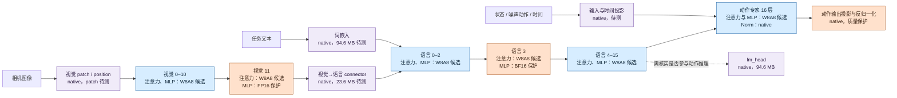

# SmolVLA → RK3588 混合精度候选图 v0（历史方案）

**状态：此图记录早期人工探索，已被“全模型 HAQ 强化学习搜索”路线取代。它不是当前搜索起点、不是精度约束，也不是可直接运行的 RKNN 全模型。** HAQ 将为每个可独立配置的模型算子/模块搜索硬件可行的精度；本图中的 W8A8、FP16、BF16 与 native 标注均不得锁定任何搜索位点。只有 RK3588 后端验证出的不可行组合可以从动作空间屏蔽。机器可读分组见 [`config/quantization_map_v0.json`](../config/quantization_map_v0.json)；对原始权重的完整覆盖审计见[实验记录](experiments/2026-09-27-quantization-map-audit.md)。

**历史说明**：图中风险标签及曾经的“保护层”来自早期人工探针，用于留档、对照自动搜索结果和解释误差；不得作为 HAQ agent 的先验、优先级或固定配置。

图中的 W8A8/FP16/BF16 **只描述目标计算格式**。视觉/语言/专家内部的 softmax、归一化、残差、cache、预处理和子图边界未指定 INT8；实际算子、激活 dtype、scale/zero point、CPU fallback 与搬运要由导出/编译报告逐一登记。`lm_head` 在 checkpoint 中占 94.6 MB，但是否参与动作推理、是否与词嵌入共享运行存储尚未核实，不能直接按 94.6 MB 计潜在节省，也不能未经功能验证就删除。三路相机映射和 processor 以 checkpoint 与现有 FP 基线实现为准。

## 历史分组与当时的人工判断

下列数字是 **原始 safetensors 张量载荷**，不是量化后文件字节、板端 RAM 或收益函数中的 $B/R$。具体 25 个分组、正则路径和逐组字节见[机器可读配置](../config/quantization_map_v0.json)及[审计数据](../figures/quantization_map_v0_inventory.json)。

| 路径 / 分组 | v0 格式 | 原始载荷 | 为什么这样起步；下一项验证 |
| --- | --- | ---: | --- |
| 视觉注意力 0–11 | W8A8 候选 | 56.7 MB | 输出舍入动作偏差较低；查真实 W8A8 与全动作尾部 |
| 视觉 MLP 0–10 | W8A8 候选 | 103.9 MB | 6–10 层排除 11 后动作偏差下降；0–5 层仅有组探针 |
| 视觉 MLP 11 | FP16 保护 | 9.4 MB | 激活舍入及 RKNN INT8 子图误差高；FP16 子图已编译，板端未跑 |
| 视觉 patch/position/Norm | native | 2.8 MB | patch 有尾部动作偏差；位置编码与 Norm 暂保留 |
| connector | native | 23.6 MB | 未做敏感度与 RKNN 导出；体积较大，优先补测 |
| 语言词嵌入 | native | 94.6 MB | 大块未验证；先查动作路径、存储和可行量化格式 |
| 语言注意力 0–15 | W8A8 候选 | 78.6 MB | 前段少数动作尾部偏差较大；需逐组验证 |
| 语言 MLP 0–2、4–15 | W8A8 候选 | 221.2 MB | 排除 3 后偏差下降；8–15 仍仅有组探针 |
| 语言 MLP 3 | BF16 保护 | 14.7 MB | 原加载 BF16，INT8 子图误差高；BF16 子图已编译，板端未跑 |
| 语言 Norm / lm_head | native | 94.7 MB | Norm 保浮点；先确认 lm_head 的动作路径参与情况 |
| 专家注意力 + MLP 0–15 | W8A8 候选 | 199.7 MB | 输出舍入探针支持先试，旧 W8 weight-only QAT 已退化，配方须重做 |
| 专家 Norm、状态/动作/时间投影 | native | 6.6 MB | 动作接口参数很少且直接作用于输出；时间路径仍未测试 |

原权重载荷共 **906,639,456 B / 500 个张量**，25 组逐张量恰好覆盖一次。v0 中标成 W8A8 **候选**的源权重载荷共 **660,138,496 B（72.8%）**；这仅用于安排验证的覆盖比例，不能解释成 72.8% 压缩率或 RK3588 NPU 覆盖率。模型文件自身为 906,712,520 B，差值包含 safetensors 头部。

## 当前路线

本页只保留早期人工分组图和覆盖审计，不能作为 HAQ 的动作空间、敏感度先验或最终位宽。完整模型全自由度搜索、质量优先门槛、收益函数和当前前置条件统一见[量化技术路线](quantization-technique-plan.md)。成本数据已更新为100项基础签名和18项补充测试，见[硬件表](hardware/README.md)；本页图和下方表格保留当时的65项成本测试背景。机器可读 v0 分组仍被早期 QAT/PTQ 复现实验引用，不应删除。

固定模型 `lerobot/smolvla_libero@31d453f7edd78c839a8bbc39744a292686daf0de`，权重 SHA-256 `9a9f6413e42c0f332fccbce9a0dc796af2790f82cf002f791cdbf7e01e1afca8`；数据分区 SHA-256 `f755546a6b074d2fe248333fc42c3dbf30f9b54b9f0fa0b58a16506a54d942c2`。视觉 11/语言 3 的证据见[逐层敏感度](experiments/2026-09-27-action-layer-selection.md)和[RKNN 子图](experiments/2026-09-27-rknn-sensitive-mlp-probe.md)；其他组见[非 MLP 诊断](experiments/2026-09-27-non-mlp-action-sensitivity.md)与[首轮 QAT/PTQ](experiments/2026-09-26-w8-pilot.md)。
